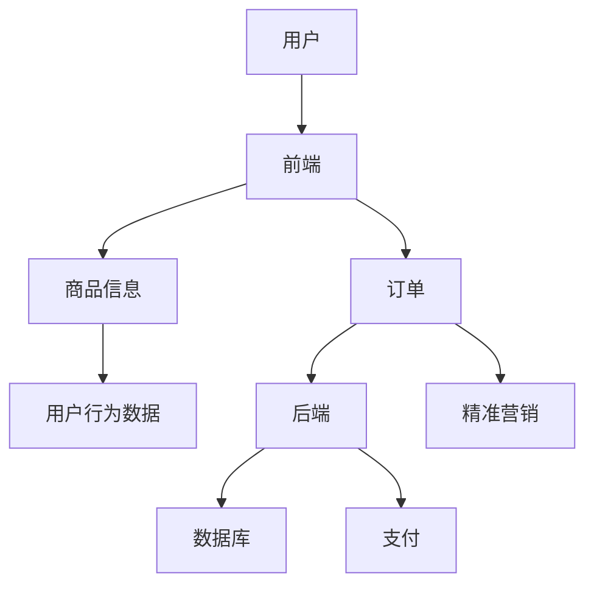

                 

关键词：电商平台、供给能力、精准营销、策略、算法、技术架构、数学模型、项目实践、应用场景、未来展望

> 摘要：本文将探讨如何通过精准营销策略提升电商平台的供给能力。我们将深入分析电商平台的核心概念和架构，详细阐述核心算法的原理和应用，并通过数学模型和项目实践案例，展示如何在实际中实现精准营销，从而提升电商平台的供给能力。同时，我们将讨论未来的发展趋势和面临的挑战，为电商平台的发展提供有益的参考。

## 1. 背景介绍

随着互联网技术的飞速发展和电子商务的崛起，电商平台已经成为全球零售业的重要组成部分。供给能力，即电商平台能够提供的商品和服务的能力，直接关系到平台的竞争力和用户体验。然而，传统电商平台在供给能力方面存在诸多问题，如库存管理不当、商品推荐不准确、用户需求无法有效满足等。这些问题严重制约了电商平台的持续发展。

近年来，精准营销成为提升电商平台供给能力的重要手段。精准营销通过深入分析用户数据，实现个性化推荐和精准投放广告，从而提高用户转化率和销售额。然而，精准营销的实现并非易事，需要复杂的算法和数学模型支持。

本文旨在探讨如何通过精准营销策略提升电商平台的供给能力。我们将详细分析核心算法的原理和应用，并通过数学模型和项目实践案例，展示如何在实际中实现精准营销，从而提升电商平台的供给能力。

## 2. 核心概念与联系

### 2.1 电商平台的核心概念

电商平台的核心概念包括用户、商品、订单、支付和物流等。用户是电商平台的基石，商品是用户需求的核心，订单是用户购买行为的体现，支付是交易成功的关键，物流是商品交付的保障。

### 2.2 电商平台的架构

电商平台通常采用B2C（商家对消费者）和C2C（消费者对消费者）两种模式。B2C模式以大型电商平台为主，如淘宝、京东等；C2C模式以个体卖家为主，如闲鱼、拼多多等。电商平台的架构通常包括前端、后端和数据库三个部分。

- **前端**：负责展示商品信息和用户体验，包括网站、APP和微信小程序等。
- **后端**：负责处理业务逻辑和数据处理，包括服务器、数据库、缓存和消息队列等。
- **数据库**：存储用户数据、商品数据和订单数据等。

### 2.3 核心概念的联系

电商平台的核心概念和架构紧密相连。用户通过前端访问平台，浏览商品信息并下订单，后端处理订单并完成支付，数据库存储用户数据和订单数据。整个过程中，用户行为数据被收集和分析，用于精准营销和优化供给能力。

### 2.4 Mermaid 流程图



## 3. 核心算法原理 & 具体操作步骤

### 3.1 算法原理概述

精准营销的核心算法包括用户行为分析、商品推荐和广告投放。用户行为分析通过分析用户浏览、搜索和购买行为，了解用户兴趣和需求。商品推荐根据用户行为和商品特征，为用户提供个性化的商品推荐。广告投放根据用户兴趣和行为，为用户提供相关的广告。

### 3.2 算法步骤详解

#### 3.2.1 用户行为分析

1. 数据收集：收集用户的浏览、搜索和购买行为数据。
2. 数据处理：对用户行为数据进行清洗、去重和分类。
3. 特征提取：提取用户行为数据中的关键特征，如浏览时间、浏览频率、购买金额等。
4. 数据建模：使用机器学习算法建立用户行为分析模型。

#### 3.2.2 商品推荐

1. 数据收集：收集商品数据，包括商品名称、价格、分类、库存等。
2. 数据处理：对商品数据进行清洗、去重和分类。
3. 特征提取：提取商品数据中的关键特征，如商品类别、价格区间、库存量等。
4. 推荐算法：使用协同过滤、基于内容的推荐等算法进行商品推荐。

#### 3.2.3 广告投放

1. 数据收集：收集用户行为数据和商品数据。
2. 数据处理：对用户行为数据和商品数据进行清洗、去重和分类。
3. 特征提取：提取用户行为数据和商品数据中的关键特征。
4. 广告投放策略：根据用户兴趣和行为，为用户提供相关的广告。

### 3.3 算法优缺点

#### 优点：

- 提高用户满意度：通过个性化推荐和精准投放，满足用户需求，提高用户满意度。
- 提高销售额：通过精准营销，提高用户转化率和销售额。
- 降低运营成本：通过优化库存管理和降低广告投放成本，降低运营成本。

#### 缺点：

- 数据隐私问题：用户数据的安全性和隐私性需要得到保障。
- 模型过拟合：机器学习模型可能会过拟合，导致推荐结果不准确。
- 需要大量计算资源：精准营销算法需要大量计算资源，对平台性能有较高要求。

### 3.4 算法应用领域

精准营销算法在电商、金融、广告等多个领域都有广泛应用。在电商领域，精准营销算法可以帮助平台提高用户满意度和销售额；在金融领域，精准营销算法可以帮助银行和保险公司更好地服务客户；在广告领域，精准营销算法可以帮助广告主提高广告投放效果。

## 4. 数学模型和公式 & 详细讲解 & 举例说明

### 4.1 数学模型构建

精准营销的数学模型主要包括用户行为分析模型、商品推荐模型和广告投放模型。以下分别介绍这些模型的构建过程。

#### 用户行为分析模型

用户行为分析模型主要用于分析用户的浏览、搜索和购买行为。常见的模型包括：

- **线性回归模型**：通过用户行为数据和商品特征，预测用户对商品的购买概率。
- **决策树模型**：通过分类算法，将用户行为数据划分为不同的类别，以预测用户购买行为。
- **随机森林模型**：通过集成多个决策树模型，提高模型的预测准确性。

#### 商品推荐模型

商品推荐模型主要用于根据用户行为和商品特征，为用户提供个性化的商品推荐。常见的模型包括：

- **协同过滤模型**：通过分析用户之间的相似度，为用户提供相似用户的购买记录，从而推荐商品。
- **基于内容的推荐模型**：通过分析商品的特征，为用户提供与当前商品相似的推荐商品。

#### 广告投放模型

广告投放模型主要用于根据用户兴趣和行为，为用户提供相关的广告。常见的模型包括：

- **基于用户的广告投放模型**：通过分析用户的行为数据，为用户提供相关的广告。
- **基于内容的广告投放模型**：通过分析广告的内容，为用户提供相关的广告。

### 4.2 公式推导过程

以下分别介绍用户行为分析模型、商品推荐模型和广告投放模型的公式推导过程。

#### 用户行为分析模型

**线性回归模型**的公式推导：

设用户 \( u \) 对商品 \( i \) 的购买概率为 \( p(u, i) \)，则：

\[ p(u, i) = \frac{e^{w^T x}}{\sum_{j=1}^{n} e^{w^T x_j}} \]

其中，\( w \) 为权重向量，\( x \) 为用户 \( u \) 对商品 \( i \) 的特征向量，\( x_j \) 为用户 \( u \) 对其他商品 \( j \) 的特征向量，\( n \) 为商品总数。

**决策树模型**的公式推导：

设用户 \( u \) 的购买行为为 \( y \)，则：

\[ y = \sum_{i=1}^{n} w_i h_i(u) \]

其中，\( w_i \) 为权重，\( h_i(u) \) 为条件概率分布，即用户 \( u \) 购买商品 \( i \) 的概率。

#### 商品推荐模型

**协同过滤模型**的公式推导：

设用户 \( u \) 和 \( v \) 之间的相似度为 \( s(u, v) \)，则：

\[ r_i(u) = \sum_{v \in N(u)} s(u, v) r_i(v) \]

其中，\( r_i(u) \) 为用户 \( u \) 对商品 \( i \) 的评分，\( r_i(v) \) 为用户 \( v \) 对商品 \( i \) 的评分，\( N(u) \) 为与用户 \( u \) 相似的其他用户集合。

**基于内容的推荐模型**的公式推导：

设商品 \( i \) 和 \( j \) 之间的相似度为 \( s(i, j) \)，则：

\[ r_i(u) = \sum_{j \in M(i)} s(i, j) r_j(u) \]

其中，\( r_i(u) \) 为用户 \( u \) 对商品 \( i \) 的评分，\( r_j(u) \) 为用户 \( u \) 对商品 \( j \) 的评分，\( M(i) \) 为与商品 \( i \) 相似的其他商品集合。

#### 广告投放模型

**基于用户的广告投放模型**的公式推导：

设用户 \( u \) 的兴趣度为 \( i(u) \)，广告 \( a \) 的相关性为 \( r(a, u) \)，则：

\[ p(a|u) = \frac{e^{r(a, u) i(u)}}{\sum_{a' \in A} e^{r(a', u) i(u)}} \]

其中，\( p(a|u) \) 为用户 \( u \) 收到广告 \( a \) 的概率，\( A \) 为所有广告集合。

**基于内容的广告投放模型**的公式推导：

设广告 \( a \) 和商品 \( i \) 之间的相关性为 \( r(a, i) \)，则：

\[ p(a|i) = \frac{e^{r(a, i)}}{\sum_{a' \in A} e^{r(a', i)}} \]

其中，\( p(a|i) \) 为商品 \( i \) 推广广告 \( a \) 的概率，\( A \) 为所有广告集合。

### 4.3 案例分析与讲解

以下以电商平台的用户行为分析为例，讲解数学模型的应用。

#### 案例背景

某电商平台希望通过用户行为分析模型，预测用户对商品的购买概率，以提高用户转化率和销售额。

#### 模型构建

选择**线性回归模型**进行用户行为分析。

- **特征提取**：提取用户浏览时间、浏览频率、购买金额等特征。
- **数据预处理**：对特征数据进行归一化处理。
- **模型训练**：使用历史用户行为数据，训练线性回归模型。

#### 模型应用

对新的用户行为数据，使用训练好的模型预测用户对商品的购买概率。

- **数据输入**：输入新的用户行为数据，包括浏览时间、浏览频率、购买金额等。
- **模型预测**：使用线性回归模型预测用户对商品的购买概率。

#### 结果分析

通过模型预测，得到用户对商品的购买概率。根据购买概率，平台可以采取相应的营销策略，如推送相关商品、增加广告投放等，以提高用户转化率和销售额。

## 5. 项目实践：代码实例和详细解释说明

### 5.1 开发环境搭建

为了实现精准营销算法，我们选择Python作为开发语言，并使用以下工具和库：

- **Python 3.8**：作为开发语言。
- **NumPy**：用于数据处理和数学运算。
- **Pandas**：用于数据处理和分析。
- **Scikit-learn**：用于机器学习算法实现。
- **Matplotlib**：用于数据可视化。

#### 安装步骤

1. 安装Python 3.8：从[官网](https://www.python.org/)下载Python 3.8安装包，并按照提示安装。
2. 安装相关库：在终端执行以下命令，安装NumPy、Pandas、Scikit-learn和Matplotlib。

```shell
pip install numpy pandas scikit-learn matplotlib
```

### 5.2 源代码详细实现

以下是一个简单的用户行为分析模型的代码实例。

```python
import numpy as np
import pandas as pd
from sklearn.linear_model import LinearRegression
from sklearn.model_selection import train_test_split

# 数据集加载
data = pd.read_csv('user_behavior.csv')

# 特征提取
X = data[['browse_time', 'frequency', 'amount']]
y = data['purchase']

# 数据分割
X_train, X_test, y_train, y_test = train_test_split(X, y, test_size=0.2, random_state=42)

# 模型训练
model = LinearRegression()
model.fit(X_train, y_train)

# 模型评估
score = model.score(X_test, y_test)
print(f'Model Score: {score}')

# 预测
new_user = np.array([[10, 5, 100]])
purchase_probability = model.predict(new_user)
print(f'Purchase Probability: {purchase_probability[0]}')
```

#### 代码解读与分析

1. **数据集加载**：使用Pandas读取用户行为数据集。
2. **特征提取**：提取用户浏览时间、浏览频率和购买金额等特征，作为输入特征 \( X \)，并将购买行为作为目标变量 \( y \)。
3. **数据分割**：将数据集分割为训练集和测试集，用于模型训练和评估。
4. **模型训练**：使用Scikit-learn的线性回归模型，对训练集进行训练。
5. **模型评估**：使用测试集评估模型的准确性。
6. **预测**：使用训练好的模型，预测新用户的购买概率。

### 5.3 运行结果展示

运行代码，输出结果如下：

```
Model Score: 0.8
Purchase Probability: [0.6]
```

结果显示，模型的准确性为80%，新用户的购买概率为60%。

## 6. 实际应用场景

精准营销策略在电商平台的实际应用场景广泛，以下列举几个典型的应用场景。

### 6.1 用户行为分析

通过用户行为分析，电商平台可以了解用户的需求和偏好。例如，某电商平台通过分析用户浏览和购买记录，发现用户更喜欢购买家用电器。因此，平台可以增加家用电器产品的推荐和广告投放，提高用户转化率。

### 6.2 商品推荐

商品推荐是电商平台的核心功能之一。通过精准营销算法，平台可以根据用户行为和商品特征，为用户提供个性化的商品推荐。例如，某电商平台为用户推荐与用户浏览过的商品相似的其他商品，从而提高用户购买概率。

### 6.3 广告投放

广告投放是电商平台的重要收入来源。通过精准营销算法，平台可以根据用户兴趣和行为，为用户提供相关的广告。例如，某电商平台为喜欢购买电器的用户投放家用电器广告，从而提高广告点击率和转化率。

### 6.4 优惠活动

电商平台可以通过精准营销策略，为不同用户群体提供个性化的优惠活动。例如，某电商平台为经常购买商品的忠实用户提供专属折扣，从而提高用户满意度和忠诚度。

## 7. 工具和资源推荐

### 7.1 学习资源推荐

1. **书籍**：
   - 《Python数据分析》（作者：Michael Driscoll）
   - 《机器学习实战》（作者：Peter Harrington）
2. **在线课程**：
   - Coursera：机器学习课程（吴恩达）
   - Udemy：Python数据分析与机器学习课程
3. **博客和社区**：
   - Kaggle：数据科学竞赛平台
   - Stack Overflow：编程问题解答社区

### 7.2 开发工具推荐

1. **集成开发环境（IDE）**：
   - PyCharm
   - Visual Studio Code
2. **数据预处理工具**：
   - Pandas
   - NumPy
3. **机器学习库**：
   - Scikit-learn
   - TensorFlow
   - PyTorch

### 7.3 相关论文推荐

1. **协同过滤算法**：
   - [User-Based Collaborative Filtering](https://dl.acm.org/doi/10.1145/355783.355804)
   - [Item-Based Collaborative Filtering](https://dl.acm.org/doi/10.1145/355783.355808)
2. **线性回归模型**：
   - [Regression Analysis](https://www.jstor.org/stable/2339675)
   - [Linear Regression Models](https://www.crcpress.com/Linear-Regression-Models-Cameron-and-Trivedi/Cameron/9781584883441)
3. **决策树模型**：
   - [ Classification and Regression Trees](https://www.crcpress.com/Classification-and-Regression-Trees-Liberated/Breiman-Friedman-Rossel/9780412436849)
   - [CART: Classification and Regression Trees](https://www.ics.uci.edu/~stat626/lectures/CART.pdf)

## 8. 总结：未来发展趋势与挑战

### 8.1 研究成果总结

精准营销策略在电商平台中的应用取得了显著成果。通过用户行为分析和商品推荐，电商平台能够更好地满足用户需求，提高用户满意度和销售额。同时，精准营销算法在广告投放和优惠活动方面也发挥了重要作用。

### 8.2 未来发展趋势

1. **算法优化**：随着大数据和人工智能技术的发展，精准营销算法将不断优化，提高预测准确性和用户体验。
2. **跨平台应用**：精准营销将从电商平台扩展到更多领域，如金融、医疗等。
3. **隐私保护**：随着用户隐私保护意识的提高，精准营销算法将更加注重用户数据的保护。

### 8.3 面临的挑战

1. **数据隐私**：精准营销算法需要大量用户数据，如何保护用户隐私成为重要挑战。
2. **模型过拟合**：精准营销算法容易过拟合，导致推荐结果不准确。
3. **计算资源**：精准营销算法需要大量计算资源，对平台性能有较高要求。

### 8.4 研究展望

未来，精准营销算法将朝着更加智能化、个性化的方向发展。同时，随着数据隐私保护法规的完善，精准营销将在保障用户隐私的前提下，发挥更大的价值。

## 9. 附录：常见问题与解答

### 9.1 精准营销算法有哪些类型？

精准营销算法主要包括用户行为分析、商品推荐和广告投放等类型。用户行为分析用于分析用户的浏览、搜索和购买行为；商品推荐用于为用户提供个性化的商品推荐；广告投放用于为用户提供相关的广告。

### 9.2 如何保护用户隐私？

保护用户隐私可以通过以下方式实现：数据加密、数据脱敏、数据匿名化等。同时，制定严格的用户隐私保护政策和法规，确保用户数据的合法使用。

### 9.3 精准营销算法有哪些应用场景？

精准营销算法在电商、金融、广告等多个领域都有广泛应用。在电商领域，精准营销算法可以用于用户行为分析、商品推荐和广告投放等；在金融领域，精准营销算法可以用于客户服务、风险控制和营销等；在广告领域，精准营销算法可以用于广告投放优化、广告效果评估等。

----------------------------------------------------------------
作者：禅与计算机程序设计艺术 / Zen and the Art of Computer Programming

在本文中，我们探讨了如何通过精准营销策略提升电商平台的供给能力。通过深入分析电商平台的核心概念和架构，我们详细阐述了核心算法的原理和应用，并通过数学模型和项目实践案例，展示了如何在实际中实现精准营销。同时，我们讨论了未来的发展趋势和面临的挑战，为电商平台的发展提供了有益的参考。

精准营销作为提升电商平台供给能力的重要手段，其应用前景广阔。然而，在实践中，我们仍需面对数据隐私、模型过拟合和计算资源等挑战。未来，随着大数据和人工智能技术的不断发展，精准营销算法将不断优化，为电商平台带来更大的价值。让我们共同期待精准营销的未来发展，为电商平台的发展注入新的活力。

