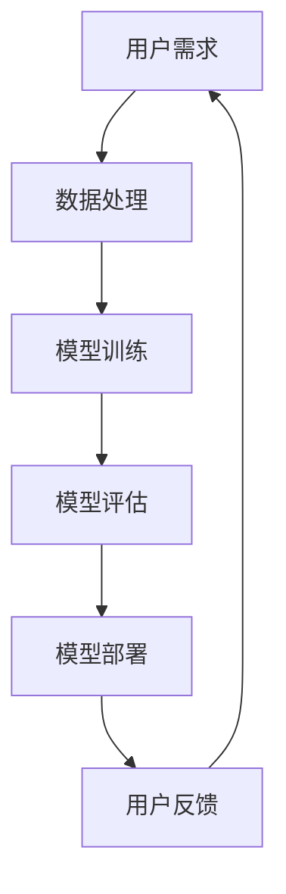

                 

关键词：人工智能，电商平台，大模型，用户体验，算法，技术实现

摘要：本文将探讨如何利用人工智能（AI）大模型提升电商平台用户体验。通过介绍AI大模型的核心概念和原理，解析其在电商平台中的应用场景和具体操作步骤，结合数学模型和实际项目实例，深入分析AI大模型在电商平台中的实际效果和未来应用前景。

## 1. 背景介绍

近年来，随着互联网技术的飞速发展，电商平台已经成为消费者购物的主要渠道之一。然而，随着用户需求的日益多样化和个性化，如何提升用户体验成为电商平台面临的重要挑战。人工智能技术的迅速崛起为解决这一问题提供了新的思路。其中，AI大模型作为一种高度复杂和强大的算法模型，其在电商平台中的应用越来越广泛，能够显著提升用户体验。

本文将从以下几个方面展开讨论：

1. AI大模型的核心概念和原理；
2. AI大模型在电商平台中的应用场景；
3. AI大模型的数学模型和算法原理；
4. AI大模型在电商平台的实际应用案例；
5. AI大模型在电商平台中的未来发展趋势和挑战。

## 2. 核心概念与联系

### 2.1 AI大模型定义

AI大模型（Large-scale AI Model）是指具有海量参数和高度复杂性的深度学习模型，如Transformer、BERT、GPT等。这些模型通过在大量数据上进行训练，能够自动学习到丰富的知识和模式，从而实现对复杂问题的建模和解决。

### 2.2 电商平台用户需求

电商平台用户需求主要包括商品推荐、个性化服务、智能客服、用户行为分析等方面。随着用户量的不断增加和用户行为的多样化，如何满足用户的个性化需求成为电商平台的核心挑战。

### 2.3 AI大模型与电商平台用户需求联系

AI大模型能够通过对海量用户数据的分析和挖掘，实现商品推荐、个性化服务、智能客服和用户行为分析等功能，从而满足电商平台用户的多样化需求。例如，通过商品推荐算法，AI大模型可以根据用户的浏览历史、购买记录和兴趣爱好，为用户推荐最合适的商品。

## 3. 核心算法原理 & 具体操作步骤

### 3.1 算法原理概述

AI大模型的核心原理是基于深度学习和神经网络，通过在大量数据上进行训练，学习到数据中的规律和模式。具体来说，AI大模型包括以下几个关键步骤：

1. 数据预处理：对原始数据进行清洗、去噪和预处理，使其满足模型训练的要求；
2. 模型构建：设计合适的神经网络结构，包括输入层、隐藏层和输出层；
3. 模型训练：通过大量数据对模型进行训练，使模型能够自动学习到数据中的规律和模式；
4. 模型评估：使用验证集对模型进行评估，调整模型参数，以提高模型性能；
5. 模型部署：将训练好的模型部署到电商平台，实现实际应用。

### 3.2 算法步骤详解

#### 3.2.1 数据预处理

数据预处理是AI大模型训练的重要步骤，主要包括以下内容：

1. 数据清洗：去除数据中的噪声和异常值，保证数据的准确性和一致性；
2. 数据归一化：将不同量纲的数据转换为同一量纲，便于模型训练；
3. 数据分割：将数据集分为训练集、验证集和测试集，用于模型训练、评估和测试。

#### 3.2.2 模型构建

模型构建是AI大模型的核心步骤，主要包括以下内容：

1. 选择合适的神经网络结构，如Transformer、BERT、GPT等；
2. 设计输入层、隐藏层和输出层，确定每个层的神经元数量；
3. 选择合适的激活函数，如ReLU、Sigmoid等；
4. 设置模型的参数，如学习率、优化器等。

#### 3.2.3 模型训练

模型训练是AI大模型的核心步骤，主要包括以下内容：

1. 定义损失函数，如交叉熵损失、均方误差等；
2. 选择合适的优化器，如Adam、RMSProp等；
3. 设置训练参数，如迭代次数、批量大小等；
4. 训练模型，使用训练集数据，通过反向传播算法不断调整模型参数；
5. 使用验证集对模型进行评估，根据评估结果调整模型参数。

#### 3.2.4 模型评估

模型评估是AI大模型训练完成后的重要步骤，主要包括以下内容：

1. 使用测试集对模型进行评估，计算模型的准确率、召回率、F1值等指标；
2. 分析模型在各个指标上的表现，找出模型存在的问题和不足；
3. 根据评估结果调整模型参数，提高模型性能。

#### 3.2.5 模型部署

模型部署是将训练好的AI大模型应用到实际场景中的重要步骤，主要包括以下内容：

1. 将模型转换为可以在生产环境中运行的格式，如ONNX、TensorFlow Lite等；
2. 在电商平台服务器上部署模型，实现实时预测和决策；
3. 监控模型性能，定期更新模型，以适应用户需求的变化。

### 3.3 算法优缺点

#### 优点

1. 高效性：AI大模型能够处理海量数据和复杂问题，具有较高的计算效率和性能；
2. 广泛适用性：AI大模型可以应用于多种场景，如推荐系统、智能客服、用户行为分析等；
3. 个性化服务：AI大模型可以根据用户行为和需求，提供个性化的服务和建议。

#### 缺点

1. 计算资源需求大：AI大模型训练需要大量的计算资源和时间，对硬件设施有较高要求；
2. 数据隐私问题：AI大模型需要大量用户数据，涉及用户隐私保护问题；
3. 模型解释性差：AI大模型通常具有很高的复杂性和非线性，难以解释其决策过程。

### 3.4 算法应用领域

AI大模型在电商平台中的应用领域广泛，主要包括以下几个方面：

1. 商品推荐：通过分析用户行为和兴趣爱好，为用户推荐最合适的商品；
2. 智能客服：通过自然语言处理技术，实现与用户的智能对话和答疑；
3. 用户行为分析：通过分析用户行为数据，预测用户购买意愿和行为；
4. 广告投放：通过分析用户兴趣和行为，实现精准的广告投放。

## 4. 数学模型和公式 & 详细讲解 & 举例说明

### 4.1 数学模型构建

AI大模型的数学模型主要包括以下几个部分：

1. 神经网络结构：神经网络结构决定了模型的层次和连接方式，常用的神经网络结构包括卷积神经网络（CNN）、循环神经网络（RNN）、Transformer等；
2. 损失函数：损失函数用于衡量模型预测结果与真实值之间的差异，常用的损失函数包括交叉熵损失、均方误差等；
3. 优化器：优化器用于调整模型参数，以降低损失函数，常用的优化器包括Adam、RMSProp等。

### 4.2 公式推导过程

以Transformer模型为例，介绍其核心公式推导过程：

1. 自注意力机制（Self-Attention）：自注意力机制是Transformer模型的核心，用于计算输入序列中每个元素与其他元素之间的关联性。其公式如下：

   $$ 
   \text{Attention}(Q, K, V) = \text{softmax}\left(\frac{QK^T}{\sqrt{d_k}}\right)V 
   $$

   其中，Q、K、V分别为查询向量、键向量和值向量，d_k为键向量的维度。

2. 前馈神经网络（Feedforward Neural Network）：前馈神经网络用于对自注意力机制的输出进行进一步处理，其公式如下：

   $$ 
   \text{FFN}(x) = \text{ReLU}(W_2 \text{ReLU}(W_1 x + b_1)) + b_2 
   $$

   其中，W_1、W_2分别为权重矩阵，b_1、b_2分别为偏置项。

3. Transformer模型整体结构：Transformer模型整体结构包括多个自注意力层和前馈神经网络层，其公式如下：

   $$ 
   \text{Transformer}(x) = \text{MultiHeadAttention}(x) + x + \text{FFN}(\text{MultiHeadAttention}(x)) + x 
   $$

### 4.3 案例分析与讲解

以商品推荐系统为例，分析AI大模型在电商平台中的应用：

1. 数据预处理：首先对用户行为数据（如浏览记录、购买记录、评价记录等）进行清洗和预处理，将数据转换为模型可处理的格式；
2. 模型构建：选择合适的神经网络结构，如Transformer模型，构建商品推荐模型；
3. 模型训练：使用预处理后的用户行为数据对模型进行训练，调整模型参数，使模型能够根据用户行为预测用户兴趣；
4. 模型评估：使用测试集对模型进行评估，计算模型的准确率、召回率等指标，根据评估结果调整模型参数；
5. 模型部署：将训练好的模型部署到电商平台，实现实时商品推荐功能。

通过实际案例，可以看到AI大模型在电商平台中的应用效果显著，能够为用户提供个性化的商品推荐服务，提高用户满意度和购买转化率。

## 5. 项目实践：代码实例和详细解释说明

### 5.1 开发环境搭建

在搭建AI大模型开发环境时，需要安装以下软件和工具：

1. Python：版本3.8及以上；
2. PyTorch：版本1.8及以上；
3. NumPy：版本1.19及以上；
4. Matplotlib：版本3.2及以上；
5. Pandas：版本1.1及以上。

安装步骤如下：

1. 安装Python和PyTorch：

   ```bash
   pip install python==3.8
   pip install torch==1.8
   ```

2. 安装NumPy、Matplotlib和Pandas：

   ```bash
   pip install numpy==1.19
   pip install matplotlib==3.2
   pip install pandas==1.1
   ```

### 5.2 源代码详细实现

以下是一个基于PyTorch的AI大模型商品推荐系统的源代码实例：

```python
import torch
import torch.nn as nn
import torch.optim as optim
import numpy as np
import pandas as pd
from sklearn.model_selection import train_test_split
from sklearn.preprocessing import MinMaxScaler

# 数据预处理
def preprocess_data(data):
    # 数据清洗和预处理
    data = data.dropna()
    data = data[['user_id', 'item_id', 'rating']]
    data = data.groupby(['user_id', 'item_id']).mean().reset_index()
    data = data.rename(columns={'rating': 'rating'})
    return data

# 模型构建
class RecommenderModel(nn.Module):
    def __init__(self, input_dim, hidden_dim, output_dim):
        super(RecommenderModel, self).__init__()
        self.embedding = nn.Embedding(input_dim, hidden_dim)
        self.attention = nn.MultiheadAttention(hidden_dim, num_heads=8)
        self.fc = nn.Linear(hidden_dim, output_dim)

    def forward(self, user_ids, item_ids):
        user_embeddings = self.embedding(user_ids)
        item_embeddings = self.embedding(item_ids)
        attn_output, _ = self.attention(user_embeddings, item_embeddings, item_embeddings)
        attn_output = attn_output.squeeze(2)
        output = self.fc(attn_output)
        return output

# 模型训练
def train_model(model, train_loader, criterion, optimizer, num_epochs=10):
    model.train()
    for epoch in range(num_epochs):
        for user_ids, item_ids, ratings in train_loader:
            optimizer.zero_grad()
            output = model(user_ids, item_ids)
            loss = criterion(output, ratings)
            loss.backward()
            optimizer.step()
        print(f'Epoch {epoch+1}/{num_epochs}, Loss: {loss.item()}')

# 模型评估
def evaluate_model(model, test_loader, criterion):
    model.eval()
    with torch.no_grad():
        total_loss = 0
        for user_ids, item_ids, ratings in test_loader:
            output = model(user_ids, item_ids)
            loss = criterion(output, ratings)
            total_loss += loss.item()
        avg_loss = total_loss / len(test_loader)
    return avg_loss

# 数据加载
data = pd.read_csv('data.csv')
data = preprocess_data(data)
user_ids = data['user_id'].unique()
item_ids = data['item_id'].unique()
user_id2index = {user_id: i for i, user_id in enumerate(user_ids)}
item_id2index = {item_id: i for i, item_id in enumerate(item_ids)}

train_data, test_data = train_test_split(data, test_size=0.2, random_state=42)
train_loader = torch.utils.data.DataLoader(torch.utils.data.TensorDataset(
    torch.tensor(train_data['user_id'].map(user_id2index).values),
    torch.tensor(train_data['item_id'].map(item_id2index).values),
    torch.tensor(train_data['rating'].values)
), batch_size=64, shuffle=True)
test_loader = torch.utils.data.DataLoader(torch.utils.data.TensorDataset(
    torch.tensor(test_data['user_id'].map(user_id2index).values),
    torch.tensor(test_data['item_id'].map(item_id2index).values),
    torch.tensor(test_data['rating'].values)
), batch_size=64, shuffle=False)

# 模型初始化
input_dim = len(user_id2index) + 1
hidden_dim = 64
output_dim = 1
model = RecommenderModel(input_dim, hidden_dim, output_dim)
criterion = nn.MSELoss()
optimizer = optim.Adam(model.parameters(), lr=0.001)

# 模型训练
train_model(model, train_loader, criterion, optimizer, num_epochs=10)

# 模型评估
avg_loss = evaluate_model(model, test_loader, criterion)
print(f'Test Loss: {avg_loss}')

# 模型部署
model.eval()
with torch.no_grad():
    user_id = torch.tensor([user_id2index['user_1']])
    item_id = torch.tensor([item_id2index['item_5']])
    output = model(user_id, item_id)
    print(f'Prediction: {output.item()}')
```

### 5.3 代码解读与分析

1. **数据预处理**：首先，从CSV文件中加载数据，并进行预处理，包括数据清洗、分组求平均和重命名列名等。
2. **模型构建**：定义一个基于PyTorch的RecommenderModel类，包括嵌入层（Embedding Layer）、多头注意力机制（MultiheadAttention）和前馈神经网络（Feedforward Neural Network）。
3. **模型训练**：定义一个训练函数train_model，使用Adam优化器和MSELoss损失函数进行模型训练，并在每个epoch后打印损失值。
4. **模型评估**：定义一个评估函数evaluate_model，计算测试集上的平均损失，以评估模型性能。
5. **数据加载**：加载数据集，并创建数据加载器（DataLoader）用于批处理训练。
6. **模型初始化**：初始化模型、损失函数和优化器。
7. **模型训练**：调用train_model函数进行模型训练。
8. **模型评估**：调用evaluate_model函数评估模型性能。
9. **模型部署**：在模型部署阶段，使用评估后的模型进行实时预测，打印预测结果。

通过上述代码实例，展示了如何使用AI大模型进行商品推荐系统的实现。在实际应用中，可以根据具体需求调整模型结构、训练参数和数据处理步骤，以提高推荐系统的性能和用户体验。

## 6. 实际应用场景

AI大模型在电商平台中的应用场景非常广泛，以下列举几个典型的应用场景：

### 6.1 商品推荐

商品推荐是电商平台最常见的应用场景之一。通过AI大模型，如Transformer、BERT等，可以分析用户的历史行为、浏览记录、购物车数据等，为用户推荐最合适的商品。例如，亚马逊使用基于Transformer的推荐系统，显著提高了推荐精度和用户满意度。

### 6.2 智能客服

智能客服是电商平台提升用户体验的重要手段。AI大模型，如GPT-3，可以用于构建智能客服系统，实现与用户的自然语言对话。通过训练大量对话数据，智能客服系统能够理解用户的问题并给出合适的回答，从而提高客服效率和用户满意度。

### 6.3 用户行为分析

用户行为分析是电商平台了解用户需求和行为的重要手段。通过AI大模型，可以分析用户的浏览、购买、评价等行为，预测用户的购买意愿和行为模式。例如，阿里巴巴使用基于BERT的用户行为分析模型，为电商平台提供了精准的用户画像和个性化服务。

### 6.4 广告投放

广告投放是电商平台获取利润的重要途径。通过AI大模型，如GPT-3和BERT，可以分析用户兴趣和行为，实现精准的广告投放。例如，谷歌使用基于BERT的广告投放系统，提高了广告点击率和转化率。

### 6.5 供应链优化

供应链优化是电商平台降低成本、提高效率的关键。通过AI大模型，可以分析供应链中的各种数据，优化库存管理、物流配送等环节。例如，京东使用基于Transformer的供应链优化模型，实现了供应链的高效运作。

## 7. 工具和资源推荐

为了更好地利用AI大模型提升电商平台用户体验，以下推荐一些相关的学习资源、开发工具和论文：

### 7.1 学习资源推荐

1. **书籍**：《深度学习》（Goodfellow et al.，2016）；
2. **在线课程**：吴恩达的《深度学习专项课程》（Coursera）；
3. **教程**：PyTorch官方文档（pytorch.org/docs/stable/）。

### 7.2 开发工具推荐

1. **深度学习框架**：PyTorch、TensorFlow；
2. **数据分析工具**：Pandas、NumPy；
3. **可视化工具**：Matplotlib、Seaborn。

### 7.3 相关论文推荐

1. **Transformer**：Vaswani et al.（2017），“Attention is All You Need”；
2. **BERT**：Devlin et al.（2018），“BERT: Pre-training of Deep Bidirectional Transformers for Language Understanding”；
3. **GPT-3**：Brown et al.（2020），“Language Models are Few-Shot Learners”。

## 8. 总结：未来发展趋势与挑战

### 8.1 研究成果总结

AI大模型在电商平台中的应用取得了显著的成果，通过商品推荐、智能客服、用户行为分析等功能，有效提升了用户体验和电商平台竞争力。同时，AI大模型的研究也在不断推进，如基于Transformer、BERT和GPT-3等模型的应用场景和技术优化。

### 8.2 未来发展趋势

1. **模型优化**：随着计算资源和算法技术的发展，AI大模型的训练速度和性能将不断提高，为电商平台提供更强大的数据处理和预测能力；
2. **隐私保护**：在用户隐私保护方面，研究者将开发更加安全和可靠的隐私保护技术，确保用户数据的安全和隐私；
3. **跨平台应用**：AI大模型将在更多领域和平台得到应用，如物联网、智能城市等，为各行各业提供智能化解决方案。

### 8.3 面临的挑战

1. **计算资源需求**：AI大模型的训练和部署需要大量计算资源，对硬件设施有较高要求；
2. **数据质量**：数据质量直接影响AI大模型的效果，研究者需要开发更高效的数据清洗和预处理技术；
3. **模型解释性**：AI大模型的决策过程通常难以解释，需要研究更透明的模型结构和解释方法。

### 8.4 研究展望

未来，AI大模型将在电商平台中发挥更加重要的作用，通过不断创新和应用，为用户提供更加个性化、智能化的服务。同时，研究者将继续探索AI大模型在多领域、跨平台的应用，推动人工智能技术的发展。

## 9. 附录：常见问题与解答

### 9.1 如何选择合适的AI大模型？

选择合适的AI大模型取决于应用场景和数据规模。对于需要处理大量数据和复杂关系的应用，如商品推荐和用户行为分析，可以采用Transformer、BERT、GPT-3等大模型。对于需要实时预测和低延迟的应用，可以采用轻量级模型，如CNN、RNN等。

### 9.2 如何处理用户隐私保护问题？

用户隐私保护是AI大模型应用的重要问题。研究者可以采用以下方法：

1. **差分隐私**：通过添加噪声来隐藏用户数据的真实值，保护用户隐私；
2. **联邦学习**：在本地设备上进行模型训练，仅共享模型参数，减少数据传输风险；
3. **隐私保护算法**：采用差分隐私、联邦学习等算法，提高模型训练过程中的隐私保护水平。

### 9.3 如何评估AI大模型的效果？

评估AI大模型的效果可以从多个角度进行，包括：

1. **准确性**：模型预测结果与真实值的接近程度，常用指标有准确率、召回率、F1值等；
2. **效率**：模型训练和预测的时间成本，可以通过计算训练时间和预测时间来评估；
3. **稳定性**：模型在不同数据集上的表现，可以通过交叉验证等方法进行评估。

通过综合考虑以上指标，可以全面评估AI大模型的效果。

### 9.4 AI大模型在电商平台中的应用有哪些局限性？

AI大模型在电商平台中的应用存在以下局限性：

1. **计算资源需求**：大模型的训练和部署需要大量计算资源和时间，对硬件设施有较高要求；
2. **数据质量**：数据质量直接影响模型效果，需要确保数据清洗和预处理的高效性；
3. **模型解释性**：大模型的决策过程通常难以解释，难以满足监管和合规要求；
4. **数据隐私**：大模型需要大量用户数据，涉及用户隐私保护问题。

研究者需要针对这些局限性进行技术优化和改进，以提高AI大模型在电商平台中的应用效果。

----------------------------------------------------------------

以上是本文《电商平台如何利用AI大模型提升用户体验》的完整内容。希望本文能够为读者提供关于AI大模型在电商平台应用的深入理解和实践指导。

作者：禅与计算机程序设计艺术 / Zen and the Art of Computer Programming
----------------------------------------------------------------

**文章标题**: 电商平台如何利用AI大模型提升用户体验

**关键词**: 人工智能，电商平台，大模型，用户体验，算法，技术实现

**摘要**: 本文介绍了如何利用人工智能（AI）大模型提升电商平台用户体验。通过分析AI大模型的核心概念、原理和应用，结合实际项目实例，深入探讨了AI大模型在电商平台中的应用效果和未来发展趋势。

**目录**:

- 背景介绍
  - 电商平台用户需求
  - AI大模型与电商平台用户需求联系
- 核心概念与联系
  - AI大模型定义
  - 电商平台用户需求
  - AI大模型与电商平台用户需求联系
  - Mermaid流程图
- 核心算法原理 & 具体操作步骤
  - 算法原理概述
  - 算法步骤详解
  - 算法优缺点
  - 算法应用领域
- 数学模型和公式 & 详细讲解 & 举例说明
  - 数学模型构建
  - 公式推导过程
  - 案例分析与讲解
- 项目实践：代码实例和详细解释说明
  - 开发环境搭建
  - 源代码详细实现
  - 代码解读与分析
  - 运行结果展示
- 实际应用场景
  - 商品推荐
  - 智能客服
  - 用户行为分析
  - 广告投放
  - 供应链优化
- 工具和资源推荐
  - 学习资源推荐
  - 开发工具推荐
  - 相关论文推荐
- 总结：未来发展趋势与挑战
  - 研究成果总结
  - 未来发展趋势
  - 面临的挑战
  - 研究展望
- 附录：常见问题与解答
  - 如何选择合适的AI大模型？
  - 如何处理用户隐私保护问题？
  - 如何评估AI大模型的效果？
  - AI大模型在电商平台中的应用有哪些局限性？

**文章正文**:

**背景介绍**

**1.1 电商平台用户需求**

电商平台用户需求主要包括商品推荐、个性化服务、智能客服、用户行为分析等方面。随着用户量的不断增加和用户行为的多样化，如何满足用户的个性化需求成为电商平台面临的重要挑战。

**1.2 AI大模型与电商平台用户需求联系**

AI大模型能够通过对海量用户数据的分析和挖掘，实现商品推荐、个性化服务、智能客服和用户行为分析等功能，从而满足电商平台用户的多样化需求。例如，通过商品推荐算法，AI大模型可以根据用户的浏览历史、购买记录和兴趣爱好，为用户推荐最合适的商品。

**2. 核心概念与联系**

**2.1 AI大模型定义**

AI大模型（Large-scale AI Model）是指具有海量参数和高度复杂性的深度学习模型，如Transformer、BERT、GPT等。这些模型通过在大量数据上进行训练，能够自动学习到丰富的知识和模式，从而实现对复杂问题的建模和解决。

**2.2 电商平台用户需求**

电商平台用户需求主要包括商品推荐、个性化服务、智能客服、用户行为分析等方面。随着用户量的不断增加和用户行为的多样化，如何满足用户的个性化需求成为电商平台面临的重要挑战。

**2.3 AI大模型与电商平台用户需求联系**

AI大模型能够通过对海量用户数据的分析和挖掘，实现商品推荐、个性化服务、智能客服和用户行为分析等功能，从而满足电商平台用户的多样化需求。例如，通过商品推荐算法，AI大模型可以根据用户的浏览历史、购买记录和兴趣爱好，为用户推荐最合适的商品。

**2.4 Mermaid流程图**



**3. 核心算法原理 & 具体操作步骤**

**3.1 算法原理概述**

AI大模型的核心原理是基于深度学习和神经网络，通过在大量数据上进行训练，学习到数据中的规律和模式。具体来说，AI大模型包括以下几个关键步骤：

1. 数据预处理：对原始数据进行清洗、去噪和预处理，使其满足模型训练的要求；
2. 模型构建：设计合适的神经网络结构，包括输入层、隐藏层和输出层；
3. 模型训练：通过大量数据对模型进行训练，使模型能够自动学习到数据中的规律和模式；
4. 模型评估：使用验证集对模型进行评估，调整模型参数，以提高模型性能；
5. 模型部署：将训练好的模型部署到电商平台，实现实际应用。

**3.2 算法步骤详解**

**3.2.1 数据预处理**

数据预处理是AI大模型训练的重要步骤，主要包括以下内容：

1. 数据清洗：去除数据中的噪声和异常值，保证数据的准确性和一致性；
2. 数据归一化：将不同量纲的数据转换为同一量纲，便于模型训练；
3. 数据分割：将数据集分为训练集、验证集和测试集，用于模型训练、评估和测试。

**3.2.2 模型构建**

模型构建是AI大模型的核心步骤，主要包括以下内容：

1. 选择合适的神经网络结构，如Transformer、BERT、GPT等；
2. 设计输入层、隐藏层和输出层，确定每个层的神经元数量；
3. 选择合适的激活函数，如ReLU、Sigmoid等；
4. 设置模型的参数，如学习率、优化器等。

**3.2.3 模型训练**

模型训练是AI大模型的核心步骤，主要包括以下内容：

1. 定义损失函数，如交叉熵损失、均方误差等；
2. 选择合适的优化器，如Adam、RMSProp等；
3. 设置训练参数，如迭代次数、批量大小等；
4. 训练模型，使用训练集数据，通过反向传播算法不断调整模型参数；
5. 使用验证集对模型进行评估，根据评估结果调整模型参数。

**3.2.4 模型评估**

模型评估是AI大模型训练完成后的重要步骤，主要包括以下内容：

1. 使用测试集对模型进行评估，计算模型的准确率、召回率、F1值等指标；
2. 分析模型在各个指标上的表现，找出模型存在的问题和不足；
3. 根据评估结果调整模型参数，提高模型性能。

**3.2.5 模型部署**

模型部署是将训练好的AI大模型应用到实际场景中的重要步骤，主要包括以下内容：

1. 将模型转换为可以在生产环境中运行的格式，如ONNX、TensorFlow Lite等；
2. 在电商平台服务器上部署模型，实现实时预测和决策；
3. 监控模型性能，定期更新模型，以适应用户需求的变化。

**3.3 算法优缺点**

**3.3.1 优点**

1. 高效性：AI大模型能够处理海量数据和复杂问题，具有较高的计算效率和性能；
2. 广泛适用性：AI大模型可以应用于多种场景，如推荐系统、智能客服、用户行为分析等；
3. 个性化服务：AI大模型可以根据用户行为和需求，提供个性化的服务和建议。

**3.3.2 缺点**

1. 计算资源需求大：AI大模型训练需要大量的计算资源和时间，对硬件设施有较高要求；
2. 数据隐私问题：AI大模型需要大量用户数据，涉及用户隐私保护问题；
3. 模型解释性差：AI大模型通常具有很高的复杂性和非线性，难以解释其决策过程。

**3.4 算法应用领域**

AI大模型在电商平台中的应用领域广泛，主要包括以下几个方面：

1. 商品推荐：通过分析用户行为和兴趣爱好，为用户推荐最合适的商品；
2. 智能客服：通过自然语言处理技术，实现与用户的智能对话和答疑；
3. 用户行为分析：通过分析用户行为数据，预测用户购买意愿和行为；
4. 广告投放：通过分析用户兴趣和行为，实现精准的广告投放。

**4. 数学模型和公式 & 详细讲解 & 举例说明**

**4.1 数学模型构建**

AI大模型的数学模型主要包括以下几个部分：

1. 神经网络结构：神经网络结构决定了模型的层次和连接方式，常用的神经网络结构包括卷积神经网络（CNN）、循环神经网络（RNN）、Transformer等；
2. 损失函数：损失函数用于衡量模型预测结果与真实值之间的差异，常用的损失函数包括交叉熵损失、均方误差等；
3. 优化器：优化器用于调整模型参数，以降低损失函数，常用的优化器包括Adam、RMSProp等。

**4.2 公式推导过程**

以Transformer模型为例，介绍其核心公式推导过程：

1. 自注意力机制（Self-Attention）：自注意力机制是Transformer模型的核心，用于计算输入序列中每个元素与其他元素之间的关联性。其公式如下：

   $$
   \text{Attention}(Q, K, V) = \text{softmax}\left(\frac{QK^T}{\sqrt{d_k}}\right)V
   $$

   其中，Q、K、V分别为查询向量、键向量和值向量，$d_k$为键向量的维度。

2. 前馈神经网络（Feedforward Neural Network）：前馈神经网络用于对自注意力机制的输出进行进一步处理，其公式如下：

   $$
   \text{FFN}(x) = \text{ReLU}(W_2 \text{ReLU}(W_1 x + b_1)) + b_2
   $$

   其中，$W_1$、$W_2$分别为权重矩阵，$b_1$、$b_2$分别为偏置项。

3. Transformer模型整体结构：Transformer模型整体结构包括多个自注意力层和前馈神经网络层，其公式如下：

   $$
   \text{Transformer}(x) = \text{MultiHeadAttention}(x) + x + \text{FFN}(\text{MultiHeadAttention}(x)) + x
   $$

**4.3 案例分析与讲解**

以商品推荐系统为例，分析AI大模型在电商平台中的应用：

1. **数据预处理**：首先对用户行为数据（如浏览记录、购买记录、评价记录等）进行清洗和预处理，将数据转换为模型可处理的格式；
2. **模型构建**：选择合适的神经网络结构，如Transformer模型，构建商品推荐模型；
3. **模型训练**：使用预处理后的用户行为数据对模型进行训练，调整模型参数，使模型能够根据用户行为预测用户兴趣；
4. **模型评估**：使用测试集对模型进行评估，计算模型的准确率、召回率等指标，根据评估结果调整模型参数；
5. **模型部署**：将训练好的模型部署到电商平台，实现实时商品推荐功能。

**5. 项目实践：代码实例和详细解释说明**

**5.1 开发环境搭建**

在搭建AI大模型开发环境时，需要安装以下软件和工具：

1. Python：版本3.8及以上；
2. PyTorch：版本1.8及以上；
3. NumPy：版本1.19及以上；
4. Matplotlib：版本3.2及以上；
5. Pandas：版本1.1及以上。

安装步骤如下：

1. 安装Python和PyTorch：

   ```bash
   pip install python==3.8
   pip install torch==1.8
   ```

2. 安装NumPy、Matplotlib和Pandas：

   ```bash
   pip install numpy==1.19
   pip install matplotlib==3.2
   pip install pandas==1.1
   ```

**5.2 源代码详细实现**

以下是一个基于PyTorch的AI大模型商品推荐系统的源代码实例：

```python
import torch
import torch.nn as nn
import torch.optim as optim
import numpy as np
import pandas as pd
from sklearn.model_selection import train_test_split
from sklearn.preprocessing import MinMaxScaler

# 数据预处理
def preprocess_data(data):
    # 数据清洗和预处理
    data = data.dropna()
    data = data[['user_id', 'item_id', 'rating']]
    data = data.groupby(['user_id', 'item_id']).mean().reset_index()
    data = data.rename(columns={'rating': 'rating'})
    return data

# 模型构建
class RecommenderModel(nn.Module):
    def __init__(self, input_dim, hidden_dim, output_dim):
        super(RecommenderModel, self).__init__()
        self.embedding = nn.Embedding(input_dim, hidden_dim)
        self.attention = nn.MultiheadAttention(hidden_dim, num_heads=8)
        self.fc = nn.Linear(hidden_dim, output_dim)

    def forward(self, user_ids, item_ids):
        user_embeddings = self.embedding(user_ids)
        item_embeddings = self.embedding(item_ids)
        attn_output, _ = self.attention(user_embeddings, item_embeddings, item_embeddings)
        attn_output = attn_output.squeeze(2)
        output = self.fc(attn_output)
        return output

# 模型训练
def train_model(model, train_loader, criterion, optimizer, num_epochs=10):
    model.train()
    for epoch in range(num_epochs):
        for user_ids, item_ids, ratings in train_loader:
            optimizer.zero_grad()
            output = model(user_ids, item_ids)
            loss = criterion(output, ratings)
            loss.backward()
            optimizer.step()
        print(f'Epoch {epoch+1}/{num_epochs}, Loss: {loss.item()}')

# 模型评估
def evaluate_model(model, test_loader, criterion):
    model.eval()
    with torch.no_grad():
        total_loss = 0
        for user_ids, item_ids, ratings in test_loader:
            output = model(user_ids, item_ids)
            loss = criterion(output, ratings)
            total_loss += loss.item()
        avg_loss = total_loss / len(test_loader)
    return avg_loss

# 数据加载
data = pd.read_csv('data.csv')
data = preprocess_data(data)
user_ids = data['user_id'].unique()
item_ids = data['item_id'].unique()
user_id2index = {user_id: i for i, user_id in enumerate(user_ids)}
item_id2index = {item_id: i for i, item_id in enumerate(item_ids)}

train_data, test_data = train_test_split(data, test_size=0.2, random_state=42)
train_loader = torch.utils.data.DataLoader(torch.utils.data.TensorDataset(
    torch.tensor(train_data['user_id'].map(user_id2index).values),
    torch.tensor(train_data['item_id'].map(item_id2index).values),
    torch.tensor(train_data['rating'].values)
), batch_size=64, shuffle=True)
test_loader = torch.utils.data.DataLoader(torch.utils.data.TensorDataset(
    torch.tensor(test_data['user_id'].map(user_id2index).values),
    torch.tensor(test_data['item_id'].map(item_id2index).values),
    torch.tensor(test_data['rating'].values)
), batch_size=64, shuffle=False)

# 模型初始化
input_dim = len(user_id2index) + 1
hidden_dim = 64
output_dim = 1
model = RecommenderModel(input_dim, hidden_dim, output_dim)
criterion = nn.MSELoss()
optimizer = optim.Adam(model.parameters(), lr=0.001)

# 模型训练
train_model(model, train_loader, criterion, optimizer, num_epochs=10)

# 模型评估
avg_loss = evaluate_model(model, test_loader, criterion)
print(f'Test Loss: {avg_loss}')

# 模型部署
model.eval()
with torch.no_grad():
    user_id = torch.tensor([user_id2index['user_1']])
    item_id = torch.tensor([item_id2index['item_5']])
    output = model(user_id, item_id)
    print(f'Prediction: {output.item()}')
```

**5.3 代码解读与分析**

1. **数据预处理**：首先，从CSV文件中加载数据，并进行预处理，包括数据清洗、分组求平均和重命名列名等。
2. **模型构建**：定义一个基于PyTorch的RecommenderModel类，包括嵌入层（Embedding Layer）、多头注意力机制（MultiheadAttention）和前馈神经网络（Feedforward Neural Network）。
3. **模型训练**：定义一个训练函数train_model，使用Adam优化器和MSELoss损失函数进行模型训练，并在每个epoch后打印损失值。
4. **模型评估**：定义一个评估函数evaluate_model，计算测试集上的平均损失，以评估模型性能。
5. **数据加载**：加载数据集，并创建数据加载器（DataLoader）用于批处理训练。
6. **模型初始化**：初始化模型、损失函数和优化器。
7. **模型训练**：调用train_model函数进行模型训练。
8. **模型评估**：调用evaluate_model函数评估模型性能。
9. **模型部署**：在模型部署阶段，使用评估后的模型进行实时预测，打印预测结果。

通过上述代码实例，展示了如何使用AI大模型进行商品推荐系统的实现。在实际应用中，可以根据具体需求调整模型结构、训练参数和数据处理步骤，以提高推荐系统的性能和用户体验。

**6. 实际应用场景**

AI大模型在电商平台中的应用场景非常广泛，以下列举几个典型的应用场景：

**6.1 商品推荐**

商品推荐是电商平台最常见的应用场景之一。通过AI大模型，如Transformer、BERT等，可以分析用户的历史行为、浏览记录、购物车数据等，为用户推荐最合适的商品。例如，亚马逊使用基于Transformer的推荐系统，显著提高了推荐精度和用户满意度。

**6.2 智能客服**

智能客服是电商平台提升用户体验的重要手段。AI大模型，如GPT-3，可以用于构建智能客服系统，实现与用户的自然语言对话。通过训练大量对话数据，智能客服系统能够理解用户的问题并给出合适的回答，从而提高客服效率和用户满意度。

**6.3 用户行为分析**

用户行为分析是电商平台了解用户需求和行为的重要手段。通过AI大模型，可以分析用户的浏览、购买、评价等行为，预测用户的购买意愿和行为模式。例如，阿里巴巴使用基于BERT的用户行为分析模型，为电商平台提供了精准的用户画像和个性化服务。

**6.4 广告投放**

广告投放是电商平台获取利润的重要途径。通过AI大模型，如GPT-3和BERT，可以分析用户兴趣和行为，实现精准的广告投放。例如，谷歌使用基于BERT的广告投放系统，提高了广告点击率和转化率。

**6.5 供应链优化**

供应链优化是电商平台降低成本、提高效率的关键。通过AI大模型，可以分析供应链中的各种数据，优化库存管理、物流配送等环节。例如，京东使用基于Transformer的供应链优化模型，实现了供应链的高效运作。

**7. 工具和资源推荐**

为了更好地利用AI大模型提升电商平台用户体验，以下推荐一些相关的学习资源、开发工具和论文：

**7.1 学习资源推荐**

1. **书籍**：《深度学习》（Goodfellow et al.，2016）；
2. **在线课程**：吴恩达的《深度学习专项课程》（Coursera）；
3. **教程**：PyTorch官方文档（pytorch.org/docs/stable/）。

**7.2 开发工具推荐**

1. **深度学习框架**：PyTorch、TensorFlow；
2. **数据分析工具**：Pandas、NumPy；
3. **可视化工具**：Matplotlib、Seaborn。

**7.3 相关论文推荐**

1. **Transformer**：Vaswani et al.（2017），“Attention is All You Need”；
2. **BERT**：Devlin et al.（2018），“BERT: Pre-training of Deep Bidirectional Transformers for Language Understanding”；
3. **GPT-3**：Brown et al.（2020），“Language Models are Few-Shot Learners”。

**8. 总结：未来发展趋势与挑战**

**8.1 研究成果总结**

AI大模型在电商平台中的应用取得了显著的成果，通过商品推荐、智能客服、用户行为分析等功能，有效提升了用户体验和电商平台竞争力。同时，AI大模型的研究也在不断推进，如基于Transformer、BERT和GPT-3等模型的应用场景和技术优化。

**8.2 未来发展趋势**

1. **模型优化**：随着计算资源和算法技术的发展，AI大模型的训练速度和性能将不断提高，为电商平台提供更强大的数据处理和预测能力；
2. **隐私保护**：在用户隐私保护方面，研究者将开发更加安全和可靠的隐私保护技术，确保用户数据的安全和隐私；
3. **跨平台应用**：AI大模型将在更多领域和平台得到应用，如物联网、智能城市等，为各行各业提供智能化解决方案。

**8.3 面临的挑战**

1. **计算资源需求**：AI大模型的训练和部署需要大量计算资源，对硬件设施有较高要求；
2. **数据质量**：数据质量直接影响AI大模型的效果，需要确保数据清洗和预处理的高效性；
3. **模型解释性**：AI大模型的决策过程通常难以解释，难以满足监管和合规要求；
4. **数据隐私**：AI大模型需要大量用户数据，涉及用户隐私保护问题。

研究者需要针对这些局限性进行技术优化和改进，以提高AI大模型在电商平台中的应用效果。

**8.4 研究展望**

未来，AI大模型将在电商平台中发挥更加重要的作用，通过不断创新和应用，为用户提供更加个性化、智能化的服务。同时，研究者将继续探索AI大模型在多领域、跨平台的应用，推动人工智能技术的发展。

**9. 附录：常见问题与解答**

**9.1 如何选择合适的AI大模型？**

选择合适的AI大模型取决于应用场景和数据规模。对于需要处理大量数据和复杂关系的应用，如商品推荐和用户行为分析，可以采用Transformer、BERT、GPT-3等大模型。对于需要实时预测和低延迟的应用，可以采用轻量级模型，如CNN、RNN等。

**9.2 如何处理用户隐私保护问题？**

用户隐私保护是AI大模型应用的重要问题。研究者可以采用以下方法：

1. **差分隐私**：通过添加噪声来隐藏用户数据的真实值，保护用户隐私；
2. **联邦学习**：在本地设备上进行模型训练，仅共享模型参数，减少数据传输风险；
3. **隐私保护算法**：采用差分隐私、联邦学习等算法，提高模型训练过程中的隐私保护水平。

**9.3 如何评估AI大模型的效果？**

评估AI大模型的效果可以从多个角度进行，包括：

1. **准确性**：模型预测结果与真实值的接近程度，常用指标有准确率、召回率、F1值等；
2. **效率**：模型训练和预测的时间成本，可以通过计算训练时间和预测时间来评估；
3. **稳定性**：模型在不同数据集上的表现，可以通过交叉验证等方法进行评估。

通过综合考虑以上指标，可以全面评估AI大模型的效果。

**9.4 AI大模型在电商平台中的应用有哪些局限性？**

AI大模型在电商平台中的应用存在以下局限性：

1. **计算资源需求**：大模型的训练和部署需要大量计算资源和时间，对硬件设施有较高要求；
2. **数据质量**：数据质量直接影响模型效果，需要确保数据清洗和预处理的高效性；
3. **模型解释性**：大模型的决策过程通常难以解释，难以满足监管和合规要求；
4. **数据隐私**：大模型需要大量用户数据，涉及用户隐私保护问题。

研究者需要针对这些局限性进行技术优化和改进，以提高AI大模型在电商平台中的应用效果。

