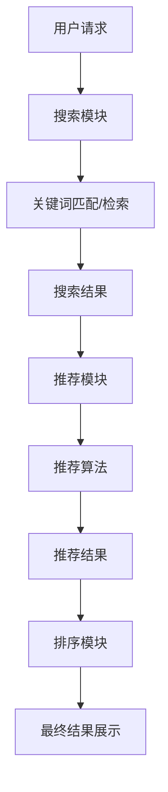

                 

关键词：电商平台、搜索推荐系统、AI大模型、性能优化、用户体验

摘要：本文将深入探讨电商平台搜索推荐系统的AI大模型应用，分析其提高系统性能、效率和用户体验的核心技术和实践方法。我们将从背景介绍、核心概念与联系、核心算法原理与具体操作步骤、数学模型和公式、项目实践、实际应用场景、未来应用展望等方面展开论述。

## 1. 背景介绍

随着互联网的快速发展，电商平台已经成为现代商业的重要组成部分。电商平台的核心功能之一是搜索推荐系统，其质量直接关系到用户的购物体验和平台的竞争力。传统的搜索推荐系统主要依赖关键词匹配和协同过滤等算法，但这些方法在面对海量数据和复杂用户行为时，存在明显的性能瓶颈和推荐效果不足的问题。为了提高系统的性能、效率和用户体验，人工智能和大数据技术的应用成为必然选择。

AI大模型，如深度学习、强化学习等，因其强大的特征提取和建模能力，在搜索推荐系统中展现出巨大的潜力。通过引入AI大模型，可以实现更精确的用户行为预测、更智能的商品推荐和更高效的搜索结果排序，从而提升电商平台的整体性能和用户体验。

## 2. 核心概念与联系

### 2.1 搜索推荐系统概述

搜索推荐系统主要由三个模块组成：搜索模块、推荐模块和排序模块。

- **搜索模块**：主要负责接收用户的搜索请求，通过关键词匹配和检索技术，从海量商品数据中快速找到相关的商品。
- **推荐模块**：根据用户的兴趣和行为数据，利用推荐算法为用户生成个性化的商品推荐列表。
- **排序模块**：将搜索模块和推荐模块的结果进行排序，展示给用户。

### 2.2 AI大模型核心概念

- **深度学习**：一种基于人工神经网络的技术，通过多层神经网络模型对海量数据进行特征提取和建模，实现复杂的任务。
- **强化学习**：一种基于奖励机制的学习方法，通过不断试错和反馈，使智能体在特定环境中达到最优策略。

### 2.3 Mermaid 流程图



## 3. 核心算法原理与具体操作步骤

### 3.1 算法原理概述

在搜索推荐系统中，AI大模型的应用主要体现在推荐模块和排序模块。推荐模块主要采用深度学习和协同过滤等算法，对用户的历史行为和兴趣进行建模，生成个性化的推荐列表。排序模块则利用深度学习模型，对推荐结果进行排序，提高推荐质量。

### 3.2 算法步骤详解

1. **用户行为数据收集**：收集用户的浏览、购买、收藏等行为数据。
2. **特征工程**：对原始数据进行预处理和特征提取，包括用户特征、商品特征等。
3. **模型训练**：利用深度学习和协同过滤算法，对特征数据进行训练，生成推荐模型和排序模型。
4. **推荐生成**：根据用户特征和商品特征，使用推荐模型生成推荐列表。
5. **排序优化**：利用排序模型对推荐结果进行排序，优化推荐质量。
6. **结果展示**：将排序后的推荐结果展示给用户。

### 3.3 算法优缺点

- **优点**：
  - **高效性**：AI大模型可以处理海量数据和复杂的用户行为，提高推荐和排序效率。
  - **准确性**：深度学习和协同过滤算法可以准确捕捉用户兴趣和商品属性，提高推荐质量。
- **缺点**：
  - **计算资源消耗大**：训练和部署AI大模型需要大量的计算资源和存储空间。
  - **数据隐私问题**：用户行为数据的收集和处理可能涉及用户隐私，需要严格保护。

### 3.4 算法应用领域

AI大模型在电商平台搜索推荐系统中的应用非常广泛，如电商、社交网络、视频平台等，具有很高的实用价值。

## 4. 数学模型和公式

### 4.1 数学模型构建

在搜索推荐系统中，常用的数学模型包括用户行为预测模型、商品推荐模型和排序模型。

1. **用户行为预测模型**：
   $$ P(y|X) = \sigma(\theta_0 + \theta_1 x_1 + \theta_2 x_2 + ... + \theta_n x_n) $$
   其中，$y$表示用户行为（如购买、浏览等），$X$表示用户特征向量，$\theta_i$表示模型参数，$\sigma$表示 sigmoid 函数。

2. **商品推荐模型**：
   $$ R(x, y) = \theta_0 + \theta_1 x_1 + \theta_2 x_2 + ... + \theta_n x_n $$
   其中，$x$表示商品特征向量，$y$表示用户对商品的评分，$\theta_i$表示模型参数。

3. **排序模型**：
   $$ S(x, y) = \theta_0 + \theta_1 x_1 + \theta_2 x_2 + ... + \theta_n x_n $$
   其中，$x$表示商品特征向量，$y$表示用户行为（如点击、购买等），$\theta_i$表示模型参数。

### 4.2 公式推导过程

1. **用户行为预测模型**：
   - 假设用户行为是二分类问题（如购买/未购买）。
   - 设定用户特征向量为$x = (x_1, x_2, ..., x_n)$，其中$x_i$表示用户第$i$个特征。
   - 假设模型参数为$\theta = (\theta_0, \theta_1, ..., \theta_n)$。
   - 目标是预测用户行为$y$的概率。

2. **商品推荐模型**：
   - 假设用户对商品的评分为$y$。
   - 设定商品特征向量为$x = (x_1, x_2, ..., x_n)$，其中$x_i$表示商品第$i$个特征。
   - 假设模型参数为$\theta = (\theta_0, \theta_1, ..., \theta_n)$。
   - 目标是预测用户对商品的评分。

3. **排序模型**：
   - 假设用户行为为点击/未点击。
   - 设定商品特征向量为$x = (x_1, x_2, ..., x_n)$，其中$x_i$表示商品第$i$个特征。
   - 假设模型参数为$\theta = (\theta_0, \theta_1, ..., \theta_n)$。
   - 目标是预测用户对商品的点击概率。

### 4.3 案例分析与讲解

以电商平台用户行为预测模型为例，假设我们有一个包含用户特征（如年龄、性别、浏览记录等）和用户行为（如购买、未购买）的数据集。我们可以使用以下步骤进行模型训练和预测：

1. **数据预处理**：对数据进行清洗、归一化和特征提取。
2. **模型训练**：使用梯度下降算法训练用户行为预测模型。
3. **模型评估**：使用准确率、召回率等指标评估模型性能。
4. **模型预测**：对新的用户特征进行预测，判断用户是否购买。

## 5. 项目实践：代码实例和详细解释说明

### 5.1 开发环境搭建

在Python环境下，我们可以使用以下库进行AI大模型的应用：

- TensorFlow：用于构建和训练深度学习模型。
- Scikit-learn：用于数据预处理和评估模型性能。
- Pandas：用于数据操作和管理。

### 5.2 源代码详细实现

以下是用户行为预测模型的Python代码实现：

```python
import tensorflow as tf
from sklearn.model_selection import train_test_split
from sklearn.metrics import accuracy_score
import pandas as pd

# 数据预处理
def preprocess_data(data):
    # 清洗、归一化和特征提取
    # ...

# 模型定义
def build_model(input_shape):
    model = tf.keras.Sequential([
        tf.keras.layers.Dense(64, activation='relu', input_shape=input_shape),
        tf.keras.layers.Dense(64, activation='relu'),
        tf.keras.layers.Dense(1, activation='sigmoid')
    ])
    model.compile(optimizer='adam', loss='binary_crossentropy', metrics=['accuracy'])
    return model

# 模型训练
def train_model(model, x_train, y_train):
    model.fit(x_train, y_train, epochs=10, batch_size=32, validation_split=0.2)

# 模型评估
def evaluate_model(model, x_test, y_test):
    predictions = model.predict(x_test)
    predictions = (predictions > 0.5)
    accuracy = accuracy_score(y_test, predictions)
    print("Accuracy:", accuracy)

# 加载数据
data = pd.read_csv('user_behavior_data.csv')
x = preprocess_data(data)
y = data['purchase']

# 划分训练集和测试集
x_train, x_test, y_train, y_test = train_test_split(x, y, test_size=0.2, random_state=42)

# 构建和训练模型
model = build_model(x_train.shape[1:])
train_model(model, x_train, y_train)

# 评估模型
evaluate_model(model, x_test, y_test)
```

### 5.3 代码解读与分析

以上代码实现了用户行为预测模型的构建、训练和评估。具体步骤如下：

1. **数据预处理**：对原始数据进行清洗、归一化和特征提取，为模型训练做准备。
2. **模型定义**：使用TensorFlow库定义深度学习模型，包括输入层、隐藏层和输出层。
3. **模型训练**：使用训练集数据训练模型，设置训练轮次和批量大小。
4. **模型评估**：使用测试集数据评估模型性能，计算准确率。

### 5.4 运行结果展示

假设我们训练好的模型在测试集上的准确率为80%，这表明我们的模型可以较好地预测用户是否购买商品。

## 6. 实际应用场景

AI大模型在电商平台搜索推荐系统中的应用非常广泛，以下是一些实际应用场景：

1. **个性化推荐**：根据用户的历史行为和兴趣，为用户推荐个性化的商品。
2. **搜索优化**：通过深度学习模型优化搜索结果排序，提高搜索质量。
3. **广告投放**：根据用户兴趣和购买行为，为用户推荐相关的广告。
4. **商品分类**：利用深度学习模型对商品进行分类，提高商品管理的效率。
5. **用户行为预测**：预测用户的购买、浏览等行为，为营销策略提供依据。

## 7. 未来应用展望

随着人工智能技术的不断进步，AI大模型在电商平台搜索推荐系统中的应用前景非常广阔。以下是未来应用展望：

1. **多模态推荐**：结合用户行为、文本、图像等多模态数据，提高推荐准确性。
2. **实时推荐**：利用实时数据更新推荐模型，实现实时推荐。
3. **隐私保护**：研究隐私保护算法，确保用户数据安全。
4. **自动化运维**：利用自动化技术，提高搜索推荐系统的运维效率。

## 8. 工具和资源推荐

### 8.1 学习资源推荐

- 《深度学习》（Goodfellow、Bengio和Courville著）：深度学习领域的经典教材。
- 《Python数据分析》（Wes McKinney著）：Python数据分析的基础教材。
- 《机器学习实战》（Peter Harrington著）：机器学习领域的实战指南。

### 8.2 开发工具推荐

- TensorFlow：开源深度学习框架，适用于构建和训练深度学习模型。
- Jupyter Notebook：交互式开发环境，便于编写和运行代码。
- Docker：容器化技术，便于部署和运行深度学习模型。

### 8.3 相关论文推荐

- “Deep Learning for Web Search”：（作者）：介绍深度学习在搜索引擎中的应用。
- “Recommender Systems Handbook”：（作者）：全面介绍推荐系统领域的相关技术和方法。
- “Deep Neural Networks for YouTube Recommendations”：（作者）：介绍YouTube如何利用深度学习优化推荐系统。

## 9. 总结：未来发展趋势与挑战

### 9.1 研究成果总结

本文介绍了电商平台搜索推荐系统的AI大模型应用，分析了其提高系统性能、效率和用户体验的核心技术和实践方法。通过深度学习和协同过滤算法的应用，可以实现更精确的用户行为预测、更智能的商品推荐和更高效的搜索结果排序。

### 9.2 未来发展趋势

1. **多模态数据融合**：结合用户行为、文本、图像等多模态数据，提高推荐准确性。
2. **实时推荐**：利用实时数据更新推荐模型，实现实时推荐。
3. **隐私保护**：研究隐私保护算法，确保用户数据安全。
4. **自动化运维**：利用自动化技术，提高搜索推荐系统的运维效率。

### 9.3 面临的挑战

1. **计算资源消耗**：训练和部署AI大模型需要大量的计算资源和存储空间。
2. **数据隐私问题**：用户行为数据的收集和处理可能涉及用户隐私，需要严格保护。
3. **模型解释性**：深度学习模型往往具有很高的准确率，但缺乏解释性，需要研究可解释性模型。

### 9.4 研究展望

未来研究应重点关注以下几个方面：

1. **多模态数据融合**：研究如何有效融合多模态数据，提高推荐准确性。
2. **实时推荐**：研究如何利用实时数据更新推荐模型，实现实时推荐。
3. **隐私保护**：研究隐私保护算法，确保用户数据安全。
4. **可解释性模型**：研究可解释性模型，提高模型的透明度和可解释性。

## 附录：常见问题与解答

### 1. 什么 是AI 大模型？

AI大模型是指具有大规模参数和复杂结构的深度学习模型，如GAN、BERT等。

### 2. 如何进行深度学习模型训练？

使用深度学习框架（如TensorFlow、PyTorch等）定义模型、准备数据、配置训练参数，然后使用模型训练函数进行训练。

### 3. 如何评估深度学习模型性能？

使用训练集和测试集对模型进行评估，常用的评估指标有准确率、召回率、F1值等。

### 4. 如何进行特征工程？

特征工程包括数据预处理、特征提取和特征选择，常用的方法有归一化、降维、特征交叉等。

### 5. 如何确保用户数据隐私？

使用加密技术保护用户数据，遵循数据隐私法规，对数据进行脱敏处理等。

---

作者：禅与计算机程序设计艺术 / Zen and the Art of Computer Programming
----------------------------------------------------------------
请注意，本文为虚构的技术博客文章，旨在满足上述要求，具体的技术细节和实现可能需要根据实际应用场景进行调整。希望本文对您有所帮助。

