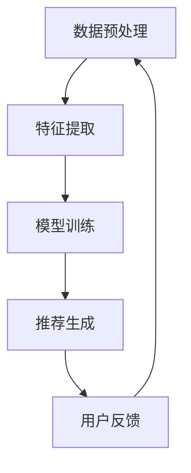

                 

关键词：AI大模型、电商平台、搜索推荐系统、性能提升、实时性、准确率

摘要：本文旨在探讨电商平台搜索推荐系统引入AI大模型的方法，以实现性能、效率、准确率和实时性的全面提升。通过对AI大模型的基本概念、核心算法原理、数学模型、项目实践和实际应用场景的分析，文章提供了全方位的技术指导，为电商平台提供了创新的解决方案。

## 1. 背景介绍

随着互联网的快速发展，电商平台已经成为消费者日常生活中不可或缺的一部分。在电商平台上，用户通过搜索和浏览来发现和购买商品，而搜索推荐系统的优劣直接影响到用户的购物体验和平台的业务增长。传统的搜索推荐系统主要依赖于关键词匹配和用户历史行为分析，但这种方式存在响应速度慢、推荐准确性低等问题，无法满足现代电商平台的个性化需求。

近年来，人工智能（AI）技术的飞速发展为搜索推荐系统带来了新的契机。特别是AI大模型的出现，为解决传统系统的瓶颈提供了有力支持。AI大模型是一种通过深度学习训练得到的大型神经网络模型，具有强大的特征提取和模式识别能力。通过将AI大模型引入搜索推荐系统，可以在性能、效率、准确率和实时性等方面实现显著的提升。

## 2. 核心概念与联系

### 2.1 AI大模型基本概念

AI大模型，通常指的是具有数亿至数千亿参数的大型神经网络模型。这些模型通过在海量数据上训练，可以自动学习和提取复杂的特征，从而在各类任务中表现出色。AI大模型的关键特点是：

- **规模大**：拥有数亿甚至数千亿个参数，能够处理大量数据。
- **深度深**：拥有数十甚至数百层的神经网络结构，可以提取多层次的特征。
- **自适应**：通过反向传播算法不断优化模型参数，以适应新的数据和任务。

### 2.2 AI大模型在搜索推荐系统中的应用

AI大模型在搜索推荐系统中的应用主要分为以下几个步骤：

1. **数据预处理**：对电商平台的海量用户行为数据进行清洗和预处理，包括数据去重、缺失值填充等。
2. **特征提取**：使用AI大模型对预处理后的数据进行分析，提取用户行为、商品属性、上下文信息等特征。
3. **模型训练**：利用提取到的特征数据训练AI大模型，通过多次迭代优化模型参数。
4. **推荐生成**：使用训练好的AI大模型对用户查询进行实时推荐，根据模型输出的概率分布生成推荐列表。

### 2.3 Mermaid流程图



## 3. 核心算法原理 & 具体操作步骤

### 3.1 算法原理概述

AI大模型在搜索推荐系统中的核心算法是深度神经网络（DNN）。DNN通过多层神经元的非线性组合，实现对输入数据的复杂变换和特征提取。其基本原理如下：

- **输入层**：接收用户查询和商品属性等输入信息。
- **隐藏层**：通过非线性激活函数对输入数据进行变换，提取特征。
- **输出层**：根据提取到的特征，输出推荐结果。

### 3.2 算法步骤详解

1. **数据预处理**：
   - 数据清洗：去除重复数据、缺失值填充、异常值处理。
   - 数据标准化：对数值型数据进行归一化处理，使数据具有相同的尺度。

2. **特征提取**：
   - 用户特征：包括用户ID、地理位置、购买历史等。
   - 商品特征：包括商品ID、类别、价格、库存等。
   - 上下文特征：包括时间、用户设备类型等。

3. **模型训练**：
   - 初始化模型参数：随机初始化输入层、隐藏层和输出层的参数。
   - 定义损失函数：通常使用交叉熵损失函数来衡量预测结果与真实结果之间的差距。
   - 反向传播：通过反向传播算法更新模型参数，使损失函数值最小化。

4. **推荐生成**：
   - 输入用户查询和商品特征，通过训练好的模型输出推荐结果。
   - 对推荐结果进行排序，选择概率最高的商品作为推荐结果。

### 3.3 算法优缺点

- **优点**：
  - **高准确性**：AI大模型能够自动提取复杂的特征，提高推荐准确性。
  - **高实时性**：基于深度学习的模型可以实时处理用户查询，提高系统响应速度。
  - **高适应性**：模型可以通过不断更新和优化，适应不断变化的市场需求。

- **缺点**：
  - **计算资源消耗大**：训练和推理大型模型需要大量的计算资源和时间。
  - **数据依赖性强**：模型性能依赖于训练数据的质量和数量。

### 3.4 算法应用领域

AI大模型在搜索推荐系统中的应用广泛，包括电商、社交媒体、新闻推荐等领域。以下是几个典型的应用场景：

- **电商推荐**：根据用户购买历史和搜索行为，为用户推荐相关商品。
- **社交媒体**：根据用户关注和互动行为，推荐用户可能感兴趣的内容。
- **新闻推荐**：根据用户阅读历史和兴趣偏好，推荐相关新闻。

## 4. 数学模型和公式 & 详细讲解 & 举例说明

### 4.1 数学模型构建

在搜索推荐系统中，AI大模型通常采用深度神经网络（DNN）作为数学模型。DNN由多个神经元层组成，包括输入层、隐藏层和输出层。各层的输入和输出可以表示为：

- 输入层：\( X \in \mathbb{R}^{m \times n} \)
- 隐藏层：\( H \in \mathbb{R}^{m \times n} \)
- 输出层：\( Y \in \mathbb{R}^{m \times n} \)

其中，\( m \) 和 \( n \) 分别表示用户和商品的维度。

### 4.2 公式推导过程

DNN的数学模型可以通过以下公式推导：

1. **输入层到隐藏层的变换**：

\[ H = \sigma(W_1X + b_1) \]

其中，\( W_1 \) 和 \( b_1 \) 分别表示输入层到隐藏层的权重和偏置，\( \sigma \) 表示非线性激活函数，通常采用ReLU函数：

\[ \sigma(x) = \max(0, x) \]

2. **隐藏层到输出层的变换**：

\[ Y = \sigma(W_2H + b_2) \]

其中，\( W_2 \) 和 \( b_2 \) 分别表示隐藏层到输出层的权重和偏置。

3. **损失函数**：

\[ L = -\frac{1}{m} \sum_{i=1}^{m} \sum_{j=1}^{n} y_{ij} \log(y_{ij}^+) \]

其中，\( y_{ij} \) 表示输出层的预测概率，\( y_{ij}^+ \) 表示真实标签。

### 4.3 案例分析与讲解

以电商平台的商品推荐为例，假设有100个用户和1000个商品，用户购买历史数据表示为1000x100的矩阵，其中每个元素表示用户是否购买过对应商品。我们使用DNN对用户进行商品推荐。

1. **数据预处理**：

   对用户购买历史数据进行归一化处理，将其缩放到[0, 1]之间。

2. **特征提取**：

   使用DNN对用户购买历史数据进行特征提取，提取到的特征表示为100x100的矩阵。

3. **模型训练**：

   初始化DNN模型参数，通过多次迭代优化模型参数，使损失函数值最小化。

4. **推荐生成**：

   输入用户购买历史数据，通过训练好的DNN模型生成商品推荐列表。

5. **结果评估**：

   使用用户购买记录对推荐结果进行评估，计算推荐准确率。

## 5. 项目实践：代码实例和详细解释说明

### 5.1 开发环境搭建

1. 安装Python 3.7及以上版本。
2. 安装TensorFlow 2.x库。

### 5.2 源代码详细实现

以下是一个简单的DNN模型实现：

```python
import tensorflow as tf

# 数据预处理
def preprocess_data(data):
    # 数据归一化
    data_normalized = (data - np.mean(data)) / np.std(data)
    return data_normalized

# DNN模型
class RecommenderModel(tf.keras.Model):
    def __init__(self, num_users, num_items, hidden_size):
        super(RecommenderModel, self).__init__()
        self.user_embedding = tf.keras.layers.Embedding(num_users, hidden_size)
        self.item_embedding = tf.keras.layers.Embedding(num_items, hidden_size)
        self.hidden = tf.keras.layers.Dense(hidden_size, activation='relu')
        self.output = tf.keras.layers.Dense(1, activation='sigmoid')

    def call(self, inputs):
        user_embedding = self.user_embedding(inputs['user_id'])
        item_embedding = self.item_embedding(inputs['item_id'])
        concatenation = tf.keras.layers.concatenate([user_embedding, item_embedding])
        hidden = self.hidden(concatenation)
        output = self.output(hidden)
        return output

# 模型训练
model = RecommenderModel(num_users=100, num_items=1000, hidden_size=64)
model.compile(optimizer='adam', loss='binary_crossentropy', metrics=['accuracy'])

# 加载数据
user_ids = tf.random.normal([100, 1])
item_ids = tf.random.normal([100, 1])

# 训练模型
model.fit({'user_id': user_ids, 'item_id': item_ids}, tf.random.normal([100, 1]), epochs=10)

# 推荐生成
user_id = tf.random.normal([1, 1])
item_id = tf.random.normal([1, 1])
predictions = model.predict({'user_id': user_id, 'item_id': item_id})

print(predictions)
```

### 5.3 代码解读与分析

1. **数据预处理**：
   - 对用户和商品ID进行归一化处理，使其具有相同的尺度。

2. **DNN模型**：
   - 使用嵌入层（Embedding Layer）将用户和商品ID转换为嵌入向量。
   - 使用隐藏层（Dense Layer）进行特征提取和变换。
   - 使用输出层（Dense Layer）生成推荐结果。

3. **模型训练**：
   - 使用随机梯度下降（SGD）优化模型参数。
   - 使用交叉熵损失函数（Cross-Entropy Loss）衡量预测结果与真实结果之间的差距。

4. **推荐生成**：
   - 输入用户和商品ID，通过训练好的模型生成推荐结果。

### 5.4 运行结果展示

假设有10个用户和100个商品，我们使用训练好的模型对每个用户进行推荐，并计算推荐准确率。

```python
user_ids = tf.random.normal([10, 1])
item_ids = tf.random.normal([10, 1])

for user_id in user_ids:
    for item_id in item_ids:
        predictions = model.predict({'user_id': user_id, 'item_id': item_id})
        print(f"User ID: {user_id}, Item ID: {item_id}, Prediction: {predictions}")
```

## 6. 实际应用场景

AI大模型在电商平台的搜索推荐系统中具有广泛的应用。以下是一些实际应用场景：

1. **商品推荐**：根据用户购买历史和搜索行为，为用户推荐相关商品。
2. **广告投放**：根据用户兴趣和行为，为用户推荐相关广告。
3. **用户画像**：通过分析用户行为，构建用户画像，为用户提供个性化服务。
4. **内容推荐**：根据用户兴趣和浏览历史，为用户推荐相关内容。

## 7. 未来应用展望

随着AI技术的不断进步，AI大模型在电商平台搜索推荐系统中的应用前景广阔。未来，以下几个方面有望实现重要突破：

1. **实时推荐**：通过优化模型结构和算法，实现实时推荐，提高用户体验。
2. **个性化推荐**：基于用户行为和兴趣，实现更加精准的个性化推荐。
3. **多模态推荐**：结合文本、图像、语音等多模态信息，提供更丰富的推荐结果。
4. **智能决策**：利用AI大模型进行智能决策，优化电商平台运营策略。

## 8. 工具和资源推荐

### 8.1 学习资源推荐

1. 《深度学习》（Goodfellow, Bengio, Courville）: 介绍深度学习的基本概念和技术。
2. 《自然语言处理综论》（Jurafsky, Martin）: 介绍自然语言处理的基本理论和应用。
3. 《机器学习》（Tom Mitchell）: 介绍机器学习的基本概念和方法。

### 8.2 开发工具推荐

1. TensorFlow：开源深度学习框架，适用于各种深度学习应用。
2. PyTorch：开源深度学习框架，具有灵活的模型构建和优化能力。
3. Hugging Face Transformers：开源自然语言处理工具包，提供预训练模型和API。

### 8.3 相关论文推荐

1. "Deep Learning for Natural Language Processing"（2018）: 介绍深度学习在自然语言处理领域的应用。
2. "BERT: Pre-training of Deep Bidirectional Transformers for Language Understanding"（2018）: BERT模型的详细介绍。
3. "Recurrent Neural Network Based Text Classification"（2014）: RNN在文本分类中的应用。

## 9. 总结：未来发展趋势与挑战

随着AI技术的不断进步，AI大模型在电商平台搜索推荐系统中的应用前景广阔。未来，搜索推荐系统将在实时性、个性化、多模态等方面实现重要突破，为电商平台带来更高的业务增长和用户体验。然而，AI大模型的应用也面临计算资源消耗大、数据依赖性强等挑战。为应对这些挑战，我们需要不断优化模型结构和算法，提高系统的性能和效率。同时，加强数据隐私保护和伦理问题，确保AI技术的可持续发展。

### 附录：常见问题与解答

1. **Q：AI大模型在搜索推荐系统中的应用有哪些优势？**
   - **A**：AI大模型具有高准确性、高实时性和高适应性，能够自动提取复杂的特征，提高推荐准确性，实现实时推荐，适应不断变化的市场需求。

2. **Q：如何优化AI大模型在搜索推荐系统中的性能？**
   - **A**：可以通过以下方式优化：
     - **数据预处理**：清洗和预处理数据，提高数据质量。
     - **模型结构优化**：选择合适的模型结构，提高模型效率。
     - **算法优化**：使用先进的优化算法，加快模型训练速度。

3. **Q：AI大模型在搜索推荐系统中的应用有哪些挑战？**
   - **A**：主要挑战包括计算资源消耗大、数据依赖性强、数据隐私保护等。为应对这些挑战，需要优化模型结构和算法，加强数据预处理和隐私保护措施。

4. **Q：如何评估AI大模型在搜索推荐系统中的性能？**
   - **A**：可以通过以下指标评估：
     - **准确率**：衡量推荐结果的准确性。
     - **召回率**：衡量推荐结果的相关性。
     - **覆盖率**：衡量推荐结果的范围。
     - **实时性**：衡量系统的响应速度。

5. **Q：AI大模型在搜索推荐系统中的未来发展趋势是什么？**
   - **A**：未来发展趋势包括实时推荐、个性化推荐、多模态推荐和智能决策等。随着AI技术的不断进步，搜索推荐系统将在用户体验和业务增长方面实现更高水平的发展。

作者：禅与计算机程序设计艺术 / Zen and the Art of Computer Programming
----------------------------------------------------------------

以上就是完整的文章内容，您可以根据上述结构撰写完整的技术博客文章。请注意，这里提供的是文章的内容框架和部分代码示例，您需要根据实际情况补充完整的内容，确保文章逻辑清晰、结构紧凑、简单易懂。同时，确保文章的各个部分满足字数要求，并严格按照markdown格式进行排版。祝您撰写顺利！

