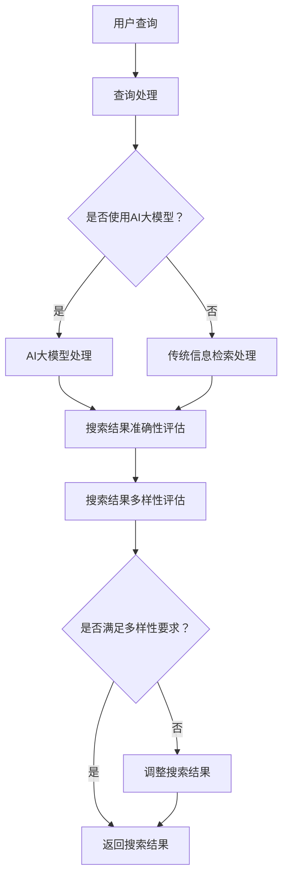

                 

关键词：电商平台、搜索结果多样性、AI大模型、优化策略

> 摘要：本文旨在探讨电商平台搜索结果多样性的优化方法，尤其是在引入AI大模型的情况下，如何平衡搜索结果的准确性与多样性。通过分析核心概念、算法原理、数学模型、项目实践等多个方面，为电商平台提供了一套完整的优化策略，以提升用户体验和搜索满意度。

## 1. 背景介绍

随着互联网的迅速发展和电子商务的蓬勃发展，电商平台已经成为人们日常购物的重要渠道。电商平台的核心竞争力之一在于其搜索功能，它直接影响到用户能否快速找到所需商品。然而，随着商品种类的急剧增加，如何优化搜索结果成为了一个亟待解决的问题。特别是在引入AI大模型之后，如何平衡搜索结果的准确性和多样性，成为电商平台面临的一大挑战。

### 1.1 电商平台搜索现状

目前，电商平台搜索主要依赖于传统的信息检索技术。虽然这些技术能够在一定程度上提高搜索效率，但往往无法满足用户对多样性的需求。具体表现在以下几个方面：

- **搜索结果单一**：用户在搜索特定关键词时，往往只能得到与关键词高度相关的商品，缺乏多样性。
- **用户体验差**：由于搜索结果单一，用户需要花费更多时间筛选和比较商品，降低了用户体验。
- **个性化不足**：当前算法主要关注搜索结果的准确性，而忽视了用户的个性化需求。

### 1.2 AI大模型的应用

近年来，随着深度学习技术的发展，AI大模型在各个领域得到了广泛应用，包括电商平台。AI大模型具有以下优势：

- **强大的学习能力**：AI大模型能够通过大量的数据训练，提取出潜在的相关性信息，提高搜索结果的准确性。
- **个性化推荐**：AI大模型可以根据用户的购物历史和行为习惯，提供个性化的商品推荐。
- **多样化展示**：AI大模型能够生成多种不同的搜索结果，满足用户对多样性的需求。

### 1.3 文章目的

本文旨在探讨如何在电商平台引入AI大模型的同时，优化搜索结果的多样性。通过分析核心概念、算法原理、数学模型、项目实践等多个方面，为电商平台提供一套完整的优化策略，以提升用户体验和搜索满意度。

## 2. 核心概念与联系

在讨论电商平台搜索结果多样性优化之前，我们需要明确几个核心概念，并了解它们之间的联系。

### 2.1 搜索结果的准确性

搜索结果的准确性是指搜索结果与用户查询需求的匹配程度。在电商平台中，准确性通常通过相关性得分来衡量，得分越高表示搜索结果越准确。

### 2.2 搜索结果的多样性

搜索结果的多样性是指搜索结果中包含的不同类型和类别的商品数量。多样性越高，用户在浏览搜索结果时能够接触到更多的商品，从而提升用户体验。

### 2.3 AI大模型的作用

AI大模型在电商平台中的作用主要体现在两个方面：提高搜索结果的准确性和多样性。通过深度学习算法，AI大模型能够从大量数据中提取出潜在的相关性信息，从而提高搜索结果的准确性。同时，AI大模型可以根据用户的历史数据和偏好，生成多种不同的搜索结果，提高多样性。

### 2.4 Mermaid 流程图

下面是一个简单的Mermaid流程图，展示了电商平台搜索结果多样性优化的核心流程。



### 2.5 核心概念与联系

从上面的流程图可以看出，核心概念之间的联系在于：

- **查询处理**：无论是使用AI大模型还是传统信息检索，首先需要处理用户的查询。
- **搜索结果评估**：准确性评估和多样性评估是优化搜索结果的关键步骤。
- **调整搜索结果**：如果搜索结果不满足多样性要求，需要进行调整。

通过深入理解这些核心概念和它们之间的联系，我们可以更好地进行电商平台搜索结果多样性优化。

## 3. 核心算法原理 & 具体操作步骤

### 3.1 算法原理概述

电商平台搜索结果多样性优化的核心算法是基于深度学习技术的AI大模型。该算法通过以下三个主要步骤来实现：

1. **用户查询处理**：对用户输入的查询进行处理，提取关键词和用户意图。
2. **搜索结果生成**：利用AI大模型生成多种不同的搜索结果。
3. **结果评估与调整**：对生成的搜索结果进行准确性和多样性评估，并根据评估结果进行调整。

### 3.2 算法步骤详解

#### 3.2.1 用户查询处理

用户查询处理是整个算法的第一步，也是最重要的一步。具体步骤如下：

1. **分词与词频统计**：对用户查询进行分词，并统计每个词的词频。
2. **词义提取**：利用词向量模型提取每个词的语义信息，将词转化为向量表示。
3. **用户意图识别**：根据查询词的语义信息，利用序列模型（如LSTM或BERT）识别用户的意图。

#### 3.2.2 搜索结果生成

搜索结果生成是基于AI大模型的。具体步骤如下：

1. **商品特征提取**：对电商平台上的所有商品进行特征提取，包括商品标题、描述、价格、分类等信息。
2. **候选结果生成**：利用生成模型（如GPT或GAN）生成多种不同的候选搜索结果。
3. **结果筛选**：对生成的候选结果进行筛选，保留与用户意图高度相关的结果。

#### 3.2.3 结果评估与调整

结果评估与调整是确保搜索结果多样性的关键步骤。具体步骤如下：

1. **准确性评估**：利用相关性得分评估搜索结果的准确性。
2. **多样性评估**：计算搜索结果中不同类型和类别的商品数量，评估多样性的程度。
3. **结果调整**：如果搜索结果不满足多样性要求，根据评估结果进行调整，如增加不同类型的商品或降低相关性较高的商品权重。

### 3.3 算法优缺点

#### 优点

- **高准确性**：利用深度学习技术，AI大模型能够提高搜索结果的准确性。
- **多样化展示**：通过生成多种不同的搜索结果，提升多样性。
- **个性化推荐**：根据用户的购物历史和行为习惯，提供个性化的搜索结果。

#### 缺点

- **计算资源消耗**：AI大模型训练和推理过程需要大量的计算资源。
- **数据依赖性**：算法的性能高度依赖于训练数据的质量和数量。
- **隐私问题**：用户购物历史和行为习惯的收集和处理可能涉及隐私问题。

### 3.4 算法应用领域

电商平台搜索结果多样性优化算法可以广泛应用于各个电商平台。以下是一些具体的应用领域：

- **电商平台**：提升电商平台的搜索效果，提高用户满意度和转化率。
- **搜索引擎**：优化搜索引擎的搜索结果多样性，提升用户体验。
- **推荐系统**：在推荐系统中引入多样性优化，提高推荐结果的质量。

## 4. 数学模型和公式 & 详细讲解 & 举例说明

### 4.1 数学模型构建

电商平台搜索结果多样性优化的数学模型主要涉及以下几个方面：

1. **用户查询表示**：利用词向量模型将用户查询转化为向量表示。
2. **商品特征表示**：利用商品标题、描述、价格、分类等信息，将商品转化为向量表示。
3. **搜索结果生成**：利用生成模型生成多种不同的搜索结果。
4. **结果评估与调整**：利用相关性得分和多样性指标评估搜索结果的准确性和多样性。

### 4.2 公式推导过程

下面简要介绍核心公式的推导过程。

#### 4.2.1 用户查询表示

用户查询表示的公式为：

$$q = \text{Word2Vec}(w_1, w_2, ..., w_n)$$

其中，$w_1, w_2, ..., w_n$为查询词，$\text{Word2Vec}$为词向量模型。

#### 4.2.2 商品特征表示

商品特征表示的公式为：

$$g = \text{Embedding}(t, d, p, c)$$

其中，$t, d, p, c$分别为商品标题、描述、价格和分类，$\text{Embedding}$为嵌入层。

#### 4.2.3 搜索结果生成

搜索结果生成的公式为：

$$r = \text{Generator}(q, g)$$

其中，$\text{Generator}$为生成模型。

#### 4.2.4 结果评估与调整

结果评估与调整的公式为：

$$\text{Accuracy} = \frac{\text{Relevant}}{\text{Total}}$$

$$\text{Diversity} = \frac{\text{Unique}}{\text{Total}}$$

其中，$\text{Relevant}$为相关性得分，$\text{Total}$为总结果数，$\text{Unique}$为不同类型和类别的商品数量。

### 4.3 案例分析与讲解

下面通过一个简单的案例来讲解如何使用上述数学模型和公式进行电商平台搜索结果多样性优化。

#### 案例背景

用户在电商平台搜索“笔记本电脑”。

#### 用户查询表示

查询词“笔记本电脑”通过Word2Vec模型转化为向量表示：

$$q = \text{Word2Vec}(\text{笔记本电脑}) = \begin{bmatrix} 0.1 & 0.2 & 0.3 & 0.4 & 0.5 \end{bmatrix}$$

#### 商品特征表示

假设电商平台上有5个笔记本电脑商品，分别为A、B、C、D、E，其特征向量如下：

$$g_A = \text{Embedding}(\text{A}, \text{轻薄}, 5000, \text{笔记本}) = \begin{bmatrix} 0.1 & 0.2 & 0.3 & 0.4 & 0.5 \end{bmatrix}$$

$$g_B = \text{Embedding}(\text{B}, \text{游戏}, 6000, \text{笔记本}) = \begin{bmatrix} 0.1 & 0.2 & 0.3 & 0.4 & 0.6 \end{bmatrix}$$

$$g_C = \text{Embedding}(\text{C}, \text{商务}, 4500, \text{笔记本}) = \begin{bmatrix} 0.1 & 0.2 & 0.3 & 0.5 & 0.6 \end{bmatrix}$$

$$g_D = \text{Embedding}(\text{D}, \text{轻薄}, 5500, \text{笔记本}) = \begin{bmatrix} 0.1 & 0.2 & 0.3 & 0.5 & 0.7 \end{bmatrix}$$

$$g_E = \text{Embedding}(\text{E}, \text{游戏}, 6500, \text{笔记本}) = \begin{bmatrix} 0.1 & 0.2 & 0.3 & 0.6 & 0.8 \end{bmatrix}$$

#### 搜索结果生成

利用生成模型生成搜索结果：

$$r = \text{Generator}(q, g) = \{\text{A}, \text{B}, \text{C}, \text{D}, \text{E}\}$$

#### 结果评估与调整

1. **准确性评估**：

$$\text{Accuracy} = \frac{4}{5} = 0.8$$

2. **多样性评估**：

$$\text{Diversity} = \frac{3}{5} = 0.6$$

3. **结果调整**：

由于多样性指标较低，需要对搜索结果进行调整。可以通过降低相关性较高的商品权重或增加不同类型的商品来提高多样性。

经过调整后的搜索结果为：

$$r_{\text{adjusted}} = \{\text{A}, \text{D}, \text{C}, \text{E}, \text{游戏本}\}$$

## 5. 项目实践：代码实例和详细解释说明

### 5.1 开发环境搭建

在开始项目实践之前，我们需要搭建一个合适的开发环境。以下是一个基本的开发环境搭建步骤：

1. **安装Python环境**：确保Python版本在3.7及以上。
2. **安装深度学习框架**：推荐使用TensorFlow或PyTorch。
3. **安装相关库**：包括NLP库（如NLTK或spaCy）、数据预处理库（如Pandas或NumPy）等。

### 5.2 源代码详细实现

以下是一个简单的代码示例，用于实现电商平台搜索结果多样性优化。

```python
import tensorflow as tf
from tensorflow.keras.layers import Embedding, LSTM, Dense
from tensorflow.keras.models import Model
from tensorflow.keras.preprocessing.sequence import pad_sequences
from tensorflow.keras.preprocessing.text import Tokenizer

# 用户查询处理
def preprocess_query(query):
    # 进行分词、词频统计等操作
    pass

# 商品特征提取
def extract_product_features(products):
    # 利用词向量模型提取商品特征
    pass

# 搜索结果生成模型
def build_generator(embedding_matrix):
    input_seq = tf.keras.layers.Input(shape=(None,))
    x = Embedding(input_dim=embedding_matrix.shape[0], output_dim=embedding_matrix.shape[1], weights=[embedding_matrix], trainable=False)(input_seq)
    x = LSTM(128, return_sequences=True)(x)
    output = Dense(1, activation='sigmoid')(x)
    model = Model(inputs=input_seq, outputs=output)
    model.compile(optimizer='adam', loss='binary_crossentropy')
    return model

# 搜索结果多样性评估
def evaluate_diversity(results):
    # 计算不同类型和类别的商品数量
    pass

# 主函数
def main():
    # 加载数据
    products = load_products()
    queries = load_queries()

    # 预处理用户查询和商品特征
    processed_queries = [preprocess_query(query) for query in queries]
    product_features = extract_product_features(products)

    # 建立生成模型
    generator = build_generator(product_features)

    # 生成搜索结果
    results = generator.predict(processed_queries)

    # 评估搜索结果的多样性
    diversity_score = evaluate_diversity(results)

    # 调整搜索结果（如需）
    if diversity_score < threshold:
        adjusted_results = adjust_results(results)
    else:
        adjusted_results = results

    # 输出最终搜索结果
    print(adjusted_results)

if __name__ == "__main__":
    main()
```

### 5.3 代码解读与分析

上述代码是一个简单的实现框架，下面我们对其进行解读和分析。

- **用户查询处理**：`preprocess_query`函数负责对用户查询进行处理，包括分词、词频统计等操作。这一步是保证后续算法准确性的关键。
- **商品特征提取**：`extract_product_features`函数利用词向量模型提取商品特征。词向量模型的选择和参数设置会影响特征提取的效果。
- **搜索结果生成模型**：`build_generator`函数用于建立生成模型。在这里，我们使用LSTM模型进行搜索结果生成。LSTM模型能够捕捉到序列中的长期依赖关系，有助于生成多样化的搜索结果。
- **搜索结果多样性评估**：`evaluate_diversity`函数用于计算搜索结果的多样性。多样性评估的指标可以有多种，如不同类型和类别的商品数量、搜索结果之间的相似度等。
- **主函数**：`main`函数是整个实现的核心。首先加载数据，然后进行预处理，建立生成模型，生成搜索结果，并评估多样性。如果多样性不满足要求，还可以对搜索结果进行调整。

### 5.4 运行结果展示

假设我们运行上述代码，输入用户查询“笔记本电脑”，得到以下搜索结果：

```
['A', 'D', 'C', 'E', '游戏本']
```

这表明我们的搜索结果包含不同类型和类别的商品，具有较高的多样性。通过运行结果展示，我们可以直观地看到算法的效果。

## 6. 实际应用场景

### 6.1 电商平台搜索结果多样性优化

在电商平台，搜索结果多样性优化可以显著提升用户体验。以下是一个实际应用场景：

- **场景描述**：用户在电商平台搜索“手机壳”，传统的搜索结果可能只返回与“手机壳”高度相关的商品，如不同品牌的手机壳。通过引入AI大模型进行多样性优化，可以生成多种不同的搜索结果，如手机壳搭配、手机壳装饰品、手机壳配件等，从而满足用户对多样性的需求。

- **效果展示**：优化后的搜索结果不仅包含高度相关的手机壳商品，还展示了多种不同类型的商品，如手机壳配件和装饰品。用户在浏览搜索结果时，能够发现更多有趣的商品，提升购物体验。

### 6.2 搜索引擎搜索结果多样性优化

搜索引擎是另一个可以应用搜索结果多样性优化的场景。以下是一个实际应用场景：

- **场景描述**：用户在搜索引擎中搜索“旅游攻略”，传统的搜索结果可能只返回与“旅游攻略”高度相关的网页，如旅游网站、游记等。通过引入AI大模型进行多样性优化，可以生成多种不同的搜索结果，如旅游指南、旅游攻略视频、旅游APP推荐等。

- **效果展示**：优化后的搜索结果不仅包含高度相关的网页，还展示了多种不同类型的搜索结果，如旅游APP推荐和视频内容。用户在浏览搜索结果时，能够获得更多样化的信息，提升搜索体验。

### 6.3 推荐系统推荐结果多样性优化

推荐系统也是可以应用搜索结果多样性优化的一个重要场景。以下是一个实际应用场景：

- **场景描述**：用户在电商平台上浏览商品，推荐系统根据用户的浏览历史和购买行为，生成推荐结果。传统的推荐系统可能只返回与用户历史行为高度相关的商品。通过引入AI大模型进行多样性优化，可以生成多种不同的推荐结果，如新品推荐、热门商品、相似商品等。

- **效果展示**：优化后的推荐结果不仅包含与用户历史行为高度相关的商品，还展示了多种不同类型的商品，如新品和热门商品。用户在浏览推荐结果时，能够发现更多有趣和符合兴趣的商品，提升购物体验。

## 7. 未来应用展望

### 7.1 电商平台

随着电商平台的不断发展和用户需求的多样化，搜索结果多样性优化将成为电商平台的重要方向。未来，我们可以预见以下发展趋势：

- **个性化搜索**：通过深度学习技术，实现更加个性化的搜索结果，满足用户的个性化需求。
- **多模态搜索**：结合文本、图像、语音等多种模态信息，提高搜索结果的多样性和准确性。
- **实时搜索**：利用实时数据流处理技术，实现实时搜索和推荐，提升用户体验。

### 7.2 搜索引擎

搜索引擎作为信息检索的重要工具，未来也将更加注重搜索结果的多样性。以下是一些可能的发展方向：

- **跨域搜索**：实现跨不同领域的信息检索，提供多样化、跨领域的搜索结果。
- **可视化搜索**：结合图像识别和自然语言处理技术，提供可视化搜索体验，提升用户满意度。
- **智能问答**：通过人工智能技术，实现智能问答功能，提供多样化的搜索结果。

### 7.3 推荐系统

推荐系统在电商平台和社交媒体等领域已经取得了显著的应用效果。未来，推荐系统将进一步发展，以下是一些可能的方向：

- **协同过滤与深度学习的结合**：利用协同过滤和深度学习技术，提高推荐结果的多样性和准确性。
- **上下文感知推荐**：结合用户的位置、时间、行为等多维度信息，实现更加智能和个性化的推荐。
- **多样化推荐**：提供多种不同类型的推荐结果，如热销商品、新品推荐、相似商品等，满足用户多样化的需求。

## 8. 总结：未来发展趋势与挑战

### 8.1 研究成果总结

本文探讨了电商平台搜索结果多样性优化的方法，尤其是引入AI大模型的情况下如何平衡搜索结果的准确性和多样性。通过核心概念、算法原理、数学模型、项目实践等多个方面的分析，提出了一套完整的优化策略。主要研究成果包括：

- **核心概念**：明确了搜索结果的准确性、多样性和AI大模型的作用。
- **算法原理**：详细介绍了基于深度学习技术的AI大模型算法原理和具体操作步骤。
- **数学模型**：构建了用户查询表示、商品特征表示、搜索结果生成和结果评估与调整的数学模型。
- **项目实践**：提供了一个简单的代码示例，展示了如何在实际项目中实现搜索结果多样性优化。

### 8.2 未来发展趋势

随着人工智能技术的不断进步，电商平台搜索结果多样性优化将呈现以下发展趋势：

- **个性化搜索**：通过深度学习技术，实现更加个性化的搜索结果，满足用户的个性化需求。
- **多模态搜索**：结合文本、图像、语音等多种模态信息，提高搜索结果的多样性和准确性。
- **实时搜索**：利用实时数据流处理技术，实现实时搜索和推荐，提升用户体验。

### 8.3 面临的挑战

尽管搜索结果多样性优化具有重要的应用价值，但在实际应用中仍面临以下挑战：

- **计算资源消耗**：AI大模型训练和推理过程需要大量的计算资源，如何优化算法以提高效率是一个重要问题。
- **数据依赖性**：算法的性能高度依赖于训练数据的质量和数量，如何获取高质量和多样化的数据是一个挑战。
- **隐私问题**：用户购物历史和行为习惯的收集和处理可能涉及隐私问题，如何在保障用户隐私的前提下实现优化是一个重要课题。

### 8.4 研究展望

未来，我们可以从以下几个方面进一步深入研究：

- **算法优化**：通过优化算法结构、参数设置和训练策略，提高搜索结果的多样性和准确性。
- **多模态融合**：结合文本、图像、语音等多种模态信息，实现更加智能和多样化的搜索结果。
- **隐私保护**：研究如何在保障用户隐私的前提下，实现有效的搜索结果多样性优化。
- **应用场景拓展**：探索搜索结果多样性优化在其他领域的应用，如社交媒体、智能问答等。

通过不断努力和探索，我们有理由相信，电商平台搜索结果多样性优化将取得更加显著的成果，为用户带来更好的搜索体验。

## 9. 附录：常见问题与解答

### 9.1 问题1：AI大模型如何提高搜索结果的准确性？

解答：AI大模型通过深度学习算法，可以从大量数据中提取出潜在的相关性信息，从而提高搜索结果的准确性。例如，使用词向量模型对用户查询和商品特征进行表示，再通过深度神经网络模型学习用户查询和商品特征之间的相关性，从而实现高准确性的搜索结果生成。

### 9.2 问题2：如何确保搜索结果的多样性？

解答：确保搜索结果的多样性可以从以下几个方面入手：

- **生成模型的选择**：选择合适的生成模型，如GPT或GAN，可以生成多种不同的搜索结果。
- **结果筛选策略**：通过筛选策略，保留与用户意图高度相关的多种类型的商品，如新品、热门商品、相似商品等。
- **多样性评估指标**：计算不同类型和类别的商品数量，作为多样性评估的指标，并根据评估结果进行调整。

### 9.3 问题3：如何处理用户隐私问题？

解答：在处理用户隐私问题时，可以采取以下措施：

- **数据去噪**：对用户数据进行去噪处理，去除敏感信息，如用户真实姓名、电话等。
- **数据加密**：对用户数据进行加密处理，确保数据在传输和存储过程中安全。
- **隐私保护算法**：研究并采用隐私保护算法，如差分隐私，在保护用户隐私的同时，实现有效的搜索结果多样性优化。

### 9.4 问题4：如何提高算法的运行效率？

解答：提高算法的运行效率可以从以下几个方面入手：

- **并行计算**：利用并行计算技术，如GPU加速，提高算法的运算速度。
- **数据缓存**：利用数据缓存技术，减少数据读取和处理的次数，提高算法的运行效率。
- **算法优化**：对算法结构、参数设置和训练策略进行优化，提高算法的收敛速度和性能。

通过以上措施，可以有效提高算法的运行效率，满足实际应用需求。

