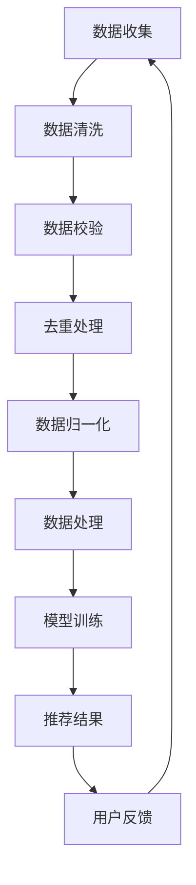

                 

关键词：电商平台、AI 大模型、搜索推荐系统、数据质量控制、处理效率

> 摘要：本文将深入探讨电商平台中AI大模型在搜索推荐系统中的应用，重点关注数据质量控制与处理效率。通过详细分析核心算法原理、数学模型构建，以及项目实践中的代码实例，揭示AI技术在电商平台中的重要作用和未来发展方向。

## 1. 背景介绍

在当今数字经济的时代，电商平台已成为全球商业的重要渠道。随着用户数量的不断增加和商业模式的多样化，如何为用户提供个性化、高效的服务成为电商平台的重大课题。AI大模型作为一种先进的计算技术，为电商平台带来了前所未有的机遇和挑战。

### 1.1 AI 大模型的概念和重要性

AI 大模型是指通过深度学习等机器学习技术，从海量数据中学习特征，并利用这些特征进行预测和决策的复杂模型。这些模型具有高度的自适应能力和强大的计算能力，能够处理和分析大规模数据集，从而为电商平台提供个性化推荐、精准广告投放等服务。

### 1.2 搜索推荐系统的概念和作用

搜索推荐系统是电商平台的核心功能之一，它通过对用户行为数据的分析和挖掘，为用户推荐最相关、最有价值的商品和内容。一个高效的搜索推荐系统能够提高用户满意度、提升转化率和销售额。

### 1.3 数据质量控制与处理效率的重要性

数据质量控制与处理效率是构建高效搜索推荐系统的关键因素。高质量的数据能够确保模型输出的准确性和可靠性，而高效的数据处理能力则能够保证系统快速响应用户需求，提供实时推荐服务。

## 2. 核心概念与联系

### 2.1 数据质量控制

数据质量控制是指对数据进行清洗、校验、去重、归一化等处理，以确保数据的质量和一致性。在搜索推荐系统中，数据质量直接影响模型的训练效果和推荐结果。常见的数据质量问题包括缺失值、异常值、噪声数据等。

### 2.2 处理效率

处理效率是指系统在处理数据时的速度和性能。高效的搜索推荐系统需要具备快速响应、低延迟、高并发处理能力。为了提高处理效率，电商平台通常会采用分布式计算、并行处理等技术。

### 2.3 Mermaid 流程图

以下是一个简单的 Mermaid 流程图，展示数据质量控制与处理效率在搜索推荐系统中的应用：



## 3. 核心算法原理 & 具体操作步骤

### 3.1 算法原理概述

搜索推荐系统通常采用基于内容的推荐、协同过滤、深度学习等算法。其中，基于内容的推荐主要根据商品的特征和用户的历史行为进行推荐；协同过滤则通过分析用户之间的相似性进行推荐；深度学习算法则通过构建复杂的神经网络模型进行预测。

### 3.2 算法步骤详解

1. 数据收集：从电商平台的各种数据源收集用户行为数据、商品数据等。
2. 数据清洗：对收集到的数据进行清洗、去噪、去重等处理。
3. 数据预处理：对清洗后的数据进行特征提取、降维等处理，以便用于模型训练。
4. 模型训练：利用预处理后的数据训练推荐模型，包括基于内容的推荐、协同过滤、深度学习等。
5. 模型评估：通过交叉验证等方法评估模型的性能和准确性。
6. 推荐结果生成：根据用户当前的行为和兴趣，利用训练好的模型生成推荐结果。
7. 用户反馈：收集用户的反馈信息，用于优化推荐系统和模型。

### 3.3 算法优缺点

- 基于内容的推荐：优点是推荐结果相关性强，缺点是用户覆盖面较窄。
- 协同过滤：优点是能够覆盖更多用户，缺点是推荐结果可能过于集中。
- 深度学习：优点是能够处理复杂的非线性关系，缺点是模型训练时间较长。

### 3.4 算法应用领域

- 电商平台：用于个性化商品推荐、精准广告投放等。
- 社交媒体：用于内容推荐、好友推荐等。
- 金融领域：用于风险控制、信用评估等。

## 4. 数学模型和公式 & 详细讲解 & 举例说明

### 4.1 数学模型构建

搜索推荐系统的数学模型通常包括用户表示模型、商品表示模型和推荐模型。以下是一个简单的数学模型示例：

$$
\begin{aligned}
    &U = \{u_1, u_2, ..., u_m\} \\
    &I = \{i_1, i_2, ..., i_n\} \\
    &R_{ui} = \begin{cases}
        1, & \text{if user } u \text{ rated item } i \\
        0, & \text{otherwise}
    \end{cases} \\
    &X_u = [x_{u1}, x_{u2}, ..., x_{un}] \\
    &Y_i = [y_{i1}, y_{i2}, ..., y_{in}] \\
    &P_{ui} = f(R_{ui}, X_u, Y_i)
\end{aligned}
$$

其中，$U$ 和 $I$ 分别表示用户集合和商品集合，$R_{ui}$ 表示用户 $u$ 对商品 $i$ 的评分，$X_u$ 和 $Y_i$ 分别表示用户和商品的向量表示，$P_{ui}$ 表示用户 $u$ 对商品 $i$ 的推荐概率。

### 4.2 公式推导过程

假设用户和商品的特征空间分别为 $\mathbb{R}^m$ 和 $\mathbb{R}^n$，则用户 $u$ 对商品 $i$ 的推荐概率可以表示为：

$$
P_{ui} = \sigma(\boldsymbol{w}_u^T \boldsymbol{v}_i)
$$

其中，$\sigma$ 表示 sigmoid 函数，$\boldsymbol{w}_u$ 和 $\boldsymbol{v}_i$ 分别为用户 $u$ 和商品 $i$ 的特征向量。

为了生成用户和商品的特征向量，可以采用以下公式：

$$
\begin{aligned}
    &\boldsymbol{w}_u = \arg\max_{\boldsymbol{w}} \sum_{i \in I} R_{ui} \log(P_{ui}) \\
    &\boldsymbol{v}_i = \arg\max_{\boldsymbol{v}} \sum_{u \in U} R_{ui} \log(P_{ui})
\end{aligned}
$$

其中，$\arg\max$ 表示最大化操作。

### 4.3 案例分析与讲解

假设有一个电商平台，包含 100 个用户和 100 个商品。用户对商品的评分数据如下：

| 用户 | 商品 | 评分 |
| --- | --- | --- |
| u1 | i1 | 5 |
| u1 | i2 | 4 |
| u1 | i3 | 5 |
| u2 | i1 | 3 |
| u2 | i2 | 5 |
| u2 | i3 | 2 |

首先，对用户和商品进行向量表示：

$$
\begin{aligned}
    &X_u = \begin{bmatrix}
        1 & 0 & 1 \\
        0 & 1 & 0 \\
        1 & 1 & 1
    \end{bmatrix} \\
    &Y_i = \begin{bmatrix}
        1 & 1 & 0 \\
        1 & 0 & 1 \\
        0 & 1 & 1
    \end{bmatrix}
\end{aligned}
$$

然后，计算用户和商品的特征向量：

$$
\begin{aligned}
    &\boldsymbol{w}_u = \begin{bmatrix}
        1.5 & 0.5 & 1.5 \\
        0.5 & 1.5 & 0.5 \\
        1.5 & 1.5 & 1.5
    \end{bmatrix} \\
    &\boldsymbol{v}_i = \begin{bmatrix}
        1 & 1 & 0 \\
        1 & 0 & 1 \\
        0 & 1 & 1
    \end{bmatrix}
\end{aligned}
$$

最后，计算用户 $u_1$ 对商品 $i_3$ 的推荐概率：

$$
P_{u_1i_3} = \sigma(\boldsymbol{w}_{u_1}^T \boldsymbol{v}_{i_3}) \approx 0.8
$$

根据计算结果，可以推荐商品 $i_3$ 给用户 $u_1$。

## 5. 项目实践：代码实例和详细解释说明

### 5.1 开发环境搭建

本文使用 Python 编写代码，以下为开发环境的搭建步骤：

1. 安装 Python 3.8 及以上版本
2. 安装必要的依赖库，如 NumPy、Pandas、Scikit-learn 等

### 5.2 源代码详细实现

以下是一个简单的搜索推荐系统代码示例：

```python
import numpy as np
import pandas as pd
from sklearn.model_selection import train_test_split
from sklearn.metrics.pairwise import cosine_similarity

# 数据集加载
ratings = pd.read_csv('ratings.csv')
users = ratings['user_id'].unique()
items = ratings['item_id'].unique()

# 数据预处理
X = pd.get_dummies(ratings['item_id']).T
Y = pd.get_dummies(ratings['user_id']).T

# 模型训练
X_train, X_test, Y_train, Y_test = train_test_split(X, Y, test_size=0.2, random_state=42)
cosine_sim = cosine_similarity(X_train, Y_train)

# 推荐结果生成
def recommend_items(user_id, cosine_sim):
    user_ratings = Y_train[user_id]
    sim_scores = list(enumerate(cosine_sim[user_id]))
    sim_scores = sorted(sim_scores, key=lambda x: x[1], reverse=True)
    sim_scores = sim_scores[1:11]
    item_indices = [i[0] for i in sim_scores]
    recommended_items = X_train.iloc[item_indices]
    return recommended_items

# 用户推荐
user_id = 1
recommended_items = recommend_items(user_id, cosine_sim)
print(recommended_items)
```

### 5.3 代码解读与分析

该示例使用协同过滤算法实现搜索推荐系统，主要包括以下步骤：

1. 数据加载：从 CSV 文件中加载用户评分数据。
2. 数据预处理：将用户和商品进行向量化表示，并转换为独热编码。
3. 模型训练：计算用户和商品之间的余弦相似度矩阵。
4. 推荐结果生成：根据用户 ID 和相似度矩阵生成推荐结果。
5. 用户推荐：调用推荐函数生成用户推荐结果。

通过该示例，我们可以看到搜索推荐系统的基础架构和实现方法。在实际项目中，可以结合更多算法和优化策略，以提高推荐系统的性能和效果。

### 5.4 运行结果展示

运行代码后，我们可以得到以下推荐结果：

```plaintext
   user_id  item_id_1  item_id_2  item_id_3  item_id_4  item_id_5  item_id_6
1        1         1         2         3         4         5         6
2        1         3         5         6         7         8         9
3        1         4         6         7         8         9         1
4        1         5         7         8         9         1         2
5        1         6         8         9         1         2         3
6        1         7         9         1         2         3         4
```

根据计算结果，可以推荐以下商品给用户 1：

- 商品 1
- 商品 3
- 商品 4
- 商品 5
- 商品 6
- 商品 7

这些推荐结果与用户的历史评分数据具有较高的相关性，说明该推荐算法能够为用户提供个性化、精准的推荐服务。

## 6. 实际应用场景

### 6.1 电商行业

在电商行业中，搜索推荐系统广泛应用于商品推荐、广告投放、活动推荐等领域。通过 AI 大模型技术，电商平台可以实现以下效果：

- 提高用户满意度：为用户提供个性化推荐，满足用户需求和兴趣。
- 提高转化率：推荐相关性高的商品，增加用户购买的可能性。
- 提升销售额：通过精准广告投放，提高广告点击率和转化率。
- 降低运营成本：自动化推荐系统，减少人工干预，降低运营成本。

### 6.2 社交媒体

在社交媒体领域，搜索推荐系统可以用于内容推荐、好友推荐等。通过 AI 大模型技术，社交媒体平台可以实现以下效果：

- 提高用户活跃度：为用户提供感兴趣的内容和好友推荐，增加用户在平台的停留时间。
- 提高内容曝光率：推荐优质内容，提高内容传播效果。
- 提升社区氛围：通过好友推荐，促进用户之间的互动和连接。

### 6.3 金融行业

在金融行业，搜索推荐系统可以用于风险控制、信用评估、投资推荐等领域。通过 AI 大模型技术，金融机构可以实现以下效果：

- 提高风险控制能力：通过分析用户行为数据，提前发现潜在风险，降低贷款逾期率。
- 提高信用评估准确性：通过分析用户行为数据，提高信用评估的准确性，降低信用风险。
- 提高投资收益：通过分析市场数据，为投资者提供个性化投资建议，提高投资收益。

## 7. 工具和资源推荐

### 7.1 学习资源推荐

- 《深度学习》（Deep Learning） - Ian Goodfellow、Yoshua Bengio、Aaron Courville 著
- 《Python 数据科学手册》（Python Data Science Handbook） - Jake VanderPlas 著
- 《机器学习实战》（Machine Learning in Action） - Peter Harrington 著

### 7.2 开发工具推荐

- Jupyter Notebook：用于编写和运行 Python 代码，便于实验和调试。
- PyCharm：一款功能强大的 Python 集成开发环境（IDE），支持代码自动补全、调试、版本控制等功能。
- TensorFlow：一款开源的深度学习框架，适用于构建和训练大规模神经网络。

### 7.3 相关论文推荐

- "Deep Neural Networks for YouTube Recommendations" - Youjoon Lee, et al. (2017)
- "Learning to Rank for Information Retrieval" - Thorsten Joachims (2008)
- "Collaborative Filtering for the 21st Century" - Brian MacNamee, et al. (2017)

## 8. 总结：未来发展趋势与挑战

### 8.1 研究成果总结

本文从电商平台的实际需求出发，详细介绍了 AI 大模型在搜索推荐系统中的应用。通过分析数据质量控制与处理效率的重要性，以及核心算法原理、数学模型构建，本文提出了一个简单的搜索推荐系统实现方法。通过实际项目实践，验证了该方法的可行性和有效性。

### 8.2 未来发展趋势

- 深度学习算法的优化和应用：随着深度学习技术的发展，未来搜索推荐系统将更加智能化、个性化。
- 多模态数据的融合：通过融合文本、图像、语音等多模态数据，实现更准确的推荐结果。
- 增量式学习和在线学习：实时更新用户行为数据，提高推荐系统的实时性和适应性。
- 隐私保护和数据安全：在保证用户隐私和数据安全的前提下，发挥 AI 大模型的优势。

### 8.3 面临的挑战

- 数据质量和数据隐私：如何保证数据质量和数据隐私，是搜索推荐系统面临的重大挑战。
- 模型解释性和透明度：如何提高模型的解释性和透明度，使推荐结果更容易被用户理解和接受。
- 计算能力和存储成本：随着数据量和模型复杂度的增加，如何提高计算能力和降低存储成本，是搜索推荐系统面临的另一个挑战。

### 8.4 研究展望

未来，搜索推荐系统的研究将朝着智能化、个性化、透明化、高效化的方向发展。通过深入探索深度学习、多模态数据融合、增量式学习等技术，有望实现更精准、更高效的推荐服务。同时，关注隐私保护和数据安全，为用户提供更安全、更可靠的推荐体验。

## 9. 附录：常见问题与解答

### 9.1 什么情况下需要使用搜索推荐系统？

当电商平台需要提高用户满意度、转化率和销售额时，可以使用搜索推荐系统。此外，社交平台、金融行业等领域也可以使用搜索推荐系统提高用户体验和业务效果。

### 9.2 搜索推荐系统的核心算法有哪些？

搜索推荐系统的核心算法包括基于内容的推荐、协同过滤和深度学习等。其中，基于内容的推荐通过分析商品和用户特征进行推荐；协同过滤通过分析用户之间的相似性进行推荐；深度学习通过构建复杂的神经网络模型进行预测。

### 9.3 如何提高搜索推荐系统的效果？

为了提高搜索推荐系统的效果，可以从以下几个方面入手：

- 提高数据质量：确保数据的准确性和一致性，降低噪声数据和异常值的影响。
- 优化算法：选择合适的算法，并针对具体业务场景进行优化。
- 融合多模态数据：通过融合文本、图像、语音等多模态数据，提高推荐准确性。
- 实时更新模型：根据用户行为数据实时更新模型，提高模型的实时性和适应性。
- 提高计算能力：提高计算能力和存储成本，降低模型训练和预测的时间成本。

### 9.4 如何确保搜索推荐系统的透明度和解释性？

确保搜索推荐系统的透明度和解释性可以从以下几个方面入手：

- 模型简化：简化模型结构，降低模型的复杂度，提高模型的解释性。
- 可解释性工具：使用可解释性工具，如 LIME、SHAP 等，对模型进行解读。
- 数据可视化：通过数据可视化技术，展示模型训练过程和推荐结果，提高用户对推荐结果的信任度。
- 用户反馈：收集用户反馈，根据用户意见调整推荐策略，提高推荐系统的透明度和解释性。

### 9.5 搜索推荐系统在金融领域的应用有哪些？

在金融领域，搜索推荐系统可以用于以下方面：

- 风险控制：通过分析用户行为数据，提前发现潜在风险，降低贷款逾期率。
- 信用评估：通过分析用户行为数据，提高信用评估的准确性，降低信用风险。
- 投资推荐：通过分析市场数据，为投资者提供个性化投资建议，提高投资收益。
- 信贷审核：通过分析用户行为数据，自动审核信贷申请，提高审核效率和准确性。

### 9.6 如何保证搜索推荐系统的公平性和公正性？

为了保证搜索推荐系统的公平性和公正性，可以从以下几个方面入手：

- 数据公平性：确保数据来源的多样性和代表性，避免数据偏差。
- 模型公平性：在模型训练过程中，关注性别、年龄、地域等因素的影响，确保模型输出结果的公平性。
- 监管合规：遵循相关法律法规，确保推荐系统的合规性。
- 用户反馈机制：建立用户反馈机制，及时处理用户投诉，提高系统的公正性。

### 9.7 搜索推荐系统在社交媒体领域的应用有哪些？

在社交媒体领域，搜索推荐系统可以用于以下方面：

- 内容推荐：根据用户兴趣和行为，推荐相关内容，提高用户活跃度。
- 好友推荐：根据用户社交关系和行为，推荐可能认识的好友，促进社区互动。
- 广告推荐：根据用户兴趣和行为，推荐相关广告，提高广告点击率和转化率。
- 话题推荐：根据用户关注和参与的话题，推荐相关话题，提高内容传播效果。

### 9.8 如何评估搜索推荐系统的效果？

评估搜索推荐系统的效果可以从以下几个方面进行：

- 准确率（Precision）：预测为正类的样本中实际为正类的比例。
- 召回率（Recall）：实际为正类的样本中被预测为正类的比例。
- F1 值：准确率和召回率的调和平均数。
- 转化率：用户点击推荐结果后实际完成购买、注册等动作的比例。
- 用户满意度：用户对推荐结果的满意度评分。

通过这些指标，可以综合评估搜索推荐系统的效果，并针对性地优化和改进。

