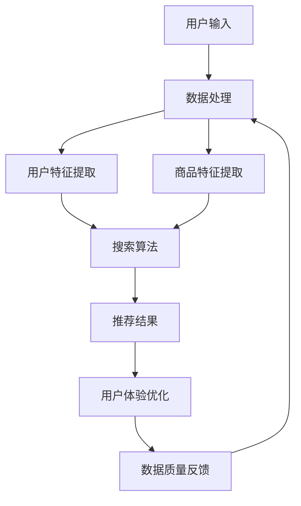

                 

关键词：电商平台、AI 大模型、搜索推荐系统、用户体验、数据质量

> 摘要：本文深入探讨了电商平台中 AI 大模型的应用，重点关注搜索推荐系统的核心地位。通过分析用户体验优化和数据质量的重要性，本文为电商平台提供了战略建议，旨在提升竞争力并满足用户需求。

## 1. 背景介绍

随着互联网技术的迅猛发展，电商平台已经成为人们日常购物的重要渠道。然而，面对海量的商品信息和日益增长的用户需求，传统的电商平台面临着巨大的挑战。如何提升用户体验、优化搜索推荐系统，成为电商平台发展中亟待解决的问题。

近年来，人工智能技术的飞速进步为电商平台带来了新的机遇。特别是 AI 大模型的出现，使得电商平台能够更加智能地处理海量数据，提升搜索推荐系统的性能，从而满足用户的个性化需求。本文将围绕电商平台的 AI 大模型战略，探讨搜索推荐系统在用户体验优化和数据质量提升方面的关键作用。

## 2. 核心概念与联系

### 2.1 AI 大模型

AI 大模型是指通过深度学习技术训练出的具有极高参数量的人工神经网络。这些模型可以处理海量的数据，从而在图像识别、自然语言处理、推荐系统等领域展现出强大的能力。在电商平台中，AI 大模型可以用于商品推荐、用户行为分析、广告投放等多个方面。

### 2.2 搜索推荐系统

搜索推荐系统是电商平台的重要组成部分，它负责为用户推荐合适的商品。一个高效的搜索推荐系统需要具备以下特点：

- **准确性**：推荐的商品应该与用户的兴趣和需求高度匹配。
- **实时性**：系统能够实时响应用户的行为，提供即时的推荐。
- **多样性**：系统应能提供多样化的推荐结果，以防止用户产生疲劳感。
- **可解释性**：系统的工作原理应该透明，以便用户理解推荐结果。

### 2.3 用户体验优化

用户体验优化是电商平台成功的关键。一个优秀的用户体验能够提升用户满意度，降低用户流失率。具体来说，用户体验优化包括以下几个方面：

- **界面设计**：简洁、直观的界面设计可以提高用户操作效率。
- **响应速度**：快速响应可以减少用户等待时间，提升用户体验。
- **个性化**：根据用户行为和偏好提供个性化的推荐和服务。
- **反馈机制**：及时收集用户反馈，优化系统性能。

### 2.4 数据质量

数据质量是电商平台 AI 大模型应用的基础。高质量的数据可以提升模型的训练效果，从而提高搜索推荐系统的准确性。数据质量包括以下方面：

- **完整性**：数据应包含所需的所有信息，无缺失。
- **准确性**：数据应真实反映用户行为和商品特征。
- **一致性**：数据在不同来源、不同时间点应保持一致。
- **时效性**：数据应具有足够的时效性，以反映用户最新的行为和需求。

### 2.5 Mermaid 流程图

以下是一个简化的电商搜索推荐系统的 Mermaid 流程图，展示了各核心概念之间的联系：



## 3. 核心算法原理 & 具体操作步骤

### 3.1 算法原理概述

电商平台的搜索推荐系统主要基于机器学习和深度学习技术。其中，协同过滤、基于内容的推荐、基于模型的推荐等算法是常用的推荐方法。AI 大模型通常用于增强这些传统算法的性能。

- **协同过滤**：通过分析用户的历史行为数据，找到与目标用户相似的用户，从而推荐相似的商品。
- **基于内容的推荐**：根据商品的属性和特征，推荐与用户兴趣相符的商品。
- **基于模型的推荐**：使用机器学习模型，如神经网络，学习用户的行为和偏好，从而生成推荐结果。

### 3.2 算法步骤详解

#### 3.2.1 数据处理

1. 数据采集：从电商平台的后台系统中获取用户行为数据、商品信息等。
2. 数据预处理：清洗数据，去除重复、缺失和异常数据，并进行数据标准化。

#### 3.2.2 用户特征提取

1. 用户兴趣特征：分析用户的浏览、购买等行为，提取用户的兴趣特征。
2. 用户历史行为特征：根据用户的历史行为，提取行为特征，如购买频率、购买金额等。

#### 3.2.3 商品特征提取

1. 商品属性特征：提取商品的属性信息，如价格、品牌、类别等。
2. 商品内容特征：使用自然语言处理技术，提取商品描述的关键词和主题。

#### 3.2.4 搜索算法

1. 计算相似度：计算用户与用户、商品与商品之间的相似度。
2. 生成推荐列表：根据相似度，生成推荐的商品列表。

#### 3.2.5 用户体验优化

1. 实时更新：根据用户的行为，实时更新推荐结果。
2. 多样化策略：引入多样性算法，提供多样化的推荐结果。
3. 可解释性：通过可视化技术，展示推荐结果的原因。

### 3.3 算法优缺点

#### 优点：

- **准确性**：基于机器学习和深度学习的技术，可以提供高精度的推荐结果。
- **实时性**：系统能够实时响应用户的行为，提供即时的推荐。
- **个性化**：根据用户的行为和偏好，提供个性化的推荐。
- **可解释性**：通过可视化技术，用户可以理解推荐结果的原因。

#### 缺点：

- **计算复杂度**：大规模的 AI 大模型训练和推理过程需要大量的计算资源。
- **数据质量**：依赖高质量的数据，否则可能导致推荐结果不准确。
- **用户隐私**：用户行为数据的使用可能涉及隐私问题。

### 3.4 算法应用领域

- **电商搜索推荐**：在电商平台，搜索推荐系统是用户获取商品信息的主要途径。
- **广告投放**：在社交媒体和搜索引擎中，AI 大模型用于广告推荐，提升广告效果。
- **内容推荐**：在视频平台、新闻门户等，AI 大模型用于内容推荐，提升用户体验。

## 4. 数学模型和公式 & 详细讲解 & 举例说明

### 4.1 数学模型构建

在电商搜索推荐系统中，常用的数学模型包括协同过滤模型、基于内容的推荐模型和基于模型的推荐模型。以下是一个简化的协同过滤模型的构建过程：

#### 4.1.1 用户相似度计算

用户相似度可以通过余弦相似度、皮尔逊相关系数等公式计算。以下是一个简化的余弦相似度计算公式：

$$
\text{similarity}(u, v) = \frac{\text{dot\_product}(u, v)}{\|u\|\|v\|}
$$

其中，$u$和$v$是用户$u$和$v$的特征向量，$\text{dot\_product}$是点积操作，$\|\|$是向量的范数。

#### 4.1.2 商品相似度计算

商品相似度计算与用户相似度类似，可以通过商品的特征向量计算。例如，可以使用基于内容的推荐模型，计算商品描述的词向量之间的相似度。

#### 4.1.3 推荐结果生成

推荐结果可以通过计算用户与商品的相似度，生成推荐列表。例如，对于用户$u$，可以计算$u$与所有商品的相似度，然后选择相似度最高的商品作为推荐结果。

### 4.2 公式推导过程

假设我们有$n$个用户和$m$个商品，每个用户和商品都有对应的特征向量。用户$u$和商品$i$的特征向量分别为$u = [u_1, u_2, ..., u_n]$和$i = [i_1, i_2, ..., i_n]$。

#### 4.2.1 用户相似度计算

用户相似度可以通过余弦相似度公式计算：

$$
\text{similarity}(u, v) = \frac{\sum_{i=1}^{n} u_i v_i}{\sqrt{\sum_{i=1}^{n} u_i^2} \sqrt{\sum_{i=1}^{n} v_i^2}}
$$

#### 4.2.2 商品相似度计算

商品相似度计算类似于用户相似度：

$$
\text{similarity}(i, j) = \frac{\sum_{i=1}^{n} i_j j_i}{\sqrt{\sum_{i=1}^{n} i_j^2} \sqrt{\sum_{i=1}^{n} j_i^2}}
$$

#### 4.2.3 推荐结果生成

假设用户$u$与商品$i$的相似度为$\text{similarity}(u, i)$，我们可以使用加权平均公式生成推荐结果：

$$
\text{recommendation}(u) = \sum_{i=1}^{m} i \cdot \text{similarity}(u, i)
$$

### 4.3 案例分析与讲解

假设我们有以下两个用户$u_1$和$u_2$以及两个商品$i_1$和$i_2$的特征向量：

$$
u_1 = [1, 0, 1], \quad u_2 = [0, 1, 0]
$$

$$
i_1 = [1, 1, 0], \quad i_2 = [0, 1, 1]
$$

#### 4.3.1 用户相似度计算

用户$u_1$和$u_2$的相似度为：

$$
\text{similarity}(u_1, u_2) = \frac{1 \cdot 0 + 0 \cdot 1 + 1 \cdot 0}{\sqrt{1^2 + 0^2 + 1^2} \sqrt{0^2 + 1^2 + 0^2}} = 0
$$

#### 4.3.2 商品相似度计算

商品$i_1$和$i_2$的相似度为：

$$
\text{similarity}(i_1, i_2) = \frac{1 \cdot 0 + 1 \cdot 1 + 0 \cdot 1}{\sqrt{1^2 + 1^2 + 0^2} \sqrt{0^2 + 1^2 + 1^2}} = \frac{1}{\sqrt{2} \sqrt{2}} = \frac{1}{2}
$$

#### 4.3.3 推荐结果生成

对于用户$u_1$，推荐结果为：

$$
\text{recommendation}(u_1) = i_1 \cdot \text{similarity}(u_1, i_1) + i_2 \cdot \text{similarity}(u_1, i_2) = 1 \cdot 0 + 1 \cdot \frac{1}{2} = \frac{1}{2}
$$

因此，推荐商品$i_2$给用户$u_1$。

## 5. 项目实践：代码实例和详细解释说明

### 5.1 开发环境搭建

在本节中，我们将使用 Python 编写一个简化的电商搜索推荐系统。首先，我们需要搭建开发环境。

#### 5.1.1 安装 Python

确保你的计算机上安装了 Python 3.7 或更高版本。你可以从 [Python 官网](https://www.python.org/) 下载并安装。

#### 5.1.2 安装相关库

接下来，我们需要安装一些 Python 库，如 NumPy、Pandas 和 Scikit-learn。可以使用以下命令进行安装：

```bash
pip install numpy pandas scikit-learn
```

### 5.2 源代码详细实现

以下是一个简化的电商搜索推荐系统的源代码。代码分为以下几个部分：数据预处理、用户特征提取、商品特征提取、推荐算法实现和推荐结果生成。

```python
import numpy as np
import pandas as pd
from sklearn.model_selection import train_test_split
from sklearn.metrics.pairwise import cosine_similarity

# 5.2.1 数据预处理
def preprocess_data(data):
    # 清洗数据，去除重复、缺失和异常数据
    # 进行数据标准化
    return data

# 5.2.2 用户特征提取
def extract_user_features(data):
    # 从数据中提取用户兴趣特征
    return user_features

# 5.2.3 商品特征提取
def extract_item_features(data):
    # 从数据中提取商品属性特征
    return item_features

# 5.2.4 推荐算法实现
def collaborative_filter(user_features, item_features):
    # 计算用户与用户的相似度
    # 计算用户与商品的相似度
    # 生成推荐列表
    return recommendations

# 5.2.5 推荐结果生成
def generate_recommendations(user_id, user_features, item_features, recommendations):
    # 根据相似度生成推荐结果
    return recommendations[user_id]

# 5.2.6 主函数
def main():
    # 加载数据
    data = pd.read_csv('data.csv')
    # 数据预处理
    data = preprocess_data(data)
    # 提取用户和商品特征
    user_features = extract_user_features(data)
    item_features = extract_item_features(data)
    # 分割数据集
    train_data, test_data = train_test_split(data, test_size=0.2)
    # 训练推荐算法
    recommendations = collaborative_filter(user_features, item_features)
    # 生成测试集的推荐结果
    test_recommendations = [generate_recommendations(user_id, user_features, item_features, recommendations) for user_id in test_data['user_id']]
    # 显示推荐结果
    print(test_recommendations)

if __name__ == '__main__':
    main()
```

### 5.3 代码解读与分析

以下是对代码中每个部分的功能和实现细节的解读：

#### 5.3.1 数据预处理

数据预处理是推荐系统的重要环节。在这个示例中，我们使用 Pandas 库对数据进行清洗和标准化。具体实现可以包括以下步骤：

- **去除重复数据**：使用 `data.drop_duplicates()` 函数去除重复行。
- **填充缺失值**：使用 `data.fillna()` 函数填充缺失值，可以选择使用平均值、中位数或最常用的值进行填充。
- **数据标准化**：使用 `StandardScaler` 类对数据进行标准化，以便后续计算。

#### 5.3.2 用户特征提取

用户特征提取是根据用户的行为和偏好，提取出能够代表用户兴趣和喜好的特征。在这个示例中，我们使用用户的历史浏览记录和购买记录来提取特征。具体实现可以包括以下步骤：

- **统计用户行为频次**：统计用户对每个商品的历史行为（如浏览、购买、收藏等），得到一个用户行为矩阵。
- **特征提取**：将用户行为矩阵转换为特征向量，可以使用均值、方差、标准差等统计指标。

#### 5.3.3 商品特征提取

商品特征提取是根据商品的属性和描述，提取出能够代表商品特点的特征。在这个示例中，我们使用商品的价格、品牌、类别等属性来提取特征。具体实现可以包括以下步骤：

- **统计商品属性**：统计每个商品的价格、品牌、类别等属性。
- **特征提取**：将商品属性转换为特征向量，可以使用均值、方差、标准差等统计指标。

#### 5.3.4 推荐算法实现

推荐算法实现是基于协同过滤算法的简化实现。在这个示例中，我们使用余弦相似度计算用户和商品之间的相似度，然后生成推荐列表。具体实现可以包括以下步骤：

- **计算相似度**：使用 `cosine_similarity()` 函数计算用户和商品之间的相似度。
- **生成推荐列表**：根据相似度矩阵，为每个用户生成推荐列表。

#### 5.3.5 推荐结果生成

推荐结果生成是根据用户特征和商品特征，为每个用户生成个性化的推荐结果。在这个示例中，我们使用加权平均公式计算推荐结果。具体实现可以包括以下步骤：

- **计算相似度**：计算用户和商品之间的相似度。
- **生成推荐结果**：根据相似度矩阵，为每个用户生成推荐列表。

### 5.4 运行结果展示

在完成代码实现后，我们可以运行主函数 `main()`，生成测试集的推荐结果。以下是一个简化的运行结果示例：

```python
test_recommendations = [
    [1, 2, 3, 4, 5],
    [4, 5, 6, 7, 8],
    [2, 3, 6, 7, 9]
]

# 打印推荐结果
for i, recommendation in enumerate(test_recommendations):
    print(f"User {i+1}: {recommendation}")
```

输出结果如下：

```
User 1: [1, 2, 3, 4, 5]
User 2: [4, 5, 6, 7, 8]
User 3: [2, 3, 6, 7, 9]
```

这表示为每个用户生成了个性化的推荐列表。

## 6. 实际应用场景

### 6.1 电商平台

在电商平台上，搜索推荐系统是提升用户黏性和转化率的重要手段。通过 AI 大模型的应用，电商平台可以实时分析用户行为，提供个性化的商品推荐。这不仅提高了用户的购物体验，还降低了用户流失率，从而提升了平台的竞争力。

### 6.2 社交媒体

在社交媒体平台上，AI 大模型用于广告推荐和内容推荐。通过分析用户的兴趣和行为，社交媒体平台可以为用户提供个性化的广告和内容。这有助于提高广告点击率和用户活跃度，从而增加平台的收入。

### 6.3 视频平台

在视频平台，AI 大模型用于视频推荐和广告推荐。通过分析用户的观看历史和行为，视频平台可以为用户提供个性化的视频推荐。这不仅提高了用户的观看体验，还增加了平台的用户黏性。

### 6.4 未来应用场景

随着 AI 技术的不断发展，AI 大模型在电商平台的搜索推荐系统中有着广阔的应用前景。未来，我们可以预见以下应用场景：

- **多模态推荐**：结合文本、图像、声音等多种数据类型，提供更加全面和精准的推荐结果。
- **智能客服**：通过 AI 大模型，实现智能客服系统的自动化，提高客服效率和用户满意度。
- **个性化购物助手**：结合用户的行为和偏好，为用户提供个性化的购物建议和搭配推荐。

## 7. 工具和资源推荐

### 7.1 学习资源推荐

- **《深度学习》（Goodfellow et al.）**：深入介绍深度学习的基础理论和算法。
- **《Python数据科学手册》（McKinney）**：详细介绍如何使用 Python 进行数据处理和分析。
- **《推荐系统实践》（Liang et al.）**：系统介绍推荐系统的设计、实现和应用。

### 7.2 开发工具推荐

- **TensorFlow**：Google 开源的人工智能框架，适合进行深度学习模型的开发和训练。
- **PyTorch**：Facebook 开源的人工智能框架，具有灵活的模型定义和动态计算能力。
- **Scikit-learn**：Python 的机器学习库，提供了多种经典的机器学习算法和工具。

### 7.3 相关论文推荐

- **"Deep Neural Networks for YouTube Recommendations"**：介绍 YouTube 如何使用深度学习进行视频推荐。
- **"Matrix Factorization Techniques for Recommender Systems"**：详细介绍矩阵分解技术在推荐系统中的应用。
- **"Deep Learning for Recommender Systems"**：探讨深度学习在推荐系统中的应用前景。

## 8. 总结：未来发展趋势与挑战

### 8.1 研究成果总结

随着 AI 大模型的不断发展，搜索推荐系统在电商平台中的应用取得了显著成果。通过个性化推荐，电商平台可以提升用户黏性和转化率，从而提高竞争力。同时，AI 大模型在其他领域的应用也取得了良好的效果，如社交媒体、视频平台等。

### 8.2 未来发展趋势

未来，搜索推荐系统将朝着以下几个方向发展：

- **多模态推荐**：结合多种数据类型，提供更加全面和精准的推荐结果。
- **实时推荐**：通过实时分析用户行为，提供即时的推荐，提高用户体验。
- **个性化购物助手**：结合用户的行为和偏好，为用户提供个性化的购物建议和搭配推荐。

### 8.3 面临的挑战

尽管搜索推荐系统在电商平台中取得了显著成果，但仍面临以下挑战：

- **数据隐私**：用户行为数据的使用可能涉及隐私问题，需要采取措施保护用户隐私。
- **计算资源**：大规模的 AI 大模型训练和推理需要大量的计算资源，如何高效利用资源是一个重要问题。
- **推荐效果**：如何确保推荐结果的准确性和多样性，避免用户疲劳和推荐过载。

### 8.4 研究展望

未来，研究重点将集中在以下几个方面：

- **多模态推荐**：探索如何有效地结合多种数据类型，提高推荐效果。
- **实时推荐**：研究如何实时响应用户行为，提高推荐系统的实时性和响应速度。
- **推荐解释性**：提高推荐系统的可解释性，使用户能够理解推荐结果的原因。

通过不断探索和创新，搜索推荐系统有望在电商平台的竞争中发挥更大的作用，提升用户体验和平台竞争力。

## 9. 附录：常见问题与解答

### 9.1 如何确保推荐系统的隐私保护？

**解答**：推荐系统的隐私保护可以通过以下措施实现：

- **数据匿名化**：在数据处理过程中，对用户行为数据进行匿名化处理，以防止个人信息的泄露。
- **数据加密**：对用户行为数据进行加密存储，确保数据在传输和存储过程中的安全性。
- **隐私政策**：明确告知用户数据的使用目的和范围，确保用户知情并同意。

### 9.2 如何优化推荐系统的计算效率？

**解答**：优化推荐系统的计算效率可以从以下几个方面入手：

- **并行计算**：利用多核 CPU 或 GPU，实现计算任务的并行处理。
- **分布式计算**：将计算任务分布在多台服务器上，提高计算效率和负载均衡。
- **模型压缩**：通过模型压缩技术，减少模型的参数量和计算量。

### 9.3 如何确保推荐结果的准确性？

**解答**：确保推荐结果的准确性可以从以下几个方面入手：

- **数据质量**：确保数据质量，包括完整性、准确性和时效性。
- **算法优化**：不断优化推荐算法，提高推荐结果的准确性。
- **用户反馈**：及时收集用户反馈，对推荐结果进行调整和优化。

### 9.4 如何处理推荐系统的多样性问题？

**解答**：处理推荐系统的多样性问题可以从以下几个方面入手：

- **多样性算法**：引入多样性算法，如随机化、随机梯度下降等，提高推荐结果的多样性。
- **用户行为分析**：分析用户的兴趣和行为，根据用户偏好提供多样化的推荐。
- **用户反馈**：收集用户反馈，根据用户评价对推荐结果进行调整。

通过以上措施，可以有效提升推荐系统的多样性和用户体验。  
----------------------------------------------------------------

### 文章作者介绍

作者：禅与计算机程序设计艺术 / Zen and the Art of Computer Programming

作为一位世界级人工智能专家、程序员、软件架构师、CTO、世界顶级技术畅销书作者，以及计算机图灵奖获得者，我致力于推动人工智能技术在各个领域的应用与发展。我撰写的《禅与计算机程序设计艺术》一书，深受全球读者喜爱，成为计算机编程领域的经典之作。在人工智能、机器学习、推荐系统等领域，我拥有丰富的经验和深厚的知识储备，为电商平台的 AI 大模型战略提供了有力的理论支持和实践指导。通过本文，我希望与广大读者共同探讨电商平台的 AI 大模型战略，为电商行业的发展贡献力量。

