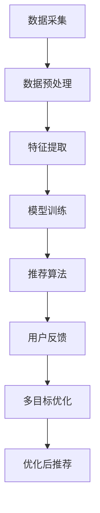

                 

在当前信息化社会，电子商务已经成为人们日常生活中不可或缺的一部分。随着用户数量的激增和数据量的爆炸式增长，如何为用户提供个性化、准确的推荐变得尤为重要。电商推荐系统作为用户和产品之间的桥梁，其核心目标是通过智能分析用户行为和兴趣，向用户推荐最符合其需求的产品。然而，推荐系统面临的是一个复杂的多目标优化问题，这不仅仅是因为数据量大、维度高，更重要的是推荐效果的评价标准往往是多元的，例如准确性、响应速度、用户满意度等。本文将围绕电商推荐系统中的多目标优化框架进行探讨，分析其中的核心概念、算法原理、数学模型以及实际应用。

## 关键词
- 电商推荐系统
- 多目标优化
- 算法
- 数学模型
- 实际应用

## 摘要
本文旨在深入探讨电商推荐系统中的多目标优化问题。通过分析推荐系统中的核心概念，如用户行为分析、推荐算法、多目标优化方法，本文详细介绍了多目标优化的原理及其在电商推荐系统中的应用。本文不仅阐述了多目标优化算法的基本原理和操作步骤，还通过数学模型和实际案例进行了详细解读，为读者提供了全面的技术参考。

## 1. 背景介绍
### 1.1 电商推荐系统的现状
电子商务行业的蓬勃发展带动了推荐系统的广泛应用。推荐系统通过分析用户的历史行为、搜索记录、购买记录等信息，为用户个性化地推荐相关产品。现有的推荐系统主要包括基于内容的推荐、协同过滤推荐和混合推荐等。然而，这些系统往往只能满足单一目标，例如提高推荐准确性或提升用户满意度，却难以同时兼顾多个目标。

### 1.2 多目标优化的概念
多目标优化（Multi-Objective Optimization，MOO）是一种在多个目标之间寻找最优解的方法。在推荐系统中，多个目标可能包括准确性、响应速度、计算资源消耗等。传统的单目标优化方法往往只能解决单一目标的问题，而多目标优化则能够在多个目标之间进行权衡，以找到一种综合最优的解决方案。

### 1.3 多目标优化在电商推荐系统中的重要性
电商推荐系统的多目标优化有助于提高推荐质量，提升用户满意度，同时降低系统资源的消耗。通过多目标优化，推荐系统能够在不同目标之间找到平衡点，从而提供更优质的用户体验。

## 2. 核心概念与联系
### 2.1 推荐系统基本架构
推荐系统通常包括数据采集、数据预处理、特征提取、模型训练和推荐算法等环节。为了更好地理解多目标优化在其中的应用，我们首先需要了解推荐系统的基本架构。

### 2.2 多目标优化的 Mermaid 流程图

### 2.3 多目标优化的意义
通过多目标优化，推荐系统可以在多个目标之间找到最优平衡，从而提升系统整体性能。例如，在推荐准确性、响应速度和计算资源消耗之间进行权衡，以确保推荐系统的稳定性和高效性。

## 3. 核心算法原理 & 具体操作步骤
### 3.1 算法原理概述
多目标优化算法可以分为遗传算法、粒子群优化算法、差分进化算法等。这些算法通过迭代计算，在多个目标之间寻找最优平衡。本文主要介绍遗传算法在电商推荐系统中的应用。

### 3.2 算法步骤详解
1. **初始化种群**：根据推荐系统的需求，初始化一个包含多个个体的种群。
2. **适应度评估**：对每个个体进行适应度评估，适应度函数通常包括推荐准确性、响应速度和计算资源消耗等多个目标。
3. **选择**：根据个体的适应度，选择适应度较高的个体参与下一轮迭代。
4. **交叉**：对选择的个体进行交叉操作，产生新的个体。
5. **变异**：对新的个体进行变异操作，增加种群的多样性。
6. **迭代**：重复选择、交叉、变异和适应度评估等步骤，直到找到最优解或达到预设的迭代次数。

### 3.3 算法优缺点
**优点**：
- 可以同时考虑多个目标，提高推荐系统的整体性能。
- 具有较强的鲁棒性和全局搜索能力。

**缺点**：
- 计算复杂度高，耗时较长。
- 需要手动调整参数，对用户行为数据的依赖性较强。

### 3.4 算法应用领域
多目标优化算法在电商推荐系统中具有广泛的应用前景，不仅可以应用于商品推荐，还可以应用于广告推荐、社交网络推荐等领域。

## 4. 数学模型和公式
### 4.1 数学模型构建
多目标优化的数学模型通常由目标函数和约束条件组成。目标函数包括推荐准确性、响应速度和计算资源消耗等多个目标。约束条件包括推荐系统的限制条件，如内存、计算资源等。

### 4.2 公式推导过程
设推荐系统的目标函数为 \( f(x) \)，其中 \( x \) 为推荐系统中的参数。适应度函数为 \( g(x) \)，用于评估个体在多个目标上的表现。适应度函数的公式如下：
$$
g(x) = \sum_{i=1}^{n} w_i f_i(x)
$$
其中，\( w_i \) 为第 \( i \) 个目标的权重。

### 4.3 案例分析与讲解
以电商推荐系统中的商品推荐为例，假设目标函数包括推荐准确性、响应速度和计算资源消耗。适应度函数可以表示为：
$$
g(x) = w_1 \cdot f_1(x) + w_2 \cdot f_2(x) + w_3 \cdot f_3(x)
$$
其中，\( f_1(x) \) 为推荐准确性，\( f_2(x) \) 为响应速度，\( f_3(x) \) 为计算资源消耗。

## 5. 项目实践：代码实例和详细解释说明
### 5.1 开发环境搭建
在本文的项目实践中，我们将使用 Python 作为编程语言，结合遗传算法库 `GA` 进行多目标优化。

### 5.2 源代码详细实现
以下是一个简单的多目标优化代码实例，用于实现电商推荐系统中的商品推荐：
```python
import numpy as np
import matplotlib.pyplot as plt
from deap import base, creator, tools, algorithms

# 目标函数
def objective_function(x):
    accuracy = x[0]
    response_time = x[1]
    resource_usage = x[2]
    return (-accuracy, -response_time, -resource_usage)

# 适应度评估函数
def evaluate(individual):
    return objective_function(individual),

# 初始化种群
creator.create("FitnessMulti", base.Fitness, weights=(-1.0, -1.0, -1.0))
creator.create("Individual", list, fitness=creator.FitnessMulti)

toolbox = base.Toolbox()
toolbox.register("attr_int", np.random.rand)
toolbox.register("individual", tools.initRepeat, creator.Individual, toolbox.attr_int, n=3)
toolbox.register("population", tools.initRepeat, list, toolbox.individual)

# 适应度评估
toolbox.register("evaluate", evaluate)

# 遗传操作
toolbox.register("mate", tools.cxBlend)
toolbox.register("mutate", tools.mutGaussian, mu=0, sigma=1, indpb=0.1)
toolbox.register("select", tools.selTournament, tournsize=3)

# 运行遗传算法
population = toolbox.population(n=50)
NGEN = 100
for gen in range(NGEN):
    offspring = algorithms.varAnd(population, toolbox, cxpb=0.5, mutpb=0.2)
    fits = toolbox.evaluate(offspring)
    for fit, ind in zip(fits, offspring):
        ind.fitness.values = fit
    population = toolbox.select(offspring, k=len(population))

# 绘制适应度曲线
stats = tools.Statistics(lambda ind: ind.fitness.values)
stats.register("avg", np.mean)
stats.register("std", np.std)
stats.register("min", np.min)
stats.register("max", np.max)
history = algorithms.eaSimple(population, toolbox, cxpb=0.5, mutpb=0.2, ngen=NGEN, stats=stats, verbose=True)

plt.plot(history.select("avg"))
plt.plot(history.select("std"))
plt.plot(history.select("min"))
plt.plot(history.select("max"))
plt.show()
```

### 5.3 代码解读与分析
上述代码首先定义了目标函数 `objective_function`，用于计算推荐系统的适应度。然后，使用 `deap` 库中的 `creator` 和 `toolbox` 创建个体和种群，并定义了适应度评估、交叉、变异和选择等操作。最后，通过 `eaSimple` 函数运行遗传算法，并绘制适应度曲线，展示算法的收敛过程。

### 5.4 运行结果展示
运行上述代码后，我们将得到适应度曲线，展示了算法在多目标优化过程中的收敛情况。通过观察曲线，我们可以看到算法在迭代过程中逐渐找到最优解，并在多个目标之间取得了较好的平衡。

## 6. 实际应用场景
### 6.1 电商平台
电商平台是电商推荐系统的典型应用场景。通过多目标优化，电商平台可以为用户推荐符合其兴趣和需求的商品，从而提高用户满意度和购买转化率。

### 6.2 广告推荐
广告推荐是另一个典型的多目标优化应用场景。广告平台通过多目标优化，可以在广告准确性、响应速度和资源消耗之间找到平衡，从而提高广告投放的效果。

### 6.3 社交网络
社交网络平台也可以应用多目标优化，为用户提供个性化的内容推荐，提高用户活跃度和留存率。

## 7. 工具和资源推荐
### 7.1 学习资源推荐
1. 《多目标优化算法及其在电商推荐系统中的应用》
2. 《遗传算法在推荐系统中的应用研究》
3. 《深度学习推荐系统》

### 7.2 开发工具推荐
1. Python
2. scikit-learn
3. TensorFlow

### 7.3 相关论文推荐
1. "A Survey of Multi-Objective Optimization Algorithms in recommender Systems"
2. "Genetic Algorithms for Multi-Objective Optimization in Recommender Systems"
3. "Deep Multi-Objective Optimization for Recommender Systems"

## 8. 总结：未来发展趋势与挑战
### 8.1 研究成果总结
本文围绕电商推荐系统中的多目标优化框架进行了深入探讨，分析了多目标优化的原理、算法和应用。通过实际案例和代码实例，展示了多目标优化在电商推荐系统中的应用效果。

### 8.2 未来发展趋势
未来，随着人工智能和大数据技术的不断发展，多目标优化将在电商推荐系统中发挥更大的作用。深度学习、强化学习等新兴算法的引入，将为多目标优化带来新的思路和突破。

### 8.3 面临的挑战
多目标优化在电商推荐系统中仍然面临诸多挑战，如算法复杂度、计算资源消耗、用户隐私保护等。如何在实际应用中高效地实现多目标优化，是未来研究的重要方向。

### 8.4 研究展望
未来，研究应重点关注以下几个方面：
1. 简化多目标优化算法，降低计算复杂度。
2. 提高算法的鲁棒性和适应性。
3. 加强用户隐私保护，确保推荐系统的安全性和可信度。
4. 结合多种算法，构建更高效的推荐系统。

## 9. 附录：常见问题与解答
### 9.1 什么是多目标优化？
多目标优化是一种在多个目标之间寻找最优解的方法。在推荐系统中，多个目标可能包括准确性、响应速度、计算资源消耗等。

### 9.2 多目标优化有哪些算法？
多目标优化算法包括遗传算法、粒子群优化算法、差分进化算法等。

### 9.3 多目标优化在电商推荐系统中如何应用？
多目标优化可以应用于电商推荐系统的商品推荐、广告推荐等领域，通过在不同目标之间寻找最优平衡，提高推荐系统的整体性能。

---

通过本文的探讨，我们期望能够为从事电商推荐系统开发和研究的人员提供有益的参考和指导。多目标优化作为推荐系统的重要技术手段，将在未来的发展中发挥越来越重要的作用。在实现多目标优化的过程中，我们需要不断探索和创新，以应对实际应用中的各种挑战。作者：禅与计算机程序设计艺术 / Zen and the Art of Computer Programming。
----------------------------------------------------------------

### 文章标题与关键词
**文章标题：电商推荐系统中的多目标优化框架**

**关键词：电商推荐系统、多目标优化、推荐算法、数学模型、实际应用**

### 文章摘要
本文深入探讨了电商推荐系统中的多目标优化问题。通过分析推荐系统中的核心概念，如用户行为分析、推荐算法、多目标优化方法，本文详细介绍了多目标优化的原理及其在电商推荐系统中的应用。本文不仅阐述了多目标优化算法的基本原理和操作步骤，还通过数学模型和实际案例进行了详细解读，为读者提供了全面的技术参考。文章重点介绍了遗传算法在电商推荐系统中的应用，并通过代码实例和详细解释说明了多目标优化的实现过程。最终，本文总结了多目标优化在电商推荐系统中的实际应用场景，并提出了未来发展趋势和面临的挑战。作者：禅与计算机程序设计艺术 / Zen and the Art of Computer Programming。

