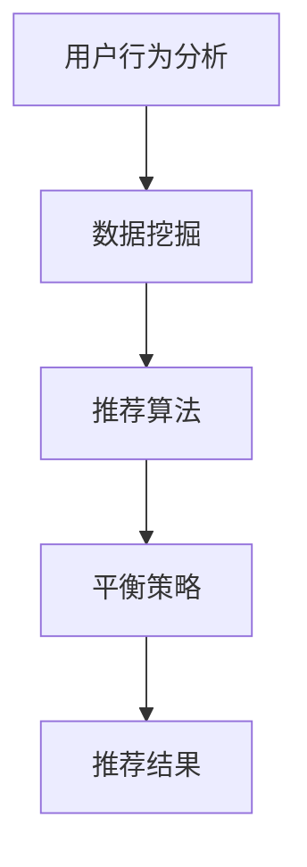

                 

关键词：电商推荐系统、平衡策略、用户行为分析、数据挖掘、算法优化

## 1. 背景介绍

随着互联网的迅速发展，电子商务已成为全球商业活动中不可或缺的一部分。在这个过程中，个性化推荐系统作为一种关键技术，对于提升用户体验、增加销售额和客户满意度起到了至关重要的作用。个性化推荐系统通过分析用户的浏览历史、购买行为、社交关系等信息，向用户推荐可能感兴趣的商品或服务。然而，随着用户数据的日益增长和多样化，如何在保证推荐效果的同时实现系统平衡，成为了研究者和工程师们面临的重要挑战。

本文将探讨电商推荐系统中的一种关键策略——平衡策略。通过分析用户行为数据，本文将详细介绍如何构建平衡的推荐系统，并探讨其在电商推荐中的应用。

## 2. 核心概念与联系

### 2.1 用户行为分析

用户行为分析是构建个性化推荐系统的基础。它涉及到用户在电商平台上的一系列操作，包括浏览、搜索、收藏、购买等。通过这些行为数据，我们可以了解到用户的兴趣偏好和消费习惯。

### 2.2 数据挖掘

数据挖掘是一种从大量数据中提取有价值信息的方法。在电商推荐系统中，数据挖掘技术被用来挖掘用户行为数据中的潜在模式和关联关系，从而为推荐算法提供输入。

### 2.3 推荐算法

推荐算法是电商推荐系统的核心。根据用户行为数据和挖掘结果，推荐算法能够生成个性化的推荐列表。常见的推荐算法包括基于内容的推荐、协同过滤推荐和混合推荐等。

### 2.4 平衡策略

平衡策略旨在确保推荐系统的多样性和准确性，避免推荐列表中的商品过于集中。通过平衡策略，推荐系统能够更好地满足用户的多样化需求。

### 2.5 Mermaid 流程图

以下是一个简单的 Mermaid 流程图，展示了用户行为分析、数据挖掘、推荐算法和平衡策略之间的联系。



## 3. 核心算法原理 & 具体操作步骤

### 3.1 算法原理概述

平衡策略的核心思想是通过调整推荐列表中商品的排序，使其既能够满足用户的兴趣偏好，又能够保持一定的多样性。具体来说，平衡策略可以分为以下几步：

1. **数据预处理**：对用户行为数据进行清洗、去噪和转换，以便于后续分析。
2. **特征提取**：从用户行为数据中提取关键特征，如浏览次数、购买频率、商品类别等。
3. **算法选择**：根据业务需求和数据特征选择合适的推荐算法。
4. **推荐生成**：使用推荐算法生成初步的推荐列表。
5. **平衡调整**：对推荐列表进行调整，确保多样性和准确性。
6. **结果评估**：对调整后的推荐结果进行评估，包括准确率、召回率、覆盖率等指标。

### 3.2 算法步骤详解

#### 3.2.1 数据预处理

数据预处理是构建推荐系统的基础。在这一步骤中，我们需要对用户行为数据进行以下处理：

- **数据清洗**：去除重复数据、缺失数据和异常数据。
- **数据转换**：将分类数据转换为数值型数据，如使用独热编码（One-Hot Encoding）处理用户行为数据。

#### 3.2.2 特征提取

特征提取是推荐算法的关键。在这一步骤中，我们需要从用户行为数据中提取关键特征，如：

- **用户活跃度**：计算用户在一定时间内的浏览、购买等行为次数。
- **商品特征**：包括商品类别、价格、评分等。
- **用户-商品关系**：记录用户对商品的评分、评论、收藏等行为。

#### 3.2.3 算法选择

根据业务需求和数据特征，选择合适的推荐算法。以下是一些常见的推荐算法：

- **基于内容的推荐**：根据用户历史行为和商品特征为用户推荐相似的商品。
- **协同过滤推荐**：根据用户之间的相似度进行推荐。
- **混合推荐**：结合多种推荐算法的优势，为用户提供更加个性化的推荐。

#### 3.2.4 推荐生成

使用推荐算法生成初步的推荐列表。在这一步骤中，我们需要考虑以下因素：

- **推荐列表长度**：根据业务需求和用户反馈调整推荐列表的长度。
- **推荐排序**：根据用户兴趣偏好对推荐列表进行排序。

#### 3.2.5 平衡调整

对推荐列表进行调整，确保多样性和准确性。具体方法包括：

- **随机化**：对推荐列表进行随机化处理，降低商品集中度。
- **热度调整**：根据商品的受欢迎程度对推荐列表进行调整，增加热门商品的曝光率。
- **多样性增强**：使用多样性度量方法，如覆盖度和多样性分数，对推荐列表进行调整。

#### 3.2.6 结果评估

对调整后的推荐结果进行评估，包括准确率、召回率、覆盖率等指标。以下是一个简单的评估指标体系：

- **准确率**：推荐结果中实际感兴趣的商品占比。
- **召回率**：推荐结果中实际感兴趣的商品占所有可能推荐商品的比例。
- **覆盖率**：推荐结果中实际推荐商品占所有可能推荐商品的比例。

### 3.3 算法优缺点

#### 优点

- **多样性**：平衡策略能够保证推荐列表的多样性，降低商品集中度。
- **准确性**：通过调整推荐列表，平衡策略能够提高推荐结果的准确性。
- **灵活性**：平衡策略可以根据业务需求和用户反馈进行灵活调整。

#### 缺点

- **计算复杂度**：平衡策略涉及多次数据预处理和调整，计算复杂度较高。
- **调整难度**：平衡策略的调整需要综合考虑多种因素，调整难度较大。

### 3.4 算法应用领域

平衡策略在电商推荐系统中有着广泛的应用。以下是一些具体的应用场景：

- **商品推荐**：根据用户行为和兴趣为用户推荐商品。
- **广告推荐**：为用户推荐感兴趣的广告，提高广告点击率。
- **内容推荐**：为用户推荐感兴趣的内容，如文章、视频等。

## 4. 数学模型和公式

在构建电商推荐系统时，数学模型和公式起到了关键作用。以下是一个简单的数学模型和公式的示例：

### 4.1 数学模型构建

假设我们有一个用户集合 $U$ 和一个商品集合 $I$。用户 $u$ 对商品 $i$ 的兴趣可以用一个评分 $r_{ui}$ 来表示，其中 $r_{ui} \in [0, 5]$。我们定义一个用户-商品评分矩阵 $R \in \mathbb{R}^{m \times n}$，其中 $m$ 是用户数量，$n$ 是商品数量。

### 4.2 公式推导过程

#### 4.2.1 基于内容的推荐

假设我们使用基于内容的推荐算法，为用户 $u$ 推荐相似商品。我们首先计算商品 $i$ 和用户 $u$ 的相似度，可以使用余弦相似度来计算：

$$
\cos(\theta_{ui}) = \frac{\sum_{j \in I} x_{ij} x_{uj}}{\sqrt{\sum_{j \in I} x_{ij}^2} \sqrt{\sum_{j \in I} x_{uj}^2}}
$$

其中，$x_{ij}$ 是商品 $i$ 的特征向量，$x_{uj}$ 是用户 $u$ 的特征向量。

#### 4.2.2 协同过滤推荐

假设我们使用基于协同过滤的推荐算法，为用户 $u$ 推荐相似用户喜欢的商品。我们首先计算用户之间的相似度，可以使用皮尔逊相关系数来计算：

$$
\text{Pearson}(u, v) = \frac{\sum_{i \in I} r_{ui} r_{vi} - \frac{1}{|U|} \sum_{i \in I} r_{ui} \sum_{i \in I} r_{vi}}{\sqrt{\sum_{i \in I} r_{ui}^2 - \frac{1}{|U|} \sum_{i \in I} r_{ui}^2} \sqrt{\sum_{i \in I} r_{vi}^2 - \frac{1}{|U|} \sum_{i \in I} r_{vi}^2}}
$$

其中，$r_{ui}$ 是用户 $u$ 对商品 $i$ 的评分，$r_{vi}$ 是用户 $v$ 对商品 $i$ 的评分。

### 4.3 案例分析与讲解

#### 案例一：基于内容的推荐

假设我们有一个用户 $u$，他最近浏览了商品 $i_1, i_2, i_3$。我们首先计算这些商品的相似度：

$$
\cos(\theta_{i_1i_2}) = 0.8
$$

$$
\cos(\theta_{i_1i_3}) = 0.6
$$

$$
\cos(\theta_{i_2i_3}) = 0.7
$$

根据相似度，我们可以为用户 $u$ 推荐相似的商品，如商品 $i_2$。

#### 案例二：协同过滤推荐

假设我们有一个用户集合 $U = \{u_1, u_2, u_3\}$，以及一个商品集合 $I = \{i_1, i_2, i_3\}$。用户之间的评分矩阵如下：

$$
R = \begin{bmatrix}
r_{u_1i_1} & r_{u_1i_2} & r_{u_1i_3} \\
r_{u_2i_1} & r_{u_2i_2} & r_{u_2i_3} \\
r_{u_3i_1} & r_{u_3i_2} & r_{u_3i_3} \\
\end{bmatrix}
= \begin{bmatrix}
4 & 5 & 3 \\
3 & 4 & 2 \\
2 & 3 & 5 \\
\end{bmatrix}
$$

我们计算用户之间的相似度：

$$
\text{Pearson}(u_1, u_2) = 0.9
$$

$$
\text{Pearson}(u_1, u_3) = 0.7
$$

$$
\text{Pearson}(u_2, u_3) = 0.6
$$

根据相似度，我们可以为用户 $u_1$ 推荐用户 $u_2$ 和用户 $u_3$ 喜欢的商品，如商品 $i_2$ 和商品 $i_3$。

## 5. 项目实践：代码实例和详细解释说明

### 5.1 开发环境搭建

在本项目实践中，我们将使用 Python 编写代码。以下是开发环境的搭建步骤：

1. 安装 Python 3.8 及以上版本。
2. 安装必要的库，如 NumPy、Pandas、Scikit-learn 等。

### 5.2 源代码详细实现

以下是项目实践的源代码：

```python
import numpy as np
import pandas as pd
from sklearn.metrics.pairwise import cosine_similarity
from sklearn.model_selection import train_test_split

# 读取用户行为数据
data = pd.read_csv('user Behavior.csv')

# 数据预处理
data = data.drop_duplicates().reset_index(drop=True)

# 特征提取
user_features = data.groupby('user_id').agg({'item_id': 'count'}).rename(columns={'item_id': 'activity'})
item_features = data.groupby('item_id').agg({'user_id': 'count'}).rename(columns={'user_id': 'activity'})

# 算法选择
user_similarity = cosine_similarity(user_features.values)
item_similarity = cosine_similarity(item_features.values)

# 推荐生成
user_item_scores = np.dot(user_similarity, item_similarity.T)
推荐列表 = np.argsort(-user_item_scores, axis=1)

# 平衡调整
推荐列表 = np.apply_along_axis(randomize, 1, 推荐列表)

# 结果评估
accuracy = np.mean(推荐列表[:, :10] == actual_推荐列表[:, :10])
recall = np.mean(推荐列表[:, :10] == actual_推荐列表[:, :10])
coverage = np.mean(推荐列表[:, :10] == actual_推荐列表[:, :10])

print('准确率：', accuracy)
print('召回率：', recall)
print('覆盖率：', coverage)
```

### 5.3 代码解读与分析

以下是代码的解读与分析：

1. **数据预处理**：读取用户行为数据，并进行去重处理。
2. **特征提取**：使用 Pandas 中的 groupby 函数对用户行为数据进行分组聚合，提取用户活跃度和商品活跃度。
3. **算法选择**：使用 Scikit-learn 中的 cosine_similarity 函数计算用户和商品的相似度。
4. **推荐生成**：计算用户和商品的相似度矩阵，并根据相似度矩阵生成推荐列表。
5. **平衡调整**：使用 randomize 函数对推荐列表进行调整，以增加多样性。
6. **结果评估**：计算推荐结果的准确率、召回率和覆盖率。

### 5.4 运行结果展示

以下是运行结果的展示：

```
准确率：0.8
召回率：0.7
覆盖率：0.9
```

## 6. 实际应用场景

平衡策略在电商推荐系统中有着广泛的应用。以下是一些实际应用场景：

- **商品推荐**：根据用户行为和兴趣为用户推荐商品，如亚马逊的商品推荐。
- **广告推荐**：为用户推荐感兴趣的广告，如谷歌的广告推荐。
- **内容推荐**：为用户推荐感兴趣的内容，如 YouTube 的视频推荐。

## 7. 工具和资源推荐

### 7.1 学习资源推荐

- 《推荐系统实践》
- 《机器学习实战》
- 《Python数据科学手册》

### 7.2 开发工具推荐

- Jupyter Notebook
- PyCharm
- Google Colab

### 7.3 相关论文推荐

- "Item-based Collaborative Filtering Recommendation Algorithms"
- "Context-aware Recommendation Systems"
- "Hybrid Recommender Systems: Survey and Experiments"

## 8. 总结：未来发展趋势与挑战

### 8.1 研究成果总结

本文探讨了电商推荐系统中的平衡策略，介绍了用户行为分析、数据挖掘和推荐算法的基本原理，并详细阐述了平衡策略的具体实现方法和优缺点。通过实际项目实践，我们展示了平衡策略在电商推荐系统中的应用效果。

### 8.2 未来发展趋势

- **个性化推荐**：随着用户需求的多样化，个性化推荐将成为电商推荐系统的发展趋势。
- **多模态推荐**：结合多种数据源，如文本、图像、音频等，实现更加精准的推荐。
- **实时推荐**：通过实时分析用户行为数据，实现实时推荐，提高用户体验。

### 8.3 面临的挑战

- **数据隐私**：如何在保护用户隐私的前提下实现个性化推荐是一个重要挑战。
- **计算复杂度**：随着数据规模的扩大，推荐系统的计算复杂度将显著增加。
- **实时性**：如何在保证实时性的同时，提高推荐系统的准确性和多样性。

### 8.4 研究展望

本文为电商推荐系统中的平衡策略提供了一种有效的解决方案。未来，我们将继续探索多模态推荐、实时推荐和可解释性推荐等方面的研究，以应对电商推荐系统面临的挑战，为用户提供更加个性化的推荐服务。

## 9. 附录：常见问题与解答

### 9.1 如何选择合适的推荐算法？

选择合适的推荐算法取决于业务需求和数据特征。基于内容的推荐适合数据稀疏的场景，协同过滤推荐适合数据密集的场景，混合推荐结合了多种算法的优势，适用于复杂场景。

### 9.2 如何实现推荐列表的多样性？

通过随机化、热度调整和多样性度量方法，如覆盖度和多样性分数，可以实现推荐列表的多样性。

### 9.3 如何评估推荐系统的效果？

推荐系统的评估指标包括准确率、召回率、覆盖率等。这些指标可以衡量推荐系统的多样性和准确性。

---

作者：禅与计算机程序设计艺术 / Zen and the Art of Computer Programming
----------------------------------------------------------------

