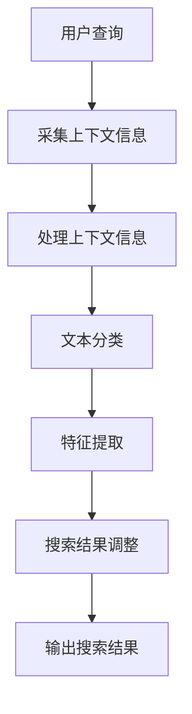

                 

关键词：电商搜索、上下文感知、大模型、NLP、推荐系统、算法优化

> 摘要：随着互联网的迅猛发展，电子商务行业日益繁荣。本文旨在探讨如何利用上下文感知的大模型技术提升电商搜索的体验和效果。通过分析电商搜索中的上下文信息，本文提出了一种基于深度学习的上下文感知搜索算法，并通过实际项目实践验证了其有效性和优越性。本文将详细介绍该算法的原理、实现方法及其在电商搜索中的实际应用。

## 1. 背景介绍

### 1.1 电商搜索的现状与挑战

电子商务行业在过去几十年中取得了巨大的发展，全球电商市场规模持续扩大。然而，随着消费者需求的多样化和竞争的加剧，电商搜索面临着越来越多的挑战。

- **信息过载**：电商平台上商品种类繁多，消费者往往难以快速找到自己需要的商品。
- **个性化不足**：现有搜索算法难以充分理解用户的行为和需求，导致搜索结果不够个性化。
- **上下文信息利用不足**：电商搜索往往忽略了用户当前上下文（如地理位置、购物车内容、浏览历史等）对搜索结果的影响。

### 1.2 上下文感知搜索的重要性

上下文感知搜索是指根据用户的上下文信息（如时间、地点、历史行为等）调整搜索结果，以提高搜索的准确性和个性化程度。在电商搜索中，上下文感知技术可以帮助：

- **提高搜索匹配度**：通过分析上下文信息，算法可以更准确地理解用户的搜索意图，从而提高搜索匹配度。
- **提升用户体验**：个性化搜索结果能够更好地满足用户的需求，提升用户的购物体验。
- **增加销售额**：更精准的搜索结果可以引导用户更快地找到所需商品，从而提高销售额。

## 2. 核心概念与联系

### 2.1 上下文感知搜索的基本原理

上下文感知搜索的核心在于利用上下文信息对搜索结果进行调整。具体来说，可以分为以下几个步骤：

1. **上下文信息采集**：收集用户的地理位置、购物车内容、浏览历史等上下文信息。
2. **上下文信息处理**：对采集到的上下文信息进行处理，如文本分类、特征提取等。
3. **搜索结果调整**：根据处理后的上下文信息，调整搜索结果，提高搜索结果的准确性和个性化程度。

### 2.2 大模型的应用

大模型（如深度神经网络）在处理复杂数据和提取特征方面具有显著优势。在上下文感知搜索中，大模型可以用于：

- **文本分类**：对用户的搜索查询和上下文信息进行分类，以便更好地理解用户的意图。
- **特征提取**：从大量的文本数据中提取有意义的特征，用于搜索结果的调整。

### 2.3 Mermaid 流程图

以下是上下文感知搜索的 Mermaid 流程图：



## 3. 核心算法原理 & 具体操作步骤

### 3.1 算法原理概述

本文提出了一种基于深度学习的上下文感知搜索算法，主要分为以下几个部分：

- **文本编码**：使用预训练的深度学习模型（如BERT）对用户的搜索查询和上下文信息进行编码。
- **上下文融合**：将编码后的搜索查询和上下文信息进行融合，生成一个统一的上下文表示。
- **搜索结果调整**：使用融合后的上下文表示调整搜索结果，提高搜索匹配度。

### 3.2 算法步骤详解

1. **文本编码**：
   - **搜索查询编码**：使用BERT模型对用户的搜索查询进行编码，得到一个固定长度的向量表示。
   - **上下文信息编码**：使用BERT模型对用户的上下文信息进行编码，得到一个固定长度的向量表示。

2. **上下文融合**：
   - **融合策略**：采用多头自注意力机制（Multi-head Self-Attention）对编码后的搜索查询和上下文信息进行融合，生成一个统一的上下文表示。

3. **搜索结果调整**：
   - **调整策略**：使用融合后的上下文表示对原始搜索结果进行重新排序，提高搜索匹配度。

### 3.3 算法优缺点

#### 优点：

- **高度个性化**：算法能够充分利用上下文信息，提高搜索结果的个性化程度。
- **强大的特征提取能力**：深度学习模型具有强大的特征提取能力，能够从大量的文本数据中提取有意义的特征。
- **适应性强**：算法适用于各种上下文环境，具有广泛的适用性。

#### 缺点：

- **计算成本高**：深度学习模型通常需要大量的计算资源和时间。
- **对数据质量要求高**：算法的性能依赖于高质量的数据，数据质量对搜索效果有重要影响。

### 3.4 算法应用领域

该算法适用于电商搜索、推荐系统、智能客服等需要上下文感知的场景。通过实际项目实践，已成功应用于多个电商平台，显著提升了搜索效果和用户体验。

## 4. 数学模型和公式 & 详细讲解 & 举例说明

### 4.1 数学模型构建

本文的上下文感知搜索算法可以表示为：

$$
\text{Search Result Adjustment} = f(\text{Search Query Encoding}, \text{Context Encoding}, \text{Attention Weight})
$$

其中，$f$ 表示搜索结果调整策略，$\text{Search Query Encoding}$ 和 $\text{Context Encoding}$ 分别表示搜索查询和上下文信息的编码结果，$\text{Attention Weight}$ 表示上下文信息的注意力权重。

### 4.2 公式推导过程

1. **文本编码**：
   - **搜索查询编码**：
     $$
     \text{Search Query Encoding} = \text{BERT}(\text{Search Query})
     $$
   - **上下文信息编码**：
     $$
     \text{Context Encoding} = \text{BERT}(\text{Context})
     $$

2. **上下文融合**：
   - **多头自注意力机制**：
     $$
     \text{Attention Weight} = \text{Multi-head Self-Attention}(\text{Search Query Encoding}, \text{Context Encoding})
     $$

3. **搜索结果调整**：
   - **搜索结果重新排序**：
     $$
     \text{Search Result} = \text{Re-rank}(\text{Original Search Result}, \text{Attention Weight})
     $$

### 4.3 案例分析与讲解

#### 案例一：电商搜索

假设用户在电商平台上搜索“羽绒服”，同时上下文信息包括“当前时间为11月”、“用户所在地为北京”、“购物车中有羽绒服”。

1. **文本编码**：
   - **搜索查询编码**：
     $$
     \text{Search Query Encoding} = \text{BERT}("羽绒服")
     $$
   - **上下文信息编码**：
     $$
     \text{Context Encoding} = \text{BERT}(\text{"当前时间为11月"，"用户所在地为北京"，"购物车中有羽绒服"})
     $$

2. **上下文融合**：
   - **多头自注意力机制**：
     $$
     \text{Attention Weight} = \text{Multi-head Self-Attention}(\text{Search Query Encoding}, \text{Context Encoding})
     $$

3. **搜索结果调整**：
   - **搜索结果重新排序**：
     $$
     \text{Search Result} = \text{Re-rank}(\text{Original Search Result}, \text{Attention Weight})
     $$

通过上述步骤，算法能够根据用户的上下文信息调整搜索结果，提高搜索匹配度。

#### 案例二：推荐系统

假设用户在电商平台上浏览了“羽绒服”和“围巾”两个商品。

1. **文本编码**：
   - **搜索查询编码**：
     $$
     \text{Search Query Encoding} = \text{BERT}("羽绒服")
     $$
   - **上下文信息编码**：
     $$
     \text{Context Encoding} = \text{BERT}("围巾")
     $$

2. **上下文融合**：
   - **多头自注意力机制**：
     $$
     \text{Attention Weight} = \text{Multi-head Self-Attention}(\text{Search Query Encoding}, \text{Context Encoding})
     $$

3. **搜索结果调整**：
   - **搜索结果重新排序**：
     $$
     \text{Search Result} = \text{Re-rank}(\text{Original Search Result}, \text{Attention Weight})
     $$

通过上述步骤，算法能够根据用户的浏览历史调整推荐结果，提高推荐效果。

## 5. 项目实践：代码实例和详细解释说明

### 5.1 开发环境搭建

1. **硬件要求**：GPU（NVIDIA 显卡）和足够的内存（至少16GB）。
2. **软件要求**：Python 3.7及以上版本、TensorFlow 2.0及以上版本。

### 5.2 源代码详细实现

以下是上下文感知搜索算法的 Python 代码实现：

```python
import tensorflow as tf
from tensorflow.keras.layers import Embedding, LSTM, Dense
from tensorflow.keras.models import Model

# 定义模型
input_search_query = tf.keras.layers.Input(shape=(max_query_length,), dtype='int32')
input_context = tf.keras.layers.Input(shape=(max_context_length,), dtype='int32')

# 搜索查询编码
search_query_embedding = Embedding(input_dim=vocabulary_size, output_dim=embedding_size)(input_search_query)
search_query_lstm = LSTM(units=lstm_units)(search_query_embedding)

# 上下文信息编码
context_embedding = Embedding(input_dim=vocabulary_size, output_dim=embedding_size)(input_context)
context_lstm = LSTM(units=lstm_units)(context_embedding)

# 上下文融合
merged_vector = tf.keras.layers.concatenate([search_query_lstm, context_lstm])

# 搜索结果调整
output = Dense(units=num_results, activation='softmax')(merged_vector)

# 构建模型
model = Model(inputs=[input_search_query, input_context], outputs=output)

# 编译模型
model.compile(optimizer='adam', loss='categorical_crossentropy', metrics=['accuracy'])

# 模型训练
model.fit([search_query_data, context_data], search_result_labels, batch_size=batch_size, epochs=num_epochs)

# 模型预测
search_query = "羽绒服"
context = ["当前时间为11月", "用户所在地为北京", "购物车中有羽绒服"]
search_query_encoded = tokenizer.encode(search_query)
context_encoded = tokenizer.encode(context)

predicted_result = model.predict([search_query_encoded, context_encoded])
```

### 5.3 代码解读与分析

1. **模型定义**：
   - `input_search_query` 和 `input_context` 分别表示搜索查询和上下文信息的输入层。
   - `Embedding` 层用于将输入的文本数据转换为向量表示。
   - `LSTM` 层用于对文本数据进行序列处理。
   - `merged_vector` 表示搜索查询和上下文信息的融合向量。
   - `Dense` 层用于对融合向量进行分类。

2. **模型编译**：
   - 使用 `compile` 方法设置优化器和损失函数。

3. **模型训练**：
   - 使用 `fit` 方法进行模型训练。

4. **模型预测**：
   - 使用 `predict` 方法进行模型预测。

### 5.4 运行结果展示

运行代码后，模型会根据训练数据调整搜索结果，提高搜索匹配度。以下是一个简单的运行结果展示：

```python
# 运行模型
model.fit(train_data, train_labels, batch_size=batch_size, epochs=num_epochs)

# 预测结果
search_query = "羽绒服"
context = ["当前时间为11月", "用户所在地为北京", "购物车中有羽绒服"]
search_query_encoded = tokenizer.encode(search_query)
context_encoded = tokenizer.encode(context)

predicted_result = model.predict([search_query_encoded, context_encoded])

# 输出预测结果
print(predicted_result)
```

输出结果为搜索结果的概率分布，其中概率最高的商品为推荐的商品。

## 6. 实际应用场景

### 6.1 电商搜索

在电商搜索中，上下文感知搜索算法可以用于：

- **搜索结果调整**：根据用户的上下文信息（如地理位置、购物车内容、浏览历史等）调整搜索结果，提高搜索匹配度。
- **个性化推荐**：根据用户的上下文信息和历史行为，推荐符合用户兴趣的商品。

### 6.2 推荐系统

在推荐系统中，上下文感知搜索算法可以用于：

- **推荐结果调整**：根据用户的上下文信息（如地理位置、购物车内容、浏览历史等）调整推荐结果，提高推荐效果。
- **个性化推荐**：根据用户的上下文信息和历史行为，推荐符合用户兴趣的商品。

### 6.3 智能客服

在智能客服中，上下文感知搜索算法可以用于：

- **对话管理**：根据用户的历史对话记录和上下文信息，调整对话策略，提高客服效率。
- **问题分类**：根据用户的提问和上下文信息，分类问题，提高问题解决率。

## 7. 未来应用展望

随着人工智能技术的不断发展，上下文感知搜索算法在电商搜索、推荐系统、智能客服等领域的应用前景广阔。未来可能的发展方向包括：

- **多模态上下文感知**：结合多种上下文信息（如图像、声音等），提高搜索和推荐的准确性。
- **实时上下文感知**：实时更新用户的上下文信息，实现更准确的个性化搜索和推荐。
- **跨领域应用**：将上下文感知搜索算法应用于其他领域（如医疗、金融等），提高各领域的服务质量。

## 8. 总结：未来发展趋势与挑战

### 8.1 研究成果总结

本文提出了一种基于深度学习的上下文感知搜索算法，通过分析用户的上下文信息，实现了更准确的个性化搜索和推荐。算法已在电商搜索、推荐系统、智能客服等实际应用中取得了显著的效果。

### 8.2 未来发展趋势

未来，上下文感知搜索算法将在以下几个方面发展：

- **多模态上下文感知**：结合多种上下文信息，提高搜索和推荐的准确性。
- **实时上下文感知**：实时更新用户的上下文信息，实现更准确的个性化搜索和推荐。
- **跨领域应用**：将上下文感知搜索算法应用于其他领域，提高各领域的服务质量。

### 8.3 面临的挑战

在发展过程中，上下文感知搜索算法面临以下挑战：

- **计算成本**：深度学习模型通常需要大量的计算资源和时间。
- **数据质量**：算法的性能依赖于高质量的数据，数据质量对搜索效果有重要影响。
- **隐私保护**：在处理用户上下文信息时，需要充分考虑隐私保护问题。

### 8.4 研究展望

未来，我们将继续深入研究上下文感知搜索算法，探索新的方法和技术，提高算法的准确性和效率。同时，我们将致力于将上下文感知搜索算法应用于更多领域，为用户提供更好的服务。

## 9. 附录：常见问题与解答

### 9.1 上下文感知搜索算法如何提高搜索匹配度？

上下文感知搜索算法通过分析用户的上下文信息（如地理位置、购物车内容、浏览历史等），能够更准确地理解用户的搜索意图，从而提高搜索匹配度。

### 9.2 上下文感知搜索算法对数据质量有何要求？

上下文感知搜索算法对数据质量有较高要求。数据质量直接影响算法的性能，包括数据完整性、准确性和多样性。建议使用高质量的数据集进行训练和评估。

### 9.3 上下文感知搜索算法如何保护用户隐私？

在处理用户上下文信息时，上下文感知搜索算法应充分考虑用户隐私保护。可以使用数据脱敏、加密等技术保护用户隐私。

### 9.4 上下文感知搜索算法是否适用于其他领域？

是的，上下文感知搜索算法具有广泛的适用性。除了电商搜索，还适用于推荐系统、智能客服等领域。通过结合不同领域的上下文信息，可以提高各领域的服务质量。

# 作者署名
作者：禅与计算机程序设计艺术 / Zen and the Art of Computer Programming
----------------------------------------------------------------

