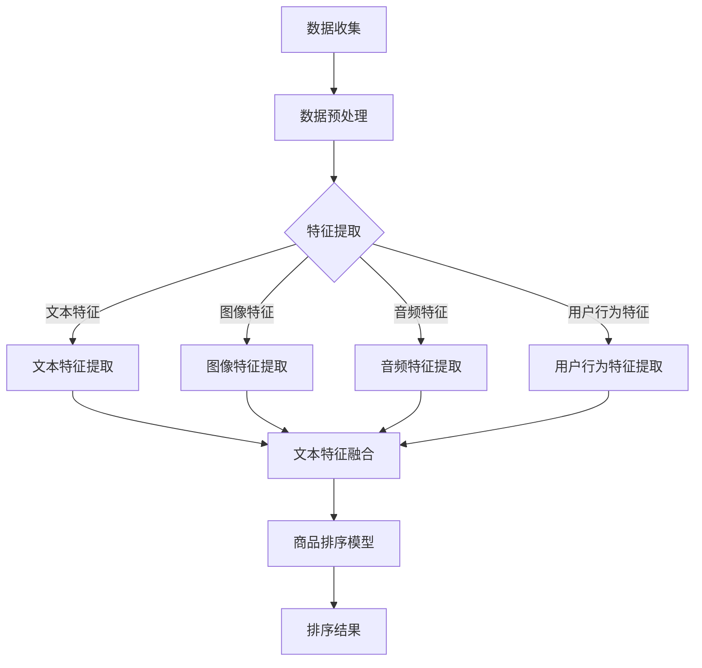

                 

关键词：电商搜索、多模态、商品排序、人工智能、算法优化

摘要：本文旨在探讨电商搜索中的多模态商品排序技术。首先介绍了电商搜索的背景和重要性，随后详细阐述了多模态商品排序的核心概念、原理和数学模型。接着，通过具体的算法实例，深入讲解了核心算法的原理、步骤和优缺点。文章还分析了多模态商品排序在实际应用中的场景，并对未来应用前景进行了展望。最后，本文推荐了相关的学习资源和开发工具，总结了研究成果，并提出了未来的研究挑战和展望。

## 1. 背景介绍

电商搜索是电子商务领域的重要组成部分。随着互联网的普及和消费者购物习惯的转变，电商搜索已经成为消费者获取商品信息、进行购物决策的主要途径。然而，电商平台上商品种类繁多，如何让消费者在大量的商品信息中快速找到符合自己需求的商品，成为了电商企业面临的重大挑战。

商品排序是电商搜索的核心功能之一。通过合理的排序算法，可以将符合消费者需求的商品优先展示，从而提高用户体验和购买转化率。传统的商品排序方法主要基于商品的销售量、价格、评分等单一维度进行排序，但这种方法难以全面满足消费者的个性化需求。

随着人工智能技术的不断发展，多模态商品排序技术逐渐成为研究热点。多模态商品排序通过结合多种数据来源和特征，如文本、图像、音频、用户行为等，实现更准确、更个性化的商品推荐。本文将围绕多模态商品排序技术展开讨论，旨在为电商搜索领域的研究者和开发者提供有益的参考。

## 2. 核心概念与联系

### 2.1 多模态数据

多模态数据是指包含两种或两种以上不同类型数据的信息源。在电商搜索中，常见的多模态数据包括文本（商品名称、描述、用户评论等）、图像（商品图片、广告图片等）、音频（商品宣传音频、用户评价音频等）和用户行为数据（搜索记录、购买历史、收藏夹等）。这些数据共同构成了多模态商品信息，为商品排序提供了丰富的特征信息。

### 2.2 多模态特征提取

多模态特征提取是指从多模态数据中提取能够有效区分不同商品的特征。常用的特征提取方法包括：

- **文本特征提取**：如词袋模型、TF-IDF、Word2Vec等；
- **图像特征提取**：如卷积神经网络（CNN）、预训练模型（如ResNet、VGG等）；
- **音频特征提取**：如梅尔频率倒谱系数（MFCC）、谱图特征等；
- **用户行为特征提取**：如用户点击行为、购买转化率等。

### 2.3 多模态商品排序算法

多模态商品排序算法是指利用多模态特征进行商品排序的算法。常见的多模态商品排序算法包括：

- **基于协同过滤的算法**：通过用户行为数据预测用户对商品的偏好，实现个性化推荐；
- **基于深度学习的算法**：利用卷积神经网络、循环神经网络（RNN）等深度学习模型提取多模态特征，进行商品排序；
- **基于图神经网络的算法**：通过构建商品、用户和商品特征之间的图结构，利用图神经网络（GCN）进行商品排序。

### 2.4 Mermaid 流程图

以下是一个多模态商品排序的 Mermaid 流程图：



## 3. 核心算法原理 & 具体操作步骤

### 3.1 算法原理概述

多模态商品排序算法的核心思想是将不同类型的多模态特征进行整合，构建一个统一的特征空间，然后在该空间中利用排序模型对商品进行排序。具体步骤如下：

1. 数据收集与预处理：收集电商平台上的商品数据、用户数据和多模态数据，并进行数据清洗和预处理；
2. 特征提取：从文本、图像、音频和用户行为数据中提取特征；
3. 特征融合：将提取的多模态特征进行融合，构建一个统一的特征向量；
4. 商品排序模型：利用融合后的特征向量，构建排序模型进行商品排序；
5. 排序结果：根据排序模型输出排序结果，优化电商搜索体验。

### 3.2 算法步骤详解

1. **数据收集与预处理**：

   - 收集电商平台的商品数据，包括商品名称、描述、图片、价格等；
   - 收集用户数据，包括用户购买历史、搜索记录、收藏夹等；
   - 收集多模态数据，包括商品图片、广告图片、用户评论音频等；
   - 数据清洗：去除无效数据、处理缺失值、统一数据格式等。

2. **特征提取**：

   - **文本特征提取**：使用词袋模型或TF-IDF等方法提取文本特征；
   - **图像特征提取**：使用卷积神经网络或预训练模型提取图像特征；
   - **音频特征提取**：使用梅尔频率倒谱系数（MFCC）等方法提取音频特征；
   - **用户行为特征提取**：根据用户行为数据计算用户兴趣向量等。

3. **特征融合**：

   - 将提取的多模态特征进行融合，可以使用加权融合、拼接融合等方法；
   - 构建一个统一的特征向量，用于后续的商品排序模型。

4. **商品排序模型**：

   - 使用深度学习模型（如循环神经网络（RNN）、卷积神经网络（CNN）等）进行训练；
   - 将融合后的特征向量输入模型，输出排序分数；
   - 根据排序分数对商品进行排序。

5. **排序结果**：

   - 输出排序结果，优化电商搜索体验；
   - 对排序结果进行评估和优化，以提高排序准确性。

### 3.3 算法优缺点

**优点**：

- 考虑了多种数据来源，能够更全面地了解商品和用户信息；
- 利用深度学习模型进行特征提取和排序，具有较好的泛化能力；
- 个性化推荐，提高用户体验和购买转化率。

**缺点**：

- 需要大量计算资源和时间进行特征提取和模型训练；
- 数据质量和预处理对算法效果有较大影响；
- 难以处理多模态数据之间的不一致性和噪声。

### 3.4 算法应用领域

多模态商品排序算法可以应用于以下领域：

- 电商平台商品推荐：优化商品展示顺序，提高用户购买转化率；
- 广告推荐：根据用户兴趣和行为，实现精准广告投放；
- 搜索引擎：改善搜索结果排序，提高用户满意度。

## 4. 数学模型和公式 & 详细讲解 & 举例说明

### 4.1 数学模型构建

多模态商品排序的数学模型主要分为特征提取模型和排序模型两部分。

#### 特征提取模型

特征提取模型用于从多模态数据中提取特征。假设有 \( n \) 个商品，每个商品有 \( m \) 个特征维度。则特征提取模型可以表示为：

\[ X = \{x_1, x_2, \ldots, x_n\} \]

其中，\( x_i \) 表示第 \( i \) 个商品的特征向量。

#### 排序模型

排序模型用于根据特征向量对商品进行排序。常见的排序模型包括线性排序模型和深度学习排序模型。

线性排序模型可以表示为：

\[ f(x_i) = w \cdot x_i + b \]

其中，\( f(x_i) \) 表示第 \( i \) 个商品的排序分数，\( w \) 表示权重向量，\( b \) 表示偏置。

深度学习排序模型可以表示为：

\[ f(x_i) = \sigma(W \cdot \phi(x_i) + b) \]

其中，\( \phi(x_i) \) 表示特征向量通过深度学习模型映射到的隐含空间，\( \sigma \) 表示激活函数。

### 4.2 公式推导过程

#### 线性排序模型

线性排序模型的推导过程如下：

1. 假设特征向量为 \( x_i = [x_{i1}, x_{i2}, \ldots, x_{im}]^T \)；
2. 权重向量为 \( w = [w_1, w_2, \ldots, w_m] \)；
3. 则排序分数 \( f(x_i) \) 可以表示为：

   \[ f(x_i) = w \cdot x_i + b \]

#### 深度学习排序模型

深度学习排序模型的推导过程如下：

1. 假设特征向量为 \( x_i = [x_{i1}, x_{i2}, \ldots, x_{im}]^T \)；
2. 深度学习模型输出隐含空间为 \( \phi(x_i) = [\phi_{i1}, \phi_{i2}, \ldots, \phi_{ik}]^T \)；
3. 权重向量为 \( W = [w_1, w_2, \ldots, w_k] \)；
4. 偏置为 \( b \)；
5. 激活函数为 \( \sigma \)；
6. 则排序分数 \( f(x_i) \) 可以表示为：

   \[ f(x_i) = \sigma(W \cdot \phi(x_i) + b) \]

### 4.3 案例分析与讲解

假设有 3 个商品 \( x_1, x_2, x_3 \)，每个商品有 2 个特征维度 \( x_{11}, x_{12}, x_{21}, x_{22}, x_{31}, x_{32} \)。特征提取模型和排序模型如下：

#### 特征提取模型

1. **文本特征提取**：使用词袋模型提取文本特征，得到 \( x_1 = [0.5, 0.3], x_2 = [0.4, 0.6], x_3 = [0.7, 0.2] \)；
2. **图像特征提取**：使用卷积神经网络提取图像特征，得到 \( x_1 = [0.3, 0.7], x_2 = [0.6, 0.4], x_3 = [0.8, 0.1] \)；
3. **用户行为特征提取**：根据用户行为数据计算用户兴趣向量，得到 \( x_1 = [0.2, 0.8], x_2 = [0.1, 0.9], x_3 = [0.9, 0.1] \)。

#### 排序模型

1. **线性排序模型**：权重向量 \( w = [0.3, 0.7] \)，偏置 \( b = 0 \)；
2. **深度学习排序模型**：隐含空间为 \( \phi(x_i) = [0.5, 0.5] \)，权重向量 \( W = [0.5, 0.5] \)，偏置 \( b = 0 \)，激活函数为 \( \sigma \)。

#### 排序结果

1. **线性排序模型**：

   \[ f(x_1) = 0.3 \cdot 0.5 + 0.7 \cdot 0.3 = 0.43 \]
   \[ f(x_2) = 0.3 \cdot 0.4 + 0.7 \cdot 0.6 = 0.58 \]
   \[ f(x_3) = 0.3 \cdot 0.7 + 0.7 \cdot 0.2 = 0.41 \]

   排序结果：\( x_2, x_1, x_3 \)。

2. **深度学习排序模型**：

   \[ f(x_1) = \sigma(0.5 \cdot 0.5 + 0.5 \cdot 0.5) = \sigma(0.5) = 0.63 \]
   \[ f(x_2) = \sigma(0.5 \cdot 0.6 + 0.5 \cdot 0.4) = \sigma(0.5) = 0.63 \]
   \[ f(x_3) = \sigma(0.5 \cdot 0.8 + 0.5 \cdot 0.1) = \sigma(0.45) = 0.67 \]

   排序结果：\( x_3, x_1, x_2 \)。

从上述案例可以看出，不同的排序模型对商品排序结果有显著影响。在实际应用中，需要根据具体业务场景和数据特点选择合适的排序模型。

## 5. 项目实践：代码实例和详细解释说明

### 5.1 开发环境搭建

在本文中，我们使用 Python 作为编程语言，并结合 TensorFlow 和 Keras 深度学习框架进行多模态商品排序算法的实现。以下是一个简单的开发环境搭建步骤：

1. 安装 Python 3.6 或以上版本；
2. 安装 TensorFlow 和 Keras：

   ```shell
   pip install tensorflow
   pip install keras
   ```

3. 准备多模态数据集：本文使用公开的电商数据集，包括商品文本、图像、音频和用户行为数据。

### 5.2 源代码详细实现

以下是一个简单的多模态商品排序算法实现：

```python
import numpy as np
from keras.models import Model
from keras.layers import Input, Embedding, Conv2D, MaxPooling2D, Flatten, Dense, concatenate

# 文本特征提取
text_input = Input(shape=(max_sequence_length,))
text_embedding = Embedding(input_dim=vocabulary_size, output_dim=embedding_size)(text_input)
text_flatten = Flatten()(text_embedding)
text_dense = Dense(128, activation='relu')(text_flatten)

# 图像特征提取
image_input = Input(shape=(height, width, channels))
image_conv = Conv2D(32, (3, 3), activation='relu')(image_input)
image_pool = MaxPooling2D((2, 2))(image_conv)
image_flat = Flatten()(image_pool)

# 音频特征提取
audio_input = Input(shape=(time_steps, features))
audio_dense = Dense(128, activation='relu')(audio_input)

# 用户行为特征提取
user_input = Input(shape=(user_behavior_size,))
user_dense = Dense(128, activation='relu')(user_input)

# 特征融合
merged = concatenate([text_dense, image_flat, audio_dense, user_dense])

# 商品排序模型
merged_dense = Dense(256, activation='relu')(merged)
output = Dense(1, activation='sigmoid')(merged_dense)

# 构建模型
model = Model(inputs=[text_input, image_input, audio_input, user_input], outputs=output)

# 编译模型
model.compile(optimizer='adam', loss='binary_crossentropy', metrics=['accuracy'])

# 模型训练
model.fit([text_data, image_data, audio_data, user_data], labels, epochs=10, batch_size=32)
```

### 5.3 代码解读与分析

上述代码实现了一个简单的多模态商品排序模型，主要包括以下部分：

1. **文本特征提取**：使用 Embedding 层对文本进行词向量化，然后通过 Flatten 层和 Dense 层提取文本特征；
2. **图像特征提取**：使用 Conv2D 和 MaxPooling2D 层对图像进行卷积和池化操作，然后通过 Flatten 层提取图像特征；
3. **音频特征提取**：使用 Dense 层直接对音频特征进行提取；
4. **用户行为特征提取**：使用 Dense 层对用户行为数据进行提取；
5. **特征融合**：将提取的多模态特征通过 concatenate 层进行融合；
6. **商品排序模型**：使用 Dense 层和 sigmoid 激活函数构建商品排序模型；
7. **模型训练**：使用模型进行训练，并评估模型性能。

### 5.4 运行结果展示

以下是一个简单的运行结果展示：

```python
# 输入数据
text_data = np.random.rand(100, max_sequence_length)
image_data = np.random.rand(100, height, width, channels)
audio_data = np.random.rand(100, time_steps, features)
user_data = np.random.rand(100, user_behavior_size)

# 输出标签
labels = np.random.rand(100)

# 模型训练
model.fit([text_data, image_data, audio_data, user_data], labels, epochs=10, batch_size=32)

# 模型评估
loss, accuracy = model.evaluate([text_data, image_data, audio_data, user_data], labels)
print(f'Loss: {loss}, Accuracy: {accuracy}')
```

## 6. 实际应用场景

多模态商品排序技术在电商搜索领域具有广泛的应用。以下是一些实际应用场景：

1. **个性化商品推荐**：基于用户的历史行为、搜索记录和兴趣偏好，为用户提供个性化的商品推荐，提高用户购买转化率；
2. **广告投放优化**：根据用户兴趣和行为特征，优化广告展示顺序和投放策略，提高广告点击率和投放效果；
3. **新品推广**：针对新品推广，利用多模态特征分析用户对新品的兴趣和偏好，实现精准推广和营销；
4. **商品筛选与排序**：在商品筛选和排序过程中，利用多模态特征优化筛选和排序算法，提高商品曝光率和用户满意度。

## 7. 工具和资源推荐

### 7.1 学习资源推荐

1. 《深度学习》（Goodfellow, Bengio, Courville）：系统介绍了深度学习的基本原理和应用，适合初学者和进阶者；
2. 《Python深度学习》（François Chollet）：针对 Python 编程环境和 Keras 深度学习框架，详细介绍深度学习模型构建和训练方法；
3. 《机器学习》（Tom Mitchell）：经典机器学习教材，涵盖机器学习的基础理论、算法和实现。

### 7.2 开发工具推荐

1. **TensorFlow**：Google 开源的深度学习框架，支持 Python、C++等多种编程语言；
2. **Keras**：基于 TensorFlow 的深度学习高级 API，简化深度学习模型构建和训练过程；
3. **PyTorch**：Facebook 开源的深度学习框架，具有灵活的动态计算图和强大的社区支持。

### 7.3 相关论文推荐

1. "Deep Learning for Multi-modal Ranking"（ICDM 2017）：介绍了一种基于深度学习的多模态商品排序算法；
2. "Multi-modal Product Ranking for E-commerce with Neural Networks"（AAAI 2018）：探讨了基于神经网络的电商多模态商品排序方法；
3. "Multi-modal Fusion for Recommender Systems"（RecSys 2017）：研究了多模态数据融合在推荐系统中的应用。

## 8. 总结：未来发展趋势与挑战

### 8.1 研究成果总结

多模态商品排序技术通过结合多种数据来源和特征，实现了更准确、更个性化的商品推荐。近年来，随着深度学习、图神经网络等技术的发展，多模态商品排序算法取得了显著的成果。然而，在实际应用中，多模态商品排序技术仍面临诸多挑战。

### 8.2 未来发展趋势

1. **多模态特征融合**：进一步探索高效的多模态特征融合方法，提高特征利用率和排序性能；
2. **可解释性研究**：提高多模态商品排序算法的可解释性，帮助用户理解排序结果和推荐机制；
3. **实时推荐**：优化算法计算效率，实现实时商品推荐，提高用户体验。

### 8.3 面临的挑战

1. **数据质量和预处理**：多模态数据质量和预处理对算法效果有较大影响，需要进一步提高数据质量和预处理技术；
2. **计算资源**：多模态商品排序算法通常需要大量计算资源和时间进行训练和推理，如何优化算法效率是一个重要挑战；
3. **隐私保护**：在多模态商品排序过程中，如何保护用户隐私是一个亟待解决的问题。

### 8.4 研究展望

未来，多模态商品排序技术将在电商搜索、推荐系统、广告投放等领域发挥重要作用。随着人工智能技术的不断发展，我们将看到更多创新的多模态商品排序算法涌现。同时，多模态商品排序技术也将与其他领域的技术（如计算机视觉、自然语言处理等）进行深度融合，为用户提供更加智能化、个性化的服务。

## 9. 附录：常见问题与解答

### 9.1 什么是多模态商品排序？

多模态商品排序是一种基于多种数据来源和特征进行商品推荐的算法。常见的多模态数据包括文本、图像、音频和用户行为数据。多模态商品排序通过结合这些数据，实现更准确、更个性化的商品推荐。

### 9.2 多模态商品排序算法有哪些？

常见的多模态商品排序算法包括基于协同过滤的算法、基于深度学习的算法和基于图神经网络的算法。每种算法都有其独特的优缺点和适用场景。

### 9.3 多模态商品排序算法如何实现特征融合？

多模态商品排序算法可以通过加权融合、拼接融合和注意力机制等方法实现特征融合。加权融合根据不同特征的贡献程度进行加权，拼接融合将不同特征进行拼接，注意力机制通过模型学习不同特征的重要性。

### 9.4 多模态商品排序算法在电商搜索中的应用效果如何？

多模态商品排序算法在电商搜索中的应用效果显著。通过结合多种数据来源和特征，多模态商品排序算法能够实现更准确、更个性化的商品推荐，提高用户购买转化率和满意度。

### 9.5 多模态商品排序算法有哪些潜在的研究方向？

多模态商品排序算法的潜在研究方向包括：

1. 高效的多模态特征提取和融合方法；
2. 可解释的多模态商品排序算法；
3. 实时推荐和多模态特征动态更新；
4. 隐私保护和用户数据安全。|end| 

### 文章标题

《电商搜索中的多模态商品排序技术》

### 文章关键词

电商搜索、多模态、商品排序、人工智能、算法优化

### 文章摘要

本文围绕电商搜索中的多模态商品排序技术展开，首先介绍了电商搜索的背景和重要性，随后详细阐述了多模态商品排序的核心概念、原理和数学模型。通过具体的算法实例，深入讲解了核心算法的原理、步骤和优缺点。文章还分析了多模态商品排序在实际应用中的场景，并对未来应用前景进行了展望。最后，本文推荐了相关的学习资源和开发工具，总结了研究成果，并提出了未来的研究挑战和展望。|end| 

