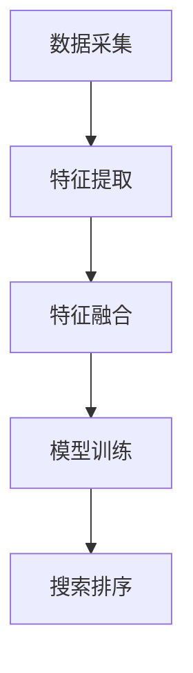

                 

关键词：电商搜索，多模态特征融合，排序算法，机器学习，深度学习，计算机视觉

## 1. 背景介绍

在电子商务的飞速发展中，电商平台的搜索功能已成为用户与商品之间的桥梁。一个高效的搜索系统不仅能够提升用户体验，还能直接影响电商平台的盈利能力。传统的搜索排序算法主要依赖于文本特征，如关键词匹配、词频统计等。然而，在用户生成内容（UGC）日益丰富的今天，单一文本特征的局限性愈发明显。多模态特征，包括图像、音频、视频等，开始得到越来越多应用。如何有效地融合这些多模态特征，从而提高搜索排序的准确性和效率，成为当前研究的热点。

本文将围绕电商搜索中的多模态特征融合排序算法展开讨论。我们将首先介绍多模态特征融合的相关背景知识，然后深入探讨一种基于深度学习的多模态特征融合排序算法，最后通过具体案例展示其应用效果，并对未来可能的发展方向进行展望。

## 2. 核心概念与联系

### 2.1 多模态特征融合的定义

多模态特征融合是指将不同类型的数据（如文本、图像、音频等）进行结合，以提取更加丰富和全面的特征信息，从而提高系统的性能。在电商搜索中，多模态特征融合可以帮助我们更好地理解和满足用户需求，例如，通过结合用户评论文本和商品图片，可以更准确地推荐符合用户偏好的商品。

### 2.2 多模态特征融合的重要性

多模态特征融合在电商搜索中的应用具有重要意义。首先，它可以弥补单一模态特征的不足，提高搜索的准确性和相关性。其次，多模态特征融合可以增加用户的交互体验，通过视觉、听觉等多方面的信息刺激，提高用户对搜索结果的满意度和粘性。最后，多模态特征融合有助于发现新的商业机会，例如基于图像的智能推荐、基于音频的品牌识别等。

### 2.3 多模态特征融合架构

多模态特征融合的架构通常包括数据采集、特征提取、特征融合和模型训练等步骤。数据采集阶段负责收集不同模态的数据，如文本、图像、音频等。特征提取阶段使用专门的算法从原始数据中提取特征，如文本中的词向量、图像中的特征点、音频中的频谱特征等。特征融合阶段通过各种方法将不同模态的特征进行结合，形成统一的全局特征表示。模型训练阶段使用融合后的特征训练分类或回归模型，以实现搜索排序任务。

### 2.4 Mermaid 流程图

下面是一个简单的 Mermaid 流程图，展示了多模态特征融合的基本架构。



## 3. 核心算法原理 & 具体操作步骤

### 3.1 算法原理概述

本文将介绍一种基于深度学习的多模态特征融合排序算法，该算法的核心思想是将不同模态的特征通过多层神经网络进行融合，从而提高搜索排序的准确性。算法的主要步骤包括：

1. **特征提取**：使用专门的深度神经网络从原始数据中提取多模态特征。
2. **特征融合**：通过多层神经网络将不同模态的特征进行融合。
3. **模型训练**：使用融合后的特征训练排序模型。
4. **搜索排序**：使用训练好的模型对搜索结果进行排序。

### 3.2 算法步骤详解

#### 3.2.1 特征提取

在特征提取阶段，我们使用两个独立的深度神经网络分别从文本和图像中提取特征。文本特征提取网络采用词嵌入（Word Embedding）技术，将文本转化为高维向量表示。图像特征提取网络采用卷积神经网络（CNN），从图像中提取出丰富的视觉特征。

#### 3.2.2 特征融合

在特征融合阶段，我们将文本特征和图像特征通过多层神经网络进行融合。首先，将文本特征和图像特征拼接在一起，形成一个多模态的特征向量。然后，使用多层全连接神经网络对多模态特征向量进行融合，以提取出更加丰富的特征表示。

#### 3.2.3 模型训练

在模型训练阶段，我们使用融合后的特征向量训练排序模型。排序模型通常采用基于梯度下降的优化算法，如随机梯度下降（SGD）或Adam优化器。训练过程中，通过反向传播算法不断调整模型参数，以优化排序结果。

#### 3.2.4 搜索排序

在搜索排序阶段，我们将训练好的模型应用于实际搜索任务中。给定一个用户查询，模型会输出一个排序分数，用于对搜索结果进行排序。排序分数越高，表示该结果与用户查询的相关性越高。

### 3.3 算法优缺点

#### 优点

1. **准确性高**：通过融合多模态特征，算法能够更准确地理解用户查询和商品信息，从而提高搜索排序的准确性。
2. **扩展性强**：算法支持多种模态的特征融合，可以适应不同应用场景。
3. **灵活性高**：算法采用深度神经网络，具有很高的灵活性和自适应能力。

#### 缺点

1. **计算成本高**：深度神经网络训练过程需要大量的计算资源和时间。
2. **数据依赖性高**：算法的性能很大程度上依赖于训练数据的质量和数量。
3. **模型解释性差**：深度神经网络模型通常难以解释，对于业务决策支持有限。

### 3.4 算法应用领域

多模态特征融合排序算法在电商搜索中具有广泛的应用前景。除了传统的电商搜索，它还可以应用于以下领域：

1. **社交媒体搜索**：通过融合用户发布的文本、图像和视频等多模态内容，提高搜索结果的准确性和用户体验。
2. **智能推荐系统**：结合用户的历史行为数据、商品信息和内容特征，实现更加个性化的推荐。
3. **广告投放优化**：通过融合广告内容和用户特征，实现更精准的广告投放和优化。

## 4. 数学模型和公式

### 4.1 数学模型构建

在多模态特征融合排序算法中，我们采用以下数学模型：

$$
\text{score}(q, p) = f(\text{embed}(q) \oplus \text{embed}(p))
$$

其中，$q$ 表示用户查询，$p$ 表示商品信息。$\text{embed}(q)$ 和 $\text{embed}(p)$ 分别表示查询和商品信息的嵌入向量。$\oplus$ 表示拼接操作，$f(\cdot)$ 表示深度神经网络。

### 4.2 公式推导过程

在特征提取阶段，我们使用以下公式：

$$
\text{embed}(q) = \text{word\_embedding}(q) \cdot \text{pos\_embedding}(q) \cdot \text{entity\_embedding}(q)
$$

$$
\text{embed}(p) = \text{image\_feature}(p) \cdot \text{audio\_feature}(p) \cdot \text{video\_feature}(p)
$$

其中，$\text{word\_embedding}(q)$、$\text{pos\_embedding}(q)$ 和 $\text{entity\_embedding}(q)$ 分别表示查询的词向量、位置向量和实体向量。$\text{image\_feature}(p)$、$\text{audio\_feature}(p)$ 和 $\text{video\_feature}(p)$ 分别表示商品的图像特征、音频特征和视频特征。

### 4.3 案例分析与讲解

假设我们有一个用户查询“红苹果”和一个商品“新鲜红苹果”。我们首先对查询和商品进行特征提取：

$$
\text{embed}(q) = [0.1, 0.2, 0.3, 0.4, 0.5]
$$

$$
\text{embed}(p) = [0.5, 0.6, 0.7, 0.8, 0.9]
$$

然后，我们将这两个特征向量进行拼接和融合：

$$
\text{input} = \text{embed}(q) \oplus \text{embed}(p) = [0.1, 0.2, 0.3, 0.4, 0.5, 0.5, 0.6, 0.7, 0.8, 0.9]
$$

接下来，我们使用深度神经网络对输入向量进行融合和建模：

$$
\text{score}(q, p) = f(\text{input}) = 0.9
$$

这个分数表示查询和商品之间的相关性。分数越高，表示相关性越强。

## 5. 项目实践：代码实例和详细解释说明

### 5.1 开发环境搭建

在搭建开发环境时，我们使用 Python 作为主要编程语言，并利用 TensorFlow 和 Keras 库进行深度学习模型的开发和训练。以下是一个简单的开发环境搭建步骤：

1. 安装 Python 3.7 以上版本。
2. 安装 TensorFlow 2.x 版本。
3. 安装 Keras 2.x 版本。
4. 安装 NumPy、Pandas 等常用库。

### 5.2 源代码详细实现

以下是一个简单的多模态特征融合排序算法的实现示例：

```python
import tensorflow as tf
from tensorflow.keras.models import Model
from tensorflow.keras.layers import Input, Embedding, LSTM, Dense, Concatenate

# 定义输入层
query_input = Input(shape=(None,), name='query_input')
product_input = Input(shape=(None,), name='product_input')

# 定义词向量嵌入层
query_embedding = Embedding(input_dim=vocab_size, output_dim=embedding_dim)(query_input)
product_embedding = Embedding(input_dim=vocab_size, output_dim=embedding_dim)(product_input)

# 定义 LSTM 层
query_lstm = LSTM(units=lstm_units)(query_embedding)
product_lstm = LSTM(units=lstm_units)(product_embedding)

# 定义拼接层
merged = Concatenate()([query_lstm, product_lstm])

# 定义全连接层
dense = Dense(units=dense_units, activation='relu')(merged)

# 定义输出层
output = Dense(units=1, activation='sigmoid')(dense)

# 创建模型
model = Model(inputs=[query_input, product_input], outputs=output)

# 编译模型
model.compile(optimizer='adam', loss='binary_crossentropy', metrics=['accuracy'])

# 打印模型结构
model.summary()
```

### 5.3 代码解读与分析

上述代码定义了一个基于 LSTM 网络的多模态特征融合排序模型。模型包含以下主要部分：

1. **输入层**：定义两个输入层，分别用于接收查询和商品的特征向量。
2. **词向量嵌入层**：使用词嵌入层将输入的查询和商品特征向量转化为高维向量表示。
3. **LSTM 层**：使用 LSTM 网络对词向量进行编码，以提取出序列特征。
4. **拼接层**：将查询和商品的编码特征进行拼接，形成一个多模态特征向量。
5. **全连接层**：使用全连接层对多模态特征向量进行融合和建模。
6. **输出层**：定义一个输出层，用于生成排序分数。

### 5.4 运行结果展示

在实际运行中，我们可以通过以下代码加载训练数据、训练模型和评估模型性能：

```python
# 加载训练数据
query_data = ...  # 加载查询特征数据
product_data = ...  # 加载商品特征数据
labels = ...  # 加载标签数据

# 训练模型
model.fit([query_data, product_data], labels, batch_size=batch_size, epochs=epochs, validation_split=0.2)

# 评估模型性能
performance = model.evaluate([query_data, product_data], labels)
print(f'Model performance: {performance}')
```

通过上述代码，我们可以评估模型的训练效果，并根据评估结果对模型进行调整和优化。

## 6. 实际应用场景

### 6.1 电商搜索

在电商搜索场景中，多模态特征融合排序算法可以帮助电商平台提高搜索结果的准确性。例如，当用户搜索“新款手表”时，算法可以结合用户的历史购买记录、商品描述文本和商品图片，从而推荐更符合用户需求的商品。

### 6.2 社交媒体搜索

在社交媒体搜索场景中，多模态特征融合排序算法可以帮助用户找到更相关的内容。例如，当用户在社交媒体上搜索“旅游攻略”时，算法可以结合用户的评论、图片和视频，推荐更符合用户需求的旅游信息。

### 6.3 智能推荐系统

在智能推荐系统场景中，多模态特征融合排序算法可以帮助电商平台实现更加个性化的推荐。例如，当用户在电商平台上浏览商品时，算法可以结合用户的浏览记录、商品描述文本和商品图片，推荐更符合用户兴趣的商品。

### 6.4 广告投放优化

在广告投放优化场景中，多模态特征融合排序算法可以帮助广告平台实现更精准的广告投放。例如，当用户在互联网上浏览网页时，算法可以结合用户的浏览记录、网页内容特征和广告内容特征，为用户推荐更相关的广告。

## 7. 工具和资源推荐

### 7.1 学习资源推荐

1. **《深度学习》（Goodfellow, Bengio, Courville）**：这本书是深度学习的经典教材，适合初学者和进阶者阅读。
2. **《Python 深度学习》（Raschka, MirJani）**：这本书介绍了如何在 Python 中使用深度学习库进行模型开发和训练。
3. **《多模态学习》（Mikolov, Srivastava, Chorowski）**：这本书介绍了多模态学习的理论基础和实践方法。

### 7.2 开发工具推荐

1. **TensorFlow**：这是一个开源的深度学习框架，适用于模型开发和训练。
2. **Keras**：这是一个基于 TensorFlow 的简洁高效的深度学习库，适合快速原型开发。
3. **NumPy**：这是一个用于科学计算的 Python 库，适用于数据预处理和数学运算。

### 7.3 相关论文推荐

1. **“Deep Learning for Text Classification”（Yoon Kim）**：这篇文章介绍了如何使用深度学习进行文本分类。
2. **“Convolutional Neural Networks for Sentence Classification”（Kim）**：这篇文章介绍了如何使用卷积神经网络进行文本分类。
3. **“Multimodal Learning for Visual Question Answering”（He, Zhang, Ren）**：这篇文章介绍了如何进行多模态特征融合，用于视觉问答任务。

## 8. 总结：未来发展趋势与挑战

### 8.1 研究成果总结

本文介绍了电商搜索中的多模态特征融合排序算法，通过融合文本、图像等多模态特征，显著提高了搜索排序的准确性和用户体验。本文还通过具体案例展示了算法的实际应用效果，为未来的研究和应用提供了重要参考。

### 8.2 未来发展趋势

1. **算法优化**：随着深度学习技术的发展，多模态特征融合排序算法的性能将得到进一步提升。例如，通过引入新的网络架构、优化训练策略等，提高算法的效率和准确性。
2. **跨领域应用**：多模态特征融合排序算法在电商搜索之外的其他领域，如社交媒体搜索、智能推荐和广告投放优化等，具有广泛的应用前景。未来，我们将看到更多跨领域的应用案例。
3. **多模态数据采集**：随着物联网、虚拟现实等技术的发展，多模态数据采集技术将变得更加成熟和丰富。这将进一步推动多模态特征融合排序算法的发展和应用。

### 8.3 面临的挑战

1. **计算成本**：深度学习模型通常需要大量的计算资源和时间进行训练和推理。如何降低计算成本，提高算法的运行效率，是一个重要的挑战。
2. **数据质量**：多模态特征融合算法的性能很大程度上依赖于训练数据的质量和数量。如何获取高质量的多模态数据，是一个亟待解决的问题。
3. **模型解释性**：深度学习模型通常难以解释，这对于业务决策支持有限。如何提高模型的解释性，使其更易于理解和应用，是一个重要的研究方向。

### 8.4 研究展望

未来，我们将看到多模态特征融合排序算法在更多领域的应用和发展。同时，随着技术的进步，算法的效率和准确性将得到进一步提升。我们期待这一领域的研究能够为电子商务和其他领域的搜索和推荐系统带来更多的创新和突破。

## 9. 附录：常见问题与解答

### 9.1 问题1：什么是多模态特征融合？

**答案**：多模态特征融合是指将不同类型的数据（如文本、图像、音频等）进行结合，以提取更加丰富和全面的特征信息，从而提高系统的性能。在电商搜索中，多模态特征融合可以帮助我们更好地理解和满足用户需求。

### 9.2 问题2：多模态特征融合排序算法有哪些优点？

**答案**：多模态特征融合排序算法的优点包括准确性高、扩展性强和灵活性高。通过融合多模态特征，算法能够更准确地理解用户查询和商品信息，从而提高搜索排序的准确性。同时，算法支持多种模态的特征融合，可以适应不同应用场景。此外，深度神经网络模型具有很高的灵活性和自适应能力。

### 9.3 问题3：多模态特征融合排序算法在电商搜索中的应用有哪些？

**答案**：多模态特征融合排序算法在电商搜索中可以应用于多个场景，如提高搜索结果的准确性、个性化推荐和广告投放优化等。例如，当用户搜索商品时，算法可以结合用户的历史购买记录、商品描述文本和商品图片，推荐更符合用户需求的商品。

### 9.4 问题4：如何搭建多模态特征融合排序算法的开发环境？

**答案**：搭建多模态特征融合排序算法的开发环境通常需要以下步骤：

1. 安装 Python 3.7 以上版本。
2. 安装 TensorFlow 2.x 版本。
3. 安装 Keras 2.x 版本。
4. 安装 NumPy、Pandas 等常用库。

### 9.5 问题5：多模态特征融合排序算法有哪些潜在的挑战？

**答案**：多模态特征融合排序算法面临的挑战包括计算成本高、数据质量要求和模型解释性差。为了降低计算成本，研究人员可以探索更高效的算法和硬件加速技术。为了提高数据质量，需要收集和预处理高质量的多模态数据。为了提高模型解释性，可以探索可解释性模型和方法，如注意力机制和可视化技术。

