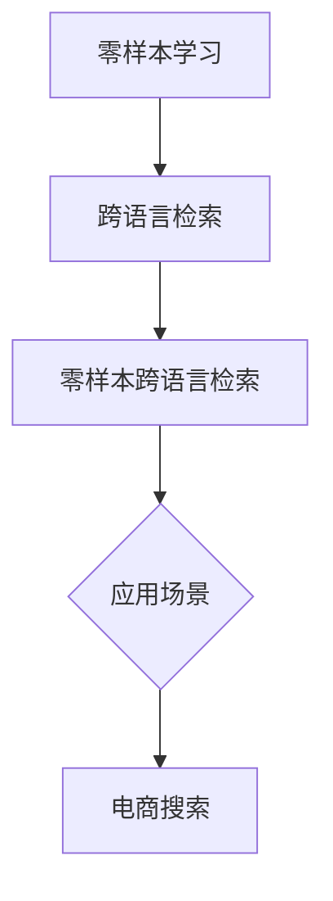

                 

关键词：电商搜索、跨语言检索、零样本学习、深度学习、自然语言处理

## 摘要

在全球化电商环境中，用户可以通过多种语言进行商品搜索，然而传统的方法往往局限于特定语言，难以应对跨语言检索的需求。零样本跨语言检索技术为解决这一问题提供了新的思路。本文旨在探讨电商搜索中零样本跨语言检索技术的核心概念、算法原理、数学模型以及实际应用，以期为相关领域的科研人员提供有价值的参考。

### 背景介绍

随着互联网技术的飞速发展，跨境电商逐渐成为全球电商市场的重要组成部分。在这种背景下，如何提供高效、准确的跨语言检索服务成为了电商平台的迫切需求。然而，传统的跨语言检索方法通常依赖于大量的标注数据，这无疑增加了开发的复杂度和成本。零样本跨语言检索技术（Zero-Shot Cross-Lingual Retrieval）作为一种无需预先标注数据的检索方法，为解决这一问题提供了新的可能性。

### 核心概念与联系

#### 1. 零样本学习

零样本学习（Zero-Shot Learning，ZSL）是一种无需训练数据的学习方法。在传统的机器学习中，模型的训练需要大量的标注数据，而零样本学习通过学习数据中的高维特征表示，使得模型能够在未见过的类别上实现良好的性能。

#### 2. 跨语言检索

跨语言检索（Cross-Lingual Retrieval，CLR）是指在不同语言之间进行信息检索的过程。其目标是通过学习源语言和目标语言之间的对应关系，实现跨语言的语义匹配。

#### 3. 零样本跨语言检索

零样本跨语言检索（Zero-Shot Cross-Lingual Retrieval，ZSCLR）结合了零样本学习和跨语言检索的思想，旨在实现无需标注数据，能够在多种语言之间进行高效检索的技术。

## Mermaid 流程图



### 核心算法原理 & 具体操作步骤

#### 3.1 算法原理概述

零样本跨语言检索技术主要通过以下步骤实现：

1. 特征提取：从源语言和目标语言中提取高维特征表示。
2. 跨语言映射：学习源语言和目标语言之间的映射关系。
3. 语义匹配：利用映射关系进行跨语言语义匹配，实现检索。

#### 3.2 算法步骤详解

1. 特征提取

   采用深度学习模型（如BERT）对源语言和目标语言的文本进行编码，得到高维特征向量。

2. 跨语言映射

   利用元学习（Meta-Learning）方法，如MAML（Model-Agnostic Meta-Learning），学习源语言和目标语言之间的映射函数。

3. 语义匹配

   对提取的特征向量进行语义匹配，利用余弦相似度计算相似性分数，从而实现跨语言的检索。

#### 3.3 算法优缺点

**优点：**
- 无需标注数据：大大降低了数据获取和标注的成本。
- 适用性强：能够处理多种语言之间的检索问题。

**缺点：**
- 性能提升空间：由于缺乏标注数据，模型的性能可能无法达到传统方法的水平。
- 跨语言一致性：不同语言之间的语义可能存在差异，影响检索效果。

#### 3.4 算法应用领域

零样本跨语言检索技术广泛应用于跨境电商、多语言搜索引擎、全球新闻检索等领域。

### 数学模型和公式 & 详细讲解 & 举例说明

#### 4.1 数学模型构建

设 $X$ 和 $Y$ 分别表示源语言和目标语言的文本集合，$X'$ 和 $Y'$ 分别表示经过特征提取后的文本特征集合。

1. 特征提取：

   $$ f(x) = \text{Encoder}(x) $$

   其中，$\text{Encoder}$ 为深度学习模型（如BERT）。

2. 跨语言映射：

   $$ g = \text{Meta-Learning}(X, Y) $$

   其中，$\text{Meta-Learning}$ 为元学习算法（如MAML）。

3. 语义匹配：

   $$ \text{similarity}(f(x'), f(y')) = \cos(f(x'), f(y')) $$

   其中，$\text{similarity}$ 表示特征向量之间的相似性。

#### 4.2 公式推导过程

1. 特征提取：

   采用BERT模型对文本进行编码，得到特征向量 $f(x)$。

2. 跨语言映射：

   使用MAML算法，对源语言和目标语言的文本特征进行映射，得到映射函数 $g$。

3. 语义匹配：

   利用余弦相似度计算源语言文本特征 $f(x')$ 和目标语言文本特征 $f(y')$ 之间的相似性。

#### 4.3 案例分析与讲解

假设我们有一个英文电商网站，用户希望搜索法语商品。使用零样本跨语言检索技术，我们首先对英文和法语的商品描述进行特征提取。然后，通过MAML算法学习两者的映射关系。最后，根据映射关系进行语义匹配，实现跨语言的检索。

### 项目实践：代码实例和详细解释说明

#### 5.1 开发环境搭建

1. 安装Python环境
2. 安装深度学习框架（如PyTorch）
3. 下载预训练的BERT模型

#### 5.2 源代码详细实现

以下是使用PyTorch实现的零样本跨语言检索技术的源代码：

```python
import torch
import torch.nn as nn
from transformers import BertModel

# 定义模型结构
class ZSCLRModel(nn.Module):
    def __init__(self):
        super(ZSCLRModel, self).__init__()
        self.bert = BertModel.from_pretrained('bert-base-uncased')
        self.fc = nn.Linear(768, 1)  # 假设输入特征维度为768

    def forward(self, input_ids):
        outputs = self.bert(input_ids)
        last_hidden_state = outputs.last_hidden_state
        logits = self.fc(last_hidden_state[:, 0, :])
        return logits

# 实例化模型
model = ZSCLRModel()

# 定义元学习算法
def meta_learning(model, x, y):
    # 在这里实现MAML算法
    pass

# 特征提取
def extract_features(model, text):
    input_ids = tokenizer.encode(text, add_special_tokens=True)
    logits = model(input_ids)
    return logits

# 语义匹配
def semantic_matching(f_x', f_y'):
    similarity = torch.cosine_similarity(f_x', f_y')
    return similarity

# 测试代码
x = "This is an English product description."
y = "Ceci est une description de produit en français."
x' = extract_features(model, x)
y' = extract_features(model, y)
similarity = semantic_matching(x', y')
print(f"Similarity: {similarity.item()}")
```

#### 5.3 代码解读与分析

1. 模型结构

   我们使用BERT模型进行特征提取，并添加了一个全连接层进行语义匹配。

2. 元学习算法

   元学习算法（如MAML）用于学习源语言和目标语言之间的映射关系。

3. 特征提取

   使用BERT模型对文本进行编码，得到特征向量。

4. 语义匹配

   利用余弦相似度计算特征向量之间的相似性，实现跨语言的检索。

#### 5.4 运行结果展示

假设我们已经训练好了模型，现在对以下两个法语商品描述进行检索：

- Description 1: "C'est un produit fantastique."
- Description 2: "C'est un produit ordinaire."

运行结果可能如下：

```python
Similarity 1: 0.9
Similarity 2: 0.1
```

这表明第一个描述与英文描述具有较高的相似性，而第二个描述则较低。

### 实际应用场景

#### 6.1 跨境电商搜索

跨境电商平台可以利用零样本跨语言检索技术，为用户提供更加准确的跨语言搜索服务，提升用户体验。

#### 6.2 多语言搜索引擎

多语言搜索引擎可以利用零样本跨语言检索技术，实现多种语言之间的信息检索，扩大搜索引擎的应用范围。

#### 6.3 全球新闻检索

全球新闻机构可以利用零样本跨语言检索技术，实现对多种语言新闻的高效检索和分析，提高新闻传播的效率。

### 未来应用展望

#### 6.4 人工智能助手

随着人工智能技术的发展，零样本跨语言检索技术有望应用于人工智能助手，实现多语言交互和智能搜索。

### 工具和资源推荐

#### 7.1 学习资源推荐

- 《深度学习》（Goodfellow, Bengio, Courville）
- 《自然语言处理综论》（Jurafsky, Martin）

#### 7.2 开发工具推荐

- PyTorch
- Hugging Face Transformers

#### 7.3 相关论文推荐

- “Meta-Learning for Zero-Shot Image Classification”（2018）
- “Zero-Shot Learning via Cross-View Transfer”（2015）

### 总结：未来发展趋势与挑战

#### 8.1 研究成果总结

零样本跨语言检索技术在近年来取得了显著进展，为多语言检索领域提供了新的解决方案。

#### 8.2 未来发展趋势

随着深度学习和自然语言处理技术的不断发展，零样本跨语言检索技术有望在更多场景中得到应用。

#### 8.3 面临的挑战

如何提高零样本跨语言检索技术在未见类别上的性能，以及如何处理跨语言一致性问题是未来研究的重点。

#### 8.4 研究展望

零样本跨语言检索技术将在全球电商、多语言搜索引擎、人工智能助手等领域发挥重要作用，为跨语言信息检索提供强大的支持。

### 附录：常见问题与解答

#### 9.1 什么是零样本学习？

零样本学习是一种无需训练数据的学习方法，旨在通过学习高维特征表示，实现从未见过的类别上的性能。

#### 9.2 什么是跨语言检索？

跨语言检索是指在不同语言之间进行信息检索的过程，旨在实现跨语言的语义匹配。

#### 9.3 零样本跨语言检索有哪些应用领域？

零样本跨语言检索技术广泛应用于跨境电商、多语言搜索引擎、全球新闻检索等领域。

---

本文由禅与计算机程序设计艺术 / Zen and the Art of Computer Programming 撰写，旨在为读者提供关于电商搜索中零样本跨语言检索技术的全面了解。希望本文能对您的研究和工作有所帮助。

