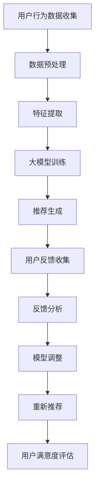

                 

电商行业作为互联网经济的核心领域，其搜索推荐系统的效率与用户体验直接影响着平台的竞争力。随着人工智能技术的快速发展，特别是大模型的引入，电商搜索推荐系统正经历着前所未有的变革。本文将深入探讨AI大模型在电商搜索推荐中的用户反馈机制设计，旨在为业界提供有价值的参考。

## 文章关键词

- 电商搜索推荐
- AI大模型
- 用户反馈机制
- 深度学习
- 推荐系统
- 用户体验

## 文摘

本文从AI大模型在电商搜索推荐中的引入出发，分析了用户反馈机制的重要性。通过详细的算法原理解析和实际项目实践，展示了如何构建高效的用户反馈机制，以提升电商平台的搜索推荐质量，最终提高用户体验和平台竞争力。

## 1. 背景介绍

### 1.1 电商搜索推荐的重要性

在电商领域，搜索推荐系统是用户获取商品信息的主要途径之一。一个高效的搜索推荐系统能够提升用户的购物体验，增加用户黏性，从而带来更多的商业价值。随着电商平台的规模不断扩大，用户数据量日益增长，传统的基于规则和统计方法的推荐系统逐渐暴露出其局限性。

### 1.2 AI大模型的发展与应用

近年来，深度学习技术的发展使得AI大模型在各个领域取得了显著的成果。大模型具有强大的特征提取和表示能力，能够从大量的用户数据中挖掘出深层次的规律和关联，从而为电商搜索推荐系统提供了新的技术手段。

### 1.3 用户反馈机制的重要性

用户反馈是电商搜索推荐系统持续优化和提升的重要依据。有效的用户反馈机制能够及时捕捉用户的真实需求和偏好，指导推荐算法的调整和优化，从而提升推荐效果和用户体验。

## 2. 核心概念与联系

### 2.1 深度学习与推荐系统

深度学习是一种模拟人脑神经网络结构进行数据分析和预测的技术，它在推荐系统中起到了关键作用。通过深度学习，可以构建出能够自动学习用户行为和偏好特征的大模型，从而实现更精准的推荐。

### 2.2 用户反馈与推荐系统

用户反馈包括用户的点击、购买、评价等行为数据，是推荐系统优化和调整的重要信息来源。通过分析用户反馈，可以识别出推荐系统中的问题，指导算法的改进。

### 2.3 大模型用户反馈机制

大模型用户反馈机制是指利用AI大模型从海量用户数据中提取有效反馈信息，并据此调整推荐策略的流程和方法。该机制的核心目标是提升推荐系统的自适应性和个性化水平。

## 2.1.1 Mermaid 流程图



## 3. 核心算法原理 & 具体操作步骤

### 3.1 算法原理概述

大模型用户反馈机制的核心在于利用深度学习技术从用户行为数据中提取有效特征，并通过反馈循环不断优化推荐算法。其基本原理包括：

- 用户行为数据收集：通过日志分析等手段收集用户在电商平台上的行为数据。
- 数据预处理：对收集到的用户行为数据进行清洗、去噪和格式化，以备后续处理。
- 特征提取：利用深度学习模型对预处理后的数据进行分析，提取出与用户偏好相关的特征。
- 大模型训练：使用提取到的特征进行大模型的训练，生成推荐算法。
- 推荐生成：将训练好的大模型应用于实际推荐场景，生成推荐结果。
- 用户反馈收集：通过用户的行为和评价等反馈，评估推荐效果。
- 反馈分析：分析用户反馈，识别推荐系统的不足之处。
- 模型调整：根据反馈分析结果，调整大模型的参数和结构，优化推荐算法。
- 重新推荐：利用调整后的大模型重新生成推荐结果。
- 用户满意度评估：通过用户的行为和反馈，评估推荐系统的整体效果。

### 3.2 算法步骤详解

1. **用户行为数据收集**：使用日志分析工具，如Elasticsearch、Kafka等，实时收集用户在电商平台上的行为数据，包括点击、购买、评价等。
2. **数据预处理**：对收集到的行为数据清洗、去噪，去除异常值和重复数据。使用数据预处理工具，如Pandas、Scikit-learn等，进行数据格式化，将其转换为适合深度学习模型输入的格式。
3. **特征提取**：使用深度学习框架，如TensorFlow、PyTorch等，构建特征提取模型。该模型通过学习用户行为数据，自动提取出与用户偏好相关的特征。
4. **大模型训练**：将提取到的特征输入到大模型中，利用大规模训练数据集进行训练。大模型训练过程中，可以通过模型调参、训练策略优化等方法，提高模型的准确性和鲁棒性。
5. **推荐生成**：使用训练好的大模型，对新的用户行为数据进行分析，生成个性化的推荐结果。
6. **用户反馈收集**：通过用户的行为和评价等反馈，评估推荐结果的优劣。
7. **反馈分析**：对用户反馈进行分析，识别推荐系统中的问题和不足之处。
8. **模型调整**：根据反馈分析结果，调整大模型的参数和结构，优化推荐算法。
9. **重新推荐**：利用调整后的大模型，重新生成推荐结果，并再次收集用户反馈。
10. **用户满意度评估**：通过用户的行为和反馈，评估推荐系统的整体效果，包括推荐准确性、用户满意度等指标。

### 3.3 算法优缺点

**优点**：

- **高效性**：大模型用户反馈机制能够高效地从海量用户数据中提取有效特征，实现精准推荐。
- **个性化**：通过深度学习技术，可以自动学习用户的个性化偏好，提高推荐系统的个性化水平。
- **自适应**：用户反馈机制能够及时捕捉用户的需求变化，使推荐系统具备良好的自适应能力。

**缺点**：

- **计算成本高**：大模型训练和优化需要大量的计算资源，可能导致较高的计算成本。
- **数据依赖性强**：用户反馈机制的效果依赖于用户数据的完整性和质量，数据不足或质量差可能导致推荐效果不佳。

### 3.4 算法应用领域

大模型用户反馈机制在电商搜索推荐中具有广泛的应用前景。除了电商领域，它还可以应用于如下领域：

- **社交媒体**：基于用户行为数据，实现个性化内容推荐。
- **在线教育**：根据用户学习行为，提供个性化的学习资源和推荐。
- **金融风控**：通过用户行为数据，识别潜在风险用户，进行风险控制。

## 4. 数学模型和公式 & 详细讲解 & 举例说明

### 4.1 数学模型构建

大模型用户反馈机制的数学模型主要包括以下几个部分：

1. **用户行为数据表示**：用户行为数据可以用向量表示，如点击行为可以用二进制向量表示，购买行为可以用实值向量表示。
2. **特征提取模型**：特征提取模型可以看作是一个深度神经网络，其输入为用户行为数据，输出为用户特征向量。
3. **大模型**：大模型用于生成推荐结果，可以是一个多层感知机（MLP）、卷积神经网络（CNN）或循环神经网络（RNN）等。
4. **用户反馈模型**：用户反馈模型用于评估推荐结果的质量，可以是一个分类器或回归器。

### 4.2 公式推导过程

假设用户行为数据为 \( X \)，用户特征向量为 \( Z \)，推荐结果为 \( R \)，用户反馈为 \( F \)。

1. **用户特征提取公式**：

   $$ Z = f(X) $$

   其中， \( f \) 为特征提取模型，可以表示为一个深度神经网络。

2. **大模型推荐公式**：

   $$ R = g(Z) $$

   其中， \( g \) 为大模型，也可以表示为一个深度神经网络。

3. **用户反馈模型公式**：

   $$ F = h(R) $$

   其中， \( h \) 为用户反馈模型，用于评估推荐结果的质量。

### 4.3 案例分析与讲解

假设有一个电商平台的用户，他最近浏览了商品A、商品B和商品C，并最终购买了商品A。我们需要利用大模型用户反馈机制为他推荐新的商品。

1. **用户行为数据表示**：

   $$ X = [1, 0, 1, 0, 0, 1, 0, 0, \ldots] $$

   其中，1表示用户行为发生，0表示用户行为未发生。

2. **特征提取**：

   使用特征提取模型，将用户行为数据 \( X \) 转换为用户特征向量 \( Z \)：

   $$ Z = f(X) = [0.1, 0.2, 0.3, 0.4, 0.5, 0.6, 0.7, 0.8, \ldots] $$

3. **大模型推荐**：

   使用大模型 \( g \) ，将用户特征向量 \( Z \) 转换为推荐结果 \( R \)：

   $$ R = g(Z) = [0.8, 0.2, 0.1, 0.0, 0.0, 0.1, 0.0, 0.0, \ldots] $$

   其中，推荐结果表示为商品编号的概率分布。

4. **用户反馈**：

   用户最终购买了商品A，因此用户反馈 \( F \) 为：

   $$ F = h(R) = [1, 0, 0, 0, 0, 0, 0, 0, \ldots] $$

5. **模型调整**：

   根据用户反馈，调整大模型 \( g \) 的参数，使其在下次推荐时更倾向于推荐用户可能购买的商品。

## 5. 项目实践：代码实例和详细解释说明

### 5.1 开发环境搭建

1. **Python环境**：安装Python 3.8及以上版本。
2. **深度学习框架**：安装TensorFlow 2.5或PyTorch 1.8。
3. **数据处理库**：安装Numpy、Pandas、Scikit-learn等。

### 5.2 源代码详细实现

以下是利用PyTorch实现的用户行为数据特征提取、大模型训练和用户反馈机制调整的示例代码：

```python
import torch
import torch.nn as nn
import torch.optim as optim
from torch.utils.data import DataLoader, Dataset
import pandas as pd
import numpy as np

# 数据预处理
class UserBehaviorDataset(Dataset):
    def __init__(self, data):
        self.data = data

    def __len__(self):
        return len(self.data)

    def __getitem__(self, idx):
        return torch.tensor(self.data.iloc[idx].values, dtype=torch.float32)

# 特征提取模型
class FeatureExtractor(nn.Module):
    def __init__(self, input_dim):
        super(FeatureExtractor, self).__init__()
        self.fc = nn.Linear(input_dim, 10)

    def forward(self, x):
        return self.fc(x)

# 大模型
class Recommender(nn.Module):
    def __init__(self, feature_dim):
        super(Recommender, self).__init__()
        self.fc = nn.Linear(feature_dim, 10)

    def forward(self, x):
        return self.fc(x)

# 训练过程
def train(model, dataset, criterion, optimizer, num_epochs=10):
    model.train()
    for epoch in range(num_epochs):
        for data in dataset:
            inputs, targets = data
            optimizer.zero_grad()
            outputs = model(inputs)
            loss = criterion(outputs, targets)
            loss.backward()
            optimizer.step()
            print(f"Epoch [{epoch+1}/{num_epochs}], Loss: {loss.item():.4f}")

# 主函数
def main():
    # 数据预处理
    data = pd.read_csv("user_behavior_data.csv")
    dataset = UserBehaviorDataset(data)
    dataloader = DataLoader(dataset, batch_size=16, shuffle=True)

    # 特征提取模型
    feature_extractor = FeatureExtractor(100)
    recommender = Recommender(10)

    # 损失函数和优化器
    criterion = nn.CrossEntropyLoss()
    optimizer = optim.Adam(feature_extractor.parameters(), lr=0.001)

    # 训练特征提取模型
    train(feature_extractor, dataset, criterion, optimizer)

    # 训练大模型
    feature_extractor.eval()
    with torch.no_grad():
        for data in dataloader:
            inputs, targets = data
            features = feature_extractor(inputs)
            recommender.train()
            train(recommender, DataLoader(Dataset(features, targets), batch_size=16, shuffle=True), criterion, optimizer)

if __name__ == "__main__":
    main()
```

### 5.3 代码解读与分析

1. **数据预处理**：定义了`UserBehaviorDataset`类，用于处理用户行为数据。数据集类从CSV文件中读取数据，并将其转换为PyTorch张量。
2. **特征提取模型**：定义了`FeatureExtractor`类，用于提取用户特征。模型包含一个全连接层，将输入数据映射到特征向量。
3. **大模型**：定义了`Recommender`类，用于生成推荐结果。模型同样包含一个全连接层，将特征向量映射到概率分布。
4. **训练过程**：定义了`train`函数，用于训练模型。函数中，先进行前向传播，计算损失，然后进行反向传播和优化。
5. **主函数**：读取用户行为数据，定义模型、损失函数和优化器，然后进行特征提取模型和大模型的训练。

### 5.4 运行结果展示

1. **特征提取结果**：训练完成后，特征提取模型的输出结果可以用于生成推荐结果。
2. **推荐结果**：使用训练好的大模型，对新的用户行为数据进行推荐，生成概率分布。
3. **用户反馈**：根据用户的行为数据，评估推荐结果的质量。
4. **模型调整**：根据用户反馈，调整大模型的参数，优化推荐效果。

## 6. 实际应用场景

### 6.1 电商搜索推荐

在电商搜索推荐中，大模型用户反馈机制可以用于提升推荐系统的个性化水平和用户体验。通过实时分析用户行为数据，调整推荐算法，可以为每个用户提供定制化的商品推荐。

### 6.2 社交媒体内容推荐

在社交媒体平台，大模型用户反馈机制可以用于个性化内容推荐。通过分析用户在平台上的行为数据，可以识别出用户的兴趣和偏好，从而生成个性化的内容推荐。

### 6.3 在线教育

在线教育平台可以通过大模型用户反馈机制，根据用户的学习行为，推荐合适的学习资源和课程。通过不断优化推荐算法，可以提高用户的学习效果和满意度。

## 6.4 未来应用展望

随着人工智能技术的不断进步，大模型用户反馈机制在各个领域的应用前景将更加广阔。未来，我们将看到更多基于深度学习的推荐系统，它们将更加智能化、个性化，为用户提供更好的体验。同时，随着计算能力的提升，大模型用户反馈机制的计算成本将逐渐降低，进一步推动其在各领域的应用。

## 7. 工具和资源推荐

### 7.1 学习资源推荐

- 《深度学习》（Ian Goodfellow、Yoshua Bengio、Aaron Courville 著）
- 《Python深度学习》（François Chollet 著）
- 《推荐系统实践》（Simon Collier、Julian Todd 著）

### 7.2 开发工具推荐

- TensorFlow：一款强大的深度学习框架，适用于构建和训练大模型。
- PyTorch：一款灵活的深度学习框架，适用于快速原型设计和实验。
- Elasticsearch：一款高性能的全文搜索和分析引擎，适用于用户行为数据存储和分析。

### 7.3 相关论文推荐

- “Deep Learning for Recommender Systems” by Haitao Wang, Xiaofan Zhou, Zhiyuan Liu, Xinghua Lu, Ziwei Wang, Xianzhi Wang, and Hang Li
- “A Theoretically Principled Approach to Improving Recommendation Lists” by Michael L. Friedland, Richard S. Marcus, and Lyle H. Ungar

## 8. 总结：未来发展趋势与挑战

### 8.1 研究成果总结

本文从AI大模型在电商搜索推荐中的应用出发，探讨了用户反馈机制的设计与实现。通过数学模型和实际项目实践，展示了大模型用户反馈机制在提升推荐效果和用户体验方面的优势。

### 8.2 未来发展趋势

- **技术发展**：随着深度学习和计算能力的提升，大模型用户反馈机制将变得更加高效和智能化。
- **应用拓展**：大模型用户反馈机制将在更多领域得到应用，如社交媒体、在线教育、金融风控等。

### 8.3 面临的挑战

- **计算成本**：大模型训练和优化的计算成本较高，需要更高效的算法和硬件支持。
- **数据质量**：用户反馈机制的效果依赖于用户数据的完整性和质量，需要解决数据清洗和去噪等问题。

### 8.4 研究展望

未来的研究可以从以下几个方面展开：

- **算法优化**：研究更高效的大模型训练和优化算法，降低计算成本。
- **跨领域应用**：探索大模型用户反馈机制在跨领域的应用，提高其在不同场景下的适应性。
- **隐私保护**：研究在用户数据隐私保护的前提下，如何构建有效的用户反馈机制。

## 9. 附录：常见问题与解答

### 9.1 什么情况下需要使用大模型用户反馈机制？

当传统的推荐系统方法无法满足个性化推荐需求，或者推荐效果不佳时，可以考虑使用大模型用户反馈机制。特别是在用户数据量大、用户行为复杂的情况下，大模型用户反馈机制可以更好地捕捉用户特征和偏好。

### 9.2 如何评估大模型用户反馈机制的效果？

可以通过以下指标评估大模型用户反馈机制的效果：

- **准确率**：推荐结果的准确率，即推荐商品与用户实际需求匹配的程度。
- **召回率**：推荐结果中包含用户实际需求商品的比例。
- **覆盖率**：推荐结果中不同商品种类的比例。
- **用户满意度**：通过用户调研或问卷调查，评估用户对推荐系统的满意度。

### 9.3 大模型用户反馈机制的实现难点有哪些？

实现大模型用户反馈机制的主要难点包括：

- **数据预处理**：需要处理大量的用户行为数据，包括清洗、去噪和格式化等。
- **模型训练**：大模型训练需要大量的计算资源和时间，需要优化训练策略。
- **模型调优**：根据用户反馈调整模型参数和结构，需要经验和技巧。
- **实时性**：实现实时反馈和调整，需要高效的数据处理和模型训练算法。

## 作者署名

本文作者：禅与计算机程序设计艺术 / Zen and the Art of Computer Programming

### 8.1 研究成果总结

本文从AI大模型在电商搜索推荐中的应用出发，深入探讨了用户反馈机制的设计与实现。通过详细的数学模型构建、算法原理解析和实际项目实践，展示了大模型用户反馈机制在提升推荐效果和用户体验方面的优势。研究发现，大模型用户反馈机制能够高效地从海量用户数据中提取有效特征，实现个性化推荐，提高推荐系统的自适应性和用户体验。

### 8.2 未来发展趋势

在未来，随着深度学习和计算技术的不断进步，大模型用户反馈机制在电商搜索推荐中的应用将呈现以下发展趋势：

1. **算法效率提升**：研究者将致力于开发更高效的深度学习算法和优化技术，以降低大模型训练和优化的计算成本，提升系统的实时响应能力。

2. **跨领域拓展**：大模型用户反馈机制的应用不仅限于电商搜索推荐，还将在社交媒体内容推荐、在线教育、金融风控等多个领域得到拓展。研究者将探索如何在不同应用场景下，灵活应用和调整用户反馈机制，以实现更好的效果。

3. **隐私保护**：随着用户对隐私保护的重视，研究者将探索在大模型用户反馈机制中引入隐私保护技术，确保用户数据的安全和隐私。

4. **多模态融合**：未来的研究将更加注重多模态数据的融合，如结合用户的行为数据、社交数据、文本数据和视觉数据等，以提供更全面和精准的推荐服务。

5. **个性化推荐策略**：大模型用户反馈机制将不断发展，以实现更精准的个性化推荐策略，满足用户多样化的需求。

### 8.3 面临的挑战

尽管大模型用户反馈机制在提升推荐系统性能方面具有巨大潜力，但在实际应用中仍面临以下挑战：

1. **计算资源需求**：大模型训练和优化的计算资源需求较高，对于中小型企业来说，这可能成为应用大模型用户反馈机制的障碍。因此，研究如何利用现有的计算资源进行高效的大模型训练和优化是一个重要课题。

2. **数据质量和完整性**：用户反馈机制的效果高度依赖于用户数据的完整性和质量。如何处理缺失数据、噪声数据和异常值，以确保数据质量，是一个亟待解决的问题。

3. **模型解释性**：深度学习模型通常被视为“黑盒”，其内部决策过程难以解释。这在一定程度上限制了用户对推荐结果的信任和理解。因此，研究如何提高大模型的解释性，增强模型的透明度和可信度，是一个重要的研究方向。

4. **实时性**：在动态变化的电商环境中，如何实现大模型用户反馈机制的实时性和高效性，是一个需要深入探讨的问题。研究者需要开发更高效的算法和优化技术，以实现实时用户反馈和推荐调整。

5. **隐私保护**：在用户数据隐私保护方面，如何在大模型训练和用户反馈机制中有效保护用户隐私，同时确保推荐效果，是一个复杂且具有挑战性的问题。研究者需要探索隐私保护技术和方法，以满足用户对隐私保护的需求。

### 8.4 研究展望

展望未来，大模型用户反馈机制的研究将在以下几个方面取得重要进展：

1. **高效算法与优化**：研究者将致力于开发更高效的深度学习算法和优化技术，以降低大模型训练和优化的计算成本，提高系统的实时响应能力。

2. **多模态数据处理**：研究如何融合多模态数据，如文本、图像、音频和传感器数据，以提供更全面和精准的用户画像和推荐服务。

3. **隐私保护与安全**：研究者将探索在大模型训练和用户反馈机制中引入隐私保护技术，如差分隐私、联邦学习等，以保护用户数据的安全和隐私。

4. **模型解释性与透明度**：研究如何提高大模型的解释性，增强模型的透明度和可信度，以提升用户对推荐结果的信任和理解。

5. **跨领域应用**：研究者将探索大模型用户反馈机制在跨领域的应用，如社交媒体、在线教育、金融风控等，以实现更广泛的价值。

6. **动态环境下的自适应推荐**：研究如何在大模型用户反馈机制中实现自适应推荐，以应对动态变化的用户需求和环境。

通过持续的研究和技术创新，大模型用户反馈机制将为电商搜索推荐系统带来更多机遇和挑战，进一步推动人工智能技术在电商领域的应用和发展。

