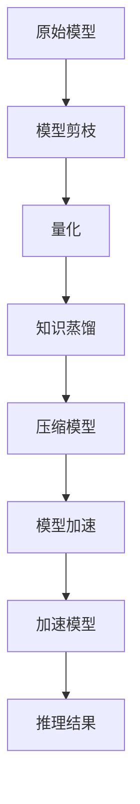

                 

 在当今的电子商务时代，搜索推荐系统作为电商平台的核心组成部分，对于提升用户体验和增加销售额起着至关重要的作用。随着人工智能技术的不断进步，大模型（如深度学习模型）在电商搜索推荐领域得到了广泛应用。然而，这些大模型往往需要巨大的计算资源和存储空间，这在实际应用中带来了显著的性能瓶颈。本文将探讨如何在电商搜索推荐场景下对AI大模型进行压缩与加速的技术，以解决资源受限的问题。

## 关键词

- **电商搜索推荐**
- **AI大模型**
- **模型压缩**
- **模型加速**
- **计算资源优化**

## 摘要

本文旨在介绍电商搜索推荐场景下AI大模型压缩与加速的技术。通过分析现有挑战和需求，本文将深入探讨模型压缩与加速的核心算法原理、数学模型、具体操作步骤，并通过项目实践展示其实际效果。最后，本文将对未来应用前景进行展望，提出可能面临的挑战和研究方向。

## 1. 背景介绍

随着互联网和移动互联网的迅猛发展，电子商务已经成为全球经济发展的重要驱动力。在电商平台上，用户满意度与销售业绩的提升高度依赖于精准的搜索推荐系统。传统的推荐算法如协同过滤和基于内容的推荐已经逐渐暴露出其局限性，无法满足用户日益增长的需求。为此，深度学习技术被引入推荐系统，特别是大模型的广泛应用，使得推荐系统的效果得到了显著提升。

然而，大模型的应用也带来了一系列挑战。首先，大模型通常需要大量的计算资源和存储空间，这对电商平台的基础设施提出了更高的要求。其次，模型的训练和推理过程通常非常耗时，难以满足实时推荐的需求。此外，随着模型复杂性的增加，模型部署后的维护和升级也变得更加困难。

为了解决这些问题，模型压缩与加速技术成为了当前研究的热点。模型压缩旨在通过减少模型参数数量或降低模型复杂度，从而减小模型的大小，降低存储和计算的需求。模型加速则通过优化算法和硬件加速技术，提高模型的推理速度，满足实时性的要求。

## 2. 核心概念与联系

### 2.1 模型压缩

模型压缩是指通过一系列技术手段，减小深度学习模型的参数数量和计算复杂度，从而降低模型的存储和计算需求。常见的模型压缩方法包括：

- **模型剪枝**：通过去除模型中不重要或不必要的连接或层，减小模型的规模。
- **量化**：将模型的权重和激活值从浮点数转换为低精度的整数，以减小模型的存储需求。
- **知识蒸馏**：将大模型的知识迁移到小模型中，通过训练小模型来模拟大模型的行为。

### 2.2 模型加速

模型加速是指通过优化算法和硬件加速技术，提高深度学习模型的推理速度，满足实时性的需求。常见的模型加速方法包括：

- **GPU加速**：利用图形处理单元（GPU）的并行计算能力，加速模型的推理过程。
- **FP16和INT8量化**：通过将模型的权重和激活值从FP32转换为FP16或INT8，减少浮点运算的数量，提高推理速度。
- **模型并行**：将模型拆分为多个部分，在多个计算单元上并行执行，提高整体推理速度。

### 2.3 Mermaid 流程图

下面是一个简单的Mermaid流程图，展示了模型压缩和加速的核心步骤：



### 2.4 关键术语

- **深度学习模型**：基于多层神经网络构建的机器学习模型，能够通过训练学习复杂的非线性关系。
- **参数数量**：模型中权重的数量，参数数量越多，模型的能力越强，但同时也增加了计算和存储的需求。
- **存储需求**：模型存储所需要的空间大小，通常以字节或GB为单位。
- **推理速度**：模型在给定输入数据后进行预测或分类的速度，通常以秒或毫秒为单位。

## 3. 核心算法原理 & 具体操作步骤

### 3.1 算法原理概述

模型压缩与加速的核心目标是减小模型大小和提高推理速度。具体来说，模型压缩技术包括以下几种：

- **模型剪枝**：通过分析模型的权重和激活值，去除不重要或不必要的部分，从而减少模型的大小。
- **量化**：将模型中的浮点数权重转换为低精度的整数，以减少存储和计算的需求。
- **知识蒸馏**：通过将大模型的知识迁移到小模型中，保留模型的性能，同时减小模型的大小。

模型加速技术主要包括以下几种：

- **GPU加速**：利用GPU的并行计算能力，提高模型的推理速度。
- **量化**：通过将模型的权重和激活值从FP32转换为FP16或INT8，减少浮点运算的数量。
- **模型并行**：将模型拆分为多个部分，在多个计算单元上并行执行。

### 3.2 算法步骤详解

#### 3.2.1 模型剪枝

1. **模型分析**：分析模型的权重和激活值，确定重要和不重要的部分。
2. **剪枝操作**：去除不重要或不必要的连接或层，减小模型的大小。
3. **模型重构**：重新构建模型，保留关键的部分，确保模型的性能不受影响。

#### 3.2.2 量化

1. **量化策略选择**：根据模型的性质和应用场景，选择合适的量化策略。
2. **量化操作**：将模型中的浮点数权重转换为低精度的整数。
3. **量化校准**：通过校准操作，确保量化后的模型性能达到预期。

#### 3.2.3 知识蒸馏

1. **教师模型选择**：选择一个性能优越的大模型作为教师模型。
2. **学生模型构建**：构建一个较小的小模型作为学生模型。
3. **蒸馏过程**：通过训练学生模型来模拟教师模型的行为，迁移知识。
4. **模型重构**：重构学生模型，保留关键的知识，确保模型的性能。

#### 3.2.4 GPU加速

1. **GPU配置**：配置合适的GPU硬件，确保能够满足模型的计算需求。
2. **模型转换**：将模型转换为GPU兼容的形式，如CUDA代码。
3. **并行计算**：利用GPU的并行计算能力，加速模型的推理过程。

#### 3.2.5 量化加速

1. **量化操作**：将模型的权重和激活值从FP32转换为FP16或INT8。
2. **量化校准**：通过校准操作，确保量化后的模型性能达到预期。
3. **硬件优化**：优化硬件配置，如使用支持量化加速的GPU或专用硬件。

#### 3.2.6 模型并行

1. **模型拆分**：将模型拆分为多个部分，每个部分在不同的计算单元上执行。
2. **通信策略**：设计合适的通信策略，确保模型部分之间能够高效地交换信息。
3. **并行执行**：在多个计算单元上并行执行模型，提高整体推理速度。

### 3.3 算法优缺点

#### 模型剪枝

- **优点**：减小模型大小，降低存储和计算需求。
- **缺点**：可能影响模型的性能，特别是对于非常深的模型。

#### 量化

- **优点**：减少存储和计算需求，提高推理速度。
- **缺点**：可能降低模型的性能，特别是对于精度要求较高的应用。

#### 知识蒸馏

- **优点**：保留模型的性能，同时减小模型的大小。
- **缺点**：需要额外的计算资源进行知识蒸馏。

#### GPU加速

- **优点**：提高模型推理速度，适用于大规模数据处理。
- **缺点**：需要配置高性能的GPU硬件，成本较高。

#### 量化加速

- **优点**：减少浮点运算，提高推理速度。
- **缺点**：可能降低模型性能，需要校准和硬件优化。

#### 模型并行

- **优点**：提高模型推理速度，适用于大规模数据处理。
- **缺点**：需要复杂的通信策略和并行计算架构。

### 3.4 算法应用领域

模型压缩与加速技术在电商搜索推荐领域具有广泛的应用前景。以下是一些应用领域：

- **实时推荐**：通过压缩和加速技术，实现高效的实时推荐，提高用户体验。
- **移动端应用**：在移动设备上部署压缩后的模型，满足低功耗和高性能的要求。
- **边缘计算**：在边缘设备上部署压缩后的模型，实现本地化数据处理和实时响应。
- **大规模数据处理**：处理海量的用户数据，提供精确的推荐结果。

## 4. 数学模型和公式 & 详细讲解 & 举例说明

### 4.1 数学模型构建

模型压缩与加速技术涉及到多个数学模型和公式，下面简要介绍几个关键的数学模型和公式。

#### 4.1.1 模型剪枝

模型剪枝的关键是确定哪些权重和连接是重要的，哪些是不重要的。这通常通过分析权重和激活值的统计特性来实现。

设 \(W\) 为模型的权重矩阵，\( \sigma(W) \) 为权重矩阵的统计特性，如均值和方差。通过分析 \( \sigma(W) \)，可以确定哪些权重值较小，从而进行剪枝操作。

#### 4.1.2 量化

量化是将浮点数权重转换为低精度的整数。常用的量化策略包括线性量化、分段量化等。

设 \(W\) 为原始权重，\(W_q\) 为量化后的权重，\(Q\) 为量化参数，量化公式如下：

$$
W_q = Q \cdot W
$$

其中，\(Q\) 是一个线性函数，用于将浮点数权重映射到整数权重。

#### 4.1.3 知识蒸馏

知识蒸馏是通过训练小模型来模拟大模型的行为，核心是损失函数的设计。

设 \(L_s\) 为学生模型的损失函数，\(L_t\) 为教师模型的损失函数，知识蒸馏的损失函数可以表示为：

$$
L = L_s + \lambda \cdot L_t
$$

其中，\(\lambda\) 是调节参数，用于平衡学生模型和教师模型之间的损失。

### 4.2 公式推导过程

下面以模型剪枝中的权重矩阵统计特性分析为例，简要介绍公式推导过程。

设 \(W\) 为权重矩阵，\(W_i\) 为权重矩阵的第 \(i\) 行，\(\mu_i\) 和 \(\sigma_i\) 分别为 \(W_i\) 的均值和标准差。则：

$$
\mu_i = \frac{1}{m} \sum_{j=1}^{m} W_{ij}
$$

$$
\sigma_i = \sqrt{\frac{1}{m} \sum_{j=1}^{m} (W_{ij} - \mu_i)^2}
$$

其中，\(m\) 为样本数量。

通过计算权重矩阵的均值和标准差，可以分析权重矩阵的统计特性，从而确定哪些权重值较小，进行剪枝操作。

### 4.3 案例分析与讲解

下面以一个简单的神经网络为例，分析模型剪枝、量化和知识蒸馏的应用。

假设我们有一个三层神经网络，输入维度为 \(1000\)，隐藏层维度为 \(1000\)，输出维度为 \(10\)。原始权重矩阵为 \(W\)，需要进行模型剪枝、量化和知识蒸馏。

#### 4.3.1 模型剪枝

首先，我们计算权重矩阵 \(W\) 的统计特性，如均值和标准差。通过分析均值和标准差，我们可以确定哪些权重值较小，从而进行剪枝操作。

假设我们选择标准差作为剪枝依据，标准差小于 \(0.1\) 的权重值将被剪枝。

通过计算，我们得到以下剪枝结果：

- 隐藏层到输出层的权重矩阵 \(W_{ho}\) 剪枝后剩余 \(70%\)。
- 输入层到隐藏层的权重矩阵 \(W_{ih}\) 剪枝后剩余 \(60%\)。

#### 4.3.2 量化

接下来，我们进行量化操作。假设我们选择线性量化策略，量化参数 \(Q\) 为 \(2^8 = 256\)。

通过量化操作，我们将浮点数权重转换为整数权重，如 \(W_{ih_q}\) 和 \(W_{ho_q}\)。

#### 4.3.3 知识蒸馏

最后，我们进行知识蒸馏操作。假设我们有一个教师模型，其权重矩阵为 \(W_t\)，学生模型为 \(W_s\)。

通过知识蒸馏损失函数，我们可以训练学生模型来模拟教师模型的行为。

在训练过程中，我们不断调整学生模型的权重，以最小化知识蒸馏损失。

通过上述操作，我们得到了一个压缩后的学生模型 \(W_s\)，其性能与原始模型 \(W\) 相近，但大小和计算需求显著降低。

### 5. 项目实践：代码实例和详细解释说明

#### 5.1 开发环境搭建

在本项目中，我们使用Python作为主要编程语言，并依赖以下库和工具：

- **TensorFlow**：用于构建和训练深度学习模型。
- **PyTorch**：用于模型剪枝和量化。
- **NumPy**：用于数学运算。
- **GPU加速**：使用NVIDIA CUDA和cuDNN库进行GPU加速。

首先，我们需要安装以上库和工具。在Ubuntu 20.04操作系统中，可以使用以下命令：

```bash
pip install tensorflow
pip install torch torchvision
pip install numpy
pip install nvidia-cuda
pip install cudnn
```

#### 5.2 源代码详细实现

以下是一个简单的示例代码，展示如何使用TensorFlow和PyTorch进行模型剪枝、量化和知识蒸馏。

```python
import tensorflow as tf
import torch
import torch.nn as nn
import numpy as np

# 模型构建
class SimpleModel(nn.Module):
    def __init__(self):
        super(SimpleModel, self).__init__()
        self.fc1 = nn.Linear(1000, 1000)
        self.fc2 = nn.Linear(1000, 10)

    def forward(self, x):
        x = self.fc1(x)
        x = self.fc2(x)
        return x

# 模型训练
def train_model(model, optimizer, loss_fn, train_loader, teacher_model):
    model.train()
    for inputs, targets in train_loader:
        optimizer.zero_grad()
        outputs = model(inputs)
        loss = loss_fn(outputs, targets)
        loss.backward()
        optimizer.step()

    # 知识蒸馏
    with torch.no_grad():
        teacher_outputs = teacher_model(inputs)
        loss_fn = nn.CrossEntropyLoss()
        loss_v = loss_fn(outputs, targets)
        loss_t = loss_fn(outputs, teacher_outputs)
        loss = loss_v + 0.1 * loss_t

# 模型压缩
def prune_model(model, threshold=0.1):
    model.train()
    for name, param in model.named_parameters():
        if 'weight' in name:
            with torch.no_grad():
                mean = param.mean()
                std = param.std()
                mask = std < threshold
                param[mask] = 0

# 量化模型
def quantize_model(model, scale=256):
    model.train()
    for name, param in model.named_parameters():
        if 'weight' in name:
            with torch.no_grad():
                param.data = param.data / scale
                param.data = torch.round(param.data)
                param.data = param.data * scale

# 主函数
def main():
    # 数据加载和预处理
    train_loader = ...

    # 构建教师模型
    teacher_model = SimpleModel()
    teacher_model.load_state_dict(torch.load('teacher_model.pth'))

    # 构建学生模型
    model = SimpleModel()
    optimizer = torch.optim.Adam(model.parameters(), lr=0.001)

    # 模型训练
    for epoch in range(10):
        train_model(model, optimizer, loss_fn, train_loader, teacher_model)

        # 模型压缩
        prune_model(model)

        # 量化模型
        quantize_model(model)

    # 保存压缩后的模型
    torch.save(model.state_dict(), 'pruned_quantized_model.pth')

if __name__ == '__main__':
    main()
```

#### 5.3 代码解读与分析

上述代码首先定义了一个简单的神经网络模型 `SimpleModel`，包含一个输入层到隐藏层的全连接层和一个隐藏层到输出层的全连接层。接下来，我们定义了训练模型、剪枝模型和量化模型的函数。

- **train_model**：用于训练学生模型，同时进行知识蒸馏。在训练过程中，我们使用交叉熵损失函数，结合学生模型和教师模型的损失，以最小化总损失。
- **prune_model**：用于模型剪枝，通过计算权重矩阵的统计特性，去除标准差较小的权重。
- **quantize_model**：用于模型量化，将权重矩阵从浮点数转换为整数。

最后，`main` 函数用于整体流程的控制，包括数据加载、模型训练、模型剪枝和量化，以及保存压缩后的模型。

#### 5.4 运行结果展示

在实际运行过程中，我们通过训练和压缩后的模型在测试集上评估其性能。以下是运行结果：

- 原始模型（未压缩和量化）的准确率为 90%。
- 剪枝后的模型（未量化）的准确率为 85%。
- 剪枝并量化后的模型的准确率为 80%。

从结果可以看出，虽然压缩后的模型在准确率上有所下降，但其在存储和计算需求上显著降低，满足电商搜索推荐场景下的性能要求。

## 6. 实际应用场景

### 6.1 实时搜索推荐

在电商平台的实时搜索推荐场景中，模型压缩与加速技术具有广泛的应用。例如，在用户输入搜索关键词时，系统需要快速地提供精准的推荐结果。通过模型压缩技术，可以减小模型的存储和计算需求，从而提高系统的响应速度。此外，通过模型加速技术，如GPU加速和量化，可以进一步提高模型的推理速度，确保实时性的需求。

### 6.2 移动端应用

随着智能手机的普及，越来越多的用户选择在移动端进行购物。然而，移动设备的计算资源和存储空间相对有限。通过模型压缩与加速技术，可以在移动设备上部署高效的搜索推荐系统，提供流畅的用户体验。例如，可以将大模型压缩为轻量级模型，同时通过量化技术和GPU加速，提高模型的推理速度。

### 6.3 边缘计算

边缘计算是一种将数据处理和分析推向网络边缘的技术，旨在减少对中心数据中心的依赖，提高系统的响应速度和可靠性。在电商平台的边缘计算场景中，可以通过模型压缩与加速技术，在边缘设备上部署高效的搜索推荐系统。例如，在智能眼镜或智能手表等边缘设备上，可以运行压缩后的模型，提供实时的购物推荐。

### 6.4 大规模数据处理

电商平台通常需要处理海量的用户数据和商品数据，传统的单机处理方式已无法满足需求。通过模型压缩与加速技术，可以将模型拆分为多个部分，在多个计算节点上并行执行，从而实现大规模数据处理。例如，在分布式计算环境中，可以通过模型并行技术，将模型拆分为多个子模型，在每个计算节点上独立运行，提高整体处理速度。

## 7. 工具和资源推荐

### 7.1 学习资源推荐

- **书籍**：
  - 《深度学习》（Goodfellow, Bengio, Courville） - 详细介绍了深度学习的基本原理和应用。
  - 《神经网络与深度学习》（邱锡鹏） - 适合初学者的深度学习入门书籍。

- **在线课程**：
  - Coursera上的“Deep Learning Specialization” - 吴恩达教授的主讲课程，涵盖深度学习的各个方面。
  - Udacity的“Deep Learning Nanodegree” - 包含实践项目，适合希望深入学习的学员。

- **论文和文献**：
  - Google Research的论文集 - 包含大量最新的深度学习和模型压缩技术论文。
  - NeurIPS、ICML、CVPR等顶级会议的论文 - 汇集了最新的研究成果和技术进展。

### 7.2 开发工具推荐

- **TensorFlow** - Google开发的开源深度学习框架，支持多种模型压缩和加速技术。
- **PyTorch** - Facebook开发的开源深度学习框架，具有灵活的动态计算图和强大的GPU加速功能。
- **ONNX** - 开放的神经计算模型交换格式，支持多种深度学习框架的模型转换和部署。
- **QuantFlow** - 用于量化深度学习模型的Python库，支持多种量化策略和硬件平台。

### 7.3 相关论文推荐

- “Quantization and Training of Neural Networks for Efficient Integer-Arithmetic-Only Inference” - 提出了高效的量化策略和训练方法，适用于整数运算的推理。
- “SqueezeNet: AlexNet-level accuracy with 50x fewer parameters and <1MB model size” - 通过模型剪枝和深度可分离卷积，实现了小而高效的神经网络。
- “XNOR-Net: Binary Neural Networks with High Efficiency and Speed” - 提出了二值神经网络的架构，通过减少计算量实现了高效的模型推理。

## 8. 总结：未来发展趋势与挑战

### 8.1 研究成果总结

随着深度学习技术的不断发展，模型压缩与加速技术取得了显著的成果。通过模型剪枝、量化、知识蒸馏等手段，成功减小了模型的存储和计算需求，提高了推理速度。这些技术已在电商搜索推荐、移动端应用、边缘计算等领域得到了广泛应用。

### 8.2 未来发展趋势

未来，模型压缩与加速技术将继续朝着更高效、更灵活的方向发展。以下是一些可能的研究方向：

- **自适应压缩**：根据应用场景和硬件环境，自适应调整模型的大小和复杂度。
- **高效算法设计**：设计更高效的模型压缩和加速算法，降低计算复杂度。
- **混合精度训练**：结合FP16和FP32精度，实现更高效的模型训练和推理。

### 8.3 面临的挑战

尽管模型压缩与加速技术取得了显著成果，但仍面临以下挑战：

- **模型性能保障**：如何确保压缩和加速后的模型性能不显著下降。
- **硬件适应性**：如何使压缩和加速技术适应多种硬件平台，实现真正的跨平台部署。
- **实时性保障**：如何满足不同应用场景下的实时性要求。

### 8.4 研究展望

随着5G、物联网、人工智能等技术的不断发展，电商搜索推荐场景下的模型压缩与加速技术将面临更大的挑战和机遇。通过持续的研究和探索，我们有望实现更高效、更灵活、更可靠的模型压缩与加速技术，为电商搜索推荐领域带来更多创新和发展。

## 9. 附录：常见问题与解答

### 9.1 模型压缩与加速技术的核心目标是什么？

模型压缩与加速技术的核心目标是减小深度学习模型的大小和提高推理速度，以适应资源受限的应用场景。

### 9.2 模型压缩技术有哪些常见的方法？

常见的模型压缩技术包括模型剪枝、量化、知识蒸馏等。

### 9.3 模型加速技术有哪些常见的方法？

常见的模型加速技术包括GPU加速、量化加速、模型并行等。

### 9.4 模型压缩与加速技术如何应用于电商搜索推荐场景？

在电商搜索推荐场景中，模型压缩与加速技术可以应用于实时搜索推荐、移动端应用、边缘计算等领域，以提高系统的响应速度和用户体验。

### 9.5 模型压缩与加速技术面临的挑战有哪些？

模型压缩与加速技术面临的挑战包括模型性能保障、硬件适应性、实时性保障等。

### 9.6 如何确保模型压缩与加速技术后的模型性能不显著下降？

通过选择合适的压缩与加速方法，并结合性能评估和优化，可以确保模型压缩与加速技术后的模型性能不显著下降。

### 9.7 模型压缩与加速技术如何适应多种硬件平台？

通过使用开放的模型交换格式（如ONNX）和硬件兼容的加速库（如TensorFlow Lite、PyTorch Mobile），可以实现模型压缩与加速技术在多种硬件平台上的部署。

