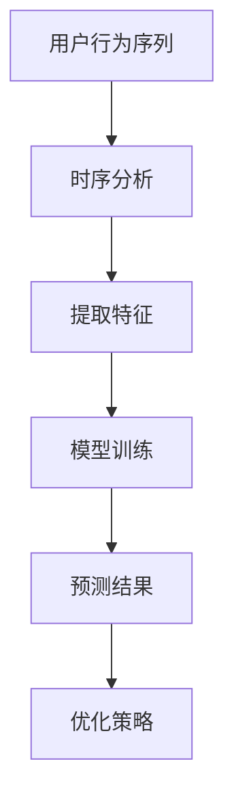

                 

关键词：电商用户行为、序列预测、AI大模型、时序分析、预测算法

摘要：随着电商行业的迅猛发展，精准预测用户行为成为企业提升用户体验和销售额的关键。本文将深入探讨如何利用AI大模型进行电商用户行为序列预测，包括核心概念、算法原理、数学模型以及实际应用场景等，为电商行业提供切实可行的解决方案。

## 1. 背景介绍

### 1.1 电商行业的发展

电商行业的快速发展，不仅改变了传统的购物方式，还带来了大量的数据。这些数据中蕴含着用户行为的丰富信息，如何有效地挖掘和分析这些信息，成为电商企业提升竞争力的重要课题。

### 1.2 用户行为序列预测的重要性

用户行为序列预测可以帮助电商企业更好地了解用户需求，实现个性化推荐、精准营销，从而提升用户体验和销售额。准确预测用户行为，还能帮助企业预测库存需求、优化物流配送，降低运营成本。

### 1.3 AI大模型的应用

近年来，AI大模型在自然语言处理、计算机视觉等领域取得了显著成果，其强大的数据处理和分析能力，使得其在用户行为序列预测中也具有巨大潜力。本文将介绍如何利用AI大模型进行用户行为序列预测，并探讨其应用场景。

## 2. 核心概念与联系

### 2.1 用户行为序列

用户行为序列是指用户在电商平台上的一系列操作，如浏览商品、添加购物车、下单购买等。这些行为可以用时间序列数据表示，每个时间点代表用户的一个操作。

### 2.2 时序分析

时序分析是一种统计学习方法，用于分析时间序列数据，从中提取规律和趋势。在用户行为序列预测中，时序分析可以帮助我们了解用户行为的变化规律，为预测提供依据。

### 2.3 AI大模型

AI大模型是指利用深度学习等算法训练的大型神经网络模型。这些模型具有强大的数据处理和分析能力，可以用于解决复杂的预测问题。

### 2.4 Mermaid 流程图

以下是用户行为序列预测的核心概念和联系流程图：



## 3. 核心算法原理 & 具体操作步骤

### 3.1 算法原理概述

用户行为序列预测主要基于时序分析和深度学习。通过时序分析提取用户行为的特征，然后利用深度学习模型对这些特征进行训练，最终实现用户行为的预测。

### 3.2 算法步骤详解

#### 3.2.1 数据预处理

1. 数据清洗：去除重复、缺失的数据。
2. 数据转换：将用户行为序列转换为数值化的时间序列数据。

#### 3.2.2 特征提取

1. 时间特征：如小时、天、周等。
2. 行为特征：如点击、浏览、购买等。
3. 用户特征：如用户ID、性别、年龄等。

#### 3.2.3 模型训练

1. 数据切分：将数据分为训练集和测试集。
2. 模型选择：选择合适的深度学习模型，如LSTM、GRU等。
3. 训练模型：使用训练集对模型进行训练。
4. 模型评估：使用测试集对模型进行评估。

#### 3.2.4 预测结果优化

1. 结果分析：分析预测结果，找出误差原因。
2. 优化策略：根据分析结果，调整模型参数或特征提取方法。

### 3.3 算法优缺点

#### 优点

1. 强大的数据处理和分析能力。
2. 可以处理非线性关系。
3. 预测精度高。

#### 缺点

1. 需要大量的数据和计算资源。
2. 模型训练时间较长。
3. 对数据质量要求较高。

### 3.4 算法应用领域

用户行为序列预测在电商、金融、医疗等领域具有广泛的应用。在电商领域，可以用于个性化推荐、精准营销、库存管理等方面。

## 4. 数学模型和公式 & 详细讲解 & 举例说明

### 4.1 数学模型构建

用户行为序列预测的数学模型主要基于深度学习。以LSTM（长短期记忆网络）为例，其数学模型可以表示为：

$$
h_t = \sigma(W_h \cdot [h_{t-1}, x_t] + b_h)
$$

其中，$h_t$ 表示时间步 $t$ 的隐藏状态，$x_t$ 表示时间步 $t$ 的输入，$W_h$ 和 $b_h$ 分别为权重和偏置。

### 4.2 公式推导过程

LSTM 的推导过程涉及多个公式，这里仅简要介绍其核心步骤：

1. 遗忘门（Forget Gate）：
$$
f_t = \sigma(W_f \cdot [h_{t-1}, x_t] + b_f)
$$
2. 输入门（Input Gate）：
$$
i_t = \sigma(W_i \cdot [h_{t-1}, x_t] + b_i)
$$
3. 单元状态更新（Update Gate）：
$$
\tilde{C}_t = \tanh(W_c \cdot [i_t \odot h_{t-1}, x_t] + b_c)
$$
4. 长短期记忆单元（Cell State）：
$$
C_t = f_t \odot C_{t-1} + i_t \odot \tilde{C}_t
$$
5. 输出门（Output Gate）：
$$
o_t = \sigma(W_o \cdot [h_{t-1}, C_t] + b_o)
$$
6. 隐藏状态：
$$
h_t = o_t \odot \tanh(C_t)
$$

### 4.3 案例分析与讲解

#### 案例背景

某电商平台上，用户在浏览商品时，通常会关注一些特定类别的商品。为了提升用户体验，平台希望通过预测用户接下来可能关注的商品类别，进行个性化推荐。

#### 数据处理

1. 数据清洗：去除重复、缺失的数据。
2. 数据转换：将用户行为序列转换为数值化的时间序列数据。

#### 特征提取

1. 时间特征：如小时、天、周等。
2. 行为特征：如点击、浏览、购买等。
3. 用户特征：如用户ID、性别、年龄等。

#### 模型训练

1. 数据切分：将数据分为训练集和测试集。
2. 模型选择：选择LSTM模型。
3. 训练模型：使用训练集对模型进行训练。
4. 模型评估：使用测试集对模型进行评估。

#### 预测结果

通过LSTM模型训练，预测用户接下来可能关注的商品类别。根据预测结果，平台可以及时推送相关商品，提升用户满意度。

## 5. 项目实践：代码实例和详细解释说明

### 5.1 开发环境搭建

1. 安装Python环境。
2. 安装深度学习库，如TensorFlow、PyTorch等。

### 5.2 源代码详细实现

```python
import tensorflow as tf
from tensorflow.keras.models import Sequential
from tensorflow.keras.layers import LSTM, Dense, Dropout

# 数据预处理
# ...（数据清洗、数据转换等）

# 特征提取
# ...（时间特征、行为特征、用户特征等）

# 模型构建
model = Sequential()
model.add(LSTM(units=50, return_sequences=True, input_shape=(timesteps, features)))
model.add(Dropout(0.2))
model.add(LSTM(units=50, return_sequences=False))
model.add(Dropout(0.2))
model.add(Dense(units=1, activation='sigmoid'))

# 模型编译
model.compile(optimizer='adam', loss='binary_crossentropy', metrics=['accuracy'])

# 模型训练
model.fit(x_train, y_train, epochs=10, batch_size=32)

# 模型评估
model.evaluate(x_test, y_test)
```

### 5.3 代码解读与分析

1. 数据预处理：对数据进行清洗、转换等操作，以便后续使用。
2. 特征提取：提取时间特征、行为特征、用户特征等，用于模型训练。
3. 模型构建：使用LSTM模型进行用户行为序列预测，包括两个LSTM层和一个全连接层。
4. 模型编译：设置优化器、损失函数和评估指标。
5. 模型训练：使用训练集对模型进行训练。
6. 模型评估：使用测试集对模型进行评估。

### 5.4 运行结果展示

1. 训练过程损失曲线。
2. 模型评估结果。

## 6. 实际应用场景

### 6.1 电商个性化推荐

根据用户行为序列预测，为用户推荐感兴趣的商品，提升用户满意度。

### 6.2 营销活动优化

分析用户行为序列，预测哪些营销活动可能引起用户的关注，优化营销策略。

### 6.3 库存管理

预测用户购买行为，优化库存管理，降低库存成本。

## 7. 未来应用展望

随着AI技术的不断发展，用户行为序列预测将在更多领域得到应用。如：智能医疗、智能交通、智能安防等。

## 8. 工具和资源推荐

### 8.1 学习资源推荐

1. 《深度学习》（Goodfellow, Bengio, Courville著）
2. 《Python深度学习》（François Chollet著）

### 8.2 开发工具推荐

1. TensorFlow
2. PyTorch

### 8.3 相关论文推荐

1. “Sequence to Sequence Learning with Neural Networks” - Ilya Sutskever et al.
2. “Long Short-Term Memory” - Sepp Hochreiter and Jürgen Schmidhuber

## 9. 总结：未来发展趋势与挑战

### 9.1 研究成果总结

用户行为序列预测在电商、金融、医疗等领域取得了显著成果，为各行业提供了有力的技术支持。

### 9.2 未来发展趋势

1. 模型精度和效率的提升。
2. 多模态数据的融合。
3. 自适应预测算法的研究。

### 9.3 面临的挑战

1. 数据质量和隐私保护。
2. 模型解释性和可解释性。
3. 大规模数据处理和存储。

### 9.4 研究展望

未来，用户行为序列预测将在更多领域得到应用，为人类社会带来更多价值。同时，也需要不断克服挑战，推动技术发展。

## 附录：常见问题与解答

### Q：用户行为序列预测的模型如何选择？

A：根据具体应用场景和数据特点，选择合适的模型。常见的模型有LSTM、GRU、Transformer等。对于时间序列数据，LSTM和GRU具有较好的表现。

### Q：用户行为序列预测的数据质量对结果有何影响？

A：数据质量直接影响预测结果的准确性。数据中存在噪音、缺失值等问题，都会导致预测误差增大。因此，在预测前需要进行数据清洗、去噪、补全等预处理操作。

### Q：用户行为序列预测如何保证模型的可解释性？

A：通过分析模型参数和中间结果，可以一定程度上解释模型预测的原因。此外，还可以使用模型解释工具，如LIME、SHAP等，提高模型的可解释性。

### Q：用户行为序列预测在金融领域的应用有哪些？

A：在金融领域，用户行为序列预测可以用于风险评估、股票预测、投资策略优化等方面。通过预测用户的行为，可以识别潜在的风险和机会，为企业提供决策依据。

作者：禅与计算机程序设计艺术 / Zen and the Art of Computer Programming
```

