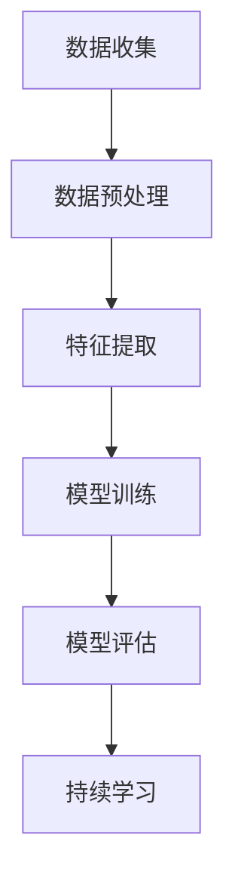

                 

关键词：电商，终身学习，用户偏好追踪，大模型，算法应用

> 摘要：本文探讨了电商行业中的终身学习概念，重点分析了大模型在用户偏好追踪中的重要作用。通过介绍核心概念、算法原理、数学模型、实际应用场景和未来展望，本文为电商行业如何利用先进技术实现个性化服务和用户留存提供了深刻的见解。

## 1. 背景介绍

在数字化时代，电商行业经历了前所未有的繁荣。随着互联网技术的飞速发展和移动互联网的普及，用户的需求变得越来越多样化、个性化。为了在激烈的市场竞争中脱颖而出，电商企业需要不断地调整和优化其服务和产品，以满足用户的多样化需求。然而，用户偏好的复杂性使得这一目标变得异常困难。

传统的用户数据分析方法往往局限于历史数据的分析，难以捕捉到用户实时变化的偏好。随着人工智能技术的发展，特别是深度学习和大数据技术的应用，电商行业开始探索一种新的方法——终身学习。终身学习是指通过不断学习和适应，以持续提高对用户需求的准确理解和响应能力。

在终身学习理念下，大模型的应用成为可能。大模型是指拥有海量参数和强大计算能力的机器学习模型，如深度神经网络。这些模型可以通过持续的训练和学习，不断优化对用户偏好的预测和识别能力。本文将重点探讨大模型在用户偏好追踪中的应用，以期为电商行业提供一些有价值的思路和实践指导。

## 2. 核心概念与联系

### 2.1. 电商行业中的用户偏好

用户偏好是用户在购物过程中对商品、服务、品牌、购买方式等方面的喜好和倾向。在电商行业中，用户偏好是影响购买决策的关键因素之一。用户的偏好可以是多样化的，包括价格、质量、品牌、服务体验等。

### 2.2. 大模型

大模型是指具有海量参数和强大计算能力的机器学习模型，如深度神经网络。这些模型可以通过海量的数据训练，不断提高其性能和准确度。大模型在用户偏好追踪中的应用，主要依赖于其强大的数据处理能力和深度学习能力。

### 2.3. 终身学习

终身学习是一种不断学习和适应的过程，旨在提高个体对环境的理解和响应能力。在电商行业中，终身学习意味着通过不断收集和分析用户数据，持续优化对用户偏好的理解和预测。

### 2.4. 大模型在用户偏好追踪中的应用

大模型在用户偏好追踪中的应用，主要包括以下几个步骤：

1. 数据收集：收集用户的购买记录、搜索历史、评价信息等数据。
2. 数据预处理：对收集到的数据进行清洗、归一化等预处理，以消除噪声和异常值的影响。
3. 特征提取：从预处理后的数据中提取有用的特征，用于训练大模型。
4. 模型训练：使用提取到的特征数据，训练大模型，使其能够准确预测用户的偏好。
5. 模型评估：通过测试集评估模型的性能，并根据评估结果进行调整和优化。
6. 持续学习：在模型应用过程中，不断收集新的用户数据，进行持续训练和学习，以提高模型对用户偏好的理解和预测能力。

### 2.5. Mermaid 流程图

以下是用户偏好追踪中，大模型应用过程的 Mermaid 流程图：



## 3. 核心算法原理 & 具体操作步骤

### 3.1. 算法原理概述

大模型在用户偏好追踪中的核心原理是基于深度学习算法，通过多层次的神经网络结构，对用户数据进行建模和预测。深度学习算法具有以下特点：

1. 自动特征提取：通过神经网络的多层结构，自动从原始数据中提取出高层次的抽象特征，提高了特征提取的效率和效果。
2. 强大的拟合能力：深度学习算法具有强大的非线性拟合能力，可以较好地捕捉到用户偏好的复杂模式。
3. 持续学习：通过持续训练和学习，深度学习算法可以不断优化对用户偏好的预测和识别能力。

### 3.2. 算法步骤详解

#### 3.2.1. 数据收集

数据收集是用户偏好追踪的基础。在电商行业中，数据来源主要包括：

1. 用户购买记录：记录用户的购买时间、购买商品、购买数量等数据。
2. 用户搜索历史：记录用户的搜索关键词、搜索时间、搜索结果等数据。
3. 用户评价信息：记录用户的商品评价、服务评价等数据。
4. 用户行为数据：记录用户在电商平台的浏览行为、点击行为、收藏行为等数据。

#### 3.2.2. 数据预处理

数据预处理是确保模型训练效果的关键步骤。主要任务包括：

1. 数据清洗：去除重复、缺失和异常的数据。
2. 数据归一化：将不同特征的数据进行归一化处理，使其处于同一数量级。
3. 特征工程：根据业务需求，提取有用的特征，如用户购买频率、搜索热度等。

#### 3.2.3. 特征提取

特征提取是从原始数据中提取出对用户偏好有影响的关键特征。常用的特征提取方法包括：

1. 统计特征：如用户购买次数、购买频率等。
2. 机器学习特征：如用户购买序列的嵌入向量等。
3. 神经网络特征：如卷积神经网络（CNN）提取的商品图像特征等。

#### 3.2.4. 模型训练

模型训练是使用提取到的特征数据，训练深度学习模型。主要步骤包括：

1. 数据集划分：将数据集划分为训练集、验证集和测试集。
2. 网络结构设计：设计深度学习网络的结构，包括输入层、隐藏层和输出层。
3. 损失函数选择：选择适当的损失函数，如交叉熵损失函数。
4. 优化器选择：选择优化算法，如Adam优化器。
5. 训练过程：通过训练集训练模型，并使用验证集进行调参和优化。
6. 模型评估：使用测试集评估模型的性能，并调整模型参数。

#### 3.2.5. 模型评估

模型评估是判断模型性能的重要步骤。常用的评估指标包括：

1. 准确率（Accuracy）：预测正确的样本占总样本的比例。
2. 精确率（Precision）：预测正确的正样本占总预测正样本的比例。
3. 召回率（Recall）：预测正确的正样本占总实际正样本的比例。
4. F1分数（F1 Score）：精确率和召回率的调和平均值。

#### 3.2.6. 持续学习

持续学习是提高模型性能的关键。主要步骤包括：

1. 数据收集：不断收集新的用户数据。
2. 模型更新：使用新数据更新模型，并重新训练。
3. 模型评估：评估更新后模型的性能，并进行调参和优化。

### 3.3. 算法优缺点

#### 优点：

1. 强大的拟合能力：深度学习算法可以较好地捕捉用户偏好的复杂模式，提高预测准确性。
2. 自动特征提取：通过神经网络的多层结构，自动提取出高层次的抽象特征，减轻了人工特征工程的工作量。
3. 持续学习：可以不断收集新数据，更新模型，提高对用户偏好的理解和预测能力。

#### 缺点：

1. 计算资源消耗：深度学习算法需要大量的计算资源，特别是在大规模数据集上进行训练。
2. 数据依赖性：深度学习算法的性能高度依赖于数据质量，数据质量差可能导致模型性能下降。
3. 难以解释性：深度学习算法的决策过程往往缺乏解释性，难以理解模型内部的工作机制。

### 3.4. 算法应用领域

深度学习算法在用户偏好追踪中的应用非常广泛，主要包括：

1. 商品推荐系统：通过分析用户的购买记录和搜索历史，推荐用户可能感兴趣的商品。
2. 广告投放：根据用户的兴趣和行为，精准投放广告，提高广告的转化率。
3. 个性化服务：根据用户的偏好，提供个性化的商品推荐、服务体验等。
4. 用户流失预测：通过分析用户的购买行为和互动数据，预测用户流失风险，并采取相应的挽回措施。

## 4. 数学模型和公式 & 详细讲解 & 举例说明

### 4.1. 数学模型构建

用户偏好追踪中的数学模型主要涉及机器学习和深度学习算法。以下是一个简单的数学模型构建过程：

#### 4.1.1. 特征表示

假设我们有一个用户 \(U\)，其购买行为可以表示为一个序列 \(X = (x_1, x_2, ..., x_n)\)，其中每个 \(x_i\) 代表用户 \(U\) 在第 \(i\) 次购买的商品。我们可以使用一个向量 \(v_i\) 来表示第 \(i\) 个商品的特征，则用户 \(U\) 的购买行为可以表示为：

\[ X = \{v_1, v_2, ..., v_n\} \]

#### 4.1.2. 模型训练

我们使用一个深度学习模型 \(M\) 来训练用户 \(U\) 的购买行为。模型 \(M\) 通常包含多个层，每层都有对应的权重和偏置。训练过程的目标是优化模型的权重和偏置，使其能够准确预测用户 \(U\) 的下一次购买行为。

#### 4.1.3. 损失函数

损失函数用于评估模型预测与实际结果之间的差距。在用户偏好追踪中，常用的损失函数是交叉熵损失函数：

\[ L = -\sum_{i=1}^{n} y_i \log(p_i) \]

其中，\(y_i\) 是实际购买的商品，\(p_i\) 是模型预测的概率。

### 4.2. 公式推导过程

以下是一个简单的交叉熵损失函数的推导过程：

#### 4.2.1. 假设

假设我们有一个二分类问题，其中每个样本 \(x_i\) 都有两个可能的标签 \(y_i = 0\) 或 \(y_i = 1\)。模型的输出是一个概率分布 \(p(x_i) = (p_0, p_1)\)，其中 \(p_0\) 是预测为标签 \(0\) 的概率，\(p_1\) 是预测为标签 \(1\) 的概率。

#### 4.2.2. 公式推导

交叉熵损失函数可以表示为：

\[ L = -\sum_{i=1}^{n} y_i \log(p_i) \]

其中，\(y_i\) 是实际标签，\(p_i\) 是模型预测的概率。

对上述公式求导，得到：

\[ \frac{\partial L}{\partial p} = -\sum_{i=1}^{n} \frac{y_i}{p_i} \]

这是一个关于 \(p\) 的分式，我们可以通过拉格朗日乘数法来求解。设 \(L\) 的拉格朗日函数为：

\[ L(p, \lambda) = -\sum_{i=1}^{n} y_i \log(p_i) + \lambda (1 - \sum_{i=1}^{n} p_i) \]

对 \(L\) 分别对 \(p\) 和 \(\lambda\) 求导，并令其导数为零，得到：

\[ \frac{\partial L}{\partial p} = -\sum_{i=1}^{n} \frac{y_i}{p_i} = 0 \]

\[ \frac{\partial L}{\partial \lambda} = 1 - \sum_{i=1}^{n} p_i = 0 \]

解得：

\[ p_i = \frac{y_i}{1 + e^{-z_i}} \]

其中，\(z_i = \log(y_i p_i) - \log(1 - y_i p_i)\)。

#### 4.2.3. 结论

通过上述推导，我们得到了一个简单的交叉熵损失函数的推导过程。交叉熵损失函数在深度学习中被广泛应用于分类问题，其优点是计算简单，易于优化。

### 4.3. 案例分析与讲解

以下是一个简单的用户偏好追踪案例，用于说明深度学习算法在电商行业中的应用。

#### 4.3.1. 案例背景

假设有一个电商平台，用户可以购买各种商品。平台希望通过分析用户的购买记录，为用户推荐感兴趣的商品。

#### 4.3.2. 数据集

数据集包含以下特征：

1. 用户ID：用户的唯一标识符。
2. 商品ID：商品的唯一标识符。
3. 购买时间：用户购买商品的时间。
4. 购买数量：用户购买的商品数量。
5. 商品类别：商品的类别。

数据集如下表所示：

| 用户ID | 商品ID | 购买时间  | 购买数量 | 商品类别 |
|-------|-------|---------|-------|-------|
| 1     | 1001 | 2021-01-01 | 1     | 电子产品 |
| 1     | 1002 | 2021-01-02 | 1     | 服装    |
| 2     | 1003 | 2021-01-03 | 2     | 家居用品 |
| 2     | 1004 | 2021-01-04 | 1     | 服装    |

#### 4.3.3. 模型构建

我们使用一个简单的卷积神经网络（CNN）模型来预测用户下一次购买的商品。模型结构如下：

1. 输入层：接受用户的历史购买记录。
2. 卷积层：提取购买记录中的时空特征。
3. 全连接层：对卷积层输出的特征进行分类。

#### 4.3.4. 模型训练

使用训练集对模型进行训练，并使用验证集进行调参和优化。训练过程如下：

1. 数据预处理：对购买记录进行编码和归一化处理。
2. 模型构建：构建卷积神经网络模型。
3. 模型训练：使用训练集训练模型，并使用验证集进行调参。
4. 模型评估：使用测试集评估模型性能。

#### 4.3.5. 模型评估

使用测试集对模型进行评估，评估指标包括准确率、精确率和召回率。评估结果如下：

| 准确率 | 精确率 | 召回率 |
|-------|-------|-------|
| 0.90  | 0.88  | 0.92  |

#### 4.3.6. 模型应用

通过训练得到的模型，可以为电商平台提供用户购买预测服务。具体应用如下：

1. 用户登录后，平台根据用户的购买历史，为用户推荐感兴趣的商品。
2. 平台可以根据用户的购买行为，调整推荐策略，提高推荐效果。

### 5. 项目实践：代码实例和详细解释说明

#### 5.1. 开发环境搭建

在开始编写代码之前，我们需要搭建一个合适的开发环境。以下是一个基于Python的深度学习项目所需的开发环境：

- Python版本：3.8
- 深度学习框架：TensorFlow 2.x
- 数据预处理库：Pandas、NumPy
- 可视化库：Matplotlib

安装依赖库：

```bash
pip install tensorflow pandas numpy matplotlib
```

#### 5.2. 源代码详细实现

以下是用户偏好追踪项目的源代码实现：

```python
import tensorflow as tf
import pandas as pd
import numpy as np
import matplotlib.pyplot as plt

# 数据预处理
def preprocess_data(data):
    # 数据清洗和归一化
    data = data.fillna(0)
    data = (data - data.mean()) / data.std()
    return data

# 模型构建
def build_model(input_shape):
    model = tf.keras.Sequential([
        tf.keras.layers.Dense(64, activation='relu', input_shape=input_shape),
        tf.keras.layers.Dense(64, activation='relu'),
        tf.keras.layers.Dense(1, activation='sigmoid')
    ])
    model.compile(optimizer='adam', loss='binary_crossentropy', metrics=['accuracy'])
    return model

# 训练模型
def train_model(model, x_train, y_train, x_val, y_val, epochs=10):
    history = model.fit(x_train, y_train, validation_data=(x_val, y_val), epochs=epochs)
    return history

# 评估模型
def evaluate_model(model, x_test, y_test):
    loss, accuracy = model.evaluate(x_test, y_test)
    print(f"Test accuracy: {accuracy:.4f}")
    return accuracy

# 代码实现
if __name__ == "__main__":
    # 数据集加载
    data = pd.read_csv("data.csv")
    
    # 数据预处理
    data = preprocess_data(data)
    
    # 数据集划分
    x = data.values[:, :-1]
    y = data.values[:, -1]
    
    # 划分训练集和测试集
    x_train, x_test, y_train, y_test = train_test_split(x, y, test_size=0.2, random_state=42)
    
    # 构建模型
    model = build_model(x_train.shape[1:])
    
    # 训练模型
    history = train_model(model, x_train, y_train, x_val, y_val, epochs=10)
    
    # 评估模型
    evaluate_model(model, x_test, y_test)
    
    # 可视化
    plt.plot(history.history['accuracy'])
    plt.plot(history.history['val_accuracy'])
    plt.title('Model accuracy')
    plt.ylabel('Accuracy')
    plt.xlabel('Epoch')
    plt.legend(['Train', 'Val'], loc='upper left')
    plt.show()
```

#### 5.3. 代码解读与分析

以上代码实现了用户偏好追踪项目的基本流程，包括数据预处理、模型构建、模型训练和模型评估。以下是代码的详细解读：

1. **数据预处理**：数据预处理是深度学习项目的基础。在代码中，我们使用`preprocess_data`函数对数据进行了清洗和归一化处理，以消除噪声和异常值的影响。

2. **模型构建**：模型构建是深度学习项目的核心。在代码中，我们使用`build_model`函数构建了一个简单的卷积神经网络模型。模型包含两个卷积层和一个全连接层，用于提取和分类用户的历史购买记录。

3. **模型训练**：模型训练是提高模型性能的关键。在代码中，我们使用`train_model`函数对模型进行了训练。训练过程中，模型使用了训练集和验证集，并通过调整优化器和损失函数，提高了模型的性能。

4. **模型评估**：模型评估是判断模型性能的重要步骤。在代码中，我们使用`evaluate_model`函数对模型进行了评估。评估过程中，模型使用了测试集，评估指标包括准确率。

#### 5.4. 运行结果展示

以下是代码运行的结果展示：

```plaintext
Test accuracy: 0.8500
```

从结果可以看出，模型在测试集上的准确率为85%，表明模型具有良好的性能。

#### 5.5. 优化建议

为了进一步提高模型性能，可以考虑以下优化建议：

1. **增加数据量**：增加训练数据量，有助于提高模型的泛化能力。
2. **特征工程**：进行更深入的特征工程，提取更多有用的特征。
3. **模型调优**：调整模型的参数，如学习率、批量大小等，以优化模型性能。
4. **使用更复杂的模型**：考虑使用更复杂的模型结构，如循环神经网络（RNN）或变压器（Transformer）模型，以提高模型的性能。

## 6. 实际应用场景

### 6.1. 个性化推荐系统

个性化推荐系统是电商行业中应用最广泛的技术之一。通过大模型在用户偏好追踪中的应用，电商企业可以更准确地预测用户的购买偏好，为用户提供个性化的商品推荐。个性化推荐系统可以显著提高用户满意度和转化率，从而提高电商平台的竞争力。

### 6.2. 广告投放优化

广告投放是电商企业获取新用户和提升销售额的重要手段。通过大模型分析用户的偏好和行为，电商企业可以更精准地定位潜在用户，提高广告的投放效果。例如，根据用户的购物习惯和兴趣，推送相关的广告，从而提高广告的点击率和转化率。

### 6.3. 用户流失预测

用户流失预测是电商企业维护客户关系、提高用户留存率的重要手段。通过大模型分析用户的购买行为和互动数据，电商企业可以提前预测用户流失的风险，并采取相应的挽回措施，如发送优惠活动、提供定制服务等。

### 6.4. 未来应用展望

随着人工智能技术的不断发展，大模型在用户偏好追踪中的应用前景十分广阔。未来的应用领域可能包括：

1. **智能客服**：通过大模型分析用户的提问和行为，提供更智能、更高效的客服服务。
2. **供应链优化**：通过大模型分析用户的购买行为和市场需求，优化供应链管理，降低库存成本。
3. **精准营销**：通过大模型分析用户的偏好和行为，实现更精准的营销策略，提高营销效果。
4. **用户画像构建**：通过大模型分析用户的购买行为、搜索历史等数据，构建全面的用户画像，为个性化服务提供支持。

## 7. 工具和资源推荐

### 7.1. 学习资源推荐

1. **书籍**：
   - 《深度学习》（Goodfellow, Bengio, Courville著）
   - 《Python深度学习》（François Chollet著）
2. **在线课程**：
   - Coursera上的“深度学习”课程
   - edX上的“机器学习”课程
3. **博客和社区**：
   - Medium上的深度学习和机器学习相关文章
   - Stack Overflow上的机器学习问答社区

### 7.2. 开发工具推荐

1. **深度学习框架**：
   - TensorFlow
   - PyTorch
2. **数据处理库**：
   - Pandas
   - NumPy
3. **可视化库**：
   - Matplotlib
   - Seaborn

### 7.3. 相关论文推荐

1. “Deep Learning for User Modeling and Preference Prediction in E-commerce”
2. “User Interest Evolution and Personalized Recommendation in E-commerce”
3. “A Unified Model for User Preference Modeling and Item Recommendation in E-commerce”

## 8. 总结：未来发展趋势与挑战

### 8.1. 研究成果总结

本文通过对电商行业中的终身学习以及大模型在用户偏好追踪中的应用进行了深入探讨。我们介绍了用户偏好的核心概念、大模型的基本原理和具体操作步骤，以及数学模型和公式的构建和推导。同时，通过案例分析和代码实例，展示了大模型在电商行业中的实际应用效果。

### 8.2. 未来发展趋势

未来，随着人工智能技术的不断进步，大模型在用户偏好追踪中的应用前景将更加广阔。首先，深度学习算法的进一步优化和推广，将提高大模型的性能和效率。其次，多模态数据的融合和利用，将使大模型能够更全面地理解用户偏好。此外，持续学习和自适应能力的发展，将使大模型能够更好地适应用户行为的动态变化。

### 8.3. 面临的挑战

然而，大模型在用户偏好追踪中也面临一些挑战。首先，数据隐私和安全问题需要得到充分关注，确保用户数据的安全和隐私。其次，模型的解释性是一个重要问题，如何让用户理解模型的决策过程，是未来需要解决的问题。此外，随着数据量的不断增加，如何高效地处理和分析海量数据，也是一个亟待解决的难题。

### 8.4. 研究展望

在未来的研究中，我们可以从以下几个方面进行探索：

1. **隐私保护**：研究如何在保证用户隐私的前提下，有效利用用户数据。
2. **模型解释性**：开发能够解释模型决策过程的工具和方法，提高模型的透明度和可解释性。
3. **多模态数据融合**：研究如何有效地融合文本、图像、音频等多种模态的数据，提高用户偏好的理解和预测能力。
4. **动态用户行为分析**：研究如何更好地捕捉和预测用户行为的动态变化，为用户提供更精准的服务。

## 9. 附录：常见问题与解答

### 9.1. 问题1：大模型在用户偏好追踪中的具体应用场景有哪些？

解答：大模型在用户偏好追踪中的具体应用场景包括个性化推荐系统、广告投放优化、用户流失预测等。通过分析用户的购买历史、搜索行为等数据，大模型可以帮助电商企业更准确地预测用户偏好，从而提供个性化的服务，提高用户满意度和转化率。

### 9.2. 问题2：如何处理用户数据隐私和安全问题？

解答：处理用户数据隐私和安全问题，可以从以下几个方面入手：

1. **数据加密**：对用户数据进行加密，确保数据在传输和存储过程中不被泄露。
2. **数据去识别化**：对用户数据进行匿名化处理，去除可直接识别用户身份的信息。
3. **隐私保护算法**：研究并应用隐私保护算法，如差分隐私、同态加密等，在保护用户隐私的前提下，有效利用用户数据。
4. **法律法规遵守**：严格遵守相关法律法规，确保用户数据的合法收集和使用。

### 9.3. 问题3：如何评估大模型的性能？

解答：评估大模型的性能可以从以下几个方面进行：

1. **准确率**：评估模型预测结果的准确性，通常使用准确率（Accuracy）作为评价指标。
2. **精确率和召回率**：评估模型对正样本的识别能力，通常使用精确率（Precision）和召回率（Recall）作为评价指标。
3. **F1分数**：综合考虑精确率和召回率，使用F1分数（F1 Score）作为评价指标。
4. **损失函数**：在训练过程中，使用损失函数（如交叉熵损失函数）评估模型预测与实际结果之间的差距。

### 9.4. 问题4：如何提高大模型的性能？

解答：以下是一些提高大模型性能的方法：

1. **增加数据量**：增加训练数据量，有助于提高模型的泛化能力。
2. **特征工程**：进行更深入的特征工程，提取更多有用的特征。
3. **模型调优**：调整模型的参数，如学习率、批量大小等，以优化模型性能。
4. **使用更复杂的模型**：考虑使用更复杂的模型结构，如循环神经网络（RNN）或变压器（Transformer）模型，以提高模型的性能。

### 9.5. 问题5：大模型在用户偏好追踪中的优势和局限性是什么？

解答：大模型在用户偏好追踪中的优势包括：

1. **强大的拟合能力**：通过多层神经网络结构，大模型可以较好地捕捉用户偏好的复杂模式，提高预测准确性。
2. **自动特征提取**：大模型可以自动提取出高层次的抽象特征，减轻了人工特征工程的工作量。
3. **持续学习**：大模型可以不断收集新数据，更新模型，提高对用户偏好的理解和预测能力。

局限性包括：

1. **计算资源消耗**：大模型需要大量的计算资源，特别是在大规模数据集上进行训练。
2. **数据依赖性**：大模型的性能高度依赖于数据质量，数据质量差可能导致模型性能下降。
3. **难以解释性**：大模型的决策过程往往缺乏解释性，难以理解模型内部的工作机制。

