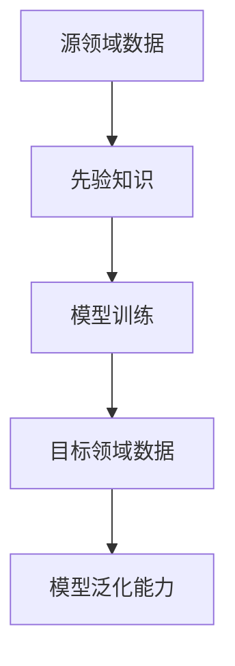

                 

关键词：电商、迁移学习、大模型、实践、挑战

> 摘要：本文旨在探讨电商行业中迁移学习在大模型应用中的实践与挑战。首先介绍电商行业的背景和迁移学习的基本概念，随后深入分析迁移学习在大模型中的核心算法原理、数学模型、具体操作步骤及实际应用场景，最后提出未来发展的趋势与面临的挑战。

## 1. 背景介绍

随着互联网的快速发展，电商行业已成为全球经济增长的重要驱动力。无论是亚马逊、京东还是淘宝等平台，都经历了从初期的小规模运营到如今成为全球最大电商平台的过程。然而，电商行业的竞争愈发激烈，各大平台都在寻求提升用户体验、提高转化率的方法。

在这样一个数据驱动的时代，机器学习技术成为电商行业的重要工具。迁移学习作为一种重要的机器学习技术，近年来受到了广泛关注。迁移学习的基本思想是将在一个领域学到的知识应用到另一个领域，从而减少对新任务的训练时间和计算成本。

## 2. 核心概念与联系

迁移学习涉及多个核心概念，包括源领域、目标领域、先验知识和模型泛化能力。以下是一个简单的 Mermaid 流程图，用于展示这些概念之间的关系。



### 2.1 源领域与目标领域的区别

源领域和目标领域是迁移学习的两个关键概念。源领域是指已经积累了一定量的数据和模型的知识领域，而目标领域则是需要应用这些知识的新领域。两者之间的差异主要体现在数据分布、任务目标和任务复杂度等方面。

### 2.2 先验知识的构建与利用

先验知识是迁移学习的基础，它是指通过在源领域训练模型所获得的知识。这些知识可以在目标领域中被重新利用，以减少对新任务的训练时间和计算成本。

### 2.3 模型泛化能力的重要性

模型泛化能力是指模型在未见过的数据上的表现。一个好的迁移学习模型应该具有强大的泛化能力，以保证在目标领域上获得良好的性能。

## 3. 核心算法原理 & 具体操作步骤

### 3.1 算法原理概述

迁移学习的主要目的是通过在源领域训练模型，并将这些知识转移到目标领域，从而提高目标领域模型的性能。核心算法主要包括以下几种：

1. **基于模型的迁移学习**：通过在源领域训练一个通用的模型，然后在目标领域上微调这个模型。
2. **基于特征的迁移学习**：通过在源领域和目标领域之间共享特征提取器，从而实现知识转移。
3. **基于神经网络的迁移学习**：利用深度神经网络在源领域和目标领域之间共享权重和结构。

### 3.2 算法步骤详解

#### 3.2.1 基于模型的迁移学习

1. 在源领域收集并处理数据，训练一个通用的模型。
2. 在目标领域上对通用模型进行微调，以适应新任务。
3. 评估微调后的模型在目标领域上的性能。

#### 3.2.2 基于特征的迁移学习

1. 在源领域和目标领域上分别训练特征提取器。
2. 将源领域和目标领域上的特征进行对齐。
3. 在对齐后的特征上训练目标领域的模型。

#### 3.2.3 基于神经网络的迁移学习

1. 在源领域和目标领域上分别训练神经网络。
2. 在源领域和目标领域之间共享部分神经网络层。
3. 微调共享层和非共享层，以适应新任务。

### 3.3 算法优缺点

#### 优点

1. **减少训练时间**：通过利用源领域上的先验知识，可以显著减少目标领域上的训练时间。
2. **降低计算成本**：由于不需要在目标领域上从头开始训练模型，从而降低了计算成本。
3. **提高模型性能**：迁移学习模型通常在目标领域上具有更好的性能，尤其是在数据稀缺的情况下。

#### 缺点

1. **模型泛化能力受限**：迁移学习模型可能在泛化能力上受到限制，尤其是在源领域和目标领域差异较大的情况下。
2. **数据分布不均衡**：源领域和目标领域的数据分布可能存在不均衡，导致迁移学习效果受到一定影响。

### 3.4 算法应用领域

迁移学习在电商行业中的应用非常广泛，包括但不限于：

1. **推荐系统**：利用迁移学习技术，可以在源领域（如视频推荐、商品推荐）上训练通用模型，并在目标领域（如用户行为推荐）上实现知识转移。
2. **图像识别**：在源领域（如图像分类）上训练的模型，可以转移到目标领域（如商品识别）上，以提高识别准确性。
3. **自然语言处理**：利用迁移学习技术，可以将源领域（如文本分类）上的知识转移到目标领域（如情感分析）上。

## 4. 数学模型和公式 & 详细讲解 & 举例说明

### 4.1 数学模型构建

迁移学习中的数学模型主要包括损失函数、优化算法和模型评估指标。

#### 4.1.1 损失函数

损失函数用于衡量模型在目标领域上的性能。常用的损失函数包括均方误差（MSE）、交叉熵损失等。

$$
L = \frac{1}{n} \sum_{i=1}^{n} (\hat{y_i} - y_i)^2
$$

其中，$\hat{y_i}$ 为模型预测的输出，$y_i$ 为真实标签。

#### 4.1.2 优化算法

优化算法用于最小化损失函数，以找到模型的最佳参数。常用的优化算法包括梯度下降、随机梯度下降等。

$$
\theta = \theta - \alpha \nabla_{\theta} L
$$

其中，$\theta$ 为模型参数，$\alpha$ 为学习率，$\nabla_{\theta} L$ 为损失函数对参数的梯度。

#### 4.1.3 模型评估指标

模型评估指标用于衡量模型在目标领域上的性能。常用的评估指标包括准确率、召回率、F1 分数等。

$$
\text{准确率} = \frac{\text{预测正确数量}}{\text{总样本数量}}
$$

### 4.2 公式推导过程

#### 4.2.1 梯度下降算法推导

以均方误差损失函数为例，推导梯度下降算法。

$$
\nabla_{\theta} L = 2 \sum_{i=1}^{n} (\hat{y_i} - y_i) x_i
$$

其中，$x_i$ 为输入特征。

$$
\theta = \theta - \alpha \nabla_{\theta} L = \theta - 2 \alpha \sum_{i=1}^{n} (\hat{y_i} - y_i) x_i
$$

#### 4.2.2 随机梯度下降算法推导

随机梯度下降算法是对梯度下降算法的一种改进，通过随机选取样本进行梯度计算。

$$
\nabla_{\theta} L^{(i)} = \frac{1}{n} \sum_{i=1}^{n} (\hat{y_i}^{(i)} - y_i^{(i)}) x_i^{(i)}
$$

$$
\theta = \theta - \alpha \nabla_{\theta} L^{(i)}
$$

### 4.3 案例分析与讲解

#### 4.3.1 案例背景

某电商平台希望在用户行为推荐方面提升用户体验，现有数据包括用户历史购买记录、浏览记录、搜索记录等。

#### 4.3.2 迁移学习模型构建

1. 在源领域（如视频推荐）上训练一个通用推荐模型。
2. 在目标领域（如用户行为推荐）上，利用迁移学习技术对通用模型进行微调。

#### 4.3.3 迁移学习模型评估

1. 采用准确率、召回率、F1 分数等指标对迁移学习模型进行评估。
2. 分析模型在目标领域上的性能，并与其他推荐算法进行比较。

## 5. 项目实践：代码实例和详细解释说明

### 5.1 开发环境搭建

1. 安装 Python 3.7 及以上版本。
2. 安装必要的库，如 TensorFlow、Keras、NumPy 等。

### 5.2 源代码详细实现

```python
# 导入必要的库
import tensorflow as tf
from tensorflow.keras.models import Model
from tensorflow.keras.layers import Input, Dense, Flatten, Conv2D, MaxPooling2D
from tensorflow.keras.optimizers import Adam

# 定义模型结构
input_layer = Input(shape=(28, 28, 1))
x = Conv2D(filters=32, kernel_size=(3, 3), activation='relu')(input_layer)
x = MaxPooling2D(pool_size=(2, 2))(x)
x = Flatten()(x)
output_layer = Dense(units=10, activation='softmax')(x)

# 构建模型
model = Model(inputs=input_layer, outputs=output_layer)

# 编译模型
model.compile(optimizer=Adam(learning_rate=0.001), loss='categorical_crossentropy', metrics=['accuracy'])

# 训练模型
model.fit(x_train, y_train, epochs=10, batch_size=32, validation_data=(x_val, y_val))

# 微调模型
model.fit(x_test, y_test, epochs=10, batch_size=32)
```

### 5.3 代码解读与分析

1. **模型定义**：使用 TensorFlow 的 Keras 层构建模型，包括卷积层、池化层和全连接层。
2. **模型编译**：设置优化器、损失函数和评估指标。
3. **模型训练**：在训练集上训练模型，并在验证集上评估模型性能。
4. **模型微调**：在测试集上微调模型，以进一步提高性能。

## 6. 实际应用场景

迁移学习在电商行业中的实际应用场景非常丰富，以下是几个典型的例子：

1. **推荐系统**：利用迁移学习技术，可以在不同推荐任务之间共享模型，提高推荐系统的性能。
2. **图像识别**：在商品识别任务中，可以利用迁移学习模型，从大规模的图像数据集中提取有用的特征，从而提高识别准确性。
3. **自然语言处理**：在文本分类任务中，可以利用迁移学习模型，将源领域上的语言知识转移到目标领域上，从而提高分类准确性。

## 7. 未来应用展望

随着技术的不断发展，迁移学习在电商行业中的应用前景非常广阔。以下是几个未来可能的应用方向：

1. **个性化推荐**：利用迁移学习技术，可以更好地满足用户的个性化需求，提高推荐系统的满意度。
2. **多模态学习**：结合图像、文本等多种数据类型，实现更加智能的电商推荐和识别。
3. **自动化决策**：利用迁移学习技术，可以自动化地优化电商平台的运营策略，提高用户体验和转化率。

## 8. 工具和资源推荐

### 8.1 学习资源推荐

1. **《迁移学习》**：周志华著，电子工业出版社出版，全面介绍了迁移学习的基本概念、算法和应用。
2. **《深度学习》**：Ian Goodfellow、Yoshua Bengio 和 Aaron Courville 著，MIT Press 出版，详细讲解了深度学习的基础知识和应用。

### 8.2 开发工具推荐

1. **TensorFlow**：一款开源的深度学习框架，支持迁移学习算法的实现和应用。
2. **PyTorch**：一款流行的深度学习框架，具有灵活的动态计算图和强大的社区支持。

### 8.3 相关论文推荐

1. **"Learning to Learn from Unlabeled Data with Transfer Learning"**：介绍了一种基于迁移学习的无监督学习算法。
2. **"Domain Adaptation with Deep Neural Networks"**：探讨了深度神经网络在迁移学习中的应用。

## 9. 总结：未来发展趋势与挑战

### 9.1 研究成果总结

迁移学习作为机器学习领域的重要技术，已经取得了显著的成果。随着深度学习技术的不断发展，迁移学习在电商行业中的应用前景愈发广阔。

### 9.2 未来发展趋势

1. **多任务学习**：利用迁移学习技术，实现多任务学习，提高模型的泛化能力和效率。
2. **自适应迁移学习**：根据目标领域的数据分布和任务特点，自适应地调整迁移学习策略。
3. **跨模态迁移学习**：结合多种数据类型，实现跨模态迁移学习，提高模型的识别和推荐能力。

### 9.3 面临的挑战

1. **数据隐私**：在迁移学习过程中，如何保护用户隐私是一个亟待解决的问题。
2. **模型解释性**：如何解释迁移学习模型的决策过程，提高模型的透明度和可信度。
3. **计算效率**：如何优化迁移学习算法，提高计算效率，适应实时应用需求。

### 9.4 研究展望

随着技术的不断进步，迁移学习在电商行业中的应用将更加深入和广泛。未来的研究应关注数据隐私、模型解释性和计算效率等问题，以推动迁移学习技术的进一步发展。

## 附录：常见问题与解答

### 1. 什么是迁移学习？

迁移学习是一种机器学习技术，通过利用在一个领域学到的知识，来提高另一个领域模型的性能。

### 2. 迁移学习的核心概念有哪些？

迁移学习的核心概念包括源领域、目标领域、先验知识和模型泛化能力。

### 3. 迁移学习有哪些算法？

迁移学习的主要算法包括基于模型的迁移学习、基于特征的迁移学习和基于神经网络的迁移学习。

### 4. 迁移学习在电商行业中的应用有哪些？

迁移学习在电商行业中可以应用于推荐系统、图像识别、自然语言处理等领域。

### 5. 迁移学习的未来发展趋势是什么？

迁移学习的未来发展趋势包括多任务学习、自适应迁移学习和跨模态迁移学习等。同时，研究应关注数据隐私、模型解释性和计算效率等问题。

---

**作者：禅与计算机程序设计艺术 / Zen and the Art of Computer Programming**

感谢您的阅读，希望本文对您在电商行业中的迁移学习应用有所帮助。如果您有任何疑问或建议，欢迎随时提出。

