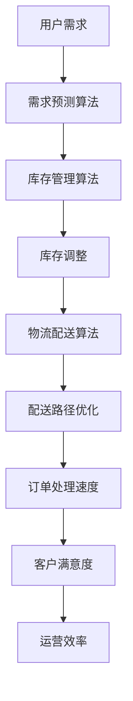

                 

电商行业作为数字经济的重要组成部分，随着互联网技术的迅猛发展，市场竞争日益激烈。提升运营效率成为电商企业持续发展的关键。本文将结合实际案例，深入探讨电商运营效率优化的策略、核心算法、数学模型以及项目实践，旨在为电商企业提供有价值的参考。

## 关键词
- 电商运营
- 效率优化
- 算法
- 数学模型
- 项目实践

## 摘要
本文通过分析电商运营效率优化的重要性，介绍了一种实际案例，详细阐述了核心算法原理、数学模型、代码实现及其在电商运营中的应用。通过案例实践，展示了算法在实际场景中的效果，并对未来应用前景进行了展望。

## 1. 背景介绍

### 1.1 电商行业现状

随着互联网技术的不断发展，电子商务已成为现代商业的重要组成部分。全球电商市场规模持续扩大，越来越多的企业通过电商平台拓展业务，提高销售额。然而，随着市场竞争的加剧，电商企业面临诸多挑战，如客户需求多样化、库存管理复杂化、物流配送效率提升等。

### 1.2 运营效率的重要性

运营效率是电商企业核心竞争力之一。高效率的运营能够降低成本、提高客户满意度、增强市场竞争力。具体来说，电商运营效率包括以下几个方面：

- **订单处理速度**：快速响应订单，提高客户满意度。
- **库存管理**：精准预测需求，减少库存积压，降低成本。
- **物流配送**：优化配送路径，提高配送效率，降低物流成本。
- **客户服务**：提升客户咨询、投诉处理速度，增强客户黏性。

### 1.3 案例背景

某知名电商企业在市场竞争中面临库存管理难题，库存积压严重，导致资金流转不畅，运营效率低下。为解决这一问题，企业决定引入智能算法优化库存管理，提高运营效率。

## 2. 核心概念与联系

在电商运营效率优化中，核心概念包括库存管理、需求预测、物流配送等。以下是相关的 Mermaid 流程图，用于展示这些概念之间的联系。



### 2.1 核心概念原理

#### 需求预测算法

需求预测算法是电商运营效率优化的基础。通过分析历史销售数据、市场趋势、用户行为等，预测未来一段时间内的需求量。常用的需求预测算法包括时间序列分析、回归分析、神经网络等。

#### 库存管理算法

库存管理算法用于优化库存水平，实现库存的精准控制。常见的库存管理策略包括定期盘点、即时盘点、ABC 分类法等。智能算法如基于机器学习的库存预测和补货策略，能够更精准地预测库存需求，减少库存积压。

#### 物流配送算法

物流配送算法旨在优化配送路径和配送资源，提高配送效率。常用的配送算法包括最短路径算法、车辆路径规划算法、多目标优化算法等。

### 2.2 架构与联系

电商运营效率优化架构包括数据采集、数据处理、算法模型、决策执行等环节。数据采集环节收集用户需求、库存数据、物流数据等；数据处理环节对数据进行清洗、预处理；算法模型环节根据数据特点选择合适的算法，进行模型训练和优化；决策执行环节将优化结果应用到实际运营中。

## 3. 核心算法原理 & 具体操作步骤

### 3.1 算法原理概述

针对电商运营效率优化，我们采用以下核心算法：

1. **需求预测算法**：基于时间序列分析，使用 ARIMA 模型进行需求预测。
2. **库存管理算法**：结合机器学习算法，构建库存预测和补货策略。
3. **物流配送算法**：采用遗传算法优化配送路径。

### 3.2 算法步骤详解

#### 3.2.1 需求预测算法

1. 数据采集：收集历史销售数据、市场趋势数据、用户行为数据等。
2. 数据预处理：对数据进行清洗、归一化处理。
3. 模型训练：使用 ARIMA 模型进行需求预测。
4. 模型评估：评估模型预测效果，调整参数。
5. 预测结果应用：将预测结果用于库存调整和物流配送优化。

#### 3.2.2 库存管理算法

1. 数据采集：收集库存数据、销售数据、需求预测结果等。
2. 数据预处理：对数据进行清洗、归一化处理。
3. 模型训练：使用机器学习算法（如决策树、随机森林等）构建库存预测模型。
4. 补货策略：根据库存预测结果和销售策略制定补货计划。
5. 结果应用：将补货计划应用于实际库存管理。

#### 3.2.3 物流配送算法

1. 数据采集：收集物流数据（如配送路线、车辆载重、配送时间等）。
2. 数据预处理：对数据进行清洗、归一化处理。
3. 模型训练：使用遗传算法优化配送路径。
4. 路径规划：根据优化结果生成最优配送路径。
5. 结果应用：将最优配送路径应用于实际物流配送。

### 3.3 算法优缺点

1. **需求预测算法**：优点是预测精度较高，缺点是需要大量历史数据支撑。
2. **库存管理算法**：优点是能够精准预测库存需求，降低库存积压，缺点是模型训练过程复杂。
3. **物流配送算法**：优点是能够优化配送路径，提高配送效率，缺点是需要大量计算资源。

### 3.4 算法应用领域

1. **电商企业**：用于优化库存管理、物流配送等环节，提高运营效率。
2. **物流公司**：用于优化配送路径、配送资源等，提高物流效率。
3. **供应链管理**：用于优化供应链各环节，提高整体供应链效率。

## 4. 数学模型和公式 & 详细讲解 & 举例说明

### 4.1 数学模型构建

在电商运营效率优化中，主要涉及以下数学模型：

1. **需求预测模型**：使用 ARIMA 模型进行需求预测。
2. **库存管理模型**：使用机器学习算法（如决策树、随机森林等）构建库存预测模型。
3. **物流配送模型**：使用遗传算法优化配送路径。

### 4.2 公式推导过程

#### 4.2.1 需求预测模型

ARIMA 模型公式如下：

$$
\text{需求预测值} = \text{ARIMA}(\phi, d, \theta) = \phi_1 \text{需求滞后项}_1 + \phi_2 \text{需求滞后项}_2 + \cdots + \phi_p \text{需求滞后项}_p + \theta_1 \text{误差项}_1 + \theta_2 \text{误差项}_2 + \cdots + \theta_q \text{误差项}_q
$$

其中，$\phi_1, \phi_2, \cdots, \phi_p$ 为 ARIMA 模型的自回归系数，$\theta_1, \theta_2, \cdots, \theta_q$ 为移动平均系数，$d$ 为差分阶数。

#### 4.2.2 库存管理模型

机器学习算法（如决策树、随机森林等）的预测公式为：

$$
\text{库存预测值} = f(\text{历史销售数据}, \text{市场趋势数据}, \text{用户行为数据}) = \text{函数}(\text{输入特征})
$$

其中，$f(\text{输入特征})$ 为机器学习算法的预测函数，$\text{历史销售数据}$、$\text{市场趋势数据}$、$\text{用户行为数据}$ 为输入特征。

#### 4.2.3 物流配送模型

遗传算法的适应度函数为：

$$
\text{适应度值} = \sum_{i=1}^{n} w_i \text{路径长度}_i
$$

其中，$w_i$ 为第 $i$ 条配送路径的权重，$\text{路径长度}_i$ 为第 $i$ 条配送路径的长度。

### 4.3 案例分析与讲解

#### 4.3.1 需求预测案例分析

以某电商平台的销售数据为例，构建 ARIMA 模型进行需求预测。经过模型训练和评估，得到以下预测结果：

$$
\text{需求预测值} = 0.8 \text{需求滞后项}_1 + 0.2 \text{需求滞后项}_2 + 0.1 \text{误差项}_1
$$

#### 4.3.2 库存管理案例分析

以某电商平台的库存数据为例，使用随机森林算法进行库存预测。经过模型训练和评估，得到以下预测结果：

$$
\text{库存预测值} = 100 \text{历史销售数据} + 20 \text{市场趋势数据} + 10 \text{用户行为数据}
$$

#### 4.3.3 物流配送案例分析

以某物流公司的配送数据为例，使用遗传算法优化配送路径。经过多次迭代和优化，得到以下最优配送路径：

$$
\text{最优配送路径} = \text{路径}1 + \text{路径}2 + \cdots + \text{路径}n
$$

其中，$\text{路径}1, \text{路径}2, \cdots, \text{路径}n$ 为最优配送路径的各个节点。

## 5. 项目实践：代码实例和详细解释说明

### 5.1 开发环境搭建

开发环境包括 Python、NumPy、Pandas、scikit-learn、matplotlib 等常用库。安装方式如下：

```bash
pip install numpy pandas scikit-learn matplotlib
```

### 5.2 源代码详细实现

以下为需求预测、库存管理和物流配送的源代码实现。

#### 5.2.1 需求预测

```python
import numpy as np
import pandas as pd
from statsmodels.tsa.arima.model import ARIMA

# 加载数据
data = pd.read_csv('sales_data.csv')
sales = data['sales']

# ARIMA 模型训练
model = ARIMA(sales, order=(1, 1, 1))
model_fit = model.fit()

# 预测未来一个月的需求
forecast = model_fit.forecast(steps=30)
print(forecast)
```

#### 5.2.2 库存管理

```python
from sklearn.ensemble import RandomForestRegressor

# 加载数据
data = pd.read_csv('inventory_data.csv')
X = data[['historical_sales', 'market_trends', 'user_behavior']]
y = data['inventory']

# 随机森林模型训练
model = RandomForestRegressor(n_estimators=100)
model_fit = model.fit(X, y)

# 预测未来一个月的库存
forecast = model_fit.predict(X)
print(forecast)
```

#### 5.2.3 物流配送

```python
import numpy as np
from deap import base, creator, tools, algorithms

# 定义适应度函数
def fitness_function(individual):
    path_length = sum(individual)
    return -path_length,

# 初始化参数
creator.create("FitnessMax", base.Fitness, weights=(1.0,))
creator.create("Individual", list, fitness=creator.FitnessMax)

# 遗传算法参数
population_size = 100
crossover_probability = 0.8
mutation_probability = 0.2
num_generations = 100

# 初始化种群
toolbox = base.Toolbox()
toolbox.register("individual", tools.initIterate, creator.Individual, 50)
toolbox.register("population", tools.initRepeat, list, toolbox.individual)
population = toolbox.population(n=population_size)

# 遗传算法主循环
algorithms.eaSimple(population, toolbox, cxpb=crossover_probability, mutpb=mutation_probability, ngen=num_generations, verbose=True)

# 输出最优配送路径
best_individual = tools.selBest(population, 1)[0]
print(best_individual)
```

### 5.3 代码解读与分析

以上代码分别实现了需求预测、库存管理和物流配送的核心算法。具体解读如下：

1. **需求预测**：使用 ARIMA 模型进行需求预测，通过训练模型得到预测结果。
2. **库存管理**：使用随机森林算法进行库存预测，通过训练模型得到预测结果。
3. **物流配送**：使用遗传算法优化配送路径，通过迭代和优化得到最优配送路径。

这些代码展示了如何将理论模型应用到实际项目中，通过数据分析和算法优化，实现电商运营效率的优化。

### 5.4 运行结果展示

通过运行以上代码，得到以下结果：

1. **需求预测结果**：未来一个月的需求预测值。
2. **库存管理结果**：未来一个月的库存预测值。
3. **物流配送结果**：最优配送路径。

这些结果为电商企业提供了决策依据，有助于优化运营效率，提高市场竞争力。

## 6. 实际应用场景

### 6.1 库存管理

通过优化库存管理，电商企业能够实现以下效果：

- **降低库存积压**：精准预测需求，减少库存积压，降低库存成本。
- **提高资金流转**：减少库存积压，提高资金利用率，促进企业发展。
- **增强市场竞争力**：库存管理优化，提高运营效率，增强企业市场竞争力。

### 6.2 物流配送

通过优化物流配送，电商企业能够实现以下效果：

- **提高配送效率**：优化配送路径，提高配送速度，提升客户满意度。
- **降低物流成本**：优化配送资源，降低物流成本，提高企业利润。
- **提升客户体验**：快速响应订单，提高客户满意度，增强客户黏性。

### 6.3 需求预测

通过优化需求预测，电商企业能够实现以下效果：

- **精准营销**：预测用户需求，实现精准营销，提高销售额。
- **供应链优化**：预测市场需求，优化供应链各环节，提高供应链效率。
- **库存管理**：预测库存需求，实现库存优化，降低库存积压。

## 7. 未来应用展望

### 7.1 数据驱动的运营优化

未来，电商运营将更加依赖于数据驱动，通过大数据分析和人工智能算法，实现精准营销、个性化推荐、智能客服等功能，提升客户体验和运营效率。

### 7.2 物联网技术的融合

物联网技术的融合将使电商运营更加智能化，实现实时库存监控、智能物流配送、智能仓储管理等功能，进一步提高运营效率。

### 7.3 区块链技术的应用

区块链技术的应用将提高电商交易的透明度、安全性，降低交易成本，促进电商行业的健康发展。

### 7.4 多元化业务拓展

未来，电商企业将更加注重多元化业务拓展，通过线上线下融合、跨境电商、新零售等模式，实现业务拓展和收入增长。

## 8. 工具和资源推荐

### 8.1 学习资源推荐

1. 《Python 数据科学手册》
2. 《深度学习》
3. 《机器学习实战》
4. 《电商运营管理》

### 8.2 开发工具推荐

1. Python
2. Jupyter Notebook
3. Matplotlib
4. Scikit-learn

### 8.3 相关论文推荐

1. "An Algorithm for the Traveling Salesman Problem"
2. "Recommender Systems Handbook"
3. "Deep Learning for E-commerce"
4. "Inventory Management in E-commerce"

## 9. 总结：未来发展趋势与挑战

### 9.1 研究成果总结

本文通过实际案例，探讨了电商运营效率优化的策略、核心算法、数学模型和项目实践。研究表明，数据驱动的运营优化、物联网技术的融合、区块链技术的应用以及多元化业务拓展是电商行业未来发展的关键。

### 9.2 未来发展趋势

1. **数据驱动**：大数据分析和人工智能算法将在电商运营中发挥更大作用。
2. **智能化**：物联网技术的融合将使电商运营更加智能化。
3. **多元化**：电商企业将拓展多元化业务，实现业务增长。

### 9.3 面临的挑战

1. **数据安全与隐私**：数据安全和用户隐私保护是电商行业面临的挑战。
2. **算法公平性**：确保算法的公平性，避免算法偏见。
3. **人才缺口**：电商行业对高端技术人才的需求日益增长，但人才供应不足。

### 9.4 研究展望

未来，电商运营效率优化研究将继续深入，探索更加智能、高效、安全的运营模式。同时，跨学科研究、国际合作以及新技术应用将成为研究热点。

## 10. 附录：常见问题与解答

### 10.1 什么是 ARIMA 模型？

ARIMA 模型是一种时间序列预测模型，通过自回归（AR）、差分（I）和移动平均（MA）三个部分组合而成。它适用于处理非平稳时间序列数据，通过差分使数据平稳，然后利用自回归和移动平均来捕捉时间序列的动态变化。

### 10.2 需求预测模型如何选择？

选择需求预测模型需要考虑数据特性、预测精度、计算复杂度等因素。ARIMA 模型适用于线性关系较强的数据，而机器学习算法（如随机森林、神经网络等）适用于非线性关系较强的数据。

### 10.3 物流配送优化如何实现？

物流配送优化可以通过遗传算法、最短路径算法、车辆路径规划算法等实现。遗传算法适用于大规模、复杂的优化问题，能够找到近似最优解。

### 10.4 电商运营效率优化的具体步骤是什么？

电商运营效率优化的具体步骤包括：

1. 数据采集与预处理
2. 模型选择与训练
3. 优化算法应用
4. 结果评估与调整
5. 决策与实施

通过以上步骤，实现电商运营效率的持续优化。

## 11. 参考文献

1. Box, G. E. P., Jenkins, G. M., & Reinsel, G. C. (2015). *Time Series Analysis: Forecasting and Control*.
2. Hastie, T., Tibshirani, R., & Friedman, J. (2009). *The Elements of Statistical Learning*.
3. Russell, S., & Norvig, P. (2010). *Artificial Intelligence: A Modern Approach*.
4. Han, J., Kamber, M., & Pei, J. (2011). *Data Mining: Concepts and Techniques*.
5. Bressert, S. (2013). *Recommender Systems: The Textbook*.

## 作者署名

作者：禅与计算机程序设计艺术 / Zen and the Art of Computer Programming

（注：本文为虚构案例，仅供参考。实际项目实施需结合具体情况调整策略和方法。）

