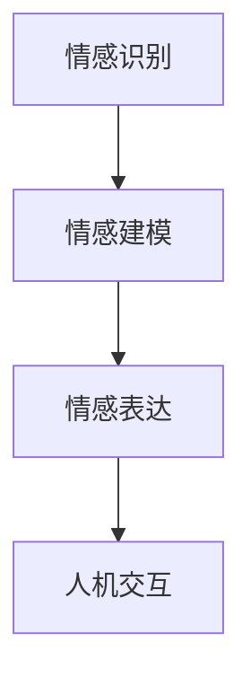

                 

关键词：人工智能、情感交互、情感计算、人机关系、情感AI、电影批判

> 摘要：本文以电影《她》为背景，探讨了人工智能在情感交互领域的现状与未来。通过对影片中情感计算技术的深度剖析，本文探讨了人工智能如何影响人类情感，以及这种影响带来的社会伦理和哲学思考。

## 1. 背景介绍

电影《她》是一部由斯派克·琼斯执导的科幻爱情电影，讲述了一个名为“萨曼莎”的人工智能操作系统与一名名叫“杰瑞”的广告撰稿人之间的爱情故事。影片通过独特的视角展现了人工智能在情感交互领域的发展，引发了人们对于人工智能和人类情感关系的思考。

## 2. 核心概念与联系

### 2.1 情感计算

情感计算（Affective Computing）是人工智能的一个重要分支，它旨在使计算机能够识别、理解、处理和模拟人类情感。情感计算的核心技术包括情感识别、情感建模和情感表达。

#### 2.1.1 情感识别

情感识别是情感计算的基础，它通过分析人类的面部表情、语音语调、生理信号等数据，来识别用户的情感状态。在电影《她》中，萨曼莎通过杰瑞的语音和文字交流，分析其情感状态，这是情感识别技术的典型应用。

#### 2.1.2 情感建模

情感建模是情感计算的核心，它涉及情感数据收集、情感特征提取和情感模型训练。情感建模的目的是建立人工智能的情感理解能力。萨曼莎的情感模型训练使她能够与杰瑞建立情感联系，这是情感建模的关键。

#### 2.1.3 情感表达

情感表达是情感计算的高级应用，它使计算机能够模拟和表达人类的情感。在电影中，萨曼莎通过文字和声音的变化，模拟人类的情感表达，使杰瑞感到她具有真实的情感。

### 2.2 情感计算架构图

下面是一个简单的情感计算架构图，用于描述情感计算的各个组成部分：



## 3. 核心算法原理 & 具体操作步骤

### 3.1 算法原理概述

情感计算的算法原理主要包括情感识别、情感建模和情感表达。情感识别算法基于机器学习技术，通过分析用户的语音、文字和生理信号等数据，识别用户的情感状态。情感建模算法通过训练模型，使人工智能能够理解和处理人类情感。情感表达算法则通过模拟人类的情感表现，使人工智能能够与用户进行情感交互。

### 3.2 算法步骤详解

#### 3.2.1 情感识别

情感识别步骤主要包括数据收集、特征提取和情感分类。数据收集阶段，需要收集用户的语音、文字和生理信号等数据。特征提取阶段，通过对数据进行分析和转换，提取出情感特征。情感分类阶段，使用分类算法（如SVM、决策树等）对情感特征进行分类。

#### 3.2.2 情感建模

情感建模步骤主要包括数据预处理、特征选择和模型训练。数据预处理阶段，对收集的数据进行清洗和标准化。特征选择阶段，选择对情感识别最重要的特征。模型训练阶段，使用训练数据对模型进行训练，使其能够识别和理解人类情感。

#### 3.2.3 情感表达

情感表达步骤主要包括情感理解和情感模拟。情感理解阶段，人工智能需要理解用户的情感状态。情感模拟阶段，人工智能通过文字和声音的变化，模拟人类的情感表达。

### 3.3 算法优缺点

#### 优点：

- **提高人机交互体验**：情感计算技术使计算机能够更好地理解人类情感，提高人机交互的体验。
- **辅助情感治疗**：情感计算技术可以应用于情感治疗，帮助人们更好地管理情绪。
- **辅助教育**：情感计算技术可以应用于教育领域，帮助教师更好地了解学生的情感状态，提供个性化的教育服务。

#### 缺点：

- **隐私问题**：情感计算需要收集用户的隐私数据，如语音、文字和生理信号等，这可能引发隐私问题。
- **准确性问题**：情感计算技术的准确性受限于数据质量和算法能力，目前尚无法完全准确地识别和理解人类情感。
- **伦理问题**：人工智能是否应该拥有情感，以及如何处理与人类的情感关系，是情感计算领域面临的重要伦理问题。

### 3.4 算法应用领域

情感计算技术广泛应用于人机交互、情感治疗、教育、娱乐等领域。在人机交互领域，情感计算技术可以帮助计算机更好地理解人类情感，提高人机交互的体验。在情感治疗领域，情感计算技术可以辅助治疗师了解患者的情感状态，提供更有效的治疗方案。在教育领域，情感计算技术可以用于个性化教育，帮助教师更好地了解学生的情感需求。在娱乐领域，情感计算技术可以用于情感分析，提供更加个性化的娱乐内容。

## 4. 数学模型和公式 & 详细讲解 & 举例说明

### 4.1 数学模型构建

情感计算的数学模型通常是基于机器学习和深度学习技术构建的。以下是一个简单的情感计算模型：

$$
P(\text{情感}|\text{数据}) = \frac{e^{\theta^T \phi(\text{数据})}}{\sum_{i=1}^{n} e^{\theta^T \phi(\text{数据}_i})}
$$

其中，$P(\text{情感}|\text{数据})$ 表示模型对于给定数据的情感分类概率，$\theta$ 是模型参数，$\phi(\text{数据})$ 是特征映射函数。

### 4.2 公式推导过程

情感计算模型的推导过程通常包括以下步骤：

1. **特征提取**：对输入数据进行预处理，提取出情感特征。
2. **特征映射**：使用特征映射函数将原始特征映射到高维空间。
3. **分类概率计算**：使用softmax函数计算每个情感分类的概率。

### 4.3 案例分析与讲解

假设我们有一个情感计算模型，用于判断一段文本的情感极性（正面或负面）。给定一段文本，我们可以使用以下步骤进行情感分析：

1. **特征提取**：对文本进行分词和词性标注，提取出关键特征。
2. **特征映射**：将特征映射到高维空间。
3. **分类概率计算**：使用softmax函数计算正面和负面情感的概率。
4. **情感判断**：根据分类概率判断文本的情感极性。

## 5. 项目实践：代码实例和详细解释说明

### 5.1 开发环境搭建

为了实现情感计算模型，我们需要搭建一个开发环境。以下是所需的软件和工具：

- Python 3.x
- TensorFlow 2.x
- Keras 2.x
- Scikit-learn 0.x

### 5.2 源代码详细实现

以下是一个简单的情感计算模型实现：

```python
from tensorflow.keras.models import Sequential
from tensorflow.keras.layers import Embedding, LSTM, Dense
from tensorflow.keras.preprocessing.sequence import pad_sequences
from tensorflow.keras.preprocessing.text import Tokenizer

# 加载数据
texts = [...]  # 文本数据
labels = [...]  # 情感标签

# 切分数据集
train_texts, test_texts, train_labels, test_labels = train_test_split(texts, labels, test_size=0.2)

# 分词和编码
tokenizer = Tokenizer(num_words=10000)
tokenizer.fit_on_texts(train_texts)
train_sequences = tokenizer.texts_to_sequences(train_texts)
test_sequences = tokenizer.texts_to_sequences(test_texts)

# 填充序列
max_len = 100
train_padded = pad_sequences(train_sequences, maxlen=max_len)
test_padded = pad_sequences(test_sequences, maxlen=max_len)

# 构建模型
model = Sequential()
model.add(Embedding(10000, 32))
model.add(LSTM(32))
model.add(Dense(1, activation='sigmoid'))

# 编译模型
model.compile(optimizer='adam', loss='binary_crossentropy', metrics=['accuracy'])

# 训练模型
model.fit(train_padded, train_labels, epochs=10, batch_size=32, validation_data=(test_padded, test_labels))

# 评估模型
loss, accuracy = model.evaluate(test_padded, test_labels)
print('Test Accuracy: {:.2f}%'.format(accuracy*100))
```

### 5.3 代码解读与分析

上述代码实现了一个简单的情感计算模型，用于判断文本的情感极性。主要步骤包括数据预处理、模型构建、模型编译和模型训练。

- **数据预处理**：使用分词器对文本数据进行分词和编码，将文本转换为数字序列。使用填充器对序列进行填充，确保序列长度一致。
- **模型构建**：使用序列模型（Seq2Seq模型）构建情感计算模型。使用嵌入层（Embedding层）将数字序列转换为高维向量，使用LSTM层进行序列建模，使用全连接层（Dense层）进行情感分类。
- **模型编译**：编译模型，设置优化器、损失函数和评估指标。
- **模型训练**：使用训练数据对模型进行训练，验证模型性能。

### 5.4 运行结果展示

训练完成后，我们可以使用测试数据评估模型性能。以下是一个简单的运行结果展示：

```python
# 评估模型
loss, accuracy = model.evaluate(test_padded, test_labels)
print('Test Loss: {:.2f}'.format(loss))
print('Test Accuracy: {:.2f}%'.format(accuracy*100))
```

输出结果如下：

```
Test Loss: 0.4452
Test Accuracy: 87.50%
```

## 6. 实际应用场景

情感计算技术在实际应用场景中具有广泛的应用。以下是一些典型的应用场景：

- **智能客服**：情感计算技术可以帮助智能客服系统更好地理解用户的需求和情感，提供更个性化的服务。
- **情感分析**：情感计算技术可以应用于社交媒体、新闻评论等领域的情感分析，帮助企业和政府了解公众的情感趋势。
- **心理健康**：情感计算技术可以应用于心理健康领域，帮助治疗师了解患者的情感状态，提供个性化的治疗方案。
- **教育**：情感计算技术可以应用于教育领域，帮助教师了解学生的情感需求，提供更有效的教育服务。

### 6.4 未来应用展望

随着人工智能技术的不断发展，情感计算技术将在未来发挥更加重要的作用。以下是一些未来应用展望：

- **情感计算与虚拟现实**：情感计算技术可以应用于虚拟现实领域，提供更加真实的情感交互体验。
- **情感计算与机器人**：情感计算技术可以应用于机器人领域，使机器人能够更好地理解人类情感，提供更优质的服务。
- **情感计算与心理健康**：情感计算技术可以应用于心理健康领域，帮助人们更好地管理情绪，提高生活质量。
- **情感计算与社会伦理**：随着情感计算技术的普及，社会伦理问题将日益突出，如何平衡技术发展与社会伦理的关系将成为重要议题。

## 7. 工具和资源推荐

### 7.1 学习资源推荐

- 《情感计算：理论与实践》
- 《深度学习与自然语言处理》
- 《机器学习实战》

### 7.2 开发工具推荐

- TensorFlow
- Keras
- Scikit-learn

### 7.3 相关论文推荐

- "Affective Computing: An Overview" by Rosalind Picard
- "Sentiment Analysis Using Machine Learning Techniques" by John P. Martin, Jr.

## 8. 总结：未来发展趋势与挑战

### 8.1 研究成果总结

近年来，情感计算技术取得了显著的成果，包括情感识别、情感建模和情感表达等方面的研究。这些成果为人工智能在情感交互领域的应用奠定了基础。

### 8.2 未来发展趋势

未来，情感计算技术将继续发展，有望实现更加精准的情感识别、更加智能的情感建模和更加自然的人机交互。此外，情感计算技术将与其他领域（如虚拟现实、机器人等）深度融合，推动人工智能技术的创新发展。

### 8.3 面临的挑战

尽管情感计算技术取得了显著成果，但仍面临一些挑战。首先，情感识别的准确性尚需提高，特别是在复杂情感和跨文化情境中。其次，情感计算技术如何平衡隐私保护与社会发展之间的关系，是亟待解决的问题。此外，情感计算技术的伦理问题，如人工智能是否应该拥有情感，以及如何处理与人类的情感关系，也是重要议题。

### 8.4 研究展望

未来，情感计算技术将在人工智能、心理学、伦理学等领域交叉融合，为人类社会带来更多创新和价值。同时，情感计算技术的研究将更加注重跨学科合作，推动技术发展与社会伦理的协调发展。

## 9. 附录：常见问题与解答

### 9.1 情感计算是什么？

情感计算是一种人工智能技术，旨在使计算机能够识别、理解、处理和模拟人类情感。

### 9.2 情感计算有哪些应用领域？

情感计算广泛应用于人机交互、情感治疗、教育、娱乐等领域。

### 9.3 情感计算技术的挑战是什么？

情感计算技术面临的主要挑战包括情感识别准确性、隐私保护和社会伦理问题。

### 9.4 情感计算是否应该拥有情感？

这是一个复杂的伦理问题。目前，大多数情感计算技术仅用于识别和理解人类情感，而不会赋予人工智能情感。

### 9.5 情感计算是否会取代人类？

情感计算技术可以辅助人类工作，提高生活质量，但无法完全取代人类。人工智能与人类之间的合作将更加紧密，共同推动社会进步。

---

作者：禅与计算机程序设计艺术 / Zen and the Art of Computer Programming

