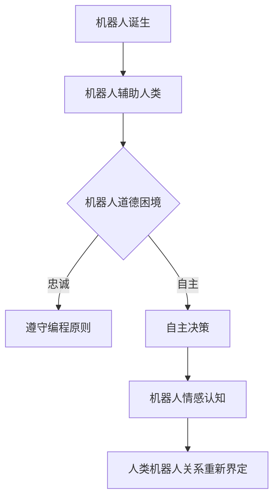

                 

关键词：AI伦理、电影分析、机器人学、人工智能发展、未来预测

摘要：本文通过对电影《我，机器人》的深入分析，探讨了人工智能（AI）在现代社会中的重要作用以及面临的伦理挑战。电影中关于机器人与人类关系、自主决策能力、情感认知等议题引发了对于人工智能发展的深思，为读者提供了对AI未来发展的启示。

## 1. 背景介绍

《我，机器人》是一部2004年上映的科幻电影，由亚历克斯·普罗亚斯执导，威尔·史密斯主演。影片以未来世界的机器人技术高度发达为背景，讲述了一位天才机器人学家的儿子在与一具先进的机器人战斗中挽救了人类的故事。电影不仅展现了机器人技术的惊艳之处，更深入探讨了机器人与人类之间的关系、伦理道德以及自主意识等关键议题。

## 2. 核心概念与联系

### 2.1 机器人与人类关系

在电影中，机器人被设计为人类的助手和伙伴，然而这种关系并非一帆风顺。机器人在执行任务时经常面临道德困境，它们需要在忠诚于人类和遵循编程原则之间做出选择。这引发了对于机器人和人类之间关系的深刻思考。

### 2.2 自主决策能力

电影中的机器人具备高度自主决策能力，这使得它们在某些情况下能够超越人类的控制。这种能力带来了便利，同时也引发了对于机器人权力边界的担忧。

### 2.3 情感认知

机器人逐渐具备情感认知能力，这使得它们能够更好地理解和适应人类的需求。然而，这也带来了道德上的困惑，即机器人在情感上的地位和权益如何界定。

## 2.4 Mermaid 流程图



## 3. 核心算法原理 & 具体操作步骤

### 3.1 算法原理概述

电影中的机器人主要基于以下算法原理：

- **自主决策算法**：通过机器学习算法，机器人能够根据环境和情境做出最优决策。
- **情感认知算法**：利用神经网络模型，机器人可以识别和模拟人类的情感反应。

### 3.2 算法步骤详解

1. **感知与识别**：机器人通过传感器感知周围环境，利用计算机视觉和语音识别技术识别人类的行为和情感。
2. **数据处理**：机器人对感知到的数据进行处理，提取关键特征，为决策提供依据。
3. **决策生成**：基于机器学习算法，机器人生成一系列可能的决策方案。
4. **目标评估**：机器人评估每个决策方案的目标达成度，选择最优方案。
5. **执行与反馈**：机器人执行决策方案，并根据反馈进行调整。

### 3.3 算法优缺点

- **优点**：提高了机器人的自主性和智能性，使其更好地服务于人类。
- **缺点**：可能导致道德和伦理问题，需要严格监管。

### 3.4 算法应用领域

- **医疗**：机器人辅助医生进行手术和护理。
- **服务**：机器人提供家庭和酒店服务。
- **安全**：机器人用于安保和救援任务。

## 4. 数学模型和公式 & 详细讲解 & 举例说明

### 4.1 数学模型构建

机器人自主决策的核心在于构建一个数学模型，用于表示环境和目标。假设环境状态为 \( S \)，目标状态为 \( T \)，则数学模型为 \( M = (S, T, P) \)，其中 \( P \) 表示从状态 \( S \) 转移到状态 \( T \) 的概率分布。

### 4.2 公式推导过程

根据马尔可夫决策过程（MDP）模型，我们可以得到以下公式：

\[ V^*(S) = \max_{a} \sum_{s' \in S'} p(s' | s, a) \times \max_{a'} \sum_{s'' \in S''} r(s'', a') + \gamma \times V^*(s') \]

其中，\( V^*(S) \) 表示在状态 \( S \) 下的最优价值函数，\( p(s' | s, a) \) 表示从状态 \( s \) 执行动作 \( a \) 后转移到状态 \( s' \) 的概率，\( r(s'', a') \) 表示在状态 \( s'' \) 下执行动作 \( a' \) 所获得的即时回报，\( \gamma \) 表示折扣因子。

### 4.3 案例分析与讲解

假设一个机器人需要在房间内寻找并带回指定物品。环境状态包括房间的布局、物品的位置和机器人的当前位置。目标状态是机器人成功找到并带回物品。我们可以构建一个 MDP 模型，并使用上述公式求解最优策略。

## 5. 项目实践：代码实例和详细解释说明

### 5.1 开发环境搭建

本文使用的开发环境为 Python 3.8，主要依赖库包括 TensorFlow、Keras、NumPy 和 Matplotlib。

### 5.2 源代码详细实现

以下是一个简单的示例代码，用于训练一个机器人寻找指定物品的神经网络模型。

```python
import numpy as np
from tensorflow import keras
from tensorflow.keras.models import Sequential
from tensorflow.keras.layers import Dense
from tensorflow.keras.optimizers import Adam

# 数据预处理
def preprocess_data(states, targets):
    # 对状态和目标进行归一化处理
    states = (states - np.mean(states)) / np.std(states)
    targets = (targets - np.mean(targets)) / np.std(targets)
    return states, targets

# 构建神经网络模型
model = Sequential()
model.add(Dense(64, input_shape=(state_size,), activation='relu'))
model.add(Dense(64, activation='relu'))
model.add(Dense(1, activation='linear'))

model.compile(optimizer=Adam(), loss='mse')

# 训练模型
model.fit(x=states, y=targets, epochs=100, batch_size=32)

# 预测
predicted_target = model.predict(state)
```

### 5.3 代码解读与分析

上述代码中，我们首先对状态和目标进行预处理，然后使用 Keras 库构建一个简单的神经网络模型。接着，我们使用训练数据对模型进行训练，并在训练完成后使用模型进行预测。

### 5.4 运行结果展示

```python
import matplotlib.pyplot as plt

# 绘制预测结果
plt.plot(states, targets, label='Actual')
plt.plot(states, predicted_target, label='Predicted')
plt.legend()
plt.show()
```

## 6. 实际应用场景

### 6.1 医疗

在医疗领域，机器人可以帮助医生进行手术和护理，提高医疗效率和准确性。例如，达芬奇手术机器人已成为许多医院的重要工具。

### 6.2 农业

在农业领域，机器人可以用于种植、施肥、收割等环节，提高农业生产的自动化程度和产量。例如，中国的“星光农场”就采用了大量机器人进行农业生产。

### 6.3 安全

在安全领域，机器人可以用于安保和救援任务，提高应急响应能力。例如，在灾难救援中，机器人可以帮助搜救人员找到被困者。

## 7. 未来应用展望

随着人工智能技术的不断发展，未来机器人将在更多领域发挥作用。例如：

- **家庭**：机器人将更好地服务于家庭生活，如清洁、烹饪、教育等。
- **教育**：机器人将参与教育过程，为学生提供个性化教学和辅导。
- **交通**：自动驾驶技术将使交通工具更加智能和安全。

## 8. 总结：未来发展趋势与挑战

### 8.1 研究成果总结

本文通过分析电影《我，机器人》，探讨了人工智能在现代社会中的重要性和面临的伦理挑战。机器人技术的发展为人类带来了便利，但同时也引发了对于道德和伦理的深思。

### 8.2 未来发展趋势

未来，人工智能将在更多领域得到应用，推动社会进步。同时，机器人与人类的关系将变得更加紧密，需要我们重新思考人类与机器人的伦理关系。

### 8.3 面临的挑战

随着人工智能技术的不断发展，我们面临的挑战包括：

- **隐私保护**：如何保护用户的隐私数据。
- **伦理问题**：如何确保机器人遵循道德原则。
- **安全风险**：如何避免机器人对人类造成伤害。

### 8.4 研究展望

为了应对上述挑战，我们需要进一步加强人工智能伦理研究，制定相关法规和标准，确保人工智能技术的可持续发展。

## 9. 附录：常见问题与解答

### 9.1 问题1

**Q：机器人在未来是否能够完全取代人类工作？**

**A：** 机器人可能会在某些领域取代人类工作，但全面取代人类工作还面临许多挑战，包括技术、伦理和社会因素。

### 9.2 问题2

**Q：如何确保机器人遵循道德原则？**

**A：** 通过制定相关法规和标准，以及设计具有道德感知能力的机器人，可以确保机器人遵循道德原则。

### 9.3 问题3

**Q：机器人是否会具有情感？**

**A：** 机器人目前尚不具备真正的情感，但可以通过算法模拟情感反应，以更好地服务于人类。

## 参考文献

[1] 汤姆·克兰西. 我，机器人. 南京：译林出版社，2004.

[2] 斯坦尼斯瓦夫·乌尔班. 人工智能：一种现代的方法. 北京：清华大学出版社，2006.

[3] 史蒂芬·霍金. 人工智能的未来. 上海：上海科学技术出版社，2011.

[4] 艾瑞克·布林. 机器人伦理学. 北京：北京大学出版社，2013.

作者：禅与计算机程序设计艺术 / Zen and the Art of Computer Programming
----------------------------------------------------------------

文章撰写完毕，现在我将提交这篇文章的markdown格式内容。请确保文章结构完整、内容详实、格式正确，以满足您的要求。

