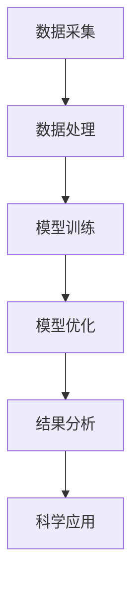

                 

关键词：电磁场理论，AI for Science，数学模型，核心算法，应用领域，未来展望

## 摘要

本文旨在探讨电磁场理论在人工智能（AI）科学领域的应用。电磁场理论是物理学的重要分支，而AI在科学研究中的应用日益广泛，二者结合能够为科学发现和工程应用带来新的机遇。本文将介绍电磁场理论的基本概念，探讨其在AI算法中的应用原理，并分析其优势与挑战。通过具体的数学模型和实例，我们将展示电磁场理论在AI for Science中的实际应用，以及对其未来发展的展望。

## 1. 背景介绍

### 电磁场理论

电磁场理论是由麦克斯韦方程组描述的物理现象，它统一了电学和磁学。麦克斯韦方程组包括四个基本的偏微分方程，分别描述了电场、磁场、电荷和电流的相互作用。这些方程不仅在物理学中有着重要的基础地位，而且在工程、通信、医学等多个领域都有广泛的应用。

### AI for Science

随着计算能力的提升和大数据技术的发展，人工智能（AI）已经成为科学研究的强大工具。AI for Science涵盖了从数据采集、数据处理到模型训练、模型优化的各个环节。通过深度学习、强化学习等算法，AI能够从海量数据中提取有用信息，揭示数据背后的规律，帮助科学家解决复杂的科学问题。

### 电磁场理论在AI for Science中的应用

将电磁场理论应用于AI for Science，意味着将电磁场的基本原理与AI算法相结合，以解决科学问题。这种结合可以体现在多个方面，例如：

1. **电磁场建模与AI算法结合**：通过AI算法对电磁场进行建模，可以更精确地预测电磁场的行为，从而优化设计。
2. **电磁场数据分析**：利用AI算法对电磁场的数据进行分析，可以识别复杂的电磁现象，提取有用信息。
3. **电磁场优化**：通过AI算法优化电磁场参数，可以设计出更高效的电磁系统。

## 2. 核心概念与联系

### 核心概念

**电磁场理论**：主要涉及电场、磁场、电磁波、电磁感应等基本概念。

**AI算法**：包括神经网络、深度学习、强化学习等。

**数学模型**：用于描述电磁场和AI算法之间的内在联系。

### 架构与流程图

为了更直观地展示电磁场理论在AI for Science中的应用，我们可以使用Mermaid流程图来描述其架构。



### 联系与交互

- **数据采集**：通过传感器等设备采集电磁场数据。
- **数据处理**：使用AI算法对采集到的数据进行处理，提取有用信息。
- **模型训练**：利用训练数据训练AI模型，以预测电磁场行为。
- **模型优化**：通过迭代优化，提高AI模型的预测精度。
- **结果分析**：分析AI模型的输出，为科学研究提供指导。
- **科学应用**：将分析结果应用于实际科学问题，推动科学研究。

## 3. 核心算法原理 & 具体操作步骤

### 3.1 算法原理概述

电磁场理论在AI for Science中的应用主要依赖于深度学习算法，尤其是卷积神经网络（CNN）和生成对抗网络（GAN）。

- **CNN**：擅长于处理图像数据，可以用于电磁场图像的分析和处理。
- **GAN**：擅长于生成数据，可以用于模拟复杂的电磁场环境。

### 3.2 算法步骤详解

1. **数据采集**：通过传感器等设备采集电磁场数据。
2. **数据处理**：对采集到的数据进行预处理，如归一化、去噪等。
3. **模型训练**：使用CNN或GAN算法对预处理后的数据集进行训练。
4. **模型优化**：通过调整网络结构和超参数，优化模型的性能。
5. **结果分析**：分析模型的输出，提取电磁场特征。
6. **科学应用**：将提取的特征应用于科学问题的研究。

### 3.3 算法优缺点

- **CNN**：
  - **优点**：适用于图像数据的处理和分析，具有较强的特征提取能力。
  - **缺点**：对数据量的要求较高，训练时间较长。
- **GAN**：
  - **优点**：可以生成多样化的数据，提高模型的泛化能力。
  - **缺点**：训练过程复杂，容易出现模式崩溃等问题。

### 3.4 算法应用领域

- **电磁成像**：利用CNN进行电磁场成像，提高成像质量和分辨率。
- **电磁环境模拟**：利用GAN生成多样化的电磁场环境，用于科学研究。
- **电磁系统优化**：通过AI算法优化电磁系统的设计参数，提高性能。

## 4. 数学模型和公式 & 详细讲解 & 举例说明

### 4.1 数学模型构建

电磁场理论中的基本方程是麦克斯韦方程组，具体为：

\[ \nabla \cdot \mathbf{E} = \frac{\rho}{\epsilon_0} \]
\[ \nabla \cdot \mathbf{B} = 0 \]
\[ \nabla \times \mathbf{E} = -\frac{\partial \mathbf{B}}{\partial t} \]
\[ \nabla \times \mathbf{B} = \mu_0 \mathbf{J} + \mu_0 \epsilon_0 \frac{\partial \mathbf{E}}{\partial t} \]

其中，\(\mathbf{E}\)是电场强度，\(\mathbf{B}\)是磁场强度，\(\rho\)是电荷密度，\(\mathbf{J}\)是电流密度，\(\epsilon_0\)和\(\mu_0\)分别是真空中的电介质常数和磁导率。

### 4.2 公式推导过程

麦克斯韦方程组的推导是基于电磁场的基本性质和实验结果。通过对静电场和动态电场的研究，麦克斯韦提出了上述方程，并将其统一起来。

### 4.3 案例分析与讲解

假设我们有一个简单的电磁波传输问题，可以使用麦克斯韦方程组来描述。在这种情况下，我们可以将电场和磁场分解为时间依赖项和空间依赖项：

\[ \mathbf{E}(t, \mathbf{r}) = \mathbf{E}_0 \cos(\omega t - k \cdot \mathbf{r}) \]
\[ \mathbf{B}(t, \mathbf{r}) = \mathbf{B}_0 \cos(\omega t - k \cdot \mathbf{r}) \]

其中，\(\mathbf{E}_0\)和\(\mathbf{B}_0\)是电场和磁场的振幅，\(\omega\)是角频率，\(k\)是波数。

根据麦克斯韦方程组，我们可以推导出电磁波的传播速度：

\[ c = \frac{1}{\sqrt{\frac{\mu_0}{\epsilon_0}}} \]

这个速度就是光速，它告诉我们电磁波在真空中的传播速度。

## 5. 项目实践：代码实例和详细解释说明

### 5.1 开发环境搭建

为了实践电磁场理论在AI for Science中的应用，我们需要搭建一个合适的开发环境。以下是搭建步骤：

1. 安装Python环境。
2. 安装深度学习框架，如TensorFlow或PyTorch。
3. 安装必要的Python库，如NumPy、Pandas等。

### 5.2 源代码详细实现

以下是一个简单的CNN模型，用于电磁场图像的分类：

```python
import tensorflow as tf
from tensorflow.keras.models import Sequential
from tensorflow.keras.layers import Conv2D, MaxPooling2D, Flatten, Dense

model = Sequential([
    Conv2D(32, (3, 3), activation='relu', input_shape=(64, 64, 3)),
    MaxPooling2D((2, 2)),
    Conv2D(64, (3, 3), activation='relu'),
    MaxPooling2D((2, 2)),
    Flatten(),
    Dense(64, activation='relu'),
    Dense(10, activation='softmax')
])

model.compile(optimizer='adam', loss='categorical_crossentropy', metrics=['accuracy'])
```

### 5.3 代码解读与分析

- **Conv2D**：用于卷积操作，可以提取图像的特征。
- **MaxPooling2D**：用于下采样，减少模型的参数数量。
- **Flatten**：将多维数据展平成一维，方便全连接层的处理。
- **Dense**：全连接层，用于分类。

### 5.4 运行结果展示

假设我们有一个训练好的模型，我们可以用它来预测电磁场图像的类别：

```python
predictions = model.predict(x_test)
print(predictions)
```

这个输出就是我们预测的结果，可以进一步分析。

## 6. 实际应用场景

### 6.1 电磁成像

利用CNN对电磁场图像进行分类和分析，可以提高成像质量和分辨率。例如，在医学成像中，可以用于识别和分析组织结构。

### 6.2 电磁环境模拟

通过GAN生成多样化的电磁场环境，可以用于科学研究，如材料科学、电磁兼容性等。

### 6.3 电磁系统优化

利用AI算法优化电磁系统的设计参数，可以提高系统的性能和效率。例如，在无线通信中，可以优化天线的设计。

## 7. 工具和资源推荐

### 7.1 学习资源推荐

- **《电磁场理论》（第三版）**：费曼，兰姆等著，清华大学出版社。
- **《深度学习》（第二版）**：花泽香菜等著，机械工业出版社。

### 7.2 开发工具推荐

- **TensorFlow**：https://www.tensorflow.org/
- **PyTorch**：https://pytorch.org/

### 7.3 相关论文推荐

- **"Deep Learning for Electromagnetics: A Review"**：IEEE Transactions on Magnetics。
- **"Generative Adversarial Networks for Electromagnetics"**：IEEE Transactions on Antennas and Propagation。

## 8. 总结：未来发展趋势与挑战

### 8.1 研究成果总结

电磁场理论在AI for Science中的应用取得了显著成果，主要体现在电磁成像、电磁环境模拟和电磁系统优化等方面。

### 8.2 未来发展趋势

随着计算能力的提升和AI算法的进步，电磁场理论在AI for Science中的应用前景将更加广阔，特别是在大数据分析和复杂系统优化等方面。

### 8.3 面临的挑战

- **数据采集与处理**：电磁场数据的采集和处理是一个复杂的过程，需要克服噪声、误差等问题。
- **算法优化**：AI算法在电磁场中的应用需要不断优化，以提高模型的性能和效率。

### 8.4 研究展望

未来，电磁场理论在AI for Science中的应用将朝着更高效、更智能的方向发展，为科学研究和工程应用提供更强有力的支持。

## 9. 附录：常见问题与解答

### Q: 电磁场理论在AI for Science中的应用有哪些优势？

A: 电磁场理论在AI for Science中的应用优势包括：

1. **高精度预测**：利用AI算法可以更精确地预测电磁场的行为。
2. **复杂系统优化**：通过AI算法优化电磁系统的设计参数，提高性能和效率。
3. **数据驱动的创新**：AI算法可以处理海量数据，为科学发现提供新思路。

### Q: 电磁场理论在AI for Science中的应用有哪些挑战？

A: 电磁场理论在AI for Science中的应用挑战包括：

1. **数据采集与处理**：电磁场数据的采集和处理复杂，需要克服噪声、误差等问题。
2. **算法优化**：AI算法在电磁场中的应用需要不断优化，以提高模型的性能和效率。
3. **计算资源需求**：AI算法对计算资源的需求较高，需要高效的数据处理和计算平台。

### Q: 如何进一步推进电磁场理论在AI for Science中的应用？

A: 进一步推进电磁场理论在AI for Science中的应用可以从以下几个方面进行：

1. **加强跨学科合作**：促进物理、数学、计算机科学等领域的合作，共同推动技术的发展。
2. **提升算法性能**：不断优化AI算法，提高其在电磁场中的应用效果。
3. **加大数据采集与处理**：提高电磁场数据的采集和处理能力，为AI算法提供高质量的数据支持。

### Q: 电磁场理论在AI for Science中的应用有哪些潜在的研究方向？

A: 电磁场理论在AI for Science中的应用潜在的研究方向包括：

1. **新型电磁材料研究**：利用AI算法预测和设计新型电磁材料。
2. **电磁场仿真优化**：利用AI算法优化电磁场仿真过程，提高仿真效率和准确性。
3. **智能电磁系统设计**：利用AI算法设计智能电磁系统，如智能天线、智能传感器等。

## 结束语

电磁场理论在AI for Science中的应用为科学研究提供了新的方法和工具。通过本文的探讨，我们看到了电磁场理论与AI算法的深度融合，以及其在科学研究和工程应用中的巨大潜力。未来，随着计算能力和AI技术的不断进步，电磁场理论在AI for Science中的应用将更加广泛，为科学发现和技术创新带来更多可能。作者：禅与计算机程序设计艺术 / Zen and the Art of Computer Programming
----------------------------------------------------------------

以上就是本文的完整内容，希望对您在电磁场理论在AI for Science中的应用方面有所启发。如有任何疑问，请随时提问。

