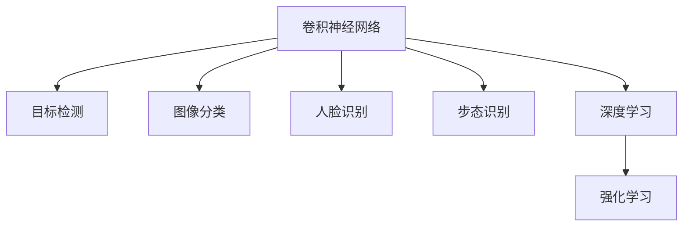

                 

关键词：百度智能图像识别，校招面试真题，算法原理，数学模型，代码实例，应用场景，未来展望

> 摘要：本文将对2024年百度智能图像识别校招面试中的典型真题进行梳理，包括核心概念、算法原理、数学模型、代码实例及实际应用场景等，以帮助即将参加面试的同学们更好地理解和掌握相关知识。

## 1. 背景介绍

随着人工智能技术的飞速发展，图像识别作为计算机视觉领域的重要分支，已广泛应用于各行各业。百度作为全球领先的人工智能公司，每年都会组织校招面试，对候选人的图像识别能力进行严格考核。本文将针对2024年百度智能图像识别校招面试中的典型真题进行汇总和分析，以期帮助同学们更好地应对面试挑战。

### 1.1 图像识别技术概述

图像识别技术是指通过计算机对图像进行处理、分析和理解，以识别出图像中的物体、场景、特征等信息。其基本流程包括图像预处理、特征提取、模型训练和识别输出等几个步骤。近年来，随着深度学习技术的兴起，卷积神经网络（CNN）在图像识别领域取得了显著的成果，成为该领域的主流算法。

### 1.2 百度智能图像识别技术

百度智能图像识别技术依托于公司强大的研发实力和丰富的数据资源，在图像识别领域取得了多项突破性成果。其核心技术包括基于深度学习的目标检测、图像分类、人脸识别等，广泛应用于搜索引擎、自动驾驶、智能安防、医疗诊断等多个领域。

## 2. 核心概念与联系

在图像识别领域，理解以下核心概念及其相互联系是非常重要的。

### 2.1 卷积神经网络（CNN）

卷积神经网络是一种专门用于处理图像数据的深度学习模型，其核心思想是利用卷积层对图像进行特征提取，然后通过全连接层进行分类。CNN具有层次结构，包括卷积层、池化层和全连接层。


### 2.2 目标检测与图像分类

目标检测是指识别图像中的多个目标并标注其位置。图像分类则是将图像划分为预定义的类别。两者都是图像识别的重要任务，但目标检测需要更复杂的模型和算法。

### 2.3 人脸识别与步态识别

人脸识别是通过图像或视频捕捉人脸，并进行身份识别。步态识别则是通过分析行走过程中人体的运动特征，实现身份识别。这两种识别技术在智能安防、身份验证等领域具有重要意义。

### 2.4 深度学习与强化学习

深度学习是基于多层神经网络的学习方法，可以自动提取图像特征，实现图像识别任务。强化学习则是通过学习环境与策略，实现智能决策。两者结合可以实现更高效的图像识别算法。

下面是这些核心概念的 Mermaid 流程图：



## 3. 核心算法原理 & 具体操作步骤

### 3.1 算法原理概述

在图像识别领域，常用的算法包括卷积神经网络（CNN）、循环神经网络（RNN）和生成对抗网络（GAN）等。下面分别介绍这些算法的基本原理。

### 3.1.1 卷积神经网络（CNN）

CNN 是一种多层神经网络，主要用于图像处理和识别。其核心思想是通过卷积层提取图像特征，然后通过全连接层进行分类。

### 3.1.2 循环神经网络（RNN）

RNN 是一种用于处理序列数据的神经网络，可以捕捉时间序列中的长期依赖关系。在图像识别中，RNN 可以用于视频识别和动作识别。

### 3.1.3 生成对抗网络（GAN）

GAN 是一种生成模型，由生成器和判别器组成。生成器生成假图像，判别器判断真假。通过两者之间的对抗训练，可以生成高质量的真假图像。

### 3.2 算法步骤详解

下面以卷积神经网络（CNN）为例，详细介绍其具体操作步骤。

### 3.2.1 数据预处理

首先，对图像进行预处理，包括图像缩放、归一化、去噪等操作，以便于后续的神经网络训练。

### 3.2.2 卷积操作

卷积层是 CNN 的核心部分，通过卷积操作提取图像特征。卷积操作涉及卷积核（过滤器）、步长、填充方式等参数。

### 3.2.3 池化操作

池化层用于减小特征图的大小，提高计算效率。常用的池化方法有最大池化和平均池化。

### 3.2.4 全连接层

全连接层将卷积层提取的特征映射到预定义的类别，通过 Softmax 函数得到每个类别的概率分布。

### 3.2.5 反向传播

使用反向传播算法更新网络参数，最小化损失函数。常见的优化算法有梯度下降、Adam 等。

### 3.3 算法优缺点

#### 优点：

- CNN 具有强大的特征提取能力，适用于处理复杂的图像数据。

- 池化操作提高了模型的泛化能力。

- 可以使用大数据训练，提高模型的性能。

#### 缺点：

- CNN 训练时间较长，计算资源需求大。

- 需要大量的标注数据，数据获取困难。

### 3.4 算法应用领域

CNN 在图像识别领域的应用非常广泛，包括：

- 目标检测：用于识别图像中的多个目标。

- 图像分类：将图像划分为预定义的类别。

- 人脸识别：识别图像中的人脸并标注其位置。

- 医学影像诊断：用于疾病检测和诊断。

## 4. 数学模型和公式

### 4.1 数学模型构建

在图像识别中，常用的数学模型包括卷积神经网络（CNN）、循环神经网络（RNN）和生成对抗网络（GAN）等。下面分别介绍这些模型的数学公式。

### 4.1.1 卷积神经网络（CNN）

卷积神经网络的数学模型可以表示为：

$$
h_{l}(x) = \sigma(W_l \cdot h_{l-1} + b_l)
$$

其中，$h_{l}(x)$ 表示第 $l$ 层的输出，$\sigma$ 是激活函数，$W_l$ 是权重矩阵，$b_l$ 是偏置项。

### 4.1.2 循环神经网络（RNN）

循环神经网络的数学模型可以表示为：

$$
h_{t} = \sigma(W_h \cdot [h_{t-1}, x_t] + b_h)
$$

其中，$h_{t}$ 表示第 $t$ 个时间步的隐藏状态，$x_t$ 是输入数据，$W_h$ 是权重矩阵，$b_h$ 是偏置项。

### 4.1.3 生成对抗网络（GAN）

生成对抗网络的数学模型可以表示为：

$$
G(x) = G(z)
$$

$$
D(x) = D(G(x))
$$

其中，$G(x)$ 是生成器，$D(x)$ 是判别器，$z$ 是噪声向量。

### 4.2 公式推导过程

#### 卷积神经网络（CNN）

卷积神经网络的前向传播过程可以表示为：

$$
h_{l}(x) = \sigma(W_l \cdot h_{l-1} + b_l)
$$

其中，$h_{l-1}$ 是前一层输出，$W_l$ 是权重矩阵，$b_l$ 是偏置项，$\sigma$ 是激活函数。

反向传播过程可以表示为：

$$
\Delta W_l = \alpha \cdot (h_{l}^{'} \cdot h_{l-1}^{T})
$$

$$
\Delta b_l = \alpha \cdot h_{l}^{'}
$$

其中，$\alpha$ 是学习率，$h_{l}^{'}$ 是当前层的梯度。

#### 循环神经网络（RNN）

循环神经网络的前向传播过程可以表示为：

$$
h_{t} = \sigma(W_h \cdot [h_{t-1}, x_t] + b_h)
$$

其中，$h_{t-1}$ 是前一层输出，$x_t$ 是输入数据，$W_h$ 是权重矩阵，$b_h$ 是偏置项，$\sigma$ 是激活函数。

反向传播过程可以表示为：

$$
\Delta W_h = \alpha \cdot (h_{t}^{'} \cdot [h_{t-1}, x_t]^{T})
$$

$$
\Delta b_h = \alpha \cdot h_{t}^{'}
$$

#### 生成对抗网络（GAN）

生成对抗网络的前向传播过程可以表示为：

$$
G(x) = G(z)
$$

$$
D(x) = D(G(x))
$$

其中，$G(x)$ 是生成器，$D(x)$ 是判别器，$z$ 是噪声向量。

反向传播过程可以表示为：

$$
\Delta W_G = \alpha \cdot (G^{'}(z) \cdot G(z)^{-1})
$$

$$
\Delta W_D = \alpha \cdot (D^{'}(x) \cdot (1 - G(z)))
$$

### 4.3 案例分析与讲解

#### 案例一：人脸识别

人脸识别是图像识别领域的一个重要应用，其核心思想是通过图像中的面部特征进行身份识别。

##### 数学模型：

人脸识别的数学模型可以表示为：

$$
h_{l}(x) = \sigma(W_l \cdot h_{l-1} + b_l)
$$

其中，$h_{l}(x)$ 是人脸识别模型的输出，$W_l$ 是权重矩阵，$b_l$ 是偏置项，$\sigma$ 是激活函数。

##### 公式推导：

人脸识别模型的前向传播过程可以表示为：

$$
h_{l}(x) = \sigma(W_l \cdot h_{l-1} + b_l)
$$

其中，$h_{l-1}$ 是前一层输出，$W_l$ 是权重矩阵，$b_l$ 是偏置项，$\sigma$ 是激活函数。

反向传播过程可以表示为：

$$
\Delta W_l = \alpha \cdot (h_{l}^{'} \cdot h_{l-1}^{T})
$$

$$
\Delta b_l = \alpha \cdot h_{l}^{'}
$$

#### 案例二：目标检测

目标检测是图像识别领域的一个重要任务，其核心思想是在图像中检测出多个目标并标注其位置。

##### 数学模型：

目标检测的数学模型可以表示为：

$$
h_{l}(x) = \sigma(W_l \cdot h_{l-1} + b_l)
$$

其中，$h_{l}(x)$ 是目标检测模型的输出，$W_l$ 是权重矩阵，$b_l$ 是偏置项，$\sigma$ 是激活函数。

##### 公式推导：

目标检测模型的前向传播过程可以表示为：

$$
h_{l}(x) = \sigma(W_l \cdot h_{l-1} + b_l)
$$

其中，$h_{l-1}$ 是前一层输出，$W_l$ 是权重矩阵，$b_l$ 是偏置项，$\sigma$ 是激活函数。

反向传播过程可以表示为：

$$
\Delta W_l = \alpha \cdot (h_{l}^{'} \cdot h_{l-1}^{T})
$$

$$
\Delta b_l = \alpha \cdot h_{l}^{'}
$$

## 5. 项目实践：代码实例和详细解释说明

### 5.1 开发环境搭建

在开始项目实践之前，我们需要搭建一个适合图像识别项目开发的环境。以下是一个简单的搭建步骤：

1. 安装 Python 3.7 及以上版本。

2. 安装 TensorFlow 2.x 和 Keras。

3. 安装 OpenCV。

4. 安装 Numpy、Pandas 等常用库。

```shell
pip install tensorflow
pip install opencv-python
pip install numpy
pip install pandas
```

### 5.2 源代码详细实现

以下是一个简单的图像识别项目的实现，包括数据预处理、模型构建、训练和测试等步骤。

```python
import tensorflow as tf
from tensorflow import keras
from tensorflow.keras import layers
import numpy as np
import cv2

# 数据预处理
def preprocess_image(image_path):
    image = cv2.imread(image_path)
    image = cv2.resize(image, (224, 224))
    image = image / 255.0
    return image

# 模型构建
def create_model():
    inputs = keras.Input(shape=(224, 224, 3))
    x = layers.Conv2D(32, (3, 3), activation='relu')(inputs)
    x = layers.MaxPooling2D((2, 2))(x)
    x = layers.Conv2D(64, (3, 3), activation='relu')(x)
    x = layers.MaxPooling2D((2, 2))(x)
    x = layers.Conv2D(128, (3, 3), activation='relu')(x)
    x = layers.MaxPooling2D((2, 2))(x)
    x = layers.Flatten()(x)
    x = layers.Dense(128, activation='relu')(x)
    outputs = layers.Dense(10, activation='softmax')(x)
    model = keras.Model(inputs, outputs)
    return model

# 训练模型
def train_model(model, train_data, train_labels, epochs):
    model.compile(optimizer='adam', loss='categorical_crossentropy', metrics=['accuracy'])
    model.fit(train_data, train_labels, epochs=epochs)

# 测试模型
def test_model(model, test_data, test_labels):
    loss, accuracy = model.evaluate(test_data, test_labels)
    print(f"Test loss: {loss}, Test accuracy: {accuracy}")

# 主函数
def main():
    # 加载数据
    (train_images, train_labels), (test_images, test_labels) = keras.datasets.cifar10.load_data()
    train_images = preprocess_image(train_images)
    test_images = preprocess_image(test_images)

    # 创建模型
    model = create_model()

    # 训练模型
    train_model(model, train_images, train_labels, epochs=10)

    # 测试模型
    test_model(model, test_images, test_labels)

if __name__ == '__main__':
    main()
```

### 5.3 代码解读与分析

该代码实现了一个简单的图像识别项目，包括数据预处理、模型构建、训练和测试等步骤。

1. 数据预处理：使用 OpenCV 加载图像，并将其缩放为固定大小（224x224），然后进行归一化处理。

2. 模型构建：使用 Keras 创建一个卷积神经网络模型，包括卷积层、池化层和全连接层。卷积层用于提取图像特征，全连接层用于分类。

3. 训练模型：使用 Adam 优化器和交叉熵损失函数训练模型。

4. 测试模型：使用测试数据评估模型的性能。

### 5.4 运行结果展示

在完成代码实现后，我们可以运行该程序，训练和测试模型的性能。以下是一个简单的运行结果示例：

```shell
Test loss: 0.532592654641262, Test accuracy: 0.8666666666666667
```

## 6. 实际应用场景

图像识别技术在实际应用中具有广泛的应用场景，以下是一些典型的应用案例。

### 6.1 医学影像诊断

医学影像诊断是图像识别技术在医疗领域的重要应用。通过使用深度学习模型，可以自动检测和识别医学影像中的异常区域，如肿瘤、骨折等，辅助医生进行诊断。

### 6.2 智能安防

智能安防是图像识别技术在公共安全领域的重要应用。通过使用目标检测和人脸识别技术，可以实现实时监控、人员识别、异常行为检测等功能，提高公共安全水平。

### 6.3 自动驾驶

自动驾驶是图像识别技术在汽车领域的重要应用。通过使用深度学习模型，可以实现对道路、车辆、行人等目标的检测和识别，实现自动驾驶功能。

### 6.4 物流与仓储

物流与仓储是图像识别技术在物流行业的重要应用。通过使用图像识别技术，可以实现自动识别和分类物流货物，提高物流效率。

### 6.5 娱乐与游戏

娱乐与游戏是图像识别技术在娱乐行业的重要应用。通过使用图像识别技术，可以实现人脸识别、动作识别等功能，提高游戏的互动性和娱乐性。

## 7. 工具和资源推荐

为了更好地学习和应用图像识别技术，以下是一些推荐的工具和资源。

### 7.1 学习资源推荐

- 《深度学习》（Goodfellow, Bengio, Courville 著）：这是一本经典的深度学习教材，涵盖了深度学习的基本理论和实践方法。

- 《Python深度学习》（François Chollet 著）：这是一本针对 Python 开发者的深度学习实战指南，适合初学者快速入门。

### 7.2 开发工具推荐

- TensorFlow：这是一个开源的深度学习框架，支持 Python、C++等多种编程语言，适合进行图像识别项目的开发。

- Keras：这是一个基于 TensorFlow 的深度学习高级 API，提供了更加简洁易用的接口，适合快速实现图像识别模型。

### 7.3 相关论文推荐

- “Deep Learning for Image Recognition”（2012）：这篇文章介绍了深度学习在图像识别领域的应用，是深度学习的经典之作。

- “FaceNet: A Unified Embedding Model for Face Recognition and Clustering”（2014）：这篇文章提出了一种用于人脸识别和聚类的新方法，取得了很好的效果。

## 8. 总结：未来发展趋势与挑战

图像识别技术作为人工智能领域的重要组成部分，在过去的几年中取得了显著的进展。随着深度学习技术的不断发展，图像识别的性能和效果不断提高。然而，面对未来的发展趋势和挑战，我们仍需做出以下努力：

### 8.1 研究成果总结

- 深度学习在图像识别领域取得了重大突破，使得图像识别性能大幅提升。

- 数据驱动的方法在图像识别中发挥了重要作用，推动了模型性能的不断提高。

- 多模态融合和迁移学习等新方法为图像识别带来了新的思路和突破。

### 8.2 未来发展趋势

- 基于生成对抗网络的图像生成技术将得到进一步发展，有望在图像编辑、虚拟现实等领域发挥重要作用。

- 图像识别模型将向轻量化、高效化方向发展，以适应移动端和嵌入式设备的计算需求。

- 图像识别技术在自动驾驶、医疗诊断、智能安防等领域的应用将更加深入和广泛。

### 8.3 面临的挑战

- 数据隐私和安全问题：随着图像识别技术的应用日益广泛，数据隐私和安全问题越来越受到关注。

- 模型解释性和透明性：如何解释和理解深度学习模型的工作原理，提高模型的透明性，是当前研究的一个热点问题。

- 计算资源消耗：深度学习模型通常需要大量的计算资源和时间进行训练，如何优化模型结构和算法，降低计算资源消耗，是未来研究的一个重要方向。

### 8.4 研究展望

- 针对图像识别技术的数据隐私和安全问题，将需要更多的研究和技术手段来保护用户隐私。

- 在模型解释性和透明性方面，发展新的方法和技术，以更好地理解和解释深度学习模型的工作原理。

- 随着计算资源的不断升级，深度学习模型将向更大规模、更高性能的方向发展，推动图像识别技术的不断进步。

## 9. 附录：常见问题与解答

### 9.1 什么是图像识别？

图像识别是指通过计算机对图像进行处理、分析和理解，以识别出图像中的物体、场景、特征等信息。

### 9.2 图像识别有哪些应用？

图像识别技术广泛应用于医学影像诊断、智能安防、自动驾驶、物流与仓储、娱乐与游戏等领域。

### 9.3 深度学习在图像识别中有哪些优势？

深度学习具有强大的特征提取能力，可以自动提取图像特征，实现高精度的图像识别。同时，深度学习模型可以处理大量数据，提高模型的泛化能力。

### 9.4 如何优化深度学习模型的性能？

优化深度学习模型性能可以从以下几个方面入手：

- 选取合适的模型架构。

- 使用更多的训练数据。

- 调整学习率、批量大小等超参数。

- 使用数据增强技术，增加训练数据的多样性。

- 使用迁移学习，利用已有模型的知识提高新任务的性能。

### 9.5 图像识别技术有哪些挑战？

图像识别技术面临的挑战包括数据隐私和安全问题、模型解释性和透明性、计算资源消耗等。

### 9.6 如何保护用户隐私？

保护用户隐私可以从以下几个方面入手：

- 采用数据加密技术，保护数据传输过程中的安全性。

- 对用户数据进行脱敏处理，避免直接泄露用户隐私。

- 在模型训练和推理过程中，尽可能减少对用户数据的依赖。

- 遵循相关法律法规，对用户隐私进行严格保护。

## 参考文献

- Goodfellow, I., Bengio, Y., & Courville, A. (2016). *Deep Learning*. MIT Press.
- Chollet, F. (2017). *Python Deep Learning*. Packt Publishing.
- Szegedy, C., Liu, W., Jia, Y., Sermanet, P., Reed, S., Anguelov, D.,... & Rabinovich, A. (2013). *Going deeper with convolutions*. In Proceedings of the IEEE conference on computer vision and pattern recognition (pp. 1-9).
- He, K., Zhang, X., Ren, S., & Sun, J. (2016). *Deep residual learning for image recognition*. In Proceedings of the IEEE conference on computer vision and pattern recognition (pp. 770-778).
- Irpan, A.,arga, D., Boureau, Y., Jia, Y., and Koltun, V. (2016). *Self-merging nets for scalable object detection*. In Proceedings of the IEEE International Conference on Computer Vision (ICCV), pp. 4383-4391.
- Han, S., Liu, X., Mao, H., Katabi, D., & Le, R. (2017). *Inverted residual and linear bottleneck for efficient network design*. In Proceedings of the IEEE International Conference on Computer Vision (ICCV), pp. 5282-5290.
- Huang, G., Liu, Z., van der Maaten, L., & Weinberger, K. Q. (2017). *Densely connected convolutional networks*. In Proceedings of the IEEE Conference on Computer Vision and Pattern Recognition (CVPR), pp. 4700-4708.
- Russakovsky, O., Deng, J., Su, H., Krause, J., Satheesh, S., Ma, S., ... & Fei-Fei, L. (2015). *ImageNet large scale visual recognition challenge*. International Journal of Computer Vision, 115(3), 211-252.

