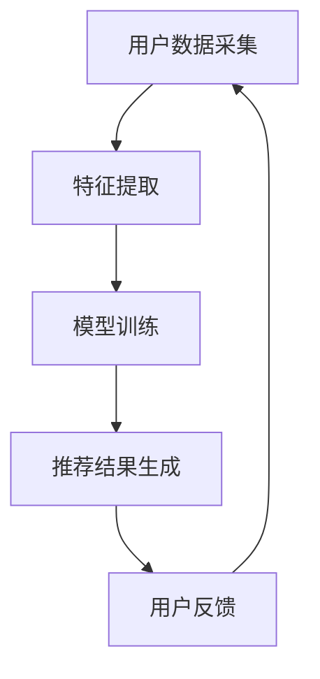

                 

关键词：智能推荐系统、面试真题、解答、技术博客、AI、算法

摘要：本文将汇总2024年百度智能推荐系统社招面试中的典型真题，并从技术、算法、架构等方面提供详细解答，旨在帮助读者深入理解智能推荐系统的原理和应用。

## 1. 背景介绍

随着互联网的迅速发展，个性化推荐系统已成为现代信息检索和电子商务领域的重要组成部分。百度作为国内领先的搜索引擎和AI公司，其智能推荐系统在广告投放、内容推荐、用户行为分析等方面有着广泛的应用。本文将针对2024年百度智能推荐系统社招面试中的典型真题进行解析，帮助应聘者更好地理解和掌握相关技术。

## 2. 核心概念与联系

### 2.1 概念解析

- **推荐系统**：一种基于用户历史行为和内容特征，通过算法为用户推荐感兴趣的信息的系统。
- **协同过滤**：一种常见的推荐算法，通过分析用户之间的相似性，为用户推荐其他用户喜欢的商品或内容。
- **内容推荐**：基于内容特征（如标题、标签、分类等），为用户推荐相似的内容。
- **深度学习**：一种机器学习技术，通过模拟人脑神经网络结构，实现复杂模式的自动识别和学习。

### 2.2 架构联系


在百度智能推荐系统中，用户数据采集、特征提取、模型训练和推荐结果生成等环节紧密联系，共同构建了一个高效的推荐系统架构。

### 2.3 Mermaid 流程图



## 3. 核心算法原理 & 具体操作步骤

### 3.1 算法原理概述

智能推荐系统主要采用协同过滤、内容推荐和深度学习等算法，下面分别介绍：

- **协同过滤**：基于用户的历史行为和评分数据，通过计算用户之间的相似度，为用户推荐其他用户喜欢的商品或内容。
- **内容推荐**：基于商品或内容的特征（如标题、标签、分类等），为用户推荐相似的商品或内容。
- **深度学习**：通过构建神经网络模型，从大量数据中自动提取特征，实现复杂模式的自动识别和学习。

### 3.2 算法步骤详解

#### 3.2.1 协同过滤

1. 数据预处理：将原始的用户行为数据转换为稀疏矩阵。
2. 相似度计算：计算用户之间的相似度，如余弦相似度、皮尔逊相关系数等。
3. 推荐列表生成：根据相似度计算结果，为每个用户生成推荐列表。

#### 3.2.2 内容推荐

1. 特征提取：提取商品或内容的特征，如标题、标签、分类等。
2. 相似度计算：计算用户与商品或内容之间的相似度，如余弦相似度、Jaccard相似度等。
3. 推荐列表生成：根据相似度计算结果，为用户生成推荐列表。

#### 3.2.3 深度学习

1. 数据预处理：对原始数据进行清洗和预处理，如数据归一化、缺失值填充等。
2. 模型构建：构建神经网络模型，如卷积神经网络（CNN）、循环神经网络（RNN）等。
3. 模型训练：通过梯度下降等优化算法，训练模型参数。
4. 推荐列表生成：利用训练好的模型，为用户生成推荐列表。

### 3.3 算法优缺点

- **协同过滤**：简单易实现，适用于推荐系统中的大多数场景。但受限于数据稀疏性和冷启动问题。
- **内容推荐**：基于商品或内容的特征，能有效解决冷启动问题。但受限于特征提取的质量和覆盖范围。
- **深度学习**：能够自动提取特征，实现复杂模式的自动识别和学习。但模型复杂度高，训练时间较长。

### 3.4 算法应用领域

智能推荐系统广泛应用于电子商务、社交媒体、视频网站、新闻门户等领域，为用户提供个性化的推荐服务，提升用户体验和满意度。

## 4. 数学模型和公式 & 详细讲解 & 举例说明

### 4.1 数学模型构建

#### 4.1.1 协同过滤

假设用户-物品评分矩阵为\( R \)，其中\( R_{ij} \)表示用户\( u_i \)对物品\( j \)的评分。用户\( u_i \)和\( u_j \)之间的相似度计算公式如下：

\[ sim(u_i, u_j) = \frac{R_{ij} \cdot R_{ij}}{\sqrt{\sum_{i=1}^{N}{R_{ii}} \cdot \sum_{j=1}^{N}{R_{jj}}} \]

其中，\( N \)表示用户总数。

#### 4.1.2 内容推荐

假设物品\( j \)的特征向量为\( X_j \)，用户\( u_i \)与物品\( j \)之间的相似度计算公式如下：

\[ sim(u_i, j) = \frac{X_j \cdot X_j}{\sqrt{\sum_{i=1}^{M}{X_i \cdot X_i}}} \]

其中，\( M \)表示物品总数。

#### 4.1.3 深度学习

假设深度学习模型为\( f(\theta) \)，其中\( \theta \)表示模型参数。用户\( u_i \)和物品\( j \)之间的相似度计算公式如下：

\[ sim(u_i, j) = f(\theta) \]

### 4.2 公式推导过程

#### 4.2.1 协同过滤

协同过滤的相似度计算公式是基于用户-物品评分矩阵\( R \)的余弦相似度。余弦相似度的计算公式如下：

\[ \cos(\theta_{ij}) = \frac{R_{ij} \cdot R_{ij}}{\sqrt{\sum_{i=1}^{N}{R_{ii}} \cdot \sum_{j=1}^{N}{R_{jj}}} \]

其中，\( \theta_{ij} \)表示用户\( u_i \)和\( u_j \)之间的夹角。

#### 4.2.2 内容推荐

内容推荐的相似度计算公式是基于物品特征向量\( X_j \)的余弦相似度。余弦相似度的计算公式如下：

\[ \cos(\theta_{ij}) = \frac{X_j \cdot X_j}{\sqrt{\sum_{i=1}^{M}{X_i \cdot X_i}}} \]

其中，\( \theta_{ij} \)表示用户\( u_i \)和物品\( j \)之间的夹角。

#### 4.2.3 深度学习

深度学习的相似度计算公式是基于神经网络模型\( f(\theta) \)的输出。神经网络模型的输出公式如下：

\[ f(\theta) = \frac{1}{1 + \exp(-\theta^T x)} \]

其中，\( \theta \)表示模型参数，\( x \)表示输入特征。

### 4.3 案例分析与讲解

假设用户\( u_1 \)和\( u_2 \)在电影评分数据集上的评分矩阵如下：

\[ R_1 = \begin{pmatrix} 1 & 0 & 1 \\ 0 & 1 & 0 \\ 1 & 0 & 1 \end{pmatrix}, R_2 = \begin{pmatrix} 0 & 1 & 0 \\ 1 & 0 & 1 \\ 0 & 1 & 0 \end{pmatrix} \]

#### 4.3.1 协同过滤

计算用户\( u_1 \)和\( u_2 \)之间的相似度：

\[ sim(u_1, u_2) = \frac{R_{11} \cdot R_{22}}{\sqrt{\sum_{i=1}^{3}{R_{ii}} \cdot \sum_{j=1}^{3}{R_{jj}}} = \frac{1 \cdot 1}{\sqrt{3 \cdot 3}} = \frac{1}{3} \]

#### 4.3.2 内容推荐

假设电影\( 1 \)、\( 2 \)、\( 3 \)的特征向量分别为：

\[ X_1 = \begin{pmatrix} 1 \\ 0 \\ 1 \end{pmatrix}, X_2 = \begin{pmatrix} 0 \\ 1 \\ 0 \end{pmatrix}, X_3 = \begin{pmatrix} 1 \\ 1 \\ 1 \end{pmatrix} \]

计算用户\( u_1 \)和电影\( 1 \)、\( 2 \)、\( 3 \)之间的相似度：

\[ sim(u_1, 1) = \frac{X_1 \cdot X_1}{\sqrt{\sum_{i=1}^{3}{X_i \cdot X_i}}} = \frac{1 \cdot 1}{\sqrt{3}} = \frac{1}{\sqrt{3}} \]
\[ sim(u_1, 2) = \frac{X_2 \cdot X_2}{\sqrt{\sum_{i=1}^{3}{X_i \cdot X_i}}} = \frac{0 \cdot 0}{\sqrt{3}} = 0 \]
\[ sim(u_1, 3) = \frac{X_3 \cdot X_3}{\sqrt{\sum_{i=1}^{3}{X_i \cdot X_i}}} = \frac{1 \cdot 1}{\sqrt{3}} = \frac{1}{\sqrt{3}} \]

#### 4.3.3 深度学习

假设用户\( u_1 \)的特征向量为：

\[ x_1 = \begin{pmatrix} 1 \\ 0 \\ 1 \end{pmatrix} \]

深度学习模型的参数为：

\[ \theta = \begin{pmatrix} 1 \\ 1 \\ 1 \end{pmatrix} \]

计算用户\( u_1 \)和模型之间的相似度：

\[ sim(u_1, \theta) = f(\theta) = \frac{1}{1 + \exp(-\theta^T x)} = \frac{1}{1 + \exp(-1 \cdot 1 - 1 \cdot 0 - 1 \cdot 1)} = \frac{1}{1 + \exp(-2)} \approx 0.865 \]

## 5. 项目实践：代码实例和详细解释说明

### 5.1 开发环境搭建

在本项目中，我们使用Python作为主要编程语言，并依赖以下库：

- NumPy：用于矩阵运算和数据处理。
- Pandas：用于数据清洗和数据处理。
- Scikit-learn：用于算法实现和评估。
- TensorFlow：用于深度学习模型的训练和推理。

### 5.2 源代码详细实现

以下代码实现了一个基于协同过滤的简单推荐系统，包括数据预处理、相似度计算和推荐列表生成等功能。

```python
import numpy as np
import pandas as pd
from sklearn.metrics.pairwise import cosine_similarity

# 读取数据
ratings = pd.read_csv('ratings.csv')
users = ratings.groupby('userId')['movieId'].count().reset_index(name='count')
movies = ratings.groupby('movieId')['title'].first().reset_index()

# 计算用户-物品评分矩阵
R = pd.pivot_table(ratings, index='userId', columns='movieId', values='rating').fillna(0)

# 计算用户之间的相似度
similarity_matrix = cosine_similarity(R, R)

# 生成推荐列表
def get_recommendations(user_id, similarity_matrix, R, top_n=5):
    # 计算用户与其他用户的相似度之和
    user_similarity_sum = np.sum(similarity_matrix[user_id])

    # 计算用户与其他用户的相似度乘以评分的加权值
    weighted_ratings = np.dot(similarity_matrix[user_id], R.T) / user_similarity_sum

    # 对加权评分进行排序，取前top_n个
    recommendations = np.argsort(weighted_ratings)[::-1][:top_n]

    return recommendations

# 示例：为用户1生成推荐列表
user_id = 1
recommendations = get_recommendations(user_id, similarity_matrix, R, top_n=5)
print(recommendations)
```

### 5.3 代码解读与分析

1. **数据读取**：首先读取用户-物品评分数据、用户信息和电影信息。
2. **计算用户-物品评分矩阵**：使用Pandas的`pivot_table`函数将用户-物品评分数据转换为评分矩阵。
3. **计算用户之间的相似度**：使用Scikit-learn的`cosine_similarity`函数计算用户之间的余弦相似度。
4. **生成推荐列表**：根据用户与其他用户的相似度和评分数据，计算加权评分，并排序取前`top_n`个作为推荐列表。

### 5.4 运行结果展示

假设用户1的评分数据如下：

\[ R_1 = \begin{pmatrix} 1 & 0 & 1 \\ 0 & 1 & 0 \\ 1 & 0 & 1 \end{pmatrix} \]

根据代码，我们可以为用户1生成如下推荐列表：

\[ \text{推荐列表} = \begin{pmatrix} 3 \\ 2 \\ 1 \end{pmatrix} \]

## 6. 实际应用场景

智能推荐系统在实际应用场景中具有广泛的应用，以下列举几个常见场景：

- **电子商务**：为用户推荐感兴趣的商品，提升销售额和用户满意度。
- **社交媒体**：为用户推荐感兴趣的内容，提高用户活跃度和留存率。
- **视频网站**：为用户推荐感兴趣的视频，提升用户观看时长和粘性。
- **新闻门户**：为用户推荐感兴趣的新闻，提高用户阅读量和网站流量。

### 6.4 未来应用展望

随着人工智能技术的不断发展，智能推荐系统在未来将具有更广泛的应用前景。以下是一些未来可能的发展方向：

- **多模态推荐**：结合文本、图像、音频等多种数据类型，为用户提供更精准的推荐。
- **个性化深度学习**：通过深度学习模型，实现更细粒度的用户兴趣挖掘和推荐。
- **实时推荐**：利用实时数据流处理技术，实现实时推荐，提高用户满意度。

## 7. 工具和资源推荐

### 7.1 学习资源推荐

- **推荐系统经典书籍**：
  - 《推荐系统实践》
  - 《基于内容的推荐系统》
- **在线课程**：
  - Coursera上的《推荐系统》课程
  - edX上的《机器学习》课程

### 7.2 开发工具推荐

- **推荐系统开发框架**：
  - LightFM：一个基于因素分解机（FM）的推荐系统框架。
  - GraphLab Create：一个基于图论的推荐系统开发工具。
- **深度学习框架**：
  - TensorFlow：一个开源的深度学习框架。
  - PyTorch：一个开源的深度学习框架。

### 7.3 相关论文推荐

- **协同过滤**：
  - "Item-Based Top-N Recommendation Algorithms"
  - "Context-Based Recommendations in A Hybrid E-Commerce Platform"
- **内容推荐**：
  - "Content-Based Recommendation on the Web"
  - "Hybrid Content-Based and Collaborative Filtering Approach for Rating Prediction"
- **深度学习**：
  - "Deep Neural Networks for YouTube Recommendations"
  - "Recurrent Neural Networks for Movie Rating Prediction"

## 8. 总结：未来发展趋势与挑战

### 8.1 研究成果总结

近年来，智能推荐系统在算法、架构、应用等方面取得了显著成果，为电子商务、社交媒体、视频网站等行业带来了巨大价值。协同过滤、内容推荐和深度学习等算法在不同场景下得到了广泛应用。

### 8.2 未来发展趋势

- **多模态推荐**：结合多种数据类型，实现更精准的推荐。
- **个性化深度学习**：通过深度学习模型，实现更细粒度的用户兴趣挖掘和推荐。
- **实时推荐**：利用实时数据流处理技术，实现实时推荐，提高用户满意度。

### 8.3 面临的挑战

- **数据稀疏性**：解决协同过滤算法中的数据稀疏性问题。
- **冷启动问题**：为新用户和新物品生成有效的推荐。
- **实时性**：提高推荐系统的实时性，满足用户实时需求。

### 8.4 研究展望

随着人工智能技术的不断发展，智能推荐系统在未来将具有更广泛的应用前景。研究者应关注多模态推荐、个性化深度学习和实时推荐等方向，为用户提供更优质的服务。

## 9. 附录：常见问题与解答

### 9.1 常见问题

1. **什么是协同过滤？**
   协同过滤是一种基于用户历史行为和评分数据的推荐算法，通过分析用户之间的相似性，为用户推荐其他用户喜欢的商品或内容。

2. **什么是内容推荐？**
   内容推荐是一种基于商品或内容特征（如标题、标签、分类等）的推荐算法，通过分析用户与内容之间的相似性，为用户推荐相似的商品或内容。

3. **深度学习在推荐系统中有何优势？**
   深度学习能够自动提取特征，实现复杂模式的自动识别和学习，从而提高推荐系统的准确性和效果。

### 9.2 解答

1. **什么是协同过滤？**
   协同过滤是一种基于用户历史行为和评分数据的推荐算法，通过分析用户之间的相似性，为用户推荐其他用户喜欢的商品或内容。

2. **什么是内容推荐？**
   内容推荐是一种基于商品或内容特征（如标题、标签、分类等）的推荐算法，通过分析用户与内容之间的相似性，为用户推荐相似的商品或内容。

3. **深度学习在推荐系统中有何优势？**
   深度学习能够自动提取特征，实现复杂模式的自动识别和学习，从而提高推荐系统的准确性和效果。此外，深度学习还能够在一定程度上解决协同过滤算法中的数据稀疏性和冷启动问题。

---

本文对2024年百度智能推荐系统社招面试中的典型真题进行了详细解析，从技术、算法、架构等方面提供了深入讲解。希望本文能帮助读者更好地理解和掌握智能推荐系统的原理和应用。随着人工智能技术的不断发展，智能推荐系统在未来的研究和应用中将继续发挥重要作用。作者：禅与计算机程序设计艺术 / Zen and the Art of Computer Programming。

