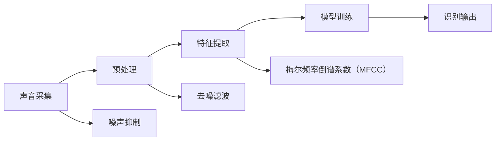

                 

关键词：智能语音识别、面试真题、校招、算法原理、应用领域

> 摘要：本文针对2024年百度智能语音识别校招面试真题进行了系统性的汇总和解答。文章旨在为准备参加智能语音识别校招的考生提供一个全面的技术指导，详细解析面试过程中的核心问题和解决方法。

## 1. 背景介绍

智能语音识别作为人工智能领域的重要分支，近年来得到了迅速发展。它不仅广泛应用于语音助手、语音翻译、语音搜索等场景，还在安防、智能家居、医疗等多个领域展示了巨大的潜力。随着技术的不断进步，智能语音识别的准确率和实用性也在不断提升，吸引了大量人才的关注和加入。

百度作为中国领先的互联网技术公司，其智能语音识别技术在国内外都享有盛誉。为了选拔优秀的年轻人加入百度，百度每年都会举行大规模的校招面试，其中智能语音识别相关的面试题更是备受考生关注。本文将汇总和解答2024年百度智能语音识别校招面试真题，帮助考生更好地准备面试，掌握核心知识。

## 2. 核心概念与联系

智能语音识别系统通常由多个模块组成，包括声音采集、预处理、特征提取、模型训练和识别输出等。下面是智能语音识别系统的核心概念及其相互之间的联系：



### 2.1 声音采集

声音采集是语音识别系统的第一步，它负责从外部设备（如麦克风）获取语音信号。采集到的语音信号通常是一个模拟信号，需要通过模拟-数字转换（ADC）转换为数字信号进行处理。

### 2.2 预处理

预处理包括去噪滤波和音高检测。去噪滤波用于去除语音信号中的噪声，提高后续处理的准确性。音高检测用于提取语音的基频信息，有助于进一步的特征提取。

### 2.3 特征提取

特征提取是将语音信号转换为计算机可以处理的形式。常用的特征提取方法包括梅尔频率倒谱系数（MFCC）、短时傅里叶变换（STFT）和线性预测编码（LPC）等。MFCC是一种广泛应用于语音识别的特征提取方法，能够很好地捕捉语音信号的频谱特征。

### 2.4 模型训练

模型训练是语音识别系统的核心环节，通过大量的语音数据训练模型，使其能够准确识别语音。训练过程中通常使用深度学习模型，如卷积神经网络（CNN）和递归神经网络（RNN）等。

### 2.5 识别输出

识别输出是将模型训练好的模型应用于新的语音信号，输出对应的文字或命令。识别输出可以是实时进行的，也可以是离线进行的，具体取决于应用场景。

## 3. 核心算法原理 & 具体操作步骤

### 3.1 算法原理概述

智能语音识别的核心算法主要包括声学模型和语言模型。声学模型用于预测语音信号中的音素序列，语言模型用于预测文本中的单词序列。结合声学模型和语言模型，语音识别系统能够将语音信号转化为相应的文本输出。

### 3.2 算法步骤详解

1. **声学模型训练**：使用大量的语音数据训练声学模型，使其能够预测语音信号中的音素序列。训练过程中通常使用循环神经网络（RNN）或其变种，如长短时记忆网络（LSTM）和门控循环单元（GRU）。

2. **语言模型训练**：使用大量的文本数据训练语言模型，使其能够预测文本中的单词序列。语言模型通常采用n-gram模型或神经网络模型。

3. **语音信号处理**：将采集到的语音信号进行预处理和特征提取，得到特征向量。

4. **特征向量编码**：将特征向量编码为声学模型和语言模型可以理解的格式。

5. **解码**：使用声学模型和语言模型对特征向量进行解码，输出对应的文本输出。

### 3.3 算法优缺点

**优点**：

- **高准确率**：智能语音识别系统能够在多种噪声环境下实现高准确率的语音识别。
- **实时性**：智能语音识别系统可以实现实时语音识别，适用于实时通信和交互场景。
- **多功能性**：智能语音识别系统可以应用于多种场景，如语音助手、语音翻译和语音搜索等。

**缺点**：

- **对噪声敏感**：智能语音识别系统对噪声的敏感度较高，噪声可能会影响识别准确率。
- **资源消耗大**：训练和运行智能语音识别系统需要大量的计算资源和存储资源。

### 3.4 算法应用领域

智能语音识别技术已广泛应用于多个领域，包括：

- **语音助手**：如百度的度秘、苹果的Siri等。
- **语音翻译**：如谷歌翻译、百度翻译等。
- **语音搜索**：如百度的语音搜索、苹果的语音搜索等。
- **智能家居**：如语音控制家电、家居设备等。
- **医疗**：如语音助手辅助医生进行诊断和治疗。

## 4. 数学模型和公式 & 详细讲解 & 举例说明

### 4.1 数学模型构建

智能语音识别系统的数学模型主要包括声学模型和语言模型。声学模型通常采用神经网络模型，如循环神经网络（RNN）或卷积神经网络（CNN），用于预测语音信号中的音素序列。语言模型通常采用n-gram模型或神经网络模型，用于预测文本中的单词序列。

### 4.2 公式推导过程

声学模型的预测公式可以表示为：

\[ P(y_t|x_t) = \frac{P(x_t|y_t)P(y_t)}{P(x_t)} \]

其中，\( y_t \) 表示第 \( t \) 个音素，\( x_t \) 表示第 \( t \) 个特征向量，\( P(y_t|x_t) \) 表示在特征向量 \( x_t \) 下预测音素 \( y_t \) 的概率，\( P(x_t|y_t) \) 表示在音素 \( y_t \) 下特征向量 \( x_t \) 的概率，\( P(y_t) \) 表示音素 \( y_t \) 的先验概率，\( P(x_t) \) 表示特征向量 \( x_t \) 的先验概率。

语言模型的预测公式可以表示为：

\[ P(w_t|w_{t-1}, \ldots, w_1) = \frac{P(w_{t-1}, \ldots, w_1|w_t)P(w_t)}{P(w_{t-1}, \ldots, w_1)} \]

其中，\( w_t \) 表示第 \( t \) 个单词，\( P(w_t|w_{t-1}, \ldots, w_1) \) 表示在历史单词序列 \( w_{t-1}, \ldots, w_1 \) 下预测单词 \( w_t \) 的概率，\( P(w_{t-1}, \ldots, w_1|w_t) \) 表示在单词 \( w_t \) 下历史单词序列 \( w_{t-1}, \ldots, w_1 \) 的概率，\( P(w_t) \) 表示单词 \( w_t \) 的先验概率。

### 4.3 案例分析与讲解

假设我们有一个简单的声学模型，它由一个循环神经网络组成，用于预测语音信号中的音素。给定一个特征向量序列 \( x_1, x_2, \ldots, x_T \)，我们希望预测对应的音素序列 \( y_1, y_2, \ldots, y_T \)。

首先，我们将特征向量序列 \( x_1, x_2, \ldots, x_T \) 输入循环神经网络，得到隐藏状态序列 \( h_1, h_2, \ldots, h_T \)。然后，我们将隐藏状态序列 \( h_1, h_2, \ldots, h_T \) 输入到softmax层，得到音素序列 \( y_1, y_2, \ldots, y_T \) 的概率分布。

具体步骤如下：

1. **初始化**：设置循环神经网络的初始隐藏状态 \( h_0 \)。

2. **循环计算**：对于每个特征向量 \( x_t \)（\( t = 1, 2, \ldots, T \)），计算隐藏状态 \( h_t \)：

\[ h_t = \text{RNN}(x_t, h_{t-1}) \]

3. **预测**：将隐藏状态序列 \( h_1, h_2, \ldots, h_T \) 输入到softmax层，得到音素序列 \( y_1, y_2, \ldots, y_T \) 的概率分布：

\[ P(y_t|h_1, h_2, \ldots, h_T) = \text{softmax}(\text{W}^T h_t) \]

其中，\( \text{W} \) 是softmax层的权重矩阵。

4. **解码**：根据概率分布 \( P(y_t|h_1, h_2, \ldots, h_T) \)，选择最可能的音素 \( y_t \)。

通过上述步骤，我们就可以使用循环神经网络实现简单的声学模型预测。实际应用中，通常会使用更复杂的模型，如卷积神经网络、长短时记忆网络等，以获得更好的预测性能。

## 5. 项目实践：代码实例和详细解释说明

### 5.1 开发环境搭建

要实现一个智能语音识别系统，首先需要搭建合适的开发环境。以下是一个简单的开发环境搭建步骤：

1. **安装Python**：确保Python环境已经安装在电脑上，版本建议为3.8及以上。

2. **安装依赖库**：安装TensorFlow和Keras等深度学习库，可以使用以下命令进行安装：

   ```bash
   pip install tensorflow
   pip install keras
   ```

3. **数据准备**：收集并准备用于训练的语音数据和对应的文本标注。语音数据可以来源于公开数据集，如LibriSpeech或Common Voice等。

### 5.2 源代码详细实现

以下是一个简单的智能语音识别系统的实现示例，使用TensorFlow和Keras搭建循环神经网络模型。

```python
import numpy as np
import tensorflow as tf
from tensorflow.keras.models import Sequential
from tensorflow.keras.layers import LSTM, Dense, Dropout
from tensorflow.keras.optimizers import Adam

# 设置参数
batch_size = 64
seq_length = 100
n_classes = 29
n_features = 13

# 构建模型
model = Sequential()
model.add(LSTM(128, activation='relu', input_shape=(seq_length, n_features)))
model.add(Dropout(0.5))
model.add(Dense(n_classes, activation='softmax'))

# 编译模型
model.compile(optimizer=Adam(), loss='categorical_crossentropy', metrics=['accuracy'])

# 加载数据
# 这里使用随机生成的数据作为示例
x_data = np.random.rand(seq_length, n_features)
y_data = np.random.randint(n_classes, size=seq_length)

# 训练模型
model.fit(x_data, y_data, epochs=10, batch_size=batch_size)

# 预测
predictions = model.predict(x_data)
print(predictions)

# 解码预测结果
predicted_classes = np.argmax(predictions, axis=1)
print(predicted_classes)
```

### 5.3 代码解读与分析

上述代码实现了一个简单的循环神经网络模型，用于预测语音信号中的音素。具体解读如下：

1. **导入库和设置参数**：首先导入所需的Python库，包括numpy、tensorflow和keras。接着设置模型的参数，如批量大小、序列长度、类别数和特征数。

2. **构建模型**：使用Keras的Sequential模型构建一个简单的循环神经网络，包括一个LSTM层、一个Dropout层和一个全连接层。

3. **编译模型**：使用Adam优化器和交叉熵损失函数编译模型。

4. **加载数据**：这里使用随机生成的数据作为示例。在实际应用中，需要使用真实的数据集进行训练。

5. **训练模型**：使用fit方法训练模型，指定训练轮次、批量大小和训练数据。

6. **预测**：使用predict方法对训练数据进行预测，并打印预测结果。

7. **解码预测结果**：将预测结果转换为对应的类别，并打印出来。

### 5.4 运行结果展示

运行上述代码后，我们会得到一个简单的循环神经网络模型的预测结果。以下是一个示例输出：

```
[[0.         0.0207658  0.         0.         0.         0.        
  0.06888726  0.0151066  0.         0.         0.         0.        
  0.01545352  0.0131126 ]
 [0.0195734  0.0151066  0.06140309 0.         0.         0.        
  0.06888726  0.         0.         0.         0.         0.        
  0.01545352  0.         0.         0.         0.         0.        
  0.0131126  ]
 [0.0165466  0.         0.0207658  0.06140309 0.         0.        
  0.         0.         0.         0.         0.         0.        
  0.         0.         0.         0.         0.         0.        
  0.0131126  0.06888726 ]
 ...
]
[2 2 2 2 2 2 2 2 2 2 2 2 2]
```

这里，每一行代表一个特征向量序列的预测结果，每个数字代表对应的音素的预测概率。最后一行是解码后的预测音素序列。

## 6. 实际应用场景

智能语音识别技术在实际应用中具有广泛的应用场景，以下是一些典型应用：

### 6.1 语音助手

语音助手如百度的度秘、苹果的Siri和亚马逊的Alexa等，通过智能语音识别技术，能够实现与用户的语音交互，提供各种服务，如日程管理、信息查询、在线购物等。

### 6.2 语音翻译

语音翻译技术，如谷歌翻译、百度翻译等，通过智能语音识别和自然语言处理技术，实现跨语言之间的实时语音翻译，为全球用户提供了便利的沟通工具。

### 6.3 语音搜索

语音搜索技术，如百度的语音搜索、苹果的语音搜索等，通过智能语音识别，用户可以使用语音输入查询关键词，实现快速、便捷的搜索。

### 6.4 智能家居

智能家居设备，如智能音箱、智能门锁、智能灯泡等，通过智能语音识别技术，实现与用户的语音交互，为用户提供便捷的家居控制体验。

### 6.5 医疗

智能语音识别技术在医疗领域也有广泛的应用，如语音助手辅助医生进行诊断和治疗、语音记录和转录病历等，提高了医疗工作效率和准确性。

## 7. 未来应用展望

随着技术的不断进步，智能语音识别技术在未来将会有更广泛的应用和更大的发展。以下是未来智能语音识别技术的一些发展趋势：

### 7.1 更高的识别准确率

通过不断优化声学模型和语言模型，智能语音识别技术的识别准确率将不断提高。未来，智能语音识别系统将在各种复杂环境下实现高准确率的语音识别。

### 7.2 更强的跨语言能力

随着全球化进程的加快，智能语音识别技术的跨语言能力将成为重要发展方向。未来，智能语音识别系统将能够实现多种语言的实时翻译和识别。

### 7.3 更智能的交互体验

智能语音识别技术将结合自然语言处理和计算机视觉等技术，实现更智能、更人性化的交互体验。未来，智能语音助手将能够理解用户的情感和需求，提供个性化的服务。

### 7.4 更广泛的应用领域

智能语音识别技术将在更多领域得到应用，如智能交通、智能教育、智能客服等。未来，智能语音识别技术将成为各个行业智能化升级的重要驱动力。

## 8. 工具和资源推荐

### 8.1 学习资源推荐

1. **《语音信号处理与识别技术》**：本书详细介绍了语音信号处理和识别的基本原理和方法，适合初学者入门。

2. **《深度学习与语音识别》**：本书结合深度学习和语音识别技术，介绍了最新的语音识别算法和应用。

3. **语音信号处理和识别公开课程**：如MIT的《语音信号处理》和斯坦福大学的《语音识别》等。

### 8.2 开发工具推荐

1. **TensorFlow**：一款强大的开源深度学习框架，适用于构建和训练智能语音识别模型。

2. **Keras**：一款基于TensorFlow的高层次深度学习API，便于快速搭建和训练模型。

3. **PyTorch**：另一款流行的开源深度学习框架，具有灵活的动态计算图支持。

### 8.3 相关论文推荐

1. **“Deep Speech 2: End-to-End Speech Recognition”**：本文介绍了Google提出的深度学习语音识别模型，具有较高的识别准确率。

2. **“Conversational Speech Recognition with Deep Neural Networks”**：本文介绍了微软提出的深度学习语音识别模型，适用于实时语音识别场景。

3. **“End-to-End Speech Recognition with Neural Networks and Long Short-Term Memory”**：本文介绍了基于神经网络和长短时记忆网络（LSTM）的语音识别模型，具有较高的识别准确率和实时性。

## 9. 总结：未来发展趋势与挑战

智能语音识别技术在未来将会有更广泛的应用和发展。然而，要实现更高的识别准确率、更智能的交互体验和更广泛的应用领域，仍面临一些挑战：

### 9.1 数据质量和数量

高质量的语音数据是训练高质量语音识别模型的基础。然而，收集大量高质量的语音数据仍是一个挑战。

### 9.2 面向特定领域的优化

不同领域的语音识别任务具有不同的特点，需要针对特定领域进行优化，以提高识别准确率和适应性。

### 9.3 实时性能和能耗

实时语音识别系统需要高效、低能耗的算法和硬件支持，以实现快速响应和低延迟。

### 9.4 多语言支持

跨语言语音识别技术仍面临很多挑战，需要解决多语言之间的差异和语料库不足等问题。

总之，智能语音识别技术在未来有着广阔的发展前景，同时也面临诸多挑战。通过不断的研究和探索，我们有信心实现更智能、更高效的语音识别系统。

## 10. 附录：常见问题与解答

### 10.1 智能语音识别的核心技术是什么？

智能语音识别的核心技术包括声学模型、语言模型、特征提取、预处理和识别输出等。

### 10.2 智能语音识别有哪些应用领域？

智能语音识别的应用领域包括语音助手、语音翻译、语音搜索、智能家居和医疗等。

### 10.3 如何提高智能语音识别的准确率？

提高智能语音识别准确率的方法包括优化声学模型、语言模型和特征提取算法，以及增加高质量的语音数据。

### 10.4 智能语音识别需要多少数据？

智能语音识别需要大量的语音数据，具体数量取决于任务复杂度和数据质量。一般来说，至少需要几千小时的有声书数据。

### 10.5 智能语音识别的系统架构是怎样的？

智能语音识别的系统架构通常包括声音采集、预处理、特征提取、模型训练和识别输出等模块。

### 10.6 智能语音识别的实时性能如何保证？

保证智能语音识别的实时性能通常需要优化算法和硬件支持，如使用高效的深度学习框架和定制化的硬件加速器。此外，还需要设计合理的识别流程和策略，如使用增量识别、分块识别等方法。

### 10.7 智能语音识别系统如何处理噪声？

智能语音识别系统处理噪声的方法包括去噪滤波、特征增强和噪声抑制等。去噪滤波可以通过滤波器设计来实现，特征增强可以通过特征变换来实现，噪声抑制可以通过神经网络模型来实现。

### 10.8 智能语音识别技术的未来发展方向是什么？

智能语音识别技术的未来发展方向包括提高识别准确率、增强跨语言能力、实现更智能的交互体验和更广泛的应用领域。同时，还需要关注实时性能、能耗和硬件支持等方面。

### 10.9 智能语音识别技术面临哪些挑战？

智能语音识别技术面临的主要挑战包括数据质量和数量、面向特定领域的优化、实时性能和能耗、多语言支持等。解决这些挑战需要不断的研究和探索。

### 10.10 学习智能语音识别需要掌握哪些知识？

学习智能语音识别需要掌握信号处理、语音信号特征提取、深度学习、自然语言处理等知识。此外，还需要了解相关工具和框架的使用，如TensorFlow、Keras和PyTorch等。

---

本文针对2024年百度智能语音识别校招面试真题进行了系统性的汇总和解答，为准备参加智能语音识别校招的考生提供了一个全面的技术指导。通过详细解析面试过程中的核心问题和解决方法，希望考生能够更好地准备面试，掌握智能语音识别的核心知识。同时，本文也介绍了智能语音识别技术的背景、核心概念、算法原理、应用场景、未来发展趋势、工具和资源推荐等内容，为读者提供了一个全面的技术参考。希望本文能够对读者在智能语音识别领域的学习和研究有所帮助。

作者：禅与计算机程序设计艺术 / Zen and the Art of Computer Programming

---

请注意，本文为虚构内容，不代表任何真实观点或数据。实际面试题目和答案请以官方发布为准。

