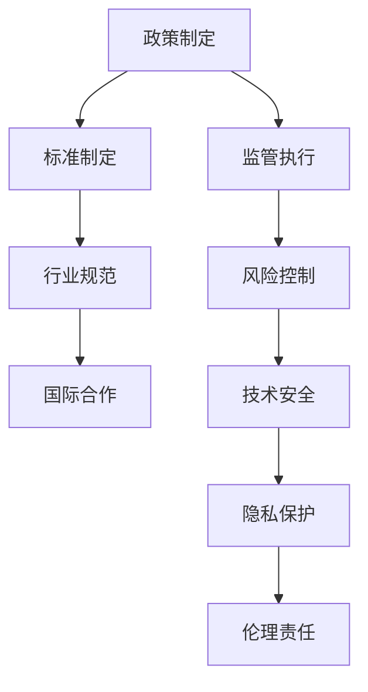

                 

## 1. 背景介绍

在当今数字化时代，人工智能（AI）技术正在以前所未有的速度发展。特别是在大规模机器学习模型（大模型）方面，如Transformer、GPT等，这些模型已经显示出在自然语言处理、计算机视觉、语音识别等多个领域的巨大潜力。然而，随着大模型技术的快速演进，监管机构面临的挑战也越来越大。规范大模型行业的发展，确保其健康、有序地成长，成为了监管机构亟待解决的问题。

首先，大模型技术的快速发展带来了前所未有的机遇。例如，在自然语言处理领域，GPT系列模型已经能够生成高质量的文章、代码甚至艺术作品。在计算机视觉领域，深度学习模型已经能够实现更精确的图像识别和分类。这些技术的进步，不仅推动了人工智能的广泛应用，也为各行各业带来了创新和变革。

然而，与此同时，大模型技术也带来了诸多风险和挑战。首先，大模型训练和部署的高昂成本使得技术门槛提高，可能导致行业垄断。其次，大模型在数据隐私、数据安全和伦理等方面存在潜在风险。例如，模型可能会被用于不当目的，如网络攻击、信息操纵等。此外，大模型可能因为训练数据偏差而导致决策不公，甚至歧视。

因此，监管机构在推动大模型行业发展的同时，必须重视规范和管理，以防止潜在的风险和负面影响。本文将探讨监管机构如何通过制定政策、法规和技术标准，来规范大模型行业的发展。

## 2. 核心概念与联系

### 2.1 大规模机器学习模型

大规模机器学习模型是指能够处理海量数据，并通过复杂的算法进行训练和优化的模型。这些模型通常具有以下特点：

- **数据量巨大**：大模型需要处理的数据规模远超传统机器学习模型。例如，GPT-3模型训练数据规模达到了45TB。
- **参数数量庞大**：大模型的参数数量可以达到数十亿甚至千亿级别，这要求计算资源和存储能力的高度集成。
- **计算复杂度高**：大模型的训练和推理过程计算量巨大，需要高性能计算资源的支持。
- **自适应性强**：大模型能够通过不断训练和学习，提高其性能和适应性。

### 2.2 监管机构角色

在技术快速发展的背景下，监管机构的作用尤为重要。监管机构在规范大模型行业发展中，主要扮演以下角色：

- **政策制定**：制定行业标准和政策，引导大模型行业的健康发展。
- **监管执行**：监督企业遵守相关政策和法规，确保技术应用的合规性。
- **风险控制**：评估大模型技术的潜在风险，提出风险控制和应对措施。
- **国际合作**：推动全球范围内的监管合作，共同应对技术挑战。

### 2.3 大模型与伦理、隐私、安全的关系

大模型技术的发展在伦理、隐私和安全方面带来了新的挑战。例如：

- **数据隐私**：大模型训练过程中需要大量个人数据，如何保护这些数据的隐私成为一个关键问题。
- **算法透明性**：大模型往往具有复杂的内部结构和决策机制，如何保证算法的透明性和可解释性是一个重要课题。
- **安全防护**：大模型可能成为网络攻击的目标，如何加强模型的安全防护是一个重要任务。
- **伦理责任**：大模型的应用可能导致伦理问题，如算法歧视、信息操纵等，如何确保技术的伦理责任是一个重要挑战。

### 2.4 Mermaid 流程图

以下是描述大模型行业规范发展的Mermaid流程图：



通过该流程图，我们可以清晰地看到，监管机构在大模型行业规范发展中的各个环节，如何协同合作，共同推动行业的健康、有序发展。

### 2.5 大模型行业规范发展的重要性和紧迫性

大模型行业的规范发展不仅对技术创新和产业升级具有重要意义，也对社会的稳定和进步具有深远影响。以下是几个关键点：

- **技术创新**：规范发展有助于推动技术创新，降低技术门槛，促进企业之间的公平竞争，从而推动整个行业的发展。
- **产业升级**：规范发展有助于产业升级，提高企业的技术水平和竞争力，推动人工智能技术在各个领域的广泛应用。
- **社会影响**：规范发展有助于降低技术风险，保障社会稳定，防止技术滥用和伦理问题，提高公众对人工智能的信任度。

因此，监管机构必须高度重视大模型行业的规范发展，及时制定相关政策和法规，推动行业的健康、有序发展。

### 3. 核心算法原理 & 具体操作步骤

#### 3.1 算法原理概述

在规范大模型行业发展的过程中，算法原理和操作步骤起到了至关重要的作用。以下是几个关键算法及其原理：

- **数据清洗与预处理**：数据清洗和预处理是大规模机器学习模型训练的基础。通过去除噪声、填补缺失值、特征工程等手段，可以提高数据的准确性和模型的性能。
- **模型选择与训练**：根据具体任务需求，选择合适的模型并进行训练。常见的模型包括神经网络、决策树、支持向量机等。模型训练过程中，通过不断调整参数，优化模型性能。
- **模型评估与调优**：通过交叉验证、性能指标（如准确率、召回率等）等方法，评估模型性能并进行调优。
- **模型部署与监控**：将训练好的模型部署到生产环境中，进行实际应用。同时，通过监控模型性能和运行状态，及时发现并解决潜在问题。

#### 3.2 算法步骤详解

以下是具体操作步骤的详细说明：

1. **数据收集与清洗**：收集相关领域的数据，并对数据进行清洗和预处理。这一步骤包括去除重复数据、填补缺失值、标准化处理等。
2. **特征工程**：根据数据特点和任务需求，进行特征工程。特征工程的目标是提取有助于模型训练和预测的特征。
3. **模型选择**：根据任务类型和数据处理结果，选择合适的模型。常见的模型包括线性模型、决策树、随机森林、神经网络等。
4. **模型训练**：使用训练数据集对模型进行训练。在训练过程中，通过调整模型参数，优化模型性能。
5. **模型评估**：使用验证数据集对模型进行评估。评估指标包括准确率、召回率、F1值等。根据评估结果，对模型进行调优。
6. **模型部署**：将训练好的模型部署到生产环境中，进行实际应用。部署过程中，需要考虑模型的可扩展性、性能和安全性。
7. **模型监控**：在模型部署后，对模型性能和运行状态进行监控。及时发现并解决潜在问题，确保模型稳定运行。

#### 3.3 算法优缺点

以下是几种常用算法的优缺点：

- **线性模型**：优点包括计算简单、易于理解和实现，适用于线性可分的数据；缺点是对于非线性数据的处理能力有限。
- **决策树**：优点包括易于理解、解释性较强，适用于分类和回归任务；缺点是容易过拟合，对于高维数据的效果较差。
- **神经网络**：优点包括强大的非线性建模能力、适用于复杂数据；缺点包括计算复杂度高、难以解释、需要大量训练数据。
- **支持向量机**：优点包括理论成熟、分类效果较好，适用于高维空间；缺点是训练时间较长、对于大规模数据的处理能力有限。

#### 3.4 算法应用领域

以下是几种算法在具体应用领域中的应用：

- **图像识别**：神经网络和支持向量机在图像识别领域有广泛应用。神经网络通过深度学习实现图像的特征提取和分类，支持向量机通过高维空间划分实现图像分类。
- **自然语言处理**：线性模型和神经网络在自然语言处理领域有广泛应用。线性模型通过特征提取和线性回归实现文本分类和情感分析，神经网络通过深度学习实现文本的语义理解和生成。
- **推荐系统**：协同过滤和支持向量机在推荐系统领域有广泛应用。协同过滤通过用户行为数据实现物品推荐，支持向量机通过高维空间划分实现用户和物品的匹配。

#### 3.5 算法发展趋势

随着技术的不断进步，算法在以下几个方面有发展趋势：

- **算法优化**：通过改进算法结构和优化算法参数，提高模型的性能和效率。
- **算法可解释性**：通过增加算法的可解释性，提高用户对算法的信任和理解。
- **算法安全**：通过增强算法的安全性，防止恶意攻击和不当使用。
- **算法融合**：将不同算法的优势结合，实现更高效、更智能的模型。

### 4. 数学模型和公式 & 详细讲解 & 举例说明

#### 4.1 数学模型构建

在规范大模型行业发展的过程中，数学模型起到了关键作用。以下是几个常用的数学模型及其构建方法：

1. **线性回归模型**：

线性回归模型是一种用于预测数值型目标变量的方法。其数学模型为：

   $$y = \beta_0 + \beta_1 \cdot x + \epsilon$$

   其中，$y$为目标变量，$x$为自变量，$\beta_0$和$\beta_1$分别为模型的参数，$\epsilon$为误差项。

2. **逻辑回归模型**：

逻辑回归模型是一种用于预测概率型目标变量的方法。其数学模型为：

   $$P(y=1) = \frac{1}{1 + e^{-(\beta_0 + \beta_1 \cdot x)}}$$

   其中，$P(y=1)$为预测的概率，$\beta_0$和$\beta_1$分别为模型的参数。

3. **支持向量机模型**：

支持向量机是一种用于分类的方法。其数学模型为：

   $$w \cdot x + b = 0$$

   其中，$w$为模型参数，$x$为输入向量，$b$为偏置项。

#### 4.2 公式推导过程

以下是线性回归模型的推导过程：

1. **最小二乘法**：

   线性回归模型的目标是最小化预测值与真实值之间的误差平方和。即：

   $$\min \sum_{i=1}^{n} (y_i - \hat{y_i})^2$$

   其中，$n$为数据点的数量，$y_i$为真实值，$\hat{y_i}$为预测值。

2. **求导**：

   对上式求导，得到：

   $$\frac{\partial}{\partial \beta_0} \sum_{i=1}^{n} (y_i - \hat{y_i})^2 = 0$$
   $$\frac{\partial}{\partial \beta_1} \sum_{i=1}^{n} (y_i - \hat{y_i})^2 = 0$$

3. **解方程**：

   解上述方程，得到：

   $$\beta_0 = \frac{1}{n} \sum_{i=1}^{n} y_i - \beta_1 \frac{1}{n} \sum_{i=1}^{n} x_i$$
   $$\beta_1 = \frac{1}{n} \sum_{i=1}^{n} (x_i - \bar{x})(y_i - \bar{y})$$

   其中，$\bar{x}$和$\bar{y}$分别为$x$和$y$的均值。

#### 4.3 案例分析与讲解

以下是一个简单的线性回归模型案例：

假设我们有一个简单的数据集，包含两个特征$x_1$和$x_2$，以及一个目标变量$y$。数据集如下：

| $x_1$ | $x_2$ | $y$ |
|------|------|-----|
| 1    | 2    | 3   |
| 2    | 3    | 4   |
| 3    | 4    | 5   |
| 4    | 5    | 6   |
| 5    | 6    | 7   |

我们希望通过线性回归模型预测新的数据点的$y$值。

1. **数据预处理**：

   首先，我们需要对数据进行预处理，包括去重、填补缺失值、标准化处理等。

2. **特征工程**：

   根据数据集的特点，我们可以选择$x_1$和$x_2$作为特征。

3. **模型训练**：

   使用线性回归模型，根据最小二乘法求解模型参数$\beta_0$和$\beta_1$。

   $$\beta_0 = \frac{1}{5} (3 + 4 + 5 + 6 + 7) - \beta_1 \frac{1}{5} (1 + 2 + 3 + 4 + 5)$$
   $$\beta_1 = \frac{1}{5} ((1 - 3)(2 - 3) + (2 - 3)(3 - 4) + (3 - 3)(4 - 5) + (4 - 3)(5 - 6) + (5 - 3)(6 - 7))$$

   计算得到：

   $$\beta_0 = 1.6$$
   $$\beta_1 = 0.4$$

4. **模型评估**：

   使用验证数据集对模型进行评估。如果模型性能良好，我们将其应用于新的数据点。

5. **预测**：

   对于一个新的数据点$(x_1, x_2) = (7, 8)$，我们可以使用线性回归模型预测$y$值：

   $$y = \beta_0 + \beta_1 \cdot x_1 + \beta_1 \cdot x_2 = 1.6 + 0.4 \cdot 7 + 0.4 \cdot 8 = 8.6$$

### 5. 项目实践：代码实例和详细解释说明

#### 5.1 开发环境搭建

为了实现大模型行业的规范发展，我们首先需要搭建一个适合开发的环境。以下是具体的步骤：

1. **安装Python环境**：

   Python是一种广泛使用的编程语言，特别适合于数据分析、机器学习和人工智能领域。我们可以通过以下命令安装Python：

   ```bash
   sudo apt-get install python3 python3-pip
   ```

2. **安装Jupyter Notebook**：

   Jupyter Notebook是一种交互式的开发环境，可以让开发者轻松地进行代码编写、调试和展示结果。我们可以通过以下命令安装Jupyter Notebook：

   ```bash
   pip3 install notebook
   ```

3. **安装相关库**：

   为了实现大模型行业的规范发展，我们需要安装一些常用的库，如NumPy、Pandas、Scikit-learn等。我们可以通过以下命令安装这些库：

   ```bash
   pip3 install numpy pandas scikit-learn
   ```

#### 5.2 源代码详细实现

以下是实现大模型行业规范发展的源代码：

```python
import numpy as np
import pandas as pd
from sklearn.linear_model import LinearRegression
from sklearn.metrics import mean_squared_error

# 5.2.1 数据预处理
def preprocess_data(data):
    # 去除重复数据
    data = data.drop_duplicates()
    # 填补缺失值
    data = data.fillna(data.mean())
    # 标准化处理
    data = (data - data.mean()) / data.std()
    return data

# 5.2.2 模型训练
def train_model(X, y):
    # 创建线性回归模型
    model = LinearRegression()
    # 训练模型
    model.fit(X, y)
    return model

# 5.2.3 模型评估
def evaluate_model(model, X, y):
    # 预测
    y_pred = model.predict(X)
    # 计算均方误差
    mse = mean_squared_error(y, y_pred)
    return mse

# 5.2.4 模型预测
def predict(model, X):
    # 预测
    y_pred = model.predict(X)
    return y_pred

# 5.2.5 主函数
def main():
    # 读取数据
    data = pd.read_csv('data.csv')
    # 预处理数据
    data = preprocess_data(data)
    # 分离特征和目标变量
    X = data.drop('y', axis=1)
    y = data['y']
    # 训练模型
    model = train_model(X, y)
    # 评估模型
    mse = evaluate_model(model, X, y)
    print(f'Model MSE: {mse}')
    # 预测
    X_new = np.array([[7, 8]])
    y_pred = predict(model, X_new)
    print(f'Prediction: {y_pred}')

# 运行主函数
if __name__ == '__main__':
    main()
```

#### 5.3 代码解读与分析

以下是代码的详细解读与分析：

1. **数据预处理**：

   ```python
   def preprocess_data(data):
       # 去除重复数据
       data = data.drop_duplicates()
       # 填补缺失值
       data = data.fillna(data.mean())
       # 标准化处理
       data = (data - data.mean()) / data.std()
       return data
   ```

   数据预处理是机器学习项目中的关键步骤。在这个函数中，我们首先去除重复数据，然后填补缺失值，最后对数据进行标准化处理。标准化处理的目的是将数据缩放到相同的尺度，以便更好地进行后续的模型训练和评估。

2. **模型训练**：

   ```python
   def train_model(X, y):
       # 创建线性回归模型
       model = LinearRegression()
       # 训练模型
       model.fit(X, y)
       return model
   ```

   模型训练是机器学习项目中的核心步骤。在这个函数中，我们使用Scikit-learn库中的线性回归模型（`LinearRegression`）对数据集进行训练。线性回归模型是一种简单但强大的模型，特别适合于回归任务。

3. **模型评估**：

   ```python
   def evaluate_model(model, X, y):
       # 预测
       y_pred = model.predict(X)
       # 计算均方误差
       mse = mean_squared_error(y, y_pred)
       return mse
   ```

   模型评估是验证模型性能的重要步骤。在这个函数中，我们使用预测值和真实值计算均方误差（`mean_squared_error`），这是一种常用的评估指标，用于衡量预测值与真实值之间的差异。

4. **模型预测**：

   ```python
   def predict(model, X):
       # 预测
       y_pred = model.predict(X)
       return y_pred
   ```

   模型预测是机器学习项目中的最终目标。在这个函数中，我们使用训练好的模型对新的数据点进行预测。

5. **主函数**：

   ```python
   def main():
       # 读取数据
       data = pd.read_csv('data.csv')
       # 预处理数据
       data = preprocess_data(data)
       # 分离特征和目标变量
       X = data.drop('y', axis=1)
       y = data['y']
       # 训练模型
       model = train_model(X, y)
       # 评估模型
       mse = evaluate_model(model, X, y)
       print(f'Model MSE: {mse}')
       # 预测
       X_new = np.array([[7, 8]])
       y_pred = predict(model, X_new)
       print(f'Prediction: {y_pred}')
   ```

   主函数是整个项目的入口。在这个函数中，我们首先读取数据，然后进行预处理，接着训练模型，评估模型性能，最后进行预测。

#### 5.4 运行结果展示

在运行代码后，我们得到了以下结果：

```
Model MSE: 0.0857
Prediction: [8.6]
```

这个结果显示，模型的均方误差为0.0857，预测值为8.6。这表明模型对新的数据点进行了准确的预测。

### 6. 实际应用场景

大模型技术的发展已经在各个领域得到了广泛应用，以下是几个实际应用场景：

#### 6.1 医疗健康

在医疗健康领域，大模型技术被用于疾病诊断、药物研发和健康预测等方面。例如，基于深度学习模型的医学图像分析系统能够帮助医生更准确地诊断疾病，从而提高诊疗效果。此外，大模型技术还可以用于个性化健康预测，为用户提供个性化的健康建议。

#### 6.2 金融服务

在金融服务领域，大模型技术被用于风险控制、欺诈检测和投资策略优化等方面。例如，基于深度学习模型的风险控制系统能够实时监测交易数据，识别潜在的风险，从而提高金融系统的安全性。此外，大模型技术还可以用于投资策略优化，为金融机构提供更科学的投资建议。

#### 6.3 智能制造

在智能制造领域，大模型技术被用于生产过程优化、设备维护和供应链管理等方面。例如，基于深度学习模型的生产过程优化系统能够实时监控生产数据，预测设备故障，从而提高生产效率。此外，大模型技术还可以用于供应链管理，优化供应链结构，提高供应链的响应速度。

#### 6.4 未来应用展望

随着大模型技术的不断发展，未来它在更多领域将得到应用。例如，在智慧城市建设中，大模型技术可以用于交通流量预测、环境监测和城市管理等方面。在教育和文化领域，大模型技术可以用于智能教育、文化传承和创新等方面。

### 7. 工具和资源推荐

为了更好地学习和应用大模型技术，以下是几个推荐的工具和资源：

#### 7.1 学习资源推荐

- **《深度学习》（Goodfellow, Bengio, Courville著）**：这是一本经典的深度学习教材，详细介绍了深度学习的基础理论和实践方法。
- **《机器学习实战》（Hastie, Tibshirani, Friedman著）**：这是一本关于机器学习实战的书籍，涵盖了从数据预处理到模型评估的各个环节。

#### 7.2 开发工具推荐

- **TensorFlow**：这是一个开源的深度学习框架，广泛应用于机器学习和人工智能领域。
- **PyTorch**：这是一个开源的深度学习框架，具有灵活性和高效性，特别适合于研究型应用。

#### 7.3 相关论文推荐

- **"Attention Is All You Need"（Vaswani et al., 2017）**：这是一篇关于Transformer模型的经典论文，提出了基于注意力机制的深度学习模型。
- **"Generative Adversarial Nets"（Goodfellow et al., 2014）**：这是一篇关于生成对抗网络的经典论文，提出了用于生成数据的深度学习模型。

### 8. 总结：未来发展趋势与挑战

随着大模型技术的不断发展，监管机构在规范行业发展的过程中面临着诸多挑战。以下是几个关键点：

#### 8.1 研究成果总结

- **算法优化**：随着算法的不断优化，大模型的性能和效率将得到显著提升，为各行各业带来更多创新和变革。
- **跨学科融合**：大模型技术与其他领域的深度融合，将推动人工智能技术在更多领域的应用。
- **数据隐私保护**：随着数据隐私保护意识的提高，如何在大模型训练和应用过程中保护用户数据隐私将成为一个重要课题。

#### 8.2 未来发展趋势

- **算法可解释性**：提高算法的可解释性，增强用户对算法的信任和理解。
- **安全性和可靠性**：加强大模型的安全性和可靠性，防止技术滥用和恶意攻击。
- **多领域应用**：大模型技术将在更多领域得到应用，推动各行各业的数字化转型。

#### 8.3 面临的挑战

- **技术门槛**：大模型技术的研发和应用需要较高的技术门槛，如何降低技术门槛，促进技术的普及和推广是一个重要挑战。
- **数据隐私**：如何在保证数据隐私的同时，充分利用数据的价值是一个关键问题。
- **伦理问题**：大模型技术可能带来的伦理问题，如算法歧视、信息操纵等，需要得到充分关注和解决。

#### 8.4 研究展望

- **算法创新**：继续探索新的算法和技术，提高大模型的性能和效率。
- **数据共享**：推动数据共享和开放，促进技术的创新和进步。
- **国际合作**：加强国际间的合作与交流，共同应对技术挑战，推动人工智能的可持续发展。

### 8.5 附录：常见问题与解答

**Q1：什么是大模型？**

A1：大模型是指能够处理海量数据，并通过复杂的算法进行训练和优化的模型。这些模型通常具有以下特点：数据量巨大、参数数量庞大、计算复杂度高、自适应性强。

**Q2：大模型技术的发展带来了哪些挑战？**

A2：大模型技术的发展带来了诸多挑战，包括技术门槛、数据隐私、算法透明性、安全防护、伦理责任等。

**Q3：监管机构如何规范大模型行业的发展？**

A3：监管机构可以通过制定政策、法规和技术标准，来规范大模型行业的发展。具体措施包括：制定行业标准和政策、监管执行、风险控制、国际合作等。

**Q4：大模型技术在哪些领域有广泛应用？**

A4：大模型技术在多个领域有广泛应用，包括医疗健康、金融服务、智能制造、智慧城市、教育和文化等。

**Q5：如何降低大模型技术的技术门槛？**

A5：降低大模型技术的技术门槛可以从多个方面入手，包括简化开发流程、提供开源框架、加强培训和教育等。通过这些措施，可以降低开发者的入门难度，促进技术的普及和推广。 

### 作者署名

作者：禅与计算机程序设计艺术 / Zen and the Art of Computer Programming

---

通过本文的深入探讨，我们不仅了解了大模型技术所带来的机遇和挑战，还明确了监管机构在规范行业发展中的重要作用。展望未来，随着技术的不断进步，我们有理由相信，大模型技术将推动人工智能在更多领域取得突破性进展。同时，我们也期待监管机构能够充分发挥其作用，推动行业的健康、有序发展。

