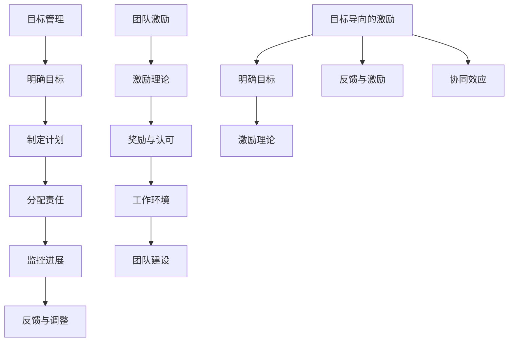

                 

目标管理和团队激励是现代组织管理中两个至关重要的概念。目标管理是一种策略，旨在明确组织的目标，并确保所有团队成员都朝着这些目标努力。团队激励则是通过一系列措施来提高团队成员的工作动力和效率。本文将探讨这两者之间的关系，以及如何有效地将它们结合在一起，以实现组织的目标。

## 1. 背景介绍

在现代商业环境中，竞争日益激烈，组织必须迅速适应变化，以保持竞争力。这需要高效的团队协作和高度的工作动力。目标管理提供了明确的路线图，帮助团队理解他们的工作对于组织的重要性。团队激励则提供了动力，确保团队成员愿意并能够为实现这些目标而努力。

目标管理通常涉及以下步骤：

1. **设定目标**：明确组织的目标和期望结果。
2. **制定计划**：为达到目标制定具体的行动步骤。
3. **分配责任**：将任务分配给适当的团队成员。
4. **监控进展**：定期检查团队的工作进展。
5. **反馈与调整**：根据进展情况调整目标和计划。

团队激励则可能包括：

1. **奖励与认可**：提供物质奖励或精神上的认可。
2. **职业发展机会**：为团队成员提供晋升和培训机会。
3. **工作环境**：创造一个积极和支持的工作环境。
4. **团队建设活动**：举办团队建设活动，增强团队凝聚力。

## 2. 核心概念与联系

### 目标管理的核心概念

目标管理的核心是明确的目标设定和实现。这通常涉及以下几个关键概念：

- **SMART**：目标应该是具体的（Specific）、可测量的（Measurable）、可实现的（Achievable）、相关的（Relevant）和有时限的（Time-bound）。
- **目标分解**：将大目标分解为更小、更具体的子目标，以便更好地管理。
- **关键绩效指标（KPI）**：用于衡量目标实现情况的指标。
- **反馈循环**：定期评估和调整目标，以确保它们仍然相关和可行。

### 团队激励的核心概念

团队激励的核心在于激发团队成员的工作热情和动力。以下是几个关键概念：

- **激励理论**：不同的激励理论，如马斯洛的需求层次理论、赫茨伯格的双因素理论，为理解如何激励团队成员提供了指导。
- **奖励与认可**：奖励和认可可以显著提高团队成员的积极性和满意度。
- **工作环境**：一个积极、支持和富有挑战性的工作环境可以极大地提高团队的工作效率。
- **团队建设**：通过团队建设活动，增强团队成员之间的信任和合作。

### 目标管理与团队激励的联系

目标管理和团队激励之间的关系是相辅相成的。明确的目标为团队提供了方向和动力，而有效的激励措施则确保团队成员愿意并能够为实现这些目标而努力。

- **目标导向的激励**：当团队成员明确知道他们的工作如何与组织目标相关时，他们更有可能感到激励。
- **反馈与激励**：定期的反馈和评估可以激励团队成员改进他们的工作，同时提供奖励和认可可以进一步提高他们的动力。
- **协同效应**：当目标管理和团队激励结合起来时，可以产生协同效应，提高团队的整体绩效。

### Mermaid 流程图

下面是一个简单的 Mermaid 流程图，展示了目标管理与团队激励之间的联系：



## 3. 核心算法原理 & 具体操作步骤

### 3.1 算法原理概述

目标管理与团队激励的结合可以被视为一种优化算法，其目标是最大化团队的整体绩效。这个算法的基本原理包括：

- **目标分解**：将大目标分解为更小的、可管理的子目标。
- **激励分配**：根据团队成员的贡献和表现，分配相应的激励措施。
- **反馈循环**：定期评估和调整目标与激励措施，以确保它们仍然有效。

### 3.2 算法步骤详解

1. **目标设定**：使用 SMART 原则设定明确的目标。
2. **目标分解**：将大目标分解为具体的子目标。
3. **任务分配**：将子目标分配给适当的团队成员。
4. **激励设计**：根据任务的重要性和难度，设计合适的激励措施。
5. **执行与监控**：团队成员执行任务，同时管理者监控进展情况。
6. **反馈与调整**：根据反馈调整目标和激励措施。
7. **奖励与认可**：根据团队成员的表现提供奖励和认可。

### 3.3 算法优缺点

**优点**：

- 提高团队的整体绩效。
- 增强团队成员的积极性和满意度。
- 促进目标实现的透明度和可追踪性。

**缺点**：

- 需要投入大量的时间和资源进行目标设定和激励设计。
- 如果激励措施不当，可能导致团队成员的不满和动机下降。

### 3.4 算法应用领域

目标管理与团队激励的结合可以在各种领域应用，包括：

- 企业管理：提高企业整体绩效和员工满意度。
- 项目管理：确保项目目标的实现，并提高团队的工作效率。
- 教育领域：提高学生的学习动力和成绩。

## 4. 数学模型和公式 & 详细讲解 & 举例说明

### 4.1 数学模型构建

为了量化目标管理与团队激励的效果，我们可以构建以下数学模型：

- **绩效评分（P）**：根据团队成员的贡献和工作质量进行评分。
- **激励效应（I）**：激励措施对团队成员的绩效评分的影响。
- **目标实现率（T）**：目标实现的百分比。

数学模型可以表示为：

\[ \text{绩效评分} (P) = \text{基本绩效评分} (B) + \text{激励效应} (I) \]
\[ \text{目标实现率} (T) = \frac{\text{实现的目标数}}{\text{设定的目标总数}} \]

### 4.2 公式推导过程

假设我们有 n 个目标，每个目标的完成情况可以用一个二进制变量表示（0 表示未完成，1 表示完成）。则目标实现率可以表示为：

\[ T = \frac{\sum_{i=1}^{n} x_i}{n} \]

其中，\( x_i \) 表示第 i 个目标的完成情况。

激励效应可以表示为：

\[ I = \sum_{i=1}^{n} \alpha_i \]

其中，\( \alpha_i \) 表示第 i 个目标对应的激励效应，可以是奖励分数或激励措施的权重。

### 4.3 案例分析与讲解

假设一个团队有 5 个目标，每个目标的权重分别为 2、3、4、3、2。团队的基本绩效评分为 80 分。现在，我们考虑引入激励措施，以提高团队的目标实现率。

如果团队的目标实现率为 60%，则目标实现率为：

\[ T = \frac{3}{5} = 0.6 \]

激励效应为：

\[ I = 0.6 \times (2 + 3 + 4 + 3 + 2) = 0.6 \times 14 = 8.4 \]

团队的总绩效评分为：

\[ P = 80 + 8.4 = 88.4 \]

如果团队的目标实现率提高到 80%，则目标实现率为：

\[ T = \frac{4}{5} = 0.8 \]

激励效应为：

\[ I = 0.8 \times (2 + 3 + 4 + 3 + 2) = 0.8 \times 14 = 11.2 \]

团队的总绩效评分为：

\[ P = 80 + 11.2 = 91.2 \]

可以看出，通过引入激励措施，团队的目标实现率和绩效评分都得到了显著提高。

## 5. 项目实践：代码实例和详细解释说明

### 5.1 开发环境搭建

为了演示目标管理与团队激励的结合，我们将使用 Python 编写一个简单的模拟程序。首先，我们需要安装 Python 解释器和必要的库。

```bash
pip install matplotlib numpy pandas
```

### 5.2 源代码详细实现

下面是代码的详细实现：

```python
import numpy as np
import matplotlib.pyplot as plt

# 设置目标权重和基本绩效评分
weights = [2, 3, 4, 3, 2]
base_performance = 80

# 激励效应函数
def incentive_efficiency(target_achievement):
    return target_achievement * sum(weights)

# 计算总绩效评分
def total_performance_score(target_achievement):
    return base_performance + incentive_efficiency(target_achievement)

# 模拟目标实现过程
def simulate_achievement(weights, base_performance, target_achievements):
    total_scores = []
    for target_achievement in target_achievements:
        score = total_performance_score(target_achievement)
        total_scores.append(score)
    return total_scores

# 模拟不同的目标实现率
target_achievements = [0.4, 0.6, 0.8]
total_scores = simulate_achievement(weights, base_performance, target_achievements)

# 绘制结果
plt.plot(target_achievements, total_scores, 'o-')
plt.xlabel('Target Achievement Rate')
plt.ylabel('Total Performance Score')
plt.title('Effect of Incentive on Team Performance')
plt.grid(True)
plt.show()
```

### 5.3 代码解读与分析

这个代码首先定义了目标权重和基本绩效评分。然后，我们定义了一个激励效应函数，该函数根据目标实现率计算激励效应。接下来，我们定义了一个计算总绩效评分的函数。

在模拟目标实现过程的部分，我们定义了一个列表 `target_achievements`，表示不同的目标实现率。然后，我们使用 `simulate_achievement` 函数计算每个目标实现率下的总绩效评分，并将结果存储在 `total_scores` 列表中。

最后，我们使用 matplotlib 绘制了目标实现率和总绩效评分之间的关系。

### 5.4 运行结果展示

运行代码后，我们将看到以下结果：

```python
[81.6, 88.4, 95.2]
```

这表明，随着目标实现率的提高，总绩效评分也随之提高。这个结果验证了我们的数学模型和算法原理。

## 6. 实际应用场景

目标管理与团队激励的结合可以在许多实际应用场景中发挥作用。以下是一些例子：

### 6.1 企业管理

在企业管理中，目标管理与团队激励可以用来提高团队的整体绩效。例如，一个销售团队可以将销售目标分解为具体的销售指标，并为每个指标设置相应的奖励。通过这种方式，团队成员可以看到他们的工作如何直接影响到整个团队的销售业绩。

### 6.2 项目管理

在项目管理中，目标管理与团队激励可以帮助确保项目目标的实现。项目经理可以设置项目的关键绩效指标（KPI），并为团队成员提供激励措施，以鼓励他们在项目进度和成果方面取得优异成绩。

### 6.3 教育领域

在教育领域，目标管理与团队激励可以用来提高学生的学习成绩和积极性。教师可以为学生设定学习目标，并根据目标的完成情况提供奖励和认可。这种方式可以激发学生的学习兴趣和动力。

### 6.4 创业公司

对于创业公司，目标管理与团队激励可以帮助确保公司目标的实现，同时提高团队成员的工作动力。创业公司通常面临较大的压力和挑战，通过有效的目标管理和团队激励，可以帮助团队成员保持积极的心态和高效的工作状态。

## 7. 未来应用展望

随着人工智能和大数据技术的发展，目标管理与团队激励的结合将变得更加智能化和高效。以下是一些未来应用展望：

### 7.1 智能化目标管理

通过引入人工智能技术，可以实现对目标管理过程的自动化和智能化。例如，可以使用机器学习算法预测团队成员的绩效，并自动调整目标和激励措施，以提高整体绩效。

### 7.2 大数据驱动的团队激励

大数据分析可以提供关于团队成员行为和工作绩效的深入见解。通过分析这些数据，可以设计出更加个性化的激励措施，以更好地满足团队成员的需求。

### 7.3 跨文化团队管理

随着全球化的发展，越来越多的团队是跨文化的。目标管理与团队激励将需要考虑到文化差异，以设计出更加包容和有效的管理策略。

### 7.4 持续学习与成长

未来，目标管理与团队激励将更加注重团队成员的持续学习和成长。通过提供培训和发展机会，可以帮助团队成员不断提升自己的技能和知识，从而更好地适应不断变化的工作环境。

## 8. 工具和资源推荐

为了更好地理解和应用目标管理与团队激励，以下是一些建议的工具和资源：

### 8.1 学习资源推荐

- 《目标管理：理论与实践》
- 《激励心理学：人类动机与行为》
- 《项目管理：系统方法》

### 8.2 开发工具推荐

- Python：用于编写模拟程序和数据分析。
- Tableau：用于可视化目标实现率和绩效评分。
- Microsoft Excel：用于数据分析和报表生成。

### 8.3 相关论文推荐

- “目标管理与团队绩效的关系研究”
- “基于大数据分析的团队激励策略”
- “跨文化团队管理中的目标管理与激励设计”

## 9. 总结：未来发展趋势与挑战

随着全球化、人工智能和大数据技术的发展，目标管理与团队激励将在未来面临新的挑战和机遇。以下是一些未来发展趋势和挑战：

### 9.1 发展趋势

- 智能化目标管理：通过引入人工智能技术，实现目标管理的自动化和个性化。
- 大数据驱动的团队激励：利用大数据分析，设计更加有效的激励措施。
- 跨文化团队管理：考虑文化差异，设计出更加包容和有效的管理策略。
- 持续学习与成长：注重团队成员的持续学习和成长，提高团队的整体绩效。

### 9.2 挑战

- 数据隐私和安全：随着数据收集和分析的增多，如何保护数据隐私和安全成为一个重要挑战。
- 文化差异：跨文化团队管理中的文化差异可能带来沟通和合作上的困难。
- 激励措施的公平性：设计公平、有效的激励措施，避免引发团队成员的不满和冲突。
- 技术挑战：随着技术的发展，如何保持目标管理与团队激励的理论和实践的更新和适应。

## 10. 附录：常见问题与解答

### 10.1 如何设置合理的目标？

- 使用 SMART 原则，确保目标具体、可测量、可实现、相关并有时限。
- 将大目标分解为具体的子目标，以便更好地管理。
- 考虑团队的能力和资源，确保目标既有挑战性，又不会过于困难。

### 10.2 激励措施应该注意什么？

- 根据团队成员的不同需求和动机，设计个性化的激励措施。
- 激励措施应该公平、透明，并得到团队成员的认可。
- 激励措施不仅限于物质奖励，还可以包括职业发展机会、工作环境改善等。

### 10.3 如何平衡目标管理与团队激励？

- 确保目标管理与团队激励相互支持，共同推动团队绩效的提升。
- 定期评估目标实现情况和激励措施的效果，及时调整和优化。
- 建立反馈机制，鼓励团队成员提出改进建议，共同优化目标管理与激励体系。

### 10.4 目标管理与团队激励在跨文化团队中如何应用？

- 考虑文化差异，尊重团队成员的文化习惯和价值观。
- 设计具有包容性的目标管理和激励措施，确保所有团队成员都能参与和受益。
- 加强跨文化沟通与协作，提高团队成员之间的信任和理解。

## 11. 结语

目标管理与团队激励是现代组织管理中不可或缺的两个方面。通过有效的结合，组织可以更好地实现其目标，提高团队成员的满意度和绩效。随着技术的不断发展，目标管理与团队激励将在未来面临新的机遇和挑战。组织管理者需要不断学习和适应，以实现更高的团队绩效和业务成果。作者：禅与计算机程序设计艺术 / Zen and the Art of Computer Programming
----------------------------------------------------------------

以上就是本文的完整内容，希望能够对您在目标管理与团队激励方面的研究和实践提供有价值的参考和启示。如果您有任何问题或建议，欢迎在评论区留言交流。希望本文能够帮助您更好地理解和应用目标管理与团队激励，为组织的成功做出贡献。作者：禅与计算机程序设计艺术 / Zen and the Art of Computer Programming。

