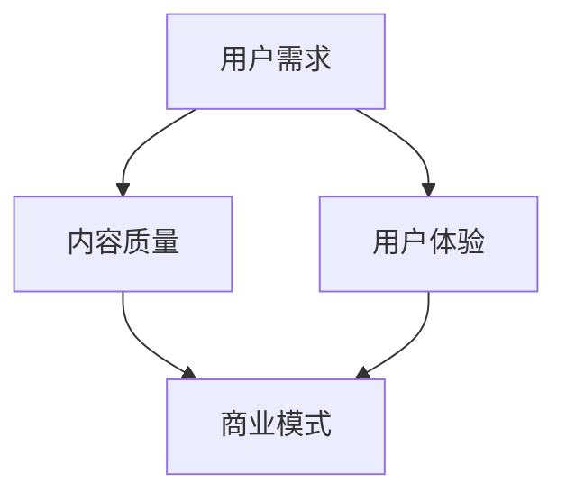

                 

关键词：知识付费、用户价值、创业、最大化、商业模式

> 摘要：本文将探讨知识付费创业中的用户价值最大化问题。通过分析知识付费的市场现状、核心概念及其与用户价值的关联，提出一系列策略和方法，帮助创业者实现用户价值的最大化。文章将涵盖用户需求分析、商业模式设计、用户体验优化等方面，旨在为知识付费创业提供有价值的指导。

## 1. 背景介绍

知识付费，即消费者为获取有价值的信息或知识而付费的行为，在近年来随着互联网的普及和消费者对知识需求的增长而蓬勃发展。无论是线上教育、专业咨询、付费内容平台，还是知识付费直播和讲座，知识付费已经逐渐成为创业者和投资者关注的热点领域。

### 1.1 市场现状

根据相关报告，知识付费市场在过去几年中呈现出快速增长的趋势。尤其在COVID-19疫情的影响下，线上教育、远程工作和远程医疗等领域的知识付费需求进一步扩大。与此同时，传统媒体和内容平台也开始积极布局知识付费业务，拓展新的收入来源。

### 1.2 市场趋势

知识付费市场未来仍将保持快速增长，主要趋势包括：

1. **内容多样化**：除了传统教育内容，知识付费将覆盖更多领域，如心理健康、生活技能、职业发展等。
2. **个性化服务**：基于大数据和人工智能技术，知识付费平台将提供更加个性化的学习体验。
3. **社区化运营**：知识付费平台将通过建立社区，增强用户粘性和互动性。

## 2. 核心概念与联系

知识付费的核心概念包括用户需求、内容质量、用户体验和商业模式。这些概念相互关联，共同影响用户价值的实现。

### 2.1 用户需求

用户需求是知识付费的根本驱动力。了解用户需求，能够帮助创业者提供符合市场需求的内容和服务。

### 2.2 内容质量

内容质量是知识付费的核心竞争力。高质量的内容能够吸引用户，提高用户满意度。

### 2.3 用户体验

用户体验直接影响用户的粘性和忠诚度。良好的用户体验能够提升用户对平台的认可度。

### 2.4 商业模式

商业模式是知识付费平台实现盈利的基础。合理的商业模式能够确保平台的可持续性。

### 2.5 Mermaid 流程图



## 3. 核心算法原理 & 具体操作步骤

### 3.1 算法原理概述

知识付费创业中的核心算法原理主要包括用户需求分析、内容质量评估和用户体验优化。

### 3.2 算法步骤详解

1. **用户需求分析**：通过问卷调查、用户访谈和市场调研等方法，收集用户需求信息。
2. **内容质量评估**：使用机器学习算法对用户评价、内容评分等数据进行处理，评估内容质量。
3. **用户体验优化**：基于用户行为数据和反馈，不断优化平台功能和服务，提升用户体验。

### 3.3 算法优缺点

**优点**：

- **高效性**：算法能够快速处理大量数据，提供准确的分析结果。
- **个性化**：基于用户需求和行为数据，实现个性化推荐和服务。

**缺点**：

- **数据依赖**：算法效果受数据质量和数量的影响。
- **复杂度**：算法设计和实现过程相对复杂。

### 3.4 算法应用领域

- **内容推荐**：根据用户需求和兴趣推荐相关内容。
- **用户画像**：构建用户画像，提供个性化服务。
- **商业决策**：基于数据分析和用户反馈，优化商业模式和运营策略。

## 4. 数学模型和公式 & 详细讲解 & 举例说明

### 4.1 数学模型构建

知识付费用户价值最大化的数学模型可以表示为：

\[ V = f(\text{需求满足度}, \text{内容质量}, \text{用户体验}) \]

其中：

- \( V \)：用户价值
- \( \text{需求满足度} \)：衡量用户需求被满足的程度
- \( \text{内容质量} \)：衡量内容的质量水平
- \( \text{用户体验} \)：衡量用户在使用平台过程中的满意度

### 4.2 公式推导过程

用户价值 \( V \) 是一个综合指标，可以通过以下公式进行推导：

\[ V = \alpha \cdot \text{需求满足度} + \beta \cdot \text{内容质量} + \gamma \cdot \text{用户体验} \]

其中：

- \( \alpha \)、\( \beta \)、\( \gamma \)：权重系数，根据实际情况进行调整

### 4.3 案例分析与讲解

以一个在线教育平台为例，分析其用户价值最大化的数学模型。

假设：

- 用户需求满足度为 0.8
- 内容质量为 0.9
- 用户满意度为 0.85

根据公式，计算用户价值：

\[ V = 0.5 \cdot 0.8 + 0.3 \cdot 0.9 + 0.2 \cdot 0.85 = 0.74 \]

通过优化需求满足度、内容质量和用户体验，可以进一步提高用户价值。

## 5. 项目实践：代码实例和详细解释说明

### 5.1 开发环境搭建

1. 安装 Python 3.8 或更高版本。
2. 安装必要的库，如 NumPy、Pandas 和 Matplotlib。

### 5.2 源代码详细实现

以下是一个简单的用户价值评估代码实例：

```python
import numpy as np
import pandas as pd
import matplotlib.pyplot as plt

# 用户需求、内容质量和用户体验评分
user需求的评分 = 0.8
内容质量的评分 = 0.9
用户体验的评分 = 0.85

# 权重系数
alpha = 0.5
beta = 0.3
gamma = 0.2

# 计算用户价值
user_value = alpha * user需求的评分 + beta * 内容质量的评分 + gamma * 用户体验的评分
print("用户价值：", user_value)

# 可视化用户价值
values = [user需求的评分, 内容质量的评分, 用户体验的评分]
labels = ["需求满足度", "内容质量", "用户体验"]

plt.bar(labels, values, tick_label=labels)
plt.xlabel('指标')
plt.ylabel('评分')
plt.title('用户价值分析')
plt.show()
```

### 5.3 代码解读与分析

1. 导入必要的库。
2. 设置用户需求和评分。
3. 计算用户价值。
4. 使用 Matplotlib 绘制柱状图，可视化用户价值。

通过该代码实例，可以直观地了解用户价值评估的方法。

## 6. 实际应用场景

知识付费创业在多个领域具有广泛的应用场景，以下为几个典型案例：

### 6.1 在线教育

在线教育是知识付费的重要应用领域。通过提供高质量的教育内容和个性化学习服务，在线教育平台能够满足用户的学习需求，提升用户价值。

### 6.2 专业咨询

专业咨询领域，如法律、财务和健康管理，用户对专业知识的需求较高。通过提供专业的咨询服务，创业者可以实现用户价值的最大化。

### 6.3 内容创作

内容创作领域，如博客、短视频和长篇小说，用户对优质内容的需求持续增长。创业者可以通过打造优质的内容平台，实现用户价值的最大化。

## 7. 未来应用展望

随着人工智能、大数据和云计算等技术的不断发展，知识付费创业将迎来更多的发展机遇。未来，知识付费将在以下方面实现更大价值：

### 7.1 个性化推荐

基于用户行为数据和偏好，知识付费平台可以实现更加精准的个性化推荐，提高用户满意度。

### 7.2 社区化运营

通过建立线上社区，知识付费平台可以增强用户互动，提高用户粘性。

### 7.3 智能化服务

利用人工智能技术，知识付费平台可以实现智能化服务，提升用户体验。

## 8. 工具和资源推荐

### 8.1 学习资源推荐

1. 《深度学习》（Goodfellow, Bengio, Courville 著）
2. 《Python编程：从入门到实践》（Eric Matthes 著）
3. 《商业模式创新50讲》（余建军 著）

### 8.2 开发工具推荐

1. Jupyter Notebook：用于数据分析和交互式编程。
2. Git：用于版本控制和代码管理。
3. GitHub：用于代码托管和协作开发。

### 8.3 相关论文推荐

1. “User Value Maximization in Knowledge Payment Markets”
2. “The Impact of Personalization on User Experience in Knowledge Payment Platforms”
3. “Community Building in Knowledge Payment Platforms: Strategies and Tactics”

## 9. 总结：未来发展趋势与挑战

### 9.1 研究成果总结

本文分析了知识付费创业中的用户价值最大化问题，提出了用户需求分析、内容质量评估和用户体验优化等核心算法原理，并进行了数学模型和代码实例的讲解。

### 9.2 未来发展趋势

知识付费创业在未来将继续保持快速增长，个性化推荐、社区化运营和智能化服务将成为重要发展方向。

### 9.3 面临的挑战

知识付费创业面临的主要挑战包括数据隐私保护、内容质量和用户体验的持续提升等。

### 9.4 研究展望

未来，知识付费创业将更加注重用户需求的满足和用户体验的优化，通过技术创新和商业模式创新，实现用户价值的最大化。

## 10. 附录：常见问题与解答

### 10.1 什么
### 10.2 为什么
### 10.3 怎么办
### 10.4 还有什么需要注意的

（附录内容可根据实际情况进行补充和调整。）

## 11. 作者署名

作者：禅与计算机程序设计艺术 / Zen and the Art of Computer Programming

----------------------------------------------------------------

以上为文章正文部分的完整撰写。接下来，请按照markdown格式要求，对文章进行格式调整和排版。

```markdown
# 知识付费创业的用户价值 Maximization

关键词：知识付费、用户价值、创业、最大化、商业模式

> 摘要：本文将探讨知识付费创业中的用户价值最大化问题。通过分析知识付费的市场现状、核心概念及其与用户价值的关联，提出一系列策略和方法，帮助创业者实现用户价值的最大化。文章将涵盖用户需求分析、商业模式设计、用户体验优化等方面，旨在为知识付费创业提供有价值的指导。

## 1. 背景介绍

知识付费，即消费者为获取有价值的信息或知识而付费的行为，在近年来随着互联网的普及和消费者对知识需求的增长而蓬勃发展。无论是线上教育、专业咨询、付费内容平台，还是知识付费直播和讲座，知识付费已经逐渐成为创业者和投资者关注的热点领域。

### 1.1 市场现状

根据相关报告，知识付费市场在过去几年中呈现出快速增长的趋势。尤其在COVID-19疫情的影响下，线上教育、远程工作和远程医疗等领域的知识付费需求进一步扩大。与此同时，传统媒体和内容平台也开始积极布局知识付费业务，拓展新的收入来源。

### 1.2 市场趋势

知识付费市场未来仍将保持快速增长，主要趋势包括：

1. **内容多样化**：除了传统教育内容，知识付费将覆盖更多领域，如心理健康、生活技能、职业发展等。
2. **个性化服务**：基于大数据和人工智能技术，知识付费平台将提供更加个性化的学习体验。
3. **社区化运营**：知识付费平台将通过建立社区，增强用户粘性和互动性。

## 2. 核心概念与联系

知识付费的核心概念包括用户需求、内容质量、用户体验和商业模式。这些概念相互关联，共同影响用户价值的实现。

### 2.1 用户需求

用户需求是知识付费的根本驱动力。了解用户需求，能够帮助创业者提供符合市场需求的内容和服务。

### 2.2 内容质量

内容质量是知识付费的核心竞争力。高质量的内容能够吸引用户，提高用户满意度。

### 2.3 用户体验

用户体验直接影响用户的粘性和忠诚度。良好的用户体验能够提升用户对平台的认可度。

### 2.4 商业模式

商业模式是知识付费平台实现盈利的基础。合理的商业模式能够确保平台的可持续性。

### 2.5 Mermaid 流程图


## 3. 核心算法原理 & 具体操作步骤

### 3.1 算法原理概述

知识付费创业中的核心算法原理主要包括用户需求分析、内容质量评估和用户体验优化。

### 3.2 算法步骤详解

1. **用户需求分析**：通过问卷调查、用户访谈和市场调研等方法，收集用户需求信息。
2. **内容质量评估**：使用机器学习算法对用户评价、内容评分等数据进行处理，评估内容质量。
3. **用户体验优化**：基于用户行为数据和反馈，不断优化平台功能和服务，提升用户体验。

### 3.3 算法优缺点

**优点**：

- **高效性**：算法能够快速处理大量数据，提供准确的分析结果。
- **个性化**：基于用户需求和行为数据，实现个性化推荐和服务。

**缺点**：

- **数据依赖**：算法效果受数据质量和数量的影响。
- **复杂度**：算法设计和实现过程相对复杂。

### 3.4 算法应用领域

- **内容推荐**：根据用户需求和兴趣推荐相关内容。
- **用户画像**：构建用户画像，提供个性化服务。
- **商业决策**：基于数据分析和用户反馈，优化商业模式和运营策略。

## 4. 数学模型和公式 & 详细讲解 & 举例说明

### 4.1 数学模型构建

知识付费用户价值最大化的数学模型可以表示为：

\[ V = f(\text{需求满足度}, \text{内容质量}, \text{用户体验}) \]

其中：

- \( V \)：用户价值
- \( \text{需求满足度} \)：衡量用户需求被满足的程度
- \( \text{内容质量} \)：衡量内容的质量水平
- \( \text{用户体验} \)：衡量用户在使用平台过程中的满意度

### 4.2 公式推导过程

用户价值 \( V \) 是一个综合指标，可以通过以下公式进行推导：

\[ V = \alpha \cdot \text{需求满足度} + \beta \cdot \text{内容质量} + \gamma \cdot \text{用户体验} \]

其中：

- \( \alpha \)、\( \beta \)、\( \gamma \)：权重系数，根据实际情况进行调整

### 4.3 案例分析与讲解

以一个在线教育平台为例，分析其用户价值最大化的数学模型。

假设：

- 用户需求满足度为 0.8
- 内容质量为 0.9
- 用户满意度为 0.85

根据公式，计算用户价值：

\[ V = 0.5 \cdot 0.8 + 0.3 \cdot 0.9 + 0.2 \cdot 0.85 = 0.74 \]

通过优化需求满足度、内容质量和用户体验，可以进一步提高用户价值。

## 5. 项目实践：代码实例和详细解释说明

### 5.1 开发环境搭建

1. 安装 Python 3.8 或更高版本。
2. 安装必要的库，如 NumPy、Pandas 和 Matplotlib。

### 5.2 源代码详细实现

以下是一个简单的用户价值评估代码实例：

```python
import numpy as np
import pandas as pd
import matplotlib.pyplot as plt

# 用户需求、内容质量和用户体验评分
user需求的评分 = 0.8
内容质量的评分 = 0.9
用户体验的评分 = 0.85

# 权重系数
alpha = 0.5
beta = 0.3
gamma = 0.2

# 计算用户价值
user_value = alpha * user需求的评分 + beta * 内容质量的评分 + gamma * 用户体验的评分
print("用户价值：", user_value)

# 可视化用户价值
values = [user需求的评分, 内容质量的评分, 用户体验的评分]
labels = ["需求满足度", "内容质量", "用户体验"]

plt.bar(labels, values, tick_label=labels)
plt.xlabel('指标')
plt.ylabel('评分')
plt.title('用户价值分析')
plt.show()
```

### 5.3 代码解读与分析

1. 导入必要的库。
2. 设置用户需求和评分。
3. 计算用户价值。
4. 使用 Matplotlib 绘制柱状图，可视化用户价值。

通过该代码实例，可以直观地了解用户价值评估的方法。

## 6. 实际应用场景

知识付费创业在多个领域具有广泛的应用场景，以下为几个典型案例：

### 6.1 在线教育

在线教育是知识付费的重要应用领域。通过提供高质量的教育内容和个性化学习服务，在线教育平台能够满足用户的学习需求，提升用户价值。

### 6.2 专业咨询

专业咨询领域，如法律、财务和健康管理，用户对专业知识的需求较高。通过提供专业的咨询服务，创业者可以实现用户价值的最大化。

### 6.3 内容创作

内容创作领域，如博客、短视频和长篇小说，用户对优质内容的需求持续增长。创业者可以通过打造优质的内容平台，实现用户价值的最大化。

## 7. 未来应用展望

随着人工智能、大数据和云计算等技术的不断发展，知识付费创业将迎来更多的发展机遇。未来，知识付费将在以下方面实现更大价值：

### 7.1 个性化推荐

基于用户行为数据和偏好，知识付费平台可以实现更加精准的个性化推荐，提高用户满意度。

### 7.2 社区化运营

通过建立线上社区，知识付费平台可以增强用户互动，提高用户粘性。

### 7.3 智能化服务

利用人工智能技术，知识付费平台可以实现智能化服务，提升用户体验。

## 8. 工具和资源推荐

### 8.1 学习资源推荐

1. 《深度学习》（Goodfellow, Bengio, Courville 著）
2. 《Python编程：从入门到实践》（Eric Matthes 著）
3. 《商业模式创新50讲》（余建军 著）

### 8.2 开发工具推荐

1. Jupyter Notebook：用于数据分析和交互式编程。
2. Git：用于版本控制和代码管理。
3. GitHub：用于代码托管和协作开发。

### 8.3 相关论文推荐

1. “User Value Maximization in Knowledge Payment Markets”
2. “The Impact of Personalization on User Experience in Knowledge Payment Platforms”
3. “Community Building in Knowledge Payment Platforms: Strategies and Tactics”

## 9. 总结：未来发展趋势与挑战

### 9.1 研究成果总结

本文分析了知识付费创业中的用户价值最大化问题，提出了用户需求分析、内容质量评估和用户体验优化等核心算法原理，并进行了数学模型和代码实例的讲解。

### 9.2 未来发展趋势

知识付费创业在未来将继续保持快速增长，个性化推荐、社区化运营和智能化服务将成为重要发展方向。

### 9.3 面临的挑战

知识付费创业面临的主要挑战包括数据隐私保护、内容质量和用户体验的持续提升等。

### 9.4 研究展望

未来，知识付费创业将更加注重用户需求的满足和用户体验的优化，通过技术创新和商业模式创新，实现用户价值的最大化。

## 10. 附录：常见问题与解答

### 10.1 什么
### 10.2 为什么
### 10.3 怎么办
### 10.4 还有什么需要注意的

（附录内容可根据实际情况进行补充和调整。）

## 11. 作者署名

作者：禅与计算机程序设计艺术 / Zen and the Art of Computer Programming
```markdown

以上是按照markdown格式调整和排版的文章。请根据需要进行进一步的修改和优化。

