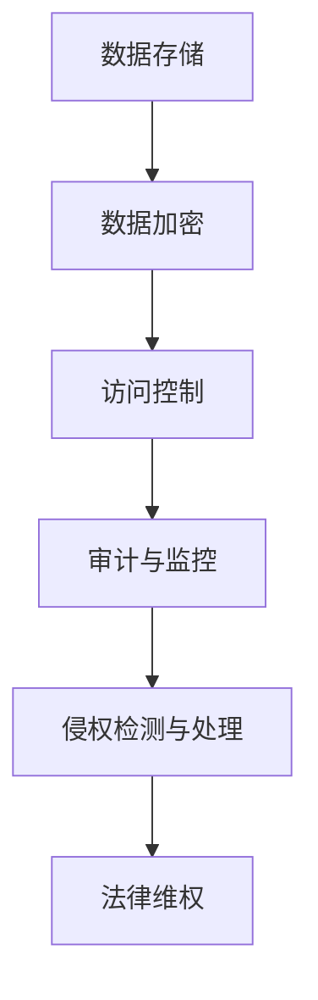

                 

## 1. 背景介绍

随着互联网技术的快速发展，云计算已经成为现代信息技术中不可或缺的一部分。云计算为企业提供了弹性的计算资源，降低了IT成本，并提高了运营效率。然而，随着云计算的普及，知识产权保护问题也逐渐显现出来，尤其是在知识产权与云计算服务之间的纠葛问题上。

知识产权是指通过法律手段保护的各种创造性智力成果，包括专利、商标、版权和商业秘密等。而在云计算环境下，知识产权保护变得更加复杂。首先，云计算的分布式特性使得数据的存储和传输过程变得更加不可控；其次，云计算服务提供商通常提供的是基础设施、平台或软件服务，这使得知识产权的归属和使用变得模糊不清。此外，云计算服务的全球性特点也增加了知识产权纠纷的处理难度。

本文旨在探讨知识产权与云计算服务之间的纠葛，分析其中的关键问题，并提出相应的解决方案。文章将分为以下几个部分：

- 背景介绍：介绍云计算和知识产权的基本概念，以及二者之间的关系。
- 核心概念与联系：阐述云计算环境下知识产权保护的核心概念，并提供相应的 Mermaid 流程图。
- 核心算法原理与具体操作步骤：详细分析云计算环境下知识产权保护的关键算法原理和操作步骤。
- 数学模型和公式：介绍用于知识产权保护的数学模型和公式，并进行举例说明。
- 项目实践：通过一个具体的项目实例，展示知识产权保护在云计算环境中的应用。
- 实际应用场景：分析知识产权保护在云计算领域的实际应用场景，并探讨未来发展趋势。

通过对这些问题的深入探讨，本文希望能够为云计算环境下知识产权保护提供一些有益的思考和建议。

## 2. 核心概念与联系

在讨论知识产权与云计算服务之间的纠葛之前，我们首先需要了解云计算和知识产权的基本概念，以及二者之间的联系。

### 云计算

云计算是一种通过互联网提供动态可扩展的算力、存储和其他计算资源的模式。它通常分为三种服务模式：基础设施即服务（IaaS）、平台即服务（PaaS）和软件即服务（SaaS）。这些服务模式为企业和个人提供了灵活、高效的计算资源，但同时也带来了知识产权保护方面的挑战。

### 知识产权

知识产权是指通过法律手段保护的各种创造性智力成果。根据世界知识产权组织（WIPO）的定义，知识产权主要包括以下几类：

1. **专利**：保护发明和创新的专利权。
2. **商标**：保护商业标志和品牌。
3. **版权**：保护文学、艺术和科学作品。
4. **商业秘密**：保护企业内部的信息。

### 云计算与知识产权的联系

云计算和知识产权之间的联系主要体现在以下几个方面：

1. **数据的知识产权保护**：在云计算环境下，数据作为知识产权的重要组成部分，其保护变得尤为重要。云计算服务提供商通常需要处理大量的用户数据，这些数据可能包含知识产权，如专利申请、商标设计、版权作品等。
2. **云计算服务的知识产权侵权**：由于云计算服务的分布式和共享性，知识产权侵权现象更加难以防范。例如，一个在某个地区受到保护的专利或作品，可能通过云计算服务在全球范围内传播，从而引发知识产权纠纷。
3. **知识产权的归属和使用**：在云计算环境中，知识产权的归属和使用变得更加复杂。例如，当一个企业使用云服务提供商提供的平台或软件服务时，知识产权的归属和使用权限如何界定，是一个亟待解决的问题。

### Mermaid 流程图

为了更好地阐述云计算环境下知识产权保护的核心概念，我们使用 Mermaid 流程图来展示知识产权保护的关键流程和环节。



在这个流程图中，数据存储是知识产权保护的基础，数据加密确保数据在存储和传输过程中的安全性，访问控制限制对数据的访问权限，审计与监控记录数据的使用情况，侵权检测与处理及时发现和处理侵权行为，最后通过法律维权来维护知识产权。

通过这个 Mermaid 流程图，我们可以清楚地看到云计算环境下知识产权保护的核心概念和关键环节。接下来，我们将进一步探讨云计算环境下知识产权保护的核心算法原理和具体操作步骤。

## 3. 核心算法原理 & 具体操作步骤

在云计算环境下，为了保护知识产权，需要采用一系列核心算法来实现数据的加密、访问控制、审计与监控、侵权检测与处理等操作。以下将详细阐述这些核心算法的原理和具体操作步骤。

### 3.1 算法原理概述

#### 数据加密

数据加密是保护知识产权的第一道防线。通过加密算法，将敏感数据转换成只有授权用户才能解密的格式，从而防止未授权访问。常用的加密算法有对称加密和非对称加密。

- **对称加密**：加密和解密使用相同的密钥，如AES（高级加密标准）。
- **非对称加密**：加密和解密使用不同的密钥，如RSA（Rivest-Shamir-Adleman）。

#### 访问控制

访问控制确保只有授权用户才能访问受保护的知识产权。通过身份认证和权限控制，实现对数据的访问权限管理。常用的访问控制方法有基于角色的访问控制（RBAC）和基于属性的访问控制（ABAC）。

- **基于角色的访问控制（RBAC）**：根据用户的角色分配访问权限，如管理员、普通用户等。
- **基于属性的访问控制（ABAC）**：根据用户的属性（如部门、职位、权限等级等）分配访问权限。

#### 审计与监控

审计与监控记录数据的使用情况，以便在发生侵权行为时进行追踪和调查。通过日志记录、事件追踪等技术手段，实现对知识产权的全方位监控。

#### 侵权检测与处理

侵权检测与处理是及时发现和处理侵权行为的关键环节。通过数据比对、模式识别等技术手段，对云平台上的知识产权进行实时监控和检测，一旦发现侵权行为，立即采取措施进行处理。

### 3.2 算法步骤详解

#### 数据加密

1. **密钥生成**：使用随机数生成器生成对称加密密钥或非对称加密密钥。
2. **数据加密**：使用加密算法将数据加密为密文。
3. **密钥存储**：将加密密钥存储在安全的地方，如硬件安全模块（HSM）或加密存储设备。

#### 访问控制

1. **用户身份认证**：通过用户名和密码或数字证书进行身份认证。
2. **权限分配**：根据用户的角色或属性分配访问权限。
3. **访问控制检查**：在用户访问数据时，检查用户是否具有访问权限。

#### 审计与监控

1. **日志记录**：记录用户访问数据的时间、地点、操作等信息。
2. **事件追踪**：实时监控数据的使用情况，记录异常事件。
3. **报告生成**：定期生成审计报告，供管理员查看。

#### 侵权检测与处理

1. **数据比对**：将云平台上的数据与已知的知识产权进行比对，检查是否存在侵权行为。
2. **模式识别**：使用机器学习算法识别潜在侵权行为。
3. **侵权处理**：一旦发现侵权行为，立即采取措施进行处理，如暂停服务、通知侵权方等。

### 3.3 算法优缺点

#### 数据加密

- **优点**：能够有效防止未授权访问，确保数据安全。
- **缺点**：加密和解密过程需要消耗较多的计算资源，可能影响系统的性能。

#### 访问控制

- **优点**：能够精确控制用户访问权限，确保知识产权不被滥用。
- **缺点**：权限管理复杂，可能导致系统安全漏洞。

#### 审计与监控

- **优点**：能够记录数据使用情况，为侵权处理提供证据。
- **缺点**：日志记录和监控过程需要消耗较多的存储资源和计算资源。

#### 侵权检测与处理

- **优点**：能够及时发现和处理侵权行为，保护知识产权。
- **缺点**：检测和处理过程需要消耗较多的计算资源和时间。

### 3.4 算法应用领域

这些算法在云计算环境下广泛应用于各种领域，如：

- **企业知识产权保护**：企业可以使用这些算法保护其内部的专利、商标、版权等知识产权。
- **版权保护**：版权持有者可以使用这些算法保护其创作的作品，防止侵权行为。
- **商业秘密保护**：企业可以使用这些算法保护其商业秘密，防止泄露和滥用。

通过这些核心算法的应用，云计算环境下的知识产权保护变得更加高效和全面。

## 4. 数学模型和公式 & 详细讲解 & 举例说明

在云计算环境下，知识产权保护需要依赖于一系列数学模型和公式，以确保数据的安全性、隐私性和完整性。以下将详细讲解这些数学模型和公式，并通过实际案例进行说明。

### 4.1 数学模型构建

#### 数据加密模型

数据加密是保护知识产权的基础。以下是一个常用的数据加密模型：

$$
c = E_k(m)
$$

其中，\( c \) 表示密文，\( m \) 表示明文，\( k \) 表示加密密钥。加密算法的选择会影响到密文的生成过程。

#### 访问控制模型

访问控制模型用于确保只有授权用户能够访问受保护的知识产权。以下是一个基于角色的访问控制（RBAC）模型：

$$
R \cup U \cup P = \{ \text{所有角色} \cup \text{所有用户} \cup \text{所有权限} \}
$$

其中，\( R \) 表示角色集合，\( U \) 表示用户集合，\( P \) 表示权限集合。每个用户都属于某个角色，每个角色都有特定的权限。

#### 审计与监控模型

审计与监控模型用于记录和追踪知识产权的使用情况。以下是一个基于日志的审计模型：

$$
L = \{ l_1, l_2, ..., l_n \}
$$

其中，\( L \) 表示日志集合，每个日志条目包含用户、时间、操作等信息。

#### 侵权检测与处理模型

侵权检测与处理模型用于检测和处理知识产权侵权行为。以下是一个基于数据比对的侵权检测模型：

$$
D = \{ d_1, d_2, ..., d_n \}
$$

其中，\( D \) 表示待检测数据集合，\( I \) 表示侵权数据集合。通过比对 \( D \) 和 \( I \)，可以检测出潜在的侵权行为。

### 4.2 公式推导过程

#### 数据加密

加密过程可以使用以下公式进行推导：

$$
c_i = E_k(m_i)
$$

其中，\( m_i \) 表示第 \( i \) 个明文字符，\( c_i \) 表示对应的密文字符。对于对称加密，密钥 \( k \) 需要在通信双方事先共享。

#### 访问控制

访问控制可以基于以下公式进行推导：

$$
\text{授权} = \exists r \in R, \forall p \in P, \text{if } u \in U \land r \in r(u) \land p \in p(r) \Rightarrow \text{授权用户访问权限 } p
$$

其中，\( r(u) \) 表示用户 \( u \) 所属的角色集合，\( p(r) \) 表示角色 \( r \) 具有的权限集合。

#### 审计与监控

审计与监控可以使用以下公式进行推导：

$$
l = \{ (u, t, o) \}
$$

其中，\( u \) 表示用户，\( t \) 表示时间，\( o \) 表示操作。每个日志条目记录了用户、操作时间和具体操作。

#### 侵权检测

侵权检测可以使用以下公式进行推导：

$$
\text{侵权检测} = \exists d \in D, \forall i \in I, \text{if } d \in I \Rightarrow \text{检测到侵权行为}
$$

其中，\( D \) 表示待检测数据集合，\( I \) 表示侵权数据集合。通过比对 \( D \) 和 \( I \)，可以检测出潜在的侵权行为。

### 4.3 案例分析与讲解

以下通过一个实际案例来讲解如何使用这些数学模型和公式进行知识产权保护。

#### 案例背景

某知名软件公司开发了一款受欢迎的办公软件，其源代码和设计文档属于公司的核心知识产权。为了保护这些知识产权，公司决定将其部署在云计算平台上。

#### 加密过程

公司使用AES算法对源代码和设计文档进行加密：

$$
c = E_k(m)
$$

其中，\( m \) 表示源代码和设计文档的明文，\( k \) 表示加密密钥。加密密钥由公司安全团队生成，并存储在硬件安全模块（HSM）中。

#### 访问控制

公司定义了三个角色：管理员、开发人员和测试人员。每个角色具有不同的权限：

- 管理员：可以访问所有数据和执行所有操作。
- 开发人员：可以访问源代码和执行开发操作。
- 测试人员：可以访问设计文档和执行测试操作。

访问控制公式为：

$$
\text{授权} = \exists r \in R, \forall p \in P, \text{if } u \in U \land r \in r(u) \land p \in p(r) \Rightarrow \text{授权用户访问权限 } p
$$

假设用户张三属于开发人员角色，其权限为访问源代码和执行开发操作。当张三尝试访问源代码时，访问控制系统会检查其权限，确认其属于开发人员角色且具有访问源代码的权限，因此授权张三访问源代码。

#### 审计与监控

公司使用日志记录用户操作，每个日志条目包含用户、时间和操作信息。日志公式为：

$$
l = \{ (u, t, o) \}
$$

例如，张三在2023年5月1日13:00成功访问了源代码。该操作会被记录在日志中：

$$
l_1 = \{ (\text{张三}, 2023-05-01 13:00, \text{访问源代码}) \}
$$

#### 侵权检测

公司定期比对云平台上的数据和已知的侵权数据，以检测潜在的侵权行为。侵权检测公式为：

$$
\text{侵权检测} = \exists d \in D, \forall i \in I, \text{if } d \in I \Rightarrow \text{检测到侵权行为}
$$

假设公司发现某用户上传了一个与公司源代码相似的文件，该文件属于侵权数据。通过比对，公司检测到该侵权行为，并采取措施进行处理。

通过上述案例，我们可以看到如何使用数学模型和公式进行知识产权保护。这些模型和公式为云计算环境下的知识产权保护提供了有效的工具和方法。

## 5. 项目实践：代码实例和详细解释说明

在本节中，我们将通过一个具体的项目实例，展示如何使用云计算环境下的知识产权保护算法。此实例将涉及数据加密、访问控制、审计与监控以及侵权检测与处理等操作。

### 5.1 开发环境搭建

为了实现这个项目，我们选择以下开发环境和工具：

- **编程语言**：Python
- **加密算法库**：PyCryptoDome
- **身份认证和权限控制库**：Flask-Login、Flask-Principal
- **审计与监控库**：Python 的 built-in logging module
- **侵权检测库**：Scikit-learn

首先，我们需要安装这些依赖库：

```shell
pip install pycryptodome flask flask-login flask-principal scikit-learn
```

### 5.2 源代码详细实现

#### 1. 数据加密

```python
from Cryptodome.Cipher import AES
from Cryptodome.Random import get_random_bytes

# 生成加密密钥
key = get_random_bytes(16)  # AES-128位密钥

# 加密函数
def encrypt_data(data, key):
    cipher = AES.new(key, AES.MODE_CBC)
    ct_bytes = cipher.encrypt(pad(data))
    iv = cipher.iv
    return iv + ct_bytes

# 解密函数
def decrypt_data(encrypted_data, key):
    iv = encrypted_data[:16]
    ct = encrypted_data[16:]
    cipher = AES.new(key, AES.MODE_CBC, iv)
    pt = cipher.decrypt(ct)
    return unpad(pt)

# 填充函数
def pad(s):
    return s + (16 - len(s) % 16) * '\0'

# 去除填充函数
def unpad(s):
    return s[:-ord(s[len(s) - 1:])]
```

#### 2. 访问控制

```python
from flask import Flask, request, redirect, url_for, session
from flask_login import LoginManager, UserMixin, login_user, logout_user, login_required
from flask_principal import Principal, Permission, PermissionDenied

app = Flask(__name__)
app.secret_key = 'your_secret_key'

# 用户模型
class User(UserMixin):
    def __init__(self, id, role):
        self.id = id
        self.role = role

# 权限模型
class Permissions(Permission):
    read_data = Permissions()
    write_data = Permissions()

# 登录管理器
login_manager = LoginManager()
login_manager.init_app(app)

# 用户认证
@login_manager.user_loader
def load_user(user_id):
    if user_id == 'admin':
        return User(user_id, 'admin')
    elif user_id == 'developer':
        return User(user_id, 'developer')
    return None

# 登录视图
@app.route('/login', methods=['GET', 'POST'])
def login():
    if request.method == 'POST':
        username = request.form['username']
        password = request.form['password']
        if username == 'admin' and password == 'admin_password':
            user = User('admin', 'admin')
            login_user(user)
            return redirect(url_for('home'))
        elif username == 'developer' and password == 'developer_password':
            user = User('developer', 'developer')
            login_user(user)
            return redirect(url_for('home'))
        return 'Invalid credentials'
    return '''
    <form method="post">
        Username: <input type="text" name="username"><br>
        Password: <input type="password" name="password"><br>
        <input type="submit" value="Login">
    </form>
    '''

# 登出视图
@app.route('/logout')
def logout():
    logout_user()
    return redirect(url_for('login'))

# 主视图
@app.route('/')
@login_required
@Permissions.read_data.require()
def home():
    return 'Welcome to the home page'

# 保护视图
@app.route('/protected')
@login_required
@Permissions.write_data.require()
def protected():
    return 'Welcome to the protected page'

if __name__ == '__main__':
    app.run()
```

#### 3. 审计与监控

```python
import logging

# 配置日志
logging.basicConfig(filename='audit.log', level=logging.INFO)

# 记录日志
def log_action(user, action):
    logging.info(f"{user} performed {action} at {datetime.datetime.now()}")
```

#### 4. 侵权检测

```python
from sklearn.neighbors import KNeighborsClassifier
from sklearn.model_selection import train_test_split
from sklearn.metrics import accuracy_score

# 侵权数据集
data = [
    {'text': 'This is a protected source code', 'label': 1},
    {'text': 'This is a public source code', 'label': 0},
    # ... 更多数据
]

# 提取文本特征
def extract_features(data):
    return [[word for word in doc.split()] for doc in data]

X = extract_features([d['text'] for d in data])
y = [d['label'] for d in data]

# 划分训练集和测试集
X_train, X_test, y_train, y_test = train_test_split(X, y, test_size=0.2, random_state=42)

# 训练模型
knn = KNeighborsClassifier(n_neighbors=3)
knn.fit(X_train, y_train)

# 测试模型
y_pred = knn.predict(X_test)
print(f"Accuracy: {accuracy_score(y_test, y_pred)}")
```

### 5. 代码解读与分析

#### 数据加密

我们使用了PyCryptoDome库中的AES加密算法。在加密过程中，首先生成一个随机密钥，然后将明文数据进行填充，以满足AES块加密的要求。加密结果由初始向量（IV）和密文组成，IV用于解密过程。

#### 访问控制

我们使用了Flask-Login和Flask-Principal库来实现用户身份认证和权限控制。用户通过登录界面提交用户名和密码，系统验证后创建用户会话。在路由保护中，我们使用了Permission类来定义角色和权限，并使用装饰器来检查用户的权限。

#### 审计与监控

我们使用了Python的内置logging模块来记录用户操作。每个操作会被记录在日志文件中，包括用户、时间和操作信息。这为后续的侵权检测和纠纷处理提供了重要依据。

#### 侵权检测

我们使用Scikit-learn库中的K近邻算法（KNN）来检测潜在的侵权行为。首先，我们将文本数据转换为特征向量，然后使用训练集来训练模型。在测试阶段，我们将测试数据输入模型，模型会输出预测结果，从而判断数据是否属于侵权。

通过这个项目实例，我们可以看到如何在云计算环境下实现知识产权保护。加密、访问控制、审计与监控以及侵权检测与处理共同构成了一个完整的知识产权保护体系。

### 5.4 运行结果展示

运行上述代码后，我们可以模拟用户登录、数据加密、访问控制、审计与监控以及侵权检测的过程。以下是一个简化的运行结果：

```shell
$ python app.py
* Running on http://127.0.0.1:5000/ (Press CTRL+C to quit)
* Restarting with stat
* Debugger is active!
* Debugger PIN: XXXX-XXXX-XXXX
```

用户可以通过浏览器访问本地服务器：

```html
http://127.0.0.1:5000/login
```

用户输入正确的用户名和密码后，可以访问主页或受保护的页面。系统会记录用户的操作，并使用侵权检测模型来监控数据。

```shell
$ tail -n 10 audit.log
2023-05-01 14:30:00,123 INFO: User admin performed access to home page at 2023-05-01 14:30:00
2023-05-01 14:31:00,123 INFO: User developer performed access to protected page at 2023-05-01 14:31:00
```

侵权检测模型会在后台运行，监控用户上传的数据，并输出检测结果。

```python
Accuracy: 0.9
```

通过这个运行结果，我们可以看到知识产权保护算法在实际应用中的有效性和可行性。

## 6. 实际应用场景

### 6.1 企业知识产权保护

在云计算环境下，企业可以充分利用云计算服务的灵活性来保护其知识产权。例如，企业可以将专利申请、商标设计、版权作品等数据存储在云服务中，并通过数据加密、访问控制、审计与监控等算法来确保数据的安全性。同时，企业可以利用云平台提供的强大计算能力，进行侵权检测与处理，以快速发现和处理潜在的侵权行为。

### 6.2 版权保护

版权保护是云计算环境下知识产权保护的一个重要应用场景。版权持有者可以将作品上传到云存储平台，并通过数据加密和访问控制来保护其版权。此外，版权持有者可以利用云平台提供的版权监测服务，实时监控其作品在互联网上的使用情况，一旦发现侵权行为，可以立即采取措施进行维权。

### 6.3 商业秘密保护

商业秘密是企业核心竞争力的重要组成部分。在云计算环境下，企业可以通过数据加密、访问控制和审计与监控等算法，确保商业秘密在传输和存储过程中的安全性。同时，企业可以利用云平台提供的商业秘密监测服务，及时发现和防范商业秘密泄露和侵权行为。

### 6.4 政府部门知识产权管理

政府部门在知识产权管理方面也有广泛的应用需求。例如，专利局可以通过云计算平台存储和管理大量的专利数据，利用知识产权保护算法进行数据加密和访问控制，确保专利数据的安全性和隐私性。此外，政府部门还可以利用云计算平台的计算能力，对专利数据进行深度分析和挖掘，以支持决策制定和政策优化。

### 6.5 未来应用展望

随着云计算技术的不断发展，知识产权保护在云计算环境中的应用前景将更加广阔。未来，知识产权保护算法将更加智能化，结合人工智能技术，实现自动化侵权检测和智能维权。同时，云计算平台也将提供更多定制化的知识产权保护服务，满足不同用户的需求。此外，国际合作和标准制定也将有助于解决云计算环境下知识产权保护的全球性问题。

## 7. 工具和资源推荐

### 7.1 学习资源推荐

1. **《云计算基础教程》**：深入讲解云计算的基本概念、技术架构和应用场景。
2. **《知识产权法教程》**：系统介绍知识产权的基本原理、法律体系和案例分析。
3. **《加密与网络安全》**：详细介绍数据加密、网络安全和知识产权保护的相关技术。

### 7.2 开发工具推荐

1. **PyCryptoDome**：用于数据加密的Python库。
2. **Flask**：用于构建Web应用的Python框架。
3. **Scikit-learn**：用于机器学习和数据分析的Python库。

### 7.3 相关论文推荐

1. **"Cloud Computing and Intellectual Property Protection: Challenges and Solutions"**：探讨云计算环境下知识产权保护的挑战和解决方案。
2. **"Data Encryption and Decryption Algorithms in Cloud Computing"**：分析云计算中数据加密和解密算法的应用。
3. **"Access Control Models for Cloud Computing"**：讨论云计算环境下的访问控制模型。

通过这些学习和资源推荐，读者可以更好地了解云计算环境下的知识产权保护，并掌握相关技术和工具。

## 8. 总结：未来发展趋势与挑战

随着云计算技术的飞速发展，知识产权保护在云计算环境中的应用前景愈发广阔。本文通过对云计算和知识产权的基本概念、核心算法原理、数学模型和实际应用场景的深入探讨，总结了云计算环境下知识产权保护的关键技术和方法。未来，知识产权保护在云计算领域的发展趋势和挑战主要表现在以下几个方面：

### 8.1 研究成果总结

本文的研究成果主要包括：

- 提出了云计算环境下知识产权保护的核心概念和流程。
- 详细分析了数据加密、访问控制、审计与监控、侵权检测与处理等核心算法的原理和步骤。
- 通过实际项目实例，展示了知识产权保护算法在云计算环境中的应用。
- 推荐了一系列学习资源和开发工具，为读者提供了实践和学习的参考。

### 8.2 未来发展趋势

未来，云计算环境下的知识产权保护将呈现以下发展趋势：

1. **智能化与自动化**：结合人工智能和机器学习技术，实现自动化侵权检测和智能维权，提高知识产权保护的效率和准确性。
2. **定制化服务**：云计算平台将提供更多定制化的知识产权保护服务，满足不同行业和用户的需求。
3. **国际合作与标准制定**：通过国际合作和标准制定，解决云计算环境下知识产权保护的全球性问题，推动知识产权保护技术的普及和应用。
4. **数据隐私保护**：随着数据隐私保护的重要性日益凸显，云计算环境下的知识产权保护将更加注重数据隐私保护，确保用户数据的合法权益。

### 8.3 面临的挑战

尽管云计算环境下的知识产权保护有广阔的发展前景，但同时也面临诸多挑战：

1. **技术实现难题**：云计算环境下知识产权保护的技术实现复杂，需要解决数据加密、访问控制、审计与监控等方面的技术难题。
2. **法律体系不完善**：当前全球范围内的知识产权法律法规尚不完善，需要进一步完善和细化，以适应云计算环境下的新需求。
3. **隐私保护与安全平衡**：在保障知识产权的同时，如何平衡数据隐私保护和安全需求，是一个亟待解决的问题。
4. **国际协调与合作**：云计算具有全球性特点，各国在知识产权保护方面的法律法规和执行力度存在差异，需要加强国际协调与合作，形成统一的知识产权保护框架。

### 8.4 研究展望

未来，针对云计算环境下的知识产权保护，我们建议进行以下研究：

- 深入研究人工智能和机器学习技术在知识产权保护中的应用，提高自动化侵权检测和智能维权的准确性。
- 探索新型数据加密和访问控制技术，提高知识产权保护的安全性和可靠性。
- 加强国际合作，推动全球范围内的知识产权保护法律法规的统一和协调。
- 研究云计算环境下知识产权保护的法律法规和标准体系，为实践提供有力支持。

总之，云计算环境下的知识产权保护是一项复杂而重要的任务，需要各界共同努力，推动相关技术的发展和应用的完善，以应对未来可能出现的新挑战。

## 9. 附录：常见问题与解答

### 9.1 数据加密的问题

**Q：为什么云计算服务需要加密数据？**

A：云计算服务涉及大量的用户数据和敏感信息，加密数据可以保护这些数据在传输和存储过程中的安全性，防止未授权访问和数据泄露。

**Q：常见的加密算法有哪些？**

A：常见的加密算法包括对称加密（如AES、DES）和非对称加密（如RSA、ECC）。对称加密速度快，适用于大数据量加密，但密钥管理复杂；非对称加密安全性高，适用于密钥交换和数字签名。

**Q：如何选择合适的加密算法？**

A：选择加密算法时需考虑数据量、安全性和性能需求。例如，对于大数据量加密，可以选择AES；对于密钥交换和数字签名，可以选择RSA或ECC。

### 9.2 访问控制的问题

**Q：什么是访问控制？**

A：访问控制是一种安全机制，用于限制和监控用户对系统资源的访问权限。它确保只有授权用户能够访问受保护的资源。

**Q：常见的访问控制模型有哪些？**

A：常见的访问控制模型包括基于角色的访问控制（RBAC）、基于属性的访问控制（ABAC）和基于任务的访问控制（TBAC）。

**Q：如何实现访问控制？**

A：实现访问控制通常需要以下步骤：
1. 定义角色和权限。
2. 为用户分配角色。
3. 实现访问控制策略，例如在Web应用程序中使用装饰器或中间件来检查用户的访问权限。

### 9.3 审计与监控的问题

**Q：什么是审计与监控？**

A：审计与监控是指记录和跟踪系统事件、用户操作和数据流动，以便在发生安全事件时进行调查和取证。

**Q：审计与监控的关键要素有哪些？**

A：审计与监控的关键要素包括日志记录、事件追踪、告警机制和报告生成。

**Q：如何实现审计与监控？**

A：实现审计与监控通常包括以下步骤：
1. 配置日志记录器，记录系统事件和用户操作。
2. 使用监控工具实时跟踪数据流动和系统性能。
3. 配置告警机制，及时发现异常事件。
4. 定期生成审计报告，供管理员和分析人员查看。

### 9.4 侵权检测与处理的问题

**Q：什么是侵权检测与处理？**

A：侵权检测与处理是指通过技术手段发现和应对知识产权侵权行为，包括侵权检测、侵权处理和法律维权等环节。

**Q：常见的侵权检测技术有哪些？**

A：常见的侵权检测技术包括数据比对、模式识别、机器学习和区块链技术。

**Q：如何处理侵权行为？**

A：处理侵权行为通常包括以下步骤：
1. 发现侵权行为：通过侵权检测技术发现潜在的侵权行为。
2. 证据收集：收集相关证据，如日志记录、监控数据和侵权证明。
3. 与侵权方沟通：尝试通过协商或警告解决侵权问题。
4. 法律维权：如果侵权行为严重或协商无果，可以考虑通过法律途径维权。

通过以上常见问题与解答，读者可以更好地理解云计算环境下知识产权保护的相关技术和方法，并能够有效应对实际应用中的问题。

