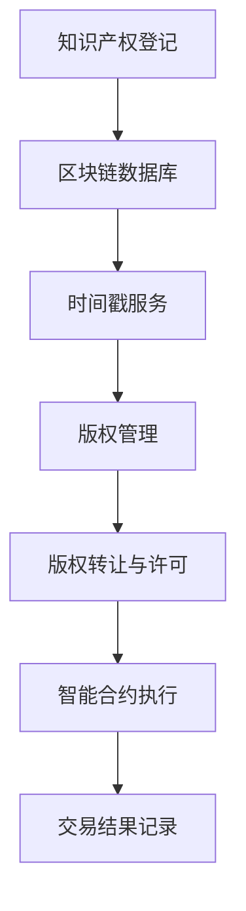

                 

关键词：知识产权、区块链、加密技术、智能合约、版权保护、去中心化

摘要：本文将探讨知识产权与区块链技术的结合，分析其核心概念、原理、算法、数学模型及其在具体应用中的实现。通过详细的项目实践案例，阐述区块链技术在知识产权保护方面的优势和未来应用前景，同时提出面临的技术挑战和解决方案。

## 1. 背景介绍

知识产权是指人们就其智力劳动成果所依法享有的专有权利，通常包括著作权、专利权、商标权等。随着互联网和信息技术的飞速发展，知识产权面临着前所未有的挑战。传统的知识产权保护机制难以适应数字化时代的需要，版权侵权、专利纠纷等问题层出不穷。如何有效地保护知识产权、提高知识产权保护效率、降低维权成本成为当前亟待解决的问题。

区块链技术作为一种去中心化、透明、安全的分布式数据库技术，其在信息安全、数字货币、供应链管理等多个领域已经展现出巨大的潜力。近年来，越来越多的研究人员和企业开始探索将区块链技术应用于知识产权保护领域，以期实现知识产权的全程保护和管理。

## 2. 核心概念与联系

### 2.1 核心概念

- **知识产权**：指人们就其智力劳动成果所依法享有的专有权利，通常包括著作权、专利权、商标权等。
- **区块链技术**：一种分布式数据库技术，通过加密算法和共识机制确保数据的完整性和安全性。
- **加密技术**：使用加密算法对数据进行加密，确保数据在传输和存储过程中的安全性。
- **智能合约**：运行在区块链上的计算机程序，可自动执行合同条款。

### 2.2 联系

区块链技术在知识产权保护中的应用主要体现在以下几个方面：

- **数据存储与证明**：区块链作为分布式数据库，可存储知识产权相关的信息，如著作权登记、专利申请等，并提供时间戳服务，确保数据的真实性和不可篡改性。
- **版权管理**：利用区块链技术实现版权的登记、转让、许可等管理功能，提高版权保护效率。
- **防伪溯源**：通过区块链技术实现对知识产权产品或服务的防伪溯源，确保产品或服务的真实性和质量。
- **智能合约**：利用智能合约自动执行版权许可、 royalty 分配等合同条款，降低交易成本和纠纷风险。

### 2.3 Mermaid 流程图



## 3. 核心算法原理 & 具体操作步骤

### 3.1 算法原理概述

区块链技术在知识产权保护中的核心算法主要包括：

- **哈希算法**：用于生成数据的唯一标识，确保数据在区块链上的完整性和一致性。
- **加密算法**：用于对数据进行加密和解密，确保数据在传输和存储过程中的安全性。
- **共识算法**：用于节点之间达成共识，确保区块链网络的安全和稳定性。

### 3.2 算法步骤详解

1. **知识产权登记**
   - 作者或权利人将知识产权信息（如作品、专利、商标等）提交到区块链平台。
   - 平台使用哈希算法生成知识产权信息的哈希值，并将其与时间戳一同存储在区块链上。

2. **版权管理**
   - 权利人可以通过区块链平台对版权进行登记、转让、许可等操作。
   - 每个操作步骤都会生成新的哈希值，并存储在区块链上，确保数据的不可篡改性。

3. **防伪溯源**
   - 产品或服务提供商可以通过区块链技术实现对产品或服务的防伪溯源。
   - 消费者可以通过扫描二维码或输入唯一标识，查询产品或服务的生产、流通等信息。

4. **智能合约执行**
   - 智能合约自动执行版权许可、royalty 分配等合同条款。
   - 合同条款的执行结果将记录在区块链上，确保交易的安全性和透明性。

### 3.3 算法优缺点

**优点：**
- **去中心化**：区块链技术具有去中心化的特点，避免了传统知识产权保护机制中的中介环节，降低了成本和纠纷风险。
- **透明性**：区块链上的数据具有透明性，可被所有参与者查看，提高了知识产权保护的效率和公正性。
- **安全性**：区块链技术使用加密算法确保数据在传输和存储过程中的安全性，有效防止了数据篡改和泄露。

**缺点：**
- **计算资源消耗**：区块链技术的运行需要大量的计算资源，可能导致能源消耗增加。
- **隐私保护**：虽然区块链技术具有透明性，但也存在隐私保护的问题，特别是在涉及个人隐私的知识产权保护方面。

### 3.4 算法应用领域

区块链技术在知识产权保护中的应用领域主要包括：

- **版权保护**：通过区块链技术实现对版权的全程保护和管理，包括作品创作、登记、转让、许可等环节。
- **专利保护**：利用区块链技术实现专利的申请、审查、授权等流程，提高专利保护效率。
- **商标保护**：通过区块链技术实现对商标的注册、转让、许可等管理功能，确保商标的真实性和有效性。

## 4. 数学模型和公式 & 详细讲解 & 举例说明

### 4.1 数学模型构建

在区块链技术中，常用的数学模型包括：

1. **哈希模型**：用于生成数据的唯一标识。
2. **加密模型**：用于对数据进行加密和解密。
3. **共识模型**：用于节点之间达成共识。

### 4.2 公式推导过程

1. **哈希模型**
   - 哈希函数：\( H(D) \rightarrow h \)
   - 其中，\( H \) 表示哈希函数，\( D \) 表示数据，\( h \) 表示哈希值。

2. **加密模型**
   - 加密算法：\( C = E(K, P) \)
   - 解密算法：\( P = D(K, C) \)
   - 其中，\( C \) 表示加密后的数据，\( P \) 表示原始数据，\( K \) 表示密钥。

3. **共识模型**
   - 节点间达成共识：\( \sum_{i=1}^{n} v_i = 1 \)
   - 其中，\( v_i \) 表示节点 \( i \) 的投票权重，\( n \) 表示节点总数。

### 4.3 案例分析与讲解

以版权保护为例，说明区块链技术在版权保护中的应用。

1. **版权登记**
   - 作者将作品提交到区块链平台，平台使用哈希算法生成作品的哈希值。
   - 哈希值和时间戳一同存储在区块链上，确保作品的真实性和唯一性。

2. **版权转让**
   - 原版权持有人将版权转让给新的版权持有人，转让信息通过智能合约自动执行。
   - 转让信息存储在区块链上，确保转让过程的透明性和不可篡改性。

3. **版权许可**
   - 新版权持有人通过智能合约向第三方颁发版权许可。
   - 许可信息存储在区块链上，确保许可过程的透明性和可追溯性。

4. **版权侵权检测**
   - 通过对比区块链上的版权登记信息和侵权举报信息，判断是否存在侵权行为。
   - 侵权行为记录在区块链上，便于维权和法律追究。

## 5. 项目实践：代码实例和详细解释说明

### 5.1 开发环境搭建

为了演示区块链技术在版权保护中的应用，我们将使用以太坊智能合约开发平台 Truffle 和前端开发框架 React。

1. **安装 Node.js 和 npm**：从 [Node.js 官网](https://nodejs.org/) 下载并安装 Node.js，同时安装 npm。
2. **安装 Truffle**：在命令行中运行 `npm install -g truffle`。
3. **安装 React**：在命令行中运行 `npx create-react-app copyright-protection`。

### 5.2 源代码详细实现

下面是一个简单的以太坊智能合约，用于实现版权登记、转让和许可功能。

```solidity
pragma solidity ^0.8.0;

contract CopyrightProtection {
    struct Work {
        string title;
        string author;
        address owner;
        mapping(address => bool) licensors;
    }

    mapping(string => Work) public works;

    function registerWork(string memory title, string memory author) public {
        require(works[title].title == "", "Work already registered");
        works[title] = Work({
            title: title,
            author: author,
            owner: msg.sender,
            licensors: mapping(address => bool)
        });
    }

    function transferOwnership(string memory title, address newOwner) public {
        require(works[title].owner == msg.sender, "Not the owner");
        works[title].owner = newOwner;
    }

    function grantLicense(string memory title, address licensee) public {
        require(works[title].owner == msg.sender, "Not the owner");
        works[title].licensors[licensee] = true;
    }

    function revokeLicense(string memory title, address licensee) public {
        require(works[title].owner == msg.sender, "Not the owner");
        works[title].licensors[licensee] = false;
    }
}
```

### 5.3 代码解读与分析

- **registerWork**：用于注册版权，接受作品标题、作者和注册者地址作为参数。
- **transferOwnership**：用于转让版权，接受作品标题和新版权持有人地址作为参数。
- **grantLicense**：用于颁发版权许可，接受作品标题和被许可人地址作为参数。
- **revokeLicense**：用于撤销版权许可，接受作品标题和被许可人地址作为参数。

### 5.4 运行结果展示

假设我们有以下操作：

1. **注册版权**：
   - 调用 `registerWork("我的作品", "张三")`，注册作品标题为“我的作品”，作者为“张三”。
2. **转让版权**：
   - 调用 `transferOwnership("我的作品", 0x1234567890123456789012345678901234567890)`，将版权转让给地址为 0x1234567890123456789012345678901234567890 的新版权持有人。
3. **颁发版权许可**：
   - 调用 `grantLicense("我的作品", 0x1234567890123456789012345678901234567891)`，将版权许可给地址为 0x1234567890123456789012345678901234567891 的第三方。
4. **撤销版权许可**：
   - 调用 `revokeLicense("我的作品", 0x1234567890123456789012345678901234567891)`，撤销地址为 0x1234567890123456789012345678901234567891 的第三方的版权许可。

操作结果将记录在区块链上，可通过以太坊浏览器查看。

## 6. 实际应用场景

区块链技术在知识产权保护领域的实际应用场景主要包括：

1. **版权保护**：通过区块链技术实现对作品创作、登记、转让、许可等全流程的保护和管理，提高版权保护效率。
2. **专利保护**：利用区块链技术实现专利的申请、审查、授权等流程，降低专利维权成本。
3. **商标保护**：通过区块链技术实现对商标的注册、转让、许可等管理功能，确保商标的真实性和有效性。
4. **防伪溯源**：利用区块链技术实现对产品或服务的防伪溯源，提高产品质量和消费者信任度。

## 7. 未来应用展望

随着区块链技术的不断发展，其在知识产权保护领域的应用前景十分广阔。未来，区块链技术有望在以下方面发挥更大的作用：

1. **去中心化版权交易平台**：利用区块链技术构建去中心化的版权交易平台，降低交易成本和纠纷风险。
2. **跨链协作**：通过跨链技术实现不同区块链之间的协作，提高知识产权保护的全球化和协同性。
3. **智能合约优化**：不断优化智能合约的算法和架构，提高智能合约的执行效率和安全性。
4. **隐私保护**：研究隐私保护技术，确保区块链技术在知识产权保护领域的隐私保护需求。

## 8. 工具和资源推荐

### 8.1 学习资源推荐

- **区块链技术入门书籍**：《区块链技术指南》、《精通区块链》。
- **智能合约开发教程**：Truffle 官方文档、Solidity 官方文档。
- **知识产权保护相关论文**：《区块链技术在知识产权保护中的应用研究》、《基于区块链的版权保护机制研究》。

### 8.2 开发工具推荐

- **区块链平台**：Ethereum、EOS、Tron。
- **智能合约开发框架**：Truffle、Hardhat。
- **前端开发框架**：React、Vue、Angular。

### 8.3 相关论文推荐

- **《区块链技术在版权保护中的应用研究》**：分析了区块链技术在版权保护中的潜在应用，提出了基于区块链的版权保护机制。
- **《基于区块链的版权保护系统设计与实现》**：设计并实现了一个基于区块链的版权保护系统，具有较高的实用价值。
- **《区块链与知识产权保护》**：探讨了区块链技术在知识产权保护领域的应用前景和挑战，具有较高的理论价值。

## 9. 总结：未来发展趋势与挑战

### 9.1 研究成果总结

近年来，区块链技术在知识产权保护领域取得了显著成果，主要体现在以下几个方面：

1. **版权保护**：通过区块链技术实现了对作品创作、登记、转让、许可等全流程的保护和管理。
2. **专利保护**：利用区块链技术实现专利的申请、审查、授权等流程，降低了专利维权成本。
3. **商标保护**：通过区块链技术实现对商标的注册、转让、许可等管理功能，确保商标的真实性和有效性。
4. **防伪溯源**：利用区块链技术实现对产品或服务的防伪溯源，提高了产品质量和消费者信任度。

### 9.2 未来发展趋势

未来，区块链技术在知识产权保护领域有望在以下几个方面实现进一步发展：

1. **去中心化版权交易平台**：利用区块链技术构建去中心化的版权交易平台，降低交易成本和纠纷风险。
2. **跨链协作**：通过跨链技术实现不同区块链之间的协作，提高知识产权保护的全球化和协同性。
3. **智能合约优化**：不断优化智能合约的算法和架构，提高智能合约的执行效率和安全性。
4. **隐私保护**：研究隐私保护技术，确保区块链技术在知识产权保护领域的隐私保护需求。

### 9.3 面临的挑战

尽管区块链技术在知识产权保护领域取得了显著成果，但仍然面临以下挑战：

1. **技术成熟度**：区块链技术尚未完全成熟，需要进一步提高其性能和安全性。
2. **法律规范**：现有法律法规对区块链技术的应用尚未完全明确，需要制定相应的法律规范。
3. **隐私保护**：区块链技术具有一定的透明性，如何确保知识产权保护过程中的隐私保护是一个重要问题。
4. **用户接受度**：区块链技术在知识产权保护领域的应用需要广大用户的接受和认可，提高用户接受度是关键。

### 9.4 研究展望

未来，区块链技术在知识产权保护领域的研究将朝着以下几个方面发展：

1. **技术创新**：不断探索区块链技术的创新应用，提高其在知识产权保护领域的性能和安全性。
2. **法律规范**：加强与法律领域的合作，制定适应区块链技术的知识产权保护法律法规。
3. **跨领域合作**：推动不同领域之间的合作，实现知识产权保护的全链条协同。
4. **用户教育**：加强对区块链技术在知识产权保护领域的宣传和推广，提高用户接受度和应用水平。

## 附录：常见问题与解答

### 问题 1：区块链技术如何保证知识产权数据的真实性？

解答：区块链技术使用哈希算法生成知识产权数据的唯一标识，并将其与时间戳一同存储在区块链上。哈希算法具有不可逆性和一致性，确保了知识产权数据的真实性和唯一性。此外，区块链网络中的所有参与者都可以查看和验证这些数据，提高了数据透明性和可信度。

### 问题 2：区块链技术在知识产权保护中的优势有哪些？

解答：区块链技术在知识产权保护中的优势主要体现在以下几个方面：

1. **去中心化**：避免了传统知识产权保护机制中的中介环节，降低了成本和纠纷风险。
2. **透明性**：区块链上的数据具有透明性，可被所有参与者查看，提高了知识产权保护的效率和公正性。
3. **安全性**：区块链技术使用加密算法确保数据在传输和存储过程中的安全性，有效防止了数据篡改和泄露。
4. **不可篡改性**：区块链上的数据一旦记录，就不可篡改，确保了知识产权数据的真实性和完整性。

### 问题 3：区块链技术在知识产权保护中是否存在隐私保护问题？

解答：是的，区块链技术具有一定的透明性，存在隐私保护问题。尤其是在涉及个人隐私的知识产权保护方面，如个人作品、专利等。为了解决隐私保护问题，可以采用以下措施：

1. **匿名化处理**：对涉及个人隐私的数据进行匿名化处理，确保个人隐私不被泄露。
2. **隐私保护算法**：研究并采用隐私保护算法，如零知识证明、同态加密等，确保数据在区块链上的安全性和隐私性。
3. **智能合约优化**：优化智能合约的算法和架构，减少隐私泄露的风险。

### 问题 4：区块链技术如何确保知识产权交易的公平性？

解答：区块链技术通过以下方式确保知识产权交易的公平性：

1. **透明性**：区块链上的数据具有透明性，所有参与者都可以查看和验证交易信息，提高了交易的公平性。
2. **去中心化**：区块链技术具有去中心化的特点，避免了传统交易中介环节，降低了交易成本和纠纷风险。
3. **智能合约**：智能合约自动执行交易条款，确保交易结果符合合同约定，提高了交易公平性。
4. **共识机制**：区块链网络中的节点通过共识机制达成共识，确保交易数据的真实性和一致性。

### 问题 5：区块链技术在知识产权保护中的未来发展趋势是什么？

解答：区块链技术在知识产权保护领域的未来发展趋势主要包括以下几个方面：

1. **去中心化版权交易平台**：利用区块链技术构建去中心化的版权交易平台，降低交易成本和纠纷风险。
2. **跨链协作**：通过跨链技术实现不同区块链之间的协作，提高知识产权保护的全球化和协同性。
3. **智能合约优化**：不断优化智能合约的算法和架构，提高智能合约的执行效率和安全性。
4. **隐私保护**：研究隐私保护技术，确保区块链技术在知识产权保护领域的隐私保护需求。

总之，区块链技术在知识产权保护领域具有巨大的发展潜力，有望在未来实现更高效、更安全、更公平的知识产权保护体系。

