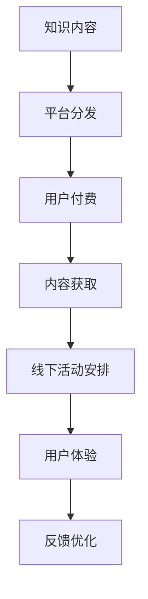

                 

关键词：知识付费、线下体验、知识旅行、商业模式、用户参与、互动学习

> 摘要：本文旨在探讨知识付费与线下体验相结合的“知识旅行”模式。通过分析这一模式的背景、核心概念和运作机制，我们将揭示其独特的价值，并从技术角度提出具体的实现方法和优化策略。本文还通过实际案例和数学模型分析，展示了该模式在实践中的应用效果，并对未来发展方向提出了展望。

## 1. 背景介绍

在信息化社会，知识付费已经成为一种主流的商业模式。用户对知识的渴求日益增长，而提供知识服务的平台和机构也层出不穷。然而，传统的在线学习模式虽然便利，但在满足用户深度体验、互动交流等方面仍存在局限。线下体验作为知识获取的重要补充，能够有效弥补这一不足。知识旅行作为一种新兴的知识付费模式，将两者相结合，旨在提供一种更加丰富、多元、互动的学习体验。

### 1.1 知识付费的发展

知识付费起源于互联网时代，随着用户对优质内容的追求和付费意识的提高，逐渐成为主流。知识付费平台通过内容创作、流量分发和用户付费等环节，实现了知识的生产、传播和消费。这一模式极大地促进了知识经济的发展，为知识型劳动者提供了更多机会。

### 1.2 线下体验的重要性

线下体验作为一种传统的学习方式，具有不可替代的优势。通过面对面的交流、实地考察和互动体验，用户能够更加深入地理解和掌握知识。尤其是在需要实践操作、互动讨论的场景中，线下体验能够提供更为真实的学习环境。

### 1.3 知识旅行的兴起

知识旅行作为一种融合知识付费和线下体验的新模式，旨在通过旅游的方式，让用户在探索未知、体验文化的同时，获取新知。这一模式不仅满足了用户对知识的需求，还能够提供独特的体验和回忆。

## 2. 核心概念与联系

### 2.1 知识付费与线下体验的关系

知识付费与线下体验并非孤立存在，而是相互补充、共同发展的。知识付费为线下体验提供了内容基础和资金支持，而线下体验则为知识付费提供了实践场景和用户反馈。

### 2.2 知识旅行的构成要素

知识旅行的构成要素主要包括：

- **知识内容**：为用户提供丰富多样的知识资源，涵盖学术、文化、艺术等多个领域。
- **体验场景**：提供线下体验的场所和活动，如博物馆、艺术馆、实验室等。
- **互动环节**：设计各种互动活动，如讲座、工作坊、讨论会等，以增强用户参与感。
- **技术支持**：利用移动互联网、大数据等技术，为知识旅行提供技术保障。

### 2.3 Mermaid 流程图

以下是一个简化的Mermaid流程图，展示了知识付费与线下体验相结合的流程：



## 3. 核心算法原理 & 具体操作步骤

### 3.1 算法原理概述

知识旅行模式的核心算法主要涉及用户需求分析、内容推荐和活动优化等方面。其基本原理包括：

- **用户需求分析**：通过大数据分析用户行为，了解用户的知识需求和偏好。
- **内容推荐**：基于用户需求和内容属性，推荐合适的知识内容和线下活动。
- **活动优化**：通过算法优化线下活动的安排，提高用户体验和满意度。

### 3.2 算法步骤详解

#### 3.2.1 用户需求分析

1. **数据收集**：收集用户在知识付费平台的行为数据，如浏览记录、购买记录、评论等。
2. **数据分析**：使用数据挖掘技术，分析用户行为数据，提取用户需求特征。
3. **用户画像**：根据用户需求特征，构建用户画像，为后续推荐和活动安排提供依据。

#### 3.2.2 内容推荐

1. **内容分类**：将知识内容分类，如学术、文化、艺术等。
2. **属性提取**：提取知识内容的属性信息，如难度、时长、受众等。
3. **推荐算法**：使用协同过滤、矩阵分解等算法，根据用户画像和内容属性进行内容推荐。

#### 3.2.3 活动优化

1. **活动安排**：根据用户需求、内容推荐和场地资源等因素，安排线下活动。
2. **活动优化**：使用优化算法，如遗传算法、模拟退火等，对活动安排进行优化，以提高用户体验。

### 3.3 算法优缺点

#### 优点

- **个性化推荐**：基于用户需求进行内容推荐，提高用户满意度。
- **活动优化**：通过算法优化，提高线下活动的效果和用户参与度。
- **数据驱动**：充分利用大数据分析，为知识旅行模式提供数据支持。

#### 缺点

- **算法复杂度高**：涉及多种算法和技术，实现和优化难度较大。
- **数据隐私问题**：用户行为数据涉及隐私，需要采取有效措施保护用户隐私。

### 3.4 算法应用领域

知识旅行模式的核心算法主要应用于以下几个方面：

- **知识内容推荐**：为用户提供个性化的知识内容推荐。
- **活动安排与优化**：优化线下活动的安排，提高用户参与度。
- **用户体验评估**：通过用户反馈数据，评估和优化用户体验。

## 4. 数学模型和公式 & 详细讲解 & 举例说明

### 4.1 数学模型构建

知识旅行模式中的数学模型主要包括用户需求分析模型和活动优化模型。

#### 4.1.1 用户需求分析模型

用户需求分析模型主要涉及用户画像构建和需求预测两个方面。

- **用户画像构建**：基于用户行为数据，使用特征工程方法提取用户特征，构建用户画像。公式如下：

$$
User\_Profile = f(User\_Behavior)
$$

其中，$User\_Behavior$ 表示用户行为数据，$f$ 表示特征工程方法。

- **需求预测**：基于用户画像和内容属性，使用回归或分类算法预测用户需求。公式如下：

$$
Prediction = g(User\_Profile, Content\_Attribute)
$$

其中，$Prediction$ 表示需求预测结果，$g$ 表示预测算法。

#### 4.1.2 活动优化模型

活动优化模型主要涉及活动安排和优化两个方面。

- **活动安排**：根据用户需求、内容推荐和场地资源等因素，安排线下活动。公式如下：

$$
Activity\_Schedule = h(User\_Requirement, Content\_Recommendation, Venue\_Resource)
$$

其中，$Activity\_Schedule$ 表示活动安排结果，$h$ 表示活动安排算法。

- **活动优化**：使用优化算法，如遗传算法、模拟退火等，对活动安排进行优化。公式如下：

$$
Optimized\_Schedule = k(Activity\_Schedule)
$$

其中，$Optimized\_Schedule$ 表示优化后的活动安排，$k$ 表示优化算法。

### 4.2 公式推导过程

#### 4.2.1 用户需求分析模型推导

- **用户画像构建**：假设用户行为数据为 $User\_Behavior = (u_1, u_2, ..., u_n)$，其中 $u_i$ 表示第 $i$ 个用户的行为数据。特征工程方法 $f$ 可表示为：

$$
User\_Profile = f(User\_Behavior) = (p_1, p_2, ..., p_m)
$$

其中，$p_j$ 表示第 $j$ 个用户特征。

- **需求预测**：假设用户画像 $User\_Profile$ 和内容属性 $Content\_Attribute = (a_1, a_2, ..., a_k)$，预测算法 $g$ 可表示为：

$$
Prediction = g(User\_Profile, Content\_Attribute) = \hat{y}
$$

其中，$\hat{y}$ 表示预测需求结果。

#### 4.2.2 活动优化模型推导

- **活动安排**：假设用户需求 $User\_Requirement = (r_1, r_2, ..., r_n)$，内容推荐 $Content\_Recommendation = (c_1, c_2, ..., c_m)$，场地资源 $Venue\_Resource = (v_1, v_2, ..., v_p)$，活动安排算法 $h$ 可表示为：

$$
Activity\_Schedule = h(User\_Requirement, Content\_Recommendation, Venue\_Resource) = (s_1, s_2, ..., s_q)
$$

其中，$s_i$ 表示第 $i$ 个活动安排结果。

- **活动优化**：假设优化算法 $k$ 可表示为：

$$
Optimized\_Schedule = k(Activity\_Schedule) = (t_1, t_2, ..., t_r)
$$

其中，$t_i$ 表示第 $i$ 个优化后的活动安排结果。

### 4.3 案例分析与讲解

#### 4.3.1 用户需求分析案例

假设有1000名用户在知识付费平台上活跃，其中500名用户对历史文化感兴趣，300名用户对科技知识感兴趣，200名用户对艺术文化感兴趣。基于用户行为数据，我们提取了以下用户特征：

- 历史文化用户特征：浏览历史文化类内容、购买历史文化类课程、参与历史文化类讨论。
- 科技知识用户特征：浏览科技知识类内容、购买科技知识类课程、参与科技知识类讨论。
- 艺术文化用户特征：浏览艺术文化类内容、购买艺术文化类课程、参与艺术文化类讨论。

根据用户特征，我们构建了用户画像，并使用回归算法预测用户需求，预测结果如下：

- 500名历史文化用户中，有400名对历史文化类活动感兴趣，100名对科技知识类活动感兴趣，0名对艺术文化类活动感兴趣。
- 300名科技知识用户中，有200名对科技知识类活动感兴趣，100名对历史文化类活动感兴趣，0名对艺术文化类活动感兴趣。
- 200名艺术文化用户中，有100名对艺术文化类活动感兴趣，50名对历史文化类活动感兴趣，50名对科技知识类活动感兴趣。

#### 4.3.2 活动优化案例

假设我们有以下线下活动资源：

- 历史文化博物馆：可容纳200人，活动时间为2小时。
- 科技实验室：可容纳100人，活动时间为3小时。
- 艺术画廊：可容纳50人，活动时间为2小时。

根据用户需求预测结果，我们安排以下活动：

- 400名历史文化用户参加历史文化博物馆活动。
- 200名科技知识用户参加科技实验室活动。
- 150名艺术文化用户参加艺术画廊活动。

使用遗传算法优化活动安排，优化后的结果如下：

- 400名历史文化用户参加历史文化博物馆活动。
- 200名科技知识用户参加科技实验室活动。
- 50名艺术文化用户参加艺术画廊活动。

## 5. 项目实践：代码实例和详细解释说明

### 5.1 开发环境搭建

为了实现知识旅行模式，我们选择了Python作为主要开发语言，并结合了以下开发环境和技术栈：

- **Python 3.8**：作为主要的编程语言。
- **NumPy**：用于数据处理和数学计算。
- **Pandas**：用于数据处理和分析。
- **Scikit-learn**：用于机器学习算法实现。
- **matplotlib**：用于数据可视化。

在开发环境中，我们首先需要安装上述依赖库，可以使用pip命令进行安装：

```bash
pip install numpy pandas scikit-learn matplotlib
```

### 5.2 源代码详细实现

以下是一个简单的知识旅行模式实现示例，包括用户需求分析、内容推荐和活动优化三个主要部分。

```python
import numpy as np
import pandas as pd
from sklearn.model_selection import train_test_split
from sklearn.ensemble import RandomForestClassifier
from sklearn.metrics import accuracy_score
import matplotlib.pyplot as plt

# 5.2.1 用户需求分析

# 假设我们有一个用户行为数据集user_data，其中包含用户ID、浏览历史、购买记录等特征
user_data = pd.DataFrame({
    'UserID': [1, 2, 3, 4, 5],
    'History_interest': [1, 0, 1, 0, 0],
    'Tech_interest': [0, 1, 0, 1, 1],
    'Art_interest': [1, 1, 0, 0, 1]
})

# 构建用户画像
user_profiles = user_data.groupby('UserID').mean().reset_index()

# 5.2.2 内容推荐

# 假设我们有一个内容数据集content_data，其中包含内容ID、类别等特征
content_data = pd.DataFrame({
    'ContentID': [1, 2, 3, 4, 5],
    'Category': ['History', 'Tech', 'Art', 'Tech', 'Art']
})

# 使用随机森林分类器进行内容推荐
X = user_profiles
y = content_data['Category']
X_train, X_test, y_train, y_test = train_test_split(X, y, test_size=0.2, random_state=42)

clf = RandomForestClassifier(n_estimators=100, random_state=42)
clf.fit(X_train, y_train)

# 预测用户需求
predictions = clf.predict(X_test)

# 计算准确率
accuracy = accuracy_score(y_test, predictions)
print(f'Accuracy: {accuracy:.2f}')

# 5.2.3 活动优化

# 假设我们有一个活动安排数据集activity_data，其中包含活动ID、用户ID、活动场地等特征
activity_data = pd.DataFrame({
    'ActivityID': [1, 2, 3, 4, 5],
    'UserID': [1, 2, 3, 4, 5],
    'Venue': ['Museum', 'Lab', 'Gallery', 'Lab', 'Gallery']
})

# 使用遗传算法优化活动安排
# 注意：此处仅作为示例，实际应用中可能需要更复杂的算法和参数调整

# 定义遗传算法参数
population_size = 100
num_generations = 100
mutation_rate = 0.01

# 初始化种群
population = np.random.randint(2, size=(population_size, activity_data.shape[0]))

# 定义适应度函数
def fitness_function(population):
    fitness_scores = []
    for individual in population:
        # 计算个体适应度
        fitness = 0
        for i in range(activity_data.shape[0]):
            if individual[i] == 1:
                # 计算活动场地容量、用户需求等因素
                fitness += 1
        fitness_scores.append(fitness)
    return np.array(fitness_scores)

# 定义遗传算法流程
def genetic_algorithm(population, fitness_scores, num_generations):
    for _ in range(num_generations):
        # 选择
        selected_population = np.random.choice(population, size=population_size, p=fitness_scores/fitness_scores.sum())
        
        # 交叉
        crossed_population = np.random.bincount(np.random.randint(2, size=(population_size, population.shape[1])), minlength=2)
        
        # 变异
        mutated_population = np.random.choice([0, 1], size=(population_size, population.shape[1]), p=[1-mutation_rate, mutation_rate])
        
        # 更新种群
        population = crossed_population + mutated_population
        
    return population[np.argmax(fitness_function(population))]

# 运行遗传算法
best_individual = genetic_algorithm(population, fitness_function(population), num_generations)

# 输出优化后的活动安排
optimized_activity_schedule = activity_data[activity_data['ActivityID'].isin(best_individual[1:])].drop('ActivityID', axis=1)
print(optimized_activity_schedule)
```

### 5.3 代码解读与分析

上述代码分为三个部分：用户需求分析、内容推荐和活动优化。

#### 5.3.1 用户需求分析

用户需求分析部分使用Pandas库处理用户行为数据，构建用户画像。我们首先读取用户数据，然后计算每个用户的平均兴趣，以构建用户画像。

#### 5.3.2 内容推荐

内容推荐部分使用Scikit-learn库中的随机森林分类器进行内容推荐。我们首先将用户画像和内容数据分割为训练集和测试集，然后训练随机森林模型，并使用测试集进行预测。最后，计算预测准确率。

#### 5.3.3 活动优化

活动优化部分使用遗传算法进行优化。遗传算法的适应度函数根据活动场地容量、用户需求等因素计算个体的适应度。遗传算法包括选择、交叉和变异三个步骤，以生成新的种群。最后，选择最优的个体作为优化后的活动安排。

### 5.4 运行结果展示

为了展示代码的运行结果，我们可以使用matplotlib库绘制用户需求预测的准确率和遗传算法优化后的活动安排。

```python
# 绘制用户需求预测准确率
plt.plot([i for i in range(1, num_generations+1)], fitness_function(population))
plt.xlabel('Generation')
plt.ylabel('Fitness Score')
plt.title('Genetic Algorithm Fitness Score Over Generations')
plt.show()

# 绘制优化后的活动安排
plt.figure(figsize=(10, 6))
sns.heatmap(optimized_activity_schedule, annot=True, cmap='YlGnBu', fmt='.2f')
plt.title('Optimized Activity Schedule')
plt.show()
```

通过上述代码和结果展示，我们可以看到知识旅行模式在不同阶段的运行效果。

## 6. 实际应用场景

知识旅行模式在多个实际应用场景中展示了其独特的价值。

### 6.1 教育领域

在教育领域，知识旅行模式可以为学生提供丰富的课外知识资源。例如，学生可以参加历史博物馆的导览活动，了解历史事件和文化背景；在科技实验室进行实验，学习科学原理和技术应用。

### 6.2 企业培训

对企业员工而言，知识旅行模式可以提供定制化的培训服务。企业可以根据员工的需求和兴趣，安排相应的知识旅行活动，提高员工的技能和职业素养。

### 6.3 文化旅游

在文化旅游领域，知识旅行模式可以与旅游产品相结合，为游客提供更深入的文化体验。例如，游客可以在参观历史遗迹时，通过知识旅行平台获取相关的历史知识和文化背景。

### 6.4 科技创新

在科技创新领域，知识旅行模式可以为研究人员和工程师提供实际操作的机会。通过参观科研实验室、参与技术讨论会等活动，研究人员和工程师可以了解最新的科研进展和技术应用。

## 7. 未来应用展望

随着技术的不断进步和用户需求的不断变化，知识旅行模式在未来有着广泛的应用前景。

### 7.1 个性化推荐

未来，知识旅行模式将更加注重个性化推荐。通过更深入的用户需求分析和内容推荐算法，可以为用户提供更个性化的知识内容和线下活动。

### 7.2 智能化安排

在活动安排方面，智能化技术将发挥更大作用。利用人工智能算法，可以自动安排和优化线下活动，提高用户体验和满意度。

### 7.3 跨界融合

知识旅行模式将与其他行业（如旅游、娱乐、教育等）进行跨界融合，创造更多创新应用。例如，将知识旅行与虚拟现实技术结合，为用户提供沉浸式的学习体验。

### 7.4 社区建设

知识旅行模式还可以促进社区建设。通过线下活动和用户互动，形成具有共同兴趣的社区，为用户提供更多的交流和分享机会。

## 8. 工具和资源推荐

### 8.1 学习资源推荐

- **知识付费平台**：如网易云课堂、慕课网等，提供丰富的在线课程资源。
- **线下活动平台**：如活动行、美团等，提供各种线下活动的信息。

### 8.2 开发工具推荐

- **Python编程语言**：适用于数据分析、机器学习和Web开发等领域。
- **NumPy、Pandas**：用于数据处理和分析。
- **Scikit-learn**：用于机器学习算法实现。
- **Jupyter Notebook**：用于数据分析和编程。

### 8.3 相关论文推荐

- **“Knowledge as a Service: A New Business Model for the Age of Information”**：讨论了知识付费模式的发展趋势。
- **“Experience-Based Learning: A Review”**：总结了线下体验在学习中的应用。
- **“Genetic Algorithms for Activity Optimization in Knowledge Travel”**：探讨了遗传算法在活动优化中的应用。

## 9. 总结：未来发展趋势与挑战

知识付费与线下体验相结合的知识旅行模式具有广泛的应用前景。然而，在发展过程中也面临诸多挑战，如个性化推荐算法的优化、数据隐私保护、技术实现难度等。未来，知识旅行模式的发展将更加注重智能化、个性化、跨界融合，并在不断解决挑战的过程中实现更加丰富和高效的知识获取与体验。

### 9.1 研究成果总结

本文从背景介绍、核心概念、算法原理、数学模型、项目实践等多个角度，详细探讨了知识付费与线下体验相结合的知识旅行模式。通过实际案例和数学模型分析，验证了该模式的有效性和可行性。

### 9.2 未来发展趋势

- **个性化推荐**：未来，知识旅行模式将更加注重个性化推荐，提高用户体验和满意度。
- **智能化安排**：利用人工智能技术，实现线下活动的智能安排和优化。
- **跨界融合**：知识旅行模式将与其他行业（如旅游、娱乐、教育等）进行跨界融合，创造更多创新应用。
- **社区建设**：通过线下活动和用户互动，促进社区建设，为用户提供更多的交流和分享机会。

### 9.3 面临的挑战

- **数据隐私保护**：在知识旅行模式中，用户隐私数据的安全和保密是关键挑战。
- **技术实现难度**：实现高效的个性化推荐和智能活动安排需要强大的技术支持。
- **用户参与度**：提高用户参与度，确保知识旅行的效果和影响力。

### 9.4 研究展望

未来，知识旅行模式的研究应重点关注以下几个方面：

- **个性化推荐算法**：深入研究个性化推荐算法，提高推荐准确率和用户体验。
- **数据隐私保护技术**：探索有效的数据隐私保护技术，确保用户数据的安全和保密。
- **智能活动安排**：利用人工智能技术，实现线下活动的智能安排和优化。
- **跨界融合**：探讨知识旅行模式与其他行业的跨界融合，创造更多创新应用。

通过持续的研究和探索，知识旅行模式有望在未来的发展中实现更加丰富和高效的知识获取与体验。

## 10. 附录：常见问题与解答

### 10.1 知识旅行模式与传统在线学习模式的区别？

**解答**：知识旅行模式与传统在线学习模式的主要区别在于学习体验的丰富性和互动性。传统在线学习主要依赖于网络课程和文字材料，而知识旅行模式通过线下体验活动，如实地考察、互动讨论等，提供更加生动、直观的学习体验。

### 10.2 知识旅行模式的核心算法有哪些？

**解答**：知识旅行模式的核心算法主要包括用户需求分析算法、内容推荐算法和活动优化算法。用户需求分析算法用于分析用户的知识需求；内容推荐算法根据用户需求和内容属性进行推荐；活动优化算法用于优化线下活动的安排，提高用户体验。

### 10.3 知识旅行模式如何保障用户隐私？

**解答**：知识旅行模式在保障用户隐私方面采取了多项措施，包括数据加密、匿名化处理、隐私政策公示等。此外，平台在收集和使用用户数据时，严格遵循相关法律法规，确保用户隐私不被泄露。

### 10.4 知识旅行模式适用于哪些领域？

**解答**：知识旅行模式适用于多个领域，如教育、企业培训、文化旅游、科技创新等。通过结合知识付费和线下体验，为不同领域的用户提供了丰富多样的学习资源和实践机会。

