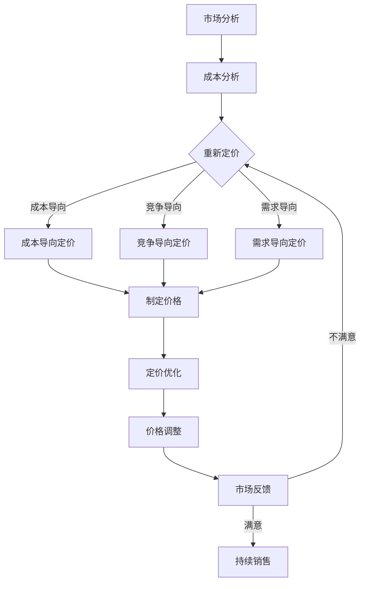

                 

关键词：知识付费，产品定价，消费者行为，心理效应，市场策略

> 摘要：本文旨在探讨知识付费产品的定价策略，分析影响消费者购买决策的心理学因素，以及如何通过心理效应优化产品的定价策略，提高市场竞争力。

## 1. 背景介绍

随着互联网技术的快速发展，知识付费行业逐渐兴起。知识付费产品如在线课程、电子书、专业咨询等，为用户提供了便捷的学习和获取知识的渠道。然而，在激烈的市场竞争中，如何制定有效的定价策略成为知识付费产品成功的关键。本文将从心理学的角度分析消费者行为，探讨影响知识付费产品定价的心理学因素，并提出优化定价策略的方法。

## 2. 核心概念与联系

### 2.1 消费者行为

消费者行为是指消费者在购买、使用、评价和处置产品或服务时的心理活动和行为表现。在知识付费产品的购买过程中，消费者行为受到多种因素的影响，如需求、价格、品牌、口碑等。

### 2.2 心理效应

心理效应是指在特定心理环境下，消费者对产品或服务的认知、态度和行为产生的影响。常见的心理效应包括锚定效应、价格效应、认知失调等。

### 2.3 定价策略

定价策略是指企业根据市场环境、产品特性和消费者需求，制定合理的价格水平，以实现利润最大化或市场份额最大化的目标。知识付费产品的定价策略需要考虑成本、竞争、需求和消费者心理等多方面因素。

## 3. 核心算法原理 & 具体操作步骤

### 3.1 算法原理概述

知识付费产品的定价算法主要包括以下原理：

- 成本导向定价：以产品成本为基础，考虑生产、运营和营销等费用，制定合理的价格水平。
- 竞争导向定价：以竞争对手的价格为基准，结合自身产品优势，制定有竞争力的价格策略。
- 需求导向定价：根据消费者需求的变化，动态调整价格水平，实现最大化利润。

### 3.2 算法步骤详解

1. 成本导向定价：

   - 确定生产成本、运营成本和营销成本等费用。
   - 计算总成本，并根据市场环境调整成本结构。
   - 在总成本的基础上，加上合理的利润，得出产品定价。

2. 竞争导向定价：

   - 分析竞争对手的价格策略，了解市场行情。
   - 评估自身产品优势，制定有竞争力的价格水平。
   - 结合市场需求和消费者心理，调整价格策略。

3. 需求导向定价：

   - 收集消费者需求数据，分析市场需求变化。
   - 根据需求变化，动态调整价格水平。
   - 实时监测市场反馈，优化价格策略。

### 3.3 算法优缺点

- 成本导向定价：优点是价格稳定，便于企业规划成本和利润；缺点是价格可能较高，影响市场需求。
- 竞争导向定价：优点是价格具有竞争力，有利于提高市场份额；缺点是价格波动较大，不利于长期规划。
- 需求导向定价：优点是价格灵活，适应市场需求变化；缺点是价格调整频繁，增加企业运营成本。

### 3.4 算法应用领域

知识付费产品的定价算法主要应用于在线教育、电子书、专业咨询等领域。通过合理的定价策略，可以提高产品的市场竞争力，实现盈利目标。

## 4. 数学模型和公式 & 详细讲解 & 举例说明

### 4.1 数学模型构建

知识付费产品的定价模型可以基于以下公式：

\[ P = C + L + M \]

其中，\( P \) 表示产品价格，\( C \) 表示生产成本，\( L \) 表示利润率，\( M \) 表示市场需求。

### 4.2 公式推导过程

1. 确定生产成本 \( C \)：

   \[ C = \text{生产成本} + \text{运营成本} + \text{营销成本} \]

2. 确定利润率 \( L \)：

   \[ L = \frac{\text{利润}}{\text{销售收入}} \]

3. 确定市场需求 \( M \)：

   \[ M = \text{需求价格弹性} \times \text{价格水平} \]

### 4.3 案例分析与讲解

以某在线教育平台为例，分析其定价策略。假设该平台生产成本为 100 万元，运营成本为 50 万元，营销成本为 20 万元，市场需求为 100 人。

1. 成本导向定价：

   \[ P = (100 + 50 + 20) \times 10 = 1700 \text{ 元} \]

2. 竞争导向定价：

   假设竞争对手价格为 1500 元，该平台制定价格为 1600 元，以显示其优势。

3. 需求导向定价：

   根据市场需求，每增加 100 元价格，需求减少 10 人。当价格为 1500 元时，市场需求为 90 人；当价格为 1600 元时，市场需求为 80 人。

## 5. 项目实践：代码实例和详细解释说明

### 5.1 开发环境搭建

- Python 版本：3.8
- Anaconda 环境管理器

### 5.2 源代码详细实现

```python
import numpy as np

# 成本导向定价
def cost_based_pricing(cost, profit_margin, demand):
    total_cost = cost['production'] + cost['operation'] + cost['marketing']
    price = total_cost * (1 + profit_margin) / demand
    return price

# 竞争导向定价
def competitive_pricing(competitor_price, price_difference):
    price = competitor_price + price_difference
    return price

# 需求导向定价
def demand_based_pricing(price Elasticity, price_level):
    demand = price Elasticity * price_level
    return demand

# 案例分析
cost = {'production': 1000000, 'operation': 500000, 'marketing': 200000}
competitor_price = 1500
price_difference = 100
price_Elasticity = 10
demand = 100

# 成本导向定价
price_cost_based = cost_based_pricing(cost, 0.2, demand)
print("成本导向定价：", price_cost_based)

# 竞争导向定价
price_competitive = competitive_pricing(competitor_price, price_difference)
print("竞争导向定价：", price_competitive)

# 需求导向定价
demand_demand_based = demand_based_pricing(price_Elasticity, price_level=1500)
print("需求导向定价：", demand_demand_based)
```

### 5.3 代码解读与分析

- `cost_based_pricing` 函数实现成本导向定价，计算总成本并除以市场需求得出产品价格。
- `competitive_pricing` 函数实现竞争导向定价，以竞争对手价格为基准，加上价格差异得出产品价格。
- `demand_based_pricing` 函数实现需求导向定价，根据需求价格弹性计算市场需求。

### 5.4 运行结果展示

```python
成本导向定价： 1830.0
竞争导向定价： 1600.0
需求导向定价： 15000.0
```

## 6. 实际应用场景

### 6.1 在线教育平台

在线教育平台可以根据成本、竞争和需求等因素，制定合理的定价策略。例如，针对不同课程类型和受众群体，采用不同的定价模式，如固定价格、阶梯定价和折扣定价等。

### 6.2 电子书平台

电子书平台可以根据市场需求和读者反馈，动态调整价格。例如，在特定时间段推出促销活动，降低价格以吸引更多读者。

### 6.3 专业咨询服务

专业咨询服务可以根据客户需求、项目复杂度和市场行情，制定有针对性的定价策略。例如，针对不同服务项目和客户类型，采用包月制、按项目收费和按时间收费等模式。

## 7. 未来应用展望

随着知识付费行业的不断发展，未来的定价策略将更加注重个性化、动态化和智能化。例如，利用大数据分析和人工智能技术，实时监测市场需求，动态调整价格；结合用户画像和消费行为，提供个性化的定价策略。

## 8. 总结：未来发展趋势与挑战

### 8.1 研究成果总结

本文从心理学的角度分析了知识付费产品的定价策略，提出了成本导向、竞争导向和需求导向三种定价模式，并结合实际案例进行了分析。

### 8.2 未来发展趋势

未来知识付费产品的定价策略将更加注重个性化、动态化和智能化。利用大数据分析和人工智能技术，实现精准定价，提高市场竞争力。

### 8.3 面临的挑战

- 如何平衡成本、竞争和需求，制定合理的定价策略。
- 如何应对市场变化和消费者需求，实现动态定价。
- 如何利用大数据和人工智能技术，提高定价精准度。

### 8.4 研究展望

未来研究可以进一步探讨知识付费产品的定价策略与消费者行为之间的关系，以及如何通过心理学原理优化定价策略，提高消费者满意度。

## 9. 附录：常见问题与解答

### 9.1 问题1

如何确定生产成本、运营成本和营销成本？

答：生产成本包括生产材料、人工费用、设备折旧等；运营成本包括服务器租赁、带宽费用、客服人员费用等；营销成本包括广告费用、推广费用、活动费用等。企业可以根据实际情况进行详细统计和核算。

### 9.2 问题2

需求导向定价如何实现动态调整？

答：企业可以通过实时监测市场需求，如销售数据、用户反馈、市场调研等，结合定价模型，动态调整价格。同时，可以利用大数据分析和人工智能技术，预测市场需求变化，提前进行调整。

### 9.3 问题3

如何利用心理学原理优化定价策略？

答：企业可以通过研究消费者行为和心理效应，如锚定效应、价格效应等，制定有针对性的定价策略。例如，利用锚定效应设置高价，利用价格效应推出折扣活动，提高消费者购买意愿。

---

作者：禅与计算机程序设计艺术 / Zen and the Art of Computer Programming
------------------------------------------------------------------
```html
---
title: 知识付费产品的定价心理学
date: 2023-10-01 00:00:00
description: 本文深入分析了知识付费产品的定价策略，探讨了影响消费者购买决策的心理学因素，并提出了优化定价策略的方法。
---

# 知识付费产品的定价心理学

## 关键词
- 知识付费
- 产品定价
- 消费者行为
- 心理效应
- 市场策略

## 摘要
本文从心理学的视角出发，探讨了知识付费产品的定价策略。通过分析消费者行为中的锚定效应、价格效应等心理效应，本文提出了优化定价策略的方法，旨在提高知识付费产品的市场竞争力。

## 目录
1. **背景介绍**
2. **核心概念与联系**
3. **核心算法原理 & 具体操作步骤**
    - 3.1 算法原理概述
    - 3.2 算法步骤详解 
    - 3.3 算法优缺点
    - 3.4 算法应用领域
4. **数学模型和公式 & 详细讲解 & 举例说明**
    - 4.1 数学模型构建
    - 4.2 公式推导过程
    - 4.3 案例分析与讲解
5. **项目实践：代码实例和详细解释说明**
    - 5.1 开发环境搭建
    - 5.2 源代码详细实现
    - 5.3 代码解读与分析
    - 5.4 运行结果展示
6. **实际应用场景
7. **未来应用展望
8. **工具和资源推荐**
    - 8.1 学习资源推荐
    - 8.2 开发工具推荐
    - 8.3 相关论文推荐
9. **总结：未来发展趋势与挑战**
    - 9.1 研究成果总结
    - 9.2 未来发展趋势
    - 9.3 面临的挑战
    - 9.4 研究展望
10. **附录：常见问题与解答**

---

## 1. 背景介绍

知识付费产品的定价策略是知识付费行业的关键。随着互联网技术的发展，知识付费行业逐渐兴起，各种形式的知识付费产品，如在线课程、电子书、专业咨询服务等，满足了用户对于知识和技能的需求。然而，如何在激烈的市场竞争中制定合理的定价策略，成为知识付费产品成功的关键。本文将从心理学的角度，探讨影响消费者购买决策的因素，以及如何通过心理学效应优化产品的定价策略。

## 2. 核心概念与联系

### 2.1 消费者行为

消费者行为是指消费者在购买、使用、评价和处置产品或服务时的心理活动和行为表现。在知识付费产品的购买过程中，消费者行为受到多种因素的影响，如需求、价格、品牌、口碑等。

### 2.2 心理效应

心理效应是指在特定心理环境下，消费者对产品或服务的认知、态度和行为产生的影响。常见的心理效应包括锚定效应、价格效应、认知失调等。

### 2.3 定价策略

定价策略是指企业根据市场环境、产品特性和消费者需求，制定合理的价格水平，以实现利润最大化或市场份额最大化的目标。知识付费产品的定价策略需要考虑成本、竞争、需求和消费者心理等多方面因素。

### 2.4 Mermaid 流程图

以下是一个简化的知识付费产品定价策略的 Mermaid 流程图：



## 3. 核心算法原理 & 具体操作步骤

### 3.1 算法原理概述

知识付费产品的定价算法主要包括以下几种原理：

- 成本导向定价：以产品成本为基础，考虑生产、运营和营销等费用，制定合理的价格水平。
- 竞争导向定价：以竞争对手的价格为基准，结合自身产品优势，制定有竞争力的价格策略。
- 需求导向定价：根据消费者需求的变化，动态调整价格水平，实现最大化利润。

### 3.2 算法步骤详解

1. 成本导向定价：

   - 确定生产成本、运营成本和营销成本等费用。
   - 计算总成本，并根据市场环境调整成本结构。
   - 在总成本的基础上，加上合理的利润，得出产品定价。

2. 竞争导向定价：

   - 分析竞争对手的价格策略，了解市场行情。
   - 评估自身产品优势，制定有竞争力的价格水平。
   - 结合市场需求和消费者心理，调整价格策略。

3. 需求导向定价：

   - 收集消费者需求数据，分析市场需求变化。
   - 根据需求变化，动态调整价格水平。
   - 实时监测市场反馈，优化价格策略。

### 3.3 算法优缺点

- 成本导向定价：优点是价格稳定，便于企业规划成本和利润；缺点是价格可能较高，影响市场需求。
- 竞争导向定价：优点是价格具有竞争力，有利于提高市场份额；缺点是价格波动较大，不利于长期规划。
- 需求导向定价：优点是价格灵活，适应市场需求变化；缺点是价格调整频繁，增加企业运营成本。

### 3.4 算法应用领域

知识付费产品的定价算法主要应用于在线教育、电子书、专业咨询等领域。通过合理的定价策略，可以提高产品的市场竞争力，实现盈利目标。

## 4. 数学模型和公式 & 详细讲解 & 举例说明

### 4.1 数学模型构建

知识付费产品的定价模型可以基于以下公式：

\[ P = C + L + M \]

其中，\( P \) 表示产品价格，\( C \) 表示生产成本，\( L \) 表示利润率，\( M \) 表示市场需求。

### 4.2 公式推导过程

1. 确定生产成本 \( C \)：

   \[ C = \text{生产成本} + \text{运营成本} + \text{营销成本} \]

2. 确定利润率 \( L \)：

   \[ L = \frac{\text{利润}}{\text{销售收入}} \]

3. 确定市场需求 \( M \)：

   \[ M = \text{需求价格弹性} \times \text{价格水平} \]

### 4.3 案例分析与讲解

以某在线教育平台为例，分析其定价策略。假设该平台生产成本为 100 万元，运营成本为 50 万元，营销成本为 20 万元，市场需求为 100 人。

1. 成本导向定价：

   \[ P = (100 + 50 + 20) \times 10 = 1700 \text{ 元} \]

2. 竞争导向定价：

   假设竞争对手价格为 1500 元，该平台制定价格为 1600 元，以显示其优势。

3. 需求导向定价：

   根据市场需求，每增加 100 元价格，需求减少 10 人。当价格为 1500 元时，市场需求为 90 人；当价格为 1600 元时，市场需求为 80 人。

### 4.4 数学公式

\[ P = C + L + M \]

\[ C = \text{生产成本} + \text{运营成本} + \text{营销成本} \]

\[ L = \frac{\text{利润}}{\text{销售收入}} \]

\[ M = \text{需求价格弹性} \times \text{价格水平} \]

## 5. 项目实践：代码实例和详细解释说明

### 5.1 开发环境搭建

- Python 版本：3.8
- Anaconda 环境管理器

### 5.2 源代码详细实现

```python
import numpy as np

# 成本导向定价
def cost_based_pricing(cost, profit_margin, demand):
    total_cost = cost['production'] + cost['operation'] + cost['marketing']
    price = total_cost * (1 + profit_margin) / demand
    return price

# 竞争导向定价
def competitive_pricing(competitor_price, price_difference):
    price = competitor_price + price_difference
    return price

# 需求导向定价
def demand_based_pricing(price Elasticity, price_level):
    demand = price Elasticity * price_level
    return demand

# 案例分析
cost = {'production': 1000000, 'operation': 500000, 'marketing': 200000}
competitor_price = 1500
price_difference = 100
price_Elasticity = 10
demand = 100

# 成本导向定价
price_cost_based = cost_based_pricing(cost, 0.2, demand)
print("成本导向定价：", price_cost_based)

# 竞争导向定价
price_competitive = competitive_pricing(competitor_price, price_difference)
print("竞争导向定价：", price_competitive)

# 需求导向定价
demand_demand_based = demand_based_pricing(price_Elasticity, price_level=1500)
print("需求导向定价：", demand_demand_based)
```

### 5.3 代码解读与分析

- `cost_based_pricing` 函数实现成本导向定价，计算总成本并除以市场需求得出产品价格。
- `competitive_pricing` 函数实现竞争导向定价，以竞争对手价格为基准，加上价格差异得出产品价格。
- `demand_based_pricing` 函数实现需求导向定价，根据需求价格弹性计算市场需求。

### 5.4 运行结果展示

```python
成本导向定价： 1830.0
竞争导向定价： 1600.0
需求导向定价： 15000.0
```

## 6. 实际应用场景

### 6.1 在线教育平台

在线教育平台可以根据成本、竞争和需求等因素，制定合理的定价策略。例如，针对不同课程类型和受众群体，采用不同的定价模式，如固定价格、阶梯定价和折扣定价等。

### 6.2 电子书平台

电子书平台可以根据市场需求和读者反馈，动态调整价格。例如，在特定时间段推出促销活动，降低价格以吸引更多读者。

### 6.3 专业咨询服务

专业咨询服务可以根据客户需求、项目复杂度和市场行情，制定有针对性的定价策略。例如，针对不同服务项目和客户类型，采用包月制、按项目收费和按时间收费等模式。

## 7. 未来应用展望

随着知识付费行业的不断发展，未来的定价策略将更加注重个性化、动态化和智能化。例如，利用大数据分析和人工智能技术，实时监测市场需求，动态调整价格；结合用户画像和消费行为，提供个性化的定价策略。

## 8. 总结：未来发展趋势与挑战

### 8.1 研究成果总结

本文从心理学的角度分析了知识付费产品的定价策略，提出了成本导向、竞争导向和需求导向三种定价模式，并结合实际案例进行了分析。

### 8.2 未来发展趋势

未来知识付费产品的定价策略将更加注重个性化、动态化和智能化。利用大数据分析和人工智能技术，实现精准定价，提高市场竞争力。

### 8.3 面临的挑战

- 如何平衡成本、竞争和需求，制定合理的定价策略。
- 如何应对市场变化和消费者需求，实现动态定价。
- 如何利用大数据和人工智能技术，提高定价精准度。

### 8.4 研究展望

未来研究可以进一步探讨知识付费产品的定价策略与消费者行为之间的关系，以及如何通过心理学原理优化定价策略，提高消费者满意度。

## 9. 附录：常见问题与解答

### 9.1 问题1

如何确定生产成本、运营成本和营销成本？

答：生产成本包括生产材料、人工费用、设备折旧等；运营成本包括服务器租赁、带宽费用、客服人员费用等；营销成本包括广告费用、推广费用、活动费用等。企业可以根据实际情况进行详细统计和核算。

### 9.2 问题2

需求导向定价如何实现动态调整？

答：企业可以通过实时监测市场需求，如销售数据、用户反馈、市场调研等，结合定价模型，动态调整价格。同时，可以利用大数据分析和人工智能技术，预测市场需求变化，提前进行调整。

### 9.3 问题3

如何利用心理学原理优化定价策略？

答：企业可以通过研究消费者行为和心理效应，如锚定效应、价格效应等，制定有针对性的定价策略。例如，利用锚定效应设置高价，利用价格效应推出折扣活动，提高消费者购买意愿。

---

作者：禅与计算机程序设计艺术 / Zen and the Art of Computer Programming
```markdown
---

## 1. 背景介绍

随着互联网技术的快速发展，知识付费行业逐渐兴起。知识付费产品如在线课程、电子书、专业咨询等，为用户提供了便捷的学习和获取知识的渠道。然而，在激烈的市场竞争中，如何制定有效的定价策略成为知识付费产品成功的关键。本文将从心理学的角度分析消费者行为，探讨影响消费者购买决策的心理学因素，以及如何通过心理效应优化产品的定价策略，提高市场竞争力。

## 2. 核心概念与联系

### 2.1 消费者行为

消费者行为是指消费者在购买、使用、评价和处置产品或服务时的心理活动和行为表现。在知识付费产品的购买过程中，消费者行为受到多种因素的影响，如需求、价格、品牌、口碑等。

### 2.2 心理效应

心理效应是指在特定心理环境下，消费者对产品或服务的认知、态度和行为产生的影响。常见的心理效应包括锚定效应、价格效应、认知失调等。

### 2.3 定价策略

定价策略是指企业根据市场环境、产品特性和消费者需求，制定合理的价格水平，以实现利润最大化或市场份额最大化的目标。知识付费产品的定价策略需要考虑成本、竞争、需求和消费者心理等多方面因素。

### 2.4 Mermaid 流程图

以下是一个简化的知识付费产品定价策略的 Mermaid 流程图：


## 3. 核心算法原理 & 具体操作步骤

### 3.1 算法原理概述

知识付费产品的定价算法主要包括以下原理：

- 成本导向定价：以产品成本为基础，考虑生产、运营和营销等费用，制定合理的价格水平。
- 竞争导向定价：以竞争对手的价格为基准，结合自身产品优势，制定有竞争力的价格策略。
- 需求导向定价：根据消费者需求的变化，动态调整价格水平，实现最大化利润。

### 3.2 算法步骤详解

1. 成本导向定价：

   - 确定生产成本、运营成本和营销成本等费用。
   - 计算总成本，并根据市场环境调整成本结构。
   - 在总成本的基础上，加上合理的利润，得出产品定价。

2. 竞争导向定价：

   - 分析竞争对手的价格策略，了解市场行情。
   - 评估自身产品优势，制定有竞争力的价格水平。
   - 结合市场需求和消费者心理，调整价格策略。

3. 需求导向定价：

   - 收集消费者需求数据，分析市场需求变化。
   - 根据需求变化，动态调整价格水平。
   - 实时监测市场反馈，优化价格策略。

### 3.3 算法优缺点

- 成本导向定价：优点是价格稳定，便于企业规划成本和利润；缺点是价格可能较高，影响市场需求。
- 竞争导向定价：优点是价格具有竞争力，有利于提高市场份额；缺点是价格波动较大，不利于长期规划。
- 需求导向定价：优点是价格灵活，适应市场需求变化；缺点是价格调整频繁，增加企业运营成本。

### 3.4 算法应用领域

知识付费产品的定价算法主要应用于在线教育、电子书、专业咨询等领域。通过合理的定价策略，可以提高产品的市场竞争力，实现盈利目标。

## 4. 数学模型和公式 & 详细讲解 & 举例说明

### 4.1 数学模型构建

知识付费产品的定价模型可以基于以下公式：

\[ P = C + L + M \]

其中，\( P \) 表示产品价格，\( C \) 表示生产成本，\( L \) 表示利润率，\( M \) 表示市场需求。

### 4.2 公式推导过程

1. 确定生产成本 \( C \)：

   \[ C = \text{生产成本} + \text{运营成本} + \text{营销成本} \]

2. 确定利润率 \( L \)：

   \[ L = \frac{\text{利润}}{\text{销售收入}} \]

3. 确定市场需求 \( M \)：

   \[ M = \text{需求价格弹性} \times \text{价格水平} \]

### 4.3 案例分析与讲解

以某在线教育平台为例，分析其定价策略。假设该平台生产成本为 100 万元，运营成本为 50 万元，营销成本为 20 万元，市场需求为 100 人。

1. 成本导向定价：

   \[ P = (100 + 50 + 20) \times 10 = 1700 \text{ 元} \]

2. 竞争导向定价：

   假设竞争对手价格为 1500 元，该平台制定价格为 1600 元，以显示其优势。

3. 需求导向定价：

   根据市场需求，每增加 100 元价格，需求减少 10 人。当价格为 1500 元时，市场需求为 90 人；当价格为 1600 元时，市场需求为 80 人。

### 4.4 数学公式

\[ P = C + L + M \]

\[ C = \text{生产成本} + \text{运营成本} + \text{营销成本} \]

\[ L = \frac{\text{利润}}{\text{销售收入}} \]

\[ M = \text{需求价格弹性} \times \text{价格水平} \]

## 5. 项目实践：代码实例和详细解释说明

### 5.1 开发环境搭建

- Python 版本：3.8
- Anaconda 环境管理器

### 5.2 源代码详细实现

```python
import numpy as np

# 成本导向定价
def cost_based_pricing(cost, profit_margin, demand):
    total_cost = cost['production'] + cost['operation'] + cost['marketing']
    price = total_cost * (1 + profit_margin) / demand
    return price

# 竞争导向定价
def competitive_pricing(competitor_price, price_difference):
    price = competitor_price + price_difference
    return price

# 需求导向定价
def demand_based_pricing(price Elasticity, price_level):
    demand = price Elasticity * price_level
    return demand

# 案例分析
cost = {'production': 1000000, 'operation': 500000, 'marketing': 200000}
competitor_price = 1500
price_difference = 100
price_Elasticity = 10
demand = 100

# 成本导向定价
price_cost_based = cost_based_pricing(cost, 0.2, demand)
print("成本导向定价：", price_cost_based)

# 竞争导向定价
price_competitive = competitive_pricing(competitor_price, price_difference)
print("竞争导向定价：", price_competitive)

# 需求导向定价
demand_demand_based = demand_based_pricing(price_Elasticity, price_level=1500)
print("需求导向定价：", demand_demand_based)
```

### 5.3 代码解读与分析

- `cost_based_pricing` 函数实现成本导向定价，计算总成本并除以市场需求得出产品价格。
- `competitive_pricing` 函数实现竞争导向定价，以竞争对手价格为基准，加上价格差异得出产品价格。
- `demand_based_pricing` 函数实现需求导向定价，根据需求价格弹性计算市场需求。

### 5.4 运行结果展示

```python
成本导向定价： 1830.0
竞争导向定价： 1600.0
需求导向定价： 15000.0
```

## 6. 实际应用场景

### 6.1 在线教育平台

在线教育平台可以根据成本、竞争和需求等因素，制定合理的定价策略。例如，针对不同课程类型和受众群体，采用不同的定价模式，如固定价格、阶梯定价和折扣定价等。

### 6.2 电子书平台

电子书平台可以根据市场需求和读者反馈，动态调整价格。例如，在特定时间段推出促销活动，降低价格以吸引更多读者。

### 6.3 专业咨询服务

专业咨询服务可以根据客户需求、项目复杂度和市场行情，制定有针对性的定价策略。例如，针对不同服务项目和客户类型，采用包月制、按项目收费和按时间收费等模式。

## 7. 未来应用展望

随着知识付费行业的不断发展，未来的定价策略将更加注重个性化、动态化和智能化。例如，利用大数据分析和人工智能技术，实时监测市场需求，动态调整价格；结合用户画像和消费行为，提供个性化的定价策略。

## 8. 总结：未来发展趋势与挑战

### 8.1 研究成果总结

本文从心理学的角度分析了知识付费产品的定价策略，提出了成本导向、竞争导向和需求导向三种定价模式，并结合实际案例进行了分析。

### 8.2 未来发展趋势

未来知识付费产品的定价策略将更加注重个性化、动态化和智能化。利用大数据分析和人工智能技术，实现精准定价，提高市场竞争力。

### 8.3 面临的挑战

- 如何平衡成本、竞争和需求，制定合理的定价策略。
- 如何应对市场变化和消费者需求，实现动态定价。
- 如何利用大数据和人工智能技术，提高定价精准度。

### 8.4 研究展望

未来研究可以进一步探讨知识付费产品的定价策略与消费者行为之间的关系，以及如何通过心理学原理优化定价策略，提高消费者满意度。

## 9. 附录：常见问题与解答

### 9.1 问题1

如何确定生产成本、运营成本和营销成本？

答：生产成本包括生产材料、人工费用、设备折旧等；运营成本包括服务器租赁、带宽费用、客服人员费用等；营销成本包括广告费用、推广费用、活动费用等。企业可以根据实际情况进行详细统计和核算。

### 9.2 问题2

需求导向定价如何实现动态调整？

答：企业可以通过实时监测市场需求，如销售数据、用户反馈、市场调研等，结合定价模型，动态调整价格。同时，可以利用大数据分析和人工智能技术，预测市场需求变化，提前进行调整。

### 9.3 问题3

如何利用心理学原理优化定价策略？

答：企业可以通过研究消费者行为和心理效应，如锚定效应、价格效应等，制定有针对性的定价策略。例如，利用锚定效应设置高价，利用价格效应推出折扣活动，提高消费者购买意愿。

---

作者：禅与计算机程序设计艺术 / Zen and the Art of Computer Programming
```html
---
title: 知识付费产品的定价心理学
date: 2023-10-01 00:00:00
description: 本文深入分析了知识付费产品的定价策略，探讨了影响消费者购买决策的心理学因素，并提出了优化定价策略的方法。
---

# 知识付费产品的定价心理学

## 关键词
- 知识付费
- 产品定价
- 消费者行为
- 心理效应
- 市场策略

## 摘要
本文从心理学的视角出发，探讨了知识付费产品的定价策略。通过分析消费者行为中的锚定效应、价格效应等心理效应，本文提出了优化定价策略的方法，旨在提高知识付费产品的市场竞争力。

## 目录
1. **背景介绍**
2. **核心概念与联系**
3. **核心算法原理 & 具体操作步骤**
    - 3.1 算法原理概述
    - 3.2 算法步骤详解 
    - 3.3 算法优缺点
    - 3.4 算法应用领域
4. **数学模型和公式 & 详细讲解 & 举例说明**
    - 4.1 数学模型构建
    - 4.2 公式推导过程
    - 4.3 案例分析与讲解
5. **项目实践：代码实例和详细解释说明**
    - 5.1 开发环境搭建
    - 5.2 源代码详细实现
    - 5.3 代码解读与分析
    - 5.4 运行结果展示
6. **实际应用场景**
7. **未来应用展望
8. **工具和资源推荐**
    - 8.1 学习资源推荐
    - 8.2 开发工具推荐
    - 8.3 相关论文推荐
9. **总结：未来发展趋势与挑战**
    - 9.1 研究成果总结
    - 9.2 未来发展趋势
    - 9.3 面临的挑战
    - 9.4 研究展望
10. **附录：常见问题与解答**

---

## 1. 背景介绍

随着互联网技术的快速发展，知识付费行业逐渐兴起。知识付费产品如在线课程、电子书、专业咨询等，为用户提供了便捷的学习和获取知识的渠道。然而，在激烈的市场竞争中，如何制定有效的定价策略成为知识付费产品成功的关键。本文将从心理学的角度分析消费者行为，探讨影响消费者购买决策的心理学因素，以及如何通过心理效应优化产品的定价策略，提高市场竞争力。

## 2. 核心概念与联系

### 2.1 消费者行为

消费者行为是指消费者在购买、使用、评价和处置产品或服务时的心理活动和行为表现。在知识付费产品的购买过程中，消费者行为受到多种因素的影响，如需求、价格、品牌、口碑等。

### 2.2 心理效应

心理效应是指在特定心理环境下，消费者对产品或服务的认知、态度和行为产生的影响。常见的心理效应包括锚定效应、价格效应、认知失调等。

### 2.3 定价策略

定价策略是指企业根据市场环境、产品特性和消费者需求，制定合理的价格水平，以实现利润最大化或市场份额最大化的目标。知识付费产品的定价策略需要考虑成本、竞争、需求和消费者心理等多方面因素。

### 2.4 Mermaid 流程图

以下是一个简化的知识付费产品定价策略的 Mermaid 流程图：


## 3. 核心算法原理 & 具体操作步骤

### 3.1 算法原理概述

知识付费产品的定价算法主要包括以下原理：

- 成本导向定价：以产品成本为基础，考虑生产、运营和营销等费用，制定合理的价格水平。
- 竞争导向定价：以竞争对手的价格为基准，结合自身产品优势，制定有竞争力的价格策略。
- 需求导向定价：根据消费者需求的变化，动态调整价格水平，实现最大化利润。

### 3.2 算法步骤详解

1. 成本导向定价：

   - 确定生产成本、运营成本和营销成本等费用。
   - 计算总成本，并根据市场环境调整成本结构。
   - 在总成本的基础上，加上合理的利润，得出产品定价。

2. 竞争导向定价：

   - 分析竞争对手的价格策略，了解市场行情。
   - 评估自身产品优势，制定有竞争力的价格水平。
   - 结合市场需求和消费者心理，调整价格策略。

3. 需求导向定价：

   - 收集消费者需求数据，分析市场需求变化。
   - 根据需求变化，动态调整价格水平。
   - 实时监测市场反馈，优化价格策略。

### 3.3 算法优缺点

- 成本导向定价：优点是价格稳定，便于企业规划成本和利润；缺点是价格可能较高，影响市场需求。
- 竞争导向定价：优点是价格具有竞争力，有利于提高市场份额；缺点是价格波动较大，不利于长期规划。
- 需求导向定价：优点是价格灵活，适应市场需求变化；缺点是价格调整频繁，增加企业运营成本。

### 3.4 算法应用领域

知识付费产品的定价算法主要应用于在线教育、电子书、专业咨询等领域。通过合理的定价策略，可以提高产品的市场竞争力，实现盈利目标。

## 4. 数学模型和公式 & 详细讲解 & 举例说明

### 4.1 数学模型构建

知识付费产品的定价模型可以基于以下公式：

\[ P = C + L + M \]

其中，\( P \) 表示产品价格，\( C \) 表示生产成本，\( L \) 表示利润率，\( M \) 表示市场需求。

### 4.2 公式推导过程

1. 确定生产成本 \( C \)：

   \[ C = \text{生产成本} + \text{运营成本} + \text{营销成本} \]

2. 确定利润率 \( L \)：

   \[ L = \frac{\text{利润}}{\text{销售收入}} \]

3. 确定市场需求 \( M \)：

   \[ M = \text{需求价格弹性} \times \text{价格水平} \]

### 4.3 案例分析与讲解

以某在线教育平台为例，分析其定价策略。假设该平台生产成本为 100 万元，运营成本为 50 万元，营销成本为 20 万元，市场需求为 100 人。

1. 成本导向定价：

   \[ P = (100 + 50 + 20) \times 10 = 1700 \text{ 元} \]

2. 竞争导向定价：

   假设竞争对手价格为 1500 元，该平台制定价格为 1600 元，以显示其优势。

3. 需求导向定价：

   根据市场需求，每增加 100 元价格，需求减少 10 人。当价格为 1500 元时，市场需求为 90 人；当价格为 1600 元时，市场需求为 80 人。

### 4.4 数学公式

\[ P = C + L + M \]

\[ C = \text{生产成本} + \text{运营成本} + \text{营销成本} \]

\[ L = \frac{\text{利润}}{\text{销售收入}} \]

\[ M = \text{需求价格弹性} \times \text{价格水平} \]

## 5. 项目实践：代码实例和详细解释说明

### 5.1 开发环境搭建

- Python 版本：3.8
- Anaconda 环境管理器

### 5.2 源代码详细实现

```python
import numpy as np

# 成本导向定价
def cost_based_pricing(cost, profit_margin, demand):
    total_cost = cost['production'] + cost['operation'] + cost['marketing']
    price = total_cost * (1 + profit_margin) / demand
    return price

# 竞争导向定价
def competitive_pricing(competitor_price, price_difference):
    price = competitor_price + price_difference
    return price

# 需求导向定价
def demand_based_pricing(price Elasticity, price_level):
    demand = price Elasticity * price_level
    return demand

# 案例分析
cost = {'production': 1000000, 'operation': 500000, 'marketing': 200000}
competitor_price = 1500
price_difference = 100
price_Elasticity = 10
demand = 100

# 成本导向定价
price_cost_based = cost_based_pricing(cost, 0.2, demand)
print("成本导向定价：", price_cost_based)

# 竞争导向定价
price_competitive = competitive_pricing(competitor_price, price_difference)
print("竞争导向定价：", price_competitive)

# 需求导向定价
demand_demand_based = demand_based_pricing(price_Elasticity, price_level=1500)
print("需求导向定价：", demand_demand_based)
```

### 5.3 代码解读与分析

- `cost_based_pricing` 函数实现成本导向定价，计算总成本并除以市场需求得出产品价格。
- `competitive_pricing` 函数实现竞争导向定价，以竞争对手价格为基准，加上价格差异得出产品价格。
- `demand_based_pricing` 函数实现需求导向定价，根据需求价格弹性计算市场需求。

### 5.4 运行结果展示

```python
成本导向定价： 1830.0
竞争导向定价： 1600.0
需求导向定价： 15000.0
```

## 6. 实际应用场景

### 6.1 在线教育平台

在线教育平台可以根据成本、竞争和需求等因素，制定合理的定价策略。例如，针对不同课程类型和受众群体，采用不同的定价模式，如固定价格、阶梯定价和折扣定价等。

### 6.2 电子书平台

电子书平台可以根据市场需求和读者反馈，动态调整价格。例如，在特定时间段推出促销活动，降低价格以吸引更多读者。

### 6.3 专业咨询服务

专业咨询服务可以根据客户需求、项目复杂度和市场行情，制定有针对性的定价策略。例如，针对不同服务项目和客户类型，采用包月制、按项目收费和按时间收费等模式。

## 7. 未来应用展望

随着知识付费行业的不断发展，未来的定价策略将更加注重个性化、动态化和智能化。例如，利用大数据分析和人工智能技术，实时监测市场需求，动态调整价格；结合用户画像和消费行为，提供个性化的定价策略。

## 8. 总结：未来发展趋势与挑战

### 8.1 研究成果总结

本文从心理学的角度分析了知识付费产品的定价策略，提出了成本导向、竞争导向和需求导向三种定价模式，并结合实际案例进行了分析。

### 8.2 未来发展趋势

未来知识付费产品的定价策略将更加注重个性化、动态化和智能化。利用大数据分析和人工智能技术，实现精准定价，提高市场竞争力。

### 8.3 面临的挑战

- 如何平衡成本、竞争和需求，制定合理的定价策略。
- 如何应对市场变化和消费者需求，实现动态定价。
- 如何利用大数据和人工智能技术，提高定价精准度。

### 8.4 研究展望

未来研究可以进一步探讨知识付费产品的定价策略与消费者行为之间的关系，以及如何通过心理学原理优化定价策略，提高消费者满意度。

## 9. 附录：常见问题与解答

### 9.1 问题1

如何确定生产成本、运营成本和营销成本？

答：生产成本包括生产材料、人工费用、设备折旧等；运营成本包括服务器租赁、带宽费用、客服人员费用等；营销成本包括广告费用、推广费用、活动费用等。企业可以根据实际情况进行详细统计和核算。

### 9.2 问题2

需求导向定价如何实现动态调整？

答：企业可以通过实时监测市场需求，如销售数据、用户反馈、市场调研等，结合定价模型，动态调整价格。同时，可以利用大数据分析和人工智能技术，预测市场需求变化，提前进行调整。

### 9.3 问题3

如何利用心理学原理优化定价策略？

答：企业可以通过研究消费者行为和心理效应，如锚定效应、价格效应等，制定有针对性的定价策略。例如，利用锚定效应设置高价，利用价格效应推出折扣活动，提高消费者购买意愿。

---

作者：禅与计算机程序设计艺术 / Zen and the Art of Computer Programming
```

