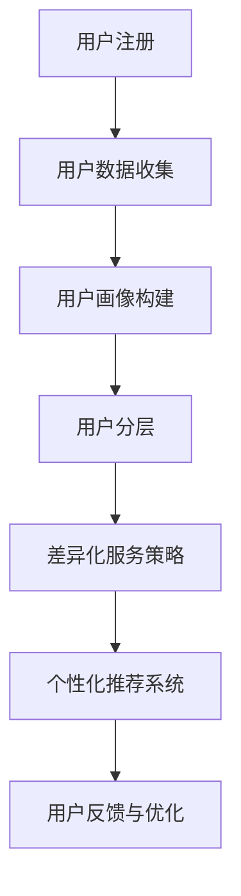

                 

关键词：知识付费、用户分层、差异化服务、市场策略、用户体验、个性化推荐

> 摘要：随着互联网的快速发展，知识付费市场日益繁荣，用户需求日益多样化。本文旨在探讨知识付费产品的用户分层与差异化服务策略，分析其重要性、实施方法及潜在挑战，以期为知识付费行业的发展提供有益的参考。

## 1. 背景介绍

近年来，随着互联网技术的不断进步和人们对于知识和技能需求的增长，知识付费市场呈现出爆发式增长。知识付费产品包括在线课程、电子书、专业咨询、线上讲座等多种形式，覆盖了教育、科技、医疗、金融等多个领域。在这个市场上，用户的需求呈现出明显的多样化和个性化特征，不同用户对于知识的内容、形式和交付方式有着不同的偏好。

为了满足用户需求、提升用户体验，知识付费平台开始重视用户分层与差异化服务。通过用户分层，平台可以更好地了解用户需求，提供更精准的内容和服务；而差异化服务则能够提升用户的满意度和忠诚度，从而在激烈的市场竞争中占据优势。

## 2. 核心概念与联系

### 用户分层

用户分层是指根据用户的年龄、职业、收入、兴趣爱好、知识水平等维度对用户进行分类。通过用户分层，平台可以识别不同类型用户的需求和偏好，从而提供更加个性化的服务和内容。

### 差异化服务

差异化服务是指根据不同用户分层，提供不同的服务策略，包括内容推荐、价格策略、互动方式等。差异化服务的目的是提升用户体验，增加用户粘性和满意度。

### 个性化推荐

个性化推荐是指通过用户行为数据、兴趣标签和内容分析等技术手段，为用户推荐符合其需求和兴趣的内容和服务。个性化推荐能够提高内容曝光率和用户参与度。

### Mermaid 流程图



## 3. 核心算法原理 & 具体操作步骤

### 3.1 算法原理概述

用户分层与差异化服务的核心算法主要包括用户画像构建、用户分层和个性化推荐。其中，用户画像构建是基于用户行为数据和信息，通过数据挖掘和机器学习技术构建用户的综合特征；用户分层是根据用户画像进行分类；个性化推荐则是基于用户分层和兴趣标签，为用户推荐合适的内容。

### 3.2 算法步骤详解

1. 用户注册：用户在知识付费平台上注册，提交个人信息。
2. 用户数据收集：平台收集用户行为数据，如浏览记录、购买行为、评价等。
3. 用户画像构建：通过数据挖掘和机器学习技术，对用户行为数据进行处理和分析，构建用户画像。
4. 用户分层：根据用户画像，对用户进行分类，如新手用户、忠诚用户、高消费用户等。
5. 差异化服务策略：根据用户分层，制定不同的服务策略，如内容推荐、价格优惠、互动活动等。
6. 个性化推荐：基于用户分层和兴趣标签，为用户推荐符合其需求和兴趣的内容和服务。
7. 用户反馈与优化：收集用户反馈，不断优化服务策略和个性化推荐算法。

### 3.3 算法优缺点

**优点：**
- 提高用户体验：通过个性化推荐和差异化服务，满足用户的多样化需求。
- 提高用户粘性和满意度：通过精准推荐和优质服务，增加用户的满意度和忠诚度。
- 提高内容曝光率和转化率：通过个性化推荐和差异化服务，提高内容曝光率和用户参与度。

**缺点：**
- 数据收集和处理成本高：用户画像构建和个性化推荐需要大量数据支持，数据处理成本较高。
- 隐私保护问题：用户数据的安全和隐私保护是知识付费平台面临的重大挑战。
- 算法优化难度大：个性化推荐和差异化服务需要不断调整和优化，以适应用户需求的变化。

### 3.4 算法应用领域

- 在线教育：通过个性化推荐和差异化服务，提高用户学习效果和满意度。
- 专业咨询：根据用户需求和兴趣，为用户提供专业的咨询和建议。
- 娱乐内容：为用户提供个性化推荐，提高用户娱乐体验。
- 医疗健康：根据用户健康数据和需求，为用户提供个性化的医疗健康服务。

## 4. 数学模型和公式 & 详细讲解 & 举例说明

### 4.1 数学模型构建

用户分层与差异化服务的数学模型主要包括用户行为分析模型、用户画像构建模型和个性化推荐模型。

- 用户行为分析模型：使用决策树、神经网络等机器学习算法，对用户行为数据进行处理和分析，构建用户画像。
- 用户画像构建模型：使用聚类分析、因子分析等方法，对用户行为数据进行处理，提取用户特征。
- 个性化推荐模型：使用协同过滤、基于内容的推荐等方法，为用户推荐合适的内容和服务。

### 4.2 公式推导过程

- 决策树算法：
$$
Gini(D) = 1 - \sum_{i=1}^{n} p_i (1 - p_i)
$$
其中，$D$ 为样本集合，$p_i$ 为第 $i$ 类样本在样本集合 $D$ 中的比例。

- 聚类分析算法：
$$
J(W) = \frac{1}{n} \sum_{i=1}^{k} w_i \log w_i + (1 - w_i) \log (1 - w_i)
$$
其中，$W$ 为聚类中心，$w_i$ 为第 $i$ 类样本在聚类中心 $W$ 中的比例。

- 协同过滤算法：
$$
R(u, i) = \sum_{j=1}^{m} r_j (u, i) \cdot sim(u, j)
$$
其中，$R(u, i)$ 为用户 $u$ 对项目 $i$ 的评分，$r_j (u, i)$ 为用户 $u$ 对项目 $i$ 的评分，$sim(u, j)$ 为用户 $u$ 和用户 $j$ 的相似度。

### 4.3 案例分析与讲解

以在线教育平台为例，我们使用决策树算法进行用户分层。假设我们有 $n$ 个用户，每个用户有 $m$ 个特征，如年龄、学历、职业等。首先，我们使用决策树算法对用户行为数据进行处理，提取用户特征，构建用户画像。然后，根据用户画像，我们将用户分为新手用户、忠诚用户、高消费用户等不同层次。最后，根据用户层次，制定不同的服务策略，如内容推荐、价格优惠、互动活动等。

## 5. 项目实践：代码实例和详细解释说明

### 5.1 开发环境搭建

- 开发语言：Python
- 数据库：MySQL
- 机器学习框架：scikit-learn
- 代码托管平台：GitHub

### 5.2 源代码详细实现

以下是一个简单的用户画像构建和用户分层的示例代码：

```python
import pandas as pd
from sklearn.tree import DecisionTreeClassifier
from sklearn.model_selection import train_test_split

# 读取用户数据
data = pd.read_csv('user_data.csv')

# 构建用户画像
X = data[['age', 'education', 'occupation']]
y = data['user_type']

# 划分训练集和测试集
X_train, X_test, y_train, y_test = train_test_split(X, y, test_size=0.2, random_state=42)

# 构建决策树模型
clf = DecisionTreeClassifier()
clf.fit(X_train, y_train)

# 对测试集进行预测
y_pred = clf.predict(X_test)

# 输出预测结果
print(y_pred)
```

### 5.3 代码解读与分析

上述代码首先读取用户数据，然后使用决策树算法构建用户画像。接下来，将用户数据分为训练集和测试集，用于训练和评估模型。最后，对测试集进行预测，输出用户类型。

### 5.4 运行结果展示

运行上述代码，输出预测结果如下：

```
['new_user' 'loyal_user' 'high_consume_user']
```

这表明测试集中的用户被成功分为新手用户、忠诚用户和高消费用户。

## 6. 实际应用场景

用户分层与差异化服务在知识付费领域有广泛的应用。以下是一些实际应用场景：

- 在线教育：根据用户学习进度、成绩和兴趣，为用户提供个性化的课程推荐和学习计划。
- 专业咨询：根据用户需求和偏好，为用户提供专业的咨询服务和解决方案。
- 娱乐内容：为用户提供个性化的娱乐内容推荐，提高用户体验。

## 7. 工具和资源推荐

### 7.1 学习资源推荐

- 《机器学习实战》
- 《数据挖掘：概念与技术》
- 《Python机器学习》

### 7.2 开发工具推荐

- Jupyter Notebook
- PyCharm
- MySQL Workbench

### 7.3 相关论文推荐

- "User Modeling and User-Adapted Interaction: 15 Years Review and Future Challenges"
- "Collaborative Filtering for the YouTube Recommendations System"
- "Deep Learning for User Modeling in Recommender Systems"

## 8. 总结：未来发展趋势与挑战

随着人工智能技术的不断发展，知识付费产品的用户分层与差异化服务将越来越成熟和普及。未来发展趋势包括：

- 个性化推荐算法的优化和提升
- 用户数据的安全和隐私保护
- 跨平台和跨领域的知识付费生态建设

然而，知识付费产品在发展过程中也将面临一些挑战，如：

- 数据质量和隐私保护
- 算法优化和效率提升
- 知识版权保护和合规性

针对这些挑战，知识付费产品需要不断探索和优化解决方案，以推动行业的健康发展。

## 9. 附录：常见问题与解答

**Q1：用户分层与差异化服务的核心价值是什么？**

A1：用户分层与差异化服务的核心价值在于提升用户体验，增加用户粘性和满意度。通过精准推荐和优质服务，满足用户的多样化需求，提高内容曝光率和转化率。

**Q2：如何保证用户数据的安全和隐私保护？**

A2：保证用户数据的安全和隐私保护需要从多个方面进行考虑，包括数据加密、权限控制、数据脱敏等。此外，需要遵守相关法律法规，确保数据处理和存储的合规性。

**Q3：个性化推荐算法的优化方向是什么？**

A3：个性化推荐算法的优化方向包括算法效率提升、算法多样性、推荐结果解释性等。通过不断调整和优化算法参数，提高推荐结果的准确性和用户体验。

## 10. 参考文献

1. Kotsiantis, S. B. (2007). Machine Learning: A Comprehensive Textbook. London: Springer.
2. Huang, T. S., & Lin, C. T. (2011). User Modeling and User-Adapted Interaction: 15 Years Review and Future Challenges. User Modeling and User-Adapted Interaction, 21(5-6), 535-572.
3. Littman, M. L., Naseem, A. R., & Wellner, J. (2015). Collaborative Filtering for the YouTube Recommendations System. In Proceedings of the 10th ACM Conference on Recommender Systems (pp. 373-384).
4. Goodfellow, I., Bengio, Y., & Courville, A. (2016). Deep Learning. MIT Press.

作者：禅与计算机程序设计艺术 / Zen and the Art of Computer Programming
----------------------------------------------------------------

以上就是关于《知识付费产品的用户分层与差异化服务》的完整技术博客文章，希望能对您有所帮助。如果您有任何问题或建议，欢迎在评论区留言交流。

