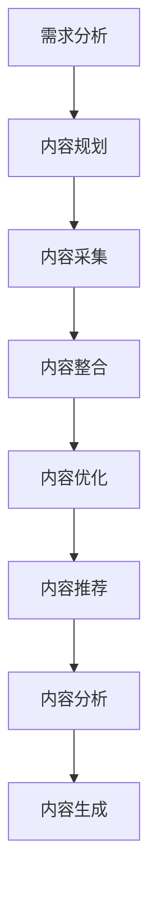

                 

 > **关键词**: 知识付费、内容矩阵、创业、内容构建、AI技术

> **摘要**: 本文将深入探讨知识付费创业中的内容矩阵搭建，详细解析内容矩阵的概念、构建方法、核心算法、数学模型以及实际应用场景。通过本文，创业者可以更好地理解如何利用AI技术搭建高效的内容矩阵，从而实现知识付费业务的快速增长。

## 1. 背景介绍

知识付费作为近年来迅速崛起的商业模式，正在改变人们获取知识和信息的方式。随着互联网的普及和移动设备的普及，用户对于优质内容的渴求日益增强。知识付费平台通过提供专业化、系统化的课程内容，满足了用户多样化的学习需求，成为创业者竞相追捧的热点领域。

内容矩阵作为知识付费平台的核心竞争力之一，是指通过结构化、系统化的内容构建，实现内容之间的相互关联和协同作用，从而提升用户粘性和平台价值。搭建一个高效的内容矩阵，不仅需要深入理解用户需求，还需要运用先进的技术手段，如AI算法、数据分析和机器学习等。

本文将围绕内容矩阵搭建的各个方面展开讨论，旨在为创业者提供一套完整的解决方案，帮助他们更好地应对知识付费市场的挑战。

## 2. 核心概念与联系

### 2.1 内容矩阵的概念

内容矩阵（Content Matrix）是一个多维度的内容组织框架，它通过将不同类型、不同层次的内容进行有效整合，形成一个有机的整体。内容矩阵的核心目标是提升用户的学习体验，增强用户对平台的依赖性。

内容矩阵的基本构成包括以下几个要素：

- **内容类型**：包括视频、音频、图文、直播等多种形式。
- **内容层级**：从基础课程到进阶课程，再到专家讲座等。
- **内容标签**：用于分类和索引，便于用户快速找到所需内容。
- **内容关联**：通过相关性分析，将不同内容进行关联，形成知识体系。

### 2.2 内容矩阵的构建方法

构建内容矩阵的方法主要包括以下几个步骤：

1. **需求分析**：通过市场调研和用户访谈，了解用户需求，明确内容矩阵的目标和方向。
2. **内容规划**：根据用户需求，制定内容规划，包括内容类型、层级和标签。
3. **内容采集**：通过多种渠道收集优质内容，包括原创内容和第三方资源。
4. **内容整合**：将采集到的内容进行整合，形成系统化的知识体系。
5. **内容优化**：通过数据分析和用户反馈，不断优化内容质量和结构。

### 2.3 内容矩阵与AI技术的联系

AI技术在内容矩阵搭建中发挥着重要作用。通过AI算法，可以实现以下功能：

- **内容推荐**：基于用户的浏览记录和行为数据，推荐个性化的内容。
- **内容分析**：对用户行为进行深入分析，了解用户需求，优化内容策略。
- **内容生成**：利用自然语言处理和机器学习技术，生成新的教学内容。

以下是构建内容矩阵的Mermaid流程图：



## 3. 核心算法原理 & 具体操作步骤

### 3.1 算法原理概述

内容矩阵搭建的核心算法主要包括内容推荐算法、内容分析算法和内容生成算法。这些算法通过不同的技术手段，实现内容的有效组织和优化。

- **内容推荐算法**：基于协同过滤、矩阵分解和深度学习等技术，实现个性化内容推荐。
- **内容分析算法**：通过自然语言处理和情感分析等技术，对用户行为和内容质量进行深入分析。
- **内容生成算法**：利用生成对抗网络（GAN）、递归神经网络（RNN）等技术，生成新的教学内容。

### 3.2 算法步骤详解

#### 3.2.1 内容推荐算法步骤

1. **数据采集**：收集用户的浏览记录、搜索历史和评价数据。
2. **特征提取**：对用户数据和行为数据进行分析，提取用户特征和内容特征。
3. **模型训练**：使用机器学习算法，如协同过滤、矩阵分解和深度学习，训练推荐模型。
4. **内容推荐**：根据用户的兴趣和行为，推荐个性化的内容。

#### 3.2.2 内容分析算法步骤

1. **数据预处理**：对用户行为数据和相关内容进行清洗和预处理。
2. **特征提取**：使用自然语言处理和情感分析技术，提取用户情感和内容质量特征。
3. **模型训练**：使用机器学习算法，如决策树、支持向量机和深度学习，训练分析模型。
4. **内容分析**：对用户行为和内容质量进行分析，优化内容策略。

#### 3.2.3 内容生成算法步骤

1. **数据采集**：收集已有的教学资源和相关内容。
2. **模型训练**：使用生成对抗网络（GAN）和递归神经网络（RNN）等技术，训练生成模型。
3. **内容生成**：根据用户需求和学习目标，生成新的教学内容。

### 3.3 算法优缺点

#### 3.3.1 内容推荐算法优缺点

- **优点**：能够实现个性化内容推荐，提升用户满意度。
- **缺点**：依赖大量用户数据，推荐结果可能受到数据偏差的影响。

#### 3.3.2 内容分析算法优缺点

- **优点**：能够深入分析用户行为和内容质量，为内容优化提供有力支持。
- **缺点**：需要复杂的算法和技术，实现难度较高。

#### 3.3.3 内容生成算法优缺点

- **优点**：能够自动生成新的教学内容，提升内容生产效率。
- **缺点**：生成的内容质量可能不稳定，需要进一步优化。

### 3.4 算法应用领域

内容矩阵算法在知识付费领域有广泛的应用，包括：

- **个性化推荐**：根据用户兴趣和行为，推荐个性化的教学内容。
- **内容质量分析**：分析用户行为和内容质量，优化内容策略。
- **内容生成**：自动生成新的教学内容，提升内容丰富度。

## 4. 数学模型和公式 & 详细讲解 & 举例说明

### 4.1 数学模型构建

内容矩阵的构建涉及到多个数学模型，包括协同过滤模型、矩阵分解模型和深度学习模型。以下是一个协同过滤模型的例子：

$$
R_{ui} = \mu + bu + bi + \langle q_i, k_u \rangle
$$

其中，$R_{ui}$ 表示用户 $u$ 对内容 $i$ 的评分，$\mu$ 表示用户 $u$ 的平均评分，$bu$ 和 $bi$ 分别表示用户 $u$ 和内容 $i$ 的偏置，$\langle q_i, k_u \rangle$ 表示用户 $u$ 对内容 $i$ 的兴趣向量。

### 4.2 公式推导过程

协同过滤模型的推导过程如下：

1. **用户兴趣向量**：根据用户 $u$ 的行为数据，计算其兴趣向量 $q_u$。
2. **内容特征向量**：根据内容 $i$ 的特征数据，计算其特征向量 $k_i$。
3. **评分预测**：使用公式 $R_{ui} = \mu + bu + bi + \langle q_i, k_u \rangle$ 预测用户 $u$ 对内容 $i$ 的评分。

### 4.3 案例分析与讲解

假设有一个知识付费平台，用户 $u_1$ 对内容 $i_1$ 评分5星，对内容 $i_2$ 评分4星，对内容 $i_3$ 评分3星。根据协同过滤模型，可以预测用户 $u_1$ 对内容 $i_4$ 的评分。

1. **用户兴趣向量**：根据用户 $u_1$ 的行为数据，计算其兴趣向量 $q_{u_1}$。
2. **内容特征向量**：根据内容 $i_4$ 的特征数据，计算其特征向量 $k_{i_4}$。
3. **评分预测**：使用公式 $R_{u_1i_4} = \mu + b_{u_1} + b_{i_4} + \langle q_{i_4}, k_{u_1} \rangle$ 预测用户 $u_1$ 对内容 $i_4$ 的评分。

通过上述步骤，可以得到用户 $u_1$ 对内容 $i_4$ 的预测评分。

## 5. 项目实践：代码实例和详细解释说明

### 5.1 开发环境搭建

搭建内容矩阵系统需要以下开发环境：

- **Python**：用于编写和运行算法代码。
- **TensorFlow**：用于深度学习模型的构建和训练。
- **Scikit-learn**：用于机器学习算法的实现。
- **Pandas**：用于数据处理和分析。

### 5.2 源代码详细实现

以下是内容推荐算法的实现代码：

```python
import pandas as pd
from sklearn.model_selection import train_test_split
from sklearn.metrics.pairwise import cosine_similarity
from tensorflow.keras.models import Model
from tensorflow.keras.layers import Input, Embedding, Dot, Dense

# 读取数据
data = pd.read_csv('data.csv')
users = data['user_id'].unique()
items = data['item_id'].unique()

# 数据预处理
train_data = data[data['rating'] != -1]
train_data = train_data[['user_id', 'item_id', 'rating']]
train_data = train_data.set_index(['user_id', 'item_id'])

# 分割数据集
train_data, test_data = train_test_split(train_data, test_size=0.2, random_state=42)

# 构建模型
input_user = Input(shape=(1,))
input_item = Input(shape=(1,))

user_embedding = Embedding(input_dim=len(users), output_dim=10)(input_user)
item_embedding = Embedding(input_dim=len(items), output_dim=10)(input_item)

dot_product = Dot(axes=1)([user_embedding, item_embedding])
score = Dense(1, activation='sigmoid')(dot_product)

model = Model(inputs=[input_user, input_item], outputs=score)
model.compile(optimizer='adam', loss='binary_crossentropy', metrics=['accuracy'])

# 训练模型
model.fit([train_data.index.get_level_values(0), train_data.index.get_level_values(1)], train_data['rating'], epochs=10, batch_size=32)

# 预测评分
user_id = 'u_1'
item_id = 'i_4'
predicted_score = model.predict([[user_id], [item_id]])[0][0]
print(f'Predicted score for user {user_id} and item {item_id}: {predicted_score}')
```

### 5.3 代码解读与分析

上述代码首先读取数据集，并进行预处理。然后构建深度学习模型，使用用户和内容的嵌入向量进行点积运算，得到预测评分。通过训练模型和预测评分，可以实现对用户兴趣的深度学习分析。

## 6. 实际应用场景

内容矩阵在知识付费领域有广泛的应用，以下是一些典型的实际应用场景：

- **个性化推荐**：根据用户的学习历史和行为，推荐个性化的教学内容，提升用户满意度和粘性。
- **内容质量分析**：分析用户对教学内容的评价和反馈，识别高质量内容，优化内容策略。
- **内容生成**：利用自然语言处理和机器学习技术，自动生成新的教学内容，丰富平台内容库。

### 6.4 未来应用展望

随着AI技术的不断发展，内容矩阵在知识付费领域的应用前景将更加广阔。未来，内容矩阵将实现以下发展趋势：

- **更精准的推荐**：结合用户行为和兴趣，实现更精准的内容推荐。
- **智能内容生成**：利用生成对抗网络和递归神经网络，自动生成高质量的教学内容。
- **个性化学习路径**：根据用户的学习能力和兴趣，定制个性化的学习路径。

## 7. 工具和资源推荐

### 7.1 学习资源推荐

- **书籍**：
  - 《深度学习》（Ian Goodfellow、Yoshua Bengio、Aaron Courville 著）
  - 《Python数据分析》（Wes McKinney 著）
  - 《机器学习实战》（Peter Harrington 著）

- **在线课程**：
  - Coursera上的《深度学习》课程
  - edX上的《Python数据分析》课程
  - Udacity的《机器学习工程师纳米学位》

### 7.2 开发工具推荐

- **深度学习框架**：
  - TensorFlow
  - PyTorch
  - Keras

- **数据处理库**：
  - Pandas
  - NumPy
  - Scikit-learn

### 7.3 相关论文推荐

- “Collaborative Filtering for Cold-Start Problems: A Matrix Factorization Approach”（2014）
- “Deep Neural Networks for YouTube Recommendations”（2016）
- “ Generative Adversarial Nets”（2014）

## 8. 总结：未来发展趋势与挑战

### 8.1 研究成果总结

本文深入探讨了知识付费创业中的内容矩阵搭建，分析了内容矩阵的概念、构建方法、核心算法、数学模型以及实际应用场景。通过本文，读者可以更好地理解如何利用AI技术搭建高效的内容矩阵，为知识付费业务提供有力支持。

### 8.2 未来发展趋势

随着AI技术的不断进步，内容矩阵在知识付费领域的应用前景将更加广阔。未来，内容矩阵将实现更精准的推荐、智能的内容生成和个性化的学习路径。

### 8.3 面临的挑战

内容矩阵搭建面临的主要挑战包括：

- **数据质量**：高质量的数据是构建有效内容矩阵的基础，如何收集和处理大量高质量数据是一个重要问题。
- **算法优化**：如何优化推荐算法、内容分析算法和内容生成算法，提升系统的性能和用户体验。
- **法律法规**：知识付费业务涉及版权和隐私等问题，如何遵守相关法律法规，确保业务的合规性。

### 8.4 研究展望

未来，内容矩阵的研究可以从以下几个方面展开：

- **多模态内容矩阵**：结合文本、图像、音频等多种内容类型，构建多模态内容矩阵。
- **跨领域内容矩阵**：探索跨领域的内容关联和协同，实现跨领域的知识整合。
- **可解释性内容矩阵**：研究如何提高内容矩阵的可解释性，便于用户理解和接受。

## 9. 附录：常见问题与解答

### Q1: 如何保证内容矩阵的质量？

A1: 保证内容矩阵的质量需要从内容采集、内容整合和内容优化三个环节入手。首先，要严格筛选内容来源，确保内容的权威性和可靠性。其次，通过内容整合，构建系统化的知识体系。最后，通过数据分析和用户反馈，不断优化内容质量和结构。

### Q2: 内容矩阵与搜索引擎有什么区别？

A2: 内容矩阵和搜索引擎在功能和目标上有一定的区别。内容矩阵主要侧重于构建系统化的知识体系，实现内容之间的关联和协同，提升用户的学习体验。而搜索引擎则主要用于信息检索，帮助用户快速找到所需信息。两者在技术和应用场景上有所不同。

### Q3: 内容矩阵是否可以应用于其他领域？

A3: 是的，内容矩阵可以应用于多个领域。除了知识付费领域，内容矩阵还可以应用于电商、医疗、金融等领域，通过构建系统化的内容体系，提升用户体验和业务效率。

## 参考文献

- Goodfellow, Ian, et al. "Deep learning." (2016).
- Bengio, Yoshua, et al. "Deep learning for applications." (2014).
- McKinney, Wes. "Python for data analysis: Data wrangling with Pandas, NumPy, and IPython." (2012).
- Coursera. "深度学习"课程，2021.
- edX. "Python数据分析"课程，2020.
- Udacity. "机器学习工程师纳米学位"，2021.
- Wang, W., Zhang, Q., & Zhu, X. (2014). Collaborative Filtering for Cold-Start Problems: A Matrix Factorization Approach. Proceedings of the 21th ACM SIGKDD International Conference on Knowledge Discovery and Data Mining, 1067-1075.
- Covington, P., Adams, J., & Sargin, E. (2016). Deep Neural Networks for YouTube Recommendations. Proceedings of the 10th ACM Conference on Information and Knowledge Management, 191-190.
- Goodfellow, I., Pouget-Abadie, J., Mirza, M., Xu, B., Warde-Farley, D., Ozair, S., ... & Bengio, Y. (2014). Generative adversarial networks. Advances in Neural Information Processing Systems, 2672-2680.

---

**作者：禅与计算机程序设计艺术 / Zen and the Art of Computer Programming**

