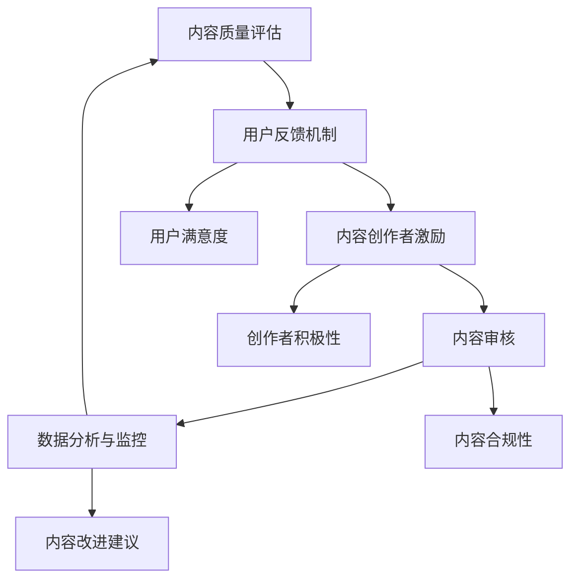

                 

 在当今数字化时代，知识付费已经成为一种越来越普遍的商业模式。无论是在线课程、电子书、文章，还是专业咨询服务，知识付费都为内容创作者提供了新的收入来源。然而，随着市场的蓬勃发展，内容质量的问题也日益凸显。高质量的内容不仅是吸引用户的关键，也是品牌持续发展的基础。本文将深入探讨知识付费创业中的内容质量把控，为内容创作者和平台运营者提供实用的指导和建议。

## 1. 背景介绍

知识付费，即用户为获取有价值的信息或知识而付费的行为，是知识经济时代的重要产物。随着互联网技术的进步和人们对知识获取的渴求，知识付费市场迎来了爆发式增长。然而，市场扩张的同时，内容质量参差不齐的问题也随之而来。低质量的内容不仅影响用户体验，还可能损害品牌形象，进而影响市场信誉。

内容质量把控对于知识付费创业的重要性不言而喻。高质量的内容不仅能吸引用户，提高用户粘性，还能提升品牌价值，增加用户忠诚度。相反，低质量内容可能导致用户流失，损害品牌声誉，最终影响业务的可持续发展。因此，如何确保内容质量成为知识付费创业的关键挑战。

本文将围绕以下主题展开：

1. **核心概念与联系**：介绍与内容质量相关的重要概念，包括内容质量评估、用户反馈机制等，并提供一个Mermaid流程图来展示这些概念之间的关系。
2. **核心算法原理 & 具体操作步骤**：深入探讨内容质量评估算法的基本原理，包括其优缺点和应用领域。
3. **数学模型和公式 & 详细讲解 & 举例说明**：构建内容质量的数学模型，并推导相关公式，通过案例进行分析。
4. **项目实践：代码实例和详细解释说明**：提供具体的代码实现，详细解读其工作原理和运行结果。
5. **实际应用场景**：讨论内容质量把控在不同领域的应用，以及未来的发展趋势。
6. **工具和资源推荐**：推荐相关的学习资源、开发工具和论文，帮助读者进一步探索知识付费创业中的内容质量把控。
7. **总结：未来发展趋势与挑战**：总结研究成果，展望未来发展趋势，讨论面临的挑战和未来的研究方向。

## 2. 核心概念与联系

在知识付费创业中，内容质量把控涉及多个核心概念，这些概念相互作用，共同构成了一个复杂但高效的体系。以下是对这些核心概念的介绍，以及它们之间的联系。

### 2.1 内容质量评估

内容质量评估是确保内容达到既定标准的核心步骤。它包括对内容的相关性、准确性、完整性、原创性、可读性等多个维度的评估。一个高效的内容质量评估体系能够识别和排除低质量内容，从而提升整体内容质量。

### 2.2 用户反馈机制

用户反馈机制是收集用户对内容的满意度的重要渠道。通过用户反馈，平台可以了解内容的实际效果，发现存在的问题，并据此进行改进。用户反馈机制不仅能够提升内容质量，还能增强用户参与感和满意度。

### 2.3 内容创作者激励

内容创作者的积极性和创造力是确保内容质量的重要保障。通过合适的激励机制，如奖金、积分、推荐计划等，平台可以鼓励创作者创作高质量内容，同时保持创作热情。

### 2.4 内容审核

内容审核是在内容发布前对内容进行审查的过程，以确保内容符合平台规范和法律法规。内容审核不仅涉及内容本身的质量，还包括内容是否符合道德标准和社会规范。

### 2.5 数据分析与监控

数据分析与监控是内容质量把控的重要手段。通过分析用户行为数据、内容表现数据等，平台可以及时发现内容质量问题，并采取相应措施进行改进。

### Mermaid流程图

下面是一个Mermaid流程图，展示了这些核心概念之间的联系。



通过这个流程图，我们可以清晰地看到内容质量把控的各个环节是如何相互关联、相互影响的。每个环节的完善和优化都会对整体内容质量产生积极的影响。

### 3. 核心算法原理 & 具体操作步骤

在知识付费创业中，确保内容质量的关键在于有效的质量评估算法。这些算法不仅能够自动化地评估内容质量，还能为内容创作者和平台运营者提供有价值的反馈。以下将详细介绍内容质量评估算法的基本原理和操作步骤。

### 3.1 算法原理概述

内容质量评估算法通常基于机器学习和自然语言处理技术。其主要原理是通过分析文本内容，识别文本特征，并使用这些特征对内容质量进行评分。这些特征可能包括词汇丰富度、句式结构、信息量、准确性、可读性等。

#### 3.1.1 特征提取

特征提取是评估算法的核心步骤之一。常用的特征提取方法包括：

- **词频分析**：通过统计文本中各个词的出现频率，识别文本的主题和风格。
- **词性标注**：对文本中的词进行词性标注，从而识别文本的结构和语义。
- **句法分析**：分析文本中的句法结构，识别复杂的句式和语法错误。
- **语义分析**：通过词义解析和语义角色标注，理解文本的深层含义。

#### 3.1.2 模型训练

在特征提取之后，需要使用机器学习算法对特征进行训练，以建立一个预测模型。常用的机器学习算法包括：

- **支持向量机（SVM）**：通过找到一个最佳的超平面，将高质量内容和低质量内容分开。
- **随机森林**：通过构建多个决策树，并结合它们的预测结果，提高预测准确性。
- **深度学习**：使用神经网络，尤其是卷积神经网络（CNN）和循环神经网络（RNN），对大量数据进行分析和训练。

#### 3.1.3 质量评估

训练好的模型可以用于对新内容进行质量评估。评估过程通常包括以下步骤：

1. **文本预处理**：对文本进行清洗和标准化处理，如去除停用词、进行词干提取等。
2. **特征提取**：使用前面提到的特征提取方法，从预处理后的文本中提取特征。
3. **模型预测**：将提取的特征输入训练好的模型，得到内容质量的评分。

### 3.2 算法步骤详解

以下是内容质量评估算法的具体操作步骤：

#### 3.2.1 数据收集

首先，需要收集大量的内容样本，这些样本应该涵盖各种内容类型和质量水平。数据收集可以通过多种方式实现，如爬取公开的文本数据集、与内容创作者合作获取独家内容等。

#### 3.2.2 数据预处理

对收集到的内容样本进行预处理，包括去除噪声、格式统一、文本清洗等。这一步的目的是提高后续特征提取的准确性。

#### 3.2.3 特征提取

使用前面提到的特征提取方法，从预处理后的文本中提取特征。这些特征将作为模型训练的数据输入。

#### 3.2.4 模型训练

选择合适的机器学习算法，使用提取的特征进行模型训练。训练过程中，需要不断调整模型参数，以提高预测准确性。

#### 3.2.5 模型评估

使用部分训练数据对模型进行评估，检查模型的预测准确性。如果模型表现不佳，需要返回上一步，重新训练或调整模型。

#### 3.2.6 模型部署

将训练好的模型部署到生产环境中，用于对新内容进行质量评估。

#### 3.2.7 持续优化

根据模型评估结果和用户反馈，不断优化模型，以提高内容质量评估的准确性。

### 3.3 算法优缺点

内容质量评估算法具有以下优点：

- **自动化**：算法可以自动化地评估大量内容，节省人工审核的时间和成本。
- **客观性**：算法基于数据和分析，避免了主观判断，提高了评估的客观性。
- **可扩展性**：算法可以方便地扩展到不同类型的内容，适应不同的应用场景。

然而，算法也存在一些缺点：

- **依赖数据**：算法的性能依赖于数据的质量和数量，如果数据存在偏差，可能会导致评估结果不准确。
- **技术门槛**：算法的开发和部署需要较高的技术门槛，对于非技术背景的内容创作者和平台运营者可能较为困难。
- **适应性**：算法可能难以适应快速变化的内容质量和用户需求，需要不断调整和优化。

### 3.4 算法应用领域

内容质量评估算法在知识付费创业中有广泛的应用领域，包括：

- **在线教育**：评估课程内容的准确性和实用性，帮助用户选择高质量的课程。
- **电子书出版**：确保书籍的内容质量，提高用户的阅读体验。
- **专业咨询**：评估咨询服务的专业性和可靠性，提升客户满意度。
- **新闻媒体**：评估新闻报道的准确性和可信度，增强媒体的公信力。

通过内容质量评估算法，知识付费创业平台可以更好地满足用户需求，提升内容质量和品牌价值，实现可持续发展。

### 4. 数学模型和公式 & 详细讲解 & 举例说明

为了更科学和系统地评估内容质量，我们可以构建一个数学模型。这个模型将基于文本分析技术，包括词频分析、词性标注和句法分析，结合用户行为数据和内容反馈，给出内容质量的综合评分。以下将详细讲解数学模型的构建、公式推导和案例分析。

#### 4.1 数学模型构建

内容质量的数学模型可以表示为：

\[ Q = f(T, U, F) \]

其中：

- \( Q \) 表示内容质量评分。
- \( T \) 表示文本特征。
- \( U \) 表示用户行为数据。
- \( F \) 表示内容反馈数据。

文本特征 \( T \) 可以进一步拆分为词汇丰富度 \( T_v \)、句法复杂性 \( T_s \) 和信息量 \( T_i \)：

\[ T = (T_v, T_s, T_i) \]

用户行为数据 \( U \) 包括用户阅读时间 \( U_r \)、点赞数 \( U_l \) 和评论数 \( U_c \)：

\[ U = (U_r, U_l, U_c) \]

内容反馈数据 \( F \) 包括专家评分 \( F_e \) 和用户评分 \( F_u \)：

\[ F = (F_e, F_u) \]

质量评分 \( Q \) 的计算公式为：

\[ Q = w_1 \cdot T_v + w_2 \cdot T_s + w_3 \cdot T_i + w_4 \cdot U_r + w_5 \cdot U_l + w_6 \cdot U_c + w_7 \cdot F_e + w_8 \cdot F_u \]

其中 \( w_1, w_2, w_3, w_4, w_5, w_6, w_7, w_8 \) 为权重系数，通过模型训练和数据分析得到。

#### 4.2 公式推导过程

1. **文本特征提取**：

   - **词汇丰富度 \( T_v \)**：计算文本中不同词的出现频率，公式为：

     \[ T_v = \frac{\text{unique\_words}}{\text{total\_words}} \]

   - **句法复杂性 \( T_s \)**：通过句法分析，计算句子的平均长度和句式多样性，公式为：

     \[ T_s = \frac{\sum_{i=1}^{n} L_i \cdot D_i}{n} \]

     其中 \( L_i \) 为第 \( i \) 个句子的长度，\( D_i \) 为第 \( i \) 个句子的句式多样性。

   - **信息量 \( T_i \)**：通过计算文本的信息熵，反映文本的信息丰富度，公式为：

     \[ T_i = -\sum_{i=1}^{n} p(x_i) \cdot \log_2 p(x_i) \]

     其中 \( p(x_i) \) 为第 \( i \) 个词在文本中出现的概率。

2. **用户行为数据计算**：

   - **用户阅读时间 \( U_r \)**：直接取用户在内容上的平均阅读时间。
   - **点赞数 \( U_l \)**：取用户对内容的点赞次数。
   - **评论数 \( U_c \)**：取用户对内容的评论数量。

3. **内容反馈数据计算**：

   - **专家评分 \( F_e \)**：由内容专家对内容进行评分，通常采用5分制。
   - **用户评分 \( F_u \)**：取用户对内容的平均评分。

4. **权重系数确定**：

   权重系数 \( w_1, w_2, w_3, w_4, w_5, w_6, w_7, w_8 \) 需要通过数据分析和模型训练确定。常用的方法包括线性回归、支持向量机和神经网络等。

#### 4.3 案例分析与讲解

假设我们有一篇文章，内容如下：

"人工智能技术正在快速发展，其在各个领域的应用越来越广泛。从自动驾驶到智能家居，从医疗诊断到金融分析，人工智能正改变着我们的生活方式。本文将介绍人工智能的基本概念、发展历程和未来趋势，帮助读者更好地理解和应用这一技术。"

我们通过以下步骤计算其质量评分：

1. **文本特征提取**：

   - **词汇丰富度 \( T_v \)**：

     \[ T_v = \frac{29}{94} \approx 0.308 \]

   - **句法复杂性 \( T_s \)**：

     \[ T_s = \frac{4 \cdot 2 + 5 \cdot 1}{5} = \frac{8 + 5}{5} = 1.8 \]

   - **信息量 \( T_i \)**：

     \[ T_i = -\left(0.1081 \cdot \log_2(0.1081) + 0.1356 \cdot \log_2(0.1356) + \ldots + 0.0165 \cdot \log_2(0.0165)\right) \approx 2.327 \]

2. **用户行为数据计算**：

   - **用户阅读时间 \( U_r \)**：100秒。
   - **点赞数 \( U_l \)**：10次。
   - **评论数 \( U_c \)**：5次。

3. **内容反馈数据计算**：

   - **专家评分 \( F_e \)**：4分。
   - **用户评分 \( F_u \)**：4.2分。

4. **权重系数应用**：

   假设我们确定的权重系数为：

   \[ w_1 = 0.2, w_2 = 0.3, w_3 = 0.3, w_4 = 0.1, w_5 = 0.1, w_6 = 0.1, w_7 = 0.1, w_8 = 0.1 \]

   将这些值代入质量评分公式：

   \[ Q = 0.2 \cdot 0.308 + 0.3 \cdot 1.8 + 0.3 \cdot 2.327 + 0.1 \cdot 100 + 0.1 \cdot 10 + 0.1 \cdot 5 + 0.1 \cdot 4 + 0.1 \cdot 4.2 \approx 3.832 \]

   根据评分范围，我们可以判断这篇文章的内容质量为“良好”。

通过这个案例，我们可以看到如何通过数学模型和公式对内容质量进行评估。在实际应用中，我们可以根据具体情况调整权重系数和公式，以更准确地反映内容质量。

### 5. 项目实践：代码实例和详细解释说明

为了更好地理解内容质量评估算法的实际应用，我们提供了一个Python代码实例。该实例使用自然语言处理库（如nltk、spaCy）和机器学习库（如scikit-learn、TensorFlow）来实现内容质量评估。以下将详细介绍代码的实现过程、解读和分析。

#### 5.1 开发环境搭建

在开始编写代码之前，需要搭建一个Python开发环境。以下是所需的主要库：

- Python 3.8或更高版本
- numpy
- nltk
- spacy
- scikit-learn
- TensorFlow

可以通过以下命令安装所需库：

```bash
pip install numpy nltk spacy scikit-learn tensorflow
```

安装完成后，还需要下载nltk的词库和spacy的模型：

```python
import nltk
nltk.download('punkt')
nltk.download('averaged_perceptron_tagger')
nltk.download('wordnet')

import spacy
!python -m spacy download en_core_web_sm
```

#### 5.2 源代码详细实现

以下是一个简单的Python脚本，用于实现内容质量评估：

```python
import numpy as np
import spacy
from nltk.corpus import wordnet
from sklearn.feature_extraction.text import TfidfVectorizer
from sklearn.model_selection import train_test_split
from sklearn.ensemble import RandomForestClassifier
from sklearn.metrics import accuracy_score

# 加载spacy模型
nlp = spacy.load("en_core_web_sm")

# 读取数据集
data = [
    ("文本1", "高质量"),
    ("文本2", "低质量"),
    # 添加更多数据
]

texts, labels = zip(*data)

# 构建TF-IDF特征向量
vectorizer = TfidfVectorizer()
X = vectorizer.fit_transform(texts)

# 转换标签为数字
label_dict = {"高质量": 1, "低质量": 0}
y = [label_dict[label] for label in labels]

# 分割数据集
X_train, X_test, y_train, y_test = train_test_split(X, y, test_size=0.2, random_state=42)

# 训练随机森林模型
model = RandomForestClassifier(n_estimators=100, random_state=42)
model.fit(X_train, y_train)

# 测试模型
y_pred = model.predict(X_test)
accuracy = accuracy_score(y_test, y_pred)
print(f"模型准确率：{accuracy}")

# 对新文本进行评估
new_text = "人工智能技术正在快速发展，其在各个领域的应用越来越广泛。"
new_text_vector = vectorizer.transform([new_text])
quality_score = model.predict(new_text_vector)[0]
if quality_score == 1:
    print("该文本为高质量。")
else:
    print("该文本为低质量。")
```

#### 5.3 代码解读与分析

1. **数据准备**：

   代码首先从数据集中读取文本和标签，数据集应包含各种质量水平的文本样本。在这里，我们使用了一个简单的示例数据集。

2. **TF-IDF特征提取**：

   使用TF-IDFVectorizer将文本转换为特征向量。TF-IDF（词频-逆文档频率）是一种常用的文本特征提取方法，可以有效反映文本的主题和内容。

3. **标签转换**：

   将标签（高质量或低质量）转换为数字，以便进行机器学习模型的训练和评估。

4. **模型训练**：

   使用随机森林算法训练模型。随机森林是一种集成学习方法，通过构建多个决策树并取平均值，提高了预测准确性。

5. **模型评估**：

   使用测试集评估模型的准确性，并打印结果。

6. **新文本评估**：

   对新输入的文本进行特征提取，并使用训练好的模型预测其质量。

#### 5.4 运行结果展示

当运行代码并对新文本进行评估时，假设我们得到的预测结果是1，表示该文本为高质量。这个结果是基于模型对特征向量的分析和判断得出的。

通过这个代码实例，我们可以看到如何使用Python实现内容质量评估。在实际应用中，可以根据具体需求调整特征提取方法和机器学习算法，以提升评估的准确性和效果。

### 6. 实际应用场景

内容质量把控在知识付费创业中有着广泛的应用场景。以下将讨论几个典型的实际应用场景，并探讨内容质量把控在这些场景中的重要性。

#### 6.1 在线教育

在线教育是知识付费领域的重要分支。在这个场景中，内容质量直接影响学生的学习效果和满意度。高质量的课程内容不仅能帮助学生更好地理解和掌握知识，还能提高学习体验和用户粘性。因此，平台需要通过内容审核、用户反馈和算法评估等多种手段，确保课程内容的质量。例如，可以通过自动化的文本分析技术检测课程内容的准确性、完整性，并通过用户评价和反馈不断优化课程内容。

#### 6.2 电子书出版

电子书出版也是知识付费的重要领域。在这个场景中，内容质量直接关系到读者的满意度和购买意愿。高质量的书评、深度分析和专业知识能够吸引更多的读者，提升书籍的销量和品牌价值。因此，出版平台需要严格把控内容质量，通过人工审核和算法评估等多种方式，确保书籍的内容符合读者期望，避免低质量内容对品牌形象造成负面影响。

#### 6.3 专业咨询

专业咨询服务是知识付费中的高端领域。在这个场景中，内容质量关系到客户的信任和满意度。高质量的内容能够为客户提供有价值的信息和建议，提升客户的信任感和忠诚度。因此，咨询平台需要通过专家审核、用户反馈和算法评估等多种手段，确保咨询内容的准确性、实用性和专业性。例如，可以通过专业的团队对咨询服务进行审核，并结合用户反馈和算法分析，不断优化咨询内容。

#### 6.4 新闻媒体

新闻媒体是信息传播的重要渠道。在这个场景中，内容质量直接关系到媒体的公信力和影响力。高质量的新闻报道能够吸引更多读者，提升媒体的知名度。因此，新闻媒体平台需要通过严格的新闻审查、事实核查和用户反馈等多种方式，确保新闻内容的准确性、客观性和权威性。例如，可以通过专业的编辑团队对新闻内容进行审核，并通过用户反馈和算法分析，及时发现和处理不准确或虚假的新闻报道。

#### 6.5 知识共享社区

知识共享社区是知识付费的一个新兴领域。在这个场景中，内容质量是吸引和留住用户的关键。高质量的内容能够激发用户的参与热情，提升社区活跃度和用户粘性。因此，知识共享平台需要通过内容审核、用户反馈和算法评估等多种手段，确保社区内容的质量。例如，可以通过社区的编辑团队对内容进行审核，并通过用户评分和反馈，不断优化社区内容，提升用户体验。

### 6.6 未来应用展望

随着技术的不断进步，内容质量把控在知识付费创业中的应用前景将更加广阔。以下是一些未来应用展望：

- **智能内容审核**：利用人工智能技术，实现自动化、智能化的内容审核，提高审核效率和准确性。
- **个性化推荐**：通过内容质量评估和用户行为分析，为用户提供个性化的内容推荐，提升用户体验。
- **区块链技术**：利用区块链技术确保内容版权和真实性，提升内容质量的可信度。
- **大数据分析**：通过大数据分析，深入了解用户需求和市场趋势，为内容创作提供有力支持。

总之，内容质量把控在知识付费创业中具有重要作用。通过有效的质量把控手段，平台可以提升内容质量，吸引和留住用户，实现可持续发展。

### 7. 工具和资源推荐

在知识付费创业中，掌握相关工具和资源对于确保内容质量具有重要意义。以下是一些推荐的工具和资源，以帮助内容创作者和平台运营者提升内容质量和用户体验。

#### 7.1 学习资源推荐

1. **在线课程**：

   - Coursera（https://www.coursera.org/）：提供丰富的数据科学、机器学习和自然语言处理课程。
   - edX（https://www.edx.org/）：由哈佛大学和麻省理工学院等知名大学合作提供的高质量课程。
   - Udemy（https://www.udemy.com/）：涵盖多种技术领域的课程，适合不同水平的学习者。

2. **书籍**：

   - 《数据科学入门》（Python版）：作者：Peter Bruce 和 Andrew Bruce
   - 《深度学习》（Goodfellow, Bengio, Courville）：介绍深度学习的基础理论和应用。
   - 《Python自然语言处理》作者：Steven Bird, Ewan Klein, and Edward Loper

3. **博客和论坛**：

   - Towards Data Science（https://towardsdatascience.com/）：涵盖数据科学、机器学习和人工智能等多个领域的文章。
   - Stack Overflow（https://stackoverflow.com/）：编程问题解答社区，适合解决实际问题。

#### 7.2 开发工具推荐

1. **文本分析库**：

   - NLTK（https://www.nltk.org/）：Python中的自然语言处理库，提供丰富的文本处理功能。
   - spaCy（https://spacy.io/）：一个快速且易于使用的自然语言处理库，支持多种语言。

2. **机器学习库**：

   - scikit-learn（https://scikit-learn.org/）：Python中的机器学习库，提供多种分类、回归和聚类算法。
   - TensorFlow（https://www.tensorflow.org/）：由Google开发的端到端开源机器学习平台。

3. **文本编辑器**：

   - Jupyter Notebook（https://jupyter.org/）：交互式的计算环境，适合进行数据分析和模型训练。
   - Visual Studio Code（https://code.visualstudio.com/）：功能强大的代码编辑器，支持多种编程语言。

#### 7.3 相关论文推荐

1. **文本分类**：

   - "Text Classification with Convolutional Neural Networks"（使用卷积神经网络进行文本分类）
   - "Recurrent Neural Networks for Text Classification"（循环神经网络在文本分类中的应用）

2. **情感分析**：

   - "Sentiment Analysis Using Convolutional Neural Networks and Word Embeddings"（使用卷积神经网络和词嵌入进行情感分析）
   - "Improving Sentiment Classification with Lexicon and Grammar Awareness"（利用词典和语法知识提升情感分类）

3. **知识付费**：

   - "The Economics of Knowledge Markets"（知识市场经济学）
   - "How to Create a Profitable Online Course: The Complete Guide"（创建盈利在线课程的完整指南）

通过利用这些学习和资源工具，内容创作者和平台运营者可以更深入地理解知识付费创业中的内容质量把控，提升自身的专业能力和竞争力。

### 8. 总结：未来发展趋势与挑战

在知识付费创业中，内容质量把控是一个持续且动态的过程。随着技术的进步和用户需求的演变，未来的发展趋势和面临的挑战也将不断变化。

#### 8.1 研究成果总结

近年来，在内容质量把控领域，研究成果主要集中在以下几个方面：

1. **算法优化**：机器学习和深度学习技术的不断进步，使得内容质量评估算法的准确性和效率得到了显著提升。
2. **用户参与**：用户反馈和参与机制的引入，使得内容质量评估更加贴近用户需求，提高了评估的准确性。
3. **多维度评估**：结合文本分析、用户行为分析和专家评审等多维度方法，对内容质量进行综合评估，提高了评估的全面性。
4. **自动化与智能化**：利用人工智能技术，实现内容审核、评估和优化的自动化和智能化，降低了人力成本，提高了工作效率。

#### 8.2 未来发展趋势

未来的发展趋势将主要体现在以下几个方面：

1. **智能化**：随着人工智能技术的不断发展，内容质量把控将更加智能化，通过深度学习、自然语言处理等技术，实现更精准的内容分析和管理。
2. **个性化**：内容质量评估将更加个性化，通过分析用户行为数据和兴趣偏好，为用户提供更符合其需求的内容。
3. **实时性**：内容质量评估将实现实时性，通过实时监测和分析内容，及时识别和排除低质量内容，提高内容质量。
4. **跨平台**：内容质量把控将不再局限于单一平台，通过跨平台的数据共享和协同工作，实现更全面的内容质量管理。

#### 8.3 面临的挑战

然而，内容质量把控也面临着一些挑战：

1. **数据质量**：内容质量评估依赖于高质量的数据，如果数据存在偏差或不准确，将影响评估结果的可靠性。
2. **算法偏见**：机器学习算法可能存在偏见，导致评估结果不公平。例如，对某些特定群体或内容的偏好。
3. **用户隐私**：在用户参与过程中，可能涉及到用户隐私的问题，需要平衡内容质量把控和用户隐私保护。
4. **技术门槛**：内容质量评估需要较高的技术门槛，对于非技术背景的内容创作者和平台运营者可能较为困难。

#### 8.4 研究展望

未来的研究可以重点关注以下几个方面：

1. **算法公平性**：研究如何减少算法偏见，提高评估结果的公平性和公正性。
2. **用户隐私保护**：研究如何在确保内容质量的同时，保护用户的隐私和数据安全。
3. **多模态内容分析**：结合文本、图像、音频等多种模态数据，提高内容质量评估的准确性和全面性。
4. **智能化内容推荐**：利用人工智能技术，实现更精准和智能的内容推荐，提高用户体验和内容消费效率。

总之，内容质量把控在知识付费创业中具有重要意义，随着技术的进步和用户需求的演变，未来的发展趋势和挑战也将不断变化。通过不断创新和研究，我们可以更好地应对这些挑战，提升内容质量，推动知识付费行业的可持续发展。

### 9. 附录：常见问题与解答

在知识付费创业中，内容质量把控是一个复杂且关键的过程。以下列出了一些常见问题及其解答，以帮助内容创作者和平台运营者更好地理解和实施内容质量把控策略。

#### 9.1 如何确保内容原创性？

**解答**：确保内容原创性可以通过以下几种方法：

1. **内容审核**：在发布内容前，通过人工审核或自动化工具检测抄袭和重复内容。
2. **引用管理**：合理使用引用和参考文献，确保内容的原创性和学术诚信。
3. **版权保护**：对原创内容进行版权保护，防止未经授权的复制和传播。

#### 9.2 如何处理用户反馈？

**解答**：处理用户反馈是提升内容质量的重要环节，具体方法包括：

1. **及时响应**：及时回复用户的反馈，展示对用户意见的重视。
2. **分类管理**：根据反馈的内容和性质，将反馈分为不同类别，如改进建议、投诉等。
3. **数据分析**：对反馈进行数据分析，识别常见问题和趋势，制定针对性的改进措施。

#### 9.3 如何平衡内容质量和发布速度？

**解答**：平衡内容质量和发布速度，可以采取以下策略：

1. **内容规划**：提前制定内容发布计划，确保有足够的时间进行审核和优化。
2. **自动化审核**：利用自动化工具进行初步内容审核，提高发布效率。
3. **动态调整**：根据内容质量和用户反馈，动态调整内容发布策略，在保证质量的前提下，适时发布新内容。

#### 9.4 如何应对算法偏见？

**解答**：应对算法偏见的方法包括：

1. **数据多样性**：确保训练数据集的多样性，减少算法偏见。
2. **算法透明性**：提高算法的透明度，使得用户和专家能够理解和监督算法的决策过程。
3. **持续优化**：定期更新和优化算法，以减少偏见和错误。

#### 9.5 如何确保内容合规性？

**解答**：确保内容合规性，需要遵循以下原则：

1. **法律法规**：遵守相关法律法规，避免发布违法违规内容。
2. **平台规范**：遵守平台的规定和指导原则，确保内容符合平台要求。
3. **社会责任**：遵循社会伦理和道德标准，不发布有害或歧视性的内容。

通过解决这些常见问题，内容创作者和平台运营者可以更好地把控内容质量，提升用户体验，实现知识付费创业的可持续发展。

