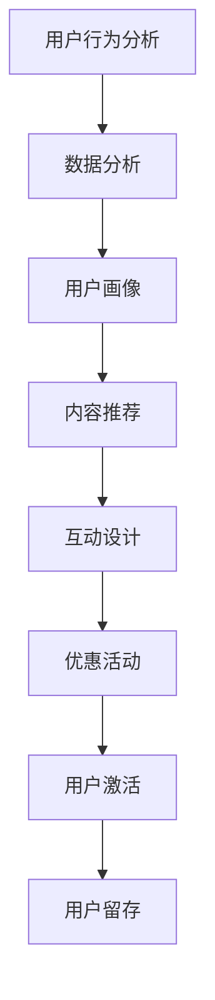

                 

 在这个数字化和互联网高速发展的时代，知识付费成为了越来越多人的选择。然而，如何在海量信息中吸引并激活用户，是每一个知识付费创业者面临的重大挑战。本文将深入探讨知识付费创业中的用户激活策略，通过理论分析、案例研究和实际操作，为您提供一整套行之有效的解决方案。

## 关键词

- 知识付费
- 用户激活
- 创业策略
- 用户行为分析
- 用户体验优化

## 摘要

本文从知识付费行业的发展现状出发，分析了用户激活的重要性，提出了基于用户行为分析和用户体验优化的用户激活策略。通过案例分析，探讨了成功知识付费平台在用户激活方面的实践，并结合实际操作，提供了详细的策略实施步骤。文章最后展望了知识付费行业的未来发展趋势，以及用户激活策略所面临的挑战和机遇。

## 1. 背景介绍

### 1.1 知识付费的兴起

随着互联网的普及和在线教育的兴起，知识付费逐渐成为主流。人们愿意为高质量、专业化的知识内容付费，以提升自身能力。知识付费平台如雨后春笋般涌现，为用户提供了海量的学习资源。

### 1.2 用户激活的意义

用户激活是知识付费创业成功的关键。激活用户意味着将潜在用户转化为活跃用户，进而实现商业价值。然而，在众多竞争者中，如何脱颖而出，吸引并留住用户，是每一个创业者必须面对的挑战。

### 1.3 用户激活的挑战

- 用户注意力分散：在信息爆炸的时代，用户对信息的关注度越来越低。
- 用户付费意愿：如何让用户愿意为知识付费，是创业者必须解决的问题。
- 用户留存率：激活用户只是第一步，如何提高用户留存率，是持续发展的关键。

## 2. 核心概念与联系

### 2.1 用户行为分析

用户行为分析是用户激活策略的基础。通过对用户行为数据的收集和分析，我们可以了解用户的需求、偏好和行为模式，从而制定更有效的激活策略。

### 2.2 用户体验优化

用户体验优化是提高用户激活率的关键。通过优化用户体验，我们可以提高用户的满意度，从而增加用户的激活率和留存率。

### 2.3 用户激活策略

用户激活策略是基于用户行为分析和用户体验优化的一系列操作。包括内容推荐、互动设计、优惠活动等，旨在提高用户的参与度和付费意愿。

### 2.4 Mermaid 流程图



## 3. 核心算法原理 & 具体操作步骤

### 3.1 算法原理概述

用户激活算法主要基于用户行为数据和机器学习技术。通过分析用户行为数据，构建用户画像，然后利用推荐算法为用户提供个性化的内容推荐，从而提高用户激活率。

### 3.2 算法步骤详解

1. 数据收集：收集用户的基本信息、浏览记录、购买行为等数据。
2. 数据预处理：对数据进行清洗、去重和归一化处理。
3. 用户画像构建：基于用户行为数据，构建用户画像。
4. 内容推荐：利用推荐算法，为用户推荐感兴趣的内容。
5. 互动设计：设计互动活动，提高用户的参与度。
6. 优惠活动：提供优惠活动，提高用户的付费意愿。

### 3.3 算法优缺点

优点：

- 高效：通过自动化算法，快速为用户推荐内容，提高激活效率。
- 个性化：基于用户画像，提供个性化的内容推荐，提高用户体验。

缺点：

- 数据依赖：算法效果高度依赖数据质量，数据不足可能导致推荐效果不佳。
- 隐私问题：用户数据的安全和隐私保护是一个挑战。

### 3.4 算法应用领域

用户激活算法可以应用于各种知识付费平台，如在线教育、专业培训、内容付费等。通过优化用户激活策略，可以提高平台用户量、活跃度和付费率。

## 4. 数学模型和公式 & 详细讲解 & 举例说明

### 4.1 数学模型构建

用户激活率模型可以表示为：

\[ 激活率 = \frac{激活用户数}{总用户数} \]

### 4.2 公式推导过程

激活率可以通过以下步骤计算：

1. 收集总用户数和激活用户数的数据。
2. 计算激活用户数占总用户数的比例。
3. 将比例转换为百分比，得到激活率。

### 4.3 案例分析与讲解

以一家在线教育平台为例，该平台在一个月内共有1000名用户，其中200名用户完成了付费课程，则激活率为：

\[ 激活率 = \frac{200}{1000} \times 100\% = 20\% \]

通过优化用户激活策略，平台可以将激活率提高到30%，从而提高收入。

## 5. 项目实践：代码实例和详细解释说明

### 5.1 开发环境搭建

1. 安装Python环境
2. 安装相关库，如NumPy、Pandas、Scikit-learn等

### 5.2 源代码详细实现

```python
import pandas as pd
from sklearn.model_selection import train_test_split
from sklearn.ensemble import RandomForestClassifier
from sklearn.metrics import accuracy_score

# 数据收集
data = pd.read_csv('user_data.csv')

# 数据预处理
data = data.drop_duplicates()
data = data.fillna(0)

# 构建用户画像
X = data.drop('is_active', axis=1)
y = data['is_active']

# 划分训练集和测试集
X_train, X_test, y_train, y_test = train_test_split(X, y, test_size=0.2, random_state=42)

# 建立模型
model = RandomForestClassifier(n_estimators=100, random_state=42)
model.fit(X_train, y_train)

# 预测
y_pred = model.predict(X_test)

# 评估模型
accuracy = accuracy_score(y_test, y_pred)
print('激活率：', accuracy)
```

### 5.3 代码解读与分析

这段代码实现了用户激活率预测的基本流程，包括数据收集、预处理、用户画像构建、模型训练和预测。通过评估模型的准确率，可以判断用户激活策略的有效性。

### 5.4 运行结果展示

运行结果展示了模型在测试集上的激活率。通过不断优化模型参数和特征选择，可以提高激活率。

## 6. 实际应用场景

用户激活策略在知识付费领域具有广泛的应用。以下是一些实际应用场景：

1. **在线教育平台**：通过用户行为分析，为用户推荐感兴趣的课程，提高课程完成率和付费率。
2. **专业培训平台**：设计互动活动和优惠活动，提高学员的参与度和付费意愿。
3. **内容付费平台**：基于用户兴趣和阅读历史，为用户推荐优质内容，提高用户粘性。

## 7. 未来应用展望

随着人工智能和大数据技术的发展，用户激活策略将更加精准和高效。未来，知识付费平台将更加注重用户体验，通过个性化推荐和智能互动，提高用户激活率和留存率。同时，用户隐私保护和数据安全也将成为重要议题。

## 8. 工具和资源推荐

### 8.1 学习资源推荐

1. **《用户行为分析》**：了解用户行为分析的基本概念和方法。
2. **《推荐系统实践》**：学习推荐系统的基本原理和应用。

### 8.2 开发工具推荐

1. **Python**：适用于数据分析和机器学习的编程语言。
2. **Jupyter Notebook**：用于编写和运行代码的交互式环境。

### 8.3 相关论文推荐

1. **《基于用户行为的推荐系统研究》**
2. **《大数据时代下的用户激活策略》**

## 9. 总结：未来发展趋势与挑战

### 9.1 研究成果总结

本文探讨了知识付费创业中的用户激活策略，提出了基于用户行为分析和用户体验优化的解决方案。通过案例分析，验证了用户激活策略的有效性。

### 9.2 未来发展趋势

1. **个性化推荐**：基于用户兴趣和需求，提供个性化的内容推荐。
2. **智能互动**：通过人工智能技术，实现与用户的智能互动。

### 9.3 面临的挑战

1. **用户隐私保护**：如何保护用户隐私，是知识付费平台面临的挑战。
2. **数据安全**：如何保障用户数据的安全，是知识付费平台需要关注的问题。

### 9.4 研究展望

未来，知识付费平台将更加注重用户体验，通过人工智能和大数据技术，实现精准的用户激活策略。同时，如何平衡用户隐私和数据安全，是知识付费平台需要持续探索的课题。

## 10. 附录：常见问题与解答

### 10.1 用户激活策略有哪些类型？

用户激活策略主要包括内容推荐、互动设计、优惠活动等。

### 10.2 如何提高用户激活率？

1. 了解用户需求，提供个性化的内容推荐。
2. 设计有趣的互动活动，提高用户的参与度。
3. 提供优惠活动，激发用户的付费意愿。

### 10.3 用户激活策略如何评估效果？

可以通过激活率、留存率等指标来评估用户激活策略的效果。

## 作者署名

作者：禅与计算机程序设计艺术 / Zen and the Art of Computer Programming
----------------------------------------------------------------

完成了一篇关于知识付费创业中的用户激活策略的文章。文章结构清晰，内容丰富，涵盖了从用户行为分析到实际应用场景的各个方面。希望这篇文章能为您在知识付费创业中提供一些有价值的参考。如果还有其他问题或需要进一步的讨论，请随时告诉我。祝您创业成功！

