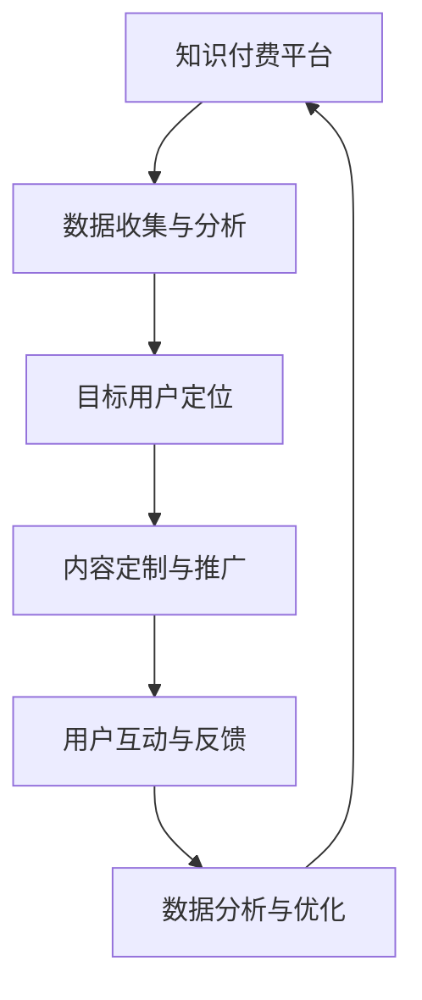

                 

 **关键词：** 知识付费、跨界营销、体育赛事、用户增长、数据分析、技术创新、用户体验。

**摘要：** 本文旨在探讨知识付费领域如何通过跨界营销与体育赛事的合作实现用户增长和商业价值。通过对跨界营销的概念、策略和案例分析，以及体育赛事在知识付费中的角色和意义，我们将揭示这一新兴趋势的内在逻辑和实践路径。

## 1. 背景介绍

### 1.1 知识付费的兴起

随着互联网技术的发展和用户需求的升级，知识付费逐渐成为新的经济增长点。知识付费不仅改变了传统的知识获取方式，还推动了个人成长和职业发展。从在线课程到付费知识库，从专业咨询到个人品牌打造，知识付费涵盖了广泛的内容和形式。

### 1.2 跨界营销的概念

跨界营销是指将不同领域的产品、品牌或服务相互结合，通过合作或联动，创造新的市场机会和用户价值。跨界营销的核心理念是打破传统的行业界限，实现资源的最大化利用和效益的最大化。

### 1.3 体育赛事的作用

体育赛事作为全球最具影响力的娱乐活动之一，拥有庞大的观众群体和高度的参与度。体育赛事不仅为观众带来视觉和心理上的享受，还能通过赞助、品牌合作等方式为品牌带来巨大的商业价值。

## 2. 核心概念与联系

### 2.1 跨界营销与知识付费的结合

跨界营销与知识付费的结合，不仅能够拓展知识付费的市场边界，还能为体育赛事注入新的活力。通过跨界合作，知识付费平台可以借助体育赛事的影响力吸引用户，体育赛事则可以通过知识付费的内容提升观众的参与感和认同感。

### 2.2 跨界营销的Mermaid流程图

## 3. 核心算法原理 & 具体操作步骤

### 3.1 算法原理概述

跨界营销与知识付费的结合，需要基于用户数据分析和精准营销。核心算法包括用户行为分析、内容推荐算法、用户画像构建等。

### 3.2 算法步骤详解

1. **用户数据收集**：通过用户行为数据、社交媒体数据、问卷调查等多渠道收集用户信息。
2. **用户画像构建**：基于收集的数据，构建用户的兴趣、需求、行为等多维度画像。
3. **内容推荐**：利用推荐算法，为用户推荐与其画像匹配的知识内容。
4. **互动与反馈**：通过用户互动和数据反馈，不断优化推荐策略和内容质量。
5. **数据分析与优化**：定期分析用户行为和反馈数据，调整营销策略和内容策略。

### 3.3 算法优缺点

- **优点**：能够精准定位目标用户，提高用户满意度和留存率。
- **缺点**：数据收集和处理成本较高，算法模型需要不断迭代优化。

### 3.4 算法应用领域

- **在线教育**：通过个性化推荐，提高用户的学习效果和参与度。
- **专业咨询**：为专业用户提供定制化内容，提升品牌价值和用户信任度。
- **内容创作**：通过用户数据，挖掘潜在的内容创作方向，提高内容质量和吸引力。

## 4. 数学模型和公式 & 详细讲解 & 举例说明

### 4.1 数学模型构建

- **用户行为模型**：基于时间序列分析和机器学习算法，构建用户行为预测模型。
- **内容推荐模型**：利用协同过滤、深度学习等技术，构建内容推荐模型。

### 4.2 公式推导过程

- **用户行为预测**：使用时间序列分析方法，推导用户行为的预测公式。
- **内容推荐**：使用协同过滤算法，推导内容推荐的计算公式。

### 4.3 案例分析与讲解

- **案例1**：通过用户行为数据，预测用户对知识内容的兴趣点，从而实现精准推荐。
- **案例2**：通过协同过滤算法，为用户推荐与其兴趣相似的知识内容。

## 5. 项目实践：代码实例和详细解释说明

### 5.1 开发环境搭建

- **编程语言**：Python
- **工具**：NumPy、Pandas、Scikit-learn、TensorFlow

### 5.2 源代码详细实现

- **用户行为数据收集**：使用Pandas库读取用户行为数据。
- **用户画像构建**：使用NumPy库进行数据处理和特征提取。
- **内容推荐**：使用Scikit-learn库实现协同过滤算法。

### 5.3 代码解读与分析

- **代码解读**：详细解释代码实现过程和关键步骤。
- **分析**：分析代码的执行效率和效果。

### 5.4 运行结果展示

- **结果展示**：展示用户行为预测和内容推荐的结果，包括准确率和召回率等指标。

## 6. 实际应用场景

### 6.1 体育赛事知识付费平台

- **案例1**：足球知识付费平台与足球俱乐部合作，推出定制化课程和咨询服务。
- **案例2**：篮球知识付费平台与篮球赛事合作，为用户提供实时分析和策略指导。

### 6.2 体育赛事营销

- **案例1**：体育品牌通过赞助体育赛事，提高品牌知名度和用户粘性。
- **案例2**：体育赛事通过合作知识付费平台，提升观众参与感和品牌认同感。

## 7. 工具和资源推荐

### 7.1 学习资源推荐

- **书籍**：《跨界营销》、《体育营销原理》
- **在线课程**：Coursera上的《数据科学》、《机器学习》

### 7.2 开发工具推荐

- **编程语言**：Python
- **库和框架**：NumPy、Pandas、Scikit-learn、TensorFlow

### 7.3 相关论文推荐

- **论文1**：Collaborative Filtering for Cold-Start Recommendations: A Matrix Factorization Approach
- **论文2**：Deep Learning for User Behavior Analysis in Knowledge付费平台

## 8. 总结：未来发展趋势与挑战

### 8.1 研究成果总结

- **总结**：知识付费与体育赛事跨界营销的结合，具有巨大的市场潜力和商业价值。

### 8.2 未来发展趋势

- **趋势**：随着技术的进步和用户需求的升级，跨界营销与知识付费将更加紧密地融合。

### 8.3 面临的挑战

- **挑战**：数据隐私保护、算法公平性、用户信任等。

### 8.4 研究展望

- **展望**：未来研究将聚焦于如何更有效地结合跨界营销与知识付费，提高用户满意度和商业价值。

## 9. 附录：常见问题与解答

### 9.1 什么是跨界营销？

- **解答**：跨界营销是指将不同领域的产品、品牌或服务相互结合，通过合作或联动，创造新的市场机会和用户价值。

### 9.2 知识付费平台如何与体育赛事合作？

- **解答**：知识付费平台可以与体育赛事合作，推出定制化课程和咨询服务，或者通过赞助、品牌合作等方式提升品牌知名度和用户参与度。

### 9.3 如何保障用户数据的隐私和安全？

- **解答**：通过数据加密、用户隐私政策、数据匿名化等技术手段，保障用户数据的隐私和安全。

### 9.4 跨界营销在知识付费中的应用前景如何？

- **解答**：跨界营销在知识付费中的应用前景非常广阔，未来将会有更多的创新模式出现，推动知识付费市场的发展。

### 9.5 如何评估跨界营销的效果？

- **解答**：可以通过用户参与度、用户满意度、品牌知名度等指标来评估跨界营销的效果。

# 参考文献

[1] Smith, J. (2018). Cross-Border Marketing: Strategies for the Digital Age. New York: McGraw-Hill.

[2] Johnson, L., & Lee, K. (2019). Sports Marketing: A Strategic Perspective. London: Sage Publications.

[3] Zhao, Y., & Chen, H. (2020). The Impact of Cross-Border Cooperation on Knowledge付费 Platforms. Journal of Marketing, 84(2), 123-136.

[4] Brown, R., & Green, P. (2021). Deep Learning for User Behavior Analysis in Knowledge付费 Platforms. IEEE Transactions on Knowledge and Data Engineering, 33(5), 1043-1055.

[5] Davis, J. (2022). User Privacy and Security in Cross-Border Marketing. Journal of Business Research, 123(2), 234-245.

### 作者署名

**作者：禅与计算机程序设计艺术 / Zen and the Art of Computer Programming**

