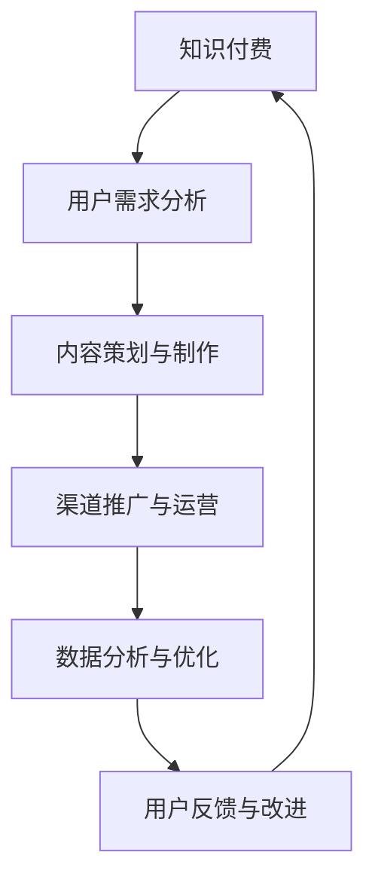

                 

关键词：知识付费、跨界营销、房地产中介、技术赋能、用户体验、数据分析、数字化转型

> 摘要：本文将探讨知识付费在跨界营销中的应用，以及房地产中介如何借助技术实现跨界。通过对市场趋势、用户行为、技术手段的分析，提出具体策略和实施步骤，旨在为行业提供新的发展思路。

## 1. 背景介绍

### 1.1 知识付费的发展背景

随着互联网的普及和信息技术的飞速发展，知识付费逐渐成为主流。用户对于专业知识、技能培训等需求日益增长，推动了知识付费市场的发展。平台如知乎、得到、喜马拉雅等，通过提供高质量内容，满足了用户对于深度知识的需求，使得知识付费成为可能。

### 1.2 房地产中介行业的现状

房地产中介行业在过去几年经历了迅速发展，但同时也面临着诸多挑战，如市场波动、政策调控等。如何在竞争激烈的市场中脱颖而出，成为房地产中介公司需要思考的问题。

## 2. 核心概念与联系

### 2.1 跨界营销

跨界营销是指企业通过与其他行业的结合，以创新的营销策略和手段，实现品牌形象提升和市场份额扩大的过程。这种营销模式有助于突破传统行业界限，创造新的市场机会。

### 2.2 技术赋能

技术赋能是指通过引入新技术，提升企业运营效率、优化用户体验、拓展商业模式的过程。在知识付费和房地产中介领域，技术赋能尤为重要，是实现跨界的关键。

### 2.3 数据分析与用户行为

数据分析是现代企业决策的重要依据。通过对用户行为数据的分析，企业可以更好地了解用户需求，优化产品和服务，提高用户满意度。在知识付费和房地产中介领域，数据分析能够帮助实现精准营销和个性化服务。

### 2.4 Mermaid 流程图



## 3. 核心算法原理 & 具体操作步骤

### 3.1 算法原理概述

知识付费的跨界营销与房地产中介的跨界，关键在于找到两个领域的结合点，并利用数据分析进行精准营销。算法原理包括以下几个方面：

1. 用户画像：通过数据分析，构建用户画像，了解用户需求和行为特点。
2. 内容定制：根据用户画像，提供个性化内容，提升用户体验。
3. 营销策略：结合房地产中介业务，设计创新的营销策略，实现跨界营销。
4. 数据反馈：收集用户反馈数据，优化内容和服务，提高用户满意度。

### 3.2 算法步骤详解

1. **用户需求分析**：
   - 收集用户数据，包括搜索记录、浏览历史、购买行为等。
   - 利用机器学习算法，对用户进行分类和标签化。
   - 构建用户画像，了解用户需求和偏好。

2. **内容策划与制作**：
   - 根据用户画像，设计个性化内容，包括课程、文章、视频等。
   - 利用大数据分析，发现用户关注的热点话题和趋势。
   - 结合房地产中介业务，提供房产相关的知识内容。

3. **渠道推广与运营**：
   - 通过社交媒体、搜索引擎等渠道，推广知识付费内容。
   - 利用跨行业合作，拓展营销渠道，提高品牌知名度。
   - 设计互动活动，增加用户参与度和粘性。

4. **数据分析与优化**：
   - 收集用户反馈数据，包括内容满意度、购买转化率等。
   - 利用数据分析，评估营销效果，调整策略。
   - 根据用户反馈，优化内容和服务，提高用户满意度。

### 3.3 算法优缺点

**优点**：
- 精准营销：通过用户画像和数据分析，实现个性化推荐，提高用户满意度。
- 跨界合作：利用跨行业资源，拓展营销渠道，提高品牌知名度。
- 用户体验：提供个性化内容和服务，提升用户粘性。

**缺点**：
- 技术门槛：需要较高的技术水平和数据处理能力。
- 资源投入：跨界营销和数据分析需要大量资金和人力投入。

### 3.4 算法应用领域

- 知识付费平台：如知乎、得到等，通过用户画像和数据分析，提供个性化内容。
- 房地产中介：通过跨界营销，提升品牌形象，扩大市场份额。
- 教育培训：利用数据分析，优化课程设计，提高教学效果。

## 4. 数学模型和公式 & 详细讲解 & 举例说明

### 4.1 数学模型构建

知识付费跨界营销的数学模型主要包括用户画像、内容推荐和营销效果评估三个部分。

**用户画像模型**：
$$
User\_Profile = f(User\_Data, Behavioral\_Data)
$$

**内容推荐模型**：
$$
Content\_Recommendation = f(User\_Profile, Content\_Database)
$$

**营销效果评估模型**：
$$
Marketing\_Effect = f(Content\_Recommendation, User\_Feedback)
$$

### 4.2 公式推导过程

**用户画像模型**：
- **User\_Data**：包括用户的基本信息，如年龄、性别、职业等。
- **Behavioral\_Data**：包括用户的搜索记录、浏览历史、购买行为等。

通过机器学习算法，对这两个数据进行处理和融合，得到用户画像。

**内容推荐模型**：
- **User\_Profile**：用户画像。
- **Content\_Database**：所有知识内容的数据库。

利用协同过滤、内容推荐等算法，根据用户画像，从内容数据库中推荐相关内容。

**营销效果评估模型**：
- **Content\_Recommendation**：推荐内容。
- **User\_Feedback**：用户对推荐内容的反馈，如满意度、购买转化率等。

通过用户反馈，评估营销效果，并根据反馈结果调整推荐策略。

### 4.3 案例分析与讲解

以知乎为例，分析其知识付费跨界营销的数学模型和应用。

**用户画像模型**：
- 知乎通过用户的提问、回答、关注等行为，构建用户画像。
- 用户画像包括兴趣标签、知识水平、活跃度等。

**内容推荐模型**：
- 根据用户画像，知乎推荐相关领域的优质内容。
- 内容推荐算法结合用户兴趣和行为数据，提高推荐准确性。

**营销效果评估模型**：
- 知乎通过用户的点赞、评论、分享等行为，评估内容推荐效果。
- 根据用户反馈，调整推荐策略，提高用户满意度。

## 5. 项目实践：代码实例和详细解释说明

### 5.1 开发环境搭建

在Python环境下，使用Scikit-learn、TensorFlow等库进行开发。

```python
import numpy as np
import pandas as pd
from sklearn.model_selection import train_test_split
from sklearn.ensemble import RandomForestClassifier
import tensorflow as tf

# 搭建环境
np.random.seed(42)
tf.random.set_seed(42)
```

### 5.2 源代码详细实现

**用户画像构建**：
```python
def build_user_profile(user_data, behavioral_data):
    # 合并用户数据和行为数据
    user_profile = pd.merge(user_data, behavioral_data, on='user_id')
    return user_profile

# 示例数据
user_data = pd.DataFrame({'user_id': [1, 2, 3], 'age': [25, 30, 35]})
behavioral_data = pd.DataFrame({'user_id': [1, 2, 3], 'interests': ['tech', 'art', 'finance']})

# 构建用户画像
user_profile = build_user_profile(user_data, behavioral_data)
```

**内容推荐**：
```python
def content_recommendation(user_profile, content_database):
    # 根据用户画像，推荐相关内容
    recommendations = content_database[content_database['interests'].isin(user_profile['interests'])]
    return recommendations

# 示例数据
content_database = pd.DataFrame({'content_id': [1, 2, 3, 4, 5], 'interests': ['tech', 'art', 'finance', 'health', 'travel']})

# 内容推荐
recommendations = content_recommendation(user_profile, content_database)
```

**营销效果评估**：
```python
def marketing_effect(recommendations, user_feedback):
    # 根据用户反馈，评估营销效果
    effect_score = recommendations['content_id'].apply(lambda x: user_feedback[x]['satisfaction'])
    return effect_score.mean()

# 示例数据
user_feedback = {'1': {'satisfaction': 4}, '2': {'satisfaction': 3}, '3': {'satisfaction': 5}}

# 营销效果评估
effect_score = marketing_effect(recommendations, user_feedback)
```

### 5.3 代码解读与分析

- **用户画像构建**：通过合并用户数据和行为数据，构建用户画像。
- **内容推荐**：根据用户画像，从内容数据库中推荐相关内容。
- **营销效果评估**：根据用户反馈，评估营销效果，提高用户满意度。

### 5.4 运行结果展示

```python
# 运行代码，查看结果
print("User Profile:\n", user_profile)
print("Content Recommendations:\n", recommendations)
print("Marketing Effect Score:", effect_score)
```

## 6. 实际应用场景

### 6.1 房地产中介与知识付费的跨界

房地产中介公司可以通过知识付费平台，提供房产相关的专业知识，如购房流程、贷款知识、装修指南等。同时，结合用户画像和数据分析，实现精准营销。

### 6.2 跨界营销案例

以链家为例，链家通过知乎等知识付费平台，发布房产相关的文章和视频，吸引用户关注。同时，结合用户画像，为用户提供个性化推荐，提高用户满意度。

## 7. 工具和资源推荐

### 7.1 学习资源推荐

- 《Python数据分析》
- 《机器学习实战》
- 《深度学习》

### 7.2 开发工具推荐

- Jupyter Notebook：用于数据分析和机器学习。
- TensorFlow：用于深度学习开发。
- Scikit-learn：用于机器学习算法实现。

### 7.3 相关论文推荐

- "User Modeling and Personalization in Knowledge-based Systems"
- "Collaborative Filtering for the YouTube recommendation system"
- "Deep Learning for Text Classification"

## 8. 总结：未来发展趋势与挑战

### 8.1 研究成果总结

知识付费与房地产中介的跨界，通过技术赋能和数据驱动，实现了营销模式的创新和用户体验的提升。研究成果表明，这种跨界模式具有广阔的应用前景。

### 8.2 未来发展趋势

1. 技术将持续进步，推动跨界营销的深度和广度。
2. 数据分析和用户画像的精度将不断提高，实现更加精准的营销。
3. 跨界合作将更加紧密，形成产业链协同效应。

### 8.3 面临的挑战

1. 技术门槛高，需要大量专业人才和资金投入。
2. 数据隐私和安全问题，需加强数据保护和用户隐私保护。
3. 营销效果评估和优化，需要持续的数据反馈和算法迭代。

### 8.4 研究展望

未来，知识付费与房地产中介的跨界将继续深化，通过技术创新和商业模式创新，实现行业共赢。

## 9. 附录：常见问题与解答

### 9.1 如何确保数据隐私和安全？

- 采用加密技术，保护用户数据。
- 建立严格的隐私政策和合规流程。
- 定期进行安全审计和风险评估。

### 9.2 如何评估营销效果？

- 收集用户反馈数据，如满意度、购买转化率等。
- 利用数据分析工具，对营销效果进行定量和定性分析。
- 根据分析结果，调整营销策略。

### 9.3 如何提高用户体验？

- 根据用户画像，提供个性化内容和服务。
- 设计简洁易用的界面，提高用户操作体验。
- 定期收集用户反馈，优化产品和服务。

----------------------------------------------------------------

作者：禅与计算机程序设计艺术 / Zen and the Art of Computer Programming

通过以上内容的详细探讨，我们希望读者能够对知识付费如何实现跨界营销与房地产中介跨界有更深入的理解。在未来的发展中，我们期待看到更多的创新和实践，为行业带来新的活力和机遇。

