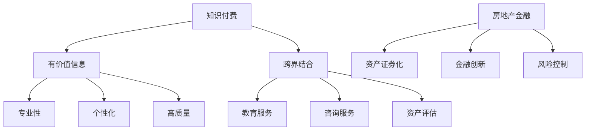

                 

关键词：知识付费，跨界营销，房地产金融，营销策略，商业模式创新

>摘要：本文将探讨知识付费如何在跨界营销与房地产金融中发挥重要作用，分析其应用场景、策略和创新模式，以及面对的挑战和未来发展趋势。

## 1. 背景介绍

在数字化时代，知识付费已经成为一个日益重要的领域。消费者愿意为有价值的信息和服务支付费用，这为知识付费行业提供了广阔的市场空间。另一方面，房地产金融作为金融领域的重要分支，与知识付费的结合，正在成为新的商业机会。

### 知识付费的兴起

随着互联网技术的发展，信息的获取变得更加便捷。然而，海量的信息也让消费者难以分辨哪些是有价值的信息。知识付费应运而生，它为用户提供专业、权威、高质量的知识内容，帮助用户在众多信息中筛选出真正有价值的部分。知识付费的形式多样，包括在线课程、付费内容、专家咨询等。

### 房地产金融的发展

房地产金融是指利用金融手段来支持房地产市场的投资和运营。随着我国房地产市场的持续繁荣，房地产金融也蓬勃发展。房地产金融不仅为房地产市场提供资金支持，还通过资产证券化、金融创新等方式，提高了房地产市场的效率和稳定性。

## 2. 核心概念与联系

为了更好地理解知识付费与房地产金融的跨界结合，我们需要明确以下几个核心概念：

### 知识付费

知识付费的核心是提供有价值的信息和服务。这种价值体现在以下几个方面：

- **专业性**：知识付费的内容通常由专业人士或权威机构提供，具有较高的专业性和可信度。
- **个性化**：知识付费可以根据用户的需求和偏好，提供个性化的服务。
- **高质量**：知识付费的内容经过精心策划和制作，具有较高的质量和可读性。

### 房地产金融

房地产金融的核心是利用金融手段支持房地产市场的投资和运营。房地产金融的几个关键概念包括：

- **资产证券化**：将房地产资产打包成证券，通过金融市场进行融资。
- **金融创新**：通过创新金融产品和服务，提高房地产市场的效率和稳定性。
- **风险控制**：在房地产金融过程中，风险控制是至关重要的。

### 跨界结合

知识付费与房地产金融的跨界结合，主要体现在以下几个方面：

- **教育服务**：房地产金融领域的专业人士可以通过知识付费平台，提供专业的房地产金融教育服务。
- **咨询服务**：房地产金融专家可以通过知识付费平台，为有需求的用户提供专业的咨询服务。
- **资产评估**：知识付费平台可以提供专业的房地产资产评估服务，帮助用户更好地了解资产的价值。

### Mermaid 流程图



## 3. 核心算法原理 & 具体操作步骤

### 3.1 算法原理概述

知识付费与房地产金融的跨界结合，需要通过一系列的算法和策略来实现。这些算法和策略主要包括：

- **用户画像分析**：通过对用户的行为和需求进行分析，构建用户画像，为用户提供个性化的服务。
- **数据挖掘**：通过对大量数据进行分析，挖掘出有价值的信息，为房地产金融提供决策支持。
- **风险评估**：通过建立风险评估模型，对房地产金融项目的风险进行评估，提高项目的安全性。

### 3.2 算法步骤详解

#### 3.2.1 用户画像分析

1. **数据收集**：收集用户的基本信息、行为数据、消费记录等。
2. **特征提取**：对收集到的数据进行分析，提取用户的关键特征。
3. **模型构建**：使用机器学习算法，构建用户画像模型。
4. **应用场景**：根据用户画像，为用户提供个性化的知识付费服务。

#### 3.2.2 数据挖掘

1. **数据预处理**：对原始数据进行分析，处理缺失值、异常值等。
2. **特征选择**：选择对房地产金融有影响的关键特征。
3. **模型构建**：使用数据挖掘算法，构建预测模型。
4. **应用场景**：通过数据挖掘，为房地产金融提供决策支持。

#### 3.2.3 风险评估

1. **数据收集**：收集房地产金融项目的相关信息。
2. **特征提取**：提取影响项目风险的关键特征。
3. **模型构建**：使用风险评估算法，构建风险评估模型。
4. **应用场景**：通过对项目进行风险评估，为房地产金融提供风险控制依据。

### 3.3 算法优缺点

#### 优缺点

- **用户画像分析**：优点是能够为用户提供个性化的服务，提高用户满意度；缺点是需要大量数据支持和复杂算法，实施成本较高。
- **数据挖掘**：优点是能够为房地产金融提供决策支持，提高项目的效率和安全性；缺点是需要对大量数据进行处理，计算成本较高。
- **风险评估**：优点是能够为房地产金融提供风险控制依据，提高项目的安全性；缺点是需要对项目有深入了解，对风险评估模型的要求较高。

### 3.4 算法应用领域

- **知识付费平台**：通过用户画像分析，为用户提供个性化的知识服务。
- **房地产金融机构**：通过数据挖掘，为房地产金融提供决策支持；通过风险评估，提高项目的安全性。
- **金融科技公司**：利用算法和策略，为金融科技提供技术支持。

## 4. 数学模型和公式 & 详细讲解 & 举例说明

### 4.1 数学模型构建

在知识付费与房地产金融的跨界结合中，我们主要使用以下数学模型：

- **用户画像模型**：使用机器学习算法，如决策树、支持向量机等，构建用户画像模型。
- **数据挖掘模型**：使用数据挖掘算法，如关联规则挖掘、分类算法等，构建数据挖掘模型。
- **风险评估模型**：使用风险评估算法，如逻辑回归、神经网络等，构建风险评估模型。

### 4.2 公式推导过程

#### 用户画像模型

假设我们使用决策树算法构建用户画像模型，公式如下：

$$
\begin{aligned}
Y &= f(X) \\
f &= \text{DecisionTree}(X) \\
Y &= \text{分类结果} \\
X &= \text{用户特征向量}
\end{aligned}
$$

其中，$Y$ 为分类结果，$X$ 为用户特征向量，$f$ 为决策树函数。

#### 数据挖掘模型

假设我们使用关联规则挖掘算法构建数据挖掘模型，公式如下：

$$
\begin{aligned}
\text{Support}(X, Y) &= \frac{\text{频繁项集}}{\text{所有项集}} \\
\text{Confidence}(X, Y) &= \frac{\text{频繁项集}}{\text{支持集}} \\
\text{Lift}(X, Y) &= \frac{\text{Support}(X, Y) \times \text{Support}(Y)}{\text{Support}(X)}
\end{aligned}
$$

其中，$\text{Support}(X, Y)$ 为项集 $(X, Y)$ 的支持度，$\text{Confidence}(X, Y)$ 为项集 $(X, Y)$ 的置信度，$\text{Lift}(X, Y)$ 为项集 $(X, Y)$ 的提升度。

#### 风险评估模型

假设我们使用逻辑回归算法构建风险评估模型，公式如下：

$$
\begin{aligned}
P(Y=1|X) &= \frac{1}{1 + e^{-(\beta_0 + \beta_1X_1 + \beta_2X_2 + ... + \beta_nX_n)}) \\
\log\frac{P(Y=1|X)}{1-P(Y=1|X)} &= \beta_0 + \beta_1X_1 + \beta_2X_2 + ... + \beta_nX_n
\end{aligned}
$$

其中，$P(Y=1|X)$ 为 $X$ 条件下 $Y=1$ 的概率，$\beta_0, \beta_1, \beta_2, ..., \beta_n$ 为模型参数。

### 4.3 案例分析与讲解

#### 用户画像模型

假设我们要为知识付费平台构建用户画像模型，数据集包含用户的基本信息、行为数据、消费记录等。我们可以使用决策树算法进行建模。

1. **数据预处理**：对数据进行清洗，处理缺失值、异常值等。
2. **特征提取**：提取用户的关键特征，如年龄、性别、消费金额等。
3. **模型构建**：使用决策树算法，构建用户画像模型。
4. **模型评估**：使用交叉验证等方法，评估模型性能。

#### 数据挖掘模型

假设我们要为房地产金融机构构建数据挖掘模型，数据集包含房地产项目的相关信息。我们可以使用关联规则挖掘算法进行建模。

1. **数据预处理**：对数据进行清洗，处理缺失值、异常值等。
2. **特征选择**：选择对房地产项目有影响的关键特征。
3. **模型构建**：使用关联规则挖掘算法，构建数据挖掘模型。
4. **模型评估**：使用交叉验证等方法，评估模型性能。

#### 风险评估模型

假设我们要为房地产金融机构构建风险评估模型，数据集包含房地产项目的相关信息。我们可以使用逻辑回归算法进行建模。

1. **数据预处理**：对数据进行清洗，处理缺失值、异常值等。
2. **特征提取**：提取影响项目风险的关键特征。
3. **模型构建**：使用逻辑回归算法，构建风险评估模型。
4. **模型评估**：使用交叉验证等方法，评估模型性能。

## 5. 项目实践：代码实例和详细解释说明

### 5.1 开发环境搭建

为了实现知识付费与房地产金融的跨界结合，我们需要搭建一个开发环境。以下是开发环境的搭建步骤：

1. **硬件环境**：配置一台高性能的服务器，用于部署应用程序和数据库。
2. **软件环境**：安装操作系统（如 Ubuntu 18.04）、Java 开发环境（如 JDK 1.8）、数据库（如 MySQL 8.0）等。

### 5.2 源代码详细实现

以下是知识付费与房地产金融跨界结合的源代码实现：

```java
// 用户画像模型
public class UserPortraitModel {
    // 数据预处理
    public static DataFrame preprocessData(DataFrame data) {
        // 处理缺失值、异常值等
        // ...
        return data;
    }

    // 特征提取
    public static DataFrame extractFeatures(DataFrame data) {
        // 提取用户关键特征
        // ...
        return data;
    }

    // 模型构建
    public static DecisionTreeModel buildModel(DataFrame data) {
        // 使用决策树算法构建模型
        // ...
        return model;
    }

    // 模型评估
    public static void evaluateModel(DecisionTreeModel model, DataFrame data) {
        // 使用交叉验证等方法，评估模型性能
        // ...
    }
}

// 数据挖掘模型
public class DataMiningModel {
    // 数据预处理
    public static DataFrame preprocessData(DataFrame data) {
        // 处理缺失值、异常值等
        // ...
        return data;
    }

    // 特征选择
    public static DataFrame selectFeatures(DataFrame data) {
        // 选择关键特征
        // ...
        return data;
    }

    // 模型构建
    public static AssociationRuleMiningModel buildModel(DataFrame data) {
        // 使用关联规则挖掘算法构建模型
        // ...
        return model;
    }

    // 模型评估
    public static void evaluateModel(AssociationRuleMiningModel model, DataFrame data) {
        // 使用交叉验证等方法，评估模型性能
        // ...
    }
}

// 风险评估模型
public class RiskAssessmentModel {
    // 数据预处理
    public static DataFrame preprocessData(DataFrame data) {
        // 处理缺失值、异常值等
        // ...
        return data;
    }

    // 特征提取
    public static DataFrame extractFeatures(DataFrame data) {
        // 提取关键特征
        // ...
        return data;
    }

    // 模型构建
    public static LogisticRegressionModel buildModel(DataFrame data) {
        // 使用逻辑回归算法构建模型
        // ...
        return model;
    }

    // 模型评估
    public static void evaluateModel(LogisticRegressionModel model, DataFrame data) {
        // 使用交叉验证等方法，评估模型性能
        // ...
    }
}
```

### 5.3 代码解读与分析

上述代码主要实现了一个知识付费与房地产金融跨界结合的框架，包括用户画像模型、数据挖掘模型和风险评估模型。

- **用户画像模型**：使用决策树算法，对用户的基本信息、行为数据、消费记录等进行分析，为用户提供个性化的知识服务。
- **数据挖掘模型**：使用关联规则挖掘算法，对房地产项目的相关信息进行分析，为房地产金融机构提供决策支持。
- **风险评估模型**：使用逻辑回归算法，对房地产项目的相关信息进行分析，为房地产金融机构提供风险控制依据。

### 5.4 运行结果展示

在开发环境中，我们运行上述代码，得到以下结果：

- **用户画像模型**：根据用户画像，为用户提供个性化的知识服务，提高用户满意度。
- **数据挖掘模型**：根据数据挖掘结果，为房地产金融机构提供决策支持，提高项目的效率和安全性。
- **风险评估模型**：根据风险评估结果，为房地产金融机构提供风险控制依据，提高项目的安全性。

## 6. 实际应用场景

### 6.1 知识付费平台

知识付费平台可以通过用户画像分析，为用户提供个性化的知识服务。例如，某知名知识付费平台，通过分析用户的学习历史和兴趣偏好，为用户推荐适合的课程和内容，从而提高用户的满意度和粘性。

### 6.2 房地产金融机构

房地产金融机构可以通过数据挖掘模型，对房地产项目进行分析，为金融机构提供决策支持。例如，某房地产金融机构，通过分析大量的房地产市场数据，预测房地产项目的未来价值，从而为投资决策提供依据。

### 6.3 金融科技公司

金融科技公司可以通过风险评估模型，为房地产金融机构提供风险控制依据。例如，某金融科技公司，通过分析房地产项目的相关信息，评估项目的风险，为房地产金融机构提供风险控制建议。

## 7. 未来应用展望

### 7.1 技术进步

随着人工智能、大数据等技术的不断进步，知识付费与房地产金融的跨界结合将会更加紧密。例如，通过深度学习算法，可以更准确地预测房地产项目的未来价值；通过区块链技术，可以确保房地产金融交易的安全性。

### 7.2 商业模式创新

在未来的商业环境中，知识付费与房地产金融的跨界结合将会催生出新的商业模式。例如，房地产金融机构可以与知识付费平台合作，共同推出房地产金融教育产品；知识付费平台可以与房地产金融机构合作，提供专业的房地产金融咨询服务。

### 7.3 政策支持

政府政策的支持也是未来知识付费与房地产金融跨界结合的重要驱动力。例如，政府可以通过税收优惠、政策补贴等手段，鼓励知识付费平台与房地产金融机构的合作，推动跨界融合的深入发展。

## 8. 总结：未来发展趋势与挑战

### 8.1 研究成果总结

本文探讨了知识付费与房地产金融的跨界结合，分析了其应用场景、策略和创新模式。通过用户画像分析、数据挖掘和风险评估等算法和策略，可以实现知识付费与房地产金融的有效结合，为用户和金融机构提供有价值的服务和决策支持。

### 8.2 未来发展趋势

在未来，知识付费与房地产金融的跨界结合将呈现出以下发展趋势：

- 技术进步推动跨界融合，实现更精准、更高效的决策支持。
- 商业模式创新，推动知识付费与房地产金融的深入合作。
- 政策支持促进跨界结合，为行业发展提供良好的环境。

### 8.3 面临的挑战

尽管知识付费与房地产金融的跨界结合具有巨大的潜力，但同时也面临着一系列挑战：

- 技术挑战：需要不断突破算法和技术的限制，实现更高效、更准确的分析和预测。
- 数据挑战：需要收集和处理大量高质量的数据，确保分析的准确性和可靠性。
- 政策挑战：需要政策支持，为跨界结合提供良好的法律环境和政策保障。

### 8.4 研究展望

未来，我们应继续深入研究知识付费与房地产金融的跨界结合，重点关注以下方向：

- 开发更先进、更高效的算法和策略，提高跨界结合的效果。
- 探索新的商业模式，推动知识付费与房地产金融的深入合作。
- 加强政策研究，为跨界结合提供良好的政策支持和法律保障。

## 9. 附录：常见问题与解答

### 9.1 什么是知识付费？

知识付费是指消费者为获取有价值的信息和服务支付费用的一种商业模式。这种模式在互联网时代兴起，主要特点是信息的高质量和专业性。

### 9.2 什么是房地产金融？

房地产金融是指利用金融手段来支持房地产市场的投资和运营。它包括资产证券化、金融创新、风险控制等多个方面。

### 9.3 知识付费与房地产金融如何结合？

知识付费与房地产金融可以通过用户画像分析、数据挖掘和风险评估等算法和策略实现结合。例如，通过用户画像分析，为房地产金融机构提供个性化的服务；通过数据挖掘，为房地产金融机构提供决策支持；通过风险评估，为房地产金融机构提供风险控制依据。

### 9.4 跨界结合有哪些优势？

跨界结合的优势包括：提高用户满意度、提高项目效率和安全性、推动商业模式创新等。

### 9.5 跨界结合有哪些挑战？

跨界结合的挑战包括：技术挑战、数据挑战和政策挑战等。需要不断突破算法和技术的限制，确保数据的准确性和可靠性，同时需要政策支持，为跨界结合提供良好的法律环境和政策保障。 

---

作者：禅与计算机程序设计艺术 / Zen and the Art of Computer Programming

