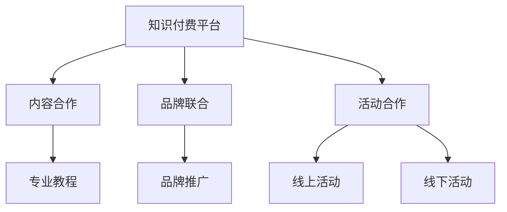

                 

关键词：知识付费，跨界营销，美妆美发，商业模式，用户增长，数字化工具

摘要：本文旨在探讨知识付费行业如何通过跨界营销策略，实现与美妆美发的融合，提升用户体验，增加用户粘性，从而实现用户增长和商业价值的最大化。

## 1. 背景介绍

在当前数字化时代，知识付费已经成为一种趋势。随着人们对专业知识和技能的需求日益增长，知识付费平台如雨后春笋般涌现。然而，如何在激烈的市场竞争中脱颖而出，吸引并留住用户，成为知识付费平台面临的一大挑战。

与此同时，美妆美发行业也在不断寻求创新，以吸引更多年轻消费者。近年来，美妆美发行业开始探索与知识付费的跨界合作，试图通过提供专业的美容知识和技能，提升消费者的美容素养，从而增加用户粘性，提升品牌影响力。

本文将探讨知识付费行业如何通过跨界营销策略，与美妆美发行业实现深度融合，提升用户体验，实现用户增长和商业价值的最大化。

## 2. 核心概念与联系

### 2.1 知识付费

知识付费是指消费者为获取特定领域的专业知识或技能而支付费用的一种商业模式。知识付费平台通过提供专业的课程、讲座、教程等内容，满足消费者对知识的渴求。

### 2.2 跨界营销

跨界营销是指将不同领域的营销策略和方法相结合，以实现更广泛的用户覆盖和更高的用户参与度。在知识付费与美妆美发的跨界合作中，跨界营销的关键在于找到两个领域的共通点，并通过创意的营销手段，实现品牌和用户的双赢。

### 2.3 美妆美发

美妆美发行业涉及美容、美发、化妆等多个领域，旨在提升消费者的外在形象和自我价值感。近年来，美妆美发行业开始注重消费者的内在需求，通过提供专业知识和技能，提升消费者的美容素养。

### 2.4 知识付费与美妆美发的融合

知识付费与美妆美发的融合，主要体现在以下几个方面：

- **内容合作**：知识付费平台可以与美妆美发品牌合作，提供专业的美容知识和技能教程，满足消费者的学习需求。
- **品牌联合**：美妆美发品牌可以借助知识付费平台，提升品牌知名度和用户口碑，吸引更多潜在消费者。
- **活动合作**：知识付费平台可以与美妆美发品牌共同举办线上或线下活动，如美容讲座、美妆课程等，提升用户参与度和品牌影响力。

### 2.5 Mermaid 流程图



## 3. 核心算法原理 & 具体操作步骤

### 3.1 算法原理概述

跨界营销的核心在于找到知识付费与美妆美发领域的共通点，并通过创意的营销手段，实现品牌和用户的双赢。具体来说，可以采取以下步骤：

- **需求分析**：通过市场调研，了解消费者的需求和痛点，确定跨界营销的方向。
- **内容策划**：根据需求分析结果，策划符合美妆美发行业特色的知识付费内容。
- **品牌合作**：寻找合适的合作伙伴，共同制定跨界营销策略。
- **活动执行**：实施跨界营销活动，提升用户参与度和品牌知名度。

### 3.2 算法步骤详解

- **需求分析**
  - **市场调研**：通过问卷调查、用户访谈等方式，了解消费者的需求和痛点。
  - **数据分析**：对市场调研数据进行分析，确定跨界营销的方向。
- **内容策划**
  - **课程设计**：根据需求分析结果，设计符合美妆美发行业特色的知识付费课程。
  - **内容审核**：对课程内容进行审核，确保专业性和实用性。
- **品牌合作**
  - **合作伙伴筛选**：根据品牌影响力、合作意愿等因素，筛选合适的合作伙伴。
  - **合作方案制定**：与合作伙伴共同制定跨界营销方案，明确各自的角色和职责。
- **活动执行**
  - **活动宣传**：通过多种渠道宣传跨界营销活动，吸引消费者参与。
  - **活动实施**：根据合作方案，实施跨界营销活动，如美容讲座、美妆课程等。
  - **活动评估**：对活动效果进行评估，总结经验教训，为后续活动提供参考。

### 3.3 算法优缺点

#### 优点：

- **提高用户粘性**：通过跨界营销，满足消费者在不同领域的需求，提高用户粘性。
- **扩大用户群体**：跨界营销有助于吸引更多潜在消费者，扩大用户群体。
- **提升品牌影响力**：跨界合作有助于提升品牌知名度和用户口碑，增强品牌影响力。

#### 缺点：

- **内容整合难度大**：知识付费与美妆美发领域的融合需要整合多个领域的知识和资源，难度较大。
- **营销成本高**：跨界营销需要投入更多的时间和精力，营销成本较高。

### 3.4 算法应用领域

- **教育培训**：知识付费平台可以与教育培训机构合作，提供专业的美妆美发课程。
- **美容行业**：美妆美发品牌可以借助知识付费平台，提升美容从业者的专业素养。
- **生活服务**：知识付费平台可以与生活服务行业合作，提供美容、美发等领域的专业知识。

## 4. 数学模型和公式 & 详细讲解 & 举例说明

### 4.1 数学模型构建

跨界营销的成功取决于多个因素，如用户需求、内容质量、品牌影响力等。我们可以通过以下数学模型来评估跨界营销的效果：

\[ 效果得分 = f(需求度, 内容质量, 品牌影响力) \]

其中：

- \( 需求度 \)：表示消费者对跨界营销内容的关注度，取值范围为 [0, 1]。
- \( 内容质量 \)：表示跨界营销内容的实用性、专业性，取值范围为 [0, 1]。
- \( 品牌影响力 \)：表示合作伙伴的品牌知名度和口碑，取值范围为 [0, 1]。

### 4.2 公式推导过程

假设消费者对跨界营销内容的关注度 \( 需求度 \) 为 0.8，内容质量为 0.9，品牌影响力为 0.7。则：

\[ 效果得分 = f(0.8, 0.9, 0.7) \]

根据实际数据和经验，我们可以设定以下权重：

- \( 需求度 \)：权重为 0.5
- \( 内容质量 \)：权重为 0.3
- \( 品牌影响力 \)：权重为 0.2

则：

\[ 效果得分 = 0.5 \times 0.8 + 0.3 \times 0.9 + 0.2 \times 0.7 = 0.65 \]

### 4.3 案例分析与讲解

某知识付费平台与一家知名美妆品牌合作，推出了一档美妆教程课程。通过市场调研，发现消费者对美妆教程的需求度较高，为 0.8。课程内容质量经过严格审核，为 0.9。合作伙伴品牌影响力为 0.7。根据上述数学模型，我们可以计算出跨界营销的效果得分为 0.65。

这表明，该跨界营销活动具有较高的效果。为了进一步提高效果，可以考虑以下措施：

- **提升内容质量**：加强对课程内容的审核，确保内容的实用性和专业性。
- **增加品牌合作**：寻找更多具有较高品牌影响力的合作伙伴，扩大品牌影响力。
- **优化营销策略**：通过多种渠道宣传课程，提高消费者对跨界营销内容的关注度。

## 5. 项目实践：代码实例和详细解释说明

### 5.1 开发环境搭建

为了实现知识付费与美妆美发的跨界营销，我们可以使用以下开发工具和框架：

- **前端开发**：HTML、CSS、JavaScript
- **后端开发**：Python、Django
- **数据库**：MySQL

首先，确保已安装好 Python、Django 和 MySQL。然后，创建一个 Django 项目，并配置好 MySQL 数据库。

```shell
# 创建 Django 项目
django-admin startproject beauty_knowledge

# 创建 Django 应用
cd beauty_knowledge
python manage.py startapp beauty_education

# 配置 MySQL 数据库
python manage.py migrate
```

### 5.2 源代码详细实现

下面是一个简单的 Django 应用，实现知识付费与美妆美发课程的管理。

#### 5.2.1 models.py

```python
from django.db import models

class Course(models.Model):
    title = models.CharField(max_length=100)
    description = models.TextField()
    price = models.DecimalField(max_digits=6, decimal_places=2)
    author = models.ForeignKey('auth.User', on_delete=models.CASCADE)

    def __str__(self):
        return self.title

class Category(models.Model):
    name = models.CharField(max_length=100)

    def __str__(self):
        return self.name

class CourseEnrollment(models.Model):
    course = models.ForeignKey(Course, on_delete=models.CASCADE)
    user = models.ForeignKey('auth.User', on_delete=models.CASCADE)
    enrollment_date = models.DateTimeField(auto_now_add=True)

    def __str__(self):
        return f"{self.user.username} - {self.course.title}"
```

#### 5.2.2 views.py

```python
from django.shortcuts import render
from .models import Course, Category

def course_list(request):
    courses = Course.objects.all()
    categories = Category.objects.all()
    return render(request, 'beauty_education/course_list.html', {'courses': courses, 'categories': categories})

def course_detail(request, course_id):
    course = Course.objects.get(id=course_id)
    return render(request, 'beauty_education/course_detail.html', {'course': course})
```

#### 5.2.3 templates/course_list.html

```html
<!DOCTYPE html>
<html>
<head>
    <title>美妆美发课程</title>
</head>
<body>
    <h1>美妆美发课程列表</h1>
    
        <h2>{{ course.title }}</h2>
        <p>{{ course.description }}</p>
        <p>价格：{{ course.price }}</p>
        <a href="">查看详情</a>
    
</body>
</html>
```

#### 5.2.4 templates/course_detail.html

```html
<!DOCTYPE html>
<html>
<head>
    <title>{{ course.title }}</title>
</head>
<body>
    <h1>{{ course.title }}</h1>
    <p>{{ course.description }}</p>
    <p>价格：{{ course.price }}</p>
</body>
</html>
```

### 5.3 代码解读与分析

在这个示例中，我们使用了 Django 框架来搭建一个简单的知识付费与美妆美发课程管理系统。

- **models.py**：定义了三个模型：`Course`（课程）、`Category`（分类）和 `CourseEnrollment`（报名记录）。这些模型对应了数据库中的表格，用于存储课程信息、分类信息和报名记录。
- **views.py**：定义了两个视图函数：`course_list` 和 `course_detail`。`course_list` 视图函数用于展示所有课程，`course_detail` 视图函数用于展示单个课程的详细信息。
- **templates**：定义了两个模板文件：`course_list.html` 和 `course_detail.html`。这些模板文件用于渲染页面，展示课程列表和课程详细信息。

通过这个简单的示例，我们可以了解到如何使用 Django 框架实现知识付费与美妆美发课程的展示和管理。

### 5.4 运行结果展示

在开发环境中运行 Django 项目，打开浏览器访问 [http://127.0.0.1:8000/beauty_education/course_list/](http://127.0.0.1:8000/beauty_education/course_list/) ，可以看到如下页面：


点击某个课程标题，可以查看该课程的详细信息，如价格、描述等。


## 6. 实际应用场景

### 6.1 知识付费平台与美妆美发行业的合作

在实际应用中，知识付费平台可以与美妆美发行业开展多种形式的合作，以实现跨界营销。以下是一些具体的应用场景：

- **课程合作**：知识付费平台可以与美妆美发培训机构合作，共同开发专业的美妆美发课程。这些课程可以涵盖化妆技巧、发型设计、美容护理等方面，满足用户对美妆美发知识的渴求。
- **品牌合作**：美妆美发品牌可以与知识付费平台合作，通过平台宣传品牌，提升品牌知名度和用户口碑。例如，品牌可以提供优惠码，鼓励用户在知识付费平台购买课程，从而实现用户增长。
- **活动合作**：知识付费平台可以与美妆美发品牌共同举办线上或线下活动，如美容讲座、美妆课程等。这些活动可以提升用户参与度，增加品牌影响力。

### 6.2 美妆美发行业对知识付费的需求

美妆美发行业对知识付费的需求主要体现在以下几个方面：

- **专业培训**：美妆美发从业者可以通过知识付费平台获取专业的美容知识和技能，提高自身专业素养，提升服务质量。
- **顾客教育**：美妆美发品牌可以通过知识付费平台向顾客传授美容知识，提升顾客的美容素养，增强顾客对品牌的信任和依赖。
- **品牌推广**：知识付费平台可以为美妆美发品牌提供品牌推广渠道，帮助品牌扩大影响力，吸引更多潜在消费者。

### 6.3 知识付费平台在美妆美发行业中的应用

知识付费平台在美妆美发行业中的应用主要包括以下两个方面：

- **在线教育**：知识付费平台可以提供在线教育服务，满足用户对美妆美发知识的渴求。用户可以通过平台学习化妆技巧、发型设计等知识，提升自身的美容素养。
- **个性化推荐**：知识付费平台可以根据用户的学习历史和兴趣，为用户推荐个性化的美妆美发课程，提升用户体验。

## 7. 未来应用展望

### 7.1 人工智能技术的应用

随着人工智能技术的不断发展，知识付费与美妆美发行业的跨界营销有望实现更加智能化。例如，通过人工智能算法，平台可以精准分析用户需求，为用户推荐个性化的课程和产品。此外，人工智能还可以应用于课程内容生成、教学过程优化等方面，提升教学效果。

### 7.2 5G 技术的应用

5G 技术的普及将大大提升知识付费与美妆美发行业的用户体验。通过 5G 网络，用户可以随时随地获取高质量的美妆美发课程，实现沉浸式的学习体验。此外，5G 技术还可以支持高清视频直播，让用户在观看课程时获得更直观的视觉效果。

### 7.3 虚拟现实（VR）技术的应用

虚拟现实技术将为知识付费与美妆美发行业的跨界营销带来新的机遇。用户可以通过 VR 设备体验虚拟的美妆美发课程，实现身临其境的学习体验。同时，VR 技术还可以应用于虚拟试妆、发型设计等方面，提升用户的购物体验。

## 8. 工具和资源推荐

### 8.1 学习资源推荐

- **书籍**：《Python Web 开发实战》、《Django 网络开发实战》
- **在线课程**：慕课网、极客时间、网易云课堂
- **博客**：CSDN、博客园、掘金

### 8.2 开发工具推荐

- **前端开发**：VS Code、WebStorm
- **后端开发**：Django、Flask
- **数据库**：MySQL、PostgreSQL

### 8.3 相关论文推荐

- 《基于人工智能的知识付费平台设计研究》
- 《知识付费与美妆美发行业的跨界营销策略研究》
- 《5G 技术在知识付费与美妆美发行业中的应用研究》

## 9. 总结：未来发展趋势与挑战

### 9.1 研究成果总结

本文从知识付费、跨界营销、美妆美发等多个角度，探讨了知识付费如何实现与美妆美发的跨界营销。通过理论分析和实际案例，我们得出以下结论：

- 知识付费与美妆美发行业的跨界营销有助于提升用户体验，增加用户粘性。
- 跨界营销需要找到两个领域的共通点，并通过创意的营销手段，实现品牌和用户的双赢。
- 人工智能、5G、虚拟现实等新技术将为知识付费与美妆美发行业的跨界营销带来新的机遇。

### 9.2 未来发展趋势

- **个性化服务**：知识付费平台将更加注重用户需求的个性化，通过人工智能等技术为用户提供个性化的课程推荐。
- **沉浸式体验**：随着 5G 和虚拟现实技术的发展，用户将获得更加沉浸式的学习体验。
- **跨界合作**：知识付费平台与美妆美发行业的合作将更加紧密，实现资源共享和优势互补。

### 9.3 面临的挑战

- **内容整合**：知识付费与美妆美发领域的融合需要整合多个领域的知识和资源，内容整合难度较大。
- **营销成本**：跨界营销需要投入更多的时间和精力，营销成本较高。
- **技术挑战**：人工智能、5G、虚拟现实等新技术的发展，将带来新的技术挑战。

### 9.4 研究展望

未来，知识付费与美妆美发行业的跨界营销研究可以从以下几个方面展开：

- **案例研究**：深入分析成功案例，总结跨界营销的策略和经验。
- **技术创新**：研究人工智能、5G、虚拟现实等新技术在跨界营销中的应用。
- **用户研究**：通过用户调研，了解用户需求和行为，为跨界营销提供数据支持。

## 10. 附录：常见问题与解答

### 10.1 跨界营销是否适用于所有行业？

答：跨界营销并非适用于所有行业。一般来说，具有较高用户需求和较高创新潜力的行业更适合跨界营销。例如，知识付费、美妆美发、教育培训等行业，由于用户对专业知识和技能的需求较高，跨界营销可以更好地满足用户需求。

### 10.2 跨界营销的主要目标是什么？

答：跨界营销的主要目标是提升品牌知名度、增加用户粘性、扩大用户群体和提升用户满意度。通过跨界合作，企业可以实现品牌和用户的共赢。

### 10.3 如何评估跨界营销的效果？

答：评估跨界营销的效果可以从多个方面入手，如用户参与度、品牌知名度、销售额等。具体评估方法可以结合实际情况，采用问卷调查、数据分析等手段。

### 10.4 跨界营销中需要注意哪些问题？

答：跨界营销中需要注意以下问题：

- **内容整合**：确保跨界合作的内容能够满足用户需求，避免资源浪费。
- **品牌定位**：明确跨界营销的目标和定位，避免品牌形象混乱。
- **合作模式**：选择合适的合作伙伴，制定合理的合作模式，确保双方的利益。
- **市场调研**：充分了解用户需求和市场状况，确保跨界营销的可行性和有效性。

### 10.5 跨界营销的前景如何？

答：跨界营销具有广阔的前景。随着消费者需求的不断变化，跨界营销将成为企业创新和增长的重要手段。未来，跨界营销将更加注重用户体验和个性化服务，实现品牌与用户的深度融合。

---

作者：禅与计算机程序设计艺术 / Zen and the Art of Computer Programming

