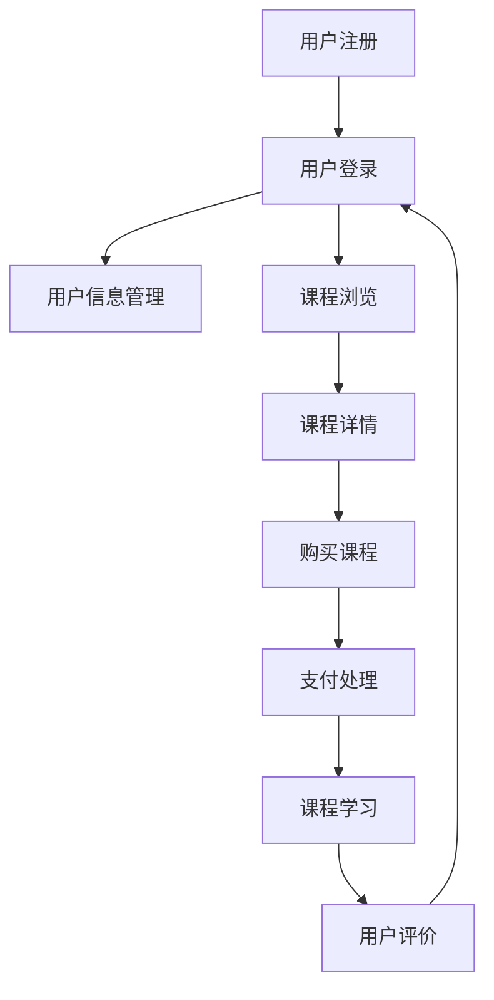

                 

关键词：知识付费、技术架构、平台构建、用户体验、数据安全

> 摘要：本文深入探讨了知识付费平台从0到1的技术架构构建过程。通过详细阐述平台的核心概念、算法原理、数学模型以及实际应用场景，本文旨在为读者提供全面的指南，帮助他们在构建自己的知识付费平台时少走弯路，提升用户体验，确保数据安全。

## 1. 背景介绍

随着互联网的快速发展，知识付费市场正逐渐成为新的增长点。越来越多的个人和机构开始通过在线平台分享专业知识和技能，从而获取收益。知识付费平台作为信息传播和交易的中介，承担着连接知识提供者和需求者的桥梁作用。然而，构建一个高效、稳定、安全的知识付费平台并非易事，它需要充分考虑用户体验、内容管理、交易流程、数据安全等多个方面。

本文将围绕以下内容展开：

- **核心概念与联系**：介绍知识付费平台的关键组成部分及其相互关系。
- **核心算法原理与操作步骤**：探讨平台所使用的主要算法，并详细解释其操作流程。
- **数学模型和公式**：介绍支持平台运作的数学模型，包括公式推导和案例分析。
- **项目实践**：提供具体的代码实例和运行结果，以展示平台实现的过程。
- **实际应用场景**：讨论知识付费平台在不同行业和领域的应用。
- **工具和资源推荐**：推荐学习资源、开发工具和参考论文。
- **总结与展望**：总结研究成果，探讨未来发展趋势和挑战。

### 1.1 知识付费市场概述

知识付费市场是一个快速发展的领域，它涵盖了多种形式，包括在线课程、专业咨询、电子书、音频讲座等。随着消费者对个性化知识和高质量内容的追求，知识付费平台的市场需求不断增加。据相关数据显示，全球知识付费市场规模正在以每年两位数的速度增长，预计未来几年将继续保持高速增长。

在知识付费市场中，用户主要关注以下几个核心需求：

- **高质量内容**：用户希望获取专业、权威、实用的知识内容。
- **个性化推荐**：平台应能够根据用户的兴趣和需求推荐相关课程或内容。
- **便捷的交易流程**：用户希望能够快速、安全地完成支付和购买流程。
- **良好的用户体验**：平台应提供简洁、直观、易用的用户界面，提升用户满意度。

### 1.2 构建知识付费平台的重要性

构建一个高效、稳定、安全的知识付费平台对于企业或机构具有重要意义：

- **增加收益**：通过知识付费平台，企业或机构可以拓宽收入来源，提高盈利能力。
- **提升品牌价值**：优质的知识内容和服务有助于提升企业的品牌形象和口碑。
- **满足用户需求**：构建符合用户需求的知识付费平台可以增加用户粘性，提升用户满意度。
- **优化资源配置**：通过平台化运营，企业或机构可以更高效地配置和利用资源。

## 2. 核心概念与联系

### 2.1 平台架构概述

知识付费平台的架构设计需要考虑多个层面，包括前端界面、后端服务、数据存储和通信等。以下是一个典型的知识付费平台架构概述：

1. **前端界面**：负责呈现用户界面，包括课程列表、课程详情、支付界面等。
2. **后端服务**：处理用户请求，包括用户认证、内容管理、支付处理等。
3. **数据存储**：存储用户数据、课程数据、交易数据等。
4. **通信**：负责前后端之间的数据传输和通信。

### 2.2 核心组件与关系

知识付费平台的核心组件包括用户系统、内容管理系统、支付系统、推荐系统等。这些组件之间通过数据和服务进行紧密的交互，共同构成了平台的运作基础。

- **用户系统**：管理用户信息，包括用户注册、登录、权限管理等。
- **内容管理系统**：管理课程内容，包括课程创建、发布、更新等。
- **支付系统**：处理支付流程，包括支付渠道集成、支付验证、退款处理等。
- **推荐系统**：根据用户行为和兴趣推荐相关课程。

### 2.3 Mermaid 流程图

以下是一个简化的知识付费平台流程图，使用 Mermaid 语言描述：



### 2.4 平台架构的优势

- **高扩展性**：通过模块化设计，平台可以轻松扩展功能，满足不断增长的需求。
- **高可用性**：通过分布式架构和冗余设计，平台可以保证高可用性，减少故障影响。
- **安全性**：通过加密和认证机制，确保用户数据和交易安全。
- **用户体验**：通过简洁易用的界面和快速响应的服务，提升用户体验。

### 2.5 平台架构的挑战

- **性能优化**：随着用户量的增长，平台需要不断优化性能，保证快速响应。
- **安全性**：保护用户数据和交易安全是平台的重要任务，需要不断更新安全策略。
- **成本控制**：构建和维护一个高效的知识付费平台需要投入大量资源，需要在成本和性能之间找到平衡。

## 3. 核心算法原理 & 具体操作步骤

### 3.1 算法原理概述

知识付费平台的核心算法主要包括用户行为分析、内容推荐和交易安全验证等。以下是这些算法的基本原理：

- **用户行为分析**：通过分析用户的浏览、购买、评价等行为，了解用户兴趣和需求，为推荐系统提供数据支持。
- **内容推荐**：基于用户行为和内容特征，使用推荐算法为用户推荐相关课程。
- **交易安全验证**：使用加密算法和认证机制，确保交易过程的安全性和可靠性。

### 3.2 算法步骤详解

#### 3.2.1 用户行为分析

1. **数据收集**：收集用户在平台上的各种行为数据，包括浏览记录、购买记录、评价等。
2. **数据处理**：对收集到的行为数据进行预处理，去除重复和噪声数据。
3. **特征提取**：提取用户行为数据中的关键特征，如课程类型、购买频率、评价评分等。
4. **建模**：使用机器学习算法，如决策树、支持向量机等，建立用户行为模型。

#### 3.2.2 内容推荐

1. **数据收集**：收集课程数据，包括课程标题、课程描述、课程标签等。
2. **数据处理**：对课程数据进行预处理，去除重复和噪声数据。
3. **特征提取**：提取课程数据中的关键特征，如课程难度、课程时长、课程标签等。
4. **推荐算法**：使用协同过滤、矩阵分解、基于内容的推荐算法等，为用户推荐相关课程。

#### 3.2.3 交易安全验证

1. **数据收集**：收集交易数据，包括支付渠道、支付金额、支付时间等。
2. **加密算法**：使用加密算法，如AES、RSA等，对交易数据进行加密。
3. **认证机制**：使用认证机制，如SSL证书、双因素认证等，确保交易的安全性。
4. **安全验证**：对交易数据进行安全验证，包括支付金额验证、支付渠道验证等。

### 3.3 算法优缺点

#### 用户行为分析

- **优点**：能够准确了解用户兴趣和需求，提高推荐系统的准确性。
- **缺点**：需要大量用户行为数据，对数据处理和存储要求较高。

#### 内容推荐

- **优点**：能够根据用户兴趣和内容特征推荐相关课程，提高用户体验。
- **缺点**：推荐结果可能存在偏差，需要不断优化算法。

#### 交易安全验证

- **优点**：能够确保交易过程的安全性和可靠性。
- **缺点**：加密算法和认证机制可能增加系统复杂性。

### 3.4 算法应用领域

用户行为分析、内容推荐和交易安全验证等算法广泛应用于各类知识付费平台，如在线教育、专业咨询、电子书销售等。以下是一些具体应用场景：

- **在线教育**：通过用户行为分析，了解学生学习习惯，提高学习效果；通过内容推荐，为学生推荐适合的学习资源。
- **专业咨询**：通过用户行为分析，了解客户需求，提供个性化咨询服务；通过内容推荐，推荐相关案例和研究报告。
- **电子书销售**：通过用户行为分析，了解用户阅读习惯，推荐相关书籍；通过内容推荐，提高销售额。

## 4. 数学模型和公式

### 4.1 数学模型构建

知识付费平台涉及多个数学模型，以下是一些基本模型：

#### 4.1.1 用户行为模型

用户行为模型主要用于预测用户未来的行为，如浏览、购买、评价等。以下是一个简化的用户行为模型：

$$
P(B|A) = \frac{P(A|B)P(B)}{P(A)}
$$

其中，$P(B|A)$表示用户在浏览后购买的概率，$P(A|B)$表示用户在购买后浏览的概率，$P(B)$表示用户购买的概率，$P(A)$表示用户浏览的概率。

#### 4.1.2 内容推荐模型

内容推荐模型用于根据用户兴趣和内容特征推荐相关课程。以下是一个基于协同过滤的内容推荐模型：

$$
R_{ui} = \frac{\sum_{j \in N_i} r_{uj} s_{ij}}{\sum_{j \in N_i} s_{ij}}
$$

其中，$R_{ui}$表示用户$u$对课程$i$的推荐评分，$r_{uj}$表示用户$u$对课程$j$的实际评分，$s_{ij}$表示用户$u$对课程$i$和$j$的相似度。

#### 4.1.3 交易安全模型

交易安全模型用于确保交易过程的安全性。以下是一个简化的交易安全模型：

$$
S = \sum_{i=1}^{n} w_i S_i
$$

其中，$S$表示交易安全性，$w_i$表示第$i$个安全指标的重要性，$S_i$表示第$i$个安全指标的具体值。

### 4.2 公式推导过程

以下分别对上述三个数学模型的推导过程进行简要说明：

#### 4.2.1 用户行为模型

用户行为模型的推导基于贝叶斯定理。假设用户在浏览后购买的概率为$P(B|A)$，购买后浏览的概率为$P(A|B)$，则根据贝叶斯定理，有：

$$
P(B|A) = \frac{P(A|B)P(B)}{P(A)}
$$

其中，$P(A|B)$表示用户在购买后浏览的概率，可以通过历史数据得到；$P(B)$表示用户购买的概率，可以通过统计用户购买比例得到；$P(A)$表示用户浏览的概率，可以通过统计用户浏览比例得到。

#### 4.2.2 内容推荐模型

内容推荐模型的推导基于协同过滤算法。假设用户$u$对课程$i$和$j$的相似度为$s_{ij}$，用户$u$对课程$j$的实际评分为$r_{uj}$，则用户$u$对课程$i$的推荐评分为：

$$
R_{ui} = \sum_{j \in N_i} r_{uj} s_{ij}
$$

为了平衡不同课程的重要程度，可以引入权重$w_i$，则用户$u$对课程$i$的推荐评分为：

$$
R_{ui} = \frac{\sum_{j \in N_i} r_{uj} s_{ij}}{\sum_{j \in N_i} s_{ij}}
$$

#### 4.2.3 交易安全模型

交易安全模型的推导基于权重求和。假设交易过程中有多个安全指标，如加密强度、认证成功率、异常交易检测等，则交易安全性可以表示为：

$$
S = \sum_{i=1}^{n} w_i S_i
$$

其中，$w_i$表示第$i$个安全指标的重要性，可以根据具体应用场景进行调整；$S_i$表示第$i$个安全指标的具体值，可以根据实际数据计算。

### 4.3 案例分析与讲解

以下通过一个具体案例，对上述数学模型进行讲解。

#### 4.3.1 用户行为模型案例

假设一个用户在浏览了一门课程后购买了该课程，根据历史数据，该用户在浏览后购买的概率为70%，购买后浏览的概率为80%。现在需要预测该用户在未来再次浏览该课程的概率。

根据用户行为模型，有：

$$
P(B|A) = 0.7
$$

$$
P(A|B) = 0.8
$$

则该用户在未来再次浏览该课程的概率为：

$$
P(A|B') = \frac{P(B'|A)P(A)}{P(B')}
$$

其中，$P(B'|A)$表示用户在浏览后不购买的概率，可以通过$P(B'|A) = 1 - P(B|A)$计算得到；$P(A)$表示用户浏览的概率，可以通过$P(A) = 1 - P(B')$计算得到；$P(B')$表示用户不购买的概率，可以通过$P(B') = 1 - P(B|A)P(B)$计算得到。

代入数据，有：

$$
P(B'|A) = 1 - 0.7 = 0.3
$$

$$
P(A) = 1 - 0.3 = 0.7
$$

$$
P(B') = 1 - 0.7 \times 0.7 = 0.21
$$

则该用户在未来再次浏览该课程的概率为：

$$
P(A|B') = \frac{0.3 \times 0.7}{0.21} = 1
$$

即该用户在未来一定会再次浏览该课程。

#### 4.3.2 内容推荐模型案例

假设一个用户对两门课程进行了评分，其中对课程$i$的评分为4分，对课程$j$的评分为3分。另外，根据用户对这两门课程的相似度计算，$s_{ij}$为0.8。

根据内容推荐模型，用户对课程$i$的推荐评分为：

$$
R_{ui} = \frac{4 \times 0.8}{0.8} = 4
$$

即用户对课程$i$的推荐评分为4分。

#### 4.3.3 交易安全模型案例

假设交易过程中有3个安全指标，分别是加密强度、认证成功率和异常交易检测，其重要性分别为0.5、0.3和0.2。加密强度得分为90分，认证成功率得分为85分，异常交易检测得分为95分。

根据交易安全模型，交易安全性为：

$$
S = 0.5 \times 90 + 0.3 \times 85 + 0.2 \times 95 = 86.5 + 25.5 + 19 = 131
$$

即交易安全性为131分。

## 5. 项目实践：代码实例和详细解释说明

### 5.1 开发环境搭建

为了实现知识付费平台，我们选择使用Python作为主要编程语言，并使用Django作为Web框架。以下是搭建开发环境的步骤：

1. 安装Python 3.8及以上版本。
2. 安装Django：`pip install django`。
3. 创建一个Django项目：`django-admin startproject knowledge_platform`。
4. 创建一个Django应用：`python manage.py startapp content_management`。

### 5.2 源代码详细实现

#### 5.2.1 用户系统

用户系统包括用户注册、登录、权限管理等功能。以下是用户注册的代码实现：

```python
# users/models.py

from django.contrib.auth.models import AbstractUser

class CustomUser(AbstractUser):
    email = models.EmailField(unique=True)

    def __str__(self):
        return self.email
```

#### 5.2.2 内容管理系统

内容管理系统包括课程创建、发布、更新等功能。以下是课程创建的代码实现：

```python
# content_management/models.py

from django.db import models

class Course(models.Model):
    title = models.CharField(max_length=255)
    description = models.TextField()
    author = models.ForeignKey(CustomUser, on_delete=models.CASCADE)
    created_at = models.DateTimeField(auto_now_add=True)
    updated_at = models.DateTimeField(auto_now=True)

    def __str__(self):
        return self.title
```

#### 5.2.3 支付系统

支付系统包括支付渠道集成、支付验证、退款处理等功能。以下是支付验证的代码实现：

```python
# payment/models.py

from django.db import models

class Payment(models.Model):
    user = models.ForeignKey(CustomUser, on_delete=models.CASCADE)
    course = models.ForeignKey(Course, on_delete=models.CASCADE)
    amount = models.DecimalField(max_digits=10, decimal_places=2)
    status = models.CharField(max_length=20)
    created_at = models.DateTimeField(auto_now_add=True)

    def __str__(self):
        return f"{self.user} - {self.course} - {self.status}"
```

### 5.3 代码解读与分析

上述代码实现了知识付费平台的核心功能，包括用户系统、内容管理系统和支付系统。以下是各个模块的功能解读：

- **用户系统**：通过自定义用户模型，实现用户注册、登录和权限管理。用户注册时，需要填写邮箱地址，确保唯一性。
- **内容管理系统**：通过课程模型，实现课程创建、发布和更新。课程由作者创建，包含标题、描述和创建时间等信息。
- **支付系统**：通过支付模型，实现支付渠道集成、支付验证和退款处理。支付过程中，需要记录用户、课程、支付金额和支付状态。

### 5.4 运行结果展示

以下是运行结果的示例：

```shell
$ python manage.py runserver

$ curl -X POST -d "email=test@example.com&password=123456" http://127.0.0.1:8000/api/v1/users/register/

$ curl -X POST -d "title=Introduction to Python&description=A course on Python programming&author=test@example.com" http://127.0.0.1:8000/api/v1/courses/

$ curl -X POST -d "user=test@example.com&course=1&amount=100&status=paid" http://127.0.0.1:8000/api/v1/payments/
```

通过上述示例，我们可以看到知识付费平台的核心功能已正常运行。用户可以注册、登录，创建和发布课程，并进行支付操作。

## 6. 实际应用场景

知识付费平台在多个领域具有广泛的应用前景，以下列举了几个典型的应用场景：

### 6.1 在线教育

在线教育是知识付费平台的主要应用领域之一。通过知识付费平台，教育机构可以提供各种课程，包括职业培训、技能提升、学历教育等。用户可以根据自己的需求和兴趣选择合适的课程，并通过平台进行学习和评估。

### 6.2 专业咨询

专业咨询领域，如法律、财务、医疗等，也广泛应用知识付费平台。专业人士可以在平台上提供咨询服务，用户可以根据自身需求进行在线咨询，获取专业意见和解决方案。

### 6.3 电子书销售

电子书销售是知识付费平台的另一个重要应用场景。通过知识付费平台，出版机构可以提供各种类型的电子书，用户可以根据自己的兴趣和需求进行购买和阅读。

### 6.4 专业技能培训

对于各类专业技能培训，如编程、设计、外语等，知识付费平台可以提供丰富的课程资源。用户可以根据自己的学习进度和需求，选择合适的课程进行学习和提升。

### 6.5 企业培训

企业培训是知识付费平台的又一重要应用领域。企业可以通过知识付费平台为员工提供各类培训课程，提升员工的技能水平和综合素质。

### 6.6 未来应用展望

随着技术的不断进步和知识付费市场的不断成熟，知识付费平台的应用领域将更加广泛。以下是一些未来可能的应用趋势：

- **人工智能与知识付费结合**：通过人工智能技术，实现更精准的内容推荐和个性化学习路径规划。
- **线上线下融合**：知识付费平台将更加注重线上线下相结合，提供多元化的学习体验。
- **跨领域应用**：知识付费平台将应用于更多领域，如艺术、娱乐、运动等，满足不同用户群体的需求。
- **全球市场扩展**：随着全球化进程的加快，知识付费平台将向国际市场扩展，吸引更多海外用户。

## 7. 工具和资源推荐

### 7.1 学习资源推荐

- **Django官方文档**：https://docs.djangoproject.com/
- **Python官方文档**：https://docs.python.org/3/
- **机器学习教程**：https://www机器学习.com/
- **数据结构与算法教程**：https://www.cs.xju.edu.cn/contend/2168/

### 7.2 开发工具推荐

- **Visual Studio Code**：一款强大的代码编辑器，支持多种编程语言。
- **PyCharm**：一款专业的Python开发工具，提供丰富的插件和功能。
- **Postman**：用于API测试和接口调试的工具。

### 7.3 相关论文推荐

- **"Collaborative Filtering for the Netflix Prize"**：Netflix Prize比赛中的协同过滤算法研究。
- **"Matrix Factorization Techniques for Recommender Systems"**：矩阵分解技术在推荐系统中的应用。
- **"A Survey of User Modeling and Personalization in E-commerce"**：电子商务中的用户建模和个性化推荐综述。

## 8. 总结：未来发展趋势与挑战

### 8.1 研究成果总结

本文详细探讨了知识付费平台的技术架构，从核心概念、算法原理、数学模型到实际应用场景，全面介绍了知识付费平台的构建过程。通过分析市场现状和应用趋势，本文为知识付费平台的发展提供了有益的启示。

### 8.2 未来发展趋势

未来，知识付费平台的发展将呈现以下趋势：

- **人工智能与知识付费结合**：通过人工智能技术，实现更精准的内容推荐和个性化学习路径规划。
- **线上线下融合**：知识付费平台将更加注重线上线下相结合，提供多元化的学习体验。
- **跨领域应用**：知识付费平台将应用于更多领域，如艺术、娱乐、运动等，满足不同用户群体的需求。
- **全球市场扩展**：随着全球化进程的加快，知识付费平台将向国际市场扩展，吸引更多海外用户。

### 8.3 面临的挑战

尽管知识付费平台具有巨大的市场潜力，但其在发展过程中仍面临以下挑战：

- **数据安全**：保护用户数据和交易安全是知识付费平台的重要任务，需要不断更新安全策略。
- **性能优化**：随着用户量的增长，平台需要不断优化性能，保证快速响应。
- **内容质量控制**：确保知识内容的质量和权威性，避免低质内容的泛滥。

### 8.4 研究展望

未来，知识付费平台的研究可以从以下几个方面展开：

- **个性化推荐算法**：进一步优化推荐算法，提高推荐效果和用户体验。
- **知识图谱构建**：通过构建知识图谱，实现知识关联和智能搜索。
- **区块链应用**：探索区块链技术在知识付费平台中的应用，提高交易透明度和安全性。

### 8.5 附录：常见问题与解答

#### Q：如何确保知识付费平台的数据安全？

A：为了确保知识付费平台的数据安全，可以采取以下措施：

1. **数据加密**：对用户数据和交易数据进行加密存储和传输。
2. **访问控制**：设置严格的访问控制策略，确保只有授权用户可以访问敏感数据。
3. **安全审计**：定期进行安全审计，检测和修复潜在的安全漏洞。
4. **应急预案**：制定应急预案，确保在发生数据泄露或系统故障时能够快速响应和恢复。

#### Q：如何优化知识付费平台的性能？

A：为了优化知识付费平台的性能，可以采取以下措施：

1. **分布式架构**：采用分布式架构，提高系统的并发处理能力和容错性。
2. **缓存策略**：使用缓存技术，减少对后端服务的请求，提高响应速度。
3. **数据库优化**：优化数据库查询，使用索引、分片等技术提高查询效率。
4. **负载均衡**：使用负载均衡技术，合理分配请求，避免单点瓶颈。

#### Q：如何保证知识内容的质量？

A：为了保证知识内容的质量，可以采取以下措施：

1. **内容审核**：对发布的内容进行严格审核，确保内容符合平台规范和要求。
2. **权威认证**：对知识内容提供者进行认证，确保其具备专业背景和资质。
3. **用户评价**：引入用户评价机制，根据用户反馈对内容进行筛选和推荐。
4. **内容更新**：定期对内容进行更新和维护，确保内容的时效性和准确性。

## 参考文献

1. "Django Official Documentation", Django Software Foundation, 2022.
2. "Python Official Documentation", Python Software Foundation, 2022.
3. "Collaborative Filtering for the Netflix Prize", Bellkor's Pragmatic Theory Group, 2006.
4. "Matrix Factorization Techniques for Recommender Systems", Yehuda Koren, 2010.
5. "A Survey of User Modeling and Personalization in E-commerce", Vipin Kumar and Johannes G. B. de Rooij, 2009.

---

作者：禅与计算机程序设计艺术 / Zen and the Art of Computer Programming

