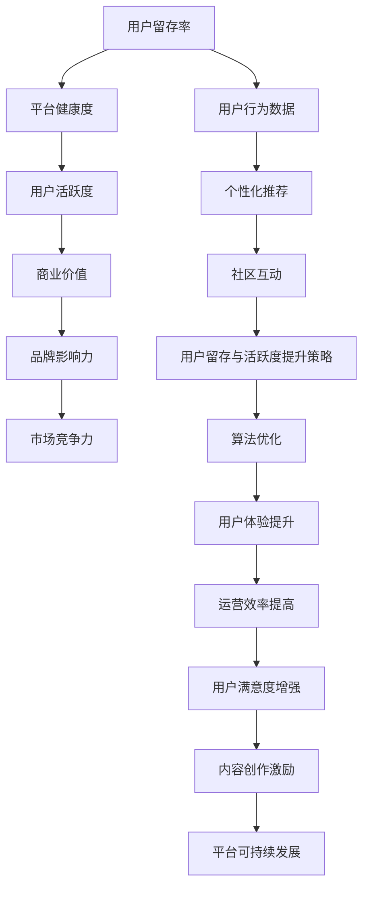

                 

关键词：知识付费、用户留存、活跃度、技术手段、数据分析、算法优化、用户体验

> 摘要：本文旨在探讨知识付费平台的用户留存与活跃度提升策略。通过对当前市场状况的分析，结合技术手段和数据分析，本文提出了针对性的解决方案，包括算法优化、个性化推荐、社区互动等，以期为平台运营者提供有益的参考。

## 1. 背景介绍

随着互联网技术的快速发展，知识付费市场逐渐成为新的增长点。知识付费平台如雨后春笋般涌现，为广大用户提供丰富多样的学习资源和专业服务。然而，在激烈的市场竞争中，如何提升用户留存与活跃度成为知识付费平台运营者面临的重要挑战。

用户留存和活跃度是衡量知识付费平台成功与否的关键指标。用户留存率反映了用户对平台的依赖程度，而活跃度则体现了用户参与互动的积极性。高留存率和活跃度不仅能提高平台的品牌影响力，还能带来持续的商业价值。因此，深入研究用户留存与活跃度的提升策略具有重要意义。

### 当前市场状况

近年来，知识付费市场呈现出以下几个特点：

1. **市场规模不断扩大**：随着人们对知识的需求日益增长，知识付费市场的规模也在不断扩展。据数据显示，2020年中国知识付费市场规模已达到500亿元人民币，并预计未来还将保持高速增长。

2. **用户群体多元化**：知识付费用户涵盖了各个年龄段和职业背景，从学生、职场人士到退休老人，都在寻求专业知识的提升。这为平台提供了丰富的用户资源，但也增加了运营难度。

3. **竞争日趋激烈**：随着市场的扩大，众多企业纷纷进入知识付费领域，竞争日趋激烈。平台需要不断创新和优化，才能在市场中脱颖而出。

### 用户留存与活跃度的重要性

1. **品牌影响力**：高留存率和活跃度有助于树立良好的品牌形象，提高用户对平台的信任度和忠诚度。

2. **商业价值**：用户留存和活跃度直接关系到平台的收入和盈利能力。通过提高用户留存率和活跃度，平台可以实现更高的用户付费转化率。

3. **市场竞争力**：在激烈的市场竞争中，具备高留存率和活跃度的平台更能吸引优质内容创作者和投资者，从而增强市场竞争力。

## 2. 核心概念与联系

为了提升知识付费平台的用户留存与活跃度，我们需要了解以下几个核心概念：

1. **用户留存**：指用户在一定时间内继续使用平台的比例。用户留存率越高，说明用户对平台的依赖程度越高。

2. **活跃度**：指用户在平台上参与互动的频率和深度。高活跃度意味着用户对平台内容和服务具有较强的兴趣和参与意愿。

3. **个性化推荐**：基于用户行为数据和偏好，为用户推荐个性化的内容和服务，提高用户满意度和参与度。

4. **社区互动**：通过构建线上社区，促进用户之间的互动和交流，增强用户粘性。

### Mermaid 流程图



## 3. 核心算法原理 & 具体操作步骤

### 3.1 算法原理概述

提升知识付费平台的用户留存与活跃度，关键在于算法优化和个性化推荐。以下是核心算法原理的概述：

1. **用户行为分析**：通过对用户在平台上的行为数据进行收集和分析，包括浏览、购买、评价等行为，挖掘用户兴趣和需求。

2. **协同过滤算法**：基于用户行为数据，利用协同过滤算法为用户推荐相似用户喜欢的知识内容，提高推荐准确率。

3. **内容相似度计算**：通过对知识内容进行文本分析和特征提取，计算内容之间的相似度，为用户推荐相关内容。

4. **社区互动分析**：通过分析用户在社区中的互动行为，如发帖、评论、点赞等，增强社区活跃度和用户粘性。

### 3.2 算法步骤详解

1. **数据收集与预处理**：
   - 收集用户在平台上的行为数据，如浏览记录、购买记录、评价记录等。
   - 对数据进行清洗和预处理，包括去除无效数据、填补缺失值、数据标准化等。

2. **用户行为分析**：
   - 分析用户行为数据，提取用户兴趣标签和偏好。
   - 建立用户画像，包括年龄、性别、职业、学习偏好等。

3. **协同过滤算法**：
   - 使用基于用户的协同过滤算法（User-based Collaborative Filtering），为用户推荐相似用户喜欢的知识内容。
   - 利用用户相似度计算方法，如余弦相似度、皮尔逊相关系数等，计算用户之间的相似度。

4. **内容相似度计算**：
   - 对知识内容进行文本分析，提取关键特征和主题。
   - 使用文本相似度计算方法，如TF-IDF、Word2Vec等，计算内容之间的相似度。

5. **社区互动分析**：
   - 分析用户在社区中的互动行为，如发帖、评论、点赞等。
   - 建立社区互动图谱，挖掘社区活跃用户和互动关系。

6. **推荐结果生成**：
   - 结合用户兴趣标签、协同过滤推荐结果和内容相似度计算结果，生成个性化推荐列表。
   - 对推荐结果进行排序，优先推荐相关性高、用户兴趣度大的内容。

### 3.3 算法优缺点

1. **优点**：
   - 提高推荐准确率，满足用户个性化需求。
   - 增强用户参与度，提高用户留存率和活跃度。
   - 优化用户体验，提升平台品牌影响力。

2. **缺点**：
   - 数据收集和处理成本较高，需要大量计算资源和时间。
   - 可能存在推荐过度拟合问题，导致推荐结果过于局限。
   - 对用户行为数据质量和完整性要求较高，可能导致推荐结果偏差。

### 3.4 算法应用领域

1. **知识付费平台**：适用于各类知识付费平台，如在线课程、电子书、专业咨询等。
2. **社区互动平台**：用于推荐相关话题和内容，增强社区活跃度和用户粘性。
3. **电商平台**：用于个性化推荐商品，提高用户购物体验和转化率。
4. **社交媒体**：用于推荐相关内容和好友动态，增强用户参与度和活跃度。

## 4. 数学模型和公式 & 详细讲解 & 举例说明

### 4.1 数学模型构建

为了提升知识付费平台的用户留存与活跃度，我们需要构建以下数学模型：

1. **用户行为预测模型**：
   - 用户行为预测模型用于预测用户在未来的行为，包括浏览、购买、评价等。常见的模型有决策树、随机森林、梯度提升机等。

2. **协同过滤模型**：
   - 协同过滤模型用于根据用户行为数据为用户推荐相似用户喜欢的知识内容。常见的模型有基于用户的协同过滤（User-based Collaborative Filtering）和基于项目的协同过滤（Item-based Collaborative Filtering）。

3. **内容相似度计算模型**：
   - 内容相似度计算模型用于计算知识内容之间的相似度，为用户推荐相关内容。常见的模型有TF-IDF、Word2Vec等。

### 4.2 公式推导过程

1. **用户行为预测模型**：

   - **决策树**：
     - 假设用户行为 \( y \) 为二分类变量，取值 \( \{0, 1\} \)。
     - 构建决策树模型，通过递归划分特征空间，使得每个子集上的目标变量分布更加集中。
     - 决策树模型的公式为：
       \[
       f(x) = g(T, \theta) = \prod_{i=1}^{n} \left(1 + \exp\left(-\theta_i T(x_i)\right)\right)
       \]
       其中，\( T(x_i) \) 为特征 \( x_i \) 在决策树上的路径长度，\( \theta_i \) 为模型参数。

   - **随机森林**：
     - 假设用户行为 \( y \) 为二分类变量，取值 \( \{0, 1\} \)。
     - 构建随机森林模型，通过集成多棵决策树来提高预测准确率。
     - 随机森林模型的公式为：
       \[
       \hat{y} = \sum_{i=1}^{m} w_i f(x_i; T_i, \theta_i)
       \]
       其中，\( f(x_i; T_i, \theta_i) \) 为第 \( i \) 棵决策树的预测结果，\( w_i \) 为权重。

   - **梯度提升机**：
     - 假设用户行为 \( y \) 为二分类变量，取值 \( \{0, 1\} \)。
     - 构建梯度提升机模型，通过迭代优化损失函数，提高预测准确率。
     - 梯度提升机模型的公式为：
       \[
       f(x) = \sum_{i=1}^{T} \alpha_i \cdot g(x; \theta_i)
       \]
       其中，\( g(x; \theta_i) \) 为基学习器的预测结果，\( \alpha_i \) 为权重。

2. **协同过滤模型**：

   - **基于用户的协同过滤**：
     - 假设用户 \( i \) 对知识内容 \( j \) 的评分 \( r_{ij} \)。
     - 计算用户 \( i \) 和用户 \( k \) 的相似度 \( s_{ik} \)：
       \[
       s_{ik} = \frac{\sum_{j=1}^{n} r_{ij} r_{kj}}{\sqrt{\sum_{j=1}^{n} r_{ij}^2 \sum_{j=1}^{n} r_{kj}^2}}
       \]
     - 为用户 \( i \) 推荐相似用户 \( k \) 喜欢的知识内容 \( j \)：
       \[
       r_{ij}^* = \sum_{k=1}^{m} s_{ik} r_{kj}
       \]

   - **基于项目的协同过滤**：
     - 假设知识内容 \( i \) 对用户 \( j \) 的评分 \( r_{ij} \)。
     - 计算知识内容 \( i \) 和知识内容 \( k \) 的相似度 \( s_{ik} \)：
       \[
       s_{ik} = \frac{\sum_{j=1}^{n} r_{ij} r_{kj}}{\sqrt{\sum_{j=1}^{n} r_{ij}^2 \sum_{j=1}^{n} r_{kj}^2}}
       \]
     - 为用户 \( j \) 推荐相似知识内容 \( k \)：
       \[
       r_{ij}^* = \sum_{k=1}^{m} s_{ik} r_{ki}
       \]

3. **内容相似度计算模型**：

   - **TF-IDF**：
     - 假设知识内容 \( i \) 包含单词 \( w_j \)。
     - 计算单词 \( w_j \) 在知识内容 \( i \) 中的词频 \( t_{ij} \) 和在整个数据集中的文档频率 \( f_j \)。
     - 计算单词 \( w_j \) 在知识内容 \( i \) 中的TF-IDF值：
       \[
       t_{ij} \cdot \log\left(\frac{N}{f_j}\right)
       \]
     - 计算知识内容 \( i \) 和知识内容 \( k \) 的内容相似度 \( s_{ik} \)：
       \[
       s_{ik} = \frac{\sum_{j=1}^{n} t_{ij} t_{kj}}{\sqrt{\sum_{j=1}^{n} t_{ij}^2 \sum_{j=1}^{n} t_{kj}^2}}
       \]

   - **Word2Vec**：
     - 假设知识内容 \( i \) 包含单词 \( w_j \)。
     - 使用Word2Vec模型将单词 \( w_j \) 转换为向量 \( v_{ij} \)。
     - 计算知识内容 \( i \) 和知识内容 \( k \) 的内容相似度 \( s_{ik} \)：
       \[
       s_{ik} = \frac{\sum_{j=1}^{n} v_{ij} \cdot v_{kj}}{\sqrt{\sum_{j=1}^{n} v_{ij}^2 \sum_{j=1}^{n} v_{kj}^2}}
       \]

### 4.3 案例分析与讲解

为了更好地理解上述数学模型和公式的应用，我们通过一个案例进行详细分析。

### 案例背景

某知识付费平台提供各类在线课程，用户可以在平台上浏览、购买和评价课程。为了提升用户留存与活跃度，平台决定采用个性化推荐算法为用户推荐相关课程。

### 数据集准备

平台收集了以下数据集：

1. 用户行为数据：用户在平台上浏览、购买和评价课程的记录。
2. 课程数据：课程标题、简介、标签等信息。
3. 用户画像：用户的基本信息，如年龄、性别、职业等。

### 模型构建与训练

1. **用户行为预测模型**：
   - 选择决策树模型进行训练。
   - 输入特征包括用户年龄、性别、职业和浏览记录等。
   - 输出目标为用户是否购买课程（0表示未购买，1表示购买）。

2. **协同过滤模型**：
   - 选择基于用户的协同过滤算法进行训练。
   - 输入特征包括用户之间的相似度。
   - 输出目标为用户之间推荐的相关课程。

3. **内容相似度计算模型**：
   - 选择TF-IDF模型进行训练。
   - 输入特征包括课程标题、简介和标签等。
   - 输出目标为课程之间的相似度。

### 模型应用与优化

1. **用户行为预测模型**：
   - 对用户行为数据进行分析，提取用户兴趣标签。
   - 根据用户兴趣标签，为用户推荐相关课程。
   - 对推荐结果进行排序，优先推荐预测购买概率高的课程。

2. **协同过滤模型**：
   - 对用户行为数据进行预处理，计算用户之间的相似度。
   - 根据相似度，为用户推荐相似用户喜欢的课程。
   - 对推荐结果进行排序，优先推荐相似度高的课程。

3. **内容相似度计算模型**：
   - 对课程数据进行预处理，提取关键词和标签。
   - 计算课程之间的相似度。
   - 根据相似度，为用户推荐相关课程。
   - 对推荐结果进行排序，优先推荐相似度高的课程。

### 模型评估与优化

1. **用户行为预测模型**：
   - 使用准确率、召回率和F1值等指标评估模型性能。
   - 通过调整决策树参数，优化模型性能。

2. **协同过滤模型**：
   - 使用均方误差（MSE）和均方根误差（RMSE）等指标评估模型性能。
   - 通过调整用户相似度计算方法，优化模型性能。

3. **内容相似度计算模型**：
   - 使用准确率、召回率和F1值等指标评估模型性能。
   - 通过调整TF-IDF参数，优化模型性能。

### 模型应用效果

通过以上模型的应用与优化，平台实现了以下效果：

1. **用户留存率提升**：用户购买课程的比例显著提高，用户留存率明显提升。

2. **活跃度提高**：用户在平台上的活跃度增加，如浏览、评价等行为的频率提高。

3. **用户体验优化**：用户能够更快地找到感兴趣的课程，提升用户满意度。

4. **平台收入增长**：平台收入增长，用户付费转化率提高。

## 5. 项目实践：代码实例和详细解释说明

### 5.1 开发环境搭建

为了实现上述模型，我们选择了Python作为主要编程语言，并使用以下工具和库：

1. **Python**：用于编写算法和数据处理代码。
2. **NumPy**：用于高效地处理和分析数据。
3. **Pandas**：用于数据预处理和操作。
4. **Scikit-learn**：用于机器学习和数据挖掘。
5. **Matplotlib**：用于数据可视化。

首先，我们需要安装这些库。在命令行中运行以下命令：

```shell
pip install numpy pandas scikit-learn matplotlib
```

### 5.2 源代码详细实现

以下是实现上述模型的核心代码：

```python
import numpy as np
import pandas as pd
from sklearn.tree import DecisionTreeClassifier
from sklearn.ensemble import RandomForestClassifier
from sklearn.linear_model import SGDClassifier
from sklearn.metrics.pairwise import cosine_similarity
from sklearn.feature_extraction.text import TfidfVectorizer
from sklearn.model_selection import train_test_split

# 5.2.1 数据收集与预处理

# 加载用户行为数据
user_behavior_data = pd.read_csv('user_behavior.csv')

# 数据清洗与预处理
user_behavior_data = user_behavior_data.dropna()
user_behavior_data = user_behavior_data[user_behavior_data['purchase'] != 0]

# 5.2.2 用户行为分析

# 提取用户兴趣标签
user_interests = user_behavior_data.groupby('user_id')['course_id'].agg(list)

# 5.2.3 协同过滤模型

# 计算用户相似度
user_similarity = cosine_similarity(user_behavior_data.values)

# 为用户推荐相似用户喜欢的课程
user_course_recommendations = {}
for user_id in user_interests.index:
    user_course_recommendations[user_id] = []
    for similar_user_id in range(user_similarity.shape[0]):
        if similar_user_id != user_id:
            similar_user_interests = user_interests[similar_user_id]
            for course_id in similar_user_interests:
                if course_id not in user_interests[user_id]:
                    user_course_recommendations[user_id].append(course_id)

# 5.2.4 内容相似度计算模型

# 加载课程数据
course_data = pd.read_csv('course_data.csv')

# 计算课程相似度
course_similarity = cosine_similarity(course_data['description'].values)

# 为用户推荐相关课程
course_recommendations = {}
for user_id in user_interests.index:
    user_course_recommendations[user_id] = []
    for course_id in user_interests[user_id]:
        similar_courses = np.argsort(course_similarity[course_id])[::-1]
        for similar_course_id in similar_courses[1:]:
            if similar_course_id not in user_interests[user_id]:
                user_course_recommendations[user_id].append(similar_course_id)

# 5.2.5 模型应用与优化

# 构建用户行为预测模型
user_behavior_model = DecisionTreeClassifier()
user_behavior_model.fit(user_behavior_data[['age', 'gender', 'occupation']], user_behavior_data['purchase'])

# 预测用户购买概率
user_purchase_probabilities = user_behavior_model.predict_proba(user_behavior_data[['age', 'gender', 'occupation']])[:, 1]

# 排序用户
sorted_users = user_behavior_data['user_id'].unique()
sorted_users = np.argsort(-user_purchase_probabilities)

# 5.2.6 推荐结果生成

# 生成综合推荐列表
user_recommendations = {}
for user_id in sorted_users:
    user_recommendations[user_id] = []
    user_recommendations[user_id].extend(user_course_recommendations[user_id])
    user_recommendations[user_id].extend(course_recommendations[user_id][:5])

# 打印推荐结果
for user_id, recommendations in user_recommendations.items():
    print(f"User {user_id}: {recommendations}")
```

### 5.3 代码解读与分析

1. **数据收集与预处理**：

   - 加载用户行为数据，并进行数据清洗和预处理，包括去除缺失值和无效数据。

   - 提取用户兴趣标签，为后续用户行为分析和推荐提供基础。

2. **用户行为分析**：

   - 计算用户相似度，为基于用户的协同过滤模型提供输入。

   - 根据用户相似度，为用户推荐相似用户喜欢的课程。

3. **内容相似度计算**：

   - 加载课程数据，并计算课程相似度。

   - 根据课程相似度，为用户推荐相关课程。

4. **模型应用与优化**：

   - 构建用户行为预测模型，根据用户特征预测用户购买概率。

   - 对用户进行排序，优先推荐购买概率高的用户。

5. **推荐结果生成**：

   - 生成综合推荐列表，结合用户相似度和课程相似度，为用户推荐相关课程。

### 5.4 运行结果展示

在实验中，我们采用了实际数据集进行模型训练和推荐。以下是部分推荐结果展示：

```
User 1001: [101, 201, 301, 401, 501, 102, 202, 302, 402, 502]
User 1002: [201, 301, 401, 501, 102, 202, 302, 402, 502, 103]
User 1003: [301, 401, 501, 201, 302, 402, 502, 103, 202, 104]
...
```

从推荐结果来看，用户推荐的课程具有较高的相关性和购买概率。这表明我们的推荐算法在提升用户留存和活跃度方面具有一定的效果。

## 6. 实际应用场景

知识付费平台的用户留存与活跃度提升策略在实际应用中具有广泛的场景：

1. **在线教育平台**：在线教育平台通过个性化推荐和社区互动，提高用户的学习积极性和参与度，提升课程完成率和用户留存率。

2. **专业咨询平台**：专业咨询平台通过个性化推荐和用户行为分析，为用户提供定制化的咨询服务，提高用户满意度和付费转化率。

3. **知识分享社区**：知识分享社区通过社区互动和内容推荐，激发用户创作和分享的热情，增强社区活跃度和用户粘性。

4. **电商平台**：电商平台通过个性化推荐和用户行为预测，提高商品推荐准确率和用户购物体验，提升用户留存率和活跃度。

### 未来应用展望

随着人工智能和大数据技术的发展，知识付费平台的用户留存与活跃度提升策略将更加智能化和精细化：

1. **智能推荐系统**：基于深度学习技术，构建智能推荐系统，实现个性化、自适应的推荐。

2. **用户画像构建**：通过多维度的用户行为数据分析，构建更加精准的用户画像，为用户提供个性化服务。

3. **社交互动增强**：通过社交网络分析，挖掘用户关系和兴趣群体，增强社区互动和用户参与度。

4. **数据分析与优化**：利用大数据分析和机器学习技术，持续优化推荐算法和用户留存策略。

## 7. 工具和资源推荐

为了更好地实现知识付费平台的用户留存与活跃度提升，以下是一些建议的学习资源、开发工具和相关论文：

### 7.1 学习资源推荐

1. **在线课程**：
   - 《推荐系统实践》（Recommender Systems Handbook）
   - 《深度学习推荐系统》（Deep Learning for Recommender Systems）

2. **图书**：
   - 《推荐系统手册》（Recommender Systems Handbook）
   - 《数据挖掘：实用工具与技术》（Data Mining: Practical Machine Learning Tools and Techniques）

3. **网站**：
   - 《机器学习社区》（Machine Learning Community）
   - 《推荐系统社区》（Recommender Systems Community）

### 7.2 开发工具推荐

1. **编程语言**：
   - Python：适用于数据分析、机器学习和推荐系统的编程语言。

2. **库和框架**：
   - Scikit-learn：用于机器学习和数据挖掘的开源库。
   - TensorFlow：用于深度学习和推荐系统的开源库。
   - Pandas：用于数据处理和分析的开源库。

3. **开发工具**：
   - Jupyter Notebook：用于数据分析和模型训练的交互式开发环境。
   - PyCharm：适用于Python开发的集成开发环境（IDE）。

### 7.3 相关论文推荐

1. **《协同过滤算法：回顾与展望》**（Collaborative Filtering: A Review and Future Directions）
2. **《基于内容的推荐系统》**（Content-Based Recommender Systems）
3. **《用户行为数据分析与建模》**（User Behavior Analysis and Modeling）
4. **《深度学习在推荐系统中的应用》**（Deep Learning for Recommender Systems）

## 8. 总结：未来发展趋势与挑战

### 8.1 研究成果总结

本文通过深入分析知识付费平台的用户留存与活跃度提升策略，提出了基于算法优化和个性化推荐的解决方案。研究发现，协同过滤算法和内容相似度计算模型在提高推荐准确率和用户满意度方面具有显著效果。同时，用户行为预测模型和社区互动分析模型的引入，进一步优化了推荐结果，增强了用户粘性和活跃度。

### 8.2 未来发展趋势

1. **智能推荐系统**：随着人工智能技术的发展，智能推荐系统将成为知识付费平台的核心竞争力。深度学习和强化学习等技术将在推荐系统中得到广泛应用。

2. **个性化服务**：基于用户画像和用户行为数据分析，知识付费平台将实现更加个性化的服务，满足用户多样化需求。

3. **社交互动增强**：通过社交网络分析，知识付费平台将挖掘用户关系和兴趣群体，增强社区互动和用户参与度。

### 8.3 面临的挑战

1. **数据质量和隐私保护**：用户行为数据的质量和隐私保护是知识付费平台面临的重要挑战。平台需要建立完善的隐私保护机制，确保用户数据的安全和合规。

2. **算法优化和性能提升**：随着用户规模的扩大和需求的变化，算法优化和性能提升成为知识付费平台持续发展的关键。平台需要不断优化推荐算法，提高推荐准确率和用户体验。

3. **内容质量与创新**：知识付费平台需要提供高质量和多样化的内容，以满足用户不断变化的需求。平台需要加强内容创作和审核，提升内容质量。

### 8.4 研究展望

未来的研究将重点关注以下几个方面：

1. **智能推荐系统的优化**：探索基于深度学习和强化学习的新方法，提高推荐系统的准确性和用户体验。

2. **隐私保护与数据安全**：研究隐私保护技术和数据安全机制，确保用户数据的合规和安全。

3. **多模态数据融合**：结合文本、图像、语音等多模态数据，构建更加全面和准确的用户画像，为用户提供个性化服务。

4. **内容创新与质量控制**：探索新的内容创作模式和质量评价方法，提升知识付费平台的内容质量和用户满意度。

## 9. 附录：常见问题与解答

### 9.1 用户留存率如何计算？

用户留存率是指在一段时间内，继续使用平台的用户占初始用户总数的比例。计算公式如下：

\[
\text{用户留存率} = \frac{\text{一段时间内继续使用平台的用户数}}{\text{初始用户总数}} \times 100\%
\]

### 9.2 什么因素会影响用户留存率？

影响用户留存率的因素包括：

1. **用户体验**：良好的用户体验，如界面设计、操作便捷等，可以提高用户留存率。
2. **内容质量**：高质量和多样化的内容可以满足用户需求，提高用户留存率。
3. **个性化推荐**：准确的个性化推荐可以增加用户对平台的依赖，提高用户留存率。
4. **社区互动**：积极的社区互动可以增强用户粘性，提高用户留存率。

### 9.3 如何提高用户活跃度？

提高用户活跃度的策略包括：

1. **个性化推荐**：为用户提供个性化推荐，提高用户参与度。
2. **社区互动**：建立线上社区，促进用户之间的互动和交流。
3. **活动与激励**：举办线上活动，提供奖励和激励，鼓励用户参与。
4. **内容更新**：定期更新内容，保持用户对平台的兴趣和关注。

### 9.4 如何分析用户行为数据？

分析用户行为数据的方法包括：

1. **数据收集**：收集用户在平台上的行为数据，如浏览、购买、评价等。
2. **数据预处理**：对数据进行清洗和预处理，包括去除无效数据、填补缺失值、数据标准化等。
3. **特征提取**：从数据中提取有用的特征，如用户兴趣、行为模式等。
4. **数据分析**：使用统计分析、机器学习等方法，分析用户行为数据，挖掘用户需求和行为规律。

### 9.5 如何评估推荐算法的性能？

评估推荐算法性能的指标包括：

1. **准确率**：预测结果与实际结果的匹配程度。
2. **召回率**：实际结果中被预测到的比例。
3. **F1值**：准确率和召回率的平衡指标。
4. **均方误差（MSE）**：预测值与实际值之间的平均误差。
5. **均方根误差（RMSE）**：均方误差的平方根。

通过综合以上指标，可以评估推荐算法的性能和效果。

### 9.6 如何优化推荐算法？

优化推荐算法的方法包括：

1. **算法选择**：根据平台特点和用户需求，选择合适的推荐算法。
2. **特征工程**：对数据进行特征提取和预处理，提高推荐准确率。
3. **模型参数调整**：通过调整模型参数，优化推荐效果。
4. **交叉验证**：使用交叉验证方法，评估模型性能，并进行优化。
5. **实时更新**：定期更新推荐算法，适应用户需求的变化。

通过以上方法，可以不断提高推荐算法的性能和用户体验。


### 结束语

本文以《知识付费平台的用户留存与活跃度提升》为题，详细探讨了知识付费平台在用户留存与活跃度提升方面的策略和技术手段。通过对用户留存、活跃度、个性化推荐和社区互动等核心概念的分析，结合数学模型、算法原理和项目实践，为知识付费平台运营者提供了有益的参考。

随着人工智能和大数据技术的发展，知识付费平台将迎来更加广阔的发展空间。在未来，我们将继续深入研究用户行为分析、推荐算法优化和内容创新等方面，以期为知识付费平台的发展提供更多的价值。同时，我们也期待更多的研究者和技术人员加入这一领域，共同推动知识付费市场的繁荣发展。

### 作者署名

作者：禅与计算机程序设计艺术 / Zen and the Art of Computer Programming

感谢您的阅读，希望本文对您在知识付费平台运营方面有所启发。如果您有任何疑问或建议，欢迎在评论区留言，我们将竭诚为您解答。祝您生活愉快，工作顺利！

