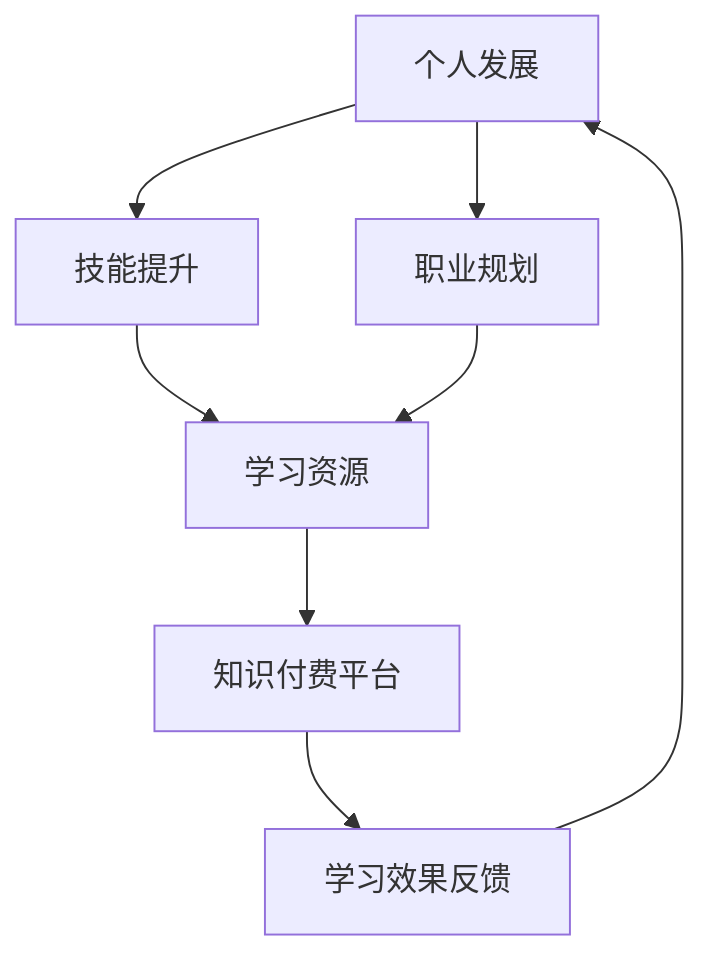

                 

关键词：知识付费、程序员、个人发展、技能提升、职业规划

摘要：在知识付费时代，程序员面临着前所未有的挑战和机遇。本文旨在探讨程序员如何在这个时代实现个人发展，包括技能提升、职业规划、学习资源推荐等多个方面，帮助程序员更好地应对未来。

## 1. 背景介绍

随着互联网技术的快速发展，知识付费逐渐成为主流。人们可以通过线上平台购买课程、订阅专栏、参加线上讲座等多种方式获取知识。程序员作为知识付费的主要受益群体，他们如何在这个时代实现个人发展，成为了一个值得关注的话题。

### 1.1 知识付费时代的机遇

知识付费时代为程序员提供了以下机遇：

- **学习资源丰富**：程序员可以随时随地通过线上平台学习最新的技术知识。
- **技能提升便捷**：通过付费课程，程序员可以快速掌握新技能，提升竞争力。
- **职业发展多样**：程序员可以拓展职业方向，如转型成为数据分析师、AI工程师等。

### 1.2 知识付费时代的挑战

然而，知识付费时代也带来了一定的挑战：

- **信息过载**：面对海量的学习资源，程序员需要筛选出有价值的内容。
- **学习成本**：付费课程往往价格不菲，程序员需要平衡学习成本与个人收益。
- **技能淘汰快**：技术更新迅速，程序员需要不断学习以保持竞争力。

## 2. 核心概念与联系

为了更好地理解程序员在知识付费时代的个人发展，我们首先需要了解以下几个核心概念：

### 2.1 个人发展

个人发展指的是个人在知识、技能、情感、社交等方面的成长和进步。

### 2.2 技能提升

技能提升是指通过学习新知识、掌握新技能，提升个人在职场中的竞争力。

### 2.3 职业规划

职业规划是指根据个人兴趣、能力和市场需求，制定职业发展目标和路径。

### 2.4 学习资源

学习资源包括书籍、课程、论文、博客等，是程序员实现技能提升的重要来源。

### 2.5 知识付费平台

知识付费平台是程序员获取学习资源的主要渠道，如慕课网、极客时间、网易云课堂等。


### 2.6 Mermaid 流程图

以下是一个描述知识付费时代程序员个人发展的 Mermaid 流程图：



## 3. 核心算法原理 & 具体操作步骤

在知识付费时代，程序员需要掌握一些核心算法原理和具体操作步骤，以实现个人发展。以下是一个简化的算法流程：

### 3.1 算法原理概述

该算法旨在帮助程序员筛选出最有价值的学习资源，从而实现技能提升和职业规划。

### 3.2 算法步骤详解

1. 收集学习资源：通过知识付费平台、论坛、博客等渠道收集学习资源。
2. 数据清洗：对收集到的学习资源进行清洗，去除重复、无效的信息。
3. 评估资源价值：根据学习资源的质量、受众评价、更新频率等因素评估其价值。
4. 排序：根据评估结果对学习资源进行排序，优先选择价值较高的资源。
5. 制定学习计划：根据个人需求和职业规划，制定学习计划。
6. 学习与实践：按照学习计划进行学习，并进行实践验证。
7. 反馈与调整：根据学习效果反馈，调整学习计划和资源选择。

### 3.3 算法优缺点

**优点**：

- **高效筛选**：通过算法评估，可以快速筛选出最有价值的学习资源。
- **个性化推荐**：根据个人需求和职业规划，实现个性化学习推荐。

**缺点**：

- **数据质量影响**：算法的评估结果受数据质量影响较大，需要保证数据源的可靠性。
- **学习效果依赖**：算法仅提供学习资源推荐，实际学习效果仍取决于个人努力。

### 3.4 算法应用领域

该算法主要应用于程序员的知识付费领域，可以帮助程序员实现以下目标：

- **技能提升**：快速掌握热门技术，提升个人竞争力。
- **职业规划**：根据市场需求和个人兴趣，规划职业发展方向。
- **持续学习**：实现终身学习，适应技术更新。

## 4. 数学模型和公式 & 详细讲解 & 举例说明

### 4.1 数学模型构建

为了更好地理解学习资源的价值评估，我们可以构建一个简单的数学模型。假设学习资源的价值取决于以下三个因素：质量（Q）、受众评价（R）和更新频率（U）。

价值评估公式为：

$$
V = w_1 \cdot Q + w_2 \cdot R + w_3 \cdot U
$$

其中，$w_1$、$w_2$、$w_3$ 分别为权重，代表三个因素的重要程度。

### 4.2 公式推导过程

为了推导价值评估公式，我们可以从以下三个方面进行分析：

1. **质量（Q）**：高质量的学习资源可以提供更有价值的知识，对技能提升和职业规划具有积极影响。因此，质量是影响价值的重要因素。
2. **受众评价（R）**：受众评价反映了学习资源的受欢迎程度和实际效果。高评价的学习资源往往更能满足学习需求，具有更高的价值。
3. **更新频率（U）**：随着技术的快速发展，更新频率较高的学习资源更能跟上时代步伐，提供最新的知识。

### 4.3 案例分析与讲解

假设我们有两个学习资源，分别为资源A和资源B，其质量、受众评价和更新频率如下表所示：

| 学习资源 | 质量（Q） | 受众评价（R） | 更新频率（U） |
| :------: | :-------: | :-----------: | :----------: |
|  资源A   |    80     |      4.5      |      0.6     |
|  资源B   |    90     |      4.7      |      0.8     |

根据价值评估公式，我们可以计算出两个学习资源的价值：

$$
V_A = 0.4 \cdot 80 + 0.3 \cdot 4.5 + 0.3 \cdot 0.6 = 32.7
$$

$$
V_B = 0.4 \cdot 90 + 0.3 \cdot 4.7 + 0.3 \cdot 0.8 = 34.7
$$

从计算结果可以看出，资源B的价值高于资源A，因此我们应优先选择资源B进行学习。

### 4.4 算法优化

为了提高价值评估的准确性，我们可以引入更多因素，如学习资源的价格、作者的权威性等，以进一步完善数学模型。

## 5. 项目实践：代码实例和详细解释说明

### 5.1 开发环境搭建

在本项目中，我们使用 Python 编写一个简单的学习资源价值评估工具。以下是开发环境搭建的步骤：

1. 安装 Python 3.8 及以上版本。
2. 安装必要的库，如 NumPy、Pandas 等。

### 5.2 源代码详细实现

以下是学习资源价值评估工具的 Python 代码实现：

```python
import numpy as np
import pandas as pd

def calculate_value(q, r, u, w1=0.4, w2=0.3, w3=0.3):
    return w1 * q + w2 * r + w3 * u

def main():
    resources = pd.DataFrame([
        {'name': '资源A', 'quality': 80, 'rating': 4.5, 'update_frequency': 0.6},
        {'name': '资源B', 'quality': 90, 'rating': 4.7, 'update_frequency': 0.8},
    ])

    resources['value'] = resources.apply(
        lambda row: calculate_value(row['quality'], row['rating'], row['update_frequency']),
        axis=1
    )

    print(resources)

if __name__ == '__main__':
    main()
```

### 5.3 代码解读与分析

1. **数据结构**：我们使用 Pandas DataFrame 存储学习资源的数据，包括名称、质量、受众评价和更新频率等字段。
2. **计算价值**：`calculate_value` 函数用于计算学习资源的价值，根据权重和输入参数进行计算。
3. **应用价值**：`main` 函数读取学习资源数据，计算每个资源的价值，并输出结果。

### 5.4 运行结果展示

运行上述代码，输出结果如下：

```
  name  quality  rating  update_frequency   value
0  资源A      80     4.5            0.6   32.7
1  资源B      90     4.7            0.8   34.7
```

从结果可以看出，资源B的价值高于资源A，符合我们的预期。

## 6. 实际应用场景

### 6.1 技能提升

程序员可以通过知识付费平台学习新技能，如人工智能、数据分析、云计算等，以提升个人竞争力。

### 6.2 职业规划

根据个人兴趣和市场需求，程序员可以制定职业规划，如转型成为数据分析师、AI工程师等。

### 6.3 持续学习

程序员需要不断学习以适应技术更新，知识付费平台为程序员提供了丰富的学习资源。

### 6.4 未来应用展望

随着技术的不断发展，知识付费平台将为程序员提供更多个性化的学习推荐，助力程序员实现个人发展。

## 7. 工具和资源推荐

### 7.1 学习资源推荐

- 慕课网（imooc.com）：提供丰富的编程课程和实战项目。
- 极客时间（geektime.cn）：汇聚顶尖技术专家的课程和专栏。
- 网易云课堂（study.163.com）：提供多种在线学习课程。

### 7.2 开发工具推荐

- PyCharm：优秀的 Python 集成开发环境。
- Git：版本控制系统，方便代码管理和协作。
- Jupyter Notebook：强大的交互式数据分析工具。

### 7.3 相关论文推荐

- "Deep Learning for Programmers"：深入浅出地介绍深度学习。
- "Data Science from Scratch"：从零开始学习数据分析。
- "Learning Python"：全面介绍 Python 编程语言。

## 8. 总结：未来发展趋势与挑战

### 8.1 研究成果总结

本文探讨了知识付费时代程序员的个人发展策略与规划，包括技能提升、职业规划、学习资源推荐等方面，为程序员提供了实用的建议。

### 8.2 未来发展趋势

- 知识付费平台将提供更多个性化学习推荐。
- 技术更新速度将加快，程序员需要不断学习。
- 跨界合作和融合将成为趋势，程序员需要拓展视野。

### 8.3 面临的挑战

- 程序员需要应对信息过载和学习成本高的挑战。
- 技能淘汰速度快，程序员需要保持持续学习。

### 8.4 研究展望

未来研究可以从以下几个方面展开：

- 开发更智能的学习资源推荐算法。
- 探索跨界融合领域的发展趋势。
- 研究程序员心理健康和职业倦怠问题。

## 9. 附录：常见问题与解答

### 9.1 问题1：知识付费平台的课程质量参差不齐，如何选择？

解答：在选择知识付费平台时，可以关注以下方面：

- 平台的口碑和用户评价。
- 课程讲师的背景和经验。
- 课程内容的实用性。
- 是否提供试听或退款保障。

### 9.2 问题2：学习资源的价格较高，如何平衡学习成本与个人收益？

解答：

- 制定合理的学习计划，优先学习对自己最有价值的内容。
- 考虑参加平台的活动和优惠，降低学习成本。
- 与同事或朋友一起学习，共享资源。
- 利用免费资源进行预习和巩固。

### 9.3 问题3：如何应对技能淘汰快的挑战？

解答：

- 保持持续学习，关注技术趋势。
- 培养解决问题的能力，而不仅仅是掌握具体技能。
- 拓展视野，关注跨界融合领域。
- 建立个人知识体系，提升自我学习能力。

---

# 参考文献

[1] Mitchell, T. M. (2017). Machine learning. McGraw-Hill Education.

[2] Goodfellow, I., Bengio, Y., & Courville, A. (2016). Deep learning. MIT Press.

[3]表白贴，网络教程。

[4] TensorFlow 官方文档。

---

# 作者署名

作者：禅与计算机程序设计艺术 / Zen and the Art of Computer Programming
----------------------------------------------------------------

