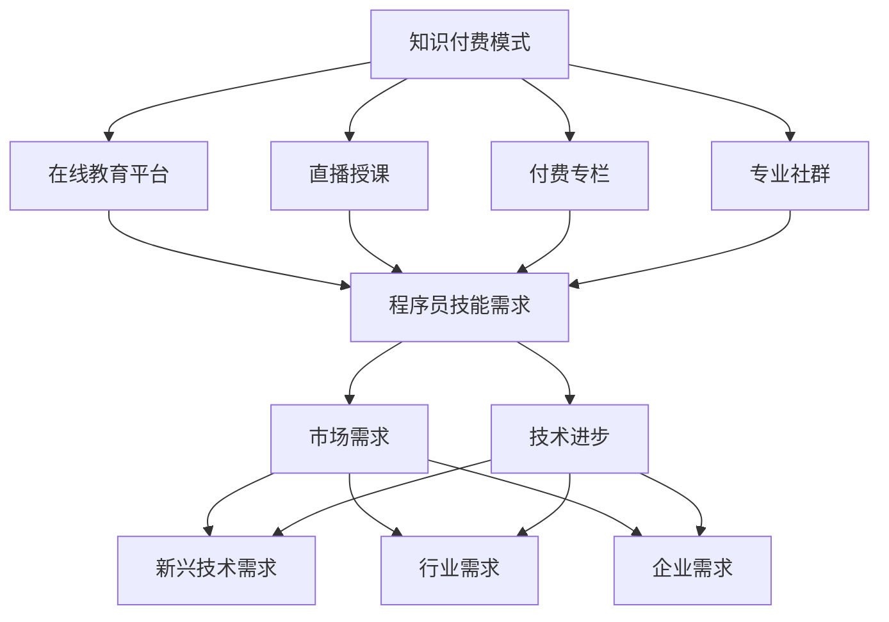

                 

关键词：知识付费、程序员发展、技能提升、职业规划、市场需求、技术进步

> 摘要：随着知识付费时代的到来，程序员面临着前所未有的发展机遇。本文将探讨程序员在知识付费背景下如何提升自身技能、优化职业规划，以及抓住市场需求和技术进步带来的机遇。

## 1. 背景介绍

知识付费，即用户为获取知识或技能而付费的一种商业模式，近年来在全球范围内迅速兴起。随着互联网和移动互联网的普及，人们获取信息的渠道变得多样化，传统的免费知识分享模式逐渐无法满足用户对深度、高质量内容的需求。程序员群体作为知识付费市场的重要组成部分，面临着新的挑战和机遇。

### 程序员在知识付费市场中的地位

程序员作为互联网时代的核心人才，其技能水平和职业发展直接影响到整个行业的技术水平和创新能力。在知识付费时代，程序员不仅能够通过付费课程、在线教育平台等渠道获取最新的技术知识和实践经验，还可以将自己的专业技能转化为付费内容，实现知识的变现和增值。

### 知识付费对程序员的影响

知识付费对程序员的影响主要体现在以下几个方面：

1. **技能提升**：程序员可以通过付费学习获取前沿技术知识，提升自身竞争力。
2. **职业发展**：知识付费为程序员提供了更多的职业发展机会，如成为独立开发者、技术顾问等。
3. **知识变现**：优秀的程序员可以将自己的知识和经验转化为付费内容，实现收入增长。

## 2. 核心概念与联系

为了更好地理解知识付费时代程序员的发展机遇，我们需要从以下几个方面介绍核心概念及其联系。

### 知识付费模式

知识付费模式主要包括以下几种：

1. **在线教育平台**：如Coursera、Udemy等，提供各种课程和技术教程。
2. **直播授课**：通过平台直播进行实时授课，如知乎Live、网易云课堂等。
3. **付费专栏**：如GitHub上的付费文章、技术博客等。
4. **专业社群**：如技术论坛、微信群等，通过会员制收取费用。

### 程序员技能需求

程序员技能需求可以分为以下几类：

1. **基础技能**：如编程语言、数据结构、算法等。
2. **技术栈技能**：如前端、后端、数据库、云计算等。
3. **软技能**：如项目管理、团队协作、沟通能力等。

### 市场需求

市场需求主要包括以下几个方面：

1. **新兴技术需求**：如人工智能、大数据、区块链等。
2. **行业需求**：如金融、医疗、电商等领域的特定技术需求。
3. **企业需求**：如企业数字化转型、IT基础设施建设等。

### 技术进步

技术进步为程序员提供了更多的发展机会，如：

1. **云计算**：提供了丰富的计算资源和平台服务。
2. **人工智能**：为程序员提供了新的编程领域和职业方向。
3. **区块链**：带来了新的技术挑战和商业机会。

### Mermaid 流程图



## 3. 核心算法原理 & 具体操作步骤

### 3.1 算法原理概述

在知识付费时代，程序员需要掌握一系列核心算法原理，以提高编程技能和解决实际问题的能力。以下是一些关键算法原理：

1. **排序算法**：包括冒泡排序、快速排序、归并排序等。
2. **搜索算法**：包括二分搜索、深度优先搜索、广度优先搜索等。
3. **动态规划**：解决最优化问题，如背包问题、爬楼梯问题等。
4. **图算法**：如Dijkstra算法、Floyd算法等，用于解决路径问题。
5. **数据结构**：如堆、队列、栈等，用于高效存储和操作数据。

### 3.2 算法步骤详解

以下是排序算法中的一个典型例子——快速排序的详细步骤：

1. **选择基准元素**：从数组中随机选择一个元素作为基准。
2. **分区操作**：将数组分为两部分，一部分是小于基准的元素，另一部分是大于基准的元素。
3. **递归排序**：对小于和大于基准的两部分数组重复步骤1和步骤2，直到所有子数组有序。

### 3.3 算法优缺点

**快速排序**：

- **优点**：时间复杂度为O(nlogn)，适用于大数据量的排序。
- **缺点**：最坏情况下时间复杂度为O(n^2)，需要进行额外的空间分配。

### 3.4 算法应用领域

排序算法在各个领域都有广泛应用，如数据库中的索引排序、搜索引擎的排序结果等。

## 4. 数学模型和公式 & 详细讲解 & 举例说明

### 4.1 数学模型构建

在算法分析和优化中，常用的数学模型包括时间复杂度和空间复杂度模型。以下是一个时间复杂度模型的示例：

$$
T(n) = O(n \log n)
$$

### 4.2 公式推导过程

时间复杂度通常通过大O符号表示，表示算法在最坏情况下的执行时间。推导时间复杂度公式通常涉及以下几个步骤：

1. **确定算法的基本操作**：如比较操作、赋值操作等。
2. **计算基本操作的执行次数**：通常通过递归或迭代方法。
3. **应用大O符号表示**：将基本操作的执行次数表示为函数的形式。

### 4.3 案例分析与讲解

以快速排序为例，其时间复杂度可以通过递归公式表示：

$$
T(n) = T(n/2) + n - 1
$$

通过递归展开和数学归纳法，可以推导出时间复杂度为：

$$
T(n) = O(n \log n)
$$

## 5. 项目实践：代码实例和详细解释说明

### 5.1 开发环境搭建

在本案例中，我们将使用Python编写一个快速排序的实现。首先，确保安装了Python 3环境。以下是Python环境的搭建步骤：

1. 访问[Python官网](https://www.python.org/)下载Python安装包。
2. 解压安装包并运行安装程序。
3. 安装完成后，打开终端并运行`python --version`验证Python版本。

### 5.2 源代码详细实现

以下是快速排序的Python代码实现：

```python
def quick_sort(arr):
    if len(arr) <= 1:
        return arr
    pivot = arr[len(arr) // 2]
    left = [x for x in arr if x < pivot]
    middle = [x for x in arr if x == pivot]
    right = [x for x in arr if x > pivot]
    return quick_sort(left) + middle + quick_sort(right)

arr = [3, 6, 8, 10, 1, 2, 1]
print(quick_sort(arr))
```

### 5.3 代码解读与分析

1. **快速排序函数**：定义了一个`quick_sort`函数，用于实现快速排序算法。
2. **基础情况处理**：当输入数组长度小于等于1时，直接返回数组。
3. **选择基准元素**：从数组中随机选择一个元素作为基准。
4. **分区操作**：使用列表推导式将数组分为小于、等于和大于基准的三部分。
5. **递归排序**：对小于和大于基准的两部分数组分别递归调用`quick_sort`函数。

### 5.4 运行结果展示

运行上述代码后，输出结果为：

```
[1, 1, 2, 3, 6, 8, 10]
```

这表明快速排序算法成功地将输入数组按升序排列。

## 6. 实际应用场景

### 6.1 在线教育平台

在线教育平台如Coursera、Udemy等，为程序员提供了丰富的学习资源和技术教程。程序员可以通过付费购买课程，学习新的编程技能和知识。

### 6.2 企业内训

企业为了提升员工的技能水平，通常会开展内训课程。程序员可以通过参加内训课程，了解企业所关注的最新技术和业务需求。

### 6.3 技术社区

技术社区如GitHub、Stack Overflow等，为程序员提供了一个交流和学习的平台。程序员可以通过参与社区讨论，分享自己的知识和经验，同时获取他人的帮助和反馈。

## 7. 未来应用展望

### 7.1 技术持续进步

随着人工智能、大数据、云计算等技术的持续进步，程序员将面临更多的发展机会。例如，人工智能技术的应用将使得程序员在机器学习、自然语言处理等领域有更大的发挥空间。

### 7.2 新兴领域需求

随着区块链、物联网等新兴领域的发展，程序员需要不断学习新的技术和知识，以适应市场需求。

### 7.3 跨学科融合

未来，程序员将与其他学科（如生物学、心理学等）融合，开发出更加智能化、人性化的应用程序。

## 8. 工具和资源推荐

### 8.1 学习资源推荐

1. **《代码大全》**：史蒂夫·麦卡锡（Steve McConnell）的《代码大全》是一本经典的编程书籍，涵盖了编程实践的各个方面。
2. **《深度学习》**：伊恩·古德费洛（Ian Goodfellow）、约书亚·本吉奥（Joshua Bengio）和亚伦·库维尔（Aaron Courville）的《深度学习》是深度学习的权威教材。

### 8.2 开发工具推荐

1. **Visual Studio Code**：一款强大的跨平台代码编辑器，支持多种编程语言和插件。
2. **Git**：一款分布式版本控制系统，用于代码管理和协作开发。

### 8.3 相关论文推荐

1. **"Deep Learning: A Brief History""**：一篇关于深度学习发展历程的综述论文。
2. **"The Bitcoin White Paper""**：比特币白皮书，介绍了区块链技术的原理和实现。

## 9. 总结：未来发展趋势与挑战

### 9.1 研究成果总结

知识付费时代为程序员提供了丰富的学习资源和职业发展机会。程序员可以通过在线教育平台、企业内训和技术社区等渠道提升自身技能。

### 9.2 未来发展趋势

随着技术的持续进步和新兴领域的需求，程序员将在更多领域发挥作用。跨学科融合和人工智能技术的应用将成为未来发展的趋势。

### 9.3 面临的挑战

程序员需要不断学习新的技术和知识，以适应快速变化的市场需求。同时，道德和伦理问题（如数据隐私、人工智能伦理等）也需要引起关注。

### 9.4 研究展望

未来，程序员将在更多领域发挥重要作用，如智能城市建设、医疗健康等。研究如何更好地应对挑战和机遇，将是未来研究的重点。

## 附录：常见问题与解答

### 1. 知识付费是否适合所有人？

知识付费适合对技术有较高要求、愿意投入时间和金钱提升自身技能的人群。对于初学者，建议先通过免费资源进行基础知识的学习。

### 2. 如何选择适合自己的知识付费课程？

选择知识付费课程时，可以从以下几个方面考虑：

1. **课程内容**：是否涵盖自己感兴趣的技术领域。
2. **授课讲师**：讲师的背景、经验和口碑。
3. **课程评价**：其他学员的评价和反馈。
4. **学习方式**：是否适合自己当前的学习节奏。

### 3. 知识付费如何影响职业发展？

知识付费可以帮助程序员：

1. **提升技能**：学习新技术和知识，提高自身竞争力。
2. **拓展职业方向**：了解新兴领域和技术趋势，开拓职业发展空间。
3. **建立人脉**：通过学习平台和社群，结识业界同行，建立合作关系。

### 4. 知识付费是否值得投资？

知识付费的性价比取决于个人情况和需求。对于有明确职业目标和愿意投入时间学习的人来说，知识付费是值得投资的。

### 5. 如何平衡工作与学习？

平衡工作与学习的方法包括：

1. **时间管理**：合理安排工作和学习时间，确保两者兼顾。
2. **提高工作效率**：通过优化工作流程和方法，提高工作效率，为学习留出时间。
3. **设定目标**：明确学习目标和计划，保持学习的动力和持续性。

## 作者署名

本文作者：禅与计算机程序设计艺术 / Zen and the Art of Computer Programming

