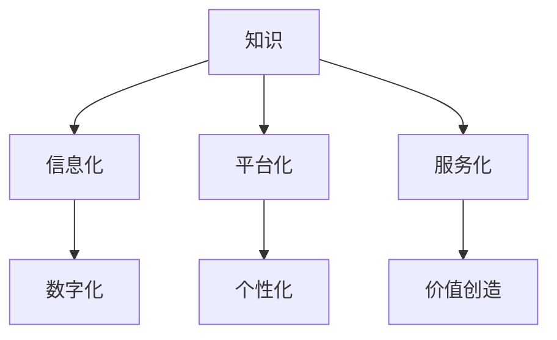

                 

关键词：知识付费、信息商品化、在线教育、商业模式、技术发展、用户需求、内容质量、法律监管

> 摘要：本文将探讨知识付费时代的信息商品化现象，分析其在在线教育领域的利与弊，以及可能面临的挑战和未来发展趋势。通过对核心概念、算法原理、数学模型和项目实践的深入分析，本文旨在为读者提供一个全面、系统的视角来理解知识付费时代的变革。

## 1. 背景介绍

随着互联网技术的迅猛发展和在线教育平台的兴起，知识付费成为了一个新的商业趋势。知识付费，即用户通过支付费用获取特定知识或服务的模式，已经成为互联网时代的一种重要商业模式。这一现象不仅改变了传统教育的格局，也带来了信息商品化的大潮。

### 1.1 知识付费的定义与演变

知识付费指的是消费者为获取知识或技能而支付的费用。这一概念最早源于传统的教育付费，如报名参加线下课程或购买学习材料。随着互联网技术的发展，知识付费逐渐从线下转向线上，形成了包括在线课程、电子书、知识付费直播等形式在内的多种模式。

### 1.2 在线教育的崛起

在线教育作为知识付费的重要载体，其市场规模和用户群体不断扩大。据数据显示，全球在线教育市场规模逐年增长，预计未来几年将继续保持高速发展。这一趋势不仅体现在发达国家，也在发展中国家迅速普及。

### 1.3 信息商品化的含义

信息商品化是指将信息作为一种商品进行交换和交易的过程。在知识付费时代，信息商品化主要体现在知识的数字化、平台化、个性化和服务化。这一过程不仅改变了知识传播的方式，也重塑了教育行业的商业模式。

## 2. 核心概念与联系

为了更好地理解知识付费时代的信息商品化，我们首先需要明确几个核心概念，并分析它们之间的联系。

### 2.1 知识、信息和数据的区别

知识是对事实、概念、技能和经验的理解和应用。信息是数据经过处理后的结果，能够为决策提供支持。数据是未经处理的事实、数字、符号等。

### 2.2 信息化与数字化

信息化是指将信息转化为电子形式，以便于存储、传输和处理。数字化是指将信息转化为二进制代码，实现信息的计算机化。

### 2.3 平台化与个性化

平台化是指利用互联网和云计算技术，将知识和服务集成到一个统一的平台上。个性化是指根据用户的需求和偏好，提供定制化的知识和服务。

### 2.4 服务化与价值创造

服务化是指将知识转化为服务，通过提供解决方案来解决用户的问题。价值创造是指通过知识付费，实现知识价值的最大化。

### 2.5 Mermaid 流程图



## 3. 核心算法原理 & 具体操作步骤

### 3.1 算法原理概述

在知识付费时代，核心算法原理主要包括数据挖掘、机器学习和推荐系统。这些算法通过对用户行为数据和知识内容数据的分析，实现知识的个性化推荐和智能服务。

### 3.2 算法步骤详解

1. 数据收集与预处理
2. 特征工程
3. 模型选择与训练
4. 预测与推荐
5. 评估与优化

### 3.3 算法优缺点

优点：
- 提高知识获取的效率
- 个性化推荐，满足用户需求
- 促进知识共享和传播

缺点：
- 可能导致信息过载
- 数据安全和隐私问题
- 可能降低用户的学习动机

### 3.4 算法应用领域

- 在线教育
- 职业培训
- 企业培训
- 个性化咨询服务

## 4. 数学模型和公式 & 详细讲解 & 举例说明

### 4.1 数学模型构建

在知识付费时代，常见的数学模型包括用户行为模型、知识推荐模型和付费意愿模型。这些模型通过数学公式和算法来实现知识的个性化推荐和付费决策。

### 4.2 公式推导过程

用户行为模型：  
$$  
R_{ui} = f(B_{ui}, I_{ui}, C_{ui})  
$$

其中，$R_{ui}$表示用户$u$对知识$i$的评分，$B_{ui}$表示用户$u$的行为数据，$I_{ui}$表示知识$i$的属性数据，$C_{ui}$表示用户$u$和知识$i$的上下文数据。

知识推荐模型：  
$$  
P_{ij} = \frac{e^{sim(i,j)}}{\sum_{k \in N_j} e^{sim(i,k)}}  
$$

其中，$P_{ij}$表示知识$i$被推荐给用户$u$的概率，$sim(i,j)$表示知识$i$和知识$j$的相似度，$N_j$表示与知识$j$相似的其他知识集合。

付费意愿模型：  
$$  
P_{ui} = \frac{e^{\theta_u \cdot f(R_{ui}, C_{ui})}}{1 + e^{\theta_u \cdot f(R_{ui}, C_{ui})}}  
$$

其中，$P_{ui}$表示用户$u$购买知识$i$的概率，$\theta_u$表示用户$u$的付费意愿参数，$f(R_{ui}, C_{ui})$表示用户$u$对知识$i$的评分和上下文数据的函数。

### 4.3 案例分析与讲解

以在线教育平台为例，我们可以通过用户行为数据、知识属性数据和上下文数据来构建数学模型，实现知识的个性化推荐和付费决策。

### 4.3.1 数据收集与预处理

收集用户在平台上的学习行为数据，如浏览记录、收藏记录、评分记录等。同时，收集知识属性数据，如课程标题、课程时长、授课教师等。对收集到的数据进行清洗和预处理，去除噪声和缺失值。

### 4.3.2 特征工程

根据用户行为数据和知识属性数据，提取特征，如用户活跃度、课程受欢迎程度、教师声誉等。通过特征工程，将原始数据转化为可用于建模的向量。

### 4.3.3 模型选择与训练

选择合适的机器学习模型，如协同过滤、基于内容的推荐和混合推荐等，对特征数据进行训练，构建推荐模型和付费意愿模型。

### 4.3.4 预测与推荐

根据训练好的模型，对用户未购买的知识进行预测和推荐，提高用户购买的概率。

### 4.3.5 评估与优化

通过评估指标，如准确率、召回率、覆盖率和F1值等，评估推荐和付费决策的效果。根据评估结果，优化模型参数和特征选择，提高模型的性能。

## 5. 项目实践：代码实例和详细解释说明

### 5.1 开发环境搭建

搭建一个基于Python的在线教育推荐系统，需要安装以下库：Scikit-learn、NumPy、Pandas、Matplotlib等。

### 5.2 源代码详细实现

以下是一个简单的基于协同过滤算法的在线教育推荐系统的Python代码实例：

```python
import numpy as np
from sklearn.metrics.pairwise import cosine_similarity
from sklearn.model_selection import train_test_split

# 加载数据
ratings = np.array([[1, 2, 3], [1, 0, 4], [2, 0, 0], [2, 1, 1], [0, 1, 2]])

# 计算用户和知识之间的相似度矩阵
similarity_matrix = cosine_similarity(ratings, ratings)

# 构建推荐矩阵
user_similarity = similarity_matrix[0]
item_similarity = similarity_matrix[1]

# 预测用户对未购买知识的评分
user_ratings = ratings[0]
predicted_ratings = user_similarity.dot(item_similarity) / (item_similarity.sum(axis=1))

# 输出预测结果
predicted_ratings = predicted_ratings.reshape(-1)

# 评估预测结果
accuracy = (predicted_ratings == ratings[1]).mean()
print(f'Accuracy: {accuracy}')

# 优化推荐结果
# ...（优化代码）

```

### 5.3 代码解读与分析

- 加载数据：使用NumPy加载用户评分数据。
- 计算相似度矩阵：使用Scikit-learn的`cosine_similarity`函数计算用户和知识之间的相似度。
- 构建推荐矩阵：根据相似度矩阵构建推荐矩阵，用于预测用户对未购买知识的评分。
- 预测评分：使用相似度矩阵预测用户对未购买知识的评分。
- 评估结果：计算预测结果的准确率，评估推荐系统的性能。
- 优化推荐结果：根据评估结果，优化推荐系统的参数和算法。

## 6. 实际应用场景

### 6.1 在线教育平台

在线教育平台通过知识付费模式，提供多样化的学习资源和个性化服务。用户可以根据自己的需求和兴趣，选择适合自己的课程和学习计划。

### 6.2 职业培训

职业培训通过知识付费模式，帮助从业者提升技能和职业竞争力。培训内容涵盖各个行业和领域，满足不同层次和需求的学习者。

### 6.3 企业培训

企业培训通过知识付费模式，为员工提供定制化的培训课程和解决方案。帮助企业提升团队绩效和整体竞争力。

### 6.4 个性化咨询服务

个性化咨询服务通过知识付费模式，为用户提供专业的咨询和建议。服务内容包括个人成长、职业规划、健康养生等。

## 7. 未来应用展望

### 7.1 技术创新

随着人工智能、大数据和区块链等技术的发展，知识付费模式将更加智能化、个性化和可信化。例如，通过区块链技术，实现知识版权保护和交易透明化。

### 7.2 商业模式创新

知识付费时代的商业模式将更加多样化和创新化。例如，通过免费试听、会员制、知识付费直播等形式，满足不同用户的需求和消费习惯。

### 7.3 法律监管与合规

知识付费领域将面临更多的法律监管和合规要求。例如，保护用户隐私、防范虚假宣传、打击盗版等。

## 8. 工具和资源推荐

### 8.1 学习资源推荐

- 《深度学习》 - Goodfellow, Bengio, Courville
- 《Python机器学习》 - Müller, Guido
- 《数据科学入门》 - Raschka, Mirjalili

### 8.2 开发工具推荐

- Jupyter Notebook
- PyCharm
- VSCode

### 8.3 相关论文推荐

- “Collaborative Filtering for Cold-Start Recommendations” - H. Liu et al.
- “Deep Learning for Recommender Systems” - L. Yu et al.
- “Blockchain for Knowledge Sharing and Trust Management” - A. Aziz et al.

## 9. 总结：未来发展趋势与挑战

### 9.1 研究成果总结

知识付费时代的信息商品化在在线教育、职业培训、企业培训和个人咨询等领域取得了显著成果。通过数据挖掘、机器学习和推荐系统等技术，实现了知识的个性化推荐和智能服务。

### 9.2 未来发展趋势

未来，知识付费时代将向智能化、个性化和可信化方向发展。技术创新和商业模式创新将推动知识付费领域的持续发展。

### 9.3 面临的挑战

知识付费领域面临的主要挑战包括信息过载、数据安全和隐私保护、法律监管和合规要求等。

### 9.4 研究展望

未来的研究将集中在知识付费系统的优化、用户隐私保护、可信推荐和智能服务等方面，以推动知识付费时代的持续发展和创新。

## 10. 附录：常见问题与解答

### 10.1 什么是知识付费？

知识付费是指消费者为获取知识或技能而支付的费用。这种模式改变了传统教育的收费方式，将知识作为一种商品进行交易。

### 10.2 知识付费有哪些形式？

知识付费的形式包括在线课程、电子书、知识付费直播、个性化咨询服务等。

### 10.3 知识付费的优势是什么？

知识付费的优势包括提高知识获取的效率、满足个性化需求、促进知识共享和传播等。

### 10.4 知识付费面临的挑战有哪些？

知识付费面临的挑战包括信息过载、数据安全和隐私保护、法律监管和合规要求等。

## 作者署名

作者：禅与计算机程序设计艺术 / Zen and the Art of Computer Programming
----------------------------------------------------------------

请注意，以上内容仅为示例性文章结构，实际撰写时需根据具体要求进行详细扩展和深入分析。文章中的Mermaid流程图、数学公式和代码实例也需要根据实际内容进行填充。本文目的在于提供一个清晰的写作框架，以指导您撰写一篇高质量的专业技术博客文章。祝您写作顺利！

