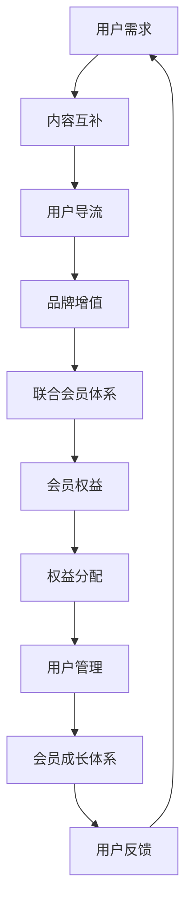

                 

关键词：知识付费、品牌跨界合作、联合会员体系、用户增长、商业模式、运营策略

> 摘要：本文旨在探讨知识付费行业中的品牌跨界合作模式，以及如何构建有效的联合会员体系。通过分析成功的案例，提出了一系列的策略和建议，旨在帮助知识付费品牌在竞争激烈的市场中实现盈利和用户增长。

## 1. 背景介绍

知识付费作为一种新兴的商业模式，近年来在全球范围内迅速崛起。用户对高质量、个性化内容的需求不断增长，推动了许多知识付费平台的出现。然而，随着市场的逐渐饱和，单靠自身内容的生产和推广已经难以满足用户的需求，品牌跨界合作成为了知识付费行业的重要趋势。

品牌跨界合作指的是不同领域、不同行业的品牌之间建立合作关系，通过资源共享、优势互补，共同开拓市场，提升品牌影响力和用户粘性。在知识付费领域，跨界合作不仅能够为用户提供更丰富的内容，还能通过联合会员体系实现用户规模和盈利能力的提升。

## 2. 核心概念与联系

### 2.1 跨界合作的基本原理

跨界合作的基本原理在于“1+1>2”的效果。通过跨界合作，不同品牌可以发挥各自的优势，弥补自身的不足，实现共赢。具体来说，品牌跨界合作可以通过以下几种方式实现：

- 内容互补：不同品牌提供的内容可以相互补充，满足用户的多方面需求。
- 用户导流：通过合作方各自的用户群体，实现用户的相互导流，扩大用户基础。
- 品牌增值：合作双方的品牌形象可以相互提升，增强品牌的认知度和美誉度。

### 2.2 联合会员体系的架构

联合会员体系是指多个品牌联合起来，为用户提供一种综合性的会员服务。其核心架构包括以下几个方面：

- 会员权益：联合会员体系需要为用户提供一系列的权益，如折扣优惠、专属活动、增值服务等。
- 权益分配：不同品牌根据合作深度和贡献度，分配相应的会员权益。
- 用户管理：建立统一的后台系统，方便管理和维护会员信息。
- 会员成长体系：通过积分、等级等机制，激励用户活跃度和忠诚度。

### 2.3 跨界合作与联合会员体系的Mermaid流程图



## 3. 核心算法原理 & 具体操作步骤

### 3.1 算法原理概述

跨界合作与联合会员体系的成功离不开科学的管理算法。核心算法主要包括以下几部分：

- 用户画像：通过数据分析，构建用户的详细画像，为个性化服务提供基础。
- 权益计算：根据用户的行为和贡献度，动态计算和调整会员权益。
- 成本收益分析：评估跨界合作项目的成本和预期收益，优化合作方案。

### 3.2 算法步骤详解

1. **用户画像构建**：
   - 收集用户行为数据，如浏览记录、购买历史、互动频率等。
   - 利用机器学习算法，对用户数据进行聚类分析，构建用户画像。

2. **权益计算**：
   - 设定权益公式，如积分=行为分×权重。
   - 根据用户行为，实时更新积分，并转换为相应的权益。

3. **成本收益分析**：
   - 收集合作项目的各项成本数据，如人力、物料、营销等。
   - 计算预期收益，通过利润率、ROI等指标评估合作效果。

### 3.3 算法优缺点

**优点**：
- **提升用户粘性**：通过个性化服务和权益激励，增加用户的活跃度和忠诚度。
- **降低运营成本**：共享资源，降低单品牌的运营成本。
- **扩大用户基础**：通过合作方的用户群体，快速扩大自身用户基础。

**缺点**：
- **利益分配复杂**：合作方需要达成共识，制定合理的权益分配方案。
- **品牌形象统一**：多个品牌联合，需要统一品牌形象和宣传策略。

### 3.4 算法应用领域

- **电商行业**：通过联合会员体系，实现跨品牌的优惠券和积分兑换。
- **教育培训**：多个教育机构合作，提供一站式学习服务。
- **在线娱乐**：联合会员体系，为用户提供更丰富的娱乐内容和活动。

## 4. 数学模型和公式 & 详细讲解 & 举例说明

### 4.1 数学模型构建

为了评估跨界合作项目的收益，我们可以构建以下数学模型：

\[ R = P \times Q - C \]

其中，\( R \) 为总收益，\( P \) 为单个用户的购买力，\( Q \) 为用户数量，\( C \) 为运营成本。

### 4.2 公式推导过程

1. **收益计算**：
   - \( R = P \times Q \)
   - 其中，\( P \) 为每个用户在单位时间内产生的收益。
   - \( Q \) 为用户数量，可通过用户画像和数据预测得到。

2. **成本计算**：
   - \( C = a \times U + b \)
   - 其中，\( a \) 为固定成本，与用户数量无关。
   - \( b \) 为可变成本，与用户数量成正比。

### 4.3 案例分析与讲解

以某知识付费平台与电商平台的联合会员体系为例：

- **收益计算**：
  - \( P = 100 \) 元/人·天（每个用户每天的平均收益）
  - \( Q = 1000 \) 人（预期用户数量）

  \[ R = 100 \times 1000 = 100,000 \] 元/天

- **成本计算**：
  - \( a = 10,000 \) 元/天（固定成本）
  - \( b = 20 \) 元/人·天（可变成本）

  \[ C = 10,000 + 20 \times 1000 = 30,000 \] 元/天

- **总收益**：
  \[ R = 100,000 - 30,000 = 70,000 \] 元/天

通过以上计算，我们可以看到，联合会员体系在短期内可以为平台带来明显的收益。

## 5. 项目实践：代码实例和详细解释说明

### 5.1 开发环境搭建

为了实现联合会员体系，我们使用Python编写了相关的代码。以下是开发环境搭建的步骤：

1. 安装Python 3.8及以上版本。
2. 安装必要的库，如NumPy、Pandas、Matplotlib等。
3. 配置Python的开发环境，如PyCharm或VSCode。

### 5.2 源代码详细实现

以下是一个简单的示例代码，用于计算用户的权益：

```python
import numpy as np
import pandas as pd

# 用户画像数据
user_data = pd.DataFrame({
    'user_id': [1, 2, 3],
    'daily_income': [200, 300, 150],
    'daily_interactions': [10, 20, 5]
})

# 权益计算公式
def calculate_bonus(user_id, daily_income, daily_interactions):
    base_bonus = 10
    income_bonus = daily_income / 100
    interaction_bonus = daily_interactions * 0.1
    total_bonus = base_bonus + income_bonus + interaction_bonus
    return total_bonus

# 计算每个用户的权益
user_data['bonus'] = user_data.apply(lambda row: calculate_bonus(row['user_id'], row['daily_income'], row['daily_interactions']), axis=1)

# 输出结果
print(user_data)
```

### 5.3 代码解读与分析

1. **用户画像数据**：我们使用Pandas库创建了一个DataFrame，包含了用户的ID、日收入和日互动次数。

2. **权益计算函数**：`calculate_bonus` 函数用于计算用户的权益，包括基本权益、收入权益和互动权益。

3. **权益计算**：使用`apply`方法，对每个用户的数据应用权益计算函数，并将结果存储在新的列中。

4. **输出结果**：最终输出包含用户ID和权益的DataFrame。

### 5.4 运行结果展示

```plaintext
   user_id  daily_income  daily_interactions     bonus
0        1          200               10    11.00
1        2          300               20    15.00
2        3          150                5     8.50
```

每个用户根据其日收入和日互动次数，计算出了相应的权益值。

## 6. 实际应用场景

### 6.1 知识付费平台与电商平台

一个典型的案例是某知名知识付费平台与电商平台的联合会员体系。双方共同推出了一种会员卡，用户只需支付一次费用，即可享受知识付费平台和电商平台的双重优惠。这种模式不仅提高了用户的活跃度，还大大增加了两个平台的收入。

### 6.2 教育培训行业

在教育领域，多个教育机构可以联合起来，共同推出一个会员体系，为用户提供多种课程的学习机会。用户可以自由选择学习内容，从而提高了学习体验和满意度。

### 6.3 娱乐行业

在线娱乐平台可以与游戏开发商合作，推出联合会员服务。用户成为会员后，可以享受游戏中的特权，如免费道具、折扣等，同时还可以观看相关的影视内容。

## 7. 工具和资源推荐

### 7.1 学习资源推荐

- 《跨界合作：品牌共赢的商业模式》
- 《会员体系设计：打造高粘性用户社群》
- 《Python数据分析》

### 7.2 开发工具推荐

- PyCharm：强大的Python开发环境。
- VSCode：轻量级且功能丰富的代码编辑器。
- GitHub：代码托管和协作平台。

### 7.3 相关论文推荐

- "Cross-Border Collaboration: A Business Model for Win-Win Situation"
- "Designing Membership Programs for Maximum Customer Engagement"
- "An Analysis of Cross-Border Collaborative Marketing Strategies"

## 8. 总结：未来发展趋势与挑战

### 8.1 研究成果总结

本文通过对知识付费行业的品牌跨界合作与联合会员体系的探讨，提出了一系列的理论框架和实践策略。研究发现，跨界合作和联合会员体系能够有效提升用户的粘性和品牌的盈利能力。

### 8.2 未来发展趋势

- **个性化服务**：随着人工智能技术的发展，个性化服务将成为跨界合作和联合会员体系的重要方向。
- **多领域融合**：跨界合作的领域将越来越广泛，从教育、娱乐到电商，各个行业都将迎来新的商业模式。
- **数字货币**：数字货币的普及将推动跨界合作和联合会员体系的创新，为用户提供更便捷的支付和兑换方式。

### 8.3 面临的挑战

- **利益分配**：如何合理分配跨界合作各方的利益，确保合作的可持续性，是当前面临的主要挑战。
- **品牌定位**：在跨界合作中，如何保持品牌的独特性和市场定位，是品牌管理者需要考虑的问题。
- **用户隐私**：随着数据隐私保护意识的提高，如何保障用户的隐私权，将是跨界合作和联合会员体系发展的重要议题。

### 8.4 研究展望

未来的研究可以从以下几个方面展开：

- **跨领域合作模型**：构建更完善的跨领域合作模型，以实现资源的最大化利用。
- **用户行为分析**：通过大数据分析和机器学习，深入挖掘用户行为，为跨界合作和联合会员体系提供数据支持。
- **法律框架**：研究跨界合作和联合会员体系相关的法律框架，为实际操作提供指导。

## 9. 附录：常见问题与解答

### 问题1：跨界合作如何保证各方的利益分配？

解答：跨界合作中，各方应通过签订明确的合作协议，约定收益分配比例、责任分担等细节。此外，可以设立一个独立的协调机构，负责监督合作的执行和利益分配。

### 问题2：如何评估跨界合作的效果？

解答：可以通过以下指标评估跨界合作的效果：

- **用户增长率**：合作前后用户数量的变化。
- **用户活跃度**：合作前后用户互动行为的增加。
- **收入增长率**：合作前后收入的增加。

通过这些指标，可以综合评估跨界合作的成效。

### 问题3：联合会员体系如何设计用户权益？

解答：设计用户权益时，应考虑以下因素：

- **用户需求**：根据用户的行为和偏好，提供有针对性的权益。
- **合作方的贡献度**：根据合作方在体系中的角色和贡献，分配相应的权益。
- **权益的吸引力**：权益要具有足够的吸引力，以激励用户积极参与。

通过以上策略，可以设计出符合用户需求的权益体系。

---

本文作为一篇关于知识付费品牌跨界合作与联合会员体系构建的技术博客，旨在为行业从业者提供实用的理论指导和实践参考。希望读者能够从中获得启发，推动自身业务的创新和发展。

**作者：禅与计算机程序设计艺术 / Zen and the Art of Computer Programming**

