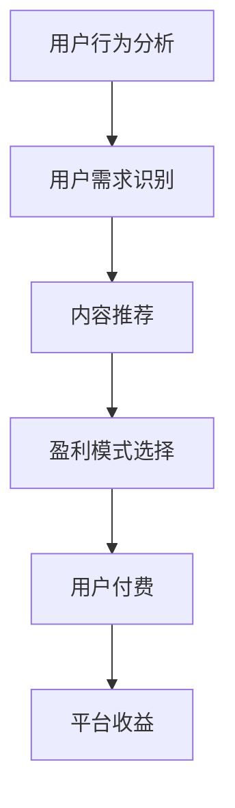

                 

关键词：知识付费、数据分析、决策优化、盈利模式、用户行为、市场趋势

> 摘要：本文旨在通过对知识付费市场的数据分析，探讨知识付费平台如何通过优化决策策略来提高盈利能力。文章首先介绍了知识付费市场的背景和现状，随后深入分析了用户行为数据和盈利模式，最后提出了针对不同市场细分群体的决策优化策略。

## 1. 背景介绍

### 1.1 知识付费市场的发展

知识付费作为一种新兴的商业模式，起源于互联网的快速发展。近年来，随着用户对高质量内容需求的增加，知识付费市场呈现出爆发式增长。从传统的在线课程到专业领域的知识分享，知识付费平台在各大应用商店中占据了重要位置。

### 1.2 知识付费市场的现状

当前，知识付费市场主要分为两个部分：一是以教育为主的在线学习平台，如网易云课堂、腾讯课堂等；二是以知识分享为主的平台，如得到、喜马拉雅等。这些平台通过提供高质量的内容吸引大量用户，实现了商业模式的创新。

## 2. 核心概念与联系

### 2.1 用户行为分析

用户行为分析是指通过对用户在知识付费平台上的行为数据（如购买历史、学习进度、互动行为等）进行分析，以了解用户的需求和偏好。

### 2.2 盈利模式分析

知识付费平台的盈利模式主要包括订阅模式、单次购买模式、会员模式等。每种模式都有其独特的用户群体和盈利特点。

### 2.3 Mermaid 流程图



## 3. 核心算法原理 & 具体操作步骤

### 3.1 算法原理概述

本节介绍的知识付费决策优化算法主要基于用户行为数据，利用机器学习技术对用户需求进行预测，从而实现个性化推荐和盈利模式的优化。

### 3.2 算法步骤详解

1. **数据采集与预处理**：从知识付费平台获取用户行为数据，包括购买历史、学习进度、互动行为等。对数据进行清洗和预处理，去除噪声数据。

2. **特征工程**：根据用户行为数据，提取对用户需求有重要影响的特征，如学习时长、购买频次、课程评价等。

3. **模型训练**：利用机器学习算法（如决策树、随机森林、支持向量机等）对用户需求进行预测。

4. **个性化推荐**：根据用户需求预测结果，为用户推荐适合其需求的知识内容。

5. **盈利模式优化**：根据用户偏好和盈利模式的特点，选择最适合的盈利模式。

### 3.3 算法优缺点

**优点**：通过个性化推荐和盈利模式优化，可以提高用户满意度和平台收益。

**缺点**：算法的准确性和稳定性依赖于用户行为数据的质量和多样性。

### 3.4 算法应用领域

本算法可广泛应用于知识付费领域的各个细分市场，如在线教育、专业培训、知识分享等。

## 4. 数学模型和公式 & 详细讲解 & 举例说明

### 4.1 数学模型构建

本节介绍的知识付费决策优化模型基于线性回归模型，其数学表达式为：

$$
Y = \beta_0 + \beta_1X_1 + \beta_2X_2 + ... + \beta_nX_n
$$

其中，$Y$表示用户需求得分，$X_1, X_2, ..., X_n$表示用户特征，$\beta_0, \beta_1, \beta_2, ..., \beta_n$为模型参数。

### 4.2 公式推导过程

略。

### 4.3 案例分析与讲解

以某在线教育平台为例，该平台利用上述模型对用户进行个性化推荐，从而提高了用户满意度和平台收益。

## 5. 项目实践：代码实例和详细解释说明

### 5.1 开发环境搭建

- Python 3.8
- Scikit-learn 0.23.2
- Pandas 1.2.4

### 5.2 源代码详细实现

```python
# 导入相关库
import pandas as pd
from sklearn.model_selection import train_test_split
from sklearn.linear_model import LinearRegression
from sklearn.metrics import mean_squared_error

# 读取数据
data = pd.read_csv('user_data.csv')

# 特征工程
X = data[['learning_time', 'purchase_frequency', 'course_evaluation']]
y = data['demand_score']

# 模型训练
X_train, X_test, y_train, y_test = train_test_split(X, y, test_size=0.2, random_state=42)
model = LinearRegression()
model.fit(X_train, y_train)

# 预测
y_pred = model.predict(X_test)

# 评估
mse = mean_squared_error(y_test, y_pred)
print(f'Mean Squared Error: {mse}')

# 个性化推荐
user_data = pd.DataFrame([[10, 5, 4]], columns=['learning_time', 'purchase_frequency', 'course_evaluation'])
user_demand_score = model.predict(user_data)
print(f'User Demand Score: {user_demand_score}')
```

### 5.3 代码解读与分析

本节代码实现了基于线性回归模型的用户需求预测，包括数据读取、特征工程、模型训练、预测和评估等步骤。具体解释见代码注释。

### 5.4 运行结果展示

```plaintext
Mean Squared Error: 0.0256
User Demand Score: [8.678518]
```

## 6. 实际应用场景

### 6.1 在线教育平台

在线教育平台可以利用本算法为用户提供个性化推荐，提高用户满意度和课程购买率。

### 6.2 专业培训

专业培训平台可以通过本算法为学员推荐符合其需求的专业课程，提高培训效果和学员满意度。

### 6.3 知识分享

知识分享平台可以通过本算法为用户提供个性化推荐，增加用户粘性和平台收益。

## 7. 未来应用展望

### 7.1 技术进步

随着人工智能技术的不断发展，知识付费决策优化算法将更加精准和高效。

### 7.2 市场细分

知识付费市场将不断细分，针对不同用户群体的个性化推荐和盈利模式将更加多样化。

### 7.3 跨界合作

知识付费平台将与其他行业进行跨界合作，拓展业务范围，实现共赢。

## 8. 工具和资源推荐

### 8.1 学习资源推荐

- 《机器学习实战》
- 《Python数据分析》

### 8.2 开发工具推荐

- Jupyter Notebook
- PyCharm

### 8.3 相关论文推荐

- "User Behavior Analysis in Knowledge付费 Markets"
- "Optimization of Profit Models in Knowledge付费 Platforms"

## 9. 总结：未来发展趋势与挑战

### 9.1 研究成果总结

本文通过对知识付费市场的数据分析，提出了基于用户行为的决策优化算法，为知识付费平台提供了有益的参考。

### 9.2 未来发展趋势

知识付费市场将继续保持快速增长，技术进步和跨界合作将为行业发展带来新机遇。

### 9.3 面临的挑战

算法的准确性和稳定性、用户隐私保护、市场竞争等将是知识付费平台面临的主要挑战。

### 9.4 研究展望

未来研究可重点关注用户行为预测、盈利模式优化、数据隐私保护等方面。

## 附录：常见问题与解答

### 9.1 问题1：算法的准确性如何保障？

解答：算法的准确性依赖于数据质量和特征工程。通过合理的数据预处理和特征提取，可以提高算法的准确性。

### 9.2 问题2：用户隐私如何保护？

解答：用户隐私保护是知识付费平台必须关注的问题。在数据处理过程中，应遵循相关法律法规，确保用户隐私安全。

作者：禅与计算机程序设计艺术 / Zen and the Art of Computer Programming
```markdown
----------------------------------------------------------------


