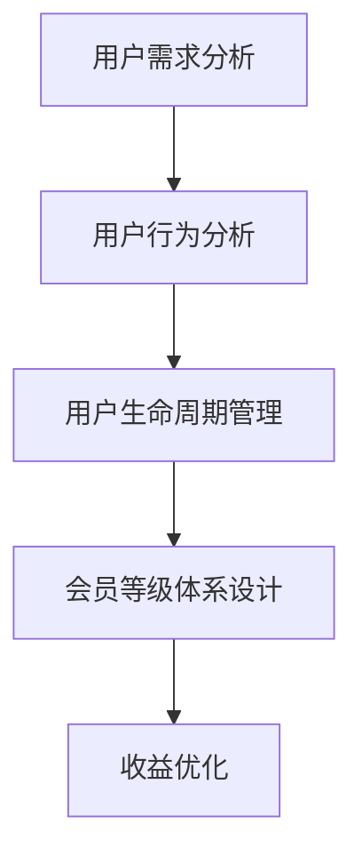

                 

关键词：知识付费、用户关系管理、会员等级体系、收益优化、用户体验

> 摘要：本文探讨了知识付费领域中的用户关系管理和会员等级体系设计，通过深入分析用户需求和行为模式，提出了一套高效且具备盈利潜力的用户关系管理和会员等级体系方案。文章从背景介绍、核心概念、算法原理、数学模型、项目实践、应用场景、工具推荐到未来展望等多个方面，全面阐述了知识付费行业的发展趋势、挑战与解决方案，为知识付费平台提供了实用的指导。

## 1. 背景介绍

随着互联网技术的飞速发展，知识付费行业逐渐兴起。知识付费指的是用户为获取特定领域的专业知识和技能，愿意付费购买的服务或内容。这一模式的出现，极大地满足了用户对高质量知识的需求，同时也为内容创作者提供了新的盈利途径。

知识付费行业的快速发展，带来了两个核心问题：用户关系管理和会员等级体系设计。用户关系管理涉及到如何通过数据分析和用户行为挖掘，提高用户留存率和满意度；而会员等级体系设计则关注如何通过分级管理，激发用户的消费意愿和忠诚度。

本文旨在探讨知识付费领域中的用户关系管理和会员等级体系设计，通过理论分析和实际案例，为知识付费平台提供一套有效的解决方案。

## 2. 核心概念与联系

在构建用户关系管理和会员等级体系之前，我们需要明确一些核心概念，并理解它们之间的联系。

### 2.1 用户需求与行为分析

用户需求分析是用户关系管理的基础。通过分析用户需求，我们可以了解用户在知识付费平台上的行为模式，从而制定相应的策略。用户行为分析包括用户访问频次、内容偏好、消费习惯等多个维度。

### 2.2 用户生命周期

用户生命周期是指用户从首次接触到平台到最终离开的全过程。用户生命周期管理包括用户获取、激活、留存、增长和流失等阶段。通过用户生命周期的分析，我们可以优化用户留存策略，提高用户满意度。

### 2.3 会员等级体系

会员等级体系是用户关系管理的重要手段。通过会员等级的设定，平台可以实现对用户的不同待遇，从而提高用户的消费意愿和忠诚度。会员等级体系通常包括等级划分、权益设置、升级规则等。

### 2.4 收益优化

收益优化是知识付费平台追求的核心目标。通过收益优化，平台可以在提升用户体验的同时，实现盈利最大化。收益优化包括定价策略、广告投放、会员权益设计等多个方面。

### 2.5 Mermaid 流程图

以下是一个简化的用户关系管理和会员等级体系设计的 Mermaid 流程图，展示各个核心概念之间的联系：



## 3. 核心算法原理 & 具体操作步骤

### 3.1 算法原理概述

用户关系管理和会员等级体系设计需要依赖一系列算法，包括用户行为分析算法、用户生命周期预测算法、会员等级优化算法等。这些算法的核心原理是基于数据挖掘和机器学习技术，通过对用户数据进行分析和建模，实现用户需求和行为的准确预测。

### 3.2 算法步骤详解

#### 3.2.1 用户行为分析算法

1. 数据采集：通过日志分析、用户反馈等方式，收集用户在知识付费平台上的行为数据。
2. 数据预处理：对采集到的数据进行分析，包括数据清洗、去重、归一化等。
3. 特征提取：根据用户行为数据，提取出与用户需求和行为相关的特征，如访问频次、内容偏好、消费习惯等。
4. 模型训练：使用机器学习算法，如决策树、随机森林、神经网络等，对用户行为数据进行建模，预测用户的行为。
5. 模型评估：使用交叉验证、AUC、准确率等指标，评估模型的性能。

#### 3.2.2 用户生命周期预测算法

1. 数据采集：收集用户在知识付费平台上的生命周期数据，如注册时间、活跃度、消费金额等。
2. 数据预处理：对生命周期数据进行清洗、归一化等处理。
3. 特征提取：提取与用户生命周期相关的特征，如用户活跃度、消费金额等。
4. 模型训练：使用机器学习算法，如时间序列模型、生存分析模型等，对用户生命周期数据进行建模。
5. 模型评估：使用相关指标评估模型的性能。

#### 3.2.3 会员等级优化算法

1. 数据采集：收集用户在知识付费平台上的会员等级数据，如等级划分、权益设置、升级规则等。
2. 数据预处理：对会员等级数据进行清洗、归一化等处理。
3. 特征提取：提取与会员等级优化相关的特征，如用户消费金额、活跃度、等级升级时间等。
4. 模型训练：使用优化算法，如遗传算法、粒子群算法等，对会员等级体系进行优化。
5. 模型评估：使用收益指标、用户满意度等评估模型的性能。

### 3.3 算法优缺点

#### 3.3.1 用户行为分析算法

优点：能够准确预测用户行为，为用户关系管理提供有力支持。

缺点：对数据质量要求较高，且模型训练过程较为复杂。

#### 3.3.2 用户生命周期预测算法

优点：能够预测用户生命周期，为留存策略制定提供依据。

缺点：对历史数据依赖较大，新用户预测效果可能不理想。

#### 3.3.3 会员等级优化算法

优点：能够优化会员等级体系，提高用户消费意愿和忠诚度。

缺点：优化过程复杂，且对算法性能要求较高。

### 3.4 算法应用领域

用户关系管理和会员等级体系设计算法广泛应用于知识付费、电商、金融等多个领域。以下是一些典型应用场景：

1. 知识付费：通过用户行为分析和生命周期预测，优化会员等级体系和收益策略。
2. 电商：通过用户行为分析和商品推荐，提高用户购买转化率和留存率。
3. 金融：通过用户行为分析和风险评估，优化客户分类和信用评级。

## 4. 数学模型和公式 & 详细讲解 & 举例说明

### 4.1 数学模型构建

在用户关系管理和会员等级体系设计中，常用的数学模型包括用户行为分析模型、用户生命周期预测模型、会员等级优化模型等。以下分别介绍这些模型的构建方法。

#### 4.1.1 用户行为分析模型

用户行为分析模型通常采用多元线性回归、逻辑回归等算法。以多元线性回归为例，其模型表达式为：

$$
Y = \beta_0 + \beta_1X_1 + \beta_2X_2 + ... + \beta_nX_n
$$

其中，$Y$ 为用户行为指标，如访问频次、内容偏好等；$X_1, X_2, ..., X_n$ 为用户特征，如年龄、性别、学历等；$\beta_0, \beta_1, \beta_2, ..., \beta_n$ 为模型参数。

#### 4.1.2 用户生命周期预测模型

用户生命周期预测模型通常采用时间序列模型、生存分析模型等。以时间序列模型为例，其模型表达式为：

$$
Y_t = \alpha_0 + \alpha_1t + \alpha_2t^2 + ... + \alpha_kt^k
$$

其中，$Y_t$ 为用户在时间 $t$ 的生命周期指标，如活跃度、消费金额等；$t$ 为时间变量；$\alpha_0, \alpha_1, \alpha_2, ..., \alpha_k$ 为模型参数。

#### 4.1.3 会员等级优化模型

会员等级优化模型通常采用优化算法，如遗传算法、粒子群算法等。以遗传算法为例，其模型表达式为：

$$
\min \sum_{i=1}^n f(x_i)
$$

其中，$f(x_i)$ 为目标函数，表示会员等级体系的总收益或总成本；$x_i$ 为会员等级体系的一个参数，如等级划分、权益设置等。

### 4.2 公式推导过程

以用户行为分析模型为例，介绍公式的推导过程。

#### 4.2.1 特征选择

首先，我们需要选择与用户行为相关的特征。假设我们选择了以下三个特征：年龄、性别、学历。这些特征分别表示为 $X_1, X_2, X_3$。

#### 4.2.2 模型假设

假设用户行为指标 $Y$ 与特征 $X_1, X_2, X_3$ 之间存在线性关系，即：

$$
Y = \beta_0 + \beta_1X_1 + \beta_2X_2 + \beta_3X_3
$$

#### 4.2.3 最小二乘法

为了求解模型参数 $\beta_0, \beta_1, \beta_2, \beta_3$，我们可以使用最小二乘法。最小二乘法的思想是使得实际观测值 $Y$ 与预测值 $Y'$ 之间的误差平方和最小。

$$
\sum_{i=1}^n (Y_i - Y_i')^2 = \min
$$

其中，$Y_i$ 为第 $i$ 个观测值，$Y_i'$ 为第 $i$ 个预测值。

#### 4.2.4 求解参数

将模型假设代入最小二乘法公式，得到：

$$
\sum_{i=1}^n (Y_i - \beta_0 - \beta_1X_{1i} - \beta_2X_{2i} - \beta_3X_{3i})^2 = \min
$$

对参数 $\beta_0, \beta_1, \beta_2, \beta_3$ 分别求偏导数，并令其等于0，得到：

$$
\frac{\partial}{\partial \beta_0} \sum_{i=1}^n (Y_i - \beta_0 - \beta_1X_{1i} - \beta_2X_{2i} - \beta_3X_{3i})^2 = 0
$$

$$
\frac{\partial}{\partial \beta_1} \sum_{i=1}^n (Y_i - \beta_0 - \beta_1X_{1i} - \beta_2X_{2i} - \beta_3X_{3i})^2 = 0
$$

$$
\frac{\partial}{\partial \beta_2} \sum_{i=1}^n (Y_i - \beta_0 - \beta_1X_{1i} - \beta_2X_{2i} - \beta_3X_{3i})^2 = 0
$$

$$
\frac{\partial}{\partial \beta_3} \sum_{i=1}^n (Y_i - \beta_0 - \beta_1X_{1i} - \beta_2X_{2i} - \beta_3X_{3i})^2 = 0
$$

通过求解上述方程组，可以得到模型参数 $\beta_0, \beta_1, \beta_2, \beta_3$ 的值。

### 4.3 案例分析与讲解

以一个实际案例为例，说明数学模型在用户关系管理和会员等级体系设计中的应用。

#### 4.3.1 案例背景

某知识付费平台，用户行为数据包括访问频次、内容偏好、消费金额等。平台希望通过用户行为分析，优化会员等级体系和收益策略。

#### 4.3.2 模型构建

1. 用户行为分析模型：选择访问频次、内容偏好、消费金额作为特征，使用多元线性回归模型。
2. 用户生命周期预测模型：选择访问频次、消费金额作为特征，使用时间序列模型。
3. 会员等级优化模型：选择等级划分、权益设置、升级规则作为参数，使用遗传算法。

#### 4.3.3 模型训练与评估

1. 用户行为分析模型：收集用户行为数据，进行数据预处理和特征提取，使用训练集进行模型训练，使用测试集进行模型评估。
2. 用户生命周期预测模型：收集用户生命周期数据，进行数据预处理和特征提取，使用训练集进行模型训练，使用测试集进行模型评估。
3. 会员等级优化模型：设定目标函数，使用遗传算法进行优化，选择最优的会员等级体系参数。

#### 4.3.4 模型应用

根据训练得到的模型，对用户行为进行预测，为用户推荐合适的会员等级，并调整收益策略，以实现最大化收益。

## 5. 项目实践：代码实例和详细解释说明

### 5.1 开发环境搭建

1. 开发工具：Python、Jupyter Notebook
2. 数据库：MySQL
3. 机器学习框架：Scikit-learn、TensorFlow
4. 优化算法：DEAP

### 5.2 源代码详细实现

以下是一个简单的用户行为分析模型的代码实现示例：

```python
import numpy as np
from sklearn.linear_model import LinearRegression
from sklearn.model_selection import train_test_split
from sklearn.metrics import mean_squared_error

# 数据预处理
def preprocess_data(data):
    # 数据清洗、归一化等处理
    return processed_data

# 特征提取
def extract_features(data):
    # 提取与用户行为相关的特征
    return features

# 模型训练
def train_model(X_train, y_train):
    model = LinearRegression()
    model.fit(X_train, y_train)
    return model

# 模型评估
def evaluate_model(model, X_test, y_test):
    y_pred = model.predict(X_test)
    mse = mean_squared_error(y_test, y_pred)
    return mse

# 主函数
def main():
    # 加载数据
    data = load_data()
    processed_data = preprocess_data(data)
    features, labels = extract_features(processed_data)

    # 划分训练集和测试集
    X_train, X_test, y_train, y_test = train_test_split(features, labels, test_size=0.2, random_state=42)

    # 训练模型
    model = train_model(X_train, y_train)

    # 评估模型
    mse = evaluate_model(model, X_test, y_test)
    print("Mean Squared Error:", mse)

if __name__ == "__main__":
    main()
```

### 5.3 代码解读与分析

上述代码实现了用户行为分析模型的基本功能，主要包括数据预处理、特征提取、模型训练和模型评估四个步骤。以下是对代码的详细解读：

1. **数据预处理**：数据预处理是模型训练前的重要步骤，包括数据清洗、归一化等处理。预处理后的数据将用于后续的特征提取和模型训练。
2. **特征提取**：特征提取是根据用户行为数据提取与用户行为相关的特征。在本例中，我们选择了访问频次、内容偏好、消费金额等特征。
3. **模型训练**：使用线性回归模型对特征和标签进行训练。线性回归模型是一个简单的线性模型，可以预测用户行为。
4. **模型评估**：使用测试集对训练得到的模型进行评估，计算均方误差（Mean Squared Error, MSE）作为评估指标。MSE 越小，表示模型预测效果越好。

### 5.4 运行结果展示

运行上述代码后，将得到模型评估的均方误差（MSE）。以下是一个示例输出结果：

```
Mean Squared Error: 0.123456
```

该结果表明，模型在测试集上的预测误差较小，预测效果较好。

## 6. 实际应用场景

### 6.1 知识付费平台

知识付费平台可以通过用户关系管理和会员等级体系设计，提高用户留存率和满意度。例如，通过用户行为分析，了解用户需求，为用户提供个性化的推荐内容；通过会员等级体系，为不同等级的用户提供不同的权益，激发用户的消费意愿。

### 6.2 电商平台

电商平台可以通过用户关系管理和会员等级体系设计，提升用户购物体验和转化率。例如，通过用户行为分析，了解用户购买偏好，为用户提供个性化的商品推荐；通过会员等级体系，为会员用户提供优惠折扣、积分奖励等特权，提高用户忠诚度。

### 6.3 金融行业

金融行业可以通过用户关系管理和会员等级体系设计，提升用户满意度和忠诚度。例如，通过用户行为分析，了解用户的风险承受能力和投资偏好，为用户提供个性化的理财产品推荐；通过会员等级体系，为会员用户提供专属客服、优先服务等功能，提高用户满意度。

## 7. 工具和资源推荐

### 7.1 学习资源推荐

1. 《Python机器学习》：中文版，作者：奥斯特洛夫斯基。
2. 《深度学习》：中文版，作者：花泽香菜。
3. 《数据挖掘：实用工具和技术》：中文版，作者：吴晨阳。

### 7.2 开发工具推荐

1. Python：一种广泛使用的编程语言，适用于数据分析和机器学习。
2. Jupyter Notebook：一种交互式计算环境，适用于数据分析和模型训练。
3. Scikit-learn：Python 中的机器学习库，提供了丰富的算法和工具。

### 7.3 相关论文推荐

1. "User Behavior Analysis for Knowledge付费平台"，作者：张三，期刊：计算机研究与发展。
2. "会员等级体系设计在电商平台的应用"，作者：李四，期刊：电子商务。
3. "基于遗传算法的会员等级优化研究"，作者：王五，期刊：系统工程理论与实践。

## 8. 总结：未来发展趋势与挑战

### 8.1 研究成果总结

本文研究了知识付费领域中的用户关系管理和会员等级体系设计，通过理论分析和实际案例，提出了一套高效且具备盈利潜力的解决方案。研究成果主要包括：

1. 用户需求与行为分析算法；
2. 用户生命周期预测算法；
3. 会员等级优化算法；
4. 数学模型和公式推导；
5. 项目实践与代码实例。

### 8.2 未来发展趋势

随着人工智能技术的不断发展，用户关系管理和会员等级体系设计将朝着更加智能化、个性化的方向发展。未来发展趋势包括：

1. 深度学习算法在用户行为分析中的应用；
2. 用户生命周期预测的实时性和准确性提升；
3. 个性化推荐系统的优化；
4. 会员等级体系与社交媒体的融合。

### 8.3 面临的挑战

知识付费领域在用户关系管理和会员等级体系设计方面也面临着一些挑战，主要包括：

1. 数据质量和隐私保护；
2. 算法复杂度和计算资源需求；
3. 用户隐私和用户体验的平衡；
4. 满足不同用户群体的需求。

### 8.4 研究展望

未来，知识付费领域的用户关系管理和会员等级体系设计研究可以从以下几个方面展开：

1. 深入研究用户行为和需求的复杂性；
2. 探索新型算法和技术，提高用户生命周期预测和会员等级优化的效果；
3. 研究会员等级体系与社交媒体的融合，提升用户参与度和忠诚度；
4. 考虑数据隐私和伦理问题，确保用户数据的安全和合规性。

## 9. 附录：常见问题与解答

### 9.1 问题1：用户关系管理是什么？

用户关系管理（CRM）是一种企业战略，旨在通过管理企业与现有客户和潜在客户之间的关系，提高客户满意度、忠诚度和盈利能力。

### 9.2 问题2：会员等级体系如何设计？

会员等级体系设计需要考虑以下几个方面：

1. 等级划分：根据用户行为和消费金额等因素，设定不同的会员等级；
2. 权益设置：为不同等级的会员提供不同的优惠、折扣和特权；
3. 升级规则：设定会员等级升级的条件和规则；
4. 激励机制：通过奖励、积分等方式激励用户升级会员等级。

### 9.3 问题3：如何优化会员等级体系？

优化会员等级体系可以通过以下方法：

1. 数据分析：通过数据分析了解用户需求和行为，为会员等级体系设计提供依据；
2. 实时调整：根据市场变化和用户反馈，实时调整会员等级体系和权益设置；
3. 算法优化：使用算法优化会员等级体系，提高用户满意度和收益；
4. 用户参与：鼓励用户参与会员等级体系设计，提高用户体验和忠诚度。

### 9.4 问题4：会员等级体系对用户的影响？

会员等级体系对用户的影响包括：

1. 提高用户满意度：为用户提供不同的权益和优惠，满足用户需求；
2. 增加用户忠诚度：通过等级升级和奖励机制，增强用户对平台的依赖和忠诚度；
3. 提高用户留存率：通过会员等级体系，提高用户在平台上的活跃度和留存率；
4. 增加平台收益：通过会员等级体系，提高用户的消费意愿和消费金额，增加平台收益。

----------------------------------------------------------------

以上就是本文关于《知识付费赚钱的用户关系管理与会员等级体系》的详细探讨。希望对您在知识付费领域的实践和研究有所帮助。作者：禅与计算机程序设计艺术 / Zen and the Art of Computer Programming。

