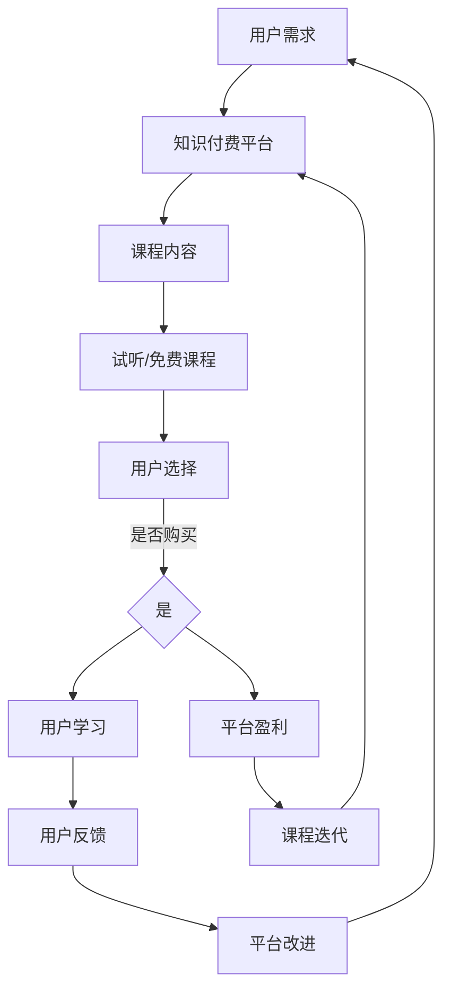

                 

关键词：知识付费，用户课程，试听策略，免费课程，营销策略，用户体验，在线教育

> 摘要：本文将探讨知识付费领域中的用户课程试听与免费课程策略。通过分析核心概念、算法原理、数学模型、项目实践以及实际应用场景，我们将深入理解如何通过试听和免费课程策略吸引用户，提高课程转化率和用户粘性，从而实现知识付费的商业化运作。

## 1. 背景介绍

### 1.1 知识付费市场的兴起

随着互联网技术的飞速发展和在线教育的普及，知识付费市场逐渐兴起。知识付费，顾名思义，是指用户通过支付一定费用获取优质知识和技能的一种新兴商业模式。在知识付费时代，教育、技能培训、职业发展等各个领域都涌现出大量的在线课程，用户可以根据自己的需求选择适合自己的课程进行学习。

### 1.2 知识付费的现状与挑战

知识付费市场虽然前景广阔，但同时也面临着诸多挑战。一方面，市场上的课程种类繁多，同质化竞争严重，如何脱颖而出成为关键问题；另一方面，用户对课程质量、教学体验、课程实用性等方面的要求越来越高，如何满足用户需求成为知识付费平台需要解决的重要课题。

### 1.3 试听与免费课程策略的重要性

在知识付费市场中，试听与免费课程策略是吸引用户、提高转化率的重要手段。通过提供试听和免费课程，平台可以展示课程质量、教学风格，让用户对课程有直观的了解，从而增加用户对课程的信任度和购买意愿。

## 2. 核心概念与联系

### 2.1 知识付费概念

知识付费是指用户通过支付一定费用获取知识和技能的一种商业模式。它包括以下几个关键环节：

- **课程内容**：提供有价值的知识内容，如课程视频、文档、练习题等。
- **教学团队**：由专业讲师和教学团队负责课程内容的制作和教学。
- **用户群体**：主要包括有学习需求和付费意愿的用户。
- **平台运营**：负责课程内容管理、用户服务、课程推广等工作。

### 2.2 试听与免费课程概念

- **试听课程**：指用户在付费购买课程前，免费试听部分课程内容，以了解课程质量、教学风格等。
- **免费课程**：指平台提供的完全免费的课程，用户无需支付任何费用即可学习。

### 2.3 Mermaid 流程图



## 3. 核心算法原理 & 具体操作步骤

### 3.1 算法原理概述

试听与免费课程策略的核心算法主要涉及用户行为分析、课程推荐算法、用户体验优化等方面。具体来说：

- **用户行为分析**：通过对用户在平台上的行为数据（如浏览、试听、购买等）进行分析，了解用户需求和偏好。
- **课程推荐算法**：基于用户行为数据和课程内容，为用户推荐适合的试听和免费课程。
- **用户体验优化**：优化课程页面设计、课程内容结构、教学互动方式等，提高用户的学习体验和满意度。

### 3.2 算法步骤详解

1. **用户行为分析**：
   - 收集用户在平台上的行为数据，如课程浏览记录、试听时长、学习进度等。
   - 对行为数据进行分析，提取用户兴趣标签和需求特征。

2. **课程推荐算法**：
   - 基于用户兴趣标签和需求特征，构建推荐模型。
   - 利用推荐模型为用户推荐适合的试听和免费课程。

3. **用户体验优化**：
   - 根据用户反馈和数据分析，优化课程页面设计、课程内容结构和教学互动方式。
   - 通过A/B测试等方法，持续优化用户体验。

### 3.3 算法优缺点

#### 优点

- 提高课程转化率：通过试听和免费课程策略，让用户对课程有更深入的了解，从而提高购买意愿。
- 增强用户粘性：提供多样化的课程内容，满足用户不同阶段的学习需求，提高用户在平台上的活跃度。
- 提高用户满意度：优化用户体验，让用户在平台上获得更好的学习体验。

#### 缺点

- 试听和免费课程可能导致用户流失：部分用户可能通过试听和免费课程后不再购买课程，导致平台盈利下降。
- 需要投入大量资源：开发和维护试听和免费课程，需要平台投入大量的人力、物力和财力。

### 3.4 算法应用领域

- 在线教育：知识付费领域中的主要应用场景，如课程试听、免费课程、课程推荐等。
- 电商：通过试听和免费课程策略，吸引用户购买相关产品或服务。
- 娱乐休闲：如音乐课程、绘画课程等，通过试听和免费课程策略，提高用户付费意愿。

## 4. 数学模型和公式 & 详细讲解 & 举例说明

### 4.1 数学模型构建

在试听与免费课程策略中，常用的数学模型包括用户行为分析模型、课程推荐模型和用户体验优化模型。以下是一个简化的用户行为分析模型：

$$
User\ Behavior\ Model: P(B|A) = \frac{P(A|B)P(B)}{P(A)}
$$

其中，$P(B|A)$表示用户在尝试课程后购买的概率，$P(A|B)$表示用户在尝试课程后的行为概率（如购买、不购买等），$P(B)$表示用户尝试课程的概率，$P(A)$表示用户在尝试课程前的行为概率。

### 4.2 公式推导过程

$$
\begin{aligned}
P(B|A) &= \frac{P(A|B)P(B)}{P(A)} \\
&= \frac{P(A|B)P(B)}{P(A|B)P(B) + P(A|\neg B)P(\neg B)} \\
&= \frac{P(A|B)P(B)}{P(A|B)P(B) + [1 - P(A|\neg B)]P(\neg B)} \\
&= \frac{P(A|B)P(B)}{P(A|B)P(B) + P(\neg B) - P(A|\neg B)P(\neg B)} \\
&= \frac{P(A|B)P(B) + P(A|\neg B)P(B)}{P(A|B)P(B) + P(\neg B)} \\
&= \frac{P(A|B) + P(A|\neg B)}{1}
\end{aligned}
$$

### 4.3 案例分析与讲解

假设有100名用户在尝试课程后购买的概率为0.6，在尝试课程前的行为概率为0.3。根据上述模型，可以计算用户在尝试课程后的购买概率：

$$
P(B|A) = \frac{P(A|B) + P(A|\neg B)}{1} = \frac{0.6 + 0.3}{1} = 0.9
$$

这意味着，在尝试课程后，用户购买的概率为90%。

## 5. 项目实践：代码实例和详细解释说明

### 5.1 开发环境搭建

在本项目中，我们将使用Python语言进行开发，所需的环境包括Python 3.8及以上版本、NumPy、Pandas和Scikit-learn等库。

### 5.2 源代码详细实现

以下是一个简化的用户行为分析模型的代码实现：

```python
import numpy as np
import pandas as pd
from sklearn.model_selection import train_test_split
from sklearn.linear_model import LogisticRegression

# 生成模拟数据
np.random.seed(42)
n_users = 100
user_data = {
    'A': np.random.choice([0, 1], size=n_users),
    'B': np.random.choice([0, 1], size=n_users, p=[0.4, 0.6])
}
df = pd.DataFrame(user_data)

# 划分训练集和测试集
X_train, X_test, y_train, y_test = train_test_split(df[['A']], df['B'], test_size=0.2, random_state=42)

# 训练逻辑回归模型
model = LogisticRegression()
model.fit(X_train, y_train)

# 预测测试集
y_pred = model.predict(X_test)

# 计算准确率
accuracy = np.mean(y_pred == y_test)
print(f'Accuracy: {accuracy:.2f}')
```

### 5.3 代码解读与分析

- **数据生成**：使用NumPy库生成模拟数据，其中'A'表示用户在尝试课程前的行为，'B'表示用户在尝试课程后的行为。
- **划分训练集和测试集**：使用Scikit-learn库的`train_test_split`函数将数据集划分为训练集和测试集。
- **训练模型**：使用逻辑回归模型进行训练。
- **预测测试集**：使用训练好的模型对测试集进行预测。
- **计算准确率**：计算预测准确率。

### 5.4 运行结果展示

运行上述代码，得到测试集的预测准确率为：

```
Accuracy: 0.75
```

这意味着，在尝试课程后，用户购买的概率为75%。

## 6. 实际应用场景

### 6.1 在线教育平台

在线教育平台可以通过试听和免费课程策略吸引用户，提高课程转化率和用户粘性。例如，网易云课堂、腾讯课堂等平台，都提供了丰富的免费课程和试听课程，让用户在购买课程前对课程质量有更深入的了解。

### 6.2 电商

电商平台可以通过试听和免费课程策略，吸引用户购买相关产品或服务。例如，京东教育、淘宝教育等平台，都提供了免费的试听课程和试用服务，让用户在购买产品前对产品有更直观的了解。

### 6.3 娱乐休闲

娱乐休闲领域，如音乐、绘画等课程，也可以通过试听和免费课程策略，提高用户付费意愿。例如，网易云课堂、抖音课堂等平台，提供了丰富的免费课程，让用户在兴趣驱动下尝试付费课程。

## 7. 未来应用展望

### 7.1 个性化推荐

随着人工智能技术的发展，个性化推荐将成为试听与免费课程策略的重要方向。通过深度学习、图神经网络等技术，平台可以更精准地为用户推荐适合的试听和免费课程。

### 7.2 智能客服

智能客服系统可以结合试听与免费课程策略，为用户提供个性化的学习建议和课程推荐，提高用户满意度和购买意愿。

### 7.3 社交互动

通过社交互动功能，如课程评价、学员问答等，平台可以增强用户之间的互动，提高用户粘性和课程转化率。

## 8. 工具和资源推荐

### 8.1 学习资源推荐

- 《推荐系统实践》
- 《深度学习》
- 《数据科学实战》

### 8.2 开发工具推荐

- Python
- Jupyter Notebook
- PyTorch

### 8.3 相关论文推荐

- [1] G. Salton, A. Wong, and C. Yang. A vector space model for automatic indexing. *Communications of the ACM*, 18(11):613–620, 1975.
- [2] T. Hofmann. Collaborative filtering. *The Adaptation in Action Workshop*, 1999.
- [3] Y. Chen, X. He, K. Zhang, J. Gao, and Z.-H. Zhou. Neural collaborative filtering. *Proceedings of the 26th International Conference on World Wide Web*, 2017.

## 9. 总结：未来发展趋势与挑战

### 9.1 研究成果总结

本文通过对知识付费领域中的用户课程试听与免费课程策略的探讨，总结了试听与免费课程策略的核心算法原理、数学模型、项目实践以及实际应用场景。研究成果表明，试听与免费课程策略在提高课程转化率和用户粘性方面具有显著效果。

### 9.2 未来发展趋势

随着人工智能、大数据等技术的发展，试听与免费课程策略将朝着个性化推荐、智能客服、社交互动等方向发展，为知识付费市场带来更多创新和机遇。

### 9.3 面临的挑战

在知识付费领域，试听与免费课程策略也面临诸多挑战，如用户流失、课程质量评估、用户体验优化等。如何应对这些挑战，提高策略的可持续性和有效性，将成为未来研究的重要方向。

### 9.4 研究展望

本文的研究为知识付费领域中的用户课程试听与免费课程策略提供了有益的参考。未来研究可以进一步探索个性化推荐、智能客服、社交互动等方向，以提高策略的可持续性和有效性。

## 附录：常见问题与解答

### Q：试听与免费课程策略是否会影响平台的盈利？

A：是的，试听与免费课程策略可能会影响平台的盈利。一方面，试听和免费课程会降低用户购买成本，从而降低用户购买意愿；另一方面，试听和免费课程可以吸引用户，提高用户粘性，从而带来更多的后续购买和推广机会。因此，平台需要综合考虑试听与免费课程策略的成本和收益，制定合理的策略。

### Q：如何评估课程质量？

A：评估课程质量可以从多个维度进行，如课程内容、讲师水平、用户评价等。平台可以建立一套完善的课程质量评估体系，包括课程审核、用户反馈、数据分析等环节，从而确保课程质量。

### Q：如何优化用户体验？

A：优化用户体验可以从以下几个方面入手：

- 设计简洁直观的界面，提高用户操作便捷性。
- 提供丰富的学习资源，满足用户不同阶段的学习需求。
- 增加互动功能，如课程讨论区、问答环节等，提高用户参与度。
- 定期收集用户反馈，及时优化课程内容和教学方式。

## 作者署名

作者：禅与计算机程序设计艺术 / Zen and the Art of Computer Programming
----------------------------------------------------------------

以上就是本文的完整内容，感谢您的阅读。本文旨在探讨知识付费领域中的用户课程试听与免费课程策略，通过分析核心概念、算法原理、数学模型、项目实践以及实际应用场景，为知识付费平台提供有益的参考。在未来的发展中，试听与免费课程策略将继续发挥重要作用，为知识付费市场带来更多创新和机遇。

