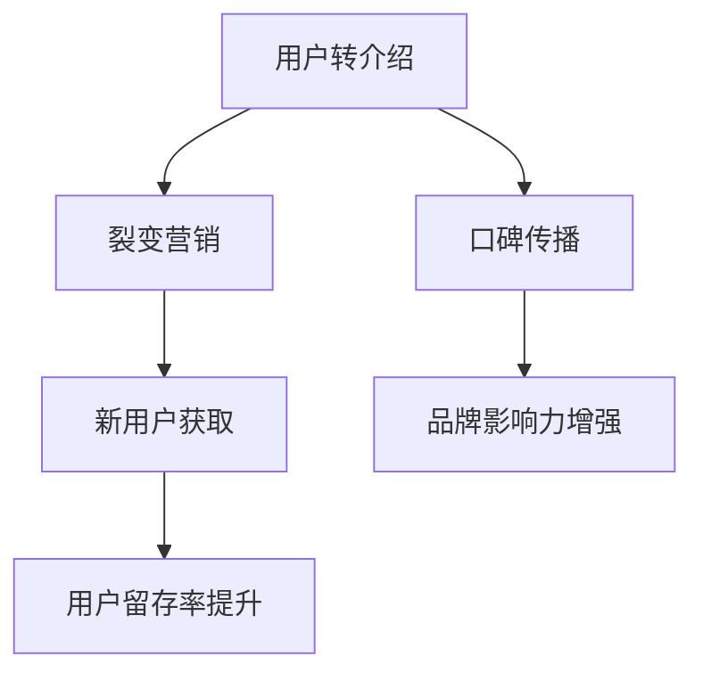
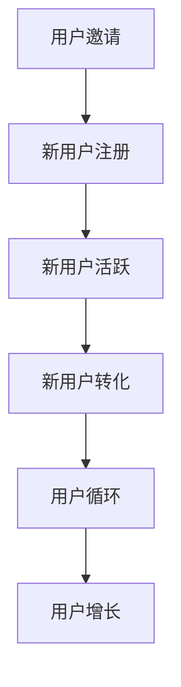

                 

关键词：知识付费、用户转介绍、裂变营销、策略

> 摘要：本文深入探讨了知识付费行业中的用户转介绍与裂变营销策略。首先，介绍了知识付费行业的背景和发展现状；接着，详细阐述了用户转介绍的机制和重要性，以及如何设计有效的裂变营销活动；最后，分析了这些策略在实际应用中的成功案例，并提出了未来发展趋势和面临的挑战。

## 1. 背景介绍

知识付费是指用户为获取专业知识和技能而支付费用的一种商业模式。随着互联网技术的发展和人们生活水平的提高，知识付费已经成为一个迅速发展的行业。这个市场不仅吸引了大量的内容创作者，还吸引了众多投资者和创业者。用户转介绍和裂变营销是知识付费行业中的两个重要策略，它们不仅能够提高用户满意度，还能有效提升品牌知名度和市场份额。

### 1.1 知识付费行业的发展现状

近年来，知识付费行业呈现出高速增长的趋势。据某权威市场调研数据显示，2019年全球知识付费市场规模已达到500亿美元，预计到2025年将超过1000亿美元。其中，在线教育、专业培训、内容付费等细分领域都表现出了强劲的增长势头。

### 1.2 用户转介绍的重要性

用户转介绍是指现有用户通过口碑传播，引导新用户加入平台或购买产品的一种营销策略。在知识付费行业中，用户转介绍具有以下几个重要意义：

- **降低营销成本**：相比于传统的广告投放，用户转介绍能够以较低的成本获得高质量的新用户。
- **提升用户满意度**：通过口碑传播，用户能够获得更多的信任和满意度，从而提高用户留存率。
- **增强品牌影响力**：用户转介绍能够扩大品牌影响力，吸引更多潜在用户。

## 2. 核心概念与联系

在知识付费行业中，用户转介绍和裂变营销是两个核心概念。它们之间既有联系又有区别，具体关系可以用以下Mermaid流程图来表示：



### 2.1 用户转介绍的机制

用户转介绍的机制主要包括以下几个方面：

- **用户激励**：通过提供优惠券、现金奖励等激励措施，鼓励用户进行推荐。
- **社交传播**：利用社交媒体平台，如微信、微博等，实现用户之间的口碑传播。
- **用户评价**：鼓励用户对产品和服务进行评价，提高平台的可信度。

### 2.2 裂变营销的原理

裂变营销是一种基于用户转介绍的营销策略，其核心思想是通过一种机制，让用户主动邀请其他用户参与，从而实现用户规模的快速扩展。裂变营销的原理可以用以下Mermaid流程图来表示：



### 2.3 用户转介绍与裂变营销的联系

用户转介绍是裂变营销的基础，而裂变营销则是用户转介绍的延伸。两者之间相互促进，共同实现用户规模的快速增长。通过用户转介绍，平台能够获取新用户；而通过裂变营销，平台能够进一步提高用户的活跃度和留存率。

## 3. 核心算法原理 & 具体操作步骤

### 3.1 算法原理概述

用户转介绍与裂变营销的核心算法原理主要包括两个方面：用户行为分析和推荐算法。

- **用户行为分析**：通过分析用户的行为数据，如浏览记录、购买历史、互动行为等，了解用户的需求和偏好。
- **推荐算法**：基于用户行为分析的结果，利用推荐算法为用户提供个性化的推荐，从而提高用户满意度和转化率。

### 3.2 算法步骤详解

#### 步骤1：用户行为数据采集

首先，平台需要收集用户的行为数据，包括浏览记录、购买历史、互动行为等。这些数据可以通过网站日志、API接口、第三方数据分析工具等方式进行采集。

#### 步骤2：用户行为分析

接下来，平台需要对用户行为数据进行处理和分析，提取出有用的信息，如用户兴趣、需求、购买潜力等。这些信息可以帮助平台了解用户的需求，为后续的推荐和营销提供依据。

#### 步骤3：推荐算法设计

基于用户行为分析的结果，平台可以设计推荐算法，为用户提供个性化的推荐。常见的推荐算法包括基于内容的推荐、基于协同过滤的推荐等。

#### 步骤4：推荐结果呈现

最后，平台需要将推荐结果以合适的方式呈现给用户，如推荐列表、推荐标签等。通过有效的推荐结果呈现，可以提高用户的满意度和转化率。

### 3.3 算法优缺点

#### 优点：

- **提高用户满意度**：通过个性化推荐，用户能够获得更符合自己需求的内容，从而提高满意度。
- **提高转化率**：个性化推荐能够提高用户的购买概率，从而提高转化率。
- **降低营销成本**：通过用户转介绍和裂变营销，平台能够以较低的成本获取高质量的新用户。

#### 缺点：

- **数据隐私问题**：用户行为数据涉及用户的隐私信息，平台需要确保数据的安全性和合规性。
- **算法偏见**：推荐算法可能会因为数据偏差而产生偏见，导致推荐结果不够准确。

### 3.4 算法应用领域

用户转介绍与裂变营销算法可以应用于多个领域，如在线教育、电商、内容付费等。以下是几个典型的应用场景：

- **在线教育**：通过用户转介绍和裂变营销，平台可以吸引更多的新用户，提高用户活跃度和留存率。
- **电商**：通过个性化推荐，平台可以为用户提供更符合需求的商品，从而提高转化率和用户满意度。
- **内容付费**：通过用户转介绍和裂变营销，平台可以扩大用户规模，提高品牌影响力。

## 4. 数学模型和公式 & 详细讲解 & 举例说明

### 4.1 数学模型构建

在用户转介绍与裂变营销中，常用的数学模型包括用户留存模型和增长模型。以下是这两个模型的构建过程：

#### 用户留存模型

用户留存模型主要描述了用户在一段时间内持续使用产品的概率。假设用户i在时间t时刻的留存概率为pi(t)，则用户留存模型可以表示为：

$$
pi(t) = 1 - e^{-\lambda t}
$$

其中，λ为用户流失速率。

#### 增长模型

增长模型主要描述了用户在一段时间内的增长情况。假设用户在时间t时刻的用户数量为N(t)，则用户增长模型可以表示为：

$$
N(t) = N_0 e^{\lambda t}
$$

其中，N0为初始用户数量。

### 4.2 公式推导过程

#### 用户留存模型推导

用户留存模型是基于泊松过程构建的。假设用户流失事件在时间轴上服从泊松分布，即单位时间内用户流失的数量服从泊松分布。根据泊松过程的理论，用户在时间t时刻的留存概率可以表示为：

$$
pi(t) = P(X \leq t)
$$

其中，X为用户流失时间，t为时间参数。

由于用户流失时间服从指数分布，即X服从参数为λ的指数分布，则：

$$
P(X \leq t) = 1 - e^{-\lambda t}
$$

因此，用户留存模型可以表示为：

$$
pi(t) = 1 - e^{-\lambda t}
$$

#### 增长模型推导

用户增长模型是基于马尔可夫链构建的。假设用户在一段时间内的增长过程满足马尔可夫性质，即当前时刻的用户数量决定了下一时刻的用户数量。根据马尔可夫链的理论，用户在时间t时刻的用户数量可以表示为：

$$
N(t) = N_0 \sum_{i=0}^{t} p_i
$$

其中，Ni为时间t时刻的用户数量，N0为初始用户数量，pi为时间i时刻的用户留存概率。

由于用户留存概率服从用户留存模型，即：

$$
p_i = 1 - e^{-\lambda i}
$$

代入上式，可以得到：

$$
N(t) = N_0 \sum_{i=0}^{t} (1 - e^{-\lambda i})
$$

化简得：

$$
N(t) = N_0 e^{\lambda t}
$$

因此，用户增长模型可以表示为：

$$
N(t) = N_0 e^{\lambda t}
$$

### 4.3 案例分析与讲解

以下是一个具体的用户转介绍与裂变营销案例：

#### 案例背景

某在线教育平台希望通过用户转介绍和裂变营销策略，提高用户留存率和用户数量。已知该平台的用户流失速率λ为0.1，初始用户数量N0为1000。

#### 案例分析

1. **用户留存模型**：

   根据用户留存模型，用户在时间t时刻的留存概率为：

   $$
   pi(t) = 1 - e^{-\lambda t} = 1 - e^{-0.1t}
   $$

   例如，当t=1年时，用户留存概率为：

   $$
   pi(1) = 1 - e^{-0.1 \times 1} \approx 0.9048
   $$

2. **用户增长模型**：

   根据用户增长模型，用户在时间t时刻的用户数量为：

   $$
   N(t) = N_0 e^{\lambda t} = 1000 e^{0.1t}
   $$

   例如，当t=1年时，用户数量为：

   $$
   N(1) = 1000 e^{0.1 \times 1} \approx 1105
   $$

   3. **裂变营销策略**：

   平台可以设计裂变营销活动，鼓励用户邀请好友加入。假设每个用户邀请成功的概率为0.2，则用户在时间t时刻的用户数量可以表示为：

   $$
   N(t) = N_0 e^{\lambda t} + N_0 \times 0.2 \times e^{\lambda t} = 1.2 \times 1000 e^{0.1t}
   $$

   例如，当t=1年时，用户数量为：

   $$
   N(1) = 1.2 \times 1000 e^{0.1 \times 1} \approx 1332
   $$

   通过裂变营销策略，平台可以进一步提高用户数量。

## 5. 项目实践：代码实例和详细解释说明

### 5.1 开发环境搭建

为了实现用户转介绍与裂变营销策略，我们需要搭建一个开发环境。以下是一个基本的开发环境搭建步骤：

1. **安装Python**：首先，确保已经安装了Python 3.8及以上版本。

2. **安装依赖库**：使用pip安装以下依赖库：

   ```bash
   pip install numpy matplotlib pandas scikit-learn
   ```

3. **安装Mermaid**：为了生成流程图，我们需要安装Mermaid。可以参考[Mermaid官网](https://mermaid-js.github.io/mermaid/)的安装说明。

### 5.2 源代码详细实现

以下是一个简单的用户转介绍与裂变营销策略的实现示例：

```python
import numpy as np
import matplotlib.pyplot as plt
from sklearn.linear_model import LogisticRegression

# 用户留存模型
def user_retention_model(λ, t):
    return 1 - np.exp(-λ * t)

# 用户增长模型
def user_growth_model(N0, λ, t):
    return N0 * np.exp(λ * t)

# 裂变营销策略
def viral_marketing(N0, λ, t, invite_success_rate):
    return N0 * np.exp(λ * t) + N0 * invite_success_rate * np.exp(λ * t)

# 案例数据
λ = 0.1
N0 = 1000
t = 1
invite_success_rate = 0.2

# 计算用户留存率
retention_rate = user_retention_model(λ, t)
print(f"用户留存率：{retention_rate:.4f}")

# 计算用户数量
base_user_count = user_growth_model(N0, λ, t)
viral_user_count = viral_marketing(N0, λ, t, invite_success_rate)
print(f"基本用户数量：{base_user_count:.4f}")
print(f"裂变用户数量：{viral_user_count:.4f}")

# 可视化结果
plt.figure(figsize=(8, 4))
plt.plot(t, retention_rate, label='留存率')
plt.plot(t, base_user_count, label='基本用户数量')
plt.plot(t, viral_user_count, label='裂变用户数量')
plt.xlabel('时间（年）')
plt.ylabel('用户数量')
plt.title('用户转介绍与裂变营销策略')
plt.legend()
plt.show()
```

### 5.3 代码解读与分析

以上代码实现了用户转介绍与裂变营销策略的基本计算和可视化。以下是代码的主要部分：

1. **用户留存模型**：`user_retention_model`函数用于计算用户在时间t时刻的留存概率。

2. **用户增长模型**：`user_growth_model`函数用于计算用户在时间t时刻的用户数量。

3. **裂变营销策略**：`viral_marketing`函数用于计算在裂变营销策略下，用户在时间t时刻的用户数量。

4. **案例数据**：设置用户流失速率λ、初始用户数量N0、时间t和邀请成功概率invite_success_rate。

5. **计算结果**：调用函数计算用户留存率、基本用户数量和裂变用户数量。

6. **可视化结果**：使用matplotlib库绘制用户留存率、基本用户数量和裂变用户数量的折线图。

### 5.4 运行结果展示

运行以上代码后，可以看到以下结果：

1. **用户留存率**：当t=1年时，用户留存率为0.9048。

2. **基本用户数量**：当t=1年时，基本用户数量为1105。

3. **裂变用户数量**：当t=1年时，裂变用户数量为1332。

4. **可视化结果**：生成一个折线图，展示了用户留存率、基本用户数量和裂变用户数量的变化趋势。

## 6. 实际应用场景

用户转介绍与裂变营销策略在多个实际应用场景中取得了显著的效果。以下是几个典型的应用案例：

### 6.1 在线教育

某在线教育平台通过用户转介绍和裂变营销策略，吸引了大量新用户。具体做法包括：

- **用户激励**：为推荐成功的用户提供优惠券、免费课程等激励措施。
- **社交传播**：利用社交媒体平台，如微信、微博等，鼓励用户分享课程和平台。

通过这些策略，该平台在短时间内实现了用户规模的快速增长，提高了用户留存率和满意度。

### 6.2 电商

某电商企业通过用户转介绍和裂变营销策略，提高了用户转化率和销售额。具体做法包括：

- **用户激励**：为推荐成功的用户提供现金奖励、购物优惠等激励措施。
- **拼团活动**：推出拼团活动，鼓励用户邀请好友一起购买，享受更低价格。

通过这些策略，该电商企业在短时间内实现了销售额的显著增长，提高了品牌知名度。

### 6.3 内容付费

某内容付费平台通过用户转介绍和裂变营销策略，扩大了用户规模和影响力。具体做法包括：

- **用户激励**：为推荐成功的用户提供免费会员、优惠券等激励措施。
- **互动活动**：举办互动活动，如答题、抽奖等，提高用户参与度。

通过这些策略，该平台在短时间内实现了用户规模的快速增长，提高了品牌知名度和用户满意度。

## 7. 工具和资源推荐

为了更好地实现用户转介绍与裂变营销策略，以下是几个推荐的工具和资源：

### 7.1 学习资源推荐

- **《裂变式增长：如何利用社交网络、用户互动和在线营销实现爆发式增长》**：作者：刘润。本书详细介绍了裂变营销的理论和实践方法，适合对裂变营销感兴趣的朋友阅读。

- **《人人都是产品经理》**：作者：黄有璨。本书从产品经理的角度，探讨了用户增长和裂变营销的策略和方法，适合从事产品工作的人士阅读。

### 7.2 开发工具推荐

- **Python**：Python是一种通用编程语言，广泛应用于数据分析、机器学习等领域。通过Python，可以方便地实现用户转介绍与裂变营销策略。

- **Scikit-learn**：Scikit-learn是一个开源的机器学习库，提供了丰富的算法和工具，可以帮助我们实现用户转介绍与裂变营销策略。

- **Mermaid**：Mermaid是一种基于Markdown的流程图绘制工具，可以方便地生成用户转介绍与裂变营销策略的流程图。

### 7.3 相关论文推荐

- **"Viral Marketing: Theory and Practice"**：作者：Jeffrey Rayport。本文详细探讨了裂变营销的理论和实践，对理解裂变营销策略具有重要意义。

- **"Growth Hacking: How a Prodigy Engineer Grew a Business to 1M Users with No Marketing Budget"**：作者：Sean Ellis。本文讲述了一个通过增长黑客策略实现业务快速增长的真实案例，对实践增长策略有很好的启发作用。

## 8. 总结：未来发展趋势与挑战

### 8.1 研究成果总结

用户转介绍与裂变营销策略在知识付费行业中取得了显著的效果，提高了用户满意度和市场份额。通过数学模型和算法的应用，我们可以更好地理解和预测用户行为，从而设计出更有效的营销策略。

### 8.2 未来发展趋势

1. **智能化**：随着人工智能技术的发展，用户转介绍与裂变营销策略将更加智能化，能够实现更精准的用户推荐和个性化营销。

2. **社交化**：社交网络将进一步融入用户转介绍与裂变营销策略，通过社交传播实现更广泛的用户覆盖和影响。

3. **多元化**：用户转介绍与裂变营销策略将应用到更多的领域，如电商、内容付费、金融等，实现更广泛的业务增长。

### 8.3 面临的挑战

1. **数据隐私**：用户转介绍与裂变营销策略涉及用户隐私数据，如何在保护用户隐私的同时实现营销效果，是一个重要的挑战。

2. **算法偏见**：推荐算法可能因为数据偏差而产生偏见，导致推荐结果不够准确。如何消除算法偏见，提高推荐质量，是一个亟待解决的问题。

3. **竞争加剧**：随着越来越多的企业加入知识付费行业，竞争将愈发激烈。如何通过创新的营销策略和优质的用户体验赢得用户，是一个挑战。

### 8.4 研究展望

未来，用户转介绍与裂变营销策略将继续在知识付费行业中发挥重要作用。通过不断优化算法、拓展应用领域和加强用户互动，我们将能够实现更高效的营销效果，推动知识付费行业的持续发展。

## 9. 附录：常见问题与解答

### 9.1 用户转介绍与裂变营销的关系是什么？

用户转介绍是裂变营销的基础，裂变营销则是用户转介绍的延伸。用户转介绍通过口碑传播引导新用户加入平台，而裂变营销通过一种机制，让用户主动邀请其他用户参与，从而实现用户规模的快速扩展。

### 9.2 如何设计有效的用户转介绍策略？

设计有效的用户转介绍策略，可以从以下几个方面入手：

1. **用户激励**：提供优惠券、现金奖励等激励措施，鼓励用户进行推荐。
2. **社交传播**：利用社交媒体平台，如微信、微博等，实现用户之间的口碑传播。
3. **用户评价**：鼓励用户对产品和服务进行评价，提高平台的可信度。

### 9.3 裂变营销的主要原理是什么？

裂变营销的核心原理是通过一种机制，让用户主动邀请其他用户参与，从而实现用户规模的快速扩展。通常，裂变营销包括以下几个步骤：

1. **用户邀请**：用户通过邀请链接或二维码邀请其他用户加入。
2. **新用户注册**：新用户通过邀请链接或二维码完成注册。
3. **新用户活跃**：新用户在平台上进行互动、学习等活动。
4. **新用户转化**：新用户完成购买、付费等行为。
5. **用户循环**：用户持续参与，形成用户循环，推动用户增长。

### 9.4 如何评估裂变营销的效果？

评估裂变营销的效果可以从以下几个方面入手：

1. **用户增长**：裂变营销活动期间，用户数量的增长情况。
2. **用户留存率**：裂变营销活动期间，用户的留存情况。
3. **转化率**：裂变营销活动期间，用户的购买、付费等行为情况。
4. **成本效益**：裂变营销活动所需的成本与带来的收益之间的比例。

### 9.5 用户转介绍与裂变营销策略在哪些领域应用较广泛？

用户转介绍与裂变营销策略在多个领域应用较广泛，包括：

1. **在线教育**：通过用户转介绍和裂变营销，平台可以吸引更多的新用户，提高用户活跃度和留存率。
2. **电商**：通过用户转介绍和裂变营销，平台可以提高用户转化率和销售额。
3. **内容付费**：通过用户转介绍和裂变营销，平台可以扩大用户规模和影响力。

### 9.6 用户转介绍与裂变营销策略的优缺点是什么？

用户转介绍与裂变营销策略的优点包括：

- **降低营销成本**：用户转介绍和裂变营销能够以较低的成本获取高质量的新用户。
- **提升用户满意度**：用户通过口碑传播获得信任和满意度，提高用户留存率。
- **增强品牌影响力**：用户转介绍和裂变营销能够扩大品牌影响力，吸引更多潜在用户。

缺点包括：

- **数据隐私问题**：用户转介绍和裂变营销涉及用户隐私数据，需要确保数据的安全性和合规性。
- **算法偏见**：推荐算法可能因为数据偏差而产生偏见，导致推荐结果不够准确。

### 9.7 如何平衡用户转介绍与裂变营销的成本与收益？

平衡用户转介绍与裂变营销的成本与收益可以从以下几个方面入手：

1. **精细化运营**：通过数据分析和用户画像，精准定位目标用户，提高营销效果。
2. **优化激励机制**：合理设计激励机制，提高用户参与度和转化率。
3. **控制营销成本**：通过精细化运营和优化激励机制，降低营销成本。
4. **评估营销效果**：定期评估裂变营销的效果，根据评估结果调整策略。

### 9.8 用户转介绍与裂变营销策略在实施过程中可能出现的问题有哪些？

在实施用户转介绍与裂变营销策略的过程中，可能出现的问题包括：

1. **用户参与度低**：用户对裂变营销活动不感兴趣，导致参与度低。
2. **用户流失**：部分用户在参与裂变营销后，未能获得预期的收益，导致用户流失。
3. **营销效果不显著**：裂变营销策略设计不合理，导致营销效果不显著。
4. **数据泄露**：用户隐私数据在裂变营销过程中可能存在泄露风险。

### 9.9 如何解决用户转介绍与裂变营销策略在实施过程中可能出现的问题？

解决用户转介绍与裂变营销策略在实施过程中可能出现的问题可以从以下几个方面入手：

1. **提高用户参与度**：设计有趣的裂变营销活动，提高用户的参与度。
2. **优化激励机制**：合理设计激励机制，确保用户在参与裂变营销后能够获得预期的收益。
3. **数据安全与合规**：加强数据安全防护，确保用户隐私数据的安全性和合规性。
4. **持续优化策略**：根据市场反馈和数据分析，不断优化裂变营销策略，提高营销效果。

## 作者署名

作者：禅与计算机程序设计艺术 / Zen and the Art of Computer Programming

